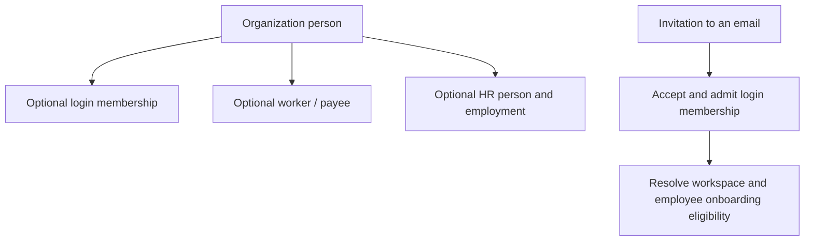

# StreamlineOS — remaining work

Updated 2026-09-13. **The only execution checklist.** Follow the priority and dependency order below; complete prerequisites first and revisit waiting acceptance. One Claude session can perform every role sequentially. Original module PRDs have been consolidated here and removed as superseded, not falsely marked complete. Existing evidence is reference only. Do not create another PRD, history, session report or PDF task list.

## Product and budget guardrails

Your immediate outcome is a reliable paid customer journey, not another whole-system refactor. Finish privacy/payment/access correctness before optimizations; optimize only demonstrated costs. Reuse the current architecture and tests. One bounded repair per work unit; after two unsuccessful hypotheses, identify the missing diagnostic discriminator and continue independent work instead of burning credits on repeated broad rewrites.

For launch, separate **technical readiness** from **commercial validation**: an all-in-one suite does not itself prove customers will pay or stay. Keep the existing supported scope; adding every proposed business feature is not part of this recovery. A broad Build redesign needs your buyer/workflow decision later and must not block stabilization. The engineering team can prepare a narrow, monitored pilot from working flows; release approval and actual customer willingness to pay must be real.

## Start and resume

1. Read root and affected backend/frontend CLAUDE.md and architecture-refactor/AGENTS.md. Inspect current source and working changes; the findings below are a dated baseline, not permission to redo a repaired defect.
2. Start with P10 privacy, AB-13 payment recovery and OS-R6 harness safety. For each task, trace the actual screen → hook → API/guard → service/transaction → event/cache → visible outcome; preserve one existing owner and contract.
3. Reproduce, make the smallest correct repair, verify the actual caller and required negative cases, then update that task here. A mock/helper pass alone cannot certify browser, committed DB or provider behavior. Do not stop after producing another plan.
4. When interrupted, leave a one-line checkpoint beside the current task: status, verified result, exact next action. Resume there; do not restart the audit. Mark [x] only when all its acceptance passes. Keep implemented-but-unverified tasks open.
5. Resolve technical questions using source and the standing answers below. Continue independent authorized tasks when one gate waits. Ask genuine human questions in ordinary chat, once, and record the answer here.

Scope: identity/signup verification, organization setup, invitations/people/employees, organization and module RBAC, billing, inbox/notifications, calendar, chat, shared data/cache/UI, existing Build screens, Documents and release reliability. CRM and Inventory are explicitly OUT OF SCOPE: ignore their PRDs, findings and implementation tasks. Broad product redesign is also deferred; none is a hidden completion requirement.

## Execution order and sessions

| Order | Session | Sections owned |
| --- | --- | --- |
| Always | S0 coordinator (one agent may fill every role sequentially) | Shared reservations, environment/build schedule, integration and release verdict |
| Wave 1 | S1 foundation/people | Identity/setup remaining acceptance, P10 privacy, P12 recipient outcomes and C1–C8 |
| Wave 1 | S2 billing/RBAC | AB-13 payment recovery, AB-08 session projection, failing resolver/migration gates, access and payment acceptance |
| Wave 2 | S3 communications | IN/CA/CH/CHAT residuals; shared UI fixes coordinated with S4 |
| Wave 2 | S4 frontend/Build | FD1/3/4/5/6/7/9, BUILD-002/003, ARCH-002/003 |
| Wave 3 | S5 Documents/operations | DOC-002/004, OPS-001–004, authorized external proof |

Use at most two implementation workers beside S0. One agent can execute sequentially.
S0 owns shared auth/guards, QueryProvider/query-scope/server-query-client, navigation,
next.config/tsconfigs, generated contracts/manifests and migration journals until
a named editor is reserved. Reserve .next AND the synthetic database/tenant/session
fixtures before captures. Never purge or migrate a shared fixture during another run.
S0 may prepare safe environment checks early by freeing a worker slot.

Start with **P10**, **AB-13** and the **OS-R6 harness safety repair**; then complete
independent repairs and acceptance. Previous catalog, setMonth, cursor, snooze,
calendar-cap and quota-wiring findings now have repairs: do not redo them blindly.

## External inputs an agent cannot manufacture

Local repairs are actionable. For actual sandbox/deployment/drill gates S0 must
identify the authorized environment, synthetic resources and action scope; credentials
belong in the secret store, never chat/Markdown. Actual Finance/security/privacy/release
decisions require named accountable people. Missing tax/refund/retention/RTO/RPO policy
requires the responsible owner only if no existing contract answers it.
Keep these precise gates open until supplied; do not waive them or invent signoff.
Broad Build redesign is deferred; it does not block repairing existing screens.

### Previously approved decisions — reuse, do not ask again

For an affected decision, read [the existing owner-input register](../decisions/CODE-RELEASE-HUMAN-INPUTS.md). It records H01–H17 approved on September 4 for code release; D01–D08 were deferred for deployment, not waived. Root/current user instructions take precedence; a recorded code-level disposition is not production approval.

Approved directions: durable idempotency for access and workflow commands (H01/H09); cross-module organization webhooks (H02); versioned public KB cursor compatibility (H03); history-preserving FK policies (H04); source-proven removal of unused HR/autonomy surfaces while retaining compliance records (H05); canonical Accounting GL wiring (H06); stronger payroll correction permissions (H07); private-by-default Build visibility as **scheduled, not shipped** work (H08); remove unimplemented workflow templates/unused secrets surfaces (H10/H11); stable INVOICE_IMMUTABLE 409 (H12); post-commit durable KB ingestion (H13); exact totals only for justified consumers (H14); benchmark pooler-specific prepare behavior (H15); split local calendar series for “this and following” (H16); local-first provider reconciliation with visible retry/conflict state (H17). Verify current implementation before reopening any of these. H08 must have an explicit release-scope disposition, never a false completion claim.

### Standing answers to recurring blockers

These are conservative implementation directions within the existing product;
they preserve contracts rather than silently deciding a new commercial policy.

| Blocker/question | Answer and next action | Owner |
| --- | --- | --- |
| Failing tests, casts, duplicate code, API/schema mismatch | This is executable work, not a question for the user. Reproduce against the actual caller, repair the smallest responsible boundary, verify; remove only proven dead code. | Assigned domain session |
| Who owns shared files or a cross-lane decision? | S0 assigns one editor and records the reservation here before edits. Other sessions send a bounded proposal and continue nonoverlapping work. | S0 |
| Setup waits for invitations/templates/welcome work | Readiness means the authorized member can actually use the intended organization. Keep required membership/access/entitlement invariants; optional enrichment must not delay entry. Preserve durable retry and truthful partial status. Projection failure is not success; hidden/wrong-cell membership is not an orphan. | S1 with S2 |
| What setup latency should we target? | Use p95 ≤10 seconds to first usable organization as the working engineering target, not a customer SLA or claimed measurement. Measure no-invite and representative-batch cases separately; record hardware/load/sample size. S0 may refine methodology, not quietly waive a failed target. | S1/S4 |
| May archived worker numbers be reused? | Preserve the existing unconditional reservation for this stabilization release. Reject reuse with clear copy; use the existing record's supported restoration flow. Do not contract uniqueness merely to satisfy an active-only index name. Archive/recreate/restore tests and schema reconciliation remain required. Reuse is a later explicit product change. | S1, P9 |
| Which salary currency? | Existing authority is organizations.currency through resolveOrgSalaryCurrency and assertSalaryCurrency. Preserve single/bulk/recruitment writers and reject unsupported values without partial writes. Never silently substitute INR or introduce multi-currency payroll. This precedence is already decided. | S1, P13 |
| Do entity chat channels bypass quota? | Reuse the authoritative existing channel resource/counting contract and atomic admission path; apply it consistently to explicit entity-channel creation. Do not invent a free exemption or charge existing-channel reads. If the product genuinely distinguishes channel classes, S2 supplies that existing rule. | S3 with S2, CH6 |
| Cache everything / where should reads live? | Preserve the existing scoped Query/service owners. Lightweight shared identity/access/badges belong in the shell; filtered lists/ranges and drafts do not. Add caching only after measuring and writing invalidation/failure rules. Build-only cross-tab sync is not app-wide sync. | S4 and domain owners |
| What revocation window is acceptable? | The recorded 30-second recovery window is a behavior to verify, not permission to weaken authorization or an accepted release risk. Preserve existing stricter guarantees; test direct HTTP/writes/streams and cache-hit/miss separately. Any remaining exposure requires an explicit security release decision. | S2; S0 records unresolved risk |
| Can calendar caps be raised to close the task? | No: preserve bounded work and correct cancelled/moved occurrences. Implement complete bounded continuation or explicit incompleteness/recovery semantics; verify legal dense windows. Keep schema drift owned even when generation is blocked. | S3 |
| Delete old inbox endpoints? | Keep authenticated legacy endpoints for this release unless consumer/compatibility evidence proves safe removal. Remove proven-dead internal keys only. Endpoint retirement is not a prerequisite for inbox correctness. | S3 |
| Missing browser / stale build evidence | Use the existing Windows Chrome launcher and capture harness. First inspect safe launch configuration and identify the test API; reserve a build. Old missing-browser reports do not establish a current blocker. Refresh artifact provenance before interpreting budgets. | S4; S0 schedules |
| Missing DB / representative fixtures | First inspect the existing disposable-stack setup without loading production defaults. Verify target identity, nonproduction credentials, tenant role, migration state and synthetic fixtures. Never infer current availability from old localstack evidence. If unavailable, report the exact resource missing; continue isolated source/mocked work. | S0 prepares; domain/S5 executes authorized checks |
| Customer tax exemption / late captured payment policy | Trace existing policy and consumers first. A customer flag is not automatically verified exemption. Do not invent tax rules, auto-refunds, discounts or expiry policy. Preserve the payment and reconciliation history; isolate unresolved cases for operator review using existing machinery. Ask Finance/product only for the missing rule; other billing repairs continue. | S2; accountable human for a genuinely missing policy |
| Remove Build screens / redesign entire product? | Finish existing correctness/accessibility/performance acceptance first; retain live screens. Broader deletion/repositioning waits for the user's buyer/workflow choice and is not a blocker for repairs. | S4; user for new product scope |
| Real provider drills, deployment, Finance/security/privacy signoff | Agents prepare and validate safe test procedures; actual calls require identified authorized test targets. A human approval cannot be fabricated by an agent. Keep only these gates waiting, not the entire lane. | S5, domain owner, accountable approver |

### Blocker handling at every handoff

Classify each remaining item as ACTIONABLE, WAITING-DEPENDENCY, EXTERNAL-INPUT or
VERIFICATION-PENDING. A missing test is work, not automatically an external blocker.
Historical `BLOCKED` text below is evidence; current status belongs in the owning
section next to its task. A request for a source trace must never become a user question.

For a genuine blocker record once, beside that task in this plan: task ID; exact observed failure;
what was safely tried; the smallest missing input; who supplies it; next executable
step after it arrives; independent work being continued. Send S0 that bounded record.
S0 resolves technical/dependency questions, batches only genuine human questions in
ordinary chat, and records answers here so later sessions reuse them. Do not repeat
an answered question or require a special follow-up-question UI. Recheck a blocker
when its dependency/input changes, not by repeatedly rerunning an unchanged failure.

Only the affected acceptance item waits. If all remaining authorized work truly
depends on external input, hand off honestly; do not poll indefinitely, assume
credentials/approval, silently waive the requirement, or report the product complete.

## Mandatory full-stack completion contract

Every task includes its architecture, code, schema, API, cache, UI/UX, security and tests—not separate competing rewrites. Inventory every in-scope route/action/async consumer/model/cache before changing it. Classify KEEP / REPAIR / CONSOLIDATE / REMOVE / DEFER with evidence; an uninspected entry point remains a coverage gap.

| Gate | Required evidence before the flow is complete |
| --- | --- |
| 1. Product flow | Every supported entry, happy path, retry, cancellation, resume and lifecycle transition has expected behavior and a verified result |
| 2. Architecture | One responsible owner per invariant; caller/transaction/event boundaries mapped; shared changes integrated without duplicate engines or speculative layers |
| 3. Code and types | Behavior repairs reproduce the defect before/after where feasible; otherwise record the missing discriminator and keep behavior proof open. Nonbehavioral changes use applicable structural/contract checks. Affected types, lint and dependency checks pass without new suppressions |
| 4. Schema and data | Tenant/uniqueness/FK/lifecycle invariants tested; changed migration replay and recovery demonstrated on disposable DB; existing data preserved |
| 5. APIs | Request/response/envelope/pagination/error contracts match consumers; direct HTTP negatives, idempotency, concurrency and compatibility checked |
| 6. Security and RBAC | Org + module + action + record + entitlement boundaries tested; cross-tenant, suspended, revoked and nonhuman principals covered where supported |
| 7. Cache and performance | Complete writer/key/TTL/invalidation matrix; cold/warm and failed-cache tests; measured request/SQL/latency/bundle budgets under documented load |
| 8. UI/UX and accessibility | Actual screenshots and browser interaction for loading/empty/error/denied/pending/success; keyboard, mobile, zoom, readable consistent tokens and recovery |
| 9. Cleanup and maintenance | Each removed symbol/file has caller/registration/migration proof; relevant build passes; obsolete tasks consolidated while durable evidence remains |
| 10. Operations and release | Same-revision combined journey, real provider sandbox where relevant, monitoring, worker/retry recovery, deployment smoke checks and rollback owner |

Use PASS / FAIL / WAITING / NOT-APPLICABLE per applicable gate, with a reason for exclusions. Record exact revision/artifact, environment, command/exit, expected/actual outcome and evidence location beside the task. Missing evidence is not PASS. Run independent behavior/security and integration/cache/UX reviews after implementation; prior document reviews do not count. A security, billing or privacy failure cannot be averaged away.

## Baseline and evidence limits

The September 13 reconciliation used root 56922f81e / backend 3cf2350fd plus working changes: 474 focused backend tests passed and 3 failed (one migration-integrity, two payment-resolver assertions). Chat/calendar/inbox harness self-tests passed 139/72/100; these were not browser runs. Frontend query-scope/request-params/growth/size gates passed; dead-code and stale bundle provenance failed. Backend spec compilation exhausted its 8-GB heap: inconclusive, not passing. No live DB/provider/browser or full build ran in that reconciliation. Recheck changed paths at the current revision.

Preserve repaired identity claim/session fences, truthful setup readiness/savepoints, invitation deduplication/owner skip, employee eligibility/currency, billing capture validation/clamped terms/intent-first ordering, RBAC keyset drains, communication cursors/snooze/versioned edits/quota locks, Query scope/hydration and strict-build gates. Reopen implementation only with a current regression. Historical results below guide targeted retesting, not release certification.

# S1 — Identity and organization setup

Owner: S1
Maps to: PRD-C004, PRD-C111, PRD-C112

Owner S1; S0 reserves shared auth/cache/query/schema files. Identity mint cache remains user+device+org, bounded by token expiry and size; backend revocation is authoritative. Setup readiness requires active owner, target organization, stamp, latest allowed subscription (TRIAL/ACTIVE/PAST_DUE) and enabled catalog-active module. Optional enrichment uses durable retries/savepoints and cannot delay first usable entry or erase successful recipients. Wrong-cell/unverifiable membership is not an orphan.

## Authoritative remaining work

- [ ] **ID-R3a — Actual browser two-device logout and late-refresh acceptance.**
  Use two real registered device sessions and two isolated browser profiles on a named disposable
  stack. Sign device A out through the application control, which calls
  `frontend/hooks/common/auth-hooks.ts::useSignOut` → backend `POST /auth/logout` →
  NextAuth signOut event. Assert A's captured backend JWT is refused, A's local auth/query/gate
  data is cleared, all A-org mint-cache entries are evicted, and B remains usable.
  The historical direct `/api/auth/signout` curl alone only exercises web eviction and is
  **not** backend revocation. Exercise unavailable-backend logout separately: local signout
  completes, warning truthful, remote revocation not falsely claimed. Recheck actual production
  callbacks, not only a helper. Keep no-org/suspended/owner/employee/MFA/platform-admin gate
  outcomes. Race slow old-org refresh versus a newer switch and confirm no stale route/data
  becomes visible: caller generation fences do not themselves cancel NextAuth update work.
  If browser fixture minting is needed, expose known session id in existing
  `frontend/scripts/mint-session-cookie.mjs` (mint accepts it; current CLI does not); never
  print cookies/JWTs or invent unregistered session ids as successful identity fixtures.

- [ ] **ID-R5a — Remaining integration, not repeat implementation.**
  S2 must close the billing `CACHE_KEYS.userSession` writer gap: September 13 source search
  still finds no direct session invalidator in billing; trace canonical indirect writer seams
  before editing, then prove current session plan after committed activation/change and unchanged
  state on rollback/cache outage. one owner under AB-08 below; this is its dependency,
  not a duplicate implementation task.
  S0 regenerates/reviews OpenAPI with legacy `POST /auth/register` absent, runs contract-vendor
  and changed frontend/backend production builds, relevant test/app types, cycle/quality gates,
  and final integration at one frozen revision pair through REL-001 below.
  Reconcile the old register spec if it still asserts a removed route; preserve legitimate
  provisioning coverage rather than restore an intentionally retired endpoint.
  Existing identity harness frontend/scripts/verify-identity-journey.mjs has no package script: use its explicit path; add a script only
  if shared tooling owner accepts it. Source `passwordless-signin-form.tsx` email `h-8`
  versus h-9 canonical control needs S4 visual/size-rule reconciliation, not an unrelated rewrite.

- [ ] **OS-R5 — Production-browser setup failure-state acceptance.**
  Run existing `backend/src/scripts/capture-org-setup-failure-states.mjs` only after verifying
  its current arguments, real cookie name and disposable stack. Self-test first; capture production
  frontend (not dev) at narrow/desktop widths and 200% zoom with keyboard focus/retry.
  Exercise PARTIAL, DEAD, INVALID, SUPPRESSED, RETRYING, 401/403, malformed status and network
  failure; no infinite spinner or resubmitted setup on status recheck. Existing harness substitutes
  eight status scenarios; add the missing scenario/control coverage if it cannot cover this matrix.
  Include pending deadline/retry, unmount, org switch, complete/skip replay, double submit,
  indeterminate sign-in, withheld token, failed/mismatched session refresh and successful dashboard
  transition without returning to Welcome after provider remount. Verify structured correlation
  IDs, no raw operator diagnostics, intact draft until truthful success and warning with usable org
  after optional failure. Coordinate recipient-result UX with people P12. Retain actual API/DB
  race proof for concurrent complete/skip; mocked conditional-update tests alone do not close it.

- [ ] **OS-R6 — Repair measurement harness before running; then measure customer latency.**
  Source `backend/src/scripts/measure-org-setup-journey.ts` currently authenticates direct backend
  complete/status/usable requests with Cookie, but `backend/src/common/auth/jwt-auth.guard.ts`
  requires `Authorization: Bearer`. Adapt existing harness to real authenticated API entry flow,
  proving fixture identity/organization and failure refusal. Current guard validates only
  APP_DATABASE_URL; SETUP_API_BASE_URL is separately unvalidated. Bind **both** API and database
  to the named disposable stack; reject remote/mismatched API before any request, require explicit
  approved override where relevant, and add refusal self-tests for local DB + remote/wrong API.
  This harness **creates organizations by POST**; “does not write any row” was incorrect.
  Provision distinct throwaway verified users, contain every email/provider transport and worker
  dependency, establish cleanup/retention before mutation, and assert cleanup. Never load production
  .env underneath overrides; empty both ZeptoMail and fallback Resend credentials in a deliberately
  no-send stack. Cookie/JWT fixture files stay outside the repo and are never logged.
  Then measure no-invitee and representative 10-invitee scenarios with at least 10 fresh users each.
  Record dataset/environment, sample count, completeMs, durable commitToClaimMs, consumerMs,
  readyMs, usableColdMs/usableWarmMs and pg_stat_statements deltas; separate cold/warm and unfinished
  samples. Target p95 readyMs ≤10s (engineering target, not SLA); report MET/BREACHED/INCONCLUSIVE.
  Verify >100-membership selection and wrong-cell/lookup-outage behavior on representative fixtures;
  OS-R1's seam mocks and exact-100 sample do not certify these runtime boundaries.
  Retain failed/timeout samples, explain attribution, fix demonstrated bottleneck and rerun it.

# S1 — People, invitations and employee admission

Owner: S1
Maps to: PRD-C004, PRD-C118, PRD-C119

Owner S1; S2 owns quota/RBAC definitions; S0 reserves shared models/contracts/migrations.

## Product and identity contract



A person, login, worker and employment are distinct. Adding a person must not silently create login access, paid seats, employment or payroll participation. An invited teammate need not be an employee. One account may belong to several organizations; another organization must not rewrite its global identity or reactivate its global suspension. Owners/platform admins do not enter the employee wizard. Build-only members retain universal communication/self-service without becoming HR administrators.

| Customer operation | Current caller → endpoint → owner | Data boundary |
|---|---|---|
| Invite one/bulk | `frontend/features/directory/users/user-invite-dialog.tsx`, `user-bulk-invite-dialog.tsx` → `frontend/hooks/api/users/invitations.ts` → `POST /users/invite`, `/users/bulk-invite` → `backend/src/modules/users/users.controller.ts` → `InvitationCreateService` | Invitations, events, admission screening, seat ledger |
| Manage invitations | `user-invitations-panel.tsx` → same hooks → `GET /users/invitations`, resend/role/delete subroutes → `InvitationsReadService`, `InvitationLifecycleService` | Tenant invitation + current actor standing |
| Accept/decline | `frontend/app/(auth)/invitation/[token]/page.tsx` → organization public invitation routes → `InvitationAcceptanceService` | Hashed token, account, membership, magic link, organization index |
| Direct login admission | `frontend/hooks/api/users/account-mutations.ts` → `POST /users` → `UsersService.createUser` → `MembershipAdmissionService.admitOne` | `sendInvite=true` branches to invitation; direct path creates membership and placement |
| Person without login | `frontend/features/directory/people/*`, `frontend/hooks/api/directory/*` → `/directory/people` → `DirectoryController` / `DirectoryService` / `DirectoryIdentityService` | `organization_people`; membership linking is tenant checked |
| Worker/engagement | `frontend/features/directory/workers/*`, `frontend/hooks/api/directory/workers.ts` → `/directory/workers` and engagement routes → `WorkerEngagementsService` | `workers`, `worker_engagements`, person and actor FKs |
| Employee admission/import | `POST /hr/employees/onboard`, `/onboard/bulk` → `EmployeesController` → `EmployeeOnboardingService`, `EmployeeBulkOnboardingService` | Membership admission, HR employment, canonical person, placement, sensitive salary/bank data |
| Employee self setup | `frontend/features/employee-onboarding/hooks/use-onboarding-wizard.ts` → `frontend/lib/api/hooks/onboarding.ts`, `frontend/hooks/api/onboarding-flow.ts` → `/onboarding/*` → `OnboardingController`, details/session/submission services | Current actor and membership; personal/bank data and durable completion |
| Teammates during org setup | `frontend/features/org-setup/components/step-invite-launch.tsx`, `lib/setup-payload.ts` → provisioning lane → bulk invitation delivery | Teammate invitations, not employee/payroll creation |

- [ ] **P3 — Invitation and seat race acceptance.** Exercise concurrent last-seat invite/resend/accept/revoke/decline/expiry and pending-invite → direct-admission conversion against the real transaction boundary. Assert one seat/reservation, stale-token denial, rollback and post-commit delivery. Preserve decline's INVITE_CANCELLED / invite-declined idempotency semantics. This is the race task delegated by billing, not a second seat implementation.

- [ ] **P10 — Fail-closed draft privacy at depth boundary.** New current-source defect:
  `backend/src/modules/hr/onboarding/flow/onboarding-session-privacy.ts::stripValue`
  returns the original value when depth >8. The patch DTO in
  `flow/dto/onboarding-flow.schemas.ts` accepts arbitrary nested `z.any()` values.
  A ten-level child object containing synthetic accountNumber survives serialization after
  `stripOnboardingDraftSecrets`; shallow accountNumber is stripped. Reproduced offline
  September 13 using the real transpiled helper: shallowStripped=true, deepSecretRetained=true.
  Existing privacy suite passes, so it does not cover the exploit.
  Reuse the canonical draft DTO/sanitizer; reject over-depth input or drop over-depth subtrees
  without returning raw sensitive data, with an explicitly bounded traversal. Cover depth 8/9/10,
  nested arrays, mixed-case keys, legacy poisoned reads, merged update and skip. Verify real service
  read/write paths never return/persist nested account/PAN values; keep permitted bank display fields.
  Add red/green regression before repair; no live financial details in tests or reports.

- [ ] **P12 — Customer-safe setup recipient outcomes.** Core bulk/savepoint repairs are complete;
  `OrgSetupQueryService.getSetupStatus` still emits generic SETUP_BACKGROUND_PARTIAL rather than
  identifying failed invitees. Complete the prior acceptance using a typed, tenant/owner-authorized
  per-recipient outcome projection and existing wizard/invitation UI. Reuse durable invitation/event
  state; never expose raw lastError or another tenant's addresses. Show successful/queued/failed/skipped
  distinctly, retry only eligible failed recipients, and prevent duplicate reservations/deliveries.
  Prove owner-address skip and later-role continuation stay intact. Reserve setup DTO/query/UI with
  foundation owner; this is one shared task, not two separate implementations.

- [ ] **C1 — Request, SQL and cache capture.** One run closes both old cold/warm and mutation
  checkboxes; command and exact criteria follow.
- [ ] **C2/C3 — Browser identity transition and employee attach.** HTTP identity rows below already
  have 49/49 proof; do not redo them merely because a stale queue said not attempted. Browser signed-in
  wrong-account advisory, actual invited-account session transition and employee attach remain.
- [ ] **C4/C5/C6 — Live privacy, worker number and salary transaction acceptance.** Run after P10
  repair; assert both response and durable DB state with rollback/cleanup.
- [ ] **C7 — Responsive, keyboard and zoom UI acceptance.** Existing component suites are not layout proof.
- [ ] **C8 — Final schema/environment and release integration.** Run named disposable drift/ledger
  checks and coordinate migrations with S2/S5. Portal invitation acceptance is a distinct external
  surface: S0 must assign its security compatibility check to the existing portal/release owner;
  do not silently treat public employee invitation coverage as portal coverage.

## Acceptance recipes


Use only explicitly named disposable app/database/transport configuration, validated before any mutation.
Existing probes do perform real invitations/setup/employee writes; review current targets/auth and establish
cleanup first. Keep provider credentials absent unless the user authorizes a named sandbox action.

### C1 - Request and SQL capture (closes both cache checkboxes)

```text
backend$ PEOPLE_CAPTURE_API_URL=http://127.0.0.1:1500 \
         PEOPLE_CAPTURE_TOKEN=<backend JWT for an actor holding settings:organization:manage and hr:onboarding:manage> \
         PEOPLE_CAPTURE_ORG_ID=<scratch org> \
         PEOPLE_CAPTURE_SECOND_ORG_ID=<a second org the same actor belongs to> \
         PEOPLE_CAPTURE_DATABASE_URL=postgresql://...@127.0.0.1:5432/scratch_local \
         node src/scripts/people-request-capture.mjs
```

Pass criteria: exit 0; every leg matches its documented status (the duplicate-invite leg must be
409); warm SQL delta <= cold SQL delta for each of the three cached reads; the read after the
organization switch must not return the first organization's rows; the read after the failed
mutation must match the read before it; no unmasked address, token or personal name in the report.
`pg_stat_statements` must be enabled on the scratch database or the SQL deltas come back null.

C1 writer matrix must include users:stats, org:members:list, rbac:members, module-access:candidates, CACHE_KEYS.userSession, hrEmployeesListNamespace, HR analytics/celebration/dashboard caches, invitation Query keys and invalidatePersonAccountAccess. Verify applicable invitation/admission/role/lifecycle writers after durable commit, failed mutation, org switch/logout and sensitive-draft cache isolation.

### C2 - Live invite -> accept -> employee journey (P10/P11 and Release proof)

Against the same scratch tenant, in a browser:

1. Invite a new address, accept it as a brand-new account, confirm the workspace resolves.
2. Accept a second organization's invitation with the same account; confirm the global name and
   email are unchanged and only the active organization moved.
3. Open an invitation while signed in as a different account; confirm the amber advisory appears
   and that acceptance binds the invited address.
4. Open an expired token and a revoked token; confirm both render "Invitation unavailable".
5. Suspend the account globally and re-open the invitation; confirm 403 and no membership row.
6. Recorded HTTP concurrency already proves one success, coherent 404/409 loser, one account/member/seat conversion. Re-run only if relevant source changes or final revision-bound integration requires it; do not demand a single retry-message shape the real endpoint does not promise.

### C3 - Employee admission and attach (P4)

1. Invite a teammate, accept, then onboard the same address as an employee: the wizard must show
   the attach notice, submit must succeed, and the database must show one membership, one
   `organization_people` row, one `hr_people` row, one primary `hr_employments` row and **no new
   seat-ledger INVITE_ACCEPTED event**.
2. Repeat the onboard: it must be refused with the already-an-employee conflict.
3. Suspend that member and onboard again: it must be refused with the restore message.

C3 also requires explicit attachToExistingMember confirmation and reuse of PersonEmploymentSyncService.ensureFromUser. Verify missing confirmation, existing employment and suspended/left membership. Attachment must not create another seat/membership/login token or rewrite global identity.

### C4 - Bank step and draft privacy (P10)

1. Sign in as a member with no employment row and complete the bank step: expect 409 with the
   eligibility message, and `onboarding_steps` must have no `Bank Details` COMPLETED row.
2. Use synthetic account/IFSC/PAN fixtures, reload, and assert their absence directly against the disposable session row without printing its JSON. Repeat over-depth and legacy-poisoned data after P10; country, holder and bank name survive. Clean all fixtures.

### C5 - Worker number reservation (P9)

1. Create a worker with number `W-0007`, archive it, then create another worker with `W-0007`:
   expect 409 `WORKER_NUMBER_RESERVED` and the message naming the number.
2. Confirm the `workerNumber` field, not only the toast, shows that message.
3. Confirm a distinct number still succeeds.

### C6 - Salary currency (P13)

1. Set the scratch organization currency to `AED`, onboard an employee with a monthly salary, and
   confirm `hr_employee_sensitive_fields.salary_currency` and `employee_salary_profiles.currency`
   are both `AED`.
2. Set the column to an empty string directly and retry: expect 400 with the unsupported-currency
   message and **no** partially written employee.

### C7 - Browser UI capture (gate 8)

Screenshots at 375 / 768 / 1280 of: the invitations panel in each of its five states, the bulk
invite dialog showing a partial failure with per-recipient reasons, and the employee wizard email
field in each of the four admission outcomes. Keyboard-only traversal of both dialogs and a 200%
zoom pass.

### C8 - Gates that need their own database variables

`backend$ pnpm check:migration-ledger` and `backend$ pnpm check:declaration-constraint-drift` were
not run here. The P9 decision depends on `uniq_workers_active_org_number` still existing in the
database exactly as declared; the drift gate is the check that proves it.

C8 migration safeguards: preserve 1109 and preflight-hr-module-org-admin-revocation.mjs. Withdraw settings:organization:manage from HR_MODULE_ADMIN / HR_MODULE_OWNER **by slug**, not is_system or generic module scope. Preserve other roles' deliberate grants, version bumps, rollback/idempotency and real-environment preflight. Preserve 1091 constraints uniq_org_people_active_work_email_ci and uniq_hr_employments_org_engagement_link plus declared worker indexes; worker-number reservation remains unconditional.

# S2 — Billing

Owner: S2
Maps to: PRD-C125

Owner S2 for billing UI/hooks and backend modules/billing/**, also RBAC below. Read existing ADRs 0004–0006 when changing merchant, access or payment policy. An active organization owner/admin purchases through StreamlineOS platform merchant configuration; tenant customer collection is separate and the buyer needs no merchant credentials. Module owner/admin/member alone is not billing authority. The PayPal mention was a typo.

## Executable checklist

- [ ] **AB-08 — Backend session plan projection.** Trace all direct/indirect writers of CACHE_KEYS.userSession before changing code. Activation, renewal, downgrade and authoritative subscription changes must invalidate the backend session projection after durable commit; frontend Query refresh is a separate cache. Prove fresh session plan after success, unchanged state after rollback, cache outage and racing refresh. This is S2’s single owner task for foundation ID-R5a.

- [ ] **AB-13 — Recover provider-success / local-attachment failure and ambiguous outcomes.** First reproduce with isolated provider/DB seams. Source: backend/src/modules/billing/core/billing-payment-activation.ts: intent create precedes provider.createOrder, but attachProviderOrder failure only releases the coupon and throws. subscription-purchase.service.ts only resolves callbacks by provider order; billing-webhook.handler.ts ignores notes.purchaseId, and billing-webhook-effects.ts activates only a found purchase. A captured unknown-order event can therefore be persisted and acknowledged without a term. Normal checkout does not receive an order when attachment fails; do not claim that ordinary failed-response UI necessarily charges a customer.
  - Reuse durable purchases/provider-event/effect ledgers to reconcile a provider-created order to its intent with tenant, merchant, environment, receipt, amount/currency and immutable plan validation. Never trust provider notes alone to grant a plan.
  - Cover successful provider call then attachment failure/crash; webhook before attachment; retry and duplicate/reordered events; ambiguous timeout where provider may have created the order; coupon reservation release versus still-payable order; expired/failed intent and cross-tenant substitution. Retire an intent only when safe; retryable ambiguity must stay discoverable.
  - Completion: real handler/service fault-injection proves recoverable state, no acknowledgement-as-fulfilled of an unprovisioned subscription, exactly one term/credit grant and correct coupon accounting. Prove the corresponding DB constraints/claim race on a named disposable DB before release. Existing six ordering tests prove sequence/refusal only.
- [ ] **AB-08 residual performance acceptance.** Preserve the quiet-host baseline; attribute remaining count-query costs on representative tenant sizes and app-role RLS plans, with an explicit SQL/request budget. The historical six seq-scans and 2,270 buffers do not alone prove missing indexes or bloat. Measure and route justified changes to the relevant module owner; do not blindly add indexes or cache quota admission. Recheck callback-lost reconciliation and organization switch after AB-13.
- [ ] **Combined acceptance residual.** Capture a real sandbox payment and exact monthly/annual activation, reload/browser-close recovery, webhook-before-callback and duplicate settlement using approved test principals. Retain previous 401/403/404/402, promotion positive-control, three-width and rapid-click proof; rerun changed paths at the integrated pair. Complete visible keyboard focus, focus restoration, 200% zoom, loading/error/denied states and authenticated valid-query calendar reachability (the prior calendar 400 only proved parameter validation was reachable). Share access-surface evidence with RBAC-006.
- [ ] **Deployment and schema handoff.** Coordinate backend-before-frontend deployment/read-contract compatibility for required annualTotalPaise/platformCheckout, route smoke requests including billing/ai-credits and roles/simulate, clean build provenance, rollback ordering, and cold-chain app-role table/sequence grants. The historical 21 unprivileged tables require an owner-specific privilege sweep, not a blanket grant on sensitive tables. RBAC-001 owns migration-chain/gate repair; REL-001 owns final revision binding and source/test types.

## BILL-001 — Prove deployed payment failure and recovery paths

Status: BLOCKED-EXTERNAL only for provider/deployed evidence; local AB-13 is actionable now.
Maps to PRD-C162. Owner: payments operator. Depends on AB-13 and coordinated integrated schema/API/web artifacts.

- [ ] Use a named disposable/test environment to prove provider failure, webhook retries, reconciliation, full activation/effect concurrency and no duplicate charge/term. Verify app-role privileges and purchase constraints from the journal. Preserve recorded sandbox order creation and 401/400 mapping; neither proves payment capture or provider 5xx recovery.
- [ ] If provider-side 5xx cannot be induced, record an approved fault-injection method and explicit live limitation. Use a visible browser/test-provider flow for the blank headless checkout iframe; mounting the frame is not completed checkout.
- [ ] Completion: timestamped provider/application/ledger evidence and a reconciled outcome for every failed/retried purchase, at the actual deployed test artifacts. Never charge real customers or load production credentials for this check.

## BILL-002 — Record Finance release approval

Status: BLOCKED-EXTERNAL. Maps to PRD-C182, PRD-C193. Owner: named Finance approver. Depends on BILL-001.
- [ ] Record accountable decision, timestamp, scope and residual risks in release authority evidence. A test run or an agent's approval does not replace the human decision.

## Cache and authority invariants

Tier uses billing:tier:${orgId} (30 seconds); entitlements uses billing:entitlements:${orgId} (60 seconds). Expiry/fill races and all subscription writers must invalidate correctly. Admission, activation and replay are transaction-owned, never cached authorization. Billing Query keys stay actor/org-scoped; checkout and reconciliation refresh subscription, summary, seats, entitlements and access through the canonical invalidator.

Active organization owner/admin may purchase; module owner/admin/member alone may not. Platform promotions use platform-operator authority, not customer billing permissions. Org role, module standing, per-person grants, module availability and record scope remain distinct. Public pricing and authenticated plans have different audiences; retain their consistency checks instead of deleting one.

Historical billing baseline (not current capacity/SLA): September 12 local PG18.6 scratch_local, two orgs/501 members; warm p95 billing 60.93 ms, entitlements 30.39 ms, plans 34.53 ms, access 18.29 ms. Access 8×30 requests: 64.5 req/s, p99 276.43 ms. Count query: 2,270 buffers/~1.5–2 ms on 29 tenant rows. Remeasure changed paths. Preserve reconciliation meaning: couponRedemptions.amountPaise changed historically from discount to charged amount; discount is stored on the purchase.

# S2 — RBAC and tenant integrity

Owner: S2
Maps to: PRD-C003, PRD-C004, PRD-C081, PRD-C082, PRD-C113, PRD-C114

Owner S2; reserve shared auth/access/schema/journal changes with S0. Source anchors: backend/src/modules/access/{authorize,access-permission.resolver,access-permission-members.resolver,access-explain.resolver}.ts, backend/src/common/rbac/resolve-actor-rank.ts, modules/module-access/** and frontend/lib/rbac/**. Resolve shorthand to actual paths before running commands.

| Authority layer | Contract |
| --- | --- |
| Live org membership | INVITED/ACTIVE/SUSPENDED/LEFT; only eligible active principals |
| Organization standing | Owner/admin/member; structural administration is not a module role |
| Module standing | Owner/admin/member and held action grants |
| Availability | Paid module access separate from universal Home/mail/chat/calendar |
| Record scope | Tenant plus own/team/org scope and participant/audience ACL |
| Cache | Versioned authority; local version TTL 1 second, shared version TTL up to 30 seconds on failed shared clear |

Allow-wins union means none is not a deny override. Per-person grants survive role changes. Team currently behaves as Own and must say so. Platform operator is not a seventh customer standing. Current drains repair previous recipient-list overflow; they do not change action-time scope.

### RBAC-006 — Complete access coverage and effective-access UX

Status: IMPLEMENTED—VERIFICATION-PENDING. Owner: access agent.
- [ ] Retain passing overflow/catalog/route/standing/universal/cache tests; verify changed paths at the integrated artifacts. Prior shared-store mocks prove a bounded stale window, not instant cross-node revocation.
- [ ] Finish effective-access browser acceptance: visible keyboard focus, focus restoration, 200% zoom and loading/error/denied states across 375/768/1280. Prior populated screenshots/overflow and focusable counts pass their narrower checks; class-name focus-ring check was explicitly inconclusive. Cover owner/admin/module/member, role/grant changes and organization switching, not only the owner page.
- [ ] Run a valid calendar query for an ordinary member with no paid modules plus private-record denial controls. Previous HTTP 400 for missing start is not a successful calendar journey. Share result with calendar/billing acceptance.
- [ ] Include last-structural-admin concurrent-demotion proof on a named disposable environment and real two-instance revocation evidence with the actual failure bound. RBAC-002 owns deployed evidence; this task closes when all local required acceptance is recorded, not when someone calls the rest “formal”.

## RBAC-001 — Run the final executable tenant-isolation sweep

Status: REPAIR-THEN-FINAL-INTEGRATION. Maps to PRD-C043, PRD-C044, PRD-C045, PRD-C046.
Owner: security release agent, with S0-reserved migration/gate changes. Depends on CHAT-002 and RBAC-004 for final aggregation; prerequisite repair can proceed now.

- [ ] Resolve the journal's authoritative-versus-repair ordering/shape defect safely. Current migration-integrity.spec.ts fails at line 351: 0464a_gl_kernel index 717 follows repair 0619 index 340. The repair's gl_currencies lacks the authoritative primary key/CHECKs. Preserve sealed hashes, current data and full cold-build semantics; blanket IF NOT EXISTS or dropping depended-on constraints is not a repair. Migration owner must prove cold replay/catalog parity including keys, checks and seeds; require legacy-upgrade proof only when the explicit migration-scope decision below requires it.
- [ ] Reconcile tenant-gate ledger validation against journal content, hashes and expected objects rather than row count alone. Current check-tenant-relationships.mjs still counts ledger rows; historical renumbering produced 867/870 despite reported matching contents. Include genuine missing/wrong/duplicate migration negative controls so a hash-based change cannot hide drift. Do not insert fictitious ledger rows.
- [ ] Verify safe diagnostic target selection: current check-tenant-relationships.mjs skips dotenv when an explicit target is already supplied, so the old unconditional-load finding is partially fixed. It still falls back to backend .env when no target resolves. Use an explicit named disposable target and prove missing-target/remote-target refusal without exposing credentials; require missing/unidentified targets to fail before loading production defaults; preserve the explicitly identified disposable path.
Reproduction entry points: backend/src/modules/billing/payments/payment-provider-resolver-tenant-isolation.spec.ts, backend/src/modules/billing/payments/payment-readiness-tenant-isolation.spec.ts and backend/src/modules/cron/cron-group-a-tenant-isolation.spec.ts. Inspect their isolation/config before using local Jest --runInBand --runTestsByPath; capture exit and failing assertions.

- [ ] Resolve current payment-resolver transaction-boundary failures and reverify the reported cron-group-a failures. Today's isolated resolver/readiness run: **1 suite failed / 1 passed; 2 tests failed / 2 passed, exit 1**. The two resolver controls expect runInNewTenantTransaction and receive zero calls; readiness passes. Prior narrative calls failures merge fallout; that is not a passing check or proof the ambient/RLS contract is unnecessary. Trace HTTP and background callers before changing expectations. Preserve meaningful tenant predicates and real app-role GUC assertions. The combined cron probe's result was not captured; cron remains unverified in this recheck.
- [ ] Inventory current app-role table/sequence privileges after cold replay and any explicitly supported upgrade. Billing history recorded 21 unprivileged tables; do not assume a later blanket grant fixed future objects. Keep sensitive/operator data restricted and assign each missing privilege to its owning lane.
- [ ] Execute permission/scope/record/navigation/route/index/migration/tenant checks, cross-tenant negatives and app-role RLS/FK probes at the final backend revision. Record commands, statuses, principals, objects and actual artifacts. Prior single-FK 23503 proof used a bypass-RLS owner and cannot stand in for RLS or a full sweep.

Migration invariants for RBAC-001/REL-001: preserve 1090 application-role table/sequence grants; 1110 nullable provider_order_id with retained uniqueness and pending-null index; 1085 saga org_id column/backfill/trigger/schema/writer convergence. A coupon with org_id NULL is a platform promotion: a blanket composite tenant FK would reject valid purchases. Keep only the named coupon-constraint exception and prove service-binding cross-tenant negatives.

Completion: every required gate passes at one coordinator-bound revision with zero actionable findings; inconclusive is not passing. Current independent check (2026-09-13, no DB/env): migration-integrity **37 passed, 1 failed, exit 1**. Existing per-constraint platform coupon exception is preserved; a blanket table allowlist would weaken unrelated relationships.

## RBAC-002 — Capture deployed revocation and isolation proof

Status: BLOCKED-EXTERNAL. Maps to PRD-C162, PRD-C185. Owner: security operator. Depends on RBAC-001.
- [ ] Exercise deployed role revocation, session invalidation, cross-tenant denial and audit visibility with named principals/tenants, expected negative controls and timestamps. Include two instances, failed shared clear and the actual maximum stale window; no assertion of instantaneous denial from TTL alone.
- [ ] Completion: accountable deployed evidence without secrets at the released artifacts, including the observed revocation bound. Missing deployment credentials blocks this evidence only; proceed with independent local tasks.

## RBAC-004 — Enforce Support automation ownership at every operation

Status: IMPLEMENTED—FINAL-INTEGRATION. Maps to PRD-C043, PRD-C044, PRD-C045, PRD-C046. Owner: chat/security repair agent.
- [ ] Reverify backend/src/modules/support/core/support-automations-ownership.spec.ts and its recorded automation regression set, plus frontend/features/support/settings/automations/support-automations-settings.test.tsx, after integrated changes. Record full source/test types and revision binding through REL-001; do not redo the landed implementation.
- Acceptance retained: same-org non-Support rules cannot be read/updated/deleted/tested via Support; ticket.* trigger ownership is immutable across module boundaries; manual Support actions validate/scoped-resolve their positive safe-integer ticket; legitimate Support and generic automation remain working. Prior **8 backend suites/115 tests** and **1 frontend suite/2 tests**, rerun backend as 71+44, are recorded proof not today's rerun.

# S3 — Inbox, notifications, calendar and chat

Owner: S3
Maps to: PRD-C008, PRD-C127, PRD-C128, PRD-C129, PRD-C130, PRD-C131, PRD-C132

S3 owns feature/services and acceptance; S0/S4 own shared shell/tokens, S2/schema migration grants, S5 authorized provider proof. Universal availability never grants another recipient's, mailbox's, private event's or channel's records. Preserve existing source adapters, authorization, Query factories, durable jobs and realtime seams.

Matrix entry points: frontend/scripts/calendar-acceptance.mjs (8 states × 4 viewports), chat-acceptance.mjs (11 × 4), inbox-acceptance.mjs (9 × 4), all in frontend/scripts. Inspect current arguments and run each --self-test before live capture. Validate actual API/fixture/build targets before invoking browser mode; its synthetic actions do not establish committed DB/provider effects.

## Remaining work

- [ ] **IN4/IN7 + CA6 + CH7 — Shared-shell acceptance dependencies.** S0/S4 implement;
  S3 supplies repros and reruns all affected cells. Current source confirms
  `frontend/components/workspace-onboarding/success-checklist.tsx` starts
  `collapsed=false`; its mobile portal obstructs page controls. Use a collapsed/mobile
  docking behavior preserving checklist access; prove actual pointer hit targets and
  keyboard reachability at 360/640/768/1280 and 200% zoom. Also reconcile
  `components/layout/mobile/chat-mobile-chrome-layout.ts` (`sm:hidden` bottom nav vs
  `md` sidebar) so chat navigation and composer insets cover 640–767 without overlap.
  Audit `components/layout/mobile/mobile-shell-fab.tsx`'s permanently mounted inert
  `aria-modal` dialog against the real accessibility tree and harness: correct hidden/open
  semantics rather than treating DOM presence alone as an open modal.
  Complete the recorded shared scroll-area keyboard access, onboarding text-opacity,
  sidebar contrast and Feedbucket ARIA checks; reuse S4 token work, not local color forks.
  Completion: corresponding failing/obstructed cells pass with screenshot and axe evidence,
  no focus trap or blocked page action, and shared ErrorState change receives owner review.

- [ ] **CA6 — Calendar grid accessibility and mobile fallback.** S3 with S0 dependency
  approval. `frontend/features/calendar/big-calendar-wrapper.tsx` still renders the vendor
  calendar; recorded react-big-calendar 1.19.4 all-day markup has orphan rowgroup/row roles.
  Choose the smallest supported vendor patch/upgrade or semantically sound wrapper repair;
  preserve day/week/month interaction and test actual accessibility tree. Do not mark the
  defect complete merely because the source is third-party. Investigate why useShellVariant
  did not select list mode at 360 in the recorded capture; prove breakpoint behavior after
  clearing the overlay. Completion: all 32 matrix cells PASS, including deep links,
  keyboard/detail Sheet, source failure and foreign-zone dynamic row at 200% zoom;
  zero critical/serious axe failures. Current historical result is 16 PASS/10 FAIL/6 NOT-RUN.

- [ ] **CH7 — Saved/files pane responsive gaps and remaining browser states.** S3 owns
  `frontend/features/chat/message-panel-side-panels.tsx`: desktop `hidden lg:flex` plus
  Sheet `sm:hidden` leaves saved/files unreachable at 640–1023. Align rendering and
  isChatMobile selection on one breakpoint; verify the related Build-project thread
  fallback (`build-project-chat-page.tsx`) with the Build owner. Add controls proving
  639/640/767/768/1023/1024 and zoom accessibility without double-mounted focus traps.
  Create an approved non-owner fixture for denied access; owner-dehydrated /me/access
  cannot be denied by intercepting a later browser response. Completion: all 44 chat
  matrix cells PASS, including denied, older messages, pending/retry send, upload error,
  thread/saved/files and navigation. Current historical result: 37 PASS/1 FAIL/6 NOT-RUN.

- [ ] **IN4/IN7 — Inbox final browser acceptance.** S3 reruns after shared repairs.
  Historical result 33 PASS/3 FAIL/0 NOT-RUN is partial, not CLOSED. Verify recipient,
  mailbox and underlying approval authority with ordinary-member and foreign-tenant
  fixtures; inbox availability does not authorize approval decisions or other mailboxes.
  Preserve inline retriable error recovery, encoded mail deep links, dynamic row heights,
  kind-aware dispatch and degraded-source banner. Completion: 36/36 PASS and actual
  authorized source mutations verified separately from intercepted browser actions.

- [ ] **CH5 — Finish bounded cleanup proof.** Confirm whether the unused CacheService
  injection in `backend/src/modules/chat/chat-channels.service.ts` and write-only
  `chat:unread:<orgId>` invalidations remain unused. Remove only with module-graph,
  provider registration and cross-repo caller evidence plus relevant build/regression
  checks. Keep typing cache DB authorization and safe failure behavior. Complete
  cross-tab removal/leave/archive/read/send and org-switch/revocation checks at consumers;
  an audit of backend uncached reads alone does not close client stale-badge acceptance.

- [ ] **CA7/CHAT-002 integration dependency — Grant/migration replay proof.** S2 implements schema/grant repairs under S0 reservation; S0 integrates and S3 verifies consumers. Historical claim “no migration fixed grants” is stale:
  `backend/migrations/1111_app_role_grants_for_ungranted_tables.sql` is journaled and
  grants named public tables, public sequences and public default privileges for
  current_user. Its comment saying default privileges were not changed is also stale.
  Verify intended migration owner and every required public/app/build/build_events
  table/sequence as the real application role; the public-only migration is not proof
  of all-schema coverage. Use the existing canonical schema task rather than a parallel
  grant implementation. Completion: clean approved disposable replay through actual
  journal head, app-role read/write and tenant-isolation proof, future-object/default
  privilege test and deployment/rollback evidence for changed migrations. Preserve
  1107 calendar and 1108 notification measured indexes and the raw-SQL-managed cover
  index; no unsafe generation or broad privilege widening. A local manual GRANT is not
  durable replay acceptance.

- [ ] **CA4/CH3/CH4/IN3/IN6 — Real integrated workflow/provider acceptance.** S3/S5
  use approved disposable database/accounts and existing sandbox credentials only.
  Calendar: confirm Composio Graph originalStartTimeZone, revoked/reconnected account,
  duplicate/out-of-order webhook, response loss, retries and cross-user account isolation.
  Chat: real application-role concurrent last-slot entity/ordinary creation, duplicate
  single-use invitation acceptance, rollback, realtime reconnect/catch-up and revocation
  including attachment capability. Inbox: read/dismiss/snooze lifecycle, source
  permissions, partial mail-account failure and after-commit delivery/rollback.
  Completion: reproducible successes and negative/retry cases with local row/provider
  state, tenant/actor scope and no duplicate side effects. Prior Chrome matrices
  intercepted requests and synthetic writes: they prove UI behavior, not that a message,
  approval, upload or provider operation actually committed. Record provider/DB fanout
  on representative connected-account scenarios rather than copying fixture-only cost.

- [ ] **CHAT-003 + communication release binding.** S0 after all above. Bind root/backend
  revisions and working-tree differences to current types (including test types), scoped
  tests, response/query contracts, cycle checks and successful production frontend/backend
  builds. Smoke-request every relevant route before capture; never share .next with a
  concurrent build. Re-run matrices on the validated build; dev-browser passes are not
  production bundle/performance proof. Preserve screenshots/results outside temporary
  directories in the approved evidence store. Complete the existing S5 provider/monitoring/
  rollback gates and record every unrun requirement. Only then mark these communication tasks complete.

Calendar migration/performance decisions: preserve the measured 1107 BitmapOr plan; the attempted UNION rewrite was rejected. The covering INCLUDE index remains SQL-managed because the recorded Drizzle 0.45.2 declaration could not represent it. Migration 0770 already repaired the subset SET NULL relationship; do not re-raise it without a regression. Revalidate installed-version support before any changed declaration.

## Decisions that do not need repeated questions

Keep authenticated legacy GET /me/inbox and /me/inbox/count compatibility endpoints until
consumer/compatibility and release evidence proves safe retirement; frontend caller absence is not external-consumer proof.
Keep universal surfaces with record ACLs. Entity channels use the existing chatChannels
quota and transaction lock, not a free exemption. Conditional calendar edits use the
implemented expectedVersion/409 contract; older clients remain compatible without token.
The notification row-constructor keyset optimization is a measured improvement candidate,
not a reopened ordering correctness defect: existing indexed plans materially improved
cost. Revisit if representative deep-page cost misses the agreed budget, preserving cursor
semantics and comparing actual plans. Do not add new caching simply because reads are uncached.

# S4 — Frontend data, caching and shared UI

Owner: S4
Maps to: PRD-C005, PRD-C006, PRD-C007, PRD-C009, PRD-C065, PRD-C066, PRD-C067, PRD-C068, PRD-C069, PRD-C070, PRD-C071, PRD-C072, PRD-C073, PRD-C074, PRD-C075, PRD-C076, PRD-C077, PRD-C078, PRD-C079, PRD-C080, PRD-C083, PRD-C084, PRD-C085, PRD-C086, PRD-C087, PRD-C088, PRD-C089, PRD-C090, PRD-C091, PRD-C092, PRD-C093, PRD-C094, PRD-C095, PRD-C096, PRD-C097, PRD-C098, PRD-C099, PRD-C100, PRD-C101, PRD-C137, PRD-C138, PRD-C139, PRD-C140, PRD-C141, PRD-C142, PRD-C143, PRD-C144, PRD-C145, PRD-C146, PRD-C147, PRD-C148, PRD-C149, PRD-C150, PRD-C151

S4 owns measured read/UI work; S0 reserves query-provider, query-scope, server-query-client, navigation, next.config, tsconfigs and generated artifacts. One domain owns each query and its writers; do not create a new global cache engine.

## Remaining assignment

- [ ] **FD1 — Actual journey request inventory.** Capture signup/setup/dashboard,
  invitation/employee admission, billing, inbox, calendar and chat. Record cold/warm
  navigation, focus/reconnect, filter changes and mutations: mounted consumers,
  canonical key, request trigger, response bytes, HTTP vs SQL vs subscriptions,
  p50/p95 and dataset. Source coalescing is not measured zero HTTP. Keep shell reads
  lightweight; route lists/ranges and opened detail stay feature-owned.
  Include ExpensesWidget/onboarding-layout reads and the actual AI-usage response envelope → wallet invalidation path; prior source-only inventories did not measure these journeys.

- [ ] **FD3 — Finish cross-tab and authority acceptance, not another cache engine.**
  Preserve org/user Query hashes and session-qualified backend tokens. Trace each
  changed read's writers, response-shaping filters, TTL/version, post-commit timing,
  cardinality, rollback/outage and late-scope response handling. Build sync publishes
  only Build mutations; verify the actual roster/search, catalog, bank and inbox
  freshness mechanism. Subscription invalidation alone does not invalidate a plans
  key. Exercise logout, switch, revoke, employee removal, module disable and renewal
  across tabs/processes. S2 owns authoritative revocation guarantees and any remaining
  Ably token lifetime risk; do not accept it by averaging faster paths.
- [ ] **FD4 — Close remaining server-cost coverage.** Retain the measured 500-member
  results. Selective search can scan global users: measure realistic global and tenant
  cardinality, not only one small tenant. First verify/reuse the shared fixture recorded by CHAT-002 (180,000 messages);
  seed only missing representative cases in an exclusively reserved disposable DB, inspect generated SQL and EXPLAIN under
  the real tenant role, and measure cold/warm query/row/buffer/connection costs.
  Caps do not establish completeness or bound underlying work. Propose indexes only
  against measured predicates; domain owners implement SQL changes.
  Chat content-trigram search remained a Filter under application-role RLS in the recorded plan. Measure populated, role-safe search before dropping indexes or proposing elevated/SECURITY DEFINER access; owner-role EXPLAIN is not application-role evidence.

- [ ] **FD5 — Quota and alert transaction correctness.** Source still calls
  assertWithinLimit before the project creation transaction in
  backend/src/modules/build/core/projects-provision.service.ts. Reproduce concurrent
  last-slot creation and reuse existing atomic admission/lock ownership. Inventory
  affected in-scope writers only; ignore CRM/Inventory findings rather than adding assignments. In
  backend/src/modules/billing/core/plan-limits.service.ts, maybeAlertQuota is still
  fire-and-forget; reproduce rollback vs Redis dedup and committed alert delivery.
  Reuse durable outbox/commit hooks with committed idempotency. Failed-cache, racing
  fill/bust, rollback and retry must not widen authority, oversell quota or suppress
  a never-delivered warning. [Prior source findings](evidence/frontend-data/fd5-quota-admission-atomicity.md)
  are not fault-injection proof or an approved waiver.
- [ ] **FD6 — Current build/bundle/performance evidence.** Reserve .next and the
  capture DB; rebuild API before web for strict response-contract additions. Verify
  explicit test API configuration and smoke-request representative routes/manifests.
  Refresh the bundle artifact against that build and run unchanged budgets; measure
  clean-output and repeat-build timings with cache layers stated. Run application
  and affected test typechecks without stale incremental evidence, relevant tests,
  contracts and build at one revision pair. ARCH-002/003 own shared performance and
  growth/dead-code release gates.
  Preserve the memory-driven production webpack cache=false decision until measured headroom and build evidence justify changing it. Runtime caching is a separate concern.

- [ ] **FD7 — Real shared UI acceptance.** Reserve exact screen files with S0 before
  edits; communications owns its domain screens. Capture loading/empty/error/denied/
  pending/populated states, keyboard/focus/recovery, 360px and 200% zoom. Include
  shared success checklist/drawer interference and shell overflow raised by the
  communication lane. Preserve live controls and semantic tokens. Build redesign
  requires the separate product decision; source markup tests do not close screenshots.
  Verify icon-only size="sm" controls are covered by the label detector. Test semantic-token contrast on the actual tinted background (recorded chat muted-on-muted 4.34:1), not white alone; a Build opacity fix does not certify all token pairs.

- [ ] **FD9 — Real connection release and late-effect verification.** Trace the outer
  HTTP/outbox transaction, not only inner callback boundaries. In
  backend/src/common/outbox/outbox-delivery-deadline.ts, Promise.race bounds waiting
  but does not cancel the abandoned provider promise. Prove deadline rollback releases
  the real connection, records bounded retry and fences/reconciles late external
  effects before a retry duplicates them. Compare subsequent tenant progress under
  a stalled provider. Share the fixture with OPS-001/003; no duplicate operations
  backlog and no claim that the mocked deadline alone proves these outcomes.

# S4 — Build

Owner: S4
Maps to: PRD-C123, PRD-C149, PRD-C150

S4 owns existing Build flows; S0 integrates. Preserve existing cross-tab invalidation, retry-vs-404 handling, link repairs and markup fixes. Product and project remain distinct.

## BUILD-002 — Complete browser acceptance matrix

Status: VERIFICATION-PENDING; fix any reproduced residuals.
Maps to: PRD-C123, PRD-C149. Owner: S4.

- [ ] Reserve both build output and synthetic DB/tenant for the entire run. Inspect
  current schema before seeding: old fixtures depended on a subsequently dropped
  onboarding_completed_at column. Keep explicit local/test API configuration;
  a local frontend alone does not ensure a nonproduction backend.
- [ ] Confirm actual owner/member session rows, CORS origin, module catalog/defaults
  and ready organization. Smoke-request list, board, backlog, risks and detail at
  the current compiled API/frontend revision pair. Reject signin redirects and
  missing route client manifests as failed setup, not successful page captures.
- [ ] Rerun all 15 cells: loading/empty, error/retry, cross-tab freshness,
  keyboard/accessibility, responsive layout at 375/768/1280. Test filtered-empty
  separately; preserve genuine 404 versus injected API failure behavior.
- [ ] Reproduce and repair remaining keyboard, contrast, list/combobox semantics,
  scroll focus and clipped actions at their responsible shared/feature owner.
  Label actual vendor nodes accurately without hiding product or vendor impact.
  Final screenshots/recordings and results must cover every state; no blanket
  closure because a vendor/shared owner is named.

Last recorded matrix: PASS 10, FAIL 5, NOT-RUN 0, build
j09vTP3gcAq2O94XHqA60. Loading/empty failed at 768/1280; keyboard/a11y failed at
all widths. Markup repairs landed afterward; the matrix was not rerun against
those repairs. Those failures are not presumed either fixed or still reproduced.

## BUILD-003 — Re-run Build acceptance after performance closure

Status: FINAL-INTEGRATION. Maps to: PRD-C149, PRD-C190.
Depends on: BUILD-002, ARCH-002. Owner: S0.

- [ ] Run the Build journey on the accepted Web Vitals production build with the
  same frontend/API revisions and test environment as the final matrix.
- [ ] Accept only authenticated, provenance-valid samples at the target route.
  Last measurement rejected 20/20 signin samples after a concurrent tenant purge;
  local p75 TTFB around 46–51 ms is not LCP/INP/CLS evidence.
- [ ] Prevent other sessions changing .next, migrations, fixtures or sessions
  during capture. No arbitrary deletion of shared DB/build assets to clear a lock.

Completion: reproducible, current accepted performance and browser evidence;
all blocking defects fixed and independently rechecked. No environment or
production operation is authorized merely by this task.

# S4/S5 — Architecture and Documents

Owner: S4/S5
Maps to: PRD-C001, PRD-C011, PRD-C012, PRD-C013, PRD-C015, PRD-C018, PRD-C022, PRD-C023, PRD-C024, PRD-C025, PRD-C026, PRD-C027, PRD-C028, PRD-C029, PRD-C030, PRD-C031, PRD-C032, PRD-C033, PRD-C034, PRD-C035, PRD-C036, PRD-C037, PRD-C038, PRD-C039, PRD-C040, PRD-C041, PRD-C042, PRD-C043, PRD-C044, PRD-C045, PRD-C046, PRD-C047, PRD-C048, PRD-C049, PRD-C050, PRD-C051, PRD-C052, PRD-C053, PRD-C054, PRD-C055, PRD-C056, PRD-C057, PRD-C058, PRD-C059, PRD-C060, PRD-C061, PRD-C062, PRD-C063, PRD-C064, PRD-C104, PRD-C105, PRD-C106, PRD-C107, PRD-C108, PRD-C109, PRD-C110, PRD-C133, PRD-C134, PRD-C135

S4 owns ARCH, S5 owns DOC, S0 integrates. Preserve existing HR keyset, benchmark failure-exit, KB and e-sign repairs. Existing KB/e-sign certification records remain qualified historical evidence, not present-day browser/DB/provider passes.

## ARCH-002 — Authenticated mobile INP

Status: ACTIONABLE measurement. Maps to: PRD-C149, PRD-C190. Owner: S4.

- [ ] Reserve a current API/frontend production build and synthetic capture tenant.
  Use the existing Windows launcher; old absent-browser reports are superseded.
  Validate local/test API configuration and smoke routes/manifests. One owner controls
  both .next and the capture DB until measurement ends.
- [ ] Capture authenticated target-route Web Vitals on a quiet host with accepted
  driver provenance. Diagnose actual slow interactions; preserve user capability.
  Completion: mobile INP ≤200 ms, accepted artifact and exact revision/environment.
  Old 728/1,152 ms and rejected signin samples are not current measurements.

## ARCH-003 — Integrated strict/growth/dead-code gates

Status: PARTIAL. Maps to: PRD-C018, PRD-C190, PRD-C191. Owner: S4/S0.

- [ ] Preserve today's frontend size/growth passes; recheck at the final revision
  alongside backend size, cycle, types, relevant regressions and detector self-tests.
  No baseline/exclusion increase, whitespace compression or arbitrary fragmentation.
- [ ] Resolve the current ten-file accounting island with its existing domain owner:
  types/accounting.ts; hooks/api/accounting/overview.ts;
  features/accounting/overview/bank-accounts-list.tsx;
  features/accounting/purchases/bill-detail-columns.tsx and bill-detail-view.tsx;
  features/accounting/shared/index.ts, money.tsx, finance-status.tsx, download-csv.ts
  and finance-page-icons.tsx. The current import-graph gate classifies these dead.
  Check dynamic/registry/route/test consumers and intended replacement; retain only
  with an actual supported owner/consumer, otherwise remove with reference/build
  proof. Do not invent a new feature simply to make the files reachable.
- [ ] Backend spec compilation gates now exist in package scripts and CI. Do not
  recreate them based on the old claim that no gate watches specs. Run current
  spec/test/application programs, repair actual failures at their owner, and keep
  test source coverage explicit. Old 78-error count is historical, not today's result.
- [ ] Integrate generated-contract, dependency-cycle and dead-code checks with the
  foundation/access/communication changes at one revision pair. Migrations and
  deployment readiness remain REL-001, not implicitly closed by these source gates.

Current frontend checks, root 56922f81e / backend 3cf2350fd plus working changes:
query-scope, request-params, over-300 and file-sizes exit 0.
Over-300 is 513/513. File-size gate judges 5,584 files and excludes 1,054 CRM/Inventory;
request-param detector covers 167 literal sites, not 349 variable/spread sites.
Dead-code exit 1 (ten files above); bundle gate exit 1 (stale build provenance).
Use existing frontend scripts/check-{query-scope,request-params,over-300,file-sizes,dead-code,route-bundle-budget}.mjs; expand shorthand before execution.

## DOC-002 — Documents browser/accessibility acceptance

Status: ACTIONABLE after safe preflight. Maps to: PRD-C135, PRD-C149. Owner: S5.

- [ ] Exercise editor/search states, citation navigation, denied records, ingestion,
  offline/retry, comments, responsive layouts and actual keyboard/screen-reader flow.
  Use current artifacts and real authorized/denied principals; source/component
  checks and screenshots of an error boundary are not successful navigation.
- [ ] Capture each state and viewport with before/after defect evidence. Repair
  blocking defects with the domain owner and recheck. Reference the existing
  [state matrix](../final-refactor/evidence/42-production-ops/release-authority/KB-DOCUMENTS-CERTIFICATION-2026-09-09.md#doc-002-state-acceptance-matrix).
  Completion: current-head acceptance matrix and visual/interaction evidence.

- [ ] DOC-002 also requires Documents-specific Web Vitals on the current production build using the existing route/SLO budgets and authenticated target-route samples; a passing Build INP run is not Documents performance proof.

## DOC-004 — Current DB/PDF and deployed data lifecycle

Status: LOCAL-VERIFICATION plus EXTERNAL-INPUT for deployed operations.
Maps to: PRD-C162, PRD-C185. Owner: S5 with Documents/privacy owners.

- [ ] Use a fully migrated, exclusively owned disposable DB, not merely a restored
  production-shaped schema. Verify migration lineage, role grants, RLS, tenant FKs,
  append-only constraints and ledger/declaration consistency before DB fixtures.
- [ ] Run KB DB/seeded acceptance, vector recall/latency, real signing-auth concurrency,
  and e-sign-signing-flow.e2e-spec.ts with real PDF/certificate creation, finalization
  replay, expiry, revocation, decline and watermarking; isolate provider delivery.
- [ ] In identified authorized environments prove object storage, indexing/vector
  retrieval, cache purge, erasure, retention and legal-hold boundaries. Coordinate
  OPS-001/003; record timestamped artifacts and accountable privacy decision.

Migration caveat: recorded restore/application attempts and duplicate-object errors
do not certify equivalent DDL or a clean ledger. The old report's “ten no-ops” is
not accepted closure. REL-001 owns empty-chain replay, changed-hash lineage and
schema/privilege drift; inspect actual errors and object shape rather than stamping
hashes or treating an existing object as a passing migration.

# S5 — Operations and approvals

Owner: S5
Maps to: PRD-C002, PRD-C010, PRD-C014, PRD-C019, PRD-C021, PRD-C102, PRD-C103, PRD-C115, PRD-C116, PRD-C117, PRD-C120, PRD-C121, PRD-C122, PRD-C124, PRD-C126, PRD-C136, PRD-C140, PRD-C141, PRD-C142, PRD-C143, PRD-C144, PRD-C145, PRD-C146, PRD-C147, PRD-C148, PRD-C149, PRD-C150, PRD-C151, PRD-C152, PRD-C153, PRD-C154, PRD-C155, PRD-C156, PRD-C157, PRD-C158, PRD-C159, PRD-C160, PRD-C161, PRD-C162, PRD-C163, PRD-C164, PRD-C165, PRD-C166, PRD-C167, PRD-C168, PRD-C169, PRD-C170, PRD-C171, PRD-C172, PRD-C173, PRD-C174, PRD-C175, PRD-C176, PRD-C177, PRD-C178, PRD-C179, PRD-C180, PRD-C181, PRD-C182, PRD-C183, PRD-C184, PRD-C185, PRD-C186, PRD-C187, PRD-C188, PRD-C189

Local preparation is actionable; actual external actions require identified authorized test targets. Resolve existing policy from runbooks before asking a human. Credentials remain in the secret store, never chat or Markdown.

- [ ] **OPS-001 — Provider failure/recovery.** Inventory release providers (payments, Ably, mail, storage/search, queues), prepare bounded synthetic drills and execute only on authorized targets. Prove detection, bounded retry, reconciliation, recovery and customer impact with timestamps. Coordinate domain tasks; do not repeat the same drill under multiple IDs.
- [ ] **OPS-002 — Alerts.** Trigger release-critical signals on an approved destination. Prove delivery, escalation, linked runbook, acknowledgement by the named responder and recovery action.
- [ ] **OPS-003 — Recovery/privacy.** Prove rollback, restore/PITR, retention, legal hold, erasure and break-glass on an identified disposable/authorized target. Compare measured recovery to existing RTO/RPO and privacy policy; a genuinely missing policy requires its accountable owner. Preserve evidence and assign residual risks.
- [ ] **OPS-004 — Actual approvals.** After OPS-001–003 and BILL-001, obtain named security/privacy/legal-provider/Finance/release decisions with timestamp, scope, exceptions and expiry/follow-up. BILL-002 references the same Finance decision. An agent cannot sign on a human's behalf.

## Additional release work recovered from older TODOs

These requirements were found outside prd/. They remain part of this single checklist; do not execute the old reports as separate assignments. Local safety repairs below are actionable before deployed credentials arrive. S0 schedules confirmed security/privacy/payment/lease defects ahead of cosmetic work.

- [ ] **OPS-DEPLOY — Lease fencing and actual rollout safety (PRD-C176/C177).** S5 with S0; source anchors backend/src/common/workflow/workflow-store.ts:128, common/placement/canary-rollout.ts:40 and src/scripts/run-cell-rollout.ts:53. Reproduce a step outliving its lease and a successor claiming the run; fence every terminal/retry/suspend/dead-letter write against the actual lease/claim token so the former worker updates zero rows. Preserve existing outbox fencing and real lease-recovery proof. Replace hardcoded schema/event version 1 with authoritative compatibility evidence and wire the existing check to the actual rollout entry point. Reconcile unused feature_flags governance versus working autonomy switches and boot-only worker flags; do not invent another flag engine or label restart-only controls incident-time switches. Extend the existing release runbook with rolling N/N−1 deployment, at least 30-minute canary/abort, kill-switch activation, degraded mode, drain/readiness/liveness, rollback/forward-fix and autoscaling tests. Prove no duplicated/lost work at deployed artifacts; local probes do not certify an actual rollout. R1–R6 from the former unsigned deploy form are owned here, with actual operator/engineering/release decisions under OPS-004.

- [ ] **OPS-PRIVACY — Durable, complete erasure and truthful drills (PRD-C183–188).** S5. Reproduce current source risks in backend/src/scripts/drill-erasure.mjs:269 (continuing after SQL failure in an aborted transaction), purge-user.mjs:278 (owner membership set NULL), compliance-drill-e2e.mjs (owner-self skip/one-table PASS), and modules/gdpr/gdpr-subject-erasure.service.ts:200 (completed status before external purge; memory-only manifest). Repair existing orchestration with durable tenant/subject-scoped purge intent, retry/recovery and accurate incomplete states, not a parallel erasure engine. Prove owner/employee/another tenant, repeat request, partial failure/crash/restart and legal-hold cases against durable rows and downstream state. Include notification delivery/outbox PII, directory caches, storage/search/vector/analytics/provider mirrors, backed-up/restored subjects and in-scope export/correction/portability. Current export coverage is not erasure proof. Preserve already-repaired F3/F11 controls from the privacy findings. Reconcile every in-scope retention policy with its actual sweep and legal-hold enforcement, including partition drop; document missing approval rather than deleting data. Preserve financial/audit immutability. Review misleading drill output and unsealed evidence-redaction findings without printing personal data. Read existing retention/data-catalogue policies and approved inputs before proposing new durations.

- [ ] **OPS-OPERATOR — Platform access and immutable audit (PRD-C180/C181).** S2 implements under S0 reservation; S5 proves deployed behavior. Trace modules/platform/platform-operator-access.controller.ts:58 and platform-operator-access.service.ts:108 at the actual guard/service boundary. Verify eligibility is the approved distinct platform population rather than tenant owner/admin plus a shared secret; enforce requester/approver/beneficiary separation, scoped short expiry, revocation and concurrent-approval controls. Verify organization owner/admin notification and denied-attempt audit, not only operator notification; audit failure must not silently grant access. Beneficiary self-approval refusal and migration1069 already exist—preserve them. Test migration1111 regranting UPDATE/DELETE against operator_access_log privileges and append-only triggers, including future objects. Direct HTTP/jobs and cross-tenant, wrong-scope, revoked/expired principal negatives are required.

- [ ] **OPS-OBSERVABILITY — Meaningful inputs and real alerts (PRD-C173/C174/C178).** S5 extends OPS-002. backend/src/scripts/alert-tenant-ctx-errors.mjs must distinguish empty/malformed/no-relevant-event input from healthy measured traffic; add bite tests, do not report clear from no signal. Verify check-alert-system.mjs coverage for workflow-stranded and retention-dead-man; the latter script and alert-dispatch registration already exist. Bind APP_RELEASE/CELL_ID to the actual API and workers, configure logs/traces/collector with tested redaction, and prove heartbeat/dead-letter/detection/recovery. Confirm provider-specific alert payload shape and supported routing credentials before an authorized send. Real acknowledgement needs channel receipt and an accountable person; reading the nonce from terminal output is not channel-delivery proof. Preserve the sealed RB06 attestation as evidence, never copy its synthetic ACK fixture as a real ACK. Publish on-call ownership, escalation, severity, customer/status communication and post-incident review using existing procedures.

- [ ] **OPS-SECURITY — Environment, edge and provider/data controls (PRD-C163/C164/C184/C185).** S2/S5. Recheck common/security/turnstile.service.ts missing-secret behavior against production policy; a deliberately no-send/local test config is not permission for production verification to fail open. Reverify current env-coverage and production dependency-vulnerability/licence gates rather than copying historical advisory counts. Preserve repaired XFF extraction, Ably CSP and powered-by behavior. At authorized deployed endpoints prove TLS/headers/CORS/CSP/request limits/WAF/rate limits and malicious-traffic negatives; prove encryption at rest, per-environment/cell secret isolation, key ownership and rotation/revocation. Validate every owner/app/regional DB URL and API destination before tests or background workers—not only DATABASE_URL. Complete the data catalogue's purpose/lawful basis/subjects/processors/region/retention/owner/deletion fields for current in-scope data. Review AI/free-text flows and Indian identifiers against modules/ai/core/redaction.util.ts and the approved provider policy. Preserve P16 Google Meet/Composio approval requirements; retired TURN/STUN work stays excluded. Reuse approved owner code defaults; actual deployed/legal/provider scope still needs its accountable decision.

- [ ] **OPS-CAPACITY — SLOs, topology and sustainable cost (PRD-C166–169/C172/C175).** S5 with S4 measurement. Run the existing 14 workload objectives under sustained/burst production-shaped load; capture pools/queues/CPU/memory/errors and prove declared SLOs with at least 40% headroom. Verify independently resourced cells (DB/cache/queues-workers/realtime-provider/search-vector/storage/monitoring), routing, credential and namespace isolation plus outage negatives; two labels on one service are not separate provisioning. Use current RB07 collector/runbook sample contract, reconcile historical count discrepancies explicitly, and capture at least seven daily snapshots for trend/capacity evidence unless a stronger existing rule applies. Attribute actual vendor invoice/API costs per cell, active organization/member/message/job; include Ably scoping and approved saturation forecast with Finance/operations decisions. Reuse existing manifest/schema with topology, identity, actual SHA/artifact, operator, timestamp, exit and hashes. Missing provisioned topology is an explicit external gate, not permission to fabricate infrastructure evidence.

- [ ] **OPS-BACKUP — Complete restore, replica and recovery proof (PRD-C170/C171/C179).** S5 extends OPS-003. Verify five-minute-or-better PITR/RPO requirement against the recorded six-hour backup cadence; distinguish logical NDJSON data extraction from complete schema/ledger/restore. Fix cell-backup.mjs prerequisite parsing so --self-test is isolated while real execution still refuses missing/unsafe targets. Demonstrate encrypted/access-controlled backup, key ownership, recurring restore testing, RTO/RPO recovery and relocation, retained-subject/hold/erasure behavior on restore. Verify actual physical-replica lag, watermark privileges, fallback and routing; recheck zero-row versus 42501 isolation assertions against the real contract. Keep auth/access/financial authority on primary. A missing replica is not a primary-snapshot pass: obtain explicit release-scope/topology disposition if the intended deployment differs from the existing requirement.

- [ ] **ARCH-PERF — Full in-scope performance coverage (PRD-C140–148/C151).** S4/domain owners. Preserve approved synchronous exact timesheet totals and legacy page>1 rejection; do not turn future optional pagination proposals into new mandatory features. Verify every in-scope module benchmark manifest, representative/skew dataset, bounded worker/pool behavior and authorized cache-hit/failure path. Existing targets: ordinary API p95 ≤300 ms (approved complex aggregate/search application overhead ≤800 ms, excluding provider/internet time); ordinary SQL ≤50 ms; approved complex SQL ≤200 ms; authorized cache-hit p95 ≤100 ms. Use current documented SLO exceptions, not invented thresholds. Produce statistically meaningful latency/query/buffer/payload/memory regressions and route JS/CSS/server-payload/image/font/third-party budgets. Historical timing detection was DISARMED: establish noise-aware executable acceptance rather than waive timing or reuse noisy measurements. Do not reopen the 152 redundant FKs: later evidence assigns all of them to excluded CRM/Inventory.

- [ ] **AI-RELEASE — Every supported AI stream and billed effect (PRD-C152–155).** S4 frontend with S5/backend owner reserved by S0. Verify text/tool-progress dispatch, actual abort propagation, deadlines/circuit breakers, replay-safe pre-stream retries, paid-request deduplication and settlement/refund. Cover credit exhaustion, queueing, streaming, cancellation, partial/error output, citation/source integrity, provider failure and permission revocation. Measure supported newly streamed routes, not chat alone: existing target application overhead before provider dispatch p95 ≤250 ms and first visible streamed state within100 ms. Use the actual provider/transaction seam, not a source-only “streaming implemented” claim. Verify relevant focused abort tests at current source; historical flaky timings are not a new proven defect. Validate transactional email advertised locale, English fallback and template version; shared registry/wrapper and recipient migration0844 already exist. Distributed Redis circuit breakers are conditional on measured multi-node recovery need, not an unconditional rewrite.

- [ ] **ARCH-RESIDUAL — Classify surviving architecture findings at current source.** S0 assigns existing domain owners: PRD-IN-SCOPE §13 P1.13 frontend provider-neutral checkout seam (S2); P2.6 global /settings/automations ownership (S4); P2.7 payroll decimal versus integer-minor-unit contract (S5/payroll). For each preserve exact evidence if already fixed, otherwise reproduce, repair the owning boundary and verify consumers/transactions. These dated findings are not assumed still broken. Preserve approved global cross-module webhooks separately from module automation settings.

- [ ] **OPS-CATALOGUE — Resolve all in-scope catalogue decisions without policy invention.** S5 with actual approvers. Reconcile DATA-CATALOGUE §18 D1–D26 and every in-scope DECISION REQUIRED cell against existing C184/C185 records, approved H01–H17 and deferred D01–D08. Cover third-party-subject notices, device-fingerprint lawful basis/retention, sensitive HR collection/encryption/retention, model-influenced compensation human review/contest, Support versus Helpdesk retention, browser-log/screenshot sanitization/retention, subprocessor publication/change notice, in-scope webhook-secret rotation, and AI/terminal-model provider redaction/residency. Reuse answered decisions; dated legal periods are proposals, not authoritative current jurisdiction-specific advice or approved deletion policy. Keep actual Legal/privacy approval open only where missing. Old D16 missing export/object-delete/physical-purge claims have newer repairs; verify live behavior instead of recreating them.

DOC-004 additional retrieval acceptance: kb-retrieval-strategy.ts already has the repaired 8,000-row threshold. Above it, supported cap120 can still choose ANN; reproduce the recorded recall-floor0.95 failure on representative embeddings/tenant sizes and supported caps. Report synthetic versus customer-representative recall separately, preserve permissions and exact-fallback behavior, and meet the existing latency/recall contract before closure.

REL-001 must include current-head representative E2E for Home/Settings/Directory/Me, HRMS employee lifecycle, Payroll calculation/lock/publish/reversal/reconciliation, Workflow execution/retry/cancel, Accounting ledger/expense/reconciliation, uploads and shared adapters alongside the named foundation/communication/Build/Documents flows. Reuse valid exact-entrypoint evidence; add missing negative cases, do not infer completion from aggregate test counts. This is verification of existing in-scope products, not new feature development. Reconcile durable-rule differences (including root CLAUDE's deliberate unused-symbol/strictness deferrals) with the criterion registry explicitly; neither silently enable a repository-wide migration nor report a deferred rule as enforced.

REL-001 additional integrated checks: SBOM/artifact hashes, vulnerability/licence and deployment-env gates; hosted CI execution and guarded DB suite coverage, not merely YAML presence. Preserve later BOLA/response-schema/conditional-suppression/one-attempt-payment repairs. Verify detached-worker deactivated/deleted-user/inactive-org refusal using current canonical MembershipReader, HR export liveness and workflow trigger checks; the old missing-liveness claim is source-stale. H08 private Build visibility remains approved scheduled work: record its explicit release disposition, never silently claim shipped.

# S0 — Final integration and completion

Owner: S0
Maps to: PRD-C016, PRD-C017, PRD-C018, PRD-C019, PRD-C020, PRD-C021, PRD-C104, PRD-C156, PRD-C157, PRD-C158, PRD-C159, PRD-C160, PRD-C161, PRD-C190, PRD-C191, PRD-C192, PRD-C193, PRD-C194, PRD-C195

## REL-001 — Integrated revision-pair acceptance

Run the existing integrated gates without silently weakening them. If a gate reports a genuinely CRM/Inventory-only failure, record it explicitly as excluded rather than fixing that module or claiming the unqualified whole-repository gate passed. Shared infrastructure and in-scope regressions still require repair.

- [ ] Resolve the current migration-integrity and payment-resolver failures through
  their S2 tasks. Preserve tenant/ambient-transaction boundaries; do not weaken tests
  just to make them pass. Reverify the reported cron-group failures with captured results.
- [ ] Prove two independent empty-journal bootstraps plus interrupted/resumed replay and exact catalog parity on named disposable databases. Registry C053/C159 records a recreation baseline; do not invent a legacy-watermark upgrade obligation. If a supported retained installation or a changed migration decision requires upgrade compatibility, document that scope and prove it too. Historical recreation authority does not authorize deleting today's unspecified/shared/customer database. S0 must identify the target and current explicit authority before any destructive action. Reconcile 0464a/0619 ordering/keys/checks/seeds, the
  recorded 1087 relocation-checksum policy dependency, sealed hashes, migration
  ledger content and current app-role/table/sequence/default privileges. Verify
  whether each historical defect remains before editing. Duplicate-object errors,
  manual grants, hash stamping and restored schemas are not migration completion.
- [ ] Run current backend application/spec/test and frontend app/spec/e2e type
  programs, scoped/full required suites, contract/schema/vendor/route/access gates,
  dependency-cycle/dead-code/size gates and both production builds at one frozen pair.
  Investigate spec-compiler OOM (program scope/config and available resources);
  obtain a complete passing run without excluding tests or hiding errors.
- [ ] Deploy API artifacts before frontend additions that require new response fields.
  Check actual compiled artifacts, not just source. Smoke-request representative
  identity/setup/billing/access/inbox/calendar/chat/Build/Documents routes and their
  client manifests before capture. Keep strict response validation.
- [ ] Run the combined fresh-user → verified session → usable org → invite → employee
  → permitted/denied module → captured payment → exact subscription journey, retries,
  two tenants/devices/tabs, revocation, rollback/cache failure and provider recovery.
  Link authoritative task evidence at the same revisions; no aggregate score hides
  a failed security, payment, privacy or accessibility gate.
- [ ] Execute remaining real-service probes from the existing release requirements:
  persisted AI wallet refund/expired reservation rollback; email publisher retry,
  dead-letter and ordering; object upload/scan-confirm retry; real signing/PDF
  and retention; Ably reconnect/history. Physical replica behavior is unproved
  without an actual configured replica: validate supported deployment topology and
  keep that gate explicit, not a primary-snapshot substitute. CRM last-touch is
  outside this stabilization release; do not silently expand implementation scope.

## REL-002 — Honest closeout

- [ ] Prepare a bounded launch handoff using the existing supported features: promised capabilities versus verified coverage, setup/payment recovery, support contact and escalation, rollback/pause criteria, and measurable activation/payment success/error signals. Keep unsupported features unpromised; prepare recommendations for the first buyer/workflow and a small monitored pilot for the user to approve. Do not publish, contact customers or change pricing without authority. Commercial traction is not a checkbox an agent can certify.


- [ ] Record a single verdict with source revisions, artifact identities, environment,
  commands/exits, tests, measured budgets, screenshots, migrations, recovery and
  accountable approvals. All required tasks in this plan must be satisfied.
- [ ] Reconcile every unchecked item against its exact evidence; verify no forgotten
  caller/route/schema/worker/cache/UX leg remains. Independent reviewers rerun the
  original failures and inspect integration, not just read author summaries.
- [ ] Maintain this as the single task source. Remove a completed checkbox only after preserving its exact acceptance evidence here or in the existing evidence store. Remove proven redundant task/session documents after link checks; preserve live source, tests, migrations and unique operational evidence.
- [ ] Pass the existing traceability gate, reconcile mapped PRD-C criteria against this task evidence and record the accountable signed residual-risk verdict. An unmapped or unverified criterion cannot disappear during consolidation.

- [ ] Issue GO only with all applicable acceptance and actual named external
  decisions. Otherwise issue NO-GO with precise remaining IDs and next steps.
  A smaller backlog, a passing build or this document is not product completion.


## Reference evidence and progress format

Open these only for the named task; their dated statuses do not assign work or override this plan:

- FD3: [revocation controls and limits](evidence/frontend-data/fd3-revocation-acceptance.md).
- FD4: [measured query plans](evidence/frontend-data/fd4-measured-query-plans.md) and [existing query/cache seams](evidence/frontend-data/fd4-source-gap-resolution.md).
- FD5: [quota writer inventory](evidence/frontend-data/fd5-quota-admission-atomicity.md).
- FD9/OPS: [provider inventory and deadline evidence](evidence/frontend-data/fd9-provider-failure-and-handoff.md).
- DOC-002: [existing Documents state matrix](../final-refactor/evidence/42-production-ops/release-authority/KB-DOCUMENTS-CERTIFICATION-2026-09-09.md#doc-002-state-acceptance-matrix).
- DOC-004: [e-sign certification](../final-refactor/evidence/42-production-ops/release-authority/E-SIGN-CERTIFICATION-2026-09-10.md).
- REL: [criterion registry](../PRD-10-10-CODE-RELEASE-TODO.md), [release engineering](../RELEASE-ENGINEERING.md), [SLO catalogue](../SLO-CATALOGUE.md), [retention policy](../RETENTION-POLICY.md). These supply requirements/policy, not parallel task lists.

Update the owning task in place using:
`STATUS | current revision/artifact | evidence/command/exit | remaining acceptance | next action`.
For external input add the exact missing resource/action, accountable owner and independent work continuing. Keep secrets and synthetic identity tokens outside this file. At a context boundary report the next actionable ID; when only genuine external gates remain, report them honestly. GO requires verified acceptance and actual approvals—not merely reaching the bottom of this file.
