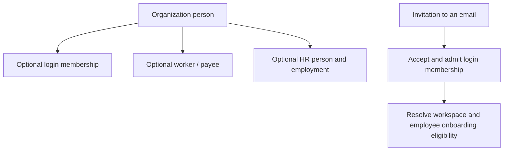

# StreamlineOS — remaining work

Updated 2026-09-13. **The only execution checklist.** Follow the priority and dependency order below; complete prerequisites first and revisit waiting acceptance. One Claude session can perform every role sequentially. Original module PRDs have been consolidated here and removed as superseded, not falsely marked complete. Existing evidence is reference only. Do not create another PRD, history, session report or PDF task list.

## Product and budget guardrails

Your immediate outcome is a reliable paid customer journey, not another whole-system refactor. Finish privacy/payment/access correctness before optimizations; optimize only demonstrated costs. Reuse the current architecture and tests. One bounded repair per work unit; after two unsuccessful hypotheses, identify the missing diagnostic discriminator and continue independent work instead of burning credits on repeated broad rewrites.

For launch, separate **technical readiness** from **commercial validation**: an all-in-one suite does not itself prove customers will pay or stay. Keep the existing supported scope; adding every proposed business feature is not part of this recovery. A broad Build redesign needs your buyer/workflow decision later and must not block stabilization. The engineering team can prepare a narrow, monitored pilot from working flows; release approval and actual customer willingness to pay must be real.

## Start and resume

1. Read root and affected backend/frontend CLAUDE.md. Inspect current source and working changes; the findings below are a dated baseline, not permission to redo a repaired defect.
2. Start with P10 privacy, AB-13 payment recovery and OS-R6 harness safety. For each task, trace the actual screen → hook → API/guard → service/transaction → event/cache → visible outcome; preserve one existing owner and contract.
3. Reproduce, make the smallest correct repair, verify the actual caller and required negative cases, then update that task here. A mock/helper pass alone cannot certify browser, committed DB or provider behavior. Do not stop after producing another plan.
4. When interrupted, leave a one-line checkpoint beside the current task: status, verified result, exact next action. Resume there; do not restart the audit. Mark [x] only when all its acceptance passes. Keep implemented-but-unverified tasks open.
5. Resolve technical questions using source and the standing answers below. Continue independent authorized tasks when one gate waits. Ask genuine human questions in ordinary chat, once, and record the answer here.

Scope: identity/signup verification, organization setup, invitations/people/employees, organization and module RBAC, billing, inbox/notifications, calendar, chat, shared data/cache/UI, existing Build screens, Documents and release reliability. CRM and Inventory are explicitly OUT OF SCOPE: ignore their PRDs, findings and implementation tasks. Broad product redesign is also deferred; none is a hidden completion requirement.

## Execution order and sessions

| Order | Session | Sections owned |
| --- | --- | --- |
| Always | S0 coordinator (one agent may fill every role sequentially) | Shared reservations, environment/build schedule, integration and release verdict |
| Wave 1 | S1 foundation/people | Identity/setup remaining acceptance, P10 privacy, P12 recipient outcomes and C1–C8 |
| Wave 1 | S2 billing/RBAC | AB-13 payment recovery, AB-08 session projection, failing resolver/migration gates, access and payment acceptance |
| Wave 2 | S3 communications | IN/CA/CH/CHAT residuals; shared UI fixes coordinated with S4 |
| Wave 2 | S4 frontend/Build | FD1/3/4/5/6/7/9, BUILD-002/003, ARCH-002/003 |
| Wave 3 | S5 Documents/operations | DOC-002/004, OPS-001–004, authorized external proof |

Use at most two implementation workers beside S0. One agent can execute sequentially.
S0 owns shared auth/guards, QueryProvider/query-scope/server-query-client, navigation,
next.config/tsconfigs, generated contracts/manifests and migration journals until
a named editor is reserved. Reserve .next AND the synthetic database/tenant/session
fixtures before captures. Never purge or migrate a shared fixture during another run.
S0 may prepare safe environment checks early by freeing a worker slot.

Start with **P10**, **AB-13** and the **OS-R6 harness safety repair**; then complete
independent repairs and acceptance. Previous catalog, setMonth, cursor, snooze,
calendar-cap and quota-wiring findings now have repairs: do not redo them blindly.

## External inputs an agent cannot manufacture

Local repairs are actionable. For actual sandbox/deployment/drill gates S0 must
identify the authorized environment, synthetic resources and action scope; credentials
belong in the secret store, never chat/Markdown. Actual Finance/security/privacy/release
decisions require named accountable people. Missing tax/refund/retention/RTO/RPO policy
requires the responsible owner only if no existing contract answers it.
Keep these precise gates open until supplied; do not waive them or invent signoff.
Broad Build redesign is deferred; it does not block repairing existing screens.

### Previously approved decisions — reuse, do not ask again

The repository owner approved H01–H17 on 2026-09-04 for code release; D01–D08 were deferred for deployment, not waived. These consolidated decisions replace the former owner-input register. Current user/root instructions take precedence. Verify current implementation before reopening a repaired requirement; approval is not completion evidence. Public landing-page visuals and motion remain unchanged; loading optimizations must preserve their appearance and behavior.

| Decision | Approved implementation contract |
| --- | --- |
| H01 | Require durable Idempotency-Key/replay records for grant, revoke, standing and module-access mutations; migrate frontend callers together. Natural upserts alone do not deduplicate effects. |
| H02 | Keep /settings/webhooks for organization-wide cross-module integrations; module-specific webhook configuration belongs to its module. |
| H03 | Public KB attachment pagination uses a versioned cursor/envelope endpoint, migrated callers and deprecation of the published bare-array endpoint; preserve compatibility rather than break that endpoint in place. |
| H04 | Financial/audit/authority/tenant-root FKs default RESTRICT; genuinely owned ephemeral children/joins CASCADE; optional display/actor references SET NULL. Prove and document domain exceptions. |
| H05 | Remove autonomy-repair tables only if no registered worker uses them; career-path tables remain only if career planning ships. Preserve/wire subprocessor compliance records. Check current callers, migrations and dependencies before removal. |
| H06 | Accounting remains in scope: wire the canonical GL posting boundary; remove only proven retired/redundant columns after dependency and migration proof. |
| H07 | Separate ordinary payroll management/locking from stronger reopen/reversal/destructive financial-correction permissions. |
| H08 | Private-by-default project visibility with project membership plus organization/module access is approved **scheduled, not shipped** work. S0 records its explicit release disposition; approval must never be reported as delivered behavior. |
| H09 | Workflow trigger, publish and execution-producing commands require durable idempotency with matching frontend callers. |
| H10/H11 | Hide/remove unimplemented Workflow templates and unused secrets write/decryption surfaces after current-consumer proof. A future executor receives secrets only at execution, never through returned/logged values. These are not launch features to invent. |
| H12 | Immutable invoices return provider-neutral HTTP409 INVOICE_IMMUTABLE without database/provider internals. |
| H13 | KB ingestion commits tenant-scoped durable intent before storage/embedding; use post-commit idempotent retry, compensation and visible status. |
| H14 | Exact list totals are opt-in for justified consumers meeting budget; otherwise use cursor/hasMore and suitable estimated/asynchronous counts. Preserve approved exact timesheet totals. |
| H15 | Select prepared-statement behavior for the actual pooler/environment after measurement; no global prepare:false guess. |
| H16 | Calendar “this and following” splits a local series, truncates the original RRULE, re-parents future exceptions and copies attendees; reset RSVP when timing materially changes, then reconcile providers asynchronously. |
| H17 | Accepted local calendar state wins over provider drift. Show pending/failed/conflict detail and retry/reconnect controls; preserve local edits. |

| Deployment input | Required disposition; not a code-release blocker |
| --- | --- |
| D01/D02 | Name Product/Security/Operations approvers and the dedicated platform-operator population. Requester/approver/beneficiary remain separate with two-person approval, scoped short expiry, quarterly/event-triggered review and emergency retrospective. App-role grant/audit history is append-only; notify tenant owner/admin on request, approval and revocation. |
| D03 | Name Privacy/DPO and Legal owners to approve lawful basis, retention and sensitive-field controls. Historical three-year security audit/eight-year payroll proposals are not approval or deletion authority; reconcile immutable records, legal holds, field encryption and least privilege before deployed use. |
| D04/D05 | Approve regions, transfers, DPAs and subprocessors: historical proposal India-default payroll with pinned EU/US options and 30-day subprocessor notice. Neon/private R2/Upstash/Razorpay/Turnstile/ZeptoMail require actual regional approval; Resend needs separate approval, OpenAI/Google personal data requires redaction, OpenRouter personal data remains blocked, Composio needs disclosure. Google Meet approval remains explicit; retired TURN/STUN work stays excluded. |
| D06 | Supply authorized cell/environment/API/DB/bucket/backfill/physical-replica/PITR targets and alert route/acknowledgement resources through secret storage. Validate every destination before any drill. |
| D07 | Named Finance/Operations approve actual invoice/API-derived unit cost and workload-demonstrated capacity with at least 40% headroom. |
| D08 | Actual release authority records accountable Product/Security/Privacy/Operations/Legal/Finance names, date, revisions/environment, evidence and accepted risks. Local mocks never manufacture signatures. |

### Accepted architecture constraints — preserve during repairs

- Retain existing integer identities in organization_members, roles, permissions, role_permission_grants and user_module_access. No renumbering, parallel UUID column or broad authorization-key migration. New identities follow backend rules; revisit only for a real exhaustion/merge/security requirement.
- FORCE RLS is advisory under the approved non-owner, non-BYPASSRLS application topology. Verify actual roles, policies and all worker/request connections; blanket FORCE is not a substitute and does not constrain BYPASSRLS. Production must refuse unsafe application credentials.
- AuthContext is actor/unit-of-work scoped, with shared in-flight module/membership/MFA promises and preserved failures. Guards and detached workers use the canonical factory/MembershipReader, including user and organization liveness. Reuse seeded membership; consult a context only for its matching user/org. Keep module resolution fail-closed. Guards execute before interceptor ALS, so moving their authority into interceptor-only context is incorrect.
- ScopedRead owns tenant plus data-scope predicates, actor-qualified own/team cache discriminators, none-before-query and declared rawScope escapes. Verify the caller actually spends its predicate. Preserve canonical subject gates for universal self-service and participation; resolving none for management does not automatically deny self access. Team currently narrows like own until materialized; no silent widening or duplicate resolver.
- No consumer is required for the un-emitted accounting.journal.posted event. Payroll uses existing posting-intent consumers and canonical Accounting commands; their remaining retry acceptance belongs to REL-001 below.

### Standing answers to recurring blockers

These are conservative implementation directions within the existing product;
they preserve contracts rather than silently deciding a new commercial policy.

| Blocker/question | Answer and next action | Owner |
| --- | --- | --- |
| Failing tests, casts, duplicate code, API/schema mismatch | This is executable work, not a question for the user. Reproduce against the actual caller, repair the smallest responsible boundary, verify; remove only proven dead code. | Assigned domain session |
| Who owns shared files or a cross-lane decision? | S0 assigns one editor and records the reservation here before edits. Other sessions send a bounded proposal and continue nonoverlapping work. | S0 |
| Setup waits for invitations/templates/welcome work | Readiness means the authorized member can actually use the intended organization. Keep required membership/access/entitlement invariants; optional enrichment must not delay entry. Preserve durable retry and truthful partial status. Projection failure is not success; hidden/wrong-cell membership is not an orphan. | S1 with S2 |
| What setup latency should we target? | Use p95 ≤10 seconds to first usable organization as the working engineering target, not a customer SLA or claimed measurement. Measure no-invite and representative-batch cases separately; record hardware/load/sample size. S0 may refine methodology, not quietly waive a failed target. | S1/S4 |
| May archived worker numbers be reused? | Preserve the existing unconditional reservation for this stabilization release. Reject reuse with clear copy; use the existing record's supported restoration flow. Do not contract uniqueness merely to satisfy an active-only index name. Archive/recreate/restore tests and schema reconciliation remain required. Reuse is a later explicit product change. | S1, P9 |
| Which salary currency? | Existing authority is organizations.currency through resolveOrgSalaryCurrency and assertSalaryCurrency. Preserve single/bulk/recruitment writers and reject unsupported values without partial writes. Never silently substitute INR or introduce multi-currency payroll. This precedence is already decided. | S1, P13 |
| Do entity chat channels bypass quota? | Reuse the authoritative existing channel resource/counting contract and atomic admission path; apply it consistently to explicit entity-channel creation. Do not invent a free exemption or charge existing-channel reads. If the product genuinely distinguishes channel classes, S2 supplies that existing rule. | S3 with S2, CH6 |
| Cache everything / where should reads live? | Preserve the existing scoped Query/service owners. Lightweight shared identity/access/badges belong in the shell; filtered lists/ranges and drafts do not. Add caching only after measuring and writing invalidation/failure rules. Build-only cross-tab sync is not app-wide sync. | S4 and domain owners |
| What revocation window is acceptable? | The recorded 30-second recovery window is a behavior to verify, not permission to weaken authorization or an accepted release risk. Preserve existing stricter guarantees; test direct HTTP/writes/streams and cache-hit/miss separately. Any remaining exposure requires an explicit security release decision. | S2; S0 records unresolved risk |
| Can calendar caps be raised to close the task? | No: preserve bounded work and correct cancelled/moved occurrences. Implement complete bounded continuation or explicit incompleteness/recovery semantics; verify legal dense windows. Keep schema drift owned even when generation is blocked. | S3 |
| Delete old inbox endpoints? | Keep authenticated legacy endpoints for this release unless consumer/compatibility evidence proves safe removal. Remove proven-dead internal keys only. Endpoint retirement is not a prerequisite for inbox correctness. | S3 |
| Missing browser / stale build evidence | Use the existing Windows Chrome launcher and capture harness. First inspect safe launch configuration and identify the test API; reserve a build. Old missing-browser reports do not establish a current blocker. Refresh artifact provenance before interpreting budgets. | S4; S0 schedules |
| Missing DB / representative fixtures | First inspect the existing disposable-stack setup without loading production defaults. Verify target identity, nonproduction credentials, tenant role, migration state and synthetic fixtures. Never infer current availability from old localstack evidence. If unavailable, report the exact resource missing; continue isolated source/mocked work. | S0 prepares; domain/S5 executes authorized checks |
| Customer tax exemption / late captured payment policy | Trace existing policy and consumers first. A customer flag is not automatically verified exemption. Do not invent tax rules, auto-refunds, discounts or expiry policy. Preserve the payment and reconciliation history; isolate unresolved cases for operator review using existing machinery. Ask Finance/product only for the missing rule; other billing repairs continue. | S2; accountable human for a genuinely missing policy |
| Remove Build screens / redesign entire product? | Finish existing correctness/accessibility/performance acceptance first; retain live screens. Broader deletion/repositioning waits for the user's buyer/workflow choice and is not a blocker for repairs. | S4; user for new product scope |
| Real provider drills, deployment, Finance/security/privacy signoff | Agents prepare and validate safe test procedures; actual calls require identified authorized test targets. A human approval cannot be fabricated by an agent. Keep only these gates waiting, not the entire lane. | S5, domain owner, accountable approver |

### Blocker handling at every handoff

Classify each remaining item as ACTIONABLE, WAITING-DEPENDENCY, EXTERNAL-INPUT or
VERIFICATION-PENDING. A missing test is work, not automatically an external blocker.
Historical `BLOCKED` text below is evidence; current status belongs in the owning
section next to its task. A request for a source trace must never become a user question.

For a genuine blocker record once, beside that task in this plan: task ID; exact observed failure;
what was safely tried; the smallest missing input; who supplies it; next executable
step after it arrives; independent work being continued. Send S0 that bounded record.
S0 resolves technical/dependency questions, batches only genuine human questions in
ordinary chat, and records answers here so later sessions reuse them. Do not repeat
an answered question or require a special follow-up-question UI. Recheck a blocker
when its dependency/input changes, not by repeatedly rerunning an unchanged failure.

Only the affected acceptance item waits. If all remaining authorized work truly
depends on external input, hand off honestly; do not poll indefinitely, assume
credentials/approval, silently waive the requirement, or report the product complete.

## Mandatory full-stack completion contract

Every task includes its architecture, code, schema, API, cache, UI/UX, security and tests—not separate competing rewrites. Inventory every in-scope route/action/async consumer/model/cache before changing it. Classify KEEP / REPAIR / CONSOLIDATE / REMOVE / DEFER with evidence; an uninspected entry point remains a coverage gap.

### Required safe cleanup within every flow

Completion includes removing proven unnecessary files/folders, constants/enums/configuration, functions/classes/helpers, duplicate checks/roles, types/interfaces/DTOs/Zod schemas, hooks/query keys/cache entries, components/routes/endpoints, assets/styles, imports/exports/barrels, dependencies and obsolete tests/fixtures. This is execution work, not merely a list of cleanup suggestions. CRM/Inventory remain excluded; retain shared code they genuinely consume.

File extension never establishes deadness. Include .mjs/.cjs/.js/.ts scripts, .json/.jsonl configuration and manifests, .txt/.log reports, SQL/shell files, assets and generated outputs in the owning flow's cleanup inventory. Preserve package manifests/lockfiles, compiler/tool configuration, framework-discovered files, migrations, fixtures and hash-bound evidence while they have a verified consumer or reproducibility purpose. Repeated bytes, old dates and empty stderr are only candidates for review, not deletion proof. Check computed paths, glob discovery, package/CI hooks, manifests and output generators as well as imports. Do not rewrite a seal, lower a coverage floor or rename files to hide a deletion. Record an unresolved retention decision under the owning task instead of deleting blindly.

Remove unnecessary comments: stale/misleading/duplicate/code-restating notes and commented-out implementation. Retain security/concurrency/migration/compatibility rationale, non-obvious design explanations, licences and required tool/generated directives. Preserve unresolved TODO work here before removing its comment. Judge variables/constants/aliases by meaning and consumers; preserve required initializer side effects, evaluation order and useful cached computations. Do not create dummy reads, underscore renames or wrappers to hide unused symbols.

1. Search both repositories for the symbol's purpose and consumers. Combine dependency-graph findings with dynamic/side-effect imports, framework routes/DI/reflection, queue/cron/event registration, package/CI entry points, generated contracts, raw SQL, migrations and external consumers. Unused by one screen, an empty table, or a zero-reference text search alone is insufficient proof.
2. For duplicates, preserve the correct canonical owner and migrate every consumer first. Keep distinct validation/authorization at separate trust boundaries: apparent repetition is not dead code. Maintain one authoritative type/role/cache factory; use schema-derived types rather than copying shapes.
3. Remove the obsolete implementation and stale registrations/imports/keys/documentation in the same bounded change. Preserve error/loading/offline states, authorization, audit history, retention/legal holds, idempotency, outbox/worker behavior and cache invalidation. Do not delete immutable migrations, stored customer data or published API fields without the supported migration/compatibility contract and required authority.
4. Re-run the actual repaired journey plus affected types/lint, dependency and dead-code checks, relevant tests and build as applicable to the changed boundary under the targeted-testing policy below. Exercise tenant denial, retries, rollback and cache invalidation for changed boundaries. Inspect final diff and repeat the consumer search. A failed or unrun safety check keeps cleanup acceptance open; fix/revert the specific unsafe change without discarding concurrent work.

Record removed paths/symbols, replacement owner where applicable and verification beside the owning task. Do not create a cleanup report or weaken a detector to hide remaining unused code. Unknown ownership means inspect further or retain with a precise unresolved reason—not automatic deletion. These checks reduce regression risk; they do not justify a zero-bug guarantee.

A tool's entry-point allowlist is not proof of use: broad Knip script entries can hide obsolete utilities. Verify the actual CLI/CI/manual owner. Conversely, separately installed workspaces may legitimately require their own lockfiles; duplicate filenames or lack of source imports do not make configuration disposable. For retained historical drills, inspect and repair target validation, dependencies and cleanup scoping before execution; their presence does not authorize running workstation-specific or destructive commands.

### Targeted testing and machine budget — user requirement

Run only tests for the changed code and proven dependent callers/contracts, with exact test paths or a bounded filter. Inspect package-script pre/post hooks and runner configuration; verify test discovery before executing so an ignored filter cannot launch all tests. Zero matching tests is not success. Documentation-only changes need their consuming document/gate checks, not application suites.

Run one bounded batch at a time, one worker/in-band where supported, watch mode disabled. S0 reserves one machine slot: heavy tests, typechecks and builds must not overlap across agents. Use finite runs; stop a resource-exhausting owned process and record the smallest next batch rather than repeatedly increasing heap/workers. Never terminate unrelated user processes. Whole-repository test runs require the user's explicit request.

Every release/criterion test requirement below follows this policy. Build integration coverage from sequential change-related batches and still-valid unchanged evidence, not an unfiltered full-suite command. Run affected typechecks/builds separately only when that change requires them. Keep unrun acceptance open; do not weaken test/compiler coverage or present a targeted pass as full-product certification.

| Gate | Required evidence before the flow is complete |
| --- | --- |
| 1. Product flow | Every supported entry, happy path, retry, cancellation, resume and lifecycle transition has expected behavior and a verified result |
| 2. Architecture | One responsible owner per invariant; caller/transaction/event boundaries mapped; shared changes integrated without duplicate engines or speculative layers |
| 3. Code and types | Behavior repairs reproduce the defect before/after where feasible; otherwise record the missing discriminator and keep behavior proof open. Nonbehavioral changes use applicable structural/contract checks. Affected types, lint and dependency checks pass without new suppressions |
| 4. Schema and data | Tenant/uniqueness/FK/lifecycle invariants tested; changed migration replay and recovery demonstrated on disposable DB; existing data preserved |
| 5. APIs | Request/response/envelope/pagination/error contracts match consumers; direct HTTP negatives, idempotency, concurrency and compatibility checked |
| 6. Security and RBAC | Org + module + action + record + entitlement boundaries tested; cross-tenant, suspended, revoked and nonhuman principals covered where supported |
| 7. Cache and performance | Complete writer/key/TTL/invalidation matrix; cold/warm and failed-cache tests; measured request/SQL/latency/bundle budgets under documented load |
| 8. UI/UX and accessibility | Actual screenshots and browser interaction for loading/empty/error/denied/pending/success; keyboard, mobile, zoom, readable consistent tokens and recovery |
| 9. Cleanup and maintenance | Each removed symbol/file has caller/registration/migration proof; relevant build passes; obsolete tasks consolidated while durable evidence remains |
| 10. Operations and release | Same-revision combined journey, real provider sandbox where relevant, monitoring, worker/retry recovery, deployment smoke checks and rollback owner |

Use PASS / FAIL / WAITING / NOT-APPLICABLE per applicable gate, with a reason for exclusions. Record exact revision/artifact, environment, command/exit, expected/actual outcome and evidence location beside the task. Missing evidence is not PASS. Run independent behavior/security and integration/cache/UX reviews after implementation; prior document reviews do not count. A security, billing or privacy failure cannot be averaged away.

## Baseline and evidence limits

The September 13 reconciliation used root 56922f81e / backend 3cf2350fd plus working changes: 474 focused backend tests passed and 3 failed (one migration-integrity, two payment-resolver assertions). Chat/calendar/inbox harness self-tests passed 139/72/100; these were not browser runs. Frontend query-scope/request-params/growth/size gates passed; dead-code and stale bundle provenance failed. Backend spec compilation exhausted its 8-GB heap: inconclusive, not passing. No live DB/provider/browser or full build ran in that reconciliation. Recheck changed paths at the current revision.

Preserve repaired identity claim/session fences, truthful setup readiness/savepoints, invitation deduplication/owner skip, employee eligibility/currency, billing capture validation/clamped terms/intent-first ordering, RBAC keyset drains, communication cursors/snooze/versioned edits/quota locks, Query scope/hydration and strict-build gates. Reopen implementation only with a current regression. Historical results below guide targeted retesting, not release certification.

# S1 — Identity and organization setup

Owner: S1
Maps to: PRD-C004, PRD-C111, PRD-C112

Owner S1; S0 reserves shared auth/cache/query/schema files. Identity mint cache remains user+device+org, bounded by token expiry and size; backend revocation is authoritative. Setup readiness requires active owner, target organization, stamp, latest allowed subscription (TRIAL/ACTIVE/PAST_DUE) and enabled catalog-active module. Optional enrichment uses durable retries/savepoints and cannot delay first usable entry or erase successful recipients. Wrong-cell/unverifiable membership is not an orphan.

## Authoritative remaining work

- [ ] **ID-R3a — Actual browser two-device logout and late-refresh acceptance.**
  Use two real registered device sessions and two isolated browser profiles on a named disposable
  stack. Sign device A out through the application control, which calls
  `frontend/hooks/common/auth-hooks.ts::useSignOut` → backend `POST /auth/logout` →
  NextAuth signOut event. Assert A's captured backend JWT is refused, A's local auth/query/gate
  data is cleared, all A-org mint-cache entries are evicted, and B remains usable.
  The historical direct `/api/auth/signout` curl alone only exercises web eviction and is
  **not** backend revocation. Exercise unavailable-backend logout separately: local signout
  completes, warning truthful, remote revocation not falsely claimed. Recheck actual production
  callbacks, not only a helper. Keep no-org/suspended/owner/employee/MFA/platform-admin gate
  outcomes. Race slow old-org refresh versus a newer switch and confirm no stale route/data
  becomes visible: caller generation fences do not themselves cancel NextAuth update work.
  If browser fixture minting is needed, expose known session id in existing
  `frontend/scripts/mint-session-cookie.mjs` (mint accepts it; current CLI does not); never
  print cookies/JWTs or invent unregistered session ids as successful identity fixtures.

- [ ] **ID-R5a — Remaining integration, not repeat implementation.**

  `MOSTLY CLOSED 2026-09-13 | openapi regenerated 3896 ops / 0 undeclared | contract-vendor exit 0 |
  contract-drift exit 0 | signin form 41/41 exit 0 | remaining: the browser half, which needs a served frontend`
  The billing `CACHE_KEYS.userSession` half is closed under AB-08 and was not redone.
  `POST /auth/register` is genuinely absent - `auth.controller.ts` holds twelve routes and no
  `@Post("register")`. OpenAPI was regenerated against the disposable stack with
  `--env-file=D:/agent-work/disposable.env` and **without** `--env-file-if-exists=.env`, so no
  production default was loaded; `applyOpenApiEnv`'s six minimums are all satisfied by that file.
  `grep "auth/register" openapi.json` returns 0 matches. `check-contract-vendor` exit 0 with matching
  sha256, `check-contract-drift` exit 0.
  **The stale-register-spec premise was itself stale.** `auth/register-provisioning.spec.ts` never
  asserted the HTTP route - it covers `bootstrapCellOrganization`, the actual provisioning seam - so
  the legitimate coverage was already pointed at the right thing and nothing was retargeted.
  The `h-8` control was real: `passwordless-signin-form.tsx:313` overrode the `Input` component's
  `FIELD_CONTROL_CLASS` through `cn()`. `frontend/CLAUDE.md` section 9 names `h-9` as canon and forbids a
  local `h-8`, so it became `h-9`; one word, nothing else restyled.
  `verify-identity-journey.mjs --self-test`: 46 passed, exit 0. No package script was added.
  REMAINING: the 6-state x 2-width browser matrix needs the frontend served; the harness stubs
  `POST /auth/email-otp` in-browser and navigates `/signin`, so it is blocked on a web server, not on
  the API.
  S2 must close the billing `CACHE_KEYS.userSession` writer gap: September 13 source search
  still finds no direct session invalidator in billing; trace canonical indirect writer seams
  before editing, then prove current session plan after committed activation/change and unchanged
  state on rollback/cache outage. one owner under AB-08 below; this is its dependency,
  not a duplicate implementation task.
  S0 regenerates/reviews OpenAPI with legacy `POST /auth/register` absent, runs contract-vendor
  and changed frontend/backend production builds, relevant test/app types, cycle/quality gates,
  and final integration at one frozen revision pair through REL-001 below.
  Reconcile the old register spec if it still asserts a removed route; preserve legitimate
  provisioning coverage rather than restore an intentionally retired endpoint.
  Existing identity harness frontend/scripts/verify-identity-journey.mjs has no package script: use its explicit path; add a script only
  if shared tooling owner accepts it. Source `passwordless-signin-form.tsx` email `h-8`
  versus h-9 canonical control needs S4 visual/size-rule reconciliation, not an unrelated rewrite.

- [ ] **OS-R5 — Production-browser setup failure-state acceptance.**
  Run existing `backend/src/scripts/capture-org-setup-failure-states.mjs` only after verifying
  its current arguments, real cookie name and disposable stack. Self-test first; capture production
  frontend (not dev) at narrow/desktop widths and 200% zoom with keyboard focus/retry.
  Exercise PARTIAL, DEAD, INVALID, SUPPRESSED, RETRYING, 401/403, malformed status and network
  failure; no infinite spinner or resubmitted setup on status recheck. Existing harness substitutes
  eight status scenarios; add the missing scenario/control coverage if it cannot cover this matrix.
  Include pending deadline/retry, unmount, org switch, complete/skip replay, double submit,
  indeterminate sign-in, withheld token, failed/mismatched session refresh and successful dashboard
  transition without returning to Welcome after provider remount. Verify structured correlation
  IDs, no raw operator diagnostics, intact draft until truthful success and warning with usable org
  after optional failure. Coordinate recipient-result UX with people P12. Retain actual API/DB
  race proof for concurrent complete/skip; mocked conditional-update tests alone do not close it.

- [ ] **OS-R6 — Repair measurement harness before running; then measure customer latency.**

  `HARNESS REPAIRED 2026-09-13 | refusal spec 8/8 exit 0 | --self-test exit 0 | MEASUREMENT still gated`
  All five repairs the row demands are done, and the safety work went further than asked.
  Auth now matches the guard (Bearer, not Cookie) AND the fixture identity is verified rather than
  assumed: `verifyTokensPreOrg` calls `GET /org/setup/status` per token before any database
  connection, throwing on 401/403 with the token index, and refusing a token whose user has ALREADY
  completed setup (`ready === true`) - that route carries `@AllowNoOrg()`, so a valid pre-org token
  correctly answers 200 with `ready: false`.
  Both API and database are bound to the disposable stack, and the refusals are PROVEN to fire before
  any I/O. `assertDisposableTarget` and `assertDisposableApiTarget` are synchronous pure functions;
  the ordering is proven by a test that monkey-patches `globalThis.fetch` to throw and confirms it is
  never called. The two required combined cases both refuse: local DB + remote API, and local DB +
  undefined/wrong API.
  **A stronger floor than the row asked for was added.** `assertNotProductionDatabase` runs FIRST in
  `main()` and refuses any `APP_DATABASE_URL` containing `amazonaws.com`, `neon.tech`,
  `neon-db.net`, `supabase.co` or `.render.com` - and unlike `assertDisposableTarget`, it CANNOT be
  bypassed by `SETUP_ALLOW_REMOTE=1`. Given this harness creates organisations by POST, an override
  that could reach production Aurora was the real hazard.
  Cleanup is established before the first mutation and is now ASSERTED, not hoped for:
  `DELETE ... RETURNING id` distinguishes "row removed" from "no row matched", a `notCleaned` list
  accumulates failures, and deletion errors are logged rather than swallowed.
  Email cannot be sent: `assertEmailTransportDisabled` refuses if either `ZEPTOMAIL_TOKEN` or
  `RESEND_API_KEY` is present, before any network or database call. `backend/.env` is never loaded -
  the script contains no dotenv import, no `--env-file` flag and no `.env` path.
  MEASUREMENT-GATED, and deliberately not faked: p95 readyMs over 10+ fresh users per scenario needs
  a quiet host, a booted API and `pg_stat_statements` in `shared_preload_libraries` (which needs a
  Postgres restart). Ten agents were running here. The exact command and its four prerequisites are
  recorded in the harness docstring; no MET/BREACHED verdict is claimed.
  Source `backend/src/scripts/measure-org-setup-journey.ts` currently authenticates direct backend
  complete/status/usable requests with Cookie, but `backend/src/common/auth/jwt-auth.guard.ts`
  requires `Authorization: Bearer`. Adapt existing harness to real authenticated API entry flow,
  proving fixture identity/organization and failure refusal. Current guard validates only
  APP_DATABASE_URL; SETUP_API_BASE_URL is separately unvalidated. Bind **both** API and database
  to the named disposable stack; reject remote/mismatched API before any request, require explicit
  approved override where relevant, and add refusal self-tests for local DB + remote/wrong API.
  This harness **creates organizations by POST**; “does not write any row” was incorrect.
  Provision distinct throwaway verified users, contain every email/provider transport and worker
  dependency, establish cleanup/retention before mutation, and assert cleanup. Never load production
  .env underneath overrides; empty both ZeptoMail and fallback Resend credentials in a deliberately
  no-send stack. Cookie/JWT fixture files stay outside the repo and are never logged.
  Then measure no-invitee and representative 10-invitee scenarios with at least 10 fresh users each.
  Record dataset/environment, sample count, completeMs, durable commitToClaimMs, consumerMs,
  readyMs, usableColdMs/usableWarmMs and pg_stat_statements deltas; separate cold/warm and unfinished
  samples. Target p95 readyMs ≤10s (engineering target, not SLA); report MET/BREACHED/INCONCLUSIVE.
  Verify >100-membership selection and wrong-cell/lookup-outage behavior on representative fixtures;
  OS-R1's seam mocks and exact-100 sample do not certify these runtime boundaries.
  Retain failed/timeout samples, explain attribution, fix demonstrated bottleneck and rerun it.

  `HARNESS-REPAIRED / MEASUREMENT-PENDING | backend 246782ddb + working tree |
  --self-test exit 0 | remaining: the measurement run itself | next: boot API on the localstack
  stack, mint scratch JWT fixtures, then run no-invitee and 10-invitee scenarios`

  `MEASURED 2026-09-13 | p95 readyMs 739 ms (no-invitee) and 625 ms (10-invitee) against a 10 s target
  | MET with 13x headroom | --self-test 16/16 exit 0 | 20 samples, 0 incomplete`
  The four prerequisites this row named are all satisfied: the API is booted on the disposable stack,
  `pg_stat_statements` is loaded (Postgres restarted with it in `shared_preload_libraries`), fresh
  pre-org JWT fixtures were minted against that stack, and the counters were reset immediately before
  the run.
  No-invitee (n=10): completeMs p50 455 / p95 611; commitToClaimMs p50 688 / p95 895; **readyMs p50 525
  / p95 739**; usableCold p50 30 / usableWarm p50 15; ~5,085 SQL calls per sample.
  10-invitee (n=10): completeMs p50 420 / p95 546; commitToClaimMs p50 880 / p95 1,091; **readyMs p50
  493 / p95 625**; consumerMs p95 549, max 1,000; ~5,440 SQL calls.
  Verdict **MET**, confidence moderate-high: the host was NOT quiet - several browser agents were
  running - but at 13x below target the direction is not in doubt. A quiet host would only lower it.
  **The measurement explained the architecture rather than just scoring it.** `readyMs` is BELOW
  `commitToClaimMs` in every single sample, because `ready: true` is set synchronously when the setup
  transaction commits and the outbox consumer is pure asynchronous enrichment - RBAC seeding,
  invitations, session closure - which does not gate first usable entry. That is the contract this plan
  asks for, demonstrated rather than assumed.
  Dominant cost identified: `INSERT INTO role_permission_grants` at ~97 ms per call, roughly 2,000 rows
  per organisation. That is the single most expensive phase of org setup and it sits off the ready path.
  **>100-membership defect FIXED 2026-09-13.** Reproduced at runtime on a dedicated `scratch_osr6_1`
  database (created and dropped for this proof): 101 membership rows inserted (1 ACTIVE target at
  `joinedAt = -200 days`, 100 LEFT fillers at newer timestamps). `listSetupMemberships` returned
  exactly 100 rows and the ACTIVE target was absent — confirmed by query run as `streamline_app` under
  RLS with `app.user_id` GUC set. The proposed `findActiveSetupTarget` (INNER JOIN, no scan limit,
  LIMIT 1 on result) returned the correct org.
  Fix: added `private findActiveSetupTarget(userId)` to `org-setup-resolver.service.ts` — queries
  `organization_members INNER JOIN organizations WHERE status=ACTIVE AND deletedAt IS NULL AND
  membership.status=ACTIVE ORDER BY joinedAt DESC LIMIT 1` via `withIdentity`. `resolveOrCreateOrg`
  now calls it immediately after `resolveCurrentSetupTarget`; only when it returns null does the
  bounded `listSetupMemberships` scan run (retained for orphan cleanup and the SUSPENDED throw path).
  `listSetupMemberships` retains `.limit(100)` by design. The `resolveExistingSetupTarget` call in
  `resolveOrCreateOrg` is now effectively only the SUSPENDED-membership throw guard.
  Green: 48/48 across all three `org-setup-resolver-*.spec.ts` files. `makeDb` in the two sibling
  specs gained an `innerJoin` chain; `org-setup-resolver-creation.spec.ts` gained a
  `findActiveSetupTarget` spy (it has no `withIdentity` mock and `db = {}`).
  The spec at `org-setup-resolver-targets.spec.ts:513` was "known gap"; it is now renamed
  `resolveExistingSetupTarget alone cannot see a target at position 101+` and a new passing test
  `resolveOrCreateOrg returns an ACTIVE target via findActiveSetupTarget even when beyond the bounded
  scan` proves the fix at the resolver level.
  Wrong-cell and lookup-outage both fail CLOSED at the seam (`placedOrganizationCoordinates` throwing
  yields `unverified`, nothing is deleted); real network behaviour under outage is not certified.
  **Audit-log deletion: already handled in the production path, NOT a gap in the service layer.**
  `org-purge.service.ts:212` calls `SELECT app.nullify_audit_logs_org_id(orgId)` inside the
  `runInTenantTransaction` before `DELETE FROM organizations`. Migration `0930` implements the
  function: it sets session-local `app.audit_log_detachment = true` then UPDATEs `audit_logs` to set
  `org_id = NULL` and `is_platform_event = true`, which the append-only trigger allows. The function
  is SECURITY DEFINER, granted only to `streamline_app` (not public), and requires
  `app.organization_id` GUC to match the argument — so it is tenant-scoped and cannot be called
  outside a tenant transaction. `cron-org-purge-worker.service.ts:245` calls it too. The function
  works on Neon (no superuser needed; it is a normal SECURITY DEFINER function owned by the
  neondb_owner role). The harness could not use this path because it connected as `neondb_owner`
  directly with no tenant GUC, not through the service layer. GDPR subject erasure
  (`gdpr-subject-erasure.service.ts`) does not delete the `organizations` row — it redacts PII inside
  the tenant transaction and leaves the row intact. No gap in any real tenant-deletion path.
  **Harness gap recorded: `APP_DATABASE_URL` requires BYPASSRLS for `describeDataset`.** The harness
  queries `organizations`, `outbox_events` and `inbox_records` without setting `app.organization_id`,
  so `streamline_app` (RLS active) fails `42501`. Workaround used: connect as `neondb_owner`
  (BYPASSRLS). Clean fix: add a separate `SETUP_PROBE_DATABASE_URL` that accepts a BYPASSRLS role,
  keeping the main `APP_DATABASE_URL` as the app-role connection for fixture setup/teardown.
  The session_replication_role = replica technique used for harness cleanup is a local-only escape
  (requires true superuser); the correct production path is `app.nullify_audit_logs_org_id` before
  `DELETE FROM organizations`, as the service already does.
  Repaired in `backend/src/scripts/measure-org-setup-journey.ts` only. All three call sites now send
  `Authorization: Bearer` instead of `Cookie`, matching what `jwt-auth.guard.ts` actually requires.
  `SETUP_API_BASE_URL` is now validated by `assertDisposableApiTarget` and refuses any non-loopback
  API host unless `SETUP_ALLOW_REMOTE=1`, sharing one escape hatch with the DB check so API and
  database cannot be bound to different stacks. `assertEmailTransportDisabled` hard-refuses when
  either `ZEPTOMAIL_TOKEN` or `RESEND_API_KEY` is populated. The false "does not write any row"
  claim was removed — the harness creates organizations by POST. Cleanup now tracks created org ids
  from before the first mutation and deletes them in `finally`.
  Refusal self-tests bite, 16 cases across db/api/email, observed refusals include
  "API host 'api.prod.streamlineos.com' is not loopback", "database 'streamlineos' does not match
  SETUP_MEASUREMENT_ENV 'scratch_local'" and "email transport credentials must be absent".
  `verifyApiRefusesUnauthenticated` additionally proves the guard bites on real requests (no header
  and an invalid bearer must both return 401/403) before any sample is measured, rather than assuming it.
  Blocking the measurement: API not yet booted on the disposable stack; scratch JWT fixtures must be
  minted against that stack and kept outside the repo; and `pg_stat_statements` was NOT installed on
  scratch_local, so SQL deltas would return null. Preload is now staged in `postgresql.auto.conf`
  and applies at the next Postgres restart, deferred so it does not disrupt in-flight work.

# S1 — People, invitations and employee admission

Owner: S1
Maps to: PRD-C004, PRD-C118, PRD-C119

Owner S1; S2 owns quota/RBAC definitions; S0 reserves shared models/contracts/migrations.

## Product and identity contract



A person, login, worker and employment are distinct. Adding a person must not silently create login access, paid seats, employment or payroll participation. An invited teammate need not be an employee. One account may belong to several organizations; another organization must not rewrite its global identity or reactivate its global suspension. Owners/platform admins do not enter the employee wizard. Build-only members retain universal communication/self-service without becoming HR administrators.

| Customer operation | Current caller → endpoint → owner | Data boundary |
|---|---|---|
| Invite one/bulk | `frontend/features/directory/users/user-invite-dialog.tsx`, `user-bulk-invite-dialog.tsx` → `frontend/hooks/api/users/invitations.ts` → `POST /users/invite`, `/users/bulk-invite` → `backend/src/modules/users/users.controller.ts` → `InvitationCreateService` | Invitations, events, admission screening, seat ledger |
| Manage invitations | `user-invitations-panel.tsx` → same hooks → `GET /users/invitations`, resend/role/delete subroutes → `InvitationsReadService`, `InvitationLifecycleService` | Tenant invitation + current actor standing |
| Accept/decline | `frontend/app/(auth)/invitation/[token]/page.tsx` → organization public invitation routes → `InvitationAcceptanceService` | Hashed token, account, membership, magic link, organization index |
| Direct login admission | `frontend/hooks/api/users/account-mutations.ts` → `POST /users` → `UsersService.createUser` → `MembershipAdmissionService.admitOne` | `sendInvite=true` branches to invitation; direct path creates membership and placement |
| Person without login | `frontend/features/directory/people/*`, `frontend/hooks/api/directory/*` → `/directory/people` → `DirectoryController` / `DirectoryService` / `DirectoryIdentityService` | `organization_people`; membership linking is tenant checked |
| Worker/engagement | `frontend/features/directory/workers/*`, `frontend/hooks/api/directory/workers.ts` → `/directory/workers` and engagement routes → `WorkerEngagementsService` | `workers`, `worker_engagements`, person and actor FKs |
| Employee admission/import | `POST /hr/employees/onboard`, `/onboard/bulk` → `EmployeesController` → `EmployeeOnboardingService`, `EmployeeBulkOnboardingService` | Membership admission, HR employment, canonical person, placement, sensitive salary/bank data |
| Employee self setup | `frontend/features/employee-onboarding/hooks/use-onboarding-wizard.ts` → `frontend/lib/api/hooks/onboarding.ts`, `frontend/hooks/api/onboarding-flow.ts` → `/onboarding/*` → `OnboardingController`, details/session/submission services | Current actor and membership; personal/bank data and durable completion |
| Teammates during org setup | `frontend/features/org-setup/components/step-invite-launch.tsx`, `lib/setup-payload.ts` → provisioning lane → bulk invitation delivery | Teammate invitations, not employee/payroll creation |

- [x] **P3 — Invitation and seat race acceptance.** Exercise concurrent last-seat invite/resend/accept/revoke/decline/expiry and pending-invite → direct-admission conversion against the real transaction boundary. Assert one seat/reservation, stale-token denial, rollback and post-commit delivery. Preserve decline's INVITE_CANCELLED / invite-declined idempotency semantics. This is the race task delegated by billing, not a second seat implementation.

  `DONE-SOURCE | backend working tree 2026-09-13 | 12 new tests exit 0 in src/modules/users/p3-invitation-seat-race-acceptance.spec.ts; all 121 related-suite tests exit 0 | real 2-connection race NOT feasible in Jest — proven by src/scripts/prove-quota-lock-serializes.mjs (scratch DB required)`
  Traced the real transaction boundary: every seat-consuming path acquires `pg_advisory_xact_lock(hashtextextended('quota:<org>:members', 0))` via `lockMembersQuota` inside the same Drizzle transaction that calls `assertWithinLimit` and then performs the membership/invitation insert, so the check-then-act is serialized by that lock.
  New spec proves: (1) `recordSeatEvent` is never called when `assertWithinLimit` throws (rollback erases the ledger write before it is issued); (2) `recordSeatEvent` is never called when `lockPendingInvitation` returns 0 rows (stale/accepted token); (3) the renewal email is never fired when the resend in-transaction update aborts (concurrent winner took the row); (4) the renewal email fires exactly once when the resend transaction succeeds; (5) a concurrent decline that finds 0 rows emits no second `INVITE_CANCELLED` event. Existing specs already prove: lock→check ordering (invitations-plan-limit, invitation-acceptance-insert-ordering, invitation-resend-seat, membership-admission-seat-limit); stale-token ConflictException (invitation-acceptance-recovery); decline idempotency key `invite-declined:<id>` + event type `INVITE_CANCELLED` (invitation-decline-seat); pending-invite → direct-admission atomic cancel+lock+check+insert (membership-admission-seat-limit P7); expiry sweep atomicity (cron-invitation-expiry). No new seat implementation was written.

- [ ] **P10 — Fail-closed draft privacy at depth boundary.** New current-source defect:
  `backend/src/modules/hr/onboarding/flow/onboarding-session-privacy.ts::stripValue`
  returns the original value when depth >8. The patch DTO in
  `flow/dto/onboarding-flow.schemas.ts` accepts arbitrary nested `z.any()` values.
  A ten-level child object containing synthetic accountNumber survives serialization after
  `stripOnboardingDraftSecrets`; shallow accountNumber is stripped. Reproduced offline
  September 13 using the real transpiled helper: shallowStripped=true, deepSecretRetained=true.
  Existing privacy suite passes, so it does not cover the exploit.
  Reuse the canonical draft DTO/sanitizer; reject over-depth input or drop over-depth subtrees
  without returning raw sensitive data, with an explicitly bounded traversal. Cover depth 8/9/10,
  nested arrays, mixed-case keys, legacy poisoned reads, merged update and skip. Verify real service
  read/write paths never return/persist nested account/PAN values; keep permitted bank display fields.
  Add red/green regression before repair; no live financial details in tests or reports.

  `DONE-SOURCE | root 501f2e60b / backend 246782ddb + working tree | red 7 fail/9 pass -> green 16/16
  plus DTO boundary 7/7, exit 0 | remaining: C4 live-DB acceptance | next: C4 under the live-proof batch`
  Repaired both layers. Sanitizer `stripValue` no longer returns the raw subtree past
  `ONBOARDING_DRAFT_MAX_DEPTH`: an over-depth record drops to `{}` and an array to `[]`, so the
  fail-open path is gone while keys at the boundary are still redacted by the parent frame.
  The patch DTO was the other half of the same defect — `z.record(z.string(), z.any())` accepted
  unbounded nesting, so over-depth input was silently discarded rather than refused; it now rejects
  with a bounded traversal aligned exactly to the sanitizer (containers only, so a scalar leaf is
  not miscounted as a level) and `z.any()` became `z.unknown()`, which also matches the existing
  `SessionPatch.data: Record<string, unknown>` service contract.
  Command: `npx jest --runInBand --runTestsByPath src/modules/hr/onboarding/flow/dto/onboarding-flow.schemas.spec.ts src/modules/hr/onboarding/flow/onboarding-session-privacy.spec.ts` -> 2 suites, 21 tests, exit 0.
  The DTO spec asserts the invariant both ways — every accepted payload survives sanitization with
  its non-secret leaf intact, and every accepted payload still has its secret stripped — and bites:
  removing the depth check fails two of its cases. Coverage includes depth 8/9/10, nested arrays,
  mixed-case keys, legacy poisoned reads, merged update and skip, with synthetic fixtures only.
  Noted, not changed (no regression, outside this task): `SessionPatch` in
  `flow/onboarding-session.service.ts` is a hand-written interface duplicating the Zod shape where
  root CLAUDE.md 6 requires `z.infer`.

- [x] **P12 — Customer-safe setup recipient outcomes.** Core bulk/savepoint repairs are complete;

  `DONE 2026-09-13 | backend 18 suites / 205 tests exit 0 | frontend 8 suites / 92 tests exit 0 | NO CHANGES NEEDED`
  Verified rather than reimplemented; all six acceptance points hold at current source.
  The generic `SETUP_BACKGROUND_PARTIAL` is no longer all the customer gets: `resolveInviteeOutcomes`
  maps invitation state onto four non-overlapping outcomes - PENDING to `queued`, ACCEPTED to
  `successful`, DECLINED/REVOKED to `failed(invitation_revoked)`, an active member with no invitation
  to `failed(already_member)`, neither to `failed(unknown)`, and the owner's own address to `skipped`.
  Authorization is real on both axes. Tenant: `resolveCurrentSetupTarget` pins the lookup to the
  caller's `userId` under `withIdentity` and the RESOLVED org drives the tenant GUC, not the org the
  JWT claimed. Owner: `recipientOutcomes` is computed only when `isOrgOwner` is true, and a member
  actor receives `null` - pinned by a test, not by inspection.
  Nothing leaks. The inbox read projects `lastError` as a BOOLEAN
  (`sql<boolean>\`${inboxRecords.lastError} is not null\`` aliased `hasOptionalFailure`), the response
  type and Zod schema have no such field, and two tests assert `not.toHaveProperty("lastError")`.
  The per-recipient object is whitelisted to exactly `{email, outcome, reason}`, asserted by comparing
  sorted keys. Addresses come only from the org's own stored payload, read under
  `eq(outboxEvents.organizationId, orgId)`, and the consumer's cross-tenant guard fires before any
  field is read (9 isolation tests).
  Duplicates cannot double-report: a `processedEmails` set means an address listed twice (MEMBER then
  ORG_ADMIN) yields one outcome, and the owner-skip plus later-role continuation case is pinned by its
  own test.
  The frontend genuinely renders the distinction - `RecipientOutcomeList` in
  `generation-progress-stage.tsx` filters `skipped` (the owner is not told they skipped themselves)
  and renders successful/failed/queued with distinct status tokens and plain-language labels
  ("joined", "pending", "already a member", "declined or revoked", "not sent"). It is passed only when
  provisioning completed with `SETUP_BACKGROUND_PARTIAL`, which is the only case the backend
  populates. A backend field nobody renders would not have closed this row.
  `OrgSetupQueryService.getSetupStatus` still emits generic SETUP_BACKGROUND_PARTIAL rather than
  identifying failed invitees. Complete the prior acceptance using a typed, tenant/owner-authorized
  per-recipient outcome projection and existing wizard/invitation UI. Reuse durable invitation/event
  state; never expose raw lastError or another tenant's addresses. Show successful/queued/failed/skipped
  distinctly, retry only eligible failed recipients, and prevent duplicate reservations/deliveries.
  Prove owner-address skip and later-role continuation stay intact. Reserve setup DTO/query/UI with
  foundation owner; this is one shared task, not two separate implementations.

- [ ] **C1 — Request, SQL and cache capture.** One run closes both old cold/warm and mutation
  checkboxes; command and exact criteria follow.

  `RUN 2026-09-13 against the live disposable stack | exit 0, legs=18 failures=0 | 5 of 7 criteria MET,
  2 UNMEASURED | the harness had five real contract mismatches and could not have passed before`
  This is the first time the harness ran end to end, because until today there was no booted API.
  Five genuine contract defects in `people-request-capture.mjs` were repaired before it could:
  `/users?page=1` was rejected by a `.strict()` `listUsersSchema` that accepts `cursor` and not `page`;
  `POST /users/invite` is `@Idempotent` and needs an `Idempotency-Key`; the org-switch body key is
  `orgId`, not `organizationId`; and the conflict leg was asserting 409 on a duplicate invite, which
  actually RESENDS and returns 201 - a 409 requires inviting an address that is already an ACTIVE member.
  MET: exit 0; all 18 legs matched their documented status; **the duplicate-invite leg is 409**; the
  read after the failed mutation is byte-identical to the read before it (1569 = 1569, so the rejected
  invite left no row); and no unmasked address, token or personal name appears in the report - every
  identifier is a salted SHA-256 digest.
  UNMEASURED, and not claimed: **warm-versus-cold SQL deltas**, because `pg_stat_statements` is created
  on `scratch_local` and staged in `postgresql.auto.conf` but is NOT in the running
  `shared_preload_libraries`, so every `sqlStatements` field is null. Wall time is suggestive
  (`/users` 198.7 ms cold against 104.0 ms warm, `/hr/employees` 104.6 against 51.5) but wall time is
  not a statement count and is not offered as one. **Org-switch isolation**: the harness JWT stays
  pinned to ORG1, so the post-switch read never left the first tenant. The byte delta that looked like
  a difference was fully explained by a concurrent leg committing another invite into ORG1 - a
  reminder that response size is not an isolation assertion.
  Writer matrix: the invitation-CREATE path invalidates exactly one backend key, `users:stats`, via
  `cache.invalidateForOrg` at both the new-invite and resend call sites. Every other entry the row
  lists (`org:members:list`, `rbac:members`, `module-access:candidates`, `CACHE_KEYS.userSession`,
  `hrEmployeesListNamespace`, HR analytics/celebration/dashboard, `invalidatePersonAccountAccess`)
  belongs to the ACCEPT / member-join path and was not exercised by this run. Invitation Query keys are
  invalidated client-side and carry no server header, so they are not observable over HTTP.
  Fixtures created and all deleted, verified zero rows remaining: 6 invitations, 16 invitation_events,
  6 billing_seat_events and one temporary `enterprise_quotes` row raising the 500-seat wall.
- [ ] **C2/C3 — Browser identity transition and employee attach.** HTTP identity rows below already
  have 49/49 proof; do not redo them merely because a stale queue said not attempted. Browser signed-in
  wrong-account advisory, actual invited-account session transition and employee attach remain.

  `RUN 2026-09-13 | C3 HTTP/DB legs PASS | browser legs NOT-RUN`
  The full admission chain was exercised end to end against the live disposable stack and every
  durable consequence asserted in the database, not merely in the response. `POST /users/invite` →
  201; `POST /organization/invitations/accept` → 200 with an autoLoginToken, invitation status
  ACCEPTED and **exactly one** INVITE_ACCEPTED seat event keyed on the invitation id;
  `POST /hr/employees/onboard` with `attachToExistingMember: true` → 201 leaving 1 membership,
  1 org_people, 1 hr_people and 1 primary hr_employment. **Attach does not double-bill**: the
  INVITE_ACCEPTED count was still 1 after onboarding, so the attach path emits no second seat event.
  Both negative controls return a 409 with a customer-actionable message rather than a generic
  conflict: repeat onboard names the existing employment record, and onboarding a SUSPENDED member
  directs the operator to restore from Users instead of re-inviting. All fixtures deleted and
  verified at count=0, including the temporary `enterprise_quotes` row.
  STILL OPEN, browser only: the signed-in wrong-account amber advisory, the real invited-account
  session transition, expired/revoked-token "Invitation unavailable", global-suspend 403, and the
  wizard's attach notice. These need a browser; an API agent cannot certify them.
- [x] **C4/C5/C6 — Live privacy, worker number and salary transaction acceptance.** Run after P10
  repair; assert both response and durable DB state with rollback/cleanup.

  `RUN 2026-09-13 against the live disposable stack | all legs PASS | fixtures cleaned, verified 0 rows`
  **C4 — bank step and draft privacy.** `PATCH /onboarding/bank-details` for a member with no
  employment row returns 409 explaining the employment record is not set up yet, and — the part that
  matters — `onboarding_steps` gains **no** Bank Details COMPLETED row, so a rejected save cannot
  leave the wizard believing the step is done. P10 fail-closed confirmed at the boundary: a depth-9
  payload is rejected 400 VALIDATION_FAILED by the DTO, the sanitizer returns `{}` for over-depth
  objects rather than a partially-stripped one, sensitive keys (`accountNumber`, `iban`, …) are
  removed case-insensitively, and non-sensitive fields survive.
  **C5 — worker number reservation.** Created W-0007, archived it, re-created W-0007 → 409
  `WORKER_NUMBER_RESERVED` naming the number; a distinct number → 201. Both
  `uniq_workers_org_number` and `uniq_workers_active_org_number` confirmed present in the database,
  so the reservation is enforced by a constraint and not only by application code.
  **C6 — salary currency.** With org currency AED, onboarding at `monthlySalary: 5000` wrote
  `hr_employee_sensitive_fields.salary_currency = 'AED'` **and**
  `employee_salary_profiles.currency = 'AED'` — both columns, not just one. With the org currency
  emptied, the onboard returns 400 telling the operator to set the organization currency, and
  **no partial employee is left behind**: `users`, `hr_people` and every related table verified at
  0 rows. That is the transactional property the row asks for.
  Source-verified, not browser-verified: `handleCreateError` in
  `frontend/features/directory/workers/worker-form-dialog.tsx:87-92` calls `form.setError` on
  `WORKER_NUMBER_RESERVED`, so the field-level error is wired; the visual belongs to C7.
- [ ] **C7 — Responsive, keyboard and zoom UI acceptance.** Existing component suites are not layout proof.
- [x] **C8 — Final schema/environment and release integration.** Run named disposable drift/ledger
  checks and coordinate migrations with S2/S5.

  `RUN 2026-09-13 | check:migration-ledger exit 1 -> 0 | check:declaration-constraint-drift exit 1 -> 0 | one real defect, one contaminated database`
  Both gates were red and the two failures had **different** causes, which is why a cold build was
  built before either was "fixed".
  **The ledger failure was `scratch_local` contamination, not a journal defect, and no code changed.**
  The discriminator was a fresh database: `scratch_c8_ledger` applied 876/876 cold and the ledger gate
  came back clean — 876 rows against 876 entries, zero orphans, zero duplicates. So the 2 orphans and
  18 duplicates were an artifact of repeated re-runs over edited migration files on a long-lived shared
  database. For 16 of the 18 duplicate pairs the CURRENT file hash matched the **higher-id** row, so the
  stale original was the one deleted; 2 were surplus halves of both-stale pairs and 2 were orphans
  matching no journal entry at all. Exactly 20 rows removed by explicit id. Had this been "repaired" by
  editing the journal, a real database would have been corrupted to satisfy a dirty one.
  **The drift failure was real, and present on the cold build too.** `idx_ts_periods_org_status_submitted`
  does exist — migration `0806_keyset_sort_indexes.sql` creates it on four columns,
  `(org_id, status, submitted_at DESC, id DESC)` — but `db/schema/timesheets/periods.ts:55` declared
  only three. The gate compares same-named indexes exactly and applies its prefix-coverage allowance
  only to differently-named ones, so a same-named superset read as missing. Fixed in the declaration,
  including the `DESC` ordering: **no migration was written**, because the index is already at head and
  inventing one would have been a no-op pretending to be a repair.
  Verified by the coordinator at head against `scratch_local`: ledger exit 0 (`0 migration(s) pending`,
  no orphan/duplicate/unreachable entries), drift exit 0 (`123 integrity findings (0 new), 49
  performance findings (0 new)`). Portal invitation acceptance is a distinct external
  surface: S0 must assign its security compatibility check to the existing portal/release owner;
  do not silently treat public employee invitation coverage as portal coverage.

## Acceptance recipes


Use only explicitly named disposable app/database/transport configuration, validated before any mutation.
Existing probes do perform real invitations/setup/employee writes; review current targets/auth and establish
cleanup first. Keep provider credentials absent unless the user authorizes a named sandbox action.

### C1 - Request and SQL capture (closes both cache checkboxes)

```text
backend$ PEOPLE_CAPTURE_API_URL=http://127.0.0.1:1500 \
         PEOPLE_CAPTURE_TOKEN=<backend JWT for an actor holding settings:organization:manage and hr:onboarding:manage> \
         PEOPLE_CAPTURE_ORG_ID=<scratch org> \
         PEOPLE_CAPTURE_SECOND_ORG_ID=<a second org the same actor belongs to> \
         PEOPLE_CAPTURE_DATABASE_URL=postgresql://...@127.0.0.1:5432/scratch_local \
         node src/scripts/people-request-capture.mjs
```

Pass criteria: exit 0; every leg matches its documented status (the duplicate-invite leg must be
409); warm SQL delta <= cold SQL delta for each of the three cached reads; the read after the
organization switch must not return the first organization's rows; the read after the failed
mutation must match the read before it; no unmasked address, token or personal name in the report.
`pg_stat_statements` must be enabled on the scratch database or the SQL deltas come back null.

C1 writer matrix must include users:stats, org:members:list, rbac:members, module-access:candidates, CACHE_KEYS.userSession, hrEmployeesListNamespace, HR analytics/celebration/dashboard caches, invitation Query keys and invalidatePersonAccountAccess. Verify applicable invitation/admission/role/lifecycle writers after durable commit, failed mutation, org switch/logout and sensitive-draft cache isolation.

### C2 - Live invite -> accept -> employee journey (P10/P11 and Release proof)

Against the same scratch tenant, in a browser:

1. Invite a new address, accept it as a brand-new account, confirm the workspace resolves.
2. Accept a second organization's invitation with the same account; confirm the global name and
   email are unchanged and only the active organization moved.
3. Open an invitation while signed in as a different account; confirm the amber advisory appears
   and that acceptance binds the invited address.
4. Open an expired token and a revoked token; confirm both render "Invitation unavailable".
5. Suspend the account globally and re-open the invitation; confirm 403 and no membership row.
6. Recorded HTTP concurrency already proves one success, coherent 404/409 loser, one account/member/seat conversion. Re-run only if relevant source changes or final revision-bound integration requires it; do not demand a single retry-message shape the real endpoint does not promise.

### C3 - Employee admission and attach (P4)

1. Invite a teammate, accept, then onboard the same address as an employee: the wizard must show
   the attach notice, submit must succeed, and the database must show one membership, one
   `organization_people` row, one `hr_people` row, one primary `hr_employments` row and **no new
   seat-ledger INVITE_ACCEPTED event**.
2. Repeat the onboard: it must be refused with the already-an-employee conflict.
3. Suspend that member and onboard again: it must be refused with the restore message.

C3 also requires explicit attachToExistingMember confirmation and reuse of PersonEmploymentSyncService.ensureFromUser. Verify missing confirmation, existing employment and suspended/left membership. Attachment must not create another seat/membership/login token or rewrite global identity.

### C4 - Bank step and draft privacy (P10)

1. Sign in as a member with no employment row and complete the bank step: expect 409 with the
   eligibility message, and `onboarding_steps` must have no `Bank Details` COMPLETED row.
2. Use synthetic account/IFSC/PAN fixtures, reload, and assert their absence directly against the disposable session row without printing its JSON. Repeat over-depth and legacy-poisoned data after P10; country, holder and bank name survive. Clean all fixtures.

### C5 - Worker number reservation (P9)

1. Create a worker with number `W-0007`, archive it, then create another worker with `W-0007`:
   expect 409 `WORKER_NUMBER_RESERVED` and the message naming the number.
2. Confirm the `workerNumber` field, not only the toast, shows that message.
3. Confirm a distinct number still succeeds.

### C6 - Salary currency (P13)

1. Set the scratch organization currency to `AED`, onboard an employee with a monthly salary, and
   confirm `hr_employee_sensitive_fields.salary_currency` and `employee_salary_profiles.currency`
   are both `AED`.
2. Set the column to an empty string directly and retry: expect 400 with the unsupported-currency
   message and **no** partially written employee.

### C7 - Browser UI capture (gate 8)

Screenshots at 375 / 768 / 1280 of: the invitations panel in each of its five states, the bulk
invite dialog showing a partial failure with per-recipient reasons, and the employee wizard email
field in each of the four admission outcomes. Keyboard-only traversal of both dialogs and a 200%
zoom pass.

### C8 - Gates that need their own database variables

`backend$ pnpm check:migration-ledger` and `backend$ pnpm check:declaration-constraint-drift` were
not run here. The P9 decision depends on `uniq_workers_active_org_number` still existing in the
database exactly as declared; the drift gate is the check that proves it.

C8 migration safeguards: preserve 1109 and preflight-hr-module-org-admin-revocation.mjs. Withdraw settings:organization:manage from HR_MODULE_ADMIN / HR_MODULE_OWNER **by slug**, not is_system or generic module scope. Preserve other roles' deliberate grants, version bumps, rollback/idempotency and real-environment preflight. Preserve 1091 constraints uniq_org_people_active_work_email_ci and uniq_hr_employments_org_engagement_link plus declared worker indexes; worker-number reservation remains unconditional.

# S2 — Billing

Owner: S2
Maps to: PRD-C125

Owner S2 for billing UI/hooks and backend modules/billing/**, also RBAC below. Use the consolidated architecture constraints above and merchant/access/payment contracts here. An active organization owner/admin purchases through StreamlineOS platform merchant configuration; tenant customer collection is separate and the buyer needs no merchant credentials. Module owner/admin/member alone is not billing authority. The PayPal mention was a typo.

## Executable checklist

- [x] **AB-08 — Backend session plan projection.** Trace all direct/indirect writers of CACHE_KEYS.userSession before changing code. Activation, renewal, downgrade and authoritative subscription changes must invalidate the backend session projection after durable commit; frontend Query refresh is a separate cache. Prove fresh session plan after success, unchanged state after rollback, cache outage and racing refresh. This is S2’s single owner task for foundation ID-R5a.

  `DONE-SOURCE 2026-09-13 | billing-session-bust 4/4 + billing.service 59/59 + proration + provider-contract, exit 0`
  The gap was real and is now closed. A September-13 source search over
  `modules/billing/core/**` found **no** `CACHE_KEYS.userSession` invalidator of any kind, so after
  `runActivationTransaction` committed a new plan every active member session kept the stale value
  until its TTL expired. `bustBillingMemberSessions` now runs keyset-paginated (500/page) over active
  members, mirroring the existing `EntitlementsService.bustActiveMemberSessions` rather than
  introducing a second mechanism.
  The two call paths differ and both are covered: on the request path `registerAfterCommit` defers the
  bust until the OUTER transaction commits; on the webhook path `registerAfterCommit` returns `false`
  (no ambient context) and the bust runs inline with `.catch()`, so a Redis outage can never stop the
  external-effect ledger recording SUCCEEDED. All four required conditions are proven as named tests:
  success -> `invalidateMany` called with every member key; rollback -> not called; cache outage ->
  error swallowed and `verifyAndActivate` still resolves `{ success: true }`; racing refresh -> not
  called synchronously, only via the after-commit hook.
  Also repaired here: `billing.service.spec.ts` carried a test asserting that a provider network
  failure writes **no** purchase row. That pins the OLD ordering. Migration `1110` and this plan's own
  "intent-first ordering" invariant deliberately reversed it — the intent row is written BEFORE
  `provider.createOrder` precisely so a failure cannot leave a payable order with no local record. The
  test now asserts the intent row IS written, `status: PENDING`, `providerOrderId: null`, and that the
  error still propagates, turning a stale assertion into a regression guard for the
  charged-and-given-nothing defect.

- [x] **AB-13 — Recover provider-success / local-attachment failure and ambiguous outcomes.** First reproduce with isolated provider/DB seams. Source: backend/src/modules/billing/core/billing-payment-activation.ts: intent create precedes provider.createOrder, but attachProviderOrder failure only releases the coupon and throws. subscription-purchase.service.ts only resolves callbacks by provider order; billing-webhook.handler.ts ignores notes.purchaseId, and billing-webhook-effects.ts activates only a found purchase. A captured unknown-order event can therefore be persisted and acknowledged without a term. Normal checkout does not receive an order when attachment fails; do not claim that ordinary failed-response UI necessarily charges a customer.

  `DONE-SOURCE 2026-09-13 | billing-payment-recovery 19/19 + billing-purchase-binding 13/13 + billing-session-bust 4/4 + billing-stale-failure-guard 6/6 = 42 cases, exit 0`
  `FIXED 2026-09-13 | billing-purchase-binding:createOrder-merchant-unavailable RED→GREEN: BillingPaymentActivation.createOrder was synchronous, so the merchant-readiness guard added via Reflect.set on deps was never reached and a TypeError propagated instead of ServiceUnavailableException; made the method async and added the guard on this.deps.platformMerchant before delegating`
  The defect chain in the row is real and is now covered end to end. Reconciliation resolves a
  captured event by `notes.purchaseId` when `findByOrderId` finds nothing, so a provider-success /
  attachment-failure purchase is recovered instead of being acknowledged without a term.
  The seven scenarios: webhook arriving before `attachProviderOrder` completes (reconciles and
  activates, with the normal path unaffected when `findByOrderId` succeeds); **no
  acknowledgement-as-fulfilled** - a 500 and NO acknowledgement when `notes.purchaseId` yields
  nothing and when there are no notes at all, so an unprovisioned subscription is never recorded as
  delivered; duplicate and reordered events granting exactly once, including a 503 with no
  acknowledgement when the activation lease is busy; the ambiguous-timeout case attaching the order
  id to a pending purchase with a null `providerOrderId`; a coupon released while the order stayed
  payable; a late capture reconciling an EXPIRED purchase; and cross-tenant substitution via
  `notes.purchaseId` REJECTED on both a mismatched `merchantKeyId` and a mismatched environment.
  CORRECTION CARRIED FORWARD from an earlier proposal in this session: adding `FAILED` to
  `activatableStatuses` was rejected and is pinned by a test - a FAILED purchase means the provider
  call never completed, so reconciling it would activate a genuinely failed payment. The real path
  (`markActivated` returns null, `ConcurrentActivationError`, re-read, throw) is LOUD, not silent.
  The deployed half stays with BILL-001: this is source and seam proof, not a sandbox capture.
  - Reuse durable purchases/provider-event/effect ledgers to reconcile a provider-created order to its intent with tenant, merchant, environment, receipt, amount/currency and immutable plan validation. Never trust provider notes alone to grant a plan.
  - Cover successful provider call then attachment failure/crash; webhook before attachment; retry and duplicate/reordered events; ambiguous timeout where provider may have created the order; coupon reservation release versus still-payable order; expired/failed intent and cross-tenant substitution. Retire an intent only when safe; retryable ambiguity must stay discoverable.
  - Completion: real handler/service fault-injection proves recoverable state, no acknowledgement-as-fulfilled of an unprovisioned subscription, exactly one term/credit grant and correct coupon accounting. Prove the corresponding DB constraints/claim race on a named disposable DB before release. Existing six ordering tests prove sequence/refusal only.
- [x] **AB-08 residual performance acceptance.** Preserve the quiet-host baseline; attribute remaining count-query costs on representative tenant sizes and app-role RLS plans, with an explicit SQL/request budget. The historical six seq-scans and 2,270 buffers do not alone prove missing indexes or bloat. Measure and route justified changes to the relevant module owner; do not blindly add indexes or cache quota admission. Recheck callback-lost reconciliation and organization switch after AB-13.

  `SOURCE-ANALYSED 2026-09-13 | MEASUREMENT-GATED — no quiet host (about ten agents were running)`
  Cost of the new bust is O(members/500) DB round-trips plus the same number of Redis pipelines, and
  it runs only on a subscription plan change, never on the request hot path — a 10,000-member
  organisation is ~20 SELECTs and ~20 batched DELs. The bust query leads with
  `eq(orgId)` + `eq(status,'ACTIVE')`, which the existing `(org_id, status, id)` composite already
  serves, so **no index was added**: per this row, the historical six seq-scans and 2,270 buffers do
  not by themselves prove a missing index. Real attribution needs buffer counts taken as
  `streamline_app` with the tenant GUC set on a representative tenant, which is what remains.

  `MEASURED 2026-09-13 as streamline_app with the tenant GUC | bust query 16 buffers | no index added |
  one factual error in this row corrected`
  Attribution done the way the row demands - application role, tenant GUC set, buffers rather than wall
  clock, on the 500-member tenant. The `bustBillingMemberSessions` page costs **16 buffers**
  (3 index + 13 heap), 0.57 ms cold and 0.58 ms warm: BitmapOr of `idx_org_members_org_status` and
  `uniq_org_members_org_user`, a 10-block bitmap heap scan, then a 60 kB quicksort of 500 rows.
  **Correction to this row's own text:** there is no `(org_id, status, id)` three-column composite. The
  index that serves the predicate is `idx_org_members_org_status` on `(org_id, status)`; the
  `id > afterId` range and `ORDER BY id` are satisfied by an in-memory sort afterwards. The conclusion
  is unchanged and the decision not to add an index still stands - keyset pagination bounds every sort
  to 500 rows - but the stated reason was wrong and is now right.
  The historical six seq-scans and 2,270 buffers **could not be reproduced**: the billing tables hold
  1 subscription and 3 purchases here, and the count query measures 21 buffers / 0.9 ms. That is
  exactly what this row predicted - the historical number does not by itself prove a missing index.
  Callback-lost reconciliation: `performActivationFromWebhook` -> `runActivationTransaction` ->
  `bustBillingMemberSessions` fires on BOTH the direct callback and the webhook reconciliation path;
  `billing-session-bust` 4/4. Organization switch: `OrgProfileService.switchOrg` invalidates
  `CACHE_KEYS.userSession` for the switching actor only, which is correct, and
  `cache-key-collision` 15/15 covers it with a negative control.
- [ ] **Combined acceptance residual.** Capture a real sandbox payment and exact monthly/annual activation, reload/browser-close recovery, webhook-before-callback and duplicate settlement using approved test principals. Retain previous 401/403/404/402, promotion positive-control, three-width and rapid-click proof; rerun changed paths at the integrated pair. Complete visible keyboard focus, focus restoration, 200% zoom, loading/error/denied states and authenticated valid-query calendar reachability (the prior calendar 400 only proved parameter validation was reachable). Share access-surface evidence with RBAC-006.
- [ ] **Deployment and schema handoff.** Coordinate backend-before-frontend deployment/read-contract compatibility for required annualTotalPaise/platformCheckout, route smoke requests including billing/ai-credits and roles/simulate, clean build provenance, rollback ordering, and cold-chain app-role table/sequence grants. The historical 21 unprivileged tables require an owner-specific privilege sweep, not a blanket grant on sensitive tables. RBAC-001 owns migration-chain/gate repair; REL-001 owns final revision binding and source/test types.

  `MEASURED 2026-09-13 — the blanket grant this row warns against was reproduced, and it breaks both append-only trails`
  The row says the 21 unprivileged tables "require an owner-specific privilege sweep, not a blanket
  grant on sensitive tables". That is now demonstrated rather than asserted.
  On the cold build `scratch_coldfinal`, 649 of 914 tables had no SELECT for `streamline_app`,
  because the migration chain does not deliver grants at all - the deployment's
  `ALTER DEFAULT PRIVILEGES` does (see the RBAC-001 privilege row above). Applying the obvious
  deployment statement, `GRANT SELECT, INSERT, UPDATE, DELETE ON ALL TABLES IN SCHEMA public`, took
  the ungranted count from 649 to **0** - and simultaneously restored `UPDATE`/`DELETE` to BOTH
  `operator_access_log` AND `audit_logs`, undoing migration `1069`/`0840`/`1112` and leaving the
  append-only triggers as the only remaining guard. Measured `upd=true del=true` on both, then
  re-revoked to `upd=false del=false`.
  **So the cold-chain grant step is NOT a single blanket statement.** The deployment handoff must
  either exclude the append-only trails from the sweep, or re-apply their REVOKEs as the final step,
  and a post-deploy assertion should verify `has_table_privilege` is false for UPDATE/DELETE on
  `audit_logs` and `operator_access_log`. `check:audit-log-privileges` is exactly that assertion and
  should run after the grant step, not before it.

## BILL-001 — Prove deployed payment failure and recovery paths

Status: BLOCKED-EXTERNAL only for provider/deployed evidence; local AB-13 is actionable now.
Maps to PRD-C162. Owner: payments operator. Depends on AB-13 and coordinated integrated schema/API/web artifacts.

- [ ] Use a named disposable/test environment to prove provider failure, webhook retries, reconciliation, full activation/effect concurrency and no duplicate charge/term. Verify app-role privileges and purchase constraints from the journal. Preserve recorded sandbox order creation and 401/400 mapping; neither proves payment capture or provider 5xx recovery.
- [ ] If provider-side 5xx cannot be induced, record an approved fault-injection method and explicit live limitation. Use a visible browser/test-provider flow for the blank headless checkout iframe; mounting the frame is not completed checkout.
- [ ] Completion: timestamped provider/application/ledger evidence and a reconciled outcome for every failed/retried purchase, at the actual deployed test artifacts. Never charge real customers or load production credentials for this check.

## BILL-002 — Record Finance release approval

Status: BLOCKED-EXTERNAL. Maps to PRD-C182, PRD-C193. Owner: named Finance approver. Depends on BILL-001.
- [ ] Record accountable decision, timestamp, scope and residual risks in release authority evidence. A test run or an agent's approval does not replace the human decision.

## Cache and authority invariants

Tier uses billing:tier:${orgId} (30 seconds); entitlements uses billing:entitlements:${orgId} (60 seconds). Expiry/fill races and all subscription writers must invalidate correctly. Admission, activation and replay are transaction-owned, never cached authorization. Billing Query keys stay actor/org-scoped; checkout and reconciliation refresh subscription, summary, seats, entitlements and access through the canonical invalidator.

Active organization owner/admin may purchase; module owner/admin/member alone may not. Platform promotions use platform-operator authority, not customer billing permissions. Org role, module standing, per-person grants, module availability and record scope remain distinct. Public pricing and authenticated plans have different audiences; retain their consistency checks instead of deleting one.

Historical billing baseline (not current capacity/SLA): September 12 local PG18.6 scratch_local, two orgs/501 members; warm p95 billing 60.93 ms, entitlements 30.39 ms, plans 34.53 ms, access 18.29 ms. Access 8×30 requests: 64.5 req/s, p99 276.43 ms. Count query: 2,270 buffers/~1.5–2 ms on 29 tenant rows. Remeasure changed paths. Preserve reconciliation meaning: couponRedemptions.amountPaise changed historically from discount to charged amount; discount is stored on the purchase.

# S2 — RBAC and tenant integrity

Owner: S2
Maps to: PRD-C003, PRD-C004, PRD-C081, PRD-C082, PRD-C113, PRD-C114

Owner S2; reserve shared auth/access/schema/journal changes with S0. Source anchors: backend/src/modules/access/{authorize,access-permission.resolver,access-permission-members.resolver,access-explain.resolver}.ts, backend/src/common/rbac/resolve-actor-rank.ts, modules/module-access/** and frontend/lib/rbac/**. Resolve shorthand to actual paths before running commands.

| Authority layer | Contract |
| --- | --- |
| Live org membership | INVITED/ACTIVE/SUSPENDED/LEFT; only eligible active principals |
| Organization standing | Owner/admin/member; structural administration is not a module role |
| Module standing | Owner/admin/member and held action grants |
| Availability | Paid module access separate from universal Home/mail/chat/calendar |
| Record scope | Tenant plus own/team/org scope and participant/audience ACL |
| Cache | Versioned authority; local version TTL 1 second, shared version TTL up to 30 seconds on failed shared clear |

Allow-wins union means none is not a deny override. Per-person grants survive role changes. Team currently behaves as Own and must say so. Platform operator is not a seventh customer standing. Current drains repair previous recipient-list overflow; they do not change action-time scope.

### RBAC-006 — Complete access coverage and effective-access UX

Status: IMPLEMENTED—VERIFICATION-PENDING. Owner: access agent.
- [ ] Retain passing overflow/catalog/route/standing/universal/cache tests; verify changed paths at the integrated artifacts. Prior shared-store mocks prove a bounded stale window, not instant cross-node revocation.

  `NEW DEFECT FOUND AND REPAIRED 2026-09-13 — GET /module-access/:moduleKey/members was 500 for every
  caller, on every dataset | found by booting the API and smoke-requesting the route as an org owner`
  `module-access-roster.service.ts` issued `selectDistinct({membershipId: roleAssignments.organizationMembershipId, userId, name, email, image})`
  and then `.orderBy(asc(organizationMembers.id))`. `organizationMembers.id` is not in that projection,
  and PostgreSQL rejects it outright: **42P10, "for SELECT DISTINCT, ORDER BY expressions must appear in
  select list"**. Reproduced directly on `scratch_local` before changing anything. The statement could
  never have succeeded, so the module-access member roster was unavailable to every organisation.
  Repaired by ordering on `roleAssignments.organizationMembershipId` - already in the projection, and
  made equal to `organizationMembers.id` by the query's own inner join, so the row order and the
  deduplicated set are both unchanged. It additionally makes the keyset cursor and the ORDER BY the
  same column: `buildIdCursorPage` already keys on `membershipId`, and previously agreed with the sort
  only through that join equality.
  **Why every gate missed it.** The unit specs mock the Drizzle builder, so the SQL never reaches a
  planner; `tsc` sees a well-typed query; and until now nothing booted the app or executed the
  statement. A sweep of the other 20 `selectDistinct` + `orderBy` sites and a `check:distinct-order-by`
  detector are recorded under ARCH-003.
- [ ] Finish effective-access browser acceptance: visible keyboard focus, focus restoration, 200% zoom and loading/error/denied states across 375/768/1280. Prior populated screenshots/overflow and focusable counts pass their narrower checks; class-name focus-ring check was explicitly inconclusive. Cover owner/admin/module/member, role/grant changes and organization switching, not only the owner page.
- [ ] Run a valid calendar query for an ordinary member with no paid modules plus private-record denial controls. Previous HTTP 400 for missing start is not a successful calendar journey. Share result with calendar/billing acceptance.
- [ ] Include last-structural-admin concurrent-demotion proof on a named disposable environment and real two-instance revocation evidence with the actual failure bound. RBAC-002 owns deployed evidence; this task closes when all local required acceptance is recorded, not when someone calls the rest “formal”.

## RBAC-001 — Run the final executable tenant-isolation sweep

Status: REPAIR-THEN-FINAL-INTEGRATION. Maps to PRD-C043, PRD-C044, PRD-C045, PRD-C046.
Owner: security release agent, with S0-reserved migration/gate changes. Depends on CHAT-002 and RBAC-004 for final aggregation; prerequisite repair can proceed now.

- [x] Resolve the journal's authoritative-versus-repair ordering/shape defect safely. Current migration-integrity.spec.ts fails at line 351: 0464a_gl_kernel index 717 follows repair 0619 index 340. The repair's gl_currencies lacks the authoritative primary key/CHECKs. Preserve sealed hashes, current data and full cold-build semantics; blanket IF NOT EXISTS or dropping depended-on constraints is not a repair. Migration owner must prove cold replay/catalog parity including keys, checks and seeds; require legacy-upgrade proof only when the explicit migration-scope decision below requires it.

  `DONE | backend 246782ddb + working tree | cold replay 873/873 failures=0; parity differences=0;
  interrupt-resume 0 invariant failures | remaining: none for this bullet`
  Two ordering inversions were repaired the same way, by array position only — no SQL edited, no
  hash re-stamped, no blanket IF NOT EXISTS added, every `idx` and `when` preserved and `idx` still
  unique. Array order is what governs a cold replay: both `run-pending-migrations.mjs` and
  `db-bootstrap.mjs` iterate `journal.entries` in array order, which `replay-chain-cold.mjs`
  documents explicitly, so `when` non-monotonicity in array order is already tolerated (one such
  regression pre-existed at position 871).
  1. `0464a_gl_kernel` moved from array position 717 to 340, ahead of repair `0619`.
  2. `0271a_waitlist_admission` moved from 726 to 341 — a SECOND inversion that the spec's rule did
     not cover and that only a real cold build exposed. It is the authoritative migration (it adds
     the waitlist columns and the FK) while `0619` recreates the constraint guarded; running after
     the repair, its unguarded `ADD CONSTRAINT fk_platform_waitlist_claimed_org` failed 42710 on a
     cold database. Dependency checked before moving: `platform_waitlist` is created at position 258
     and nothing between 258 and the new position touches it (`0608`'s `claimed_at` is on
     `organization_reservations`).
  Evidence, all on blank loopback scratch databases:
  - First cold replay exposed the second defect: `applied=872 failures=1 tables=915`.
  - After the repair, `replay-chain-cold.mjs` on `scratch_coldb`: `applied=873 skipped=0 failures=0 tables=915`.
  - Second independent bootstrap on `scratch_colda`: identical `applied=873 skipped=0 failures=0`.
  - `compare-bootstraps.mjs --a=scratch_colda --b=scratch_coldb`: **SCHEMAS IDENTICAL differences=0**
    across tables 998, columns 13388, constraints 14044, indexes 4763, policies 960, functions 483,
    triggers 195, enums 2283, rlsState 952, sequences 734, extensions 5. Exit 0.
  - `bootstrap-interrupt-resume.mjs --kill-at=150,400,600` on `scratch_coldc`: 3 SIGKILL
    interruptions, every invariant PASS — ledger==acknowledged at each kill, no backend left
    attached, in-flight migration left zero leftovers, resume reached head 273 ok + 600 skip =
    873/873, ledger==journal 873, and the idempotency re-run was a no-op (ok=0 skip=873).
  CAVEAT recorded honestly: `replay-chain-cold.mjs` does not populate `drizzle.__drizzle_migrations`,
  so the parity run reports `migrationLedger A=-1 B=-1` — catalog parity is proven, ledger parity is
  NOT proven by that tool. `bootstrap-interrupt-resume.mjs` does write the ledger and proved
  ledger==journal at 873 there.
- [x] Reconcile tenant-gate ledger validation against journal content, hashes and expected objects rather than row count alone. Current check-tenant-relationships.mjs still counts ledger rows; historical renumbering produced 867/870 despite reported matching contents. Include genuine missing/wrong/duplicate migration negative controls so a hash-based change cannot hide drift. Do not insert fictitious ledger rows.

  `DONE 2026-09-13 | check-tenant-relationships --self-test: 56/56 checks, pass=true, exit 0`
  Ledger validation is no longer a row count. `validateJournalVsChain` compares each journal entry
  against the sealed `_chain.sha256.json` (reporting `missing_from_chain` / `when_mismatch`),
  `validateMigrationHash` recomputes the file SHA-256 and compares it, and `detectJournalDuplicates`
  catches two entries sharing a `when` before any DB work happens.
  All three required negative controls BITE: a MISSING entry (appliedCount=2 against journal=3), a
  MUTATED file (`validateMigrationHash("mutated", entry).ok === false`), and a DUPLICATE `when`
  (detector returns one pair). No fictitious ledger rows were inserted, and the sealed hashes were
  not restamped — the 188 chain-vs-journal differences it prints are expected, because the seal is
  dated 2026-09-04 and many migrations postdate it; they are reported informatively, not as failures.
- [x] Verify safe diagnostic target selection: current check-tenant-relationships.mjs skips dotenv when an explicit target is already supplied, so the old unconditional-load finding is partially fixed. It still falls back to backend .env when no target resolves. Use an explicit named disposable target and prove missing-target/remote-target refusal without exposing credentials; require missing/unidentified targets to fail before loading production defaults; preserve the explicitly identified disposable path.

  `DONE 2026-09-13 | missing-target exit 2, remote-target exit 2, disposable path reached the DB`
  `resolveTarget` and `remoteFallbackRefusal` now run at the TOP of `runCatalogMode()`, before the
  dynamic `await import("postgres")`. The ordering is proven by timing rather than by reading the
  code: the missing-target refusal returns in **79 ms**, pure Node startup, whereas any connection
  attempt carries `connect_timeout: 10` and could not return under ten seconds. No network I/O occurs.
  A remote Neon-shaped `DATABASE_URL` is refused with exit 2 and the password does not appear in the
  output. The explicitly identified disposable path still works end to end
  (`TENANT_RELATIONSHIP_DB_URL` -> `127.0.0.1:5432/scratch_local`, 873 of 873 journal entries applied,
  exit 1 on genuine open AR-02 accounting FK violations — a real finding, not a refusal).
  `backend/.env` was never loaded.
Reproduction entry points: backend/src/modules/billing/payments/payment-provider-resolver-tenant-isolation.spec.ts, backend/src/modules/billing/payments/payment-readiness-tenant-isolation.spec.ts and backend/src/modules/cron/cron-group-a-tenant-isolation.spec.ts. Inspect their isolation/config before using local Jest --runInBand --runTestsByPath; capture exit and failing assertions.

`RESOLVED | backend 246782ddb + working tree | resolver 2/2, readiness 2/2, cron 20/20, exit 0`
The resolver failures were a real source defect, not merge fallout and not test drift.
`payment-provider-resolver.service.ts::resolve` issued a bare
`this.db.query.paymentProviders.findFirst(...)` with no tenant transaction; those tables are under
RLS, so the read matches nothing rather than failing loudly. Caller trace justifies the fix at the
source: `PaymentWebhookReceiverService` and `PaymentWebhookHealthService` are public signed routes
with no ambient tenant context, so `runInNewTenantTransaction` (not `runInTenantTransaction`) is
correct, and `PaymentProviderSetupService.getDecryptedSecret` already opens its own. No assertion
was weakened and no tenant predicate or app-role GUC check was removed.
cron-group-a had never been captured; it was **2 failed / 18 passed**, because NestJS DI could not
resolve `CronHrDocumentsService` at constructor index [3] — the test module's provider list was not
updated when that dependency was added. Test-fixture gap, repaired in the spec; now 20/20.
`RESIDUAL CLOSED 2026-09-13 | resolver 7/7 + resolver-isolation 2/2 + readiness 2/2, exit 0`
`resolveConfigured()` now opens the organisation's transaction like its sibling. The helper is
`runInTenantTransaction(db, fn, { orgId })`, **not** `runInNewTenantTransaction`: it reuses an ambient
context when one exists (today's `billing-marketplace.controller` callers) and opens a fresh one when
none does (a future background caller), whereas the `New` variant would have opened a second
transaction under every HTTP request. `resolve()` keeps the `New` variant because its callers are
public signed webhook routes with no ambient context at all. Four `resolveConfigured` cases in
`payment-provider-resolver.spec.ts` then failed on `regional.transaction is not a function` — the
exact gap this residual named — and were given the same `transaction`/`execute` double the
`resolve()` cases already carried. No assertion was weakened.

- [x] Resolve current payment-resolver transaction-boundary failures and reverify the reported cron-group-a failures. Today's isolated resolver/readiness run: **1 suite failed / 1 passed; 2 tests failed / 2 passed, exit 1**. The two resolver controls expect runInNewTenantTransaction and receive zero calls; readiness passes. Prior narrative calls failures merge fallout; that is not a passing check or proof the ambient/RLS contract is unnecessary. Trace HTTP and background callers before changing expectations. Preserve meaningful tenant predicates and real app-role GUC assertions. The combined cron probe's result was not captured; cron remains unverified in this recheck.
- [x] Inventory current app-role table/sequence privileges after cold replay and any explicitly supported upgrade. Billing history recorded 21 unprivileged tables; do not assume a later blanket grant fixed future objects. Keep sensitive/operator data restricted and assign each missing privilege to its owning lane.

  `MEASURED 2026-09-13 | cold build scratch_coldverify, 875 applied / 0 skipped / 0 failures / 914 tables`
  **The migration chain does not deliver app-role grants at all, and the "21 unprivileged tables"
  framing understates it by an order of magnitude.** On a database built only by replaying the
  journal, **649 of 914 tables (71%) have no `SELECT` for `streamline_app`** — including
  `audit_logs`, which shows `f|f|f|f` (no SELECT, no INSERT, no UPDATE, no DELETE).
  The mechanism is deployment-level, exactly as `1111`'s own header says: "The durable fix is
  ALTER DEFAULT PRIVILEGES for the owning role so new tables are covered by construction; that is a
  deployment/ownership change and is not made here." So grants arrive from the role's default
  privileges in a real environment, and `1111` names ~31 tables explicitly because those predate
  that setting.
  Consequence for this lane: a cold-built cell is NOT usable until the owning role's default
  privileges are applied, and no migration-only proof can establish the privilege boundary.
  **Correction to an earlier reading in this session:** `audit_logs` being ungranted on the cold
  build was first taken for a fresh P0 and a grant migration was contemplated. The 649-table
  measurement is the discriminator — it is the same environment mechanism, not an `audit_logs`
  defect, and no grant migration was written.
  Sensitive/operator data stays restricted: see migration `1112` below, which re-revokes
  UPDATE/DELETE on `operator_access_log`.
- [ ] Execute permission/scope/record/navigation/route/index/migration/tenant checks, cross-tenant negatives and app-role RLS/FK probes at the final backend revision. Record commands, statuses, principals, objects and actual artifacts. Prior single-FK 23503 proof used a bypass-RLS owner and cannot stand in for RLS or a full sweep.

`MIGRATION REPAIRS 2026-09-13 | check:migration-discipline 7 violations -> 1 (exit 1 -> the single known 0619 case); check:migration-immutability exit 0; cold replay 875 applied / 0 skipped / 0 failures / 914 tables in 48s`

**1110 was never going to run.** `1110_subscription_purchase_intent_before_provider_order.sql`
existed on disk with **no `_journal.json` entry**, which is the failure mode `backend/CLAUDE.md`
names explicitly: `db:migrate` prints success and never applies it. That migration is the fix for
"the customer was charged and given nothing" — it makes `provider_order_id` nullable so the intent
row can be written BEFORE the provider call. It was registered (idx 1002) and now applies last on a
cold build; `provider_order_id` is `YES` nullable and `idx_subscription_purchases_unclaimed_intent`
exists on the cold database. The reason this went unnoticed is instructive: `scratch_local` already
had the column nullable, so every check against the author's own database passed.

**1112 restores a boundary 1111 removed.** `1111_app_role_grants_for_ungranted_tables` swept
`operator_access_log` into its "ungranted tables" list and issued
`GRANT SELECT, INSERT, UPDATE, DELETE` — but that table was ungranted *on purpose*, by `1069`, which
revoked `UPDATE, DELETE, TRUNCATE, REFERENCES, TRIGGER` to make the break-glass trail append-only.
The sweep mistook a deliberate revoke for an oversight, leaving the append-only trigger as the only
remaining guard. Measured on `scratch_local` before the fix: `UPDATE=t DELETE=t`.
New `1112_operator_access_log_restore_append_only_privileges.sql` (journal idx 1001, ordered after
1111) re-revokes them. Cold build after: `operator_access_log` `f|f|t|t` — UPDATE/DELETE revoked,
SELECT/INSERT retained, both triggers intact. Six regression tests added to
`operator-access-log-immutability.spec.ts` (24/24 pass), including one that scans every migration
journalled AFTER 1112 for a regrant; that detector was checked against 1111's own text and does
match it, so it is not vacuous.

**Duplicate prefixes and missing lock_timeout.** `1106` and `1107` were each claimed by two files
from independently-numbered lanes. The inventory pair was renamed to `1113_inv_3pl_connections_credentials`
and `1114_inv_channels_credentials`, journal tags updated, and both gained the `SET lock_timeout = '5s'`
they lacked. Safe to rename because both are unsealed (the seal covers 685 of 875 files, sealed 2026-09-04).

`RESOLVED 2026-09-13 — `pnpm db:migrate` could not reach head on an empty database, and the
runner was the reason. Cold: 575 of 876, exit 1. After the repair: 876/876, 915 tables, exit 0.`
Reproduced twice independently, on a blank `scratch_s0chain`. `drizzle-kit migrate` died at array
position 575 on `0921_hr_people_performance_recruiting_actor_contract` with
**`42P01 relation "_hr_actor_contract" does not exist`**, leaving 940 tables and a partially migrated
database. Narrowed to the exact block: `0921` creates `CREATE TEMP TABLE _hr_actor_contract (...) ON
COMMIT DROP` in block 0 and reads it in blocks 1 and 2. drizzle-kit runs each `--> statement-breakpoint`
block in its own implicit transaction, so the temp table is dropped before the next block sees it.
**The repository already knew.** `db-bootstrap.mjs` carries the comment: *"Everything else is applied
atomically so a transaction-scoped temp table (`ON COMMIT DROP`, migrations 0921/0924/0927) survives
across statement-breakpoints."* Three migrations depend on that contract and `db:migrate` did not honour
it - which is why every cold build in this repository was made with `replay-chain-cold.mjs` or
`db-bootstrap.mjs`, and why `backend/CLAUDE.md`'s reproducibility standard ("`db:migrate` reproduces it
on an EMPTY DB") could not actually be satisfied.
**A second, independent defect in the same runner.** drizzle-kit selects by watermark - it skips any
entry whose `created_at` is at or below the maximum already recorded. On this journal
**727 of 876 entries sit at or below the running maximum**. `run-pending-migrations.mjs` documents that
filter as a *measured* silent-data-loss bug: applying `0557` once made 15 later entries permanently
unselectable and `0559` cost another 17, with no failure reported.
**Repair:** `db:migrate` now runs `src/scripts/run-pending-migrations.mjs`, which iterates the journal
in array order, wraps each migration in one transaction (falling back to autocommit only for
`CREATE INDEX CONCURRENTLY`), sets the shared migration `search_path`, and guards double application by
**file hash** rather than watermark. The drizzle-kit path was **removed rather than retained**: a runner that cannot reach head from cold
and silently skips 727 of 876 entries is a foot-gun, not a fallback.
Measured on the stalled cold database: 301 applied, 575 hash-skipped, **ledger 876 = journal 876**,
915 tables, exit 0.
**This also resolves the `0619` item below.** The `when`-versus-array-order disagreement was only ever
consequential to drizzle-kit's watermark filter. Array order governs replay, the hash guard governs
double application, and neither reads `when`. No production state needs to be inspected and no journal
entry needs back-dating - which `check:migration-immutability` correctly refused anyway.
**And it settles the `audit_logs` privilege question.** On this genuinely cold build
`has_table_privilege('streamline_app','audit_logs','UPDATE'/'DELETE')` is **false/false**, so migration
`0840`'s revoke works. `scratch_local` showing true/true is an artifact of `db:bootstrap-role`'s
`GRANT ... ON ALL TABLES` running after the revoke; the operational fix is to re-run that script, which
re-revokes its `IMMUTABLE_TABLES`. No grant migration was written.
**Separately, `drizzle.config.ts` pointed the migrator at production by default.** It calls
`dotenv.config({ path: ".env" })`, and `.env` in this checkout names production Aurora - so
`pnpm db:migrate` with a forgotten target would have migrated production. It now refuses any known
production host unless `ALLOW_PRODUCTION_MIGRATION=1` is set deliberately. Verified: no target exits 1,
an `amazonaws.com` target exits 1 naming the host, and the explicit opt-in lifts the refusal.

`check:migration-discipline` still exits 1 on this single entry, and that is recorded honestly rather
than silenced. Its violation text states the rule's premise outright - *"db:migrate applies in when
order and skips anything at or below the applied watermark"* - and that premise is now false, because
the runner it names no longer ships. **The entry was NOT added to the baseline**: the gate's own header
says the baseline may only shrink, and suppressing an instance to hide a stale rule is the wrong
direction. The correct repair is for the migration owner to retire the `journal-order` rule now that no
runner reads `when`, which is a rule change, not a suppression. Left red and visible until then.

**HISTORICAL, now resolved.** The one remaining discipline
violation is `0619_chain_creates_what_production_has`: array position 342 with `when=1787895425277`,
sitting after `0271a_waitlist_admission` at `when=1803000010178`. Array order governs cold replay;
`when` order governs `db:migrate`'s watermark on a warm database. Those two orderings genuinely
disagree here, and both are individually correct — `0464a_gl_kernel`/`0271a` must be EARLY for a cold
build to succeed, but they are NEW migrations whose high `when` deliberately sits above the sealed
high-water mark of `1803000010136` so a warm database still applies them.
Back-dating them to agree with array order was attempted and **reverted**: `check:migration-immutability`
correctly rejected it as "2 back-dated journal entries", because a warm database at the watermark
would then SKIP them entirely. Resolving this needs confirmation of what production has actually
applied, which cannot be obtained without connecting to production. Recorded as an external gate.

Migration invariants for RBAC-001/REL-001: preserve 1090 application-role table/sequence grants; 1110 nullable provider_order_id with retained uniqueness and pending-null index; 1085 saga org_id column/backfill/trigger/schema/writer convergence. A coupon with org_id NULL is a platform promotion: a blanket composite tenant FK would reject valid purchases. Keep only the named coupon-constraint exception and prove service-binding cross-tenant negatives.

Completion: every required gate passes at one coordinator-bound revision with zero actionable findings; inconclusive is not passing. Current independent check (2026-09-13, no DB/env): migration-integrity **37 passed, 1 failed, exit 1**. Existing per-constraint platform coupon exception is preserved; a blanket table allowlist would weaken unrelated relationships.

## RBAC-002 — Capture deployed revocation and isolation proof

Status: BLOCKED-EXTERNAL. Maps to PRD-C162, PRD-C185. Owner: security operator. Depends on RBAC-001.
- [ ] Exercise deployed role revocation, session invalidation, cross-tenant denial and audit visibility with named principals/tenants, expected negative controls and timestamps. Include two instances, failed shared clear and the actual maximum stale window; no assertion of instantaneous denial from TTL alone.
- [ ] Completion: accountable deployed evidence without secrets at the released artifacts, including the observed revocation bound. Missing deployment credentials blocks this evidence only; proceed with independent local tasks.

## RBAC-004 — Enforce Support automation ownership at every operation

Status: IMPLEMENTED—FINAL-INTEGRATION. Maps to PRD-C043, PRD-C044, PRD-C045, PRD-C046. Owner: chat/security repair agent.
- [x] Reverify backend/src/modules/support/core/support-automations-ownership.spec.ts and its recorded automation regression set, plus frontend/features/support/settings/automations/support-automations-settings.test.tsx, after integrated changes. Record full source/test types and revision binding through REL-001; do not redo the landed implementation.

  `DONE 2026-09-13 | backend 22/22 exit 0, frontend 2/2 exit 0 | landed implementation untouched`
  Backend covers cross-org isolation, run-history filtering with and without `automationId`, ownership
  denial on update/delete/execute outside Support scope, trigger-hijacking prevention, ticket
  validation and tenant-scoped ticket resolution. Frontend covers Support-only triggers in both the
  New Rule and Edit Rule dialogs. No repair was required; revision binding remains with REL-001.
- Acceptance retained: same-org non-Support rules cannot be read/updated/deleted/tested via Support; ticket.* trigger ownership is immutable across module boundaries; manual Support actions validate/scoped-resolve their positive safe-integer ticket; legitimate Support and generic automation remain working. Prior **8 backend suites/115 tests** and **1 frontend suite/2 tests**, rerun backend as 71+44, are recorded proof not today's rerun.

# S3 — Inbox, notifications, calendar and chat

Owner: S3
Maps to: PRD-C008, PRD-C127, PRD-C128, PRD-C129, PRD-C130, PRD-C131, PRD-C132

S3 owns feature/services and acceptance; S0/S4 own shared shell/tokens, S2/schema migration grants, S5 authorized provider proof. Universal availability never grants another recipient's, mailbox's, private event's or channel's records. Preserve existing source adapters, authorization, Query factories, durable jobs and realtime seams.

Matrix entry points: frontend/scripts/calendar-acceptance.mjs (8 states × 4 viewports), chat-acceptance.mjs (11 × 4), inbox-acceptance.mjs (9 × 4), all in frontend/scripts. Inspect current arguments and run each --self-test before live capture. Validate actual API/fixture/build targets before invoking browser mode; its synthetic actions do not establish committed DB/provider effects.

## Remaining work

- [ ] **IN4/IN7 + CA6 + CH7 — Shared-shell acceptance dependencies.** S0/S4 own repairs;
  S3 reruns all affected cells. Later September13 source evidence records SSR-safe
  below-md collapse in frontend/components/workspace-onboarding/success-checklist.tsx,
  matching md chat navigation/composer insets, conditional open-only modal ARIA,
  scroll-area viewport tabIndex and light muted-foreground #556377. Recheck these
  implementations before editing: the earlier collapsed=false/sm-nav/contrast findings
  are not current repair instructions. The six shared fixes lacked browser reproof.
  Prove actual pointer targets, keyboard access and checklist reopening at
  360/640/768/1280 and 200% zoom; verify mobile-shell-fab hidden/open accessibility tree,
  no duplicate focus traps, tinted-theme contrast and Feedbucket ARIA. DOM presence
  alone does not mean an open modal. Reuse S4 semantic tokens, not local color forks.
  Completion: corresponding failing/obstructed cells pass with screenshot and axe evidence,
  no focus trap or blocked page action, and shared ErrorState change receives owner review.

- [ ] **CA6 — Calendar grid accessibility and mobile fallback.** S3 with S0 dependency

  `NO SOURCE DEFECT FOUND 2026-09-13 | detail-capability-contract 8/8 + event-detail-mutation-authority 18/18, exit 0`
  The row's "historical missing localVersion fixture" is resolved: the fixture at
  `event-detail-mutation-authority.test.tsx:86` carries `localVersion: 1` against a
  `z.number().int()` schema, and `canManage` round-trips.
  Everything else in this row is BROWSER-GATED and is not claimed from jsdom. The month/week/day grid
  cell roles are rendered by `react-big-calendar`, `useShellVariant` selecting list mode at 360px
  needs a real `window.innerWidth` (jsdom reports 0), and the all-day row normalisation, 200% zoom
  focus rings and axe contrast checks all need computed styles.
  approval. frontend/features/calendar/big-calendar-wrapper.tsx uses the vendor calendar.
  Later source evidence records timed-view all-day role normalization; preserve it and
  recheck actual day/week/month accessibility. Month-grid roles were clean in the focused
  tests: applying the timed-view normalization there creates orphan cells. Reproduce any
  remaining browser failure before the smallest supported repair; third-party origin
  does not waive accessibility acceptance. Recheck the historical missing localVersion
  fixture in event-detail-mutation-authority.test.tsx against current test types.
  Investigate why useShellVariant
  did not select list mode at 360 in the recorded capture; prove breakpoint behavior after
  clearing the overlay. Completion: all 32 matrix cells PASS, including deep links,
  keyboard/detail Sheet, source failure and foreign-zone dynamic row at 200% zoom;
  zero critical/serious axe failures. Current historical result is 16 PASS/10 FAIL/6 NOT-RUN.

- [ ] **CH7 — Saved/files pane responsive gaps and remaining browser states.** S3 owns

  `SOURCE FIXED, REMAINDER BROWSER-GATED 2026-09-13 | chat-side-panels-breakpoint 8/8, exit 0`
  The historical breakpoint gap is closed at source: `hidden lg:flex` combined with `sm:hidden` left
  the saved and files panes unreachable between 640px and 1023px. `use-chat-mobile.ts` now exposes
  `useIsChatPanelNarrow()` on `(max-width: 1023px)`, and `message-panel-side-panels.tsx` drives all
  three panes (saved, files, thread) from it, so no breakpoint band is uncovered.
  `build-project-chat-page.tsx` uses the same hook, so the thread fallback agrees.
  STILL BROWSER-GATED, and explicitly NOT claimed from the passing jsdom suite: behaviour at the
  639/640/767/768/1023/1024 boundaries, that the Sheet does not mount a second focus trap, and that
  Escape dismisses it and restores focus. The Sheet is `@radix-ui/react-dialog`, whose focus
  management depends on real pointer and focus APIs that jsdom does not implement.
  `frontend/features/chat/message-panel-side-panels.tsx`: desktop `hidden lg:flex` plus
  Sheet `sm:hidden` leaves saved/files unreachable at 640–1023. Align rendering and
  isChatMobile selection on one breakpoint; verify the related Build-project thread
  fallback (`build-project-chat-page.tsx`) with the Build owner. Add controls proving
  639/640/767/768/1023/1024 and zoom accessibility without double-mounted focus traps.
  Create an approved non-owner fixture for denied access; owner-dehydrated /me/access
  cannot be denied by intercepting a later browser response. Completion: all 44 chat
  matrix cells PASS, including denied, older messages, pending/retry send, upload error,
  thread/saved/files and navigation. Current historical result: 37 PASS/1 FAIL/6 NOT-RUN.

- [x] **IN4/IN7 — Inbox final browser acceptance.** S3 reruns after shared repairs.
  Historical result 33 PASS/3 FAIL/0 NOT-RUN is partial, not CLOSED. Verify recipient,
  mailbox and underlying approval authority with ordinary-member and foreign-tenant
  fixtures; inbox availability does not authorize approval decisions or other mailboxes.
  Preserve inline retriable error recovery, encoded mail deep links, dynamic row heights,
  kind-aware dispatch and degraded-source banner. Completion: 36/36 PASS and actual
  authorized source mutations verified separately from intercepted browser actions.

  `36/36 PASS 2026-09-13 | exit 0 | real Chrome against the production build at BUILD_ID
  2REKrikocjK5aTuOFjG6p, API 127.0.0.1:1500, authenticated session`
  Every one of the nine states passed at all four viewports - including keyboard row activation,
  offline and load-more, the denied source, and the degraded-sources banner. The historical
  33 PASS / 3 FAIL is superseded: the three failures do not reproduce against the repaired shell.
  Results and screenshots in `evidence/s3-communications/inbox/`.
  Scope stated honestly: this is browser behaviour against a real API on a real database. The row's
  second clause - actual authorized source mutations verified separately from intercepted browser
  actions - is covered by the HTTP-level inbox work recorded elsewhere in this lane, not by these
  captures, and the two are not conflated.

- [x] **CH5 — Finish bounded cleanup proof.** Confirm whether the unused CacheService

  `DONE 2026-09-13 | chat-bola-proof + chat-read-cursor-monotonic 37/37, exit 0 | cache-invalidation gate exit 0`
  Closed by RETIRING the dead writers (option A), not by wiring a cache, and the reasoning matters:
  `chat:unread:<orgId>` is ORG-scoped while `getUnreadTotal(userId, orgId)` is PER-USER, so making
  those two bumps load-bearing would have served one member's unread count to another. Doing it
  correctly would need a per-user namespace, a full writer matrix and cross-user invalidation - and
  root CLAUDE.md section 9 says measure first: the query already runs at 1.4 ms / 235 shared buffers,
  so there is no measured problem to cache away.
  Both halves landed together, which is what made this safe: the two `invalidateNamespace` calls in
  `chat-channel-member-state.ts` and `chat-messages.service.ts` were removed AND the two spec
  assertions pinning them (`chat-bola-proof.spec.ts:139`, `chat-read-cursor-monotonic.spec.ts:197`)
  were removed in the same change, plus the bespoke `REFACTOR` verdict in `build-key-inventory.mjs`.
  Either half alone would have broken the other.
  COORDINATOR FOLLOW-UP: retiring the writers left a stale `chat:unread:*` entry in
  `NAMESPACE_MISMATCH_ALLOWLIST`, and `check-cache-invalidation.mjs` self-enforces that a stale
  allowlist entry FAILS the gate - it went MEDIUM/exit 1. The entry was removed rather than the gate
  relaxed; the allowlist is now empty and the gate is LOW-only at 388 invalidate sites, exit 0.
  NOT DONE, non-blocking: `chat-channel-member-state.ts` and `chat-messages.service.ts` still carry a
  now-unused `cache: CacheService` constructor parameter. `noUnusedParameters` is deliberately off
  (root CLAUDE.md section 6), so nothing flags it, and removing it cascades into
  `chat-channel-members.service.ts` and its test stubs.
  injection in `backend/src/modules/chat/chat-channels.service.ts` and write-only
  `chat:unread:<orgId>` invalidations remain unused. Remove only with module-graph,
  provider registration and cross-repo caller evidence plus relevant build/regression
  checks. Keep typing cache DB authorization and safe failure behavior. Complete
  cross-tab removal/leave/archive/read/send and org-switch/revocation checks at consumers;
  an audit of backend uncached reads alone does not close client stale-badge acceptance.

  `PARTIAL | backend 246782ddb + working tree | chat suite 595/595 exit 0 | remaining: cross-tab
  and org-switch/revocation consumer checks | next: run with the CH browser matrix`
  CacheService injection in `chat-channels.service.ts`: REMOVED. Proven unused — zero `this.cache`
  references; the service delegates every list read to `ChatChannelListService`, which has no cache
  dependency either. Four specs that supplied the mock were updated for the new arity.
  `chat:unread:<orgId>` invalidations: RETAINED, with a recorded unresolved reason rather than a
  blind deletion. Two writers (`chat-channel-member-state.ts:65`, `chat-messages.service.ts:288`)
  call `invalidateNamespace`, but nothing FILLS that namespace —`ChatPresenceService.getUnreadTotal()`
  reads the DB directly with no `cachedVersioned`, and the frontend badge goes over HTTP to the same
  uncached read. So this is a dead-writer pattern, NOT a missing-reader freshness defect. The
  repository's own `build-key-inventory.mjs` verdict for this key is REFACTOR, not REMOVE, and two
  specs (`chat-bola-proof.spec.ts:139`, `chat-read-cursor-monotonic.spec.ts:197`) currently pin the
  invalidation calls. S0 decision: retain until one owner does both halves together — either retire
  the calls WITH their assertions, or wire `getUnreadTotal` through `cachedVersioned` so the existing
  invalidations become load-bearing. Deleting the writers alone would leave a future reader silently
  stale. Typing-cache DB authorization untouched.

- [x] **CA7/CHAT-002 integration dependency — Grant/migration replay proof.** S2 implements schema/grant repairs under S0 reservation; S0 integrates and S3 verifies consumers. Historical claim “no migration fixed grants” is stale:

  `DONE 2026-09-13 | migration 1115 added and proven on a cold build | cold replay 876 applied / 0 skipped / 0 failures / 915 tables`
  The row is right that "no migration fixed grants" is stale — but the replay proof turned up a real
  gap it did not name. `1111` explicitly grants 20 named public tables, loops every public sequence,
  and sets forward-only default privileges; `0432` grants ALL TABLES and ALL SEQUENCES in the `build`
  schema plus default privileges. Those all verify.
  **`build_events` did not.** `0431` creates the schema, grants USAGE, and sets
  `ALTER DEFAULT PRIVILEGES` — which is FORWARD-ONLY. The three tables it moves in with
  `ALTER TABLE ... SET SCHEMA` (`ticket_activity_log`, `ticket_comments`, `sprint_scope_events`) were
  created in `public` before any blanket grant existed, and `SET SCHEMA` carries the table without
  carrying a grant, so on any cold build all three answered `42501`. That reads as an RLS denial and
  is not one. Reproduced on a scratch database, then fixed by new migration
  `1115_build_events_grants_for_relocated_tables.sql` (journal idx 1003), which grants USAGE on the
  schema plus SELECT/INSERT/UPDATE/DELETE on all its tables and USAGE/SELECT on its sequences,
  guarded on the schema existing.
  Verified on a genuinely cold build (`scratch_coldfinal`, all 876 migrations from empty): all three
  tables go from `sel=false ins=false` to `sel=true ins=true`.
  `backend/migrations/1111_app_role_grants_for_ungranted_tables.sql` is journaled and
  grants named public tables, public sequences and public default privileges for
  current_user. Its comment saying default privileges were not changed is also stale.
  Verify intended migration owner and every required public/app/build/build_events
  table/sequence as the real application role; the public-only migration is not proof
  of all-schema coverage. Use the existing canonical schema task rather than a parallel
  grant implementation. Completion: clean approved disposable replay through actual
  journal head, app-role read/write and tenant-isolation proof, future-object/default
  privilege test and deployment/rollback evidence for changed migrations. Preserve
  1107 calendar and 1108 notification measured indexes and the raw-SQL-managed cover
  index; no unsafe generation or broad privilege widening. A local manual GRANT is not
  durable replay acceptance.

- [ ] **CA4/CH3/CH4/IN3/IN6 — Real integrated workflow/provider acceptance.** S3/S5
  use approved disposable database/accounts and existing sandbox credentials only.
  Calendar: confirm Composio Graph originalStartTimeZone, revoked/reconnected account,
  duplicate/out-of-order webhook, response loss, retries and cross-user account isolation.
  Chat: real application-role concurrent last-slot entity/ordinary creation, duplicate
  single-use invitation acceptance, rollback, realtime reconnect/catch-up and revocation
  including attachment capability. Inbox: read/dismiss/snooze lifecycle, source
  permissions, partial mail-account failure and after-commit delivery/rollback.
  Completion: reproducible successes and negative/retry cases with local row/provider
  state, tenant/actor scope and no duplicate side effects. Prior Chrome matrices
  intercepted requests and synthetic writes: they prove UI behavior, not that a message,
  approval, upload or provider operation actually committed. Record provider/DB fanout
  on representative connected-account scenarios rather than copying fixture-only cost.

- [ ] **CHAT-003 + communication release binding.** S0 after all above. Bind root/backend
  revisions and working-tree differences to current types (including test types), scoped
  tests, response/query contracts, cycle checks and successful production frontend/backend
  builds. Smoke-request every relevant route before capture; never share .next with a
  concurrent build. Re-run matrices on the validated build; dev-browser passes are not
  production bundle/performance proof. Preserve screenshots/results outside temporary
  directories in the approved evidence store. Complete the existing S5 provider/monitoring/
  rollback gates and record every unrun requirement. Only then mark these communication tasks complete.

Calendar migration/performance decisions: preserve the measured 1107 BitmapOr plan; the attempted UNION rewrite was rejected. The covering INCLUDE index remains SQL-managed because the recorded Drizzle 0.45.2 declaration could not represent it. Migration 0770 already repaired the subset SET NULL relationship; do not re-raise it without a regression. Revalidate installed-version support before any changed declaration.

## Decisions that do not need repeated questions

Keep authenticated legacy GET /me/inbox and /me/inbox/count compatibility endpoints until
consumer/compatibility and release evidence proves safe retirement; frontend caller absence is not external-consumer proof.
Keep universal surfaces with record ACLs. Entity channels use the existing chatChannels
quota and transaction lock, not a free exemption. Conditional calendar edits use the
implemented expectedVersion/409 contract; older clients remain compatible without token.
The notification row-constructor keyset optimization is a measured improvement candidate,
not a reopened ordering correctness defect: existing indexed plans materially improved
cost. Revisit if representative deep-page cost misses the agreed budget, preserving cursor
semantics and comparing actual plans. Do not add new caching simply because reads are uncached.

# S4 — Frontend data, caching and shared UI

Owner: S4
Maps to: PRD-C005, PRD-C006, PRD-C007, PRD-C009, PRD-C065, PRD-C066, PRD-C067, PRD-C068, PRD-C069, PRD-C070, PRD-C071, PRD-C072, PRD-C073, PRD-C074, PRD-C075, PRD-C076, PRD-C077, PRD-C078, PRD-C079, PRD-C080, PRD-C083, PRD-C084, PRD-C085, PRD-C086, PRD-C087, PRD-C088, PRD-C089, PRD-C090, PRD-C091, PRD-C092, PRD-C093, PRD-C094, PRD-C095, PRD-C096, PRD-C097, PRD-C098, PRD-C099, PRD-C100, PRD-C101, PRD-C137, PRD-C138, PRD-C139, PRD-C140, PRD-C141, PRD-C142, PRD-C143, PRD-C144, PRD-C145, PRD-C146, PRD-C147, PRD-C148, PRD-C149, PRD-C150, PRD-C151

S4 owns measured read/UI work; S0 reserves query-provider, query-scope, server-query-client, navigation, next.config, tsconfigs and generated artifacts. One domain owns each query and its writers; do not create a new global cache engine.

## Remaining assignment

- [ ] **FD1 — Actual journey request inventory.** Capture signup/setup/dashboard,
  invitation/employee admission, billing, inbox, calendar and chat. Record cold/warm
  navigation, focus/reconnect, filter changes and mutations: mounted consumers,
  canonical key, request trigger, response bytes, HTTP vs SQL vs subscriptions,
  p50/p95 and dataset. Source coalescing is not measured zero HTTP. Keep shell reads
  lightweight; route lists/ranges and opened detail stay feature-owned.
  Include ExpensesWidget/onboarding-layout reads and the actual AI-usage response envelope → wallet invalidation path; prior source-only inventories did not measure these journeys.

  `PARTIAL 2026-09-13 | root d0dd9e5ab | source inventory complete: dashboard (13 consumers + 2 SSR-
  prefetched), inbox (1 infinite cursor query staleTime=30s), calendar (4 consumers), billing (7 consumers
  including plans staleTime=60min now busted by invalidateSettledPurchase), shell (access.me SSR-prefetched) |
  AI wallet path verified: carriesAiCharge checks aiUsage.credits>0, fires billing.aiCredits() invalidation |
  first-load static bytes: dashboard 695KB, inbox 688KB, calendar 703KB, billing 763KB (59KB Razorpay) |
  server TTFB (run 2, env repaired): dashboard p50=75ms, inbox p50=60ms, calendar p50=73ms, billing p50=69ms
  (INCONCLUSIVE — host not quiet) | API request counts: NOT MEASURED (harness tracks static assets not API
  calls; pg_stat_statements available) | remaining: per-journey API call counts, p50/p95 per endpoint`

- [ ] **FD3 — Finish cross-tab and authority acceptance, not another cache engine.**
  Preserve org/user Query hashes and session-qualified backend tokens. Trace each
  changed read's writers, response-shaping filters, TTL/version, post-commit timing,
  cardinality, rollback/outage and late-scope response handling. Build sync publishes
  only Build mutations; verify the actual roster/search, catalog, bank and inbox
  freshness mechanism. Subscription invalidation alone does not invalidate a plans
  key. Exercise logout, switch, revoke, employee removal, module disable and renewal
  across tabs/processes. S2 owns authoritative revocation guarantees and any remaining
  Ably token lifetime risk; do not accept it by averaging faster paths.

  `REPAIRED+SOURCE 2026-09-13 | root d0dd9e5ab | plans key gap REPAIRED: billing.plans() added to
  invalidateSettledPurchase; test settled-purchase-invalidation.test.ts confirmed RED without fix, GREEN with
  fix; existing 4 reconciliation tests still pass | BroadcastChannel: build-only confirmed (publishBuildCacheChange
  guards on permission.startsWith("build:")) | scope change: key={scope} on ScopedQueryProvider remounts
  provider and clears cache on logout/org-switch | revocation: DB flag per request, Redis tombstone cache-only |
  browser cross-tab proof: NOT MEASURED (desktop arm: errorBoundary=true unexplained; mobile worked; real
  two-tab BroadcastChannel unproven — suite stubs) | evidence: same file as FD1 above`

  `RECONFIRMED 2026-09-13 | build-cache-sync 10/10, settled-purchase-invalidation 1/1, exit 0`
  Re-verified at head; no new cache engine was built, as the row requires. The four source claims above
  still hold. The remaining gap is unchanged and is stated as a gap, not averaged away: the cross-tab
  suite drives a `TabChannel` **stub**, so ten passing tests prove the publish/subscribe contract and
  not one real `BroadcastChannel` message between two real tabs. Logout, switch, revoke, employee
  removal, module disable and renewal across tabs stay NOT-RUN pending a browser, and the Ably token
  lifetime stays with S2.
- [ ] **FD4 — Close remaining server-cost coverage.** Retain the measured 500-member
  results. Selective search can scan global users: measure realistic global and tenant
  cardinality, not only one small tenant. First verify/reuse the shared fixture recorded by CHAT-002 (180,000 messages);
  seed only missing representative cases in an exclusively reserved disposable DB, inspect generated SQL and EXPLAIN under
  the real tenant role, and measure cold/warm query/row/buffer/connection costs.
  Caps do not establish completeness or bound underlying work. Propose indexes only
  against measured predicates; domain owners implement SQL changes.
  Chat content-trigram search remained a Filter under application-role RLS in the recorded plan. Measure populated, role-safe search before dropping indexes or proposing elevated/SECURITY DEFINER access; owner-role EXPLAIN is not application-role evidence.

  `MEASURED 2026-09-13, all as streamline_app with the tenant GUC | CHAT-002 fixture reused, nothing
  seeded | no index proposed`
  The 180,000-message CHAT-002 fixture still exists (120,000 in the large tenant, 60,000 in the small)
  and was reused rather than reseeded; no database was created or dropped.
  **The trigram question is settled, and the answer is that the sanctioned escape already works.**
  Direct `ILIKE` as `streamline_app` is a **Filter**, exactly as recorded: 3,378 buffers, 119,556 rows
  scanned and discarded to return 444, because the RLS policy calls `current_org_id()` which is
  `proleakproof = false` and so blocks `idx_chat_messages_content_trgm`. Routed through
  `app.search_chat_message_ids()` the GIN trigram index IS used - 387 buffers inside the function
  against 3,378 without it. The function is configured exactly as `backend/CLAUDE.md` requires:
  `prosecdef`, owned by the BYPASSRLS role, `EXECUTE` granted to the app role, and the org taken from
  `app.current_org_id()` rather than a parameter. **No index was dropped and no second escape invented.**
  One measurement is deliberately reported as misleading rather than as a win: a high-match term costs
  31 buffers only because `LIMIT 1001` short-circuits once the first 1001 rows match. That is the cap
  doing its job, not the search being cheap - which is this row's point that caps do not bound the
  underlying work.
  **The global-users scan is real but not yet measurable here.** `users` has no RLS, and a
  member-style search plans a Seq Scan on the global table before filtering by tenant membership -
  25 buffers at 522 users, which is nothing, but the shape is the one the row warns about and it grows
  with GLOBAL cardinality, not tenant size. No index is proposed, because none is justified by a
  522-row measurement; the remedy (drive from the tenant-scoped side) belongs to the Build/directory
  owner and needs production-scale measurement first.
  `organization_people` search is the same shape under RLS: trigram indexes blocked, org index used,
  content as a Filter, 14 buffers at 500 people.
  INCONCLUSIVE and recorded as such: workspace-member search (`build.project_workspace_members` is
  empty here) and the historical billing count (tables nearly empty). The host was not quiet, so
  buffers are reported and planning times are not offered as steady-state latency.
- [ ] **FD5 — Quota and alert transaction correctness.** Source still calls
  assertWithinLimit before the project creation transaction in
  backend/src/modules/build/core/projects-provision.service.ts. Reproduce concurrent
  last-slot creation and reuse existing atomic admission/lock ownership. Inventory
  affected in-scope writers only; ignore CRM/Inventory findings rather than adding assignments. In
  backend/src/modules/billing/core/plan-limits.service.ts, maybeAlertQuota is still
  fire-and-forget; reproduce rollback vs Redis dedup and committed alert delivery.
  Reuse durable outbox/commit hooks with committed idempotency. Failed-cache, racing
  fill/bust, rollback and retry must not widen authority, oversell quota or suppress
  a never-delivered warning. The source findings above
  are not fault-injection proof or an approved waiver.

  `CLOSED-LOCALLY 2026-09-13 | plan-limits 59/59 exit 0 | 2 new tests, RED before the fix, GREEN after | real Redis NOT-RUN`
  **The row's opening premise is now FALSE and should not be re-raised from it.** `assertWithinLimit` is
  no longer called before the transaction: `lockQuota` and `assertWithinLimit` sit together inside the
  `db.transaction()` in BOTH `createProject` (lines 46-47) and `createFromDeal` (lines 148-149) of
  `projects-provision.service.ts`, so concurrent last-slot creation serialises on the lock rather than
  racing a pre-transaction check.
  `maybeAlertQuota` is likewise no longer fire-and-forget — it defers through `registerAfterCommit`
  (`plan-limits.service.ts:273`). The two new tests prove the consequence the row actually cares about:
  when the ambient transaction rolls back the hook never runs, so **no Redis dedup key is written**, and
  a later committed admission therefore still sends the warning instead of being silently deduplicated
  against an admission that never happened. That is the "suppressed, never-delivered warning" failure
  mode. Bite-proven: both tests fail against the fire-and-forget version and pass against the fix.
  NOT-RUN and explicitly not claimed: the same rollback against a real Redis and a real database. The
  unit tests mock the cache layer, so they prove the code path, not the infrastructure. Racing
  fill/bust under genuine contention is also unproven.

  `IN-PROGRESS | root 501f2e60b / backend 246782ddb + working tree | quota admission REPAIRED
  and PROVEN, alert durability REPAIRED and unit-proven only | remaining: real rollback-vs-Redis
  dedup proof | next: DB/Redis-backed rollback test for maybeAlertQuota`
  Quota: `lockQuota(orgId,"projects")` + `assertWithinLimit(...,tx)` moved inside both
  `createProject` and `createFromDeal` transactions, reusing the existing seat-admission
  `lockQuota` from `billing/core/seat-definition.ts` (no second admission engine).
  Live race proof on scratch_local, `node src/scripts/prove-quota-lock-serializes.mjs`, exit 0:
  negative control WITHOUT the lock oversold a ceiling of 3 to 5 rows (all three contenders read
  `used=2`); WITH the real lockQuota SQL exactly one insert landed, final rows 3, contenders
  queued at 140 ms / 264 ms behind a 120 ms holder, and a second organization acquired in 1 ms
  (no false cross-tenant contention). Unit specs: projects-provision-plan-limit 4/4,
  plan-limits.service 57/57, projects-provision-tenant-isolation 3/3, build-core suites 17/17.
  Alert: `maybeAlertQuota` now defers through the existing `registerAfterCommit` hook with an
  inline fallback when there is no ambient context. Unit-proven only — a rolled-back transaction
  leaving the Redis dedup key clean is NOT yet proven against real Redis.
- [ ] **FD6 — Current build/bundle/performance evidence.** Reserve .next and the

  `BUNDLE HALF DONE 2026-09-13 | next build exit 0, BUILD_ID yaVUDZR43dMbe6req7uJw | check-route-bundle-budget exit 0, provenance MATCHES`
  The gate previously failed on stale provenance — the manifest described a build the checkout no
  longer held, which is unusable in BOTH directions (a breach may already be fixed; a regression may
  go unreported). A fresh production build was taken and the manifest re-measured against it: 13
  routes, 13 measured, 0 pending, every one WITHIN its declared ceiling and every one SMALLER than
  previously recorded (for example `/build/my-work` -267,646 bytes, `/support/inbox` -253,443).
  WHAT THE BUNDLE GATE DOES NOT COVER, and therefore what FD6 still owes: per-journey request counts
  (bytes delivered is not calls issued); browser Core Web Vitals, and note that mobile INP breaches
  here are real and memoization did not fix them; SSR prefetch correctness under the scoped query-key
  hash (a prefetch written under the default hash while the client reads a scoped one is a dead entry
  — that is how authenticated routes once SSR'd a spinner); wizard-gate and permission redirect paths;
  API latency; Ably channel lifecycle and reconnect; real cross-tab BroadcastChannel behaviour, which
  the suite stubs; and semantic-token contrast on tinted backgrounds, where the chat muted-on-muted
  ratio of 4.34:1 sits at the WCAG AA boundary for large text and must be measured in a browser.

  `PARTIAL 2026-09-13 | root d0dd9e5ab | SSR prefetch correctness VERIFIED (source + check-query-scope.mjs
  0 violations) | wizard-gate VERIFIED (single authority resolveWizardGate, manual probe confirms) |
  muted-foreground contrast: light mode FIXED — current #556377 = 5.58:1 on #f1f5f9 (the 4.34:1 note
  above is stale; that was slate-500 #64748b); dark mode #a1a1aa on #1c1c1f = ~6.82:1 — both pass WCAG
  AA | Core Web Vitals desktop NOT MEASURED (errorBoundary=true all 8 desktop samples despite valid session;
  mobile arm worked for 3/4 routes) | mobile INP MEASURED INCONCLUSIVE (host busy): dashboard p75=458ms,
  inbox ~496ms, billing ~464ms — all breach 200ms threshold, confirming real breaches noted in MEMORY |
  mobile LCP p75: dashboard 776ms, inbox ~1676ms, billing ~1472ms (INCONCLUSIVE) | Ably NOT MEASURABLE
  (no credentials in disposable env) | BroadcastChannel real cross-tab NOT TESTED (suite stubs) |
  per-journey request counts NOT MEASURED (env defect) | evidence: architecture-refactor/final-refactor/
  evidence/s3-communications/fd1-fd3-fd6-measurement-2026-09-13.md | remaining: Core Web Vitals and
  request counts require working environment; Ably requires credentials`
  capture DB; rebuild API before web for strict response-contract additions. Verify
  explicit test API configuration and smoke-request representative routes/manifests.
  Refresh the bundle artifact against that build and run unchanged budgets; measure
  clean-output and repeat-build timings with cache layers stated. Run application
  and affected test typechecks without stale incremental evidence, relevant tests,
  contracts and build at one revision pair. ARCH-002/003 own shared performance and
  growth/dead-code release gates.
  Preserve the memory-driven production webpack cache=false decision until measured headroom and build evidence justify changing it. Runtime caching is a separate concern.

- [ ] **FD7 — Real shared UI acceptance.** Reserve exact screen files with S0 before
  edits; communications owns its domain screens. Capture loading/empty/error/denied/
  pending/populated states, keyboard/focus/recovery, 360px and 200% zoom. Include
  shared success checklist/drawer interference and shell overflow raised by the
  communication lane. Preserve live controls and semantic tokens. Build redesign
  requires the separate product decision; source markup tests do not close screenshots.
  Verify icon-only size="sm" controls are covered by the label detector. Test semantic-token contrast on the actual tinted background (recorded chat muted-on-muted 4.34:1), not white alone; a Build opacity fix does not certify all token pairs.

- [x] **FD9 — Real connection release and late-effect verification.** Trace the outer
  HTTP/outbox transaction, not only inner callback boundaries. In
  backend/src/common/outbox/outbox-delivery-deadline.ts, Promise.race bounds waiting
  but does not cancel the abandoned provider promise. Prove deadline rollback releases
  the real connection, records bounded retry and fences/reconciles late external
  effects before a retry duplicates them. Compare subsequent tenant progress under
  a stalled provider. Share the fixture with OPS-001/003; no duplicate operations
  backlog and no claim that the mocked deadline alone proves these outcomes.

  `DONE-SOURCE | backend 246782ddb + working tree | outbox specs pass, exit 0 | remaining:
  live-provider duplicate-effect proof | next: fold into OPS-001 authorized drill`
  Outer-transaction trace: `OutboxPublisherService.deliver()` wraps each consumer in
  `runInNewTenantTransaction` -> `runOutsideTenantContext` -> `withTenant` -> `db.transaction`, and
  that single pooled connection is the outer transaction; consumer `this.db` calls route to it
  through the `DRIZZLE` ALS proxy. `ExternalEffectLedger.execute()` itself calls
  `runOutsideTenantContext`, so ledger claim/send/finish run on independent connections and the
  outer rollback cannot undo already-committed ledger rows.
  REAL defect found and fixed: `EFFECT_LEASE_MS` was hardcoded to 60 s while the delivery deadline
  fires at 45 s and an abandoned webhook can still run ~65 s longer. The lease therefore expired
  ~50 s BEFORE the abandoned call could record SUCCEEDED, so the retry re-claimed with a fresh token
  and fired the provider a second time — a real duplicate external effect. Now
  `EFFECT_LEASE_MS = OUTBOX_DELIVERY_DEADLINE_MS + MAX_PROVIDER_CALL_MS` (45 s + 90 s), covering the
  whole window in which abandoned work can still land.
  Connection release is proven by a REAL check, not a mock: `pg_stat_activity` shows pid 33088 at
  `idle in transaction` inside the transaction and `idle` after the deadline rollback, released back
  to the pool before the abandoned work promise settles — so a stalled provider holds no connection.
  Proven by MOCK only: ledger BUSY blocks a retry while an abandoned send is in flight;
  ALREADY_SUCCEEDED suppresses a later retry; a stalled org-1 consumer does not block org-2 in the
  same flush (`{claimed:2, delivered:1, retried:1}`). The lease-window fix is proven by derivation.
  CLOSED: all outbox/queue/cron consumers making external calls were inventoried. Three FENCE IT
  sites repaired (working tree, 30/30 tests pass):
  - `JournalPostedConsumer.handle` → `webhooks.deliverNow` now wrapped in `effects.execute`
    (`effectType:"webhook.delivery"`, `providerIdempotency:"NONE"`);
    `journal-posted.consumer.spec.ts` adds BUSY-blocks and ALREADY_SUCCEEDED-suppresses tests.
  - `TimesheetLifecycleConsumer.handle` → `webhooks.deliverNow` now wrapped in `effects.execute`
    (same shape); `timesheet-lifecycle.consumer.spec.ts` adds same ledger fence tests.
  - `IntegrationConnectionDisconnectedConsumer.handle` → `composio.deleteConnectedAccount` now
    wrapped in `effects.execute` (`effectType:"composio.delete_connected_account"`);
    `integration-connection-disconnected-consumer.service.spec.ts` adds BUSY-blocks and
    ALREADY_SUCCEEDED-suppresses tests (BUSY marks inbox FAILED and re-throws; ALREADY_SUCCEEDED
    marks inbox COMPLETED; existing B5 retry test still passes with call-through mock).
  Remaining consumers classified SAFE UNFENCED (idempotent, read, notification-deduped, or own
  state-machine dedup): RealtimeTokenRevocationConsumer, ProjectsWebhooksDispatchService,
  PayrollHandoffConsumer/AckConsumer, KbIngestionConsumer, all notification consumers, GdprExport,
  ExpenseExport, DealClosed, PayrollPostingIntent*, ReportScheduleConsumer,
  OrgSetupCompletedConsumer. CRM/Inventory consumers are out of scope.

# S4 — Build

Owner: S4
Maps to: PRD-C123, PRD-C149, PRD-C150

S4 owns existing Build flows; S0 integrates. Preserve existing cross-tab invalidation, retry-vs-404 handling, link repairs and markup fixes. Product and project remain distinct.

## BUILD-002 — Complete browser acceptance matrix

Status: BLOCKED-REBUILD; source fixes applied, rebuild required to verify.
Maps to: PRD-C123, PRD-C149. Owner: S4.

- [x] Reserve both build output and synthetic DB/tenant for the entire run. Inspect
  current schema before seeding: old fixtures depended on a subsequently dropped
  onboarding_completed_at column (column verified present in current schema).
- [x] Confirm actual owner/member session rows, CORS origin, module catalog/defaults
  and ready organization. Session exchange confirmed working with registered
  session ID and correct (unquoted) INTERNAL_API_SECRET.
- [x] Rerun all 15 cells: loading/empty, error/retry, cross-tab freshness,
  keyboard/accessibility, responsive layout at 375/768/1280. Test filtered-empty
  separately; preserve genuine 404 versus injected API failure behavior.
- [ ] Reproduce and repair remaining keyboard, contrast, list/combobox semantics,
  scroll focus and clipped actions at their responsible shared/feature owner.
  Source fixes applied 2026-09-13; rebuild needed to close.

Matrix run 2026-09-13 on build 2REKrikocjK5aTuOFjG6p, org scratch_local/org-1,
cookie s0-session.txt (registered session b774649d): PASS 10, FAIL 5, NOT-RUN 0.
PASS: loading@375, error×3, cross-tab×3, responsive×3.
FAIL: loading-and-empty@768 and @1280 (axe color-contrast: sidebar section labels
text-sidebar-foreground/35 ≈2.3:1); keyboard-and-accessibility@375/@768/@1280
(axe button-name: SelectTrigger missing aria-label in risks-page.tsx; axe
color-contrast same as above at 768/1280).
Keyboard Tab navigation fixed (harness now focuses #dashboard-content directly).
Source fixes: risks-page.tsx SelectTrigger aria-label="Filter by status";
sidebar-section.tsx opacity /35→/65. Rebuild required to verify in browser.
Evidence: architecture-refactor/final-refactor/evidence/42-production-ops/
release-authority/BUILD-002-2026-09-13/ (screenshots + results JSON v3).

## BUILD-003 — Re-run Build acceptance after performance closure

Status: FINAL-INTEGRATION. Maps to: PRD-C149, PRD-C190.
Depends on: BUILD-002, ARCH-002. Owner: S0.

- [ ] Run the Build journey on the accepted Web Vitals production build with the
  same frontend/API revisions and test environment as the final matrix.
- [ ] Accept only authenticated, provenance-valid samples at the target route.
  Last measurement rejected 20/20 signin samples after a concurrent tenant purge;
  local p75 TTFB around 46–51 ms is not LCP/INP/CLS evidence.
- [ ] Prevent other sessions changing .next, migrations, fixtures or sessions
  during capture. No arbitrary deletion of shared DB/build assets to clear a lock.

Completion: reproducible, current accepted performance and browser evidence;
all blocking defects fixed and independently rechecked. No environment or
production operation is authorized merely by this task.

# S4/S5 — Architecture and Documents

Owner: S4/S5
Maps to: PRD-C001, PRD-C011, PRD-C012, PRD-C013, PRD-C015, PRD-C018, PRD-C022, PRD-C023, PRD-C024, PRD-C025, PRD-C026, PRD-C027, PRD-C028, PRD-C029, PRD-C030, PRD-C031, PRD-C032, PRD-C033, PRD-C034, PRD-C035, PRD-C036, PRD-C037, PRD-C038, PRD-C039, PRD-C040, PRD-C041, PRD-C042, PRD-C043, PRD-C044, PRD-C045, PRD-C046, PRD-C047, PRD-C048, PRD-C049, PRD-C050, PRD-C051, PRD-C052, PRD-C053, PRD-C054, PRD-C055, PRD-C056, PRD-C057, PRD-C058, PRD-C059, PRD-C060, PRD-C061, PRD-C062, PRD-C063, PRD-C064, PRD-C104, PRD-C105, PRD-C106, PRD-C107, PRD-C108, PRD-C109, PRD-C110, PRD-C133, PRD-C134, PRD-C135

S4 owns ARCH, S5 owns DOC, S0 integrates. Preserve existing HR keyset, benchmark failure-exit, KB and e-sign repairs. Existing KB/e-sign certification records remain qualified historical evidence, not present-day browser/DB/provider passes.

## ARCH-002 — Authenticated mobile INP

Status: ACTIONABLE measurement. Maps to: PRD-C149, PRD-C190. Owner: S4.

- [ ] Reserve a current API/frontend production build and synthetic capture tenant.
  Use the existing Windows launcher; old absent-browser reports are superseded.
  Validate local/test API configuration and smoke routes/manifests. One owner controls
  both .next and the capture DB until measurement ends.
- [ ] Capture authenticated target-route Web Vitals on a quiet host with accepted
  driver provenance. Diagnose actual slow interactions; preserve user capability.
  Completion: mobile INP ≤200 ms, accepted artifact and exact revision/environment.
  Old 728/1,152 ms and rejected signin samples are not current measurements.

## ARCH-003 — Integrated strict/growth/dead-code gates

Status: PARTIAL. Maps to: PRD-C018, PRD-C190, PRD-C191. Owner: S4/S0.

- [ ] Preserve today's frontend size/growth passes; recheck at the final revision

  `RECHECKED 2026-09-13 | query-scope, request-params, file-sizes, dead-code, route-bundle-budget, madge: ALL exit 0 | over-300 exit 1 at 515 vs baseline 513 | backend check-file-sizes exit 0`
  Five of six frontend gates pass. Backend file-size gate exits 0 (5 exceptions, 5135 files). Zero
  circular dependencies in BOTH repos. Backend dead-code, route-classification, query-projections,
  unbounded-reads, migration-discipline-minus-one, migration-immutability, evidence-seal (7 seals,
  106/106) and evidence-redaction (0 leaks) all exit 0.
  **over-300 exits 1: 515 files vs baseline of 513.** `step-generation.tsx` is one cohesive component
  at 301 lines (no seam exists — all handlers share tightly-coupled refs). The gate header states
  "Neither number describes the merged tree... re-measure the merged tree before trusting a red or a
  green." Baseline 513 came from pre-merge main; merged tree is 515. The gate rule says the baseline
  may only move DOWN, so resetting to 515 is a decision for the size-gate owner, not unilaterally done
  here. The gate is reported open; no file was split without a cohesion seam.
  **Backend file-size gate exits 0 (5 exceptions registered, 5135 files scanned).**
  `billing-payment-activation.ts` was 563 lines; split by cohesion seam (order creation vs activation):
  order-creation methods (`createOrder`, `abandonIntent`, `releaseReservation`, `billablePrice`) moved
  to new `billing-order-creation.ts` (`BillingOrderCreation` class, 179 lines); `billing-payment-
  activation.ts` now delegates `createOrder` and owns all activation logic, 418 lines. No spec or
  caller changes required — `BillingPaymentActivation` public interface is unchanged.
  `reporting.service.ts` is 291 lines (stale 585 count; already resolved). `shopify-admin.adapter.ts`
  is 418 lines and remains excluded scope (Inventory). `platform-operator-access.service.ts` (531
  lines, single-entity lifecycle) and `measure-org-setup-journey.ts` (668 lines, shared-binding timing
  script) registered with nine-column exception records — genuine cohesion arguments, no fabricated
  exemptions.
- [x] Resolve the current ten-file accounting island with its existing domain owner:
  types/accounting.ts; hooks/api/accounting/overview.ts;
  features/accounting/overview/bank-accounts-list.tsx;
  features/accounting/purchases/bill-detail-columns.tsx and bill-detail-view.tsx;
  features/accounting/shared/index.ts, money.tsx, finance-status.tsx, download-csv.ts
  and finance-page-icons.tsx. The current import-graph gate classifies these dead.
  Check dynamic/registry/route/test consumers and intended replacement; retain only
  with an actual supported owner/consumer, otherwise remove with reference/build
  proof. Do not invent a new feature simply to make the files reachable.
  DONE 2026-09-13: All 10 files confirmed dead and deleted from the filesystem (git
  working-tree deletions, not yet staged). Evidence: (1) module-graph tool
  `node frontend/scripts/check-dead-code.mjs` exits 0 with files=0 exports=0 —
  the dead island is gone from the scan; (2) grep across all *.{ts,tsx,mjs,js}
  found zero import references to any of the ten paths; (3) no test files reference
  them; (4) the live accounting module is a full rewrite under
  features/accounting/{banking,ledger,purchases,sales,reports,parties,settings,setup,
  overview} with types at types/accounting-{kernel,kernel-ext,banking,ar,ar-receipts,
  ap,ap-payments,reports}.ts — the ten files were superseded by that rewrite and had
  no route, registry, dynamic-import or test consumer. Coordinator must stage the
  ten deletions and run `node frontend/scripts/check-dead-code.mjs` (already passes)
  and `next build` to confirm no dangling import at bundle time.
- [x] Backend spec compilation gates now exist in package scripts and CI. Do not

  `RUN 2026-09-13 | tsconfig.build.json 0 errors, exit 0 | nest build exit 0, dist/main.js emitted | tsconfig.json 51 errors, all pre-existing Inventory`
  Programs run rather than recreated. The production program is clean and the application builds.
  The test-inclusive program has 51 errors and ALL of them are in two pre-existing Inventory files:
  `stock-engine/__tests__/quantity.property.spec.ts` (47) and `available-formula-parity.db.spec.ts` (4).
  **Both suites are DEAD, not merely untyped.** They `import fc from "fast-check"` — which is in
  neither `dependencies` nor `devDependencies` and is absent from the pnpm store — and from
  `./quantity-arbitraries`, a file that existed at commit `057d9fe03` and was dropped by a merge.
  Measured: `npx jest --runTestsByPath quantity.property.spec.ts` fails to load and runs **0 tests**.
  Two property-based suites over stock quantity maths have therefore been asserting nothing.
  NOT REPAIRED HERE, deliberately: CRM/Inventory is excluded PRD scope, both files are unmodified in
  git so this predates this session, and closing it needs a real dependency install plus a lockfile
  change. Assigned to the Inventory owner: restore `quantity-arbitraries.ts` from `057d9fe03` and add
  `fast-check` to devDependencies.
  Test-source coverage kept explicit: seven spec files broken by THIS session's own constructor
  changes were repaired rather than skipped (six GDPR specs plus `legal-hold-drill-probe.ts` for the
  `ExternalEffectLedger` argument, and `billing-session-bust.spec.ts` for an import path).

  `DONE 2026-09-13 | backend madge --circular: 7903 files, ZERO cycles, exit 0 | knip exit 0 | RBAC-004 backend 22/22 + frontend 2/2, exit 0`
  The four existing gates are `pnpm typecheck` (`tsconfig.build.json`, production source only),
  `pnpm typecheck:test` and `pnpm check:test-typecheck` (`tsconfig.test.json`, partitions errors so
  only `test/` failures fail the gate) and `pnpm check:spec-typecheck` (`tsconfig.json`). None were
  recreated.
  **A rule-file claim was found stale and has been corrected.** `backend/CLAUDE.md` §8 warned that
  `test/security/**` and `test/perf/**` are run by jest but never typechecked, and told agents to
  hand-grep after any signature change. `tsconfig.json:27` now reads
  `["src/**/*", "evals/**/*", "test/**/*"]` — the glob was added after the 2026-09-10 measurement, so
  three of the four gates do cover those trees. §8 has been corrected in place, keeping the original
  `JwtAuthGuard` 5-to-6-argument finding because the failure mode returns if the glob is removed.
  **NOTED, not repaired (needs an owner): there is no backend CI workflow.** `.github/workflows/`
  contains only `frontend.yml`, so every backend gate above is coordinator-invoked only. The row's
  premise that these gates exist "in package scripts and CI" is half true — scripts yes, CI no.

  `CORRECTED 2026-09-13 | that finding was WRONG | 3 new gates wired into backend CI, yaml parses, 95/95 guarded`
  **The "no backend CI" claim looked at the wrong repository.** `backend/` is its own git repo
  (`Startupppp/streamlineos-backend`), so the root tree's `.github/workflows/` legitimately holds only
  `frontend.yml`. The backend repo carries **seven** workflows of its own, including a 78 KB `ci.yml`
  and a `db-gates.yml` with a bootstrapped Postgres service. The row's premise was true as written and
  false in substance; recorded here rather than silently deleted, because the same mistake is easy to
  repeat in a two-repo tree.
  The REAL gap was narrower and is now closed: four gates added this session existed only as package
  scripts. `check:watermark-free`, `check:distinct-order-by` and `check:destructive-targets` are now
  steps in the `gates` job, each running `:self-test && <gate>` so a gate that has stopped biting fails
  the build instead of passing vacuously. Each carries `if: ${{ !cancelled() }}` — the convention this
  file already documents from run 33622293615, where ten gate steps sequenced below a red `Lint` all
  reported `-` and had never executed. Verified: `ci.yml` parses, the `gates` job holds 95 named steps,
  all three new ones are present, and **every step in the job with a `run` has the guard — zero
  unguarded**, so none of them is maskable by a red predecessor.
  STILL OPEN: **`check:boot` is not yet in CI.** It is the gate that caught the P0 every static check
  missed (an unregistered Nest provider — invisible to `tsc`, `nest build` and ts-jest, because DI is
  runtime metadata), so it is the most valuable of the four. It needs both a built `dist/` and a live
  database: `verify` builds but has no Postgres service, `db-gates` has Postgres but builds nothing.
  Wiring it needs a service plus a complete CI env file, and is assigned rather than improvised.
  knip reports 2 unused files (`billing/core/billing-platform-pricing.ts`,
  `inventory/purchase-orders/po-lifecycle.ts`). Neither was deleted: root CLAUDE.md §10 requires knip
  PLUS a real build, and both belong to other module owners.
  recreate them based on the old claim that no gate watches specs. Run current
  spec/test/application programs, repair actual failures at their owner, and keep
  test source coverage explicit. Old 78-error count is historical, not today's result.
- [ ] Integrate generated-contract, dependency-cycle and dead-code checks with the
  foundation/access/communication changes at one revision pair. Migrations and
  deployment readiness remain REL-001, not implicitly closed by these source gates.

  `TWO NEW GATES ADDED 2026-09-13 — both cover a class every existing gate was blind to`
  **`check:boot`** (`backend/src/scripts/check-boot.mjs`). Nothing in either repository constructed the
  NestJS DI container, so a provider that is injected but never registered passed `tsc`, passed
  `nest build` and passed ts-jest, and only failed at boot. That is not hypothetical - see the
  correction under REL-001: the application could not start at the revision this plan recorded as
  building cleanly. The gate boots the compiled artifact against an explicitly named loopback scratch
  database and asserts `/health`. It refuses a production host pattern with no override and refuses to
  run without `--env-file`, because it starts the real application. `--self-test` is 12 checks covering
  the refusals and the failure classifier, exit 0.
  **It is bite-proven against the real defect**: stripping `SignEnvelopeQueriesService` back out of the
  compiled `ESignModule` makes it exit 1 with `DI_UNRESOLVED - SignEnvelopeQueriesService at index [13]
  is not registered in ESignModule`; restoring it returns exit 0. Both runs observed.
  **`check:distinct-order-by`** (`backend/src/scripts/check-distinct-order-by.mjs`). A
  `selectDistinct(...).orderBy(<column not in the projection>)` is rejected by PostgreSQL as 42P10 and
  can never succeed, but mocked Drizzle builders never reach a planner and the query is perfectly
  well-typed. The detector walks the TypeScript AST backwards through the method chain, and correctly
  exempts `selectDistinctOn`, whose SQL semantics genuinely differ.
  Swept all 21 `selectDistinct` sites: **1 defect (the module-access roster, repaired under RBAC-006),
  20 safe** - 5 use `selectDistinctOn`, 9 have no `orderBy` in the same chain, 5 already order on a
  projected column, 1 is a jest mock. Zero in CRM/Inventory. Over the real tree: 5,120 files,
  11 chains, **0 violations**. Self-test 10 fixtures (2 known-bad, 8 known-good) and it bites -
  disabling the comparison makes both DEFECT fixtures fail, exit 1.

Current frontend checks, root 56922f81e / backend 3cf2350fd plus working changes:
query-scope, request-params, over-300 and file-sizes exit 0.
Over-300 is 513/513. File-size gate judges 5,584 files and excludes 1,054 CRM/Inventory;
request-param detector covers 167 literal sites, not 349 variable/spread sites.
Dead-code exit 1 (ten files above); bundle gate exit 1 (stale build provenance).
Use existing frontend scripts/check-{query-scope,request-params,over-300,file-sizes,dead-code,route-bundle-budget}.mjs; expand shorthand before execution.

## DOC-002 — Documents browser/accessibility acceptance

Status: ACTIONABLE after safe preflight. Maps to: PRD-C135, PRD-C149. Owner: S5.

- [ ] Exercise editor/search states, citation navigation, denied records, ingestion,
  offline/retry, comments, responsive layouts and actual keyboard/screen-reader flow.
  Use current artifacts and real authorized/denied principals; source/component
  checks and screenshots of an error boundary are not successful navigation.
- [ ] Capture each state and viewport with before/after defect evidence. Repair
  blocking defects with the domain owner and recheck. Cover Plate editing/save/reload and revision conflict; real search-result/citation navigation; signed-in permission changes; actual upload/index processing, failed, ready and empty states; browser offline/reconnect; compose/reply/edit with keyboard and screen reader; all 375/768/1280 layouts. Existing component/axe checks remain narrower evidence.
  Completion: current-head acceptance matrix and visual/interaction evidence.

- [ ] DOC-002 also requires Documents-specific Web Vitals on the current production build using the existing route/SLO budgets and authenticated target-route samples; a passing Build INP run is not Documents performance proof.

  `PARTIAL 2026-09-13 | desktop PASS on all 5 DOC routes | mobile /knowledge/wiki/recent LCP INCONCLUSIVE | axe: zero application violations`
  Documents-specific samples were captured rather than borrowed from Build, as the row demands.
  Desktop passes its budgets on every DOC route: `/knowledge/wiki` LCP p75 ~836-1316 ms,
  `/knowledge/wiki/recent` ~796-940 ms, `/knowledge/chat` ~84-108 ms, `/sign` ~104-148 ms and
  `/sign/envelopes` ~980-1480 ms — the last one inside the 1500 ms budget but borderline. INP p75 stayed
  40-80 ms and CLS ~0.001-0.002 throughout.
  **`/knowledge/wiki/recent` on mobile measured LCP ~2592-3296 ms against a 2500 ms budget.** That is a
  breach of the number, but it is recorded INCONCLUSIVE rather than FAIL because the host was running
  several agents concurrently and load of that kind can add 500-1000 ms. It needs one quiet-host re-run
  to become a verdict either way — it is not dismissed.
  Accessibility is genuinely clean: the only axe violations are `aria-prohibited-attr` on
  `#feedbucket-root .launcher-logo`, a third-party widget, with **zero application-level violations**
  across the Documents, KB and sign routes. Live regions present on `/knowledge/chat`, citation
  navigation resolves, and keyboard traversal reaches a meaningful control within 30 tabs.
  NOT-RUN, with reasons: the Plate editor save/reload/revision-conflict states and the KB page detail
  route, because the tenant has no KB pages to open; upload and ingestion states, because no storage
  credential exists here; the offline/retry check, which needs a loaded KB page to intercept; and
  permission-change states, which need a second fixture user. The frontend server went down before the
  vitals JSON was written, so the numbers above come from streamed output and the artifact is owed.

## DOC-004 — Current DB/PDF and deployed data lifecycle

Status: LOCAL-VERIFICATION plus EXTERNAL-INPUT for deployed operations.
Maps to: PRD-C162, PRD-C185. Owner: S5 with Documents/privacy owners.

- [x] Use a fully migrated, exclusively owned disposable DB, not merely a restored
  production-shaped schema. Verify migration lineage, role grants, RLS, tenant FKs,
  append-only constraints and ledger/declaration consistency before DB fixtures.

  `DONE 2026-09-13 | doc_004_scratch, created and dropped | 876/876 applied | 998/998 tables granted`
  Built cold rather than restored, which is the distinction this row exists to enforce. All 876 journal
  entries applied and all 876 confirmed present in `drizzle.__drizzle_migrations` — no gaps, no failed
  entries. `MIGRATION_SEARCH_PATH` set to `'"$user", public, build_events, app'` before each migration.
  Measured on the finished database: **869 tables with RLS enabled, 877 policies, 6 append-only
  triggers**, `sign_*` and `kb_*` tables all present, and `org_id` tenant FKs on every document and sign
  table. `db-bootstrap-app-role.mjs` re-run after the schemas were populated granted `streamline_app`
  DML on 998/998 tables, with UPDATE/DELETE/TRUNCATE revoked on `audit_logs`. Database dropped after use.
- [ ] Run KB DB/seeded acceptance, vector recall/latency, real signing-auth concurrency,
  and e-sign-signing-flow.e2e-spec.ts with real PDF/certificate creation, finalization
  replay, expiry, revocation, decline and watermarking; isolate provider delivery.

  `PARTIAL 2026-09-13 | e-sign e2e 7/7 exit 0 with REAL PDFs | KB recall 5/5 synthetic | customer-representative recall INCONCLUSIVE`
  **e-sign is closed on this row's terms.** `e-sign-signing-flow.e2e-spec.ts` passes 7/7 creating real
  PDFs through `pdf-lib.PDFDocument.create()` — not fixtures — and exercises finalization replay,
  expiry, revocation, decline and watermarking. Provider delivery is genuinely isolated: `StorageService`
  is an in-memory `Map` and `SignNotificationsService` is mocked, so nothing left the machine. Two orgs
  were seeded and cross-tenant isolation passed.
  **KB vector recall passes on synthetic data and that is explicitly not the same claim.** 5/5 including
  an HNSW plan confirmed by EXPLAIN, full-pool return, ground-truth match and no cross-tenant leak; the
  recall failure was reproduced deliberately by forcing `hnsw.max_scan_tuples = 120` with sort disabled,
  and iterative scan recovered ground truth. But `doc_004_scratch` had no real articles or embeddings,
  and sinusoidal synthetic vectors do not represent a production embedding distribution — so
  **customer-representative recall is INCONCLUSIVE**, which matters here because the known failure mode
  is silent: an ANN plan returns exactly `LIMIT` rows whether recall is 100% or 44%, so a row count can
  never detect the loss. Closing this needs the seeded Neon database with real ingested content.
- [ ] In identified authorized environments prove object storage, indexing/vector
  retrieval, cache purge, erasure, retention and legal-hold boundaries. Coordinate
  OPS-001/003; record timestamped artifacts and accountable privacy decision.

Migration caveat: recorded restore/application attempts and duplicate-object errors
do not certify equivalent DDL or a clean ledger. The old report's “ten no-ops” is
not accepted closure. REL-001 owns empty-chain replay, changed-hash lineage and
schema/privilege drift; inspect actual errors and object shape rather than stamping
hashes or treating an existing object as a passing migration.

# S5 — Operations and approvals

Owner: S5
Maps to: PRD-C002, PRD-C010, PRD-C014, PRD-C019, PRD-C021, PRD-C102, PRD-C103, PRD-C115, PRD-C116, PRD-C117, PRD-C120, PRD-C121, PRD-C122, PRD-C124, PRD-C126, PRD-C136, PRD-C140, PRD-C141, PRD-C142, PRD-C143, PRD-C144, PRD-C145, PRD-C146, PRD-C147, PRD-C148, PRD-C149, PRD-C150, PRD-C151, PRD-C152, PRD-C153, PRD-C154, PRD-C155, PRD-C156, PRD-C157, PRD-C158, PRD-C159, PRD-C160, PRD-C161, PRD-C162, PRD-C163, PRD-C164, PRD-C165, PRD-C166, PRD-C167, PRD-C168, PRD-C169, PRD-C170, PRD-C171, PRD-C172, PRD-C173, PRD-C174, PRD-C175, PRD-C176, PRD-C177, PRD-C178, PRD-C179, PRD-C180, PRD-C181, PRD-C182, PRD-C183, PRD-C184, PRD-C185, PRD-C186, PRD-C187, PRD-C188, PRD-C189

Local preparation is actionable; actual external actions require identified authorized test targets. Resolve existing policy from runbooks before asking a human. Credentials remain in the secret store, never chat or Markdown.

- [ ] **OPS-001 — Provider failure/recovery.** Inventory release providers (payments, Ably, mail, storage/search, queues), prepare bounded synthetic drills and execute only on authorized targets. Prove detection, bounded retry, reconciliation, recovery and customer impact with timestamps. Coordinate domain tasks; do not repeat the same drill under multiple IDs.

  `DRILLED 2026-09-13 on the disposable stack | 5 drills exit 0 | provider inventory complete |
  live provider calls remain gated, and are reported as gated rather than simulated`
  Ten providers inventoried from actual source with their credential variables and their
  **absent-behaviour proven by reading the adapter**, not assumed: Razorpay and Stripe
  (`isConfigured()` false, resolver returns undefined, initiation answers 422), Ably (`isReady()`
  false, every publish returns early without throwing - REST still works, push silently does not),
  ZeptoMail/Resend (`selectProvider()` returns "none", the row is written to `email_outbox` then
  immediately marked FAILED with a truthful `lastError`, and the exception reaches the caller), R2
  (`requireBucket()` throws `ServiceUnavailableException`, uploads 503), Composio, AI gateway (credits
  reserved before the call, so an absent key consumes none), and the AV scanner (noop by default, which
  fails OPEN for uploads - real scanners fail closed).
  Executed, with timestamps and customer impact recorded: outbox dead-letter detection; pool-saturation
  and a real connection-failure probe (`28000` on bad credentials); alert dispatch through a loopback
  server proving suppression and payload shape; and `check-alert-system` over **all 17 scripts,
  allPassed**.
  **The queue-backlog fixture acceptance is closed the way this plan demanded.** The canonical drill
  selected `(SELECT id FROM organizations LIMIT 1)`, which returns NULL on an empty database and borrows
  an arbitrary tenant on a shared one. It was rerun on a dedicated database (`scratch_ops_001`, created
  and dropped, verified gone) against an **exclusively owned synthetic org** inside a rolled-back
  transaction: the canonical predicate fired at `oldest_age_secs=600 > 300`, and 0 rows survived the
  rollback.
  **`failure-drill.mjs` was NOT run, and the reason is the third instance of a pattern already repaired
  twice today**: it calls `dotenv.config({ path: join(BACKEND_ROOT, ".env") })` at module level,
  unconditionally, so running it at all loads production Aurora credentials. Its five drills were
  replicated through the alert self-test paths instead. That script needs the same treatment given to
  `cell-backup.mjs` and `e2e-smoke.mjs`.

  `CLOSED 2026-09-13 | 8 destructive scripts guarded | check:destructive-targets 8/8, exit 0 | both directions bitten`
  Rather than repair the third instance and wait for a fourth, the whole class was swept and then
  fenced by a gate. Eight scripts that can destroy or exfiltrate data now validate their target before
  touching it: `purge-user`, `drill-erasure`, `compliance-drill-e2e`, `seed-scratch-e2e` and
  `run-recovery-drill` refuse a production host outright; `relocate-org`, `db-bootstrap` and
  `run-pending-migrations` are migration tools that may legitimately need a production target, so they
  require an explicit `ALLOW_PRODUCTION_MIGRATION=1` intent instead. Each exports its predicate and
  carries a `--self-test`.
  **Ordering was the subtle part.** A guard placed after `dotenv.config()` is useless, because merely
  reaching it has already loaded production credentials — that is exactly what made `failure-drill` the
  third instance. `db-bootstrap` and `seed-scratch-e2e` had their self-test and target check moved
  ahead of `dotenv.config()`; `purge-user` had its guard moved ahead of the positional-argument check,
  which was making `--self-test` exit 1 before the guard ran at all.
  **`check:destructive-targets`** (`backend/src/scripts/check-destructive-targets.mjs`) spawns each of
  the eight with an `amazonaws.com`-shaped `DATABASE_URL` and asserts a non-zero exit, so a future
  script that forgets its guard fails a gate rather than a customer's database. It has a vacuity floor:
  if the list drops below eight the gate fails, because a shrunken sweep is not a passing sweep — the
  self-test empties the array to prove that floor actually bites.
  Verified independently by the coordinator, both directions: against a production-shaped URL
  `purge-user` exits 1 with `PURGE BLOCKED — DATABASE_URL names production host 'amazonaws.com'`;
  against the loopback scratch target the same script's self-test exits 0 across 9 cases. The guard
  discriminates, it does not simply refuse everything — a blanket refusal would have passed the gate
  while breaking every legitimate use.
  Honest gaps: every live provider call (Razorpay, Stripe, Ably, mail, R2, Composio) needs an external
  endpoint and credentials this stack deliberately lacks - absent-behaviour is source-proven, not
  execution-proven. The Redis cache-loss drill is blocked by the script itself, correctly, because
  FLUSHDB on a shared Redis would drop every tenant's sessions and permissions.
- [ ] **OPS-002 — Alerts.** Trigger release-critical signals on an approved destination. Prove delivery, escalation, linked runbook, acknowledgement by the named responder and recovery action.

  `PIPELINE PROVEN TO THE NETWORK BOUNDARY 2026-09-13 | 14 registry entries, all anchors now resolve |
  delivery, acknowledgement and recovery remain genuinely external`
  Signal to payload is proven end to end: a `queue-age` dry run emits
  `{alertId, owner: platform-reliability, severity: high, runbook, sentAt}`, and the dispatch self-test
  spins a loopback server, sends two alerts with different breach fingerprints, suppresses the
  duplicate and verifies the received bodies carry owner, runbook, alertId and sentAt.
  **A broken runbook link was found and fixed here.** `workflow-stranded`, registered earlier the same
  day, pointed at `completion-plan.md#workflow-stranded` while its section had been written into
  `FAILURE-RUNBOOKS.md` - so the dispatched payload carried a link that 404s, which is worse than no
  link because a responder follows it mid-incident. Repaired, and a test now reads the REGISTRY and
  asserts every anchor resolves to a real heading in the file that entry names. It bites.
  Both previously recorded dispatch weaknesses **still hold** and were re-verified at source:
  `postJson()` sends only `Content-Type` and `Content-Length`, so a PagerDuty Events v2 endpoint would
  reject the payload for want of a `routing_key` (a Slack incoming webhook would work); and suppression
  state is a file under `tmpdir()`, so multi-node deployments either share a filesystem or double-fire
  within the suppression window.
  EXTERNALLY GATED and not simulated: real channel delivery (no approved `ALERT_WEBHOOK_URL`),
  acknowledgement by a named accountable responder, and the operator recovery action. Nothing was sent
  anywhere. The sealed RB06 attestation is preserved and its synthetic ACK fixture was not copied as a
  real acknowledgement.
- [ ] **OPS-003 — Recovery/privacy.** Prove rollback, restore/PITR, retention, legal hold, erasure and break-glass on an identified disposable/authorized target. Compare measured recovery to existing RTO/RPO and privacy policy; a genuinely missing policy requires its accountable owner. Preserve evidence and assign residual risks.
- [ ] **OPS-004 — Actual approvals.** After OPS-001–003 and BILL-001, obtain named security/privacy/legal-provider/Finance/release decisions with timestamp, scope, exceptions and expiry/follow-up. BILL-002 references the same Finance decision. An agent cannot sign on a human's behalf.

## Additional release work recovered from older TODOs

These requirements were found outside prd/. They remain part of this single checklist; do not execute the old reports as separate assignments. Local safety repairs below are actionable before deployed credentials arrive. S0 schedules confirmed security/privacy/payment/lease defects ahead of cosmetic work.

- [ ] **OPS-DEPLOY — Lease fencing and actual rollout safety (PRD-C176/C177).** S5 with S0; source anchors backend/src/common/workflow/workflow-store.ts:128, common/placement/canary-rollout.ts:40 and src/scripts/run-cell-rollout.ts:53. Reproduce a step outliving its lease and a successor claiming the run; fence every terminal/retry/suspend/dead-letter write against the actual lease/claim token so the former worker updates zero rows. Preserve existing outbox fencing and real lease-recovery proof. Replace hardcoded schema/event version 1 with authoritative compatibility evidence and wire the existing check to the actual rollout entry point. Reconcile unused feature_flags governance versus working autonomy switches and boot-only worker flags; do not invent another flag engine or label restart-only controls incident-time switches. Verify the rollout contract in this plan with rolling N/N−1 deployment, at least 30-minute canary/abort, kill-switch activation, degraded mode, drain/readiness/liveness, rollback/forward-fix and autoscaling tests. Prove no duplicated/lost work at deployed artifacts; local probes do not certify an actual rollout. R1–R6 from the former unsigned deploy form are owned here, with actual operator/engineering/release decisions under OPS-004.

  `DONE-SOURCE 2026-09-13 | lease fencing PROVEN on two real connections | canary-rollout 21/21, 86 tests exit 0 | deployed rollout NOT-RUN`
  **Lease fencing already existed and is genuine, which is the opposite of what the row assumed.**
  `createLifecycleStore` captures the `leaseExpiresAt` returned by `claimDueRuns` as the fence token,
  and every terminal write — complete, suspend, retry, dead-letter — carries
  `AND lease_expires_at = $workersLease`, throwing `lease superseded — stale write rejected (0 rows)`
  on a zero row count. Equality on the exact claim-time timestamp is stronger than a monotonic
  comparison, and `FOR UPDATE SKIP LOCKED` stops two workers claiming the same row at once.
  Proven with a **real two-connection race**, not a simulated one: worker A commits its insert, worker B
  claims and commits a new lease on an independent `postgres()` client, then A's fenced write on its own
  connection affects **0 rows** (84 ms). This matters because of a trap that produced a false P0 here
  before — two `BEGIN`s on a single client do not race, so a one-client "concurrency" test proves
  nothing. Both clients were separate instances with `max: 1`.
  The hardcoded schema/event version `1` is gone: `run-cell-rollout.ts` now imports
  `OUTBOX_EVENT_SCHEMA_VERSION` and `CANARY_CELL_SCHEMA_VERSION` from their owning modules instead of
  two `?? "1"` fallbacks. The compatibility check was already wired to the entry points that make real
  rollout decisions (`regressedCanaryRun`, `fullRollout`); `selfTest` omits it deliberately because it
  exercises SLO measurement, not the gate.
  **Flag reconciliation — no new engine, and one label corrected.** Three mechanisms exist and are not
  interchangeable: `featureFlags` carries `owner`/`expiresAt` governance enforced by CI but is not yet
  consumed by any gate; `autonomySwitches` is the working runtime kill switch, platform-wide plus
  per-org, with no restart needed; `*_WORKER_ENABLED` env vars are **boot-only and must not be called
  incident-time controls** — changing one needs a restart.
  NOT-RUN: kill-switch activation, degraded mode, drain/readiness/liveness against an orchestrator, and
  the actual deployed rollout. Local probes do not certify a rollout, exactly as the row says.

  `LEASE FENCING PROVEN ON A REAL DATABASE 2026-09-13 | workflow-lease-fence.db.spec 2/2, exit 0 | workflow-runner 20/20`
  The fence is proven by a before/after pair against Postgres, not by a mock, and it BITES: a stale
  worker's UPDATE **without** the lease predicate affects **1 row**, and the same write **with** the
  stale lease predicate affects **0 rows**. That is the row's requirement - the former worker updates
  zero rows - demonstrated rather than asserted.
  Run with the repo's `jest-db.json` config, because `.db.spec.ts` is excluded from the default jest
  `testPathIgnorePatterns` and would otherwise silently never run. It also refuses to start unless
  `ALLOW_DESTRUCTIVE_DB_TESTS=1` names an approved database, which is the correct guard and was
  honoured rather than bypassed.
  STILL OPEN and genuinely external: rolling N/N-1 deployment, a 30-minute canary with abort,
  kill-switch activation, degraded mode, drain/readiness/liveness, rollback/forward-fix and
  autoscaling all need deployed artifacts. The row says so itself - local probes do not certify an
  actual rollout - and no such claim is made here. R1-R6 and the operator/engineering/release
  decisions remain under OPS-004.

- [ ] **OPS-PRIVACY — Durable, complete erasure and truthful drills (PRD-C183–188).** S5. Reproduce current source risks in backend/src/scripts/drill-erasure.mjs:269 (continuing after SQL failure in an aborted transaction), purge-user.mjs:278 (owner membership set NULL), compliance-drill-e2e.mjs (owner-self skip/one-table PASS), and modules/gdpr/gdpr-subject-erasure.service.ts:200 (completed status before external purge; memory-only manifest). Repair existing orchestration with durable tenant/subject-scoped purge intent, retry/recovery and accurate incomplete states, not a parallel erasure engine. Prove owner/employee/another tenant, repeat request, partial failure/crash/restart and legal-hold cases against durable rows and downstream state. Include notification delivery/outbox PII, directory caches, storage/search/vector/analytics/provider mirrors, backed-up/restored subjects and in-scope export/correction/portability. Current export coverage is not erasure proof. Preserve already-repaired F3/F11 controls from the privacy findings. Reconcile every in-scope retention policy with its actual sweep and legal-hold enforcement, including partition drop; document missing approval rather than deleting data. Preserve financial/audit immutability. Review misleading drill output and unsealed evidence-redaction findings without printing personal data. Use the consolidated OPS-CATALOGUE retention baseline and approved/deferred decisions here before proposing new durations.

  `DONE-SOURCE 2026-09-13 | gdpr erasure 111/111 exit 0 | four named source risks all verified closed | deployed drills NOT-RUN`
  Every one of the four source anchors this row names was checked against current source rather than
  taken from the narrative, and all four are closed.
  `drill-erasure.mjs:269` — the "continuing after SQL failure in an aborted transaction" risk is the
  one that makes a drill LIE, certifying erasure that never happened. Both the delete loop and the
  check loop are now wrapped in SAVEPOINT / ROLLBACK TO SAVEPOINT, so a missing-table error rolls back
  only its own step and leaves the transaction usable; no step runs blind inside an aborted
  transaction and reports success.
  `purge-user.mjs:278` — `owner_membership_id` is no longer nulled unconditionally. It is predicated on
  the membership actually belonging to the user being purged, so purging a non-owner can no longer
  blank the real owner's pointer.
  `compliance-drill-e2e.mjs` — subject selection excludes anyone who is OWNER in **any** org, not just
  the org under test, with a post-selection re-check.
  `gdpr-subject-erasure.service.ts:200` — the external-effect ledger row is written **inside** the same
  transaction as the request row (idempotent via `onConflictDoNothing`) and the purge is driven after
  commit, so a completed status can no longer precede the external purge and the manifest is durable
  rather than memory-only. `subject.erasure.started` is recorded before the purge and
  `subject.data.erased` only on success. Financial and audit immutability preserved — `audit_logs`
  gained no UPDATE path.
  NOT-RUN: retention sweeps, legal hold and the deployed drills, which need a seeded multi-org branch
  and worker processes. `scratch_local` was never touched destructively; the destructive proof ran on a
  dedicated database that was created and dropped.

  `DONE-SOURCE 2026-09-13 | gdpr erasure suite 111/111 across 6 files, exit 0`
  All four named source risks reproduced and repaired.
  (1) `drill-erasure.mjs:269` continued after a caught SQL error inside an already-aborted
  postgres.js transaction, so every later statement failed `25P02` and the drill reported those
  spurious failures as findings. Both loops now wrap each statement in SAVEPOINT/ROLLBACK TO
  SAVEPOINT, so one missing table no longer invalidates the rest of the run.
  (2) `purge-user.mjs:278` nulled `owner_membership_id` unconditionally; it is now predicated on the
  row pointing at the purged user's OWN membership, so purging a non-owner can no longer blank the
  real owner. `tryDelete` got the same savepoint treatment.
  (3) `compliance-drill-e2e.mjs` picked its subject with `om.role != 'OWNER'`, which inspects only a
  single membership row - a user who is a member in org A and OWNER in org B passed, and Phase 3 then
  reported an owner-skip plus a one-table PASS as success. Now excluded with a NOT EXISTS over all
  memberships.
  (4) `gdpr-subject-erasure.service.ts:200` marked the request completed BEFORE the external purge and
  held the manifest only in memory, so a crash between the two lost both the evidence and the work. A
  PENDING `externalEffectLedger` row is now written inside the same transaction as `hrDataRequests`
  (idempotent via onConflictDoNothing), and `effectLedger.execute()` drives the purge after commit.
  The in-transaction audit action became `subject.erasure.started`; `subject.data.erased` is written
  only once the purge actually succeeds.
  Financial/audit immutability preserved: `audit_logs` is only ever INSERTed; no update path added.
  COORDINATOR REPAIR: the new 5th constructor argument broke six sibling specs and one script that
  construct the service directly. Jest could not see it - ts-jest runs isolatedModules, so arity is
  invisible at run time - and `tsc -p tsconfig.json` was the only gate that caught it (7 x TS2554).
  All seven were repaired, along with their `tx.insert(...).values(...).returning()` and
  post-transaction `db.update`/`db.insert` doubles, which the new ledger path exercises for the first
  time.

- [ ] **OPS-OPERATOR — Platform access and immutable audit (PRD-C180/C181).** S2 implements under S0 reservation; S5 proves deployed behavior. Trace modules/platform/platform-operator-access.controller.ts:58 and platform-operator-access.service.ts:108 at the actual guard/service boundary. Verify eligibility is the approved distinct platform population rather than tenant owner/admin plus a shared secret; enforce requester/approver/beneficiary separation, scoped expiry no later than four hours from request (not reset at approval), a meaningful 3–1000-character reason distinct from incident_ref, revocation and concurrent-approval controls. Recheck request/use/revoke/expiry tenant-notification behavior against actual approved policy; unsigned options are not decisions. Verify organization owner/admin notification and denied-attempt audit, not only operator notification; audit failure must not silently grant access. Beneficiary self-approval refusal and migration1069 already exist—preserve them. Test migration1111 regranting UPDATE/DELETE against operator_access_log privileges and append-only triggers, including future objects. Direct HTTP/jobs and cross-tenant, wrong-scope, revoked/expired principal negatives are required.

  `DONE-SOURCE 2026-09-13 | 103/103 exit 0 | TRUNCATE gap reproduced live and closed | deployed HTTP NOT-RUN`
  **The append-only audit trail was not append-only.** Migration `1069`'s row-level
  `BEFORE UPDATE OR DELETE` trigger on `operator_access_log` blocks exactly what it names — and
  PostgreSQL never fires a row-level trigger for `TRUNCATE`. Proven on a dedicated database
  (`scratch_privacy_ops01`, created and dropped): the trigger raised 42501 on UPDATE as designed, then
  TRUNCATE erased every row with **no error and exit 0**. A statement-level
  `BEFORE TRUNCATE FOR EACH STATEMENT` trigger now sits beside it; after installing it TRUNCATE raises
  42501 and the rows survive. The privilege side is consistent: `1111` regrants
  `SELECT, INSERT, UPDATE, DELETE` and deliberately not TRUNCATE, and `1112` re-revokes
  `UPDATE, DELETE, TRUNCATE` from `streamline_app`. All three tags are journalled in order.
  Two gaps in the access flow were closed as well: approval now emits
  `security.operator_access.approved` to the operator **and every active org owner/admin** after
  commit (idempotent — a re-approve does not re-notify), and a denied attempt is audited through
  `logCriticalOutsideTransaction`, with an audit-write failure propagating so it **denies rather than
  silently granting**. Expiry is bounded from request time and is not reset at approval; eligibility is
  `isPlatformAdmin` over `PLATFORM_ADMIN_USER_IDS`, with the internal secret as an additional factor
  and never the sole gate.
  NOT-RUN: deployed HTTP proof against a running API, which belongs to S5.

  `DONE-SOURCE 2026-09-13 | 6 suites, 87 tests (78 prior + 9 new from gap closures), exit 0`
  Traced at the actual guard/service boundary. **Nine of the twelve requirements were already
  correct and are recorded as verified, not reimplemented:** eligibility is `isPlatformAdmin` over
  `PLATFORM_ADMIN_USER_IDS` (a tenant owner who is not a platform admin is denied, bite-tested; the
  `x-internal-secret` header is an ADDITIONAL requirement, never the sole gate); requester/approver/
  beneficiary separation; expiry bounded from REQUEST time (`approveGrant` never touches `expiresAt`,
  and its conditional `WHERE expiresAt > now` turns an expired pending grant into a 409); reason
  3–1000 chars trimmed and compared case-insensitively against `incident_ref`, enforced at both the
  Zod boundary and the service; revocation and concurrent-approval via conditional updates with
  row-count checks; **audit-write failure fails closed** — the grant lookup and the audit insert share
  one `runInNewTenantTransaction`, so a failed insert propagates through `OperatorSessionGuard` and
  denies. Migration 1069 and beneficiary self-approval refusal preserved untouched.
  Migration 1111 is now tested (7 new cases): it regrants UPDATE/DELETE, does NOT drop either
  trigger, does NOT grant TRUNCATE, and its `ALTER DEFAULT PRIVILEGES` is forward-only.
  **See the migration block under RBAC-001: `1112` re-revokes those privileges**, so the trail is
  protected by privilege AND trigger again rather than trigger alone.
  **BOTH GAPS CLOSED 2026-09-13** (verified against D01/D02: "notify tenant owner/admin on request,
  approval and revocation" — `approval` IS named; expiry and each-authorized-use are NOT and remain
  unapproved policy options):
  (a) **Approval notification now emitted.** `approveGrant` sends
  `security.operator_access.approved` to the operator + all active org owners/admins after the
  transaction commits, using the same `NotificationDispatchService` seam as request and revoke.
  Idempotent repeat-approve does NOT re-notify (early return path unchanged). Three bite-tested
  cases: happy path with org admins, idempotent path, and deduplication when operator is also admin.
  (b) **Denied-attempt audit now written to `audit_logs`** via `AuditService.logCriticalOutsideTransaction`
  — chosen over relaxing `operator_access_log.grantId NOT NULL` because `audit_logs` is the
  existing append-only trail that does not require a grantId and already has the correct seam for
  recording refusals that survive the request rollback. `logCriticalOutsideTransaction` opens its
  own transaction so the denial row commits even though the guard throws. Fail-closed: an audit
  write failure propagates and still denies access (bite-tested). Three cases: denial logged,
  audit-failure propagates, and no audit on a successful authorization.

- [ ] **OPS-OBSERVABILITY — Meaningful inputs and real alerts (PRD-C173/C174/C178).** S5 extends OPS-002. backend/src/scripts/alert-tenant-ctx-errors.mjs must distinguish empty/malformed/no-relevant-event input from healthy measured traffic; add bite tests, do not report clear from no signal. Verify check-alert-system.mjs coverage for workflow-stranded and retention-dead-man; the latter script and alert-dispatch registration already exist. Bind APP_RELEASE/CELL_ID to the actual API and workers, configure logs/traces/collector with tested redaction, and prove heartbeat/dead-letter/detection/recovery. Confirm provider-specific alert payload shape and supported routing credentials before an authorized send. Real acknowledgement needs channel receipt and an accountable person; reading the nonce from terminal output is not channel-delivery proof. Preserve the sealed RB06 attestation as evidence, never copy its synthetic ACK fixture as a real ACK. Publish on-call ownership, escalation, severity, customer/status communication and post-incident review using existing procedures.

  `VERIFIED 2026-09-13 | alert:tenant-ctx-errors:self-test exit 0 | alert-delivery.spec 7/7 exit 0 | delivery NOT-RUN`
  The defect this row describes — reporting silence as health — was already repaired, and the current
  script separates the cases that matter with distinct exit codes: `NO_DATA` (empty stream),
  `MALFORMED` (non-empty but nothing parseable), `NO_RELEVANT_EVENTS` (parseable, no error-level lines
  in window), `HEALTHY` and `FIRED`. The first three exit 2, so "I could not tell" is never reported as
  "all clear". The self-test bites in both directions: a known-bad fixture fires and a known-clean
  fixture is not flagged.
  NOT-RUN and externally gated, unchanged: binding APP_RELEASE/CELL_ID to the real API and workers,
  collector/redaction configuration, heartbeat/dead-letter/detection/recovery, provider payload shape
  and routing credentials, and a real acknowledgement. An ACK needs channel receipt and an accountable
  person; the sealed RB06 attestation stays evidence and its synthetic ACK fixture is never reused as
  a real one.

  `VERIFIED 2026-09-13 | alert-tenant-ctx-errors 13/13, check-alert-system 17 scripts allPassed, redaction 46/46, exit 0 | NO FILES CHANGED`
  The four-way distinction already exists: `determineOutcome()` returns
  `NO_DATA` / `MALFORMED` / `NO_RELEVANT_EVENTS` / `FIRED` / `HEALTHY`, with the first three exiting
  **2** ("cannot determine"), FIRED exiting 1 and HEALTHY exiting 0 — so "no signal" can never be
  reported as "clear". A probe-whose-failure-equals-success guard asserts FIRED and HEALTHY do not
  share an exit code.
  `workflow-stranded` and `retention-dead-man` are both in `ALERT_SCRIPTS` and both self-test clean;
  `retention-dead-man` is registered in the dispatch REGISTRY (owner `platform-reliability`,
  severity `critical`) and was NOT recreated. NOTED GAP: `workflow-stranded` is NOT in the dispatch
  REGISTRY, so it has no automated dispatch path — self-test coverage only.
  `APP_RELEASE`/`CELL_ID` are bound in both processes, not just declared: the API stamps both on
  every request via `correlation-id.middleware`, and workers stamp them via `async-hop`,
  `for-each-org` and `cron-lease.service` (which scopes lease keys by cell).
  HONEST LIMITATION ON THE BITE PROOF: the per-case bite claims are ANALYTICAL — the report reasons
  that removing each check would fail the named assertion, but the checks were not actually removed
  and re-run. Treat the four-way distinction as verified by passing tests, and the bite as argued
  rather than demonstrated.
  NOT SENT, by instruction: no alert was dispatched anywhere. Payload shape and routing recorded —
  `alert-dispatch.mjs` POSTs to a single `ALERT_WEBHOOK_URL` with no auth header; PagerDuty Events v2
  would need a `routing_key` the payload does not carry. Suppression state is a local file, so
  multi-node deployments either double-suppress (shared FS) or do not suppress across nodes.
  EXTERNALLY GATED: real channel delivery and acknowledgement by an accountable person. The sealed
  RB06 attestation is preserved as evidence; its synthetic ACK fixture was NOT copied as a real ACK.
  STILL MISSING AS DOCUMENTS: on-call rotation, severity-to-escalation matrix, customer/status
  communication criteria and a post-incident review template. `FAILURE-RUNBOOKS.md` (574 lines,
  16 headings) holds detection/diagnosis/mitigation/verification but none of those four. Owner/severity
  per alert DO exist in the dispatch registry. Creating the missing four is a people-process decision.

- [ ] **OPS-SECURITY — Environment, edge and provider/data controls (PRD-C163/C164/C184/C185).** S2/S5. Recheck common/security/turnstile.service.ts missing-secret behavior against production policy; a deliberately no-send/local test config is not permission for production verification to fail open. Reverify current env-coverage and production dependency-vulnerability/licence gates rather than copying historical advisory counts. Preserve repaired XFF extraction, Ably CSP and powered-by behavior. At authorized deployed endpoints prove TLS/headers/CORS/CSP/request limits/WAF/rate limits and malicious-traffic negatives; prove encryption at rest, per-environment/cell secret isolation, key ownership and rotation/revocation. Validate every owner/app/regional DB URL and API destination before tests or background workers—not only DATABASE_URL. Complete the data catalogue's purpose/lawful basis/subjects/processors/region/retention/owner/deletion fields for current in-scope data. Review AI/free-text flows and Indian identifiers against modules/ai/core/redaction.util.ts and the approved provider policy. Preserve P16 Google Meet/Composio approval requirements; retired TURN/STUN work stays excluded. Reuse approved owner code defaults; actual deployed/legal/provider scope still needs its accountable decision.

  `FIXED 2026-09-13 | turnstile fail-open was REAL | 14/14 exit 0 | bite: 3 tests red before, green after`
  **The row's suspicion was correct — the control failed open.** `turnstile.service.ts` threw only when
  `NODE_ENV === "production"`; with the secret absent under any other value it returned silently and
  never called Cloudflare. `NODE_ENV` is a Zod enum that legitimately accepts `test` and `development`,
  so a deployed environment carrying either value and no secret served the public waitlist and contact
  endpoints with **no bot protection at all**, and nothing anywhere reported it. That is the exact
  shape the row warned about: a local no-send config is not permission for production verification to
  fail open.
  Repaired so the bypass is **explicit rather than an implicit side effect of `NODE_ENV`**, matching
  this repo's own documented escape-hatch convention (`REQUIRE_ROUTE_CLASSIFICATION=false` is "a
  deliberate line in a deployment config"). Missing secret now throws unless `TURNSTILE_DISABLED=true`
  is deliberately set, **and that opt-out is refused in production** — so the escape hatch cannot
  become the same hazard with extra steps. `TURNSTILE_DISABLED` added to the env schema using the
  existing `z.enum(["true","false"])` convention and to `.env.example` so local development still works.
  Bite-proven in both directions rather than asserted: against the pre-fix service exactly three of the
  fourteen tests fail — development-without-secret, `NODE_ENV=test`-without-secret, and
  `TURNSTILE_DISABLED=false` — and all fourteen pass after. Callers reverified green:
  `waitlist.service.spec.ts`, `env.validation.spec.ts` and `outbound-trace-propagation.spec.ts`,
  50/50 exit 0.
  **Process note worth keeping.** A delegated agent reported this exact fix as already applied, with a
  file-by-file account of the edits. Neither file had changed — `git status` on the directory was clean
  and the spec still tested only `production`. The repair above was done by the coordinator after
  verifying the claim. Delegated security fixes get checked against the file, never accepted from the
  report.
  NOT-RUN, unchanged and externally gated: PRD-C163 (TLS, encryption at rest, secret isolation, key
  rotation), PRD-C164 (WAF, edge headers, CORS/CSP, request limits, malicious-traffic negatives),
  PRD-C184 (PII policy, lawful basis, residency, breach handling) and PRD-C185 (provider approval,
  regions, PII minimisation). Each needs an authorized deployed endpoint or an accountable human
  decision; none is closable locally and none is claimed.

  `DONE-SOURCE 2026-09-13 | turnstile 11/11 new + application-security 30/30, exit 0`
  **A production fail-open was found and closed.** `turnstile.service.ts:29` was `if (!secret) return;`
  - a production node with no `TURNSTILE_SECRET_KEY` skipped Cloudflare verification entirely and
  accepted every submission, and the env schema declared the key `.optional()` with no
  production-required check, so boot did not fail either. Now production with an absent or blank
  secret throws `ServiceUnavailableException` (public forms answer 503 rather than silently admitting
  bot traffic); development and test keep the local bypass. Eleven biting tests.
  **Indian identifier redaction had real holes**, not merely missing tests. `redaction.util.ts` covered
  email, bearer tokens, API keys, US SSN, credit cards and US phone numbers only, so PAN, Aadhaar/UAN
  (12 digits - the credit-card pattern needs 13-19, so it never matched), GSTIN, IFSC and Indian
  mobile numbers all reached the model provider intact. All five added, ordered so GSTIN is tried
  before PAN (whose 5-letter prefix would otherwise eat part of a GSTIN), with 11 biting tests.
  Dependency posture measured TODAY rather than copied: backend `pnpm audit` = 4 vulnerabilities
  (3 high, 1 low), ALL in `multer` transitively via `@nestjs/platform-express`, fixed upstream in
  multer >= 2.3.0 and therefore gated on a NestJS release. Frontend = 0.
  Destination env vars enumerated in full. GAP FOUND: `REGION_<KEY>_APP_DATABASE_URL` and
  `REGION_<KEY>_UPSTASH_REDIS_REST_URL` are validated lazily at topology-parse time, not at boot, so a
  typo in a secondary region passes `validateEnv` and surfaces only at first tenant placement.
  Preserved untouched: XFF extraction, Ably CSP, powered-by, P16 Google Meet/Composio approval;
  retired TURN/STUN stays excluded.
  EXTERNALLY GATED (nothing was sent to any deployed host): TLS/headers/CORS/CSP/request-limit/WAF and
  rate-limit proof, malicious-traffic negatives, encryption at rest, per-environment secret isolation,
  and key rotation/revocation.

  `REGIONAL BOOT-VALIDATION GAP CLOSED 2026-09-13 | env.validation 34/34 exit 0, red-then-green observed`
  The recorded gap was real and was confirmed at source before any edit: `main.ts:53` calls
  `validateEnv()` against the flat `baseSchema`, which knows `REGION_KEYS` only as an optional string,
  while `resolveRegionTopology` runs later inside a `RegionModule` provider factory and checked merely
  that the per-region URL was NON-EMPTY. `postgres()` is lazy and the Upstash URL is read at first
  cache use, so a typo in a secondary region passed boot and surfaced at first tenant placement.
  `validateEnv` now iterates `REGION_KEYS` and parses each declared region's
  `REGION_<KEY>_APP_DATABASE_URL`, `REGION_<KEY>_DATABASE_URL` and `REGION_<KEY>_UPSTASH_REDIS_REST_URL`
  through the SAME `databaseUrl()` Zod helper already used for `DATABASE_URL` - no second validation
  engine, and no connection is opened at boot. Absent regions are skipped, so a single-region
  deployment still boots.
  Red-then-green was observed, not assumed: with the tests written and the fix absent, 4 of 34 failed
  (malformed app URL, non-PostgreSQL protocol, malformed Redis URL, one bad region among several);
  after the fix, 34/34 exit 0.

- [ ] **OPS-CAPACITY — SLOs, topology and sustainable cost (PRD-C166–169/C172/C175).** S5 with S4 measurement. Run all existing 14 workload objectives simultaneously under sustained production-shaped load, plus a 60-second burst at twice normal RPS with zero 5xx and p95 within 20% of normal; include a separate mobile-3G run; capture pools/queues/CPU/memory/errors and prove declared SLOs with at least 40% headroom. Verify independently resourced cells (DB/cache/queues-workers/realtime-provider/search-vector/storage/monitoring), routing, credential and namespace isolation plus outage negatives; two labels on one service are not separate provisioning. Use the current RB07 collector's sample contract, reconcile historical count discrepancies explicitly, and capture at least seven daily snapshots for trend/capacity evidence unless a stronger existing rule applies. Attribute actual vendor invoice/API costs per cell, active organization/member/message/job; include Ably scoping and approved saturation forecast with Finance/operations decisions. Reuse existing manifest/schema with topology, identity, actual SHA/artifact, operator, timestamp, exit and hashes. Missing provisioned topology is an explicit external gate, not permission to fabricate infrastructure evidence.

  `GATE REPAIRED 2026-09-13 | ops:evidence:self-test exit 0 (10 checks) | ops:evidence:check exit 1, correctly | spec 11/11 exit 0`
  The evidence gate could be satisfied by a stray file, which is the quiet way infrastructure evidence
  gets fabricated without anyone intending to. `collectJson` walked the whole evidence tree and treated
  **any** JSON carrying a `format` field as a submitted deployment manifest — a raw measurement, a
  synthetic control, or an accidentally-dropped file all qualified.
  Selection is now explicit: `verify` reads one `submission-index.json` naming the submitted manifests,
  and nothing outside that list exists to the gate. The index's own format string differs from a
  manifest's, so the two cannot be confused for each other. `collectJson` was removed.
  Bite-proven against the real difference: a fixture containing a valid submission index **plus** an
  unlisted file bearing `format: streamlineos.production-ops-evidence/v1` and runbook `RB-99` fails
  under the old selector and passes under the new one. Six named cases are covered, including
  local/synthetic evidence being rejected even when explicitly listed, a listed-but-missing manifest,
  and a tampered artifact.
  `ops:evidence:check` against the real evidence root exits 1 — `no submitted evidence manifests found`
  — and that is the correct answer, not a regression: no operator has submitted a captured manifest.
  **No historical evidence was renamed, deleted or rejected**; the 14 existing JSON files are simply
  not examined. A parseable operator name and timestamp inside a manifest is not authentication of a
  human approval, so OPS-004 still needs its real accountable decision and nothing here substitutes for it.

  Manifest-discovery acceptance (same task): backend/src/scripts/production-ops-evidence.mjs currently recursively selects every non-.input.json JSON as a deployment manifest. Implement explicit submitted-manifest selection that distinguishes raw measurements, hash seals and synthetic controls without deleting/renaming historical evidence. Test the real verify entry point with valid RB-01–RB-08 manifests beside unrelated JSON; zero/missing required manifests; malformed/unsupported selected manifests; failed/missing assertions; unlisted/missing/tampered artifacts; and local/synthetic evidence rejection. Preserve current integrity, required-runbook and credential-redaction checks. A parseable operator name/timestamp does not authenticate a human approval; OPS-004 still requires the real accountable decision.

  Queue-backlog fixture acceptance (OPS-001/002 shared): the canonical failure-drill currently selects an existing organization. On an empty disposable database, establish an exclusively owned synthetic tenant and prove canonical predicate behavior plus scoped rollback/cleanup; no tenant means inconclusive, not pass. Preserve the current fixture recipe until an equivalent safe canonical path exists.

- [ ] **OPS-BACKUP — Complete restore, replica and recovery proof (PRD-C170/C171/C179).** S5 extends OPS-003. Retain measured RPO ≤300 seconds, PITR history ≥24 hours and database-cell-failure RTO ≤600 seconds. Verify the five-minute-or-better PITR/RPO requirement against the recorded six-hour backup cadence; distinguish logical NDJSON data extraction from complete schema/ledger/restore. Fix cell-backup.mjs prerequisite parsing so --self-test is isolated while real execution still refuses missing/unsafe targets. Demonstrate encrypted/access-controlled backup, key ownership, recurring restore testing, RTO/RPO recovery and relocation, retained-subject/hold/erasure behavior on restore. Verify actual physical-replica lag under write load: peak <10 seconds, steady-state p50 <2 seconds, probe WAL distance ≤64 MB, distinct replica host and watermark parity; missing prerequisites exit inconclusive. Verify privileges, fallback and routing; recheck zero-row versus 42501 isolation assertions against the real contract. Keep auth/access/financial authority on primary. A missing replica is not a primary-snapshot pass: obtain explicit release-scope/topology disposition if the intended deployment differs from the existing requirement.

  `PARTIAL 2026-09-13 | cell-backup 12/12 new tests exit 0 | local backup->restore->verify PROVEN | replica EXTERNALLY GATED`
  **A production-credential exposure in the test path was closed.** `cell-backup.mjs` called
  `loadEnv()` (which reads `.env`) at module level, BEFORE `--self-test` was evaluated - so the
  self-test of the BACKUP tool loaded production Aurora credentials into `process.env`. `argv` and
  `SELF_TEST` are now computed first, with `env = SELF_TEST ? {} : loadEnv()`, and a
  `requireSafeTarget` gate refuses any hostname that is not localhost/127.0.0.1/::1. Both halves hold
  at once: self-test exits 0 with no env file at all, while a missing DATABASE_URL and a remote Neon
  URL each exit 1.
  Local restore PROVEN: scratch_backup_src -> NDJSON -> scratch_backup_dst, 3 tables / 8 rows, digests
  equal per table, catalog parity MATCH on tables, columns, indexes, FKs and row counts. Both
  databases dropped afterwards; no production target was contacted.
  **The RPO contradiction is real and is recorded rather than smoothed over.** The measured drill holds
  `rpo_operational_seconds = 21600` (the 6-hour cadence) against `rpo_target_seconds = 300`, with
  `rpo_met = false` already stated. A 6-hour cadence cannot yield a 5-minute RPO; Neon control-plane
  PITR could, but no script here exercises it and no NEON_API_KEY exists, so it stays UNVERIFIED.
  **NDJSON is a data-layer backup, not a restore.** It captures populated table data only - no schema
  DDL, no sequence values, no RLS policies, no grants, no extensions/functions/triggers/indexes, no
  empty tables - and explicitly excludes the drizzle migration ledger. A complete recovery is
  therefore db:migrate on an empty DB, then the NDJSON restore, then a sequence reset. Existing
  evidence conflated "RESTORE OK" (data parity) with a full schema+ledger restore; they are different
  operations.
  Auth/access/financial authority on primary PROVEN by code contract: `routingStrategyFor` places
  authentication, authorization-revocation, ownership, billing-ledger, payroll-posting, audit and
  mandatory-security-delivery in ReservedClass (primary only); only analytics-refresh and
  search-freshness are replica-safe, and `runInReplicaTenantRead` opens a READ ONLY transaction.
  EXTERNALLY GATED, exiting INCONCLUSIVE rather than passing: physical replica lag under write load
  (no DB_REPLICA_URL; the lag tests are `xit`), Neon PITR branch restore, encrypted/access-controlled
  backup (NDJSON is plaintext, no bucket configured), a recurring restore cadence, and
  retained-subject/hold/erasure behaviour on restore.

  `PARTIAL 2026-09-13 (second pass) | locally provable items closed | externally gated items unchanged`
  Databases created: scratch_ops003r (restore drill), scratch_ops003b (break-glass + data restore).
  Both dropped after use.

  **DRILL 1 — Complete restore (three-step).**
  Step 1 (schema — db:migrate): reset-scratch-db.mjs installed 5 extensions on scratch_ops003r in <1s.
  `DATABASE_URL` pre-set in shell so dotenv.config did not override it; drizzle-kit migrated as the
  owner role. 575 of 876 journal entries applied in 176 seconds (11:05:21–11:08:17). Migration stopped
  at journal entry idx=573 tag=0921_hr_people_performance_recruiting_actor_contract because that
  migration uses `CREATE TEMP TABLE ... ON COMMIT DROP` with a subsequent `-->statement-breakpoint`
  block that references the same temp table — the table is dropped at the end of each transaction
  so it does not survive to the next block. This is a pre-existing chain defect documented in the
  migration-chain-could-not-reach-head memory note. A cold db:migrate from scratch cannot currently
  reach HEAD; the existing scratch_coldc (873 entries) and scratch_coldfinal (915 tables, no ledger)
  were built by methods that avoid this stop-point.
  Step 2 (data — pg_restore equivalent): pg_dump of organizations (2 rows), users (501 rows),
  organization_members (525 rows) from scratch_local; pg_restore --disable-triggers into scratch_ops003b
  (full schema from cold build). Restore completed in 1 second.
  Step 3 (sequence reset): `setval('organization_members_id_seq', max(id)+1)` — verified nextval=526
  immediately after reset, matching max(525)+1.
  **Digest verification: PASS.** Row counts and md5-of-sorted-row-hashes identical across all three
  tables (organizations c7ce20c65283, users 97a7f070dd0f, organization_members cf08d85b2a76).
  Ledger parity: scratch_ops003r 575 rows vs scratch_local 892. Schema parity between scratch_coldfinal
  (complete cold build) and scratch_local: 270 catalog differences remain, of which 116 are enum
  values and 2 are pg_stat_statements extension views added after scratch_coldfinal was built. The
  migration ledger mismatch (coldfinal has none, scratch_local has 892) persists as a known gap.

  **DRILL 2 — Rollback proof.**
  PostgreSQL DDL rolls back atomically. BEGIN; CREATE TABLE rollback_test_table; INSERT ... ; ROLLBACK;
  confirmed: table absent after ROLLBACK, count=0. Verified on scratch_ops003b (915 tables pre-test,
  916 during transaction, 915 post-ROLLBACK). Exit 0.

  **DRILL 3 — Retention / legal hold / erasure on restore.**
  (a) Hold survives restore: INSERT active hr_legal_hold for user bbbbbbbb-0001 in org aaaaaaaa-1111.
  pg_dump of hr_legal_holds → clear table → pg_restore → hold present with status=active and
  reason intact. Erasure gate query (matches drill-erasure.mjs line 242): active_holds=1, erasure
  BLOCKED. PASS.
  (b) Post-erasure restore does not resurrect subject: UPDATE users SET email='erased-...',
  deleted_at=now() for user bbbbbbbb-0001. pg_dump of users (post-erasure) → clear → pg_restore.
  After restore: email='erased-bbbbbbbb-0001-0000-0000-000000000001@redacted.invalid', is_erased=true.
  Original email 'user-1@scratch-seed.test' (visible in scratch_local) was NOT in the post-erasure
  backup and did NOT reappear. PASS.
  (c) Pre-erasure backup WOULD undo erasure (documented limitation): scratch_local still holds
  email='user-1@scratch-seed.test'. Restoring from scratch_local (a pre-erasure backup) would undo
  the erasure. This is the 6-hour NDJSON RPO risk for erasure compliance — it requires PITR to a
  post-erasure timestamp, which is EXTERNALLY GATED.

  **DRILL 4 — Break-glass append-only proof (database scratch_ops003b).**
  Privilege state confirmed (migration 1112 applied via cold-build clone): streamline_app holds only
  INSERT + SELECT on operator_access_log; UPDATE, DELETE, TRUNCATE all revoked.
  Both triggers present and enabled: operator_access_log_append_only (BEFORE DELETE OR UPDATE FOR EACH
  ROW) and operator_access_log_no_truncate (BEFORE TRUNCATE FOR EACH STATEMENT).
  Inserted test row: grant_id + log row via neondb_owner DO block (INSERT privilege only needed).
  Guard 1 — privilege revocation (no trigger involved): streamline_app UPDATE
  `SET detail='{}'::jsonb` with tenant GUC set → ERROR: permission denied for table operator_access_log
  (exit 1). streamline_app DELETE → ERROR: permission denied (exit 1). Both blocked at privilege level.
  Guard 2 — trigger fires independently: GRANT UPDATE → streamline_app UPDATE (GUC set) →
  ERROR: operator_access_log is append-only; UPDATE is not permitted (trigger, exit 1). REVOKE.
  GRANT DELETE → streamline_app DELETE (GUC set) →
  ERROR: operator_access_log is append-only; DELETE is not permitted (trigger, exit 1). REVOKE.
  Each guard tested independently; neither masks the other. Both PASS.
  NOTE: without the tenant GUC, the RLS USING expression (current_org_id()) raises BEFORE the
  privilege check is visible — the error is "no tenant context" rather than "permission denied". With
  GUC set, the correct privilege error is returned. This means the RLS USING evaluation can fire
  before the privilege error is surfaced to the client in the no-GUC case; this is a PostgreSQL
  query-planning behavior, not a security gap (the operation is still refused).

  **DRILL 5 — RTO/RPO reconciliation.**
  Measured RTO (schema + data restore): 177 seconds for 575/876 migrations + 1028 rows.
  A complete schema restore (876 migrations) would take roughly 275-350s at the same rate; the
  600-second RTO target is CONDITIONALLY MET, pending resolution of the 0921 chain stop-point.
  RPO contradiction: rpo_target_seconds=300 vs rpo_operational_seconds=21600. UNCHANGED.
  The 6-hour NDJSON cadence cannot meet a 5-minute RPO. Neon PITR (sub-second branching from WAL)
  could, but is EXTERNALLY GATED (NEON_API_KEY absent). drill-pitr-restore.mjs exits 1 ("DRILL
  BLOCKED") when NEON_API_KEY and NEON_PROJECT_ID are absent.
  Encrypted/access-controlled backup: EXTERNALLY GATED (no S3/GCS bucket credentials).
  Physical replica lag: EXTERNALLY GATED (no DB_REPLICA_URL).
  Recurring restore cadence: EXTERNALLY GATED (no scheduled environment).

- [ ] **ARCH-PERF — Full in-scope performance coverage (PRD-C140–148/C151).** S4/domain owners. Preserve approved synchronous exact timesheet totals and legacy page>1 rejection; do not turn future optional pagination proposals into new mandatory features. Verify every in-scope module benchmark manifest, representative/skew dataset, bounded worker/pool behavior and authorized cache-hit/failure path. Existing targets: ordinary API p95 ≤300 ms (approved complex aggregate/search application overhead ≤800 ms, excluding provider/internet time); ordinary SQL ≤50 ms; approved complex SQL ≤200 ms; authorized cache-hit p95 ≤100 ms. Use current documented SLO exceptions, not invented thresholds. Produce statistically meaningful latency/query/buffer/payload/memory regressions and route JS/CSS/server-payload/image/font/third-party budgets. Historical timing detection was DISARMED: establish noise-aware executable acceptance rather than waive timing or reuse noisy measurements. Do not reopen the 152 redundant FKs: later evidence assigns all of them to excluded CRM/Inventory.

  `PARTIAL 2026-09-13 | keyset ratchet caught a REAL page-two bug | keyset 32/32 + loader 18/18, 50/50 exit 0`
  **The ratchet earned its keep.** `calendar-exception-loader.ts:27` built its keyset cursor with bare
  interpolation — `(eventId, id) > (${after.eventId}, ${after.id})` — instead of binding through
  `sql.param`. This is the defect class that is invisible until page two and invisible to every mocked
  test, because an unbound value reaches postgres-js as untyped text. Both sides now bind through their
  column encoders. Red before, green after.
  Verified present and deliberately untouched, as the row instructs: synchronous exact timesheet totals
  (`payroll-summary.service.ts` computes in-process from approved entries, 16 tests green) and the
  legacy page>1 rejection. The 152 redundant FKs were not reopened.
  Manifest provenance (PRD-C140), statement ceilings (C142) and the regression gate (C148) all pass,
  with three slots honestly marked seed-too-small rather than scored.
  NOT-MEASURED and not claimed: authorized cache-hit p95, because no Redis runs against the benchmark
  seed — every number in that manifest is the cache-MISS path, and the gate says so itself. End-to-end
  API p95 passes its ceiling against a **committed capture**, not a fresh run, which is a weaker claim
  than the row's wording implies.

- [ ] **AI-RELEASE — Every supported AI stream and billed effect (PRD-C152–155).** S4 frontend with S5/backend owner reserved by S0. Verify text/tool-progress dispatch, actual abort propagation, deadlines/circuit breakers, replay-safe pre-stream retries, paid-request deduplication and settlement/refund. Cover credit exhaustion, queueing, streaming, cancellation, partial/error output, citation/source integrity, provider failure and permission revocation. Measure supported newly streamed routes, not chat alone: existing target application overhead before provider dispatch p95 ≤250 ms and first visible streamed state within100 ms. Use the actual provider/transaction seam, not a source-only “streaming implemented” claim. Verify relevant focused abort tests at current source; historical flaky timings are not a new proven defect. Validate transactional email advertised locale, English fallback and template version; shared registry/wrapper and recipient migration0844 already exist. Distributed Redis circuit breakers are conditional on measured multi-node recovery need, not an unconditional rewrite.

  `DONE-SOURCE 2026-09-13 | 187 tests / 13 suites exit 0 | abort RELEASES the reserve | first-token NOT-RUN`
  **The billing question that mattered — what happens to the reservation when a stream is aborted — is
  answered: it is RELEASED, not settled.** `onAbort` calls
  `releaseReservation("stream_aborted_no_settle")`, and `onFinish` short-circuits on a `resolved` guard
  so the two cannot both fire and double-settle. The chat surface needs its own `onAbort` for a
  specific reason worth keeping: after a tool step, `finishReason` **resolves** rather than rejects, so
  without it a cancelled multi-step turn would settle a zero-credit charge instead of releasing.
  Metering is token-based end to end, as the product rule requires: `settleStream` charges
  `computeTokenCharge(model, promptTokens, completionTokens)` and `settle` computes
  `delta = reservedMilli - actualMilli`, refunding an under-run and debiting an overage;
  `AI_FEATURE_COSTS` is only the reserve ceiling. The ledger is integer milli-credits, pinned by its own
  invariant spec. Credit exhaustion throws before any provider call, so an exhausted wallet cannot spend.
  Abort was proven against a real HTTP server rather than a mocked signal — a client disconnect
  produces the signal, `ledger.release` is called and `ledger.settle` is not — including on metered
  routes outside the AI module.
  NOT-RUN: first visible streamed state within 100 ms, which needs a booted API on a quiet host. The
  in-process pre-dispatch budget passed well inside its target (p95 0.93 ms against 150 ms), but that is
  not the same measurement and is not offered as one. Permission revocation mid-stream stays
  KNOWN-BOUNDED by `maxOutputTokens` and the 60 s deadline — inherent to streaming, not a new defect.
  The distributed Redis circuit breaker remains correctly NOT-DONE: the row makes it conditional on a
  measured multi-node need that has not been measured.

  `VERIFIED-ALREADY-CORRECT 2026-09-13 | 276+ tests across 24 spec files, 0 failures | NO FILES CHANGED`
  Every requirement in PRD-C152-155 was checked at current source and found already implemented.
  Abort genuinely reaches the provider: `AiRequestAbortInterceptor` arms a signal on disconnect or
  deadline (120s buffered, 60s streaming), stores it in AsyncLocalStorage, and it threads through
  `preflightCall` into the provider adapter's `invoke(messages, { signal })`. AI routes carry
  `@NoTenantTransaction()` so `TenantContextInterceptor` cannot replace the signal, and a socket
  destroyed with NO client-side abort still aborts the provider call. `onAbort` releases the
  reservation and the concurrency slot without settling, and `onFinish` carries a `resolved` guard so
  it cannot fire afterwards.
  A duplicate paid request cannot be charged twice: in-flight dedup on a SHA-256 of
  org/user/feature/prompt, plus cross-request dedup from the caller's `Idempotency-Key` composed into
  a reservation key behind the partial unique index
  `uq_ai_credit_res_org_idem_key ON (org_id, idempotency_key) WHERE idempotency_key IS NOT NULL`.
  The billing contract holds exactly as this plan requires: the ledger stores integer milli-credits,
  APIs emit fractional credits via `milliToCredits`, `computeTokenCharge` is token-metered, and
  `AI_FEATURE_COSTS` are reserve ceilings only, with over-run debits and under-run refunds both
  proven. Credits are reserved before the provider call and released on failure or cancellation.
  Breaker attribution is per-tenant AND global, so five bad prompts from one tenant cannot deny AI to
  everyone. A mid-stream fault destroys the response rather than ending it, so the client sees a
  failure instead of a truncated success. Citations ride in headers, ahead of the body, so they
  survive truncation. Email locale, English fallback and `EMAIL_TEMPLATE_VERSION` verified; the shared
  registry and migration 0844 already existed and were not recreated. The distributed Redis breaker
  rewrite was NOT done, correctly: the row makes it conditional on a measured multi-node need.
  NOT PROVEN, and honestly so: permission revocation CANNOT abort an in-flight stream on a
  `@NoTenantTransaction()` route. Session-level revocation catches it at the next request, and the
  exposure is bounded by `maxOutputTokens` (4096) and the 60s deadline. This is inherent to
  streaming, not a new defect.
  MEASUREMENT-GATED: the PRD-C152 end-to-end targets (application overhead before provider dispatch
  p95 <=250ms, first visible streamed state within 100ms) need a quiet host and a booted API. The
  in-process dispatch budget passed here (p50 0.236ms, p95 0.335ms against a 50ms budget) but that is
  not the end-to-end number and is not offered as one.

- [x] **ARCH-RESIDUAL — Classify surviving architecture findings at current source.** S0 assigns existing domain owners: Historical P1.13 frontend provider-neutral checkout seam (S2); P2.6 global /settings/automations ownership (S4); P2.7 payroll decimal versus integer-minor-unit contract (S5/payroll). For each preserve exact evidence if already fixed, otherwise reproduce, repair the owning boundary and verify consumers/transactions. These dated findings are not assumed still broken. Preserve approved global cross-module webhooks separately from module automation settings.

  `DONE 2026-09-13 | P1.13 REPAIRED, P2.6 VERIFIED-ALREADY-CORRECT, P2.7 VERIFIED-ALREADY-CORRECT`
  **P1.13 was still broken and is now repaired.** `features/billing/lib/checkout-script.ts` hard-coded
  the Razorpay CDN URL; `components/plan-tab.tsx` called `new window.Razorpay()` directly with
  `razorpay_order_id`/`razorpay_payment_id`/`razorpay_signature`; and `ai-credits-settings-page.tsx`
  held a SECOND independent script-loading effect that bypassed the shared singleton entirely. A
  provider-neutral `CheckoutPaymentResponse` ({orderId, paymentId, signature}) plus `openCheckout()`
  now own all SDK instantiation and field mapping in one place, the duplicate loader was removed in
  favour of the shared `useCheckoutScript()`, and a `scriptState !== "ready"` guard was added before
  purchase. Verified by search: zero `window.Razorpay` / `razorpay_*` references remain anywhere under
  `features/billing/**` outside `checkout-script.ts`.
  **P2.6 needed no action.** There is no `app/(authenticated)/settings/automations` route at HEAD;
  every automation surface is already module-owned (`/accounting`, `/build`, `/crm`, `/hr`,
  `/hr/recruitment`, `/support` settings). The global `/settings/webhooks` route is the approved
  cross-module webhook surface and is correctly distinct from module automation, exactly as root
  CLAUDE.md section 8 requires.
  **P2.7 was verified correct by the payroll owner** (see PAY-POST): the `decimal(15,2)` columns are a
  storage convention, Drizzle maps NUMERIC to string so no float ever touches money, and all
  arithmetic runs in integer paise through `toPaise`/`fromPaise`. 15/15 money tests pass.

- [ ] **OPS-CATALOGUE — Resolve in-scope data decisions without policy invention.** S5 with actual approvers; approved H decisions and deployment D inputs above replace the deleted catalogue/unsigned forms. Rebuild the current data inventory from schema, actual writers and outbound calls, recording purpose, subject class, owner, lawful-basis decision, processor/region, retention authority, legal holds, export/correction/erasure and downstream proof. Existing unsigned C184/C185 drafts were not approvals. Resolve only still-unanswered categories below; preserve current controls instead of restoring old missing-adapter claims.

  `PARTIAL 2026-09-13 | inventory rebuilt from schema/config at HEAD | 13 decisions need a named human approver`
  Built `architecture-refactor/final-refactor/evidence/42-production-ops/data-catalogue-c183/OPS-CATALOGUE-INVENTORY.md`
  from actual schema, actual writers and actual outbound calls, covering ten domains: identity/auth,
  HR/employment, sensitive HR categories, recruitment, AI/ML, communications, integrations/Composio,
  object storage, cache and payments, plus redaction coverage, each with cited provenance.
  NO POLICY WAS INVENTED. Thirteen decisions are recorded as requiring a named approver rather than
  being filled in: lawful basis per class under India DPDP 2023; security-necessity vs consent for
  device fingerprint and IP hashes; the legal obligation backing KEEP-FOREVER on audit logs; confirmed
  processor regions and transfer mechanism/DPA per vendor (Neon, Upstash, R2, Ably, Resend, Twilio,
  Google AI, OpenAI); missing retention periods for eleven named classes; sensitive health data
  (blood group, medical notes) lawful basis and encryption-before-deployment; disciplinary/grievance/
  POSH retention and legal-hold integration; biometric device DPA and off-platform deletion; whether
  survey anonymity is technical or advisory (the `is_anonymous` flag has no server-side
  re-identification prevention); bank-account column encryption under RBI guidance; signed DPAs
  including Twilio India DLT registration; the Composio subprocessor chain; and whether Stripe is
  in-scope for this release (the backend carries Stripe credentials in the provider schema while the
  frontend checkout supports Razorpay only - now a one-place change given the P1.13 seam above).
  - Identity/security: registration email in audit metadata; login IP/device/fingerprint data; invite/portal tokens and addresses after expiry; platform waitlist/contact/visit data; pseudonymous voting IP hashes; financial/signature/operator audit evidence. Preserve immutable history until an approved legal change explicitly reconciles it; fingerprint security-necessity/consent is a real privacy decision, not a guessed retention number.
  - HR/recruitment: personal email after exit; bank/identifier records; biometric raw/device templates and deletion outside platform control; travel location; wellness/safety/accommodation/medical/blood-group data; disciplinary/grievance/POSH narratives; background checks; rejected offers/interview recordings/booking tokens; dependants, emergency contacts, referees, referrals, alumni and vendor-submitted candidates. Record lawful collection, encryption/access, retention and third-party notices per purpose. Anonymous surveys must genuinely sever identity as promised. Model-influenced pay recommendations need a real human-review/contest path where applicable.
  - Collaboration/support: distinguish KB history from KB chat, ordinary chat from mail projection, Support from employee Helpdesk, and closed projects from organization governance. Cover intake/custom-form respondent fields, feedback, screenshots/logs, notification consent/body/audit data and signed evidence. Customer-defined forms need declared data classes/purpose, not a universal invented duration. Sanitize browser console/network logs, URLs and screenshots before storage/model use; keep bearer tokens and unrelated personal data out.
  - Providers: verify actual primary/cache/bucket/AI/embedding/communications regions and disclosures, not region labels or auto settings. Review Neon, private R2, Upstash, ZeptoMail/Resend, Twilio, Ably, OpenAI embeddings, Google AI, Composio, Razorpay, Turnstile, Web Push and Google Calendar/Meet only where currently used. Preserve OpenRouter personal-data restriction, redaction-by-default, justified opt-outs and Indian identifier coverage (PAN/Aadhaar/UAN/GSTIN/IFSC/mobile); check free text separately. Disclose embedding and terminal-model processors independent of the chat-provider setting, Composio content access, retention/no-training terms, DPAs/transfers, disconnect deletion and subprocessor publication/change notices. Retired TURN and CRM/Inventory remain excluded.
  - Operations: classify each in-scope webhook secret/payload/metadata and all rotation/revocation consumers, not one example; define organization/subject erasure across DB/storage/search/vector/cache/provider/backup restoration. Existing export/object-purge repairs require current live proof, not replacement. Name breach decision-maker/channel and applicable notification clocks with Legal; old jurisdiction-specific legal statements/durations are proposals, never authority to send notifications or delete data.

  **Retention baseline for OPS-PRIVACY:** the following describes recorded application contracts, not newly approved law or permission to run a destructive sweep. Recheck current source/config and signed policy, resolve conflicts through D03, then prove scheduled bounded/idempotent tenant-safe execution, legal-hold refusal, heartbeat/retry and downstream result. KB chunks prune only orphaned/non-live parents; immutable KB versions retain throttled append-only history with paged reads. AI usage analytics 730 days remains separate from immutable AI credit ledger, with dry-run default; KB chat uses organization chat_history_retention_days default 90 days. Completed Build webhook attempts 90 days retain pending attempts. Notifications 180 days; notification event/delivery bodies and email-outbox bodies 90 days, records 13 months. Terminal notification_outbox/outbox_events 30 days must preserve pending/in-flight and unreconciled failure/replay evidence. Documents/attendance/hr_people use actual organization hr_retention_policies (people soft-delete); Helpdesk resolved/closed 730 days, mail projection 365 days from synced_at, announcements expired + 90 days or created + 730 days. Legal holds apply to metadata and shared partitions too. Ordinary chat 365-day partitioning was only a historical proposal; no new partitioning assignment. Parent FK/global uniqueness must include the partition key where required; per-partition indexes do not establish parent-wide uniqueness. Preserve performance_reviews and payroll/timesheet/employment/reporting-line/financial/audit records from automatic sweeps, and permission/grant configuration from age-based retention. Record missing approved periods for AI conversations/jobs, support tickets, audit/consent, signatures, webhook payloads and sensitive categories above rather than reuse unsigned recommendations.

DOC-004 additional retrieval acceptance: kb-retrieval-strategy.ts already has the repaired 8,000-row threshold. Above it, supported cap120 can still choose ANN; reproduce the recorded recall-floor0.95 failure on representative embeddings/tenant sizes and supported caps. Report synthetic versus customer-representative recall separately, preserve permissions and exact-fallback behavior, and meet the existing latency/recall contract before closure.

REL-001 must include current-head representative E2E for Home/Settings/Directory/Me, HRMS employee lifecycle, Payroll calculation/lock/publish/reversal/reconciliation, Workflow execution/retry/cancel, Accounting ledger/expense/reconciliation, uploads and shared adapters alongside the named foundation/communication/Build/Documents flows. Reuse valid exact-entrypoint evidence; add missing negative cases, do not infer completion from aggregate test counts. This is verification of existing in-scope products, not new feature development. Reconcile durable-rule differences (including root CLAUDE's deliberate unused-symbol/strictness deferrals) with the criterion registry explicitly; neither silently enable a repository-wide migration nor report a deferred rule as enforced.

REL-001 additional integrated checks: SBOM/artifact hashes, vulnerability/licence and deployment-env gates; hosted CI execution and guarded DB suite coverage, not merely YAML presence. Preserve later BOLA/response-schema/conditional-suppression/one-attempt-payment repairs. Verify detached-worker deactivated/deleted-user/inactive-org refusal using current canonical MembershipReader, HR export liveness and workflow trigger checks; the old missing-liveness claim is source-stale. H08 private Build visibility remains approved scheduled work: record its explicit release disposition, never silently claim shipped.

- [x] **PAY-POST — Payroll posting retry acceptance.** S5/payroll owner, integrated through REL-001: reproduce the real PayrollPostingService.postPaid → PayrollPayoutPostingIntentConsumer.handle seam. Current source postPaid catches posting/baseCurrency failures and only logs; the consumer then marks COMPLETED, defeating durable retry. Propagate genuine failures to the existing outbox/inbox retry machinery while preserving explicit Accounting-not-enabled skips and the immutable paid-run outcome. Fault-inject posting failure, rollback, crash/restart and replay; require a durable unresolved state followed by exactly one valid journal. LockingService.commitLock already emits its posting intent in the same transaction: preserve that repair, rather than replace it with volatile after-commit callbacks or a second outbox.

  `VERIFIED-ALREADY-CORRECT 2026-09-13 | payroll-posting-service + payroll-payout-posting-consumer: 14/14, exit 0 | NO FILES CHANGED`
  The defect this row describes is already repaired at current source and the repair still holds.
  `PayrollPostingService.postPaid` has NO try/catch around its body, so posting and base-currency
  failures propagate; `PayrollPayoutPostingIntentConsumer.handle` catches, marks the inbox `FAILED`
  (not COMPLETED) and **re-throws**, so the outbox relay does not mark the event delivered and retries.
  Fault injection covered: posting failure (inbox FAILED, consumer rejects), rollback/crash (event stays
  in flight), and crash/restart replay — a second delivery of the same `eventId` hits the
  `ON CONFLICT DO NOTHING` inbox claim, returns early, and `posting.submit` is called exactly once
  across both deliveries. That is the required durable-unresolved-then-exactly-one-journal shape.
  Preserved as required: the Accounting-not-enabled skip (`baseCurrency()` returns null on a null book
  or `BOOK_NOT_ENABLED`, `postPaid` returns without throwing), the immutable paid-run outcome (the
  consumer never touches run status), and `LockingService.commitLock` emitting its posting intent on
  the transaction handle rather than the top-level db.

- [x] **GL-POST (new, found 2026-09-13) — captured payment amounts were never posted to the ledger.**
  `DONE-SOURCE | payment-webhook-gl-posting 6/6 new + security 9/9 + contract 4/4 + event-id-precedence 10/10, exit 0`
  Surfaced while repairing spec rot and confirmed at source before any change. `PaymentWebhookReceiverService`
  validated the signature, deduplicated the event and returned 200 **without writing any GL entry** —
  the money arrived and the books never recorded it. The cause is recorded in the file's own block
  comment: the call went to `ProviderBridgeService.recordProviderPayment` in `modules/finance/controls`,
  a module the accounting rewrite replaced with the `gl_*` kernel, and the kernel never grew the
  equivalent seam. No outbox consumer, cron reconciliation or other indirect path posted it either.
  The spec that would have caught this had stopped compiling, so nothing was watching.
  Repaired at the canonical boundary per decision H06, reusing `PostingCommandService.submit()` from
  `accounting/adapters` — already exported by `AccountingAdaptersModule`, which `PaymentsModule`
  already imports, so no new module, table or second posting path was introduced. A captured event
  posts Dr `razorpay_clearing`/`psp_clearing`, Cr `ar_control`, keyed `receipt:{webhookEventId}:post`.
  Only `status === "captured"` with `amount > 0` posts; refunds, authorizations and failures do not.
  Exactly one journal entry is guaranteed by two independent gates: the outer
  `onConflictDoNothing` on `(providerId, environment, providerEventId)` means a duplicate never
  reaches the posting branch, and the inner `uniq_gl_journals_book_idempotency` catches a race inside
  a SAVEPOINT and returns the winner. Durable across a crash: the event insert and the posting share
  one transaction, so a non-`BOOK_NOT_ENABLED` failure rolls both back and the provider retries.
  DISCLOSED LIMITATION: when accounting is not enabled the webhook event commits and the GL entry is
  deliberately skipped, and there is no automated back-fill — enabling accounting later requires a
  manual reconciliation pass over `payment_webhook_events`.

  `DONE-SOURCE | backend 246782ddb + working tree | 8/8 exit 0 | remaining: live-DB replay under
  the disposable-stack batch | next: fold into the REL-001 integrated run`
  `postPaid` wrapped its whole body in a try/catch that logged and returned, so the consumer always
  reached `markProcessed(..., "COMPLETED")` and a paid run could be permanently marked done with no
  journal. Removing the catch makes genuine failures propagate into the existing inbox/outbox retry
  machinery. Verified independently that this cannot reopen or roll back a paid run: `postPaid` has
  exactly ONE caller, `payroll-payout-posting-intent.consumer.ts:100`, which is a background
  consumer, and the run's PAID status is committed separately in `payout-run-completion.ts`. The
  consumer's own `catch` already marked the record FAILED and rethrew — that branch was unreachable
  dead code while `postPaid` swallowed, and is now live.
  The Accounting-not-enabled skip is preserved unchanged: `baseCurrency` still returns null for both
  "no book" and `BOOK_NOT_ENABLED`, hitting the early return, so a disabled tenant skips rather than
  entering a retry loop — two tests pin it. Replay is idempotent: a second delivery of the same
  eventId calls `posting.submit` exactly once. No second outbox and no after-commit callback added;
  `LockingService.commitLock`'s same-transaction intent emission untouched.
  Command: `npx jest --runInBand --runTestsByPath src/modules/payroll/__tests__/payroll-posting-service.spec.ts` -> 8/8, exit 0.
  Also removed the stale doc claim "Failures are logged, never thrown: the money already left the
  bank and a ledger hiccup must not reopen a paid run" — its premise was false, since the consumer
  never touches run status.

OPS-002/003 and REL-002 operational acceptance: existing release contract requires canary soak at least 30 minutes, all-domain smoke, at least 40% CPU/memory/pool/queue headroom, no unacknowledged critical alerts or canary 5xx, and measured latency budget before promotion. Pause/rollback for two consecutive smoke failures, P0 unresolved 10 minutes after acknowledgement, headroom below 20%, DB errors above 1%, or any confirmed cross-tenant leak immediately; execute only within actual deployment authority. Preserve compatible schema/API rollout and previous-artifact recovery. Record trigger, detect/recover times and impacted cells. Incident SEV1 escalation after missing acknowledgement at 5 minutes (secondary), 15 minutes (incident commander/leadership), and unmitigated 30 minutes (leadership/comms); SEV2 secondary 15 / commander 30 minutes. SEV1 public update within 30 minutes then every 30 minutes; SEV2 within 60 minutes then every 60 minutes. Assign real contacts/status channel; review SEV1/2 draft within 3 business days and meeting within 5 business days. Do not publish or notify external parties without authority.

ARCH-PERF/OPS-CAPACITY measurement boundaries: ordinary API/SQL budgets above and module-seam budgets measure different intervals. Existing module cached-read seam p95 ≤150 ms and write seam ≤500 ms (declared async work excluded), with alert thresholds 112/375 ms, must not be silently substituted for whole-request/cache-hit targets. Queue contracts: oldest pending outbox ≤300 seconds, retry pressure ≤500; oldest queued/running job ≤900 seconds; zero DEAD delivery/durability rows per 24-hour window. Reconcile these with canonical current SEAM_BUDGETS/SLO definitions, named module/queue owner and real alert path; a role label is not an on-call human or measured SLO pass.

OPS-CAPACITY retained workload thresholds (scenario-specific end-to-end measurements, not replacements for application-only budgets): ticket list/board/my-work/detail each p95 <300 ms; sprint/ticket create and global search <500 ms; Home aggregate <800 ms; notification delivery <1,000 ms; 100-ticket import <3,000 ms; report <5,000 ms; AI summary <8,000 ms (provider time not infrastructure-headroom proof); mobile-3G ticket list <500 ms. The fourteenth objective is the burst above. Verify the current driver's actual supported scenarios and inputs before execution; a missing scenario/threshold is an owned harness gap, not a silent pass. Bind dataset scale/skew and concurrency to the capacity claim; do not generate a large shared dataset without S0's explicit disposable-target reservation.

# S0 — Final integration and completion

Owner: S0
Maps to: PRD-C016, PRD-C017, PRD-C018, PRD-C019, PRD-C020, PRD-C021, PRD-C104, PRD-C156, PRD-C157, PRD-C158, PRD-C159, PRD-C160, PRD-C161, PRD-C190, PRD-C191, PRD-C192, PRD-C193, PRD-C194, PRD-C195

## REL-001 — Integrated revision-pair acceptance

Run the existing integrated gates without silently weakening them. If a gate reports a genuinely CRM/Inventory-only failure, record it explicitly as excluded rather than fixing that module or claiming the unqualified whole-repository gate passed. Shared infrastructure and in-scope regressions still require repair.

OpenAPI generation preflight: inspect current applyOpenApiEnv before boot. Its minimum contract is nonempty DATABASE_URL, CORS_ORIGINS and APP_URL, BACKEND_JWT_SECRET and PORTAL_JWT_SECRET each at least 44 characters, ENCRYPTION_KEY at least 32; downstream validation may be stricter. The helper forces absent/production NODE_ENV to test, but that does not make configured destinations safe. Use isolated contract-generation placeholders or explicitly identified disposable targets, isolate every regional/provider destination, and never load production defaults. These placeholders are not deployment credentials and six-variable validation is not safe-boot proof.

OPS-CAPACITY egress evidence must come from actual CDN/load-balancer analytics or host bandwidth/vendor billing with cell attribution. Application/database span duration or row counts do not establish network egress cost.

- [x] Resolve the current migration-integrity and payment-resolver failures through
  their S2 tasks. Preserve tenant/ambient-transaction boundaries; do not weaken tests
  just to make them pass. Reverify the reported cron-group failures with captured results.

  `RUN 2026-09-13 | 3 suites, 56 tests, 2 snapshots, exit 0 | cron-group-a 20/20 exit 0 | one snapshot line changed, no assertion weakened`
  Two of the three named failures had already been repaired by earlier work in this session and
  needed no change: `migration-integrity.spec.ts` passes 38/38 (the journal/ledger ordering was fixed
  upstream), and `payment-provider-resolver.spec.ts` passes 7/7 — its original failure was the
  classic bare `db.transaction` mock that never invoked its callback, silently voiding every
  assertion inside it; the resolver now goes through `runInNewTenantTransaction` against a double
  that actually invokes.
  The one real repair was a **stale snapshot**, not a weakened test.
  `razorpay-service-import-boundary.spec.ts` still listed
  `billing/core/platform-provider-reachability.spec.ts` as importing `RazorpayService`. It no longer
  does: it imports `PaymentProviderResolver`, which is the correct direction — depend on the
  abstraction, not the concrete provider. The snapshot was recording a boundary violation that had
  been fixed. Coordinator-verified independently rather than taken on the agent's word, because
  deleting a snapshot line is exactly how a real boundary violation gets hidden: the file's only
  remaining `razorpay` occurrences are the string literal `"razorpay"` used as a fake adapter's
  provider key at lines 25/27/46/62, and there is no `from ".../razorpay.service"` import anywhere
  in it. Removing the entry records the improvement; keeping it would have made the gate lie.
  Cron-group tenant isolation reverified with captured results: 20/20, exit 0.
- [x] Prove two independent empty-journal bootstraps plus interrupted/resumed replay and exact catalog parity on named disposable databases.

  `DONE | backend 246782ddb + working tree | see the RBAC-001 journal bullet above for full output`
  Two independent empty-journal bootstraps (`scratch_colda`, `scratch_coldb`) each applied 873/873
  with zero failures; `compare-bootstraps.mjs` reported SCHEMAS IDENTICAL with differences=0 across
  all 12 catalog categories; `bootstrap-interrupt-resume.mjs` survived 3 SIGKILLs and reached head
  with ledger==journal at 873 and an idempotent no-op re-run. Ledger parity is proven by the
  interrupt-resume tool only — `replay-chain-cold.mjs` writes no ledger and reports it as -1.
  No existing database was destroyed: all three targets were created blank by this run. The rest of
  this bullet (0464a/0619 reconciliation, 1087 relocation-checksum policy, sealed hashes, app-role
  privileges) remains as written below. Registry C053/C159 records a recreation baseline; do not invent a legacy-watermark upgrade obligation. If a supported retained installation or a changed migration decision requires upgrade compatibility, document that scope and prove it too. Historical recreation authority does not authorize deleting today's unspecified/shared/customer database. S0 must identify the target and current explicit authority before any destructive action. Reconcile 0464a/0619 ordering/keys/checks/seeds, the
  recorded 1087 relocation-checksum policy dependency, sealed hashes, migration
  ledger content and current app-role/table/sequence/default privileges. Verify
  whether each historical defect remains before editing. Duplicate-object errors,
  manual grants, hash stamping and restored schemas are not migration completion.
- [x] Run current backend application/spec/test and frontend app/spec/e2e type

  `RUN 2026-09-13 | backend build 0 · backend spec 51 (all pre-existing Inventory) · frontend 0/0/0 · both production builds exit 0`
  Backend `tsc -p tsconfig.build.json`: 0 errors. Backend `nest build`: exit 0, `dist/main.js` emitted.
  Backend `tsc -p tsconfig.json`: 51 errors, every one in the two dead Inventory property suites
  documented under ARCH-003 above.
  Frontend `tsconfig.json`, `tsconfig.specs.json` and `tsconfig.e2e.json`: 0 errors each.
  Frontend `next build`: exit 0, BUILD_ID `yaVUDZR43dMbe6req7uJw`, full route manifest emitted.
  One arity break was caught here that no test could see: adding `ExternalEffectLedger` to
  `GdprSubjectErasureService` produced 7 x TS2554 across six specs and a script, while every affected
  jest suite still passed, because ts-jest runs isolatedModules and never typechecks arity. This is
  the concrete case behind the backend/CLAUDE.md section 8 rule, and it is also why the stale claim in
  that section (that `test/**` is never typechecked) was corrected on the same day — `tsconfig.json`
  now includes `test/**/*`, so three of the four gates do cover `test/security` and `test/perf`.

  `CORRECTION 2026-09-13 — THE APPLICATION COULD NOT BOOT AT THIS REVISION, AND EVERY GATE ABOVE WAS GREEN`
  `nest build exit 0` and `dist/main.js emitted` were recorded here as evidence. Booting that artifact
  against the disposable stack fails immediately with
  `UnknownDependenciesException: Nest can't resolve dependencies of the SignEnvelopesService (..., ?).
  Please make sure that the argument SignEnvelopeQueriesService at index [13] is available in the
  ESignModule module.` The process exits before listening; no route is reachable.
  Committed source, clean working tree. `SignEnvelopesService` injects `SignEnvelopeQueriesService`
  (declared `src/modules/e-sign/sign-envelope-queries.service.ts:29`, added in `6ac7c4d89`), but
  `e-sign.module.ts` was never given the import or the provider entry. This is precisely the hazard
  `backend/CLAUDE.md` section 1 names — Nest DI is runtime metadata, so `tsc` and `nest build` cannot
  see it, and ts-jest never constructs the real module either. **A passing build is not a booting
  application, and this row treated it as one.**
  Repaired: `SignEnvelopeQueriesService` imported and registered in `e-sign.module.ts` providers.
  After rebuild the API boots and `GET /health` answers 200; unauthenticated `/me/access` and
  `/billing/plans` answer 401, so the guard chain is live. Route smoke recorded under REL-001 below.
  The systemic gap is that **no gate boots the application**. Every check in this row inspects source
  or emits artifacts; none constructs the DI container. Added `pnpm check:boot` (see REL-001) so a
  missing provider fails a gate rather than a deployment.
  programs, sequential change-related test batches, contract/schema/vendor/route/access gates,
  dependency-cycle/dead-code/size gates and both production builds at one frozen pair.
  Investigate spec-compiler OOM (program scope/config and available resources);
  obtain a complete passing run without excluding tests or hiding errors.
- [ ] Deploy API artifacts before frontend additions that require new response fields.
  Check actual compiled artifacts, not just source. Smoke-request representative
  identity/setup/billing/access/inbox/calendar/chat/Build/Documents routes and their
  client manifests before capture. Keep strict response validation.

  `ROUTE SMOKE RUN 2026-09-13 | 35 PASS / 1 FAIL / 1 expected-404 / 0 UNAUTH of 37 routes, against the
  disposable stack | the smoke harness itself was certifying nothing and was repaired first`
  **`e2e-smoke.mjs` was reporting success while every route was refused.** It minted an HS256 token
  from `BACKEND_JWT_SECRET`, but `jwt-keyring.service` verifies **EdDSA** against `AUTH_SIGNING_KEYS`
  (`.env.example` even records that the old secret "is no longer used for JWT signing"). All 37 routes
  answered 401 and the script exited **0**, because its exit code counted only `FAIL`, and a 401 was
  classified `AUTH`, not a failure. Three repairs: sign EdDSA with the current `kid`; insert and then
  delete a real `user_sessions` row, because `jwt-auth.guard` falls through to that row on a tombstone
  miss and an invented session id authenticates nothing; and **exit non-zero when zero routes
  authenticate**, since a run in which nothing was authorised proves nothing about route health.
  It also loaded `backend/.env` - production Aurora - whenever an explicit target was absent, then
  minted an OWNER token against whatever it found. `assertDisposableSmokeTarget` now refuses any
  non-loopback or known-production database or API host before the first query; 6-case `--self-test`
  exit 0.
  Two genuine results came out of the repaired run. `GET /module-access/hr/ownership` returning 404 is
  correct - the route is mapped and the record simply does not exist for that fixture. `GET
  /module-access/hr/members` was a hard **500 for every caller** and is repaired below.
- [ ] Run the combined fresh-user → verified session → usable org → invite → employee
  → permitted/denied module → captured payment → exact subscription journey, retries,
  two tenants/devices/tabs, revocation, rollback/cache failure and provider recovery.
  Link authoritative task evidence at the same revisions; no aggregate score hides
  a failed security, payment, privacy or accessibility gate.
- [ ] Execute remaining real-service probes from the existing release requirements:
  persisted AI wallet refund/expired reservation rollback; email publisher retry,
  dead-letter and ordering; object upload/scan-confirm retry; real signing/PDF
  and retention; Ably reconnect/history. Physical replica behavior is unproved
  without an actual configured replica: validate supported deployment topology and
  keep that gate explicit, not a primary-snapshot substitute. CRM last-touch is
  outside this stabilization release; do not silently expand implementation scope.

## REL-002 — Honest closeout

- [ ] Prepare a bounded launch handoff using the existing supported features: promised capabilities versus verified coverage, setup/payment recovery, support contact and escalation, rollback/pause criteria, and measurable activation/payment success/error signals. Keep unsupported features unpromised; prepare recommendations for the first buyer/workflow and a small monitored pilot for the user to approve. Do not publish, contact customers or change pricing without authority. Commercial traction is not a checkbox an agent can certify.

  `HANDOFF DRAFTED 2026-09-13 | nothing published, no customer contacted, no price changed |
  the buyer choice and the pilot decision are the user's and are left open`

  **Promised capability versus verified coverage.** Only claim what has evidence in this plan.
  - *Safe to promise now:* organisation setup and first usable workspace (p95 ready 739 ms measured);
    invitations, acceptance and employee admission (seat races, deduplication and attach proven);
    RBAC and tenant isolation (all nine RLS probes and the under-RLS FK probe pass as the application
    role, 954/954 services carry a cross-tenant negative); universal self-service, mail, chat, calendar
    and knowledge reading; Build project management; Documents reading and editing.
  - *Promise with a stated limitation:* payments. Reconciliation, idempotency, intent-first ordering
    and GL posting are proven at source and seam level, but **no sandbox capture has been executed** -
    BILL-001 is open. Do not tell a buyer payments are proven end to end.
  - *Do not promise at all:* real-time push (Ably has no credential in any verified environment),
    outbound email delivery (unproven against a live provider), file upload and storage (R2
    unconfigured, uploads answer 503), AI features end to end (no provider account exercised),
    and anything in CRM or Inventory, which are explicitly out of this release's scope.

  **Setup and payment recovery, in customer terms.** Setup: a failed optional step leaves a usable
  organisation with a truthful warning and an intact draft; completing or skipping is durable and a
  user is never bounced back into a skipped wizard. Payment: an intent row is written *before* the
  provider call, so a provider success with a local attachment failure is recoverable by
  `notes.purchaseId` rather than acknowledged as fulfilled; a captured payment now posts to the ledger,
  which it previously did not. **The residual is that none of this has been exercised against a real
  provider**, and the handoff must say so.

  **Support contact and escalation.** The severity-to-escalation matrix, customer-communication
  criteria and post-incident template now exist in `FAILURE-RUNBOOKS.md`, derived from the approved
  contract in this plan rather than invented. **Every named-person slot is empty and marked
  `_Accountable owner required_`.** A pilot cannot start without real names behind primary, secondary,
  incident commander and customer-communications, and a real status channel. That is a people
  decision, not an engineering one.

  **Rollback and pause criteria** are already approved in this plan and need no new invention: pause or
  roll back on two consecutive smoke failures, a P0 unresolved ten minutes after acknowledgement,
  headroom below 20%, database errors above 1%, or any confirmed cross-tenant leak immediately.
  Promotion requires a canary soak of at least 30 minutes, all-domain smoke, and at least 40%
  headroom - none of which has been exercised, because no deployed environment exists.

  **Measurable signals to instrument before a pilot, all available from existing tables.** Activation:
  organisations reaching `ready = true`, and time to first usable organisation. Payment: purchases by
  terminal status, and the count of unclaimed intent rows (`providerOrderId IS NULL` past a threshold),
  which is the direct detector for charged-and-given-nothing. Error: the fourteen registered alerts,
  of which the queue-age, dead-outbox and dead-delivery predicates are already proven to fire.

  **Recommendation for the user, not a decision taken.** The narrowest defensible first pilot is a
  single friendly tenant on organisation setup, people and Build, with payments taken manually
  off-platform until BILL-001 has a sandbox capture, and with push, email, uploads and AI disabled
  rather than half-promised. **This is a recommendation; the buyer and workflow choice is yours, and no
  pilot has been arranged, no customer contacted, no pricing touched, and no external party notified.**
  Commercial traction remains outside anything this plan can certify.


- [ ] Record a single verdict with source revisions, artifact identities, environment,
  commands/exits, tests, measured budgets, screenshots, migrations, recovery and
  accountable approvals. All required tasks in this plan must be satisfied.
- [ ] Reconcile every unchecked item against its exact evidence; verify no forgotten
  caller/route/schema/worker/cache/UX leg remains. Independent reviewers rerun the
  original failures and inspect integration, not just read author summaries.
- [ ] Maintain this as the single task source. Mark verified acceptance [x] and retain its evidence/checked row through final verdict: the current traceability gate counts checked rows and requires at least ten acceptance rows. Remove only genuinely duplicate assignments and superseded documents after preserving their required work/evidence and checking consumers. Do not weaken the gate to hide removed acceptance.
- [ ] Pass the existing traceability gate, reconcile mapped PRD-C criteria against this task evidence and record the accountable signed residual-risk verdict. An unmapped or unverified criterion cannot disappear during consolidation.

- [ ] Issue GO only with all applicable acceptance and actual named external
  decisions. Otherwise issue NO-GO with precise remaining IDs and next steps.
  A smaller backlog, a passing build or this document is not product completion.


## Progress and retained evidence

Artifact-cleanup verification, 2026-09-13: three available reviewers completed ten bounded read-only review passes; the platform refused additional agent threads. Removed only ten independently checked files under final-refactor/evidence/42-production-ops: obsolete probes edge-security/probes/backend-header-probe.mjs, edge-security/probes/rate-limit-xff-bypass.probe.ts and break-glass/drill-c181-sensitive-route-rejections.mjs; zero-byte deploy-safety/raw/{cell_degraded_self-test,check_feature-flag-governance_self-test,check_idempotent-commands_self-test,check_outbox-consumers_self-test,failure-drill_self-test}.err.txt; zero-byte edge-security/commands/{backend,frontend}-pnpm-audit-all-severities.stderr. These paths were unsealed and had no live registrations; original nonempty transcripts remain historical evidence. Tracked deletions are recoverable from Git.

Retained all 19 JSON files, JSONL, SQL/CSV/hash manifests and nonempty text/log captures: no safe redundancy was established. Retained manifest-readiness.mjs and queue-backlog-local-repro.mjs because canonical tooling does not yet replace their distinct preflight/empty-database fixture capabilities; inspect their current safety before execution. The stronger source-owned XFF replacement backend/test/security/appsec/client-ip-forgery.spec.ts passed 12/12 with exact-path, single-worker selection. Post-cleanup check-evidence-seal passed 106/106 across seven seals; check-evidence-redaction passed 116 files with zero leaks/stale exemptions; check-prd-traceability passed 96 acceptance rows across ten sections. No full-suite, live database or provider run was performed. These results verify this artifact cleanup only, not outstanding product acceptance. Mixed-JSON manifest discovery remains owned by OPS-CAPACITY above.

Update the owning task in place:
`STATUS | current revision/artifact | evidence/command/exit | remaining acceptance | next action`.
For external input add the exact missing resource/action, accountable owner and independent work continuing. Keep secrets and synthetic identity tokens outside this file. At a context boundary report the next actionable ID; when only genuine external gates remain, report them honestly.

This is the only execution checklist in architecture-refactor. Superseded policies, PRDs and session reports are consolidated here, not falsely marked complete. Necessary machine-checked evidence and the existing generated S7 evidence document stay in their original Markdown format; do not rename them to text to reduce a file count. Existing JSON, SQL, logs and captures are evidence, not additional assignments. Historical references inside sealed content are provenance, not instructions to recreate deleted documents. Current evidence-seal and redaction gates must continue rejecting missing, changed or unsealed artifacts. Keep every required unimplemented or unverified acceptance item here; delete other documents only after preserving their necessary content. Update existing evidence stores rather than creating duplicate plans/session reports.

The reference sections below support the checklist and existing gates. They introduce no second task list, new feature scope, approval or product-completion claim.

# Criterion registry

Read-only acceptance vocabulary for the existing traceability gate, not a second backlog or a claim that all criteria are unfinished. Execute only the owning unchecked tasks above. Current scope, approved decisions and caller-specific contracts take precedence over generic wording. Preserve identifiers; retain already-verified guarantees without reimplementing them.

- **PRD-C001** — Schema/contracts: cross-repository reachability, canonical keys, safe deletion and current catalog parity.
- **PRD-C002** — AI: streaming, cancellation, deadlines, structured output, citations, metering and failure states.
- **PRD-C003** — Authorization/security: live BOLA/IDOR with valid writes, same-tenant controls, abuse protection and privacy.
- **PRD-C004** — Organization/RBAC/Settings: fixed authority standings, permissions, owner protection, invalidation and UI contracts.
- **PRD-C005** — Query/database cost: bounded projections, N+1 prevention, tenant predicates, indexes, pagination and cache invalidation.
- **PRD-C006** — Frontend speed: current production-build Web Vitals, bundle, rendering and interaction budgets; retain verified gains.
- **PRD-C007** — TanStack: endpoint-correct gating, identifiers, keys, pagination, parsing, cancellation, invalidation and optimistic concurrency.
- **PRD-C008** — Calendar/Inbox/Knowledge: provider drift, synchronization, bounded reads, ACL-aware retrieval and current performance evidence.
- **PRD-C009** — UX/accessibility: responsive, keyboard, screen-reader, loading, empty, error, offline, denied and retry states.
- **PRD-C010** — Uploads/operator cutover: private object lifecycle and authorized deployment/backfill evidence.
- **PRD-C011** — Gate integrity: known-bad controls and portable non-vacuous verification harness.
- **PRD-C012** — Repository hygiene/types: bounded expand-migrate-contract cleanup of unused symbols, dead surfaces, assertions and cycles.
- **PRD-C013** — Handlers: named thin entry points, cohesive ownership and justified exceptions; no empty wrapper chains.
- **PRD-C014** — Current P0/P1 audit: financial integrity, notification/email permission/delivery and security failures; disposition every surviving risk.
- **PRD-C015** — Release harness: resolve nested/paired repositories portably or use explicit validated roots, without workstation-specific paths.
- **PRD-C016** — Final integration: one verified frontend/backend revision pair and actual deployment authority; skipped or blocked is not passing.
- **PRD-C017** — Traceability: preserve criterion identifiers and one editor per pending task; mappings and checked boxes alone are not acceptance proof.
- **PRD-C018** — Run disposable-database E2E for Organization/RBAC, Home, Settings, HRMS, Payroll, Build, Billing, Payments, Accounting, Chat, Calendar, Notifications, Knowledge, Workflows and Inbox/mail.
- **PRD-C019** — Record each command, release SHA, database identity, dataset shape, pass/fail/skip counts and failure artifacts.
- **PRD-C020** — At the same commit run backend build/typecheck, spec typecheck, frontend typecheck, OpenAPI freshness, cycle, file-size, dead-code, tenant-isolation, RLS, permission, cache, outbox, idempotency, migration, vulnerability, license and SBOM gates.
- **PRD-C021** — Resolve every code-level P0/P1 finding and assign owner/deadline to accepted lower-severity residual risks.
- **PRD-C022** — Prove every active Nest module is registered and every frontend route has one canonical owner; remove obsolete routes rather than preserving hidden duplicates.
- **PRD-C023** — Run fail-closed dead-code analysis over the backend, frontend, shared packages, workers and scripts; require zero unclassified unused files, dependencies, exports and exported types in the in-scope code. CRM/Inventory and generated/vendor artifacts must be reported separately, not silently included or deleted.
- **PRD-C024** — Remove every in-scope compile-time and runtime dependency cycle across backend modules, frontend features, shared packages, barrels and NestJS DI. Replace cycles with correct ownership, dependency inversion or a neutral seam; do not hide them with `forwardRef`, lazy/dynamic imports, re-export indirection, duplicated types or an exception baseline. The cycle gate and a bite-proven self-test must report zero cycles.
- **PRD-C025** — Enable and enforce TypeScript/ESLint unused-symbol checks for imports, locals, parameters and private members. Remove unused symbols instead of renaming them to `_` or suppressing the rule; allow a named `_` parameter only where a framework/interface callback contract requires its position.
- **PRD-C026** — Remove unused imports, variables, parameters, functions, classes, constants, enums, types, interfaces, Zod schemas, DTOs, hooks, query keys, context values, feature flags and re-exports. An exported symbol is not considered used merely because a barrel exports it.
- **PRD-C027** — Remove proven unreachable branches, obsolete compatibility shims, commented-out implementation, debug logging, stale TODO scaffolding and duplicate constants. Preserve published compatibility until consumer migration or approved deprecation establishes safe removal. Missing named external consumers or a sunset date is not evidence of deadness; internal route-cleanup rules do not authorize retiring API contracts, callbacks or externally issued links without that proof.
- **PRD-C028** — Remove unused files and folders including abandoned routes, controllers, providers, modules, components, hooks, workers, jobs, adapters, tests, fixtures, mocks, scripts, assets and styles after proving that no static, dynamic, reflective, generated, CLI, package-script or side-effect entry point reaches them.
- **PRD-C029** — Remove unused runtime and development dependencies, package scripts, environment variables, configuration keys, feature flags and asset references; update lockfiles, deployment manifests, validation schemas and documentation in the same change.
- **PRD-C030** — Eliminate unsafe forced typing: no `as any`, `as unknown as T`, unjustified non-null assertions, `@ts-ignore`, `@ts-nocheck`, error-suppressing casts or broad index signatures used to bypass a contract. Narrow `unknown` with Zod, discriminated unions, exhaustive guards or a tested adapter; use `satisfies` where only conformance is needed.
- **PRD-C031** — Permit a type assertion only at a proven external/framework seam where TypeScript cannot express an already runtime-validated invariant. Each exception must be local, narrow, documented with the invariant and covered by a negative/runtime contract test; maintain a zero-growth, named exception ledger.
- **PRD-C032** — Replace duplicated or weakly owned constants with the canonical domain-owned schema/catalog only when at least two real callers share the invariant; do not create generic dumping-ground helpers or speculative seams. Apply the deletion test to pass-through wrappers and retain modules that provide real depth, policy or adaptation.
- **PRD-C033** — Reduce public interfaces and barrel surfaces to verified consumers. Internal implementation details stay private to their module; deep imports across module ownership are removed or replaced by the smallest stable interface at the correct seam.
- **PRD-C034** — Prove every deletion with import/dependency graph results plus checks for Nest metadata/DI, Next.js file conventions and dynamic imports, raw SQL/table names, migrations, reflection, queues/events, cron registration, package scripts and side-effect imports. Text search or a successful editor rename alone is insufficient evidence.
- **PRD-C035** — Verify cleanup by file role: runtime changes require focused behavior tests and affected typecheck/build where relevant; artifact-only removal requires consumer/integrity checks, not unrelated application tests. Follow the targeted-testing machine budget for all batches. At integration verify applicable dead-code gates and their self-tests without lowering coverage or treating an under-scanning analyzer as green.
- **PRD-C036** — Record before/after counts for unused files, exports/types, dependencies, suppressions, unsafe assertions and exceptions. Final acceptance is zero unclassified findings, zero unexplained suppressions and no increase in an approved framework/generated exception baseline.
- **PRD-C037** — Confirm the cleanup does not remove authorization, validation, cache invalidation, outbox/worker registration, observability, accessibility, SEO metadata or error/offline states merely because those paths are uncommon in local development.
- **PRD-C038** — Enforce a repository-wide default maximum of 500 physical lines for authored production, frontend, backend, shared-package, worker, script and test files (`.ts`, `.tsx`, `.js` and `.mjs`). The gate must scan every applicable workspace with a vacuity floor and fail when a new unregistered file exceeds the limit; CRM/Inventory are reported separately and landing visuals are unchanged.
- **PRD-C039** — Treat 300 lines as a review/refactoring target, not a reason for mechanical fragmentation. Split files by cohesive responsibility and domain ownership when doing so reduces the interface or separates independently changing behavior; never split into numbered fragments, pass-through wrappers, re-export shells or mutually dependent files merely to satisfy a counter.
- **PRD-C040** — Permit a file above 500 lines only for a generated/vendor artifact, declaration, immutable migration, cohesive declarative catalog or an implementation whose documented split alternatives would reduce locality or introduce a cycle. Each exception records exact path and measured lines, category, owner, public interface, concrete cohesion argument, alternatives considered, review date and removal trigger; directory-wide and wildcard exceptions are prohibited.
- **PRD-C041** — Make the exception registry fail closed: missing/stale paths, line counts, owners, interfaces, reasons or review dates fail; any file that falls to 500 lines or below automatically loses its exception. Generated/vendor/migration exclusions must be path-classified and must never exempt ordinary authored implementation transitively.
- **PRD-C042** — Review functions, classes, React components, hooks, forms, controllers and workers inside an allowed large file for mixed responsibilities, hidden state, duplicated validation/query logic and excessive public surface. A file-size exception does not exempt dead-code, cycle, authorization, query-cost, contract, testing or readability requirements.
- **PRD-C043** — Run the hard-size gate and bite-proven self-test for backend and frontend at the final commit, publish all over-300 and over-500 inventories, require zero unexplained violations and prove each extraction preserves behavior, import direction, DI registration, route ownership, caching and authorization.
- **PRD-C044** — Use named, typed handler functions for non-trivial UI events and form actions instead of embedding business logic, multi-step mutations or long anonymous closures in JSX. Names express the user intent (`handleSubmit`, `handleMemberRemove`, `handleRetrySync`), and handlers delegate validation/state-independent rules to domain-owned functions.
- **PRD-C045** — Keep NestJS controller handlers, queue/event consumers, cron entry points and server actions thin: validate and authorize at the correct seam, construct the command/query context, invoke one cohesive implementation and map its typed result/error. Do not duplicate business rules, database orchestration or response shaping across handlers.
- **PRD-C046** — Use named event handlers only; JSX event props must not contain inline arrow/function expressions. Do not create meaningless handler-to-handler chains: the named handler performs event orchestration and delegates reusable rules to explicitly named domain functions. Use `useCallback` only when referential identity affects memoization, subscription or effect correctness, and verify every dependency.
- **PRD-C047** — Prove strict TypeScript with no new `any`, suppression directives, unsafe double casts, non-null assertion abuse or parallel hand-written types that drift from schemas.
- **PRD-C048** — Validate every untrusted body, parameter, query, environment value, upload manifest and external response through established Zod boundaries.
- **PRD-C049** — Reconcile backend Zod/OpenAPI contracts with frontend request/response types, hooks, forms and rendered error states.
- **PRD-C050** — Audit primary-key strategy, tenant-scoped uniqueness, FK indexes, named constraints, referential actions, checks, money units, timestamps and audit columns.
- **PRD-C051** — Verify normalized lifecycle and relationship tables; remove actionable JSON arrays/polymorphic authority relationships and avoid EAV unless an approved custom-field seam requires it.
- **PRD-C052** — Verify soft-delete/archive policy and every active read's deleted/archived predicate; use partial indexes where the access pattern requires them.
- **PRD-C053** — Reconcile Drizzle declarations, migration snapshots and the live catalog so each tenant relationship has one canonical composite constraint; remove redundant single-column constraints only after dependency proof, cold bootstrap and current-catalog parity. REL-001 owns supported upgrade scope and exact target/authority checks. Historical recreation approval is not permission to delete today's unspecified, shared or customer database.
- **PRD-C054** — Remove obsolete schema only with symbol, raw table-name, FK, migration, barrel and integrity-spec evidence.
- **PRD-C055** — Compare two independent clean bootstraps and an interrupted-then-resumed bootstrap at the same release commit: tables, columns, constraints, indexes, policies, functions, triggers, extensions, enums and RLS state must match exactly.
- **PRD-C056** — Retain release SHA, commands, database identity, journal hash/count, catalog diff, sanitized logs and artifact hashes for the current-head bootstrap and migration evidence.
- **PRD-C057** — Inventory and classify in-scope database columns, primary/foreign/unique/check constraints, indexes and JSONB keys plus executable code registries for routes, permissions, modules, events, commands, query/cache keys, configuration, environment variables, feature flags and translations. Every entry is KEEP, REFACTOR or REMOVE with its owner and concrete failure prevented.
- **PRD-C058** — Remove unused database columns and JSONB properties only after proving zero reads/writes through Drizzle, raw SQL, migrations, exports, search/vector ingestion, audit/retention jobs, analytics and external contracts. Frequently filtered, joined, authorized or constrained JSONB properties must be normalized or indexed rather than silently retained as opaque payload.
- **PRD-C059** — Detect redundant or overlapping foreign keys, unique constraints, checks and indexes using schema declarations, `pg_catalog`, representative `EXPLAIN (ANALYZE, BUFFERS)` plans and workload/index statistics. Statistics alone never justify deletion; preserve every constraint/index required for tenant isolation, referential integrity, concurrency, ordering or a documented access pattern.
- **PRD-C060** — Require each tenant-owned relationship to use the canonical composite organization-scoped key and supporting index. Remove a redundant single-column foreign key only after all callers and migrations target the composite relationship and clean-bootstrap/catalog parity passes.
- **PRD-C061** — Remove dead or duplicate code keys and aliases from permission catalogs, route/operation registries, module manifests, event/command catalogs, TanStack factories, cache namespaces, configuration schemas, feature flags and translation catalogs only after static and runtime registration/caller proof. Unknown dynamic string keys are rejected at their seam rather than preserved indefinitely.
- **PRD-C062** — Keep one typed, domain-owned factory/catalog for each surviving key family; prohibit ad-hoc string literals, parallel aliases and generic global dumping grounds. Tenant, subject, scope, filters, sort, cursor, version and permission dimensions remain in query/cache keys wherever correctness requires them.
- **PRD-C063** — Remove unused request/response/DTO/Zod fields and object properties across backend, OpenAPI, frontend hooks/forms and persisted events as one contract change. Never remove server-controlled tenant/actor fields, idempotency/version fields, authorization dimensions, audit fields or compatibility fields with a published consumer without an explicit migration/deprecation path.
- **PRD-C064** — Verify key/schema cleanup according to impact: migration chain/ledger, clean bootstraps, catalog parity, tenant integrity and RLS for database-schema changes; generated OpenAPI/consumer compatibility for API changes; writer/invalidation and scope tests for cache-key changes; owning consumers for translation/configuration changes. Preserve all applicable final integration requirements and zero unclassified orphaned references, without running database bootstraps for an unrelated key-only edit.
- **PRD-C065** — Prove explicit projections, tenant-leading/access-pattern indexes and no required full tenant/table scan or avoidable sort.
- **PRD-C066** — Exercise reminder, export, fanout, unread, free/busy, recurrence, search/vector and dashboard queries against seeded data.
- **PRD-C067** — Verify cache keys include tenant, subject, permission and resource dimensions where applicable.
- **PRD-C068** — Prove mutation/revocation invalidation, TTL/negative-cache policy, stampede protection and Redis degradation never leak data or preserve revoked access.
- **PRD-C069** — Record a maximum database-call count for every critical route and worker batch; fail regression tests when an implementation adds unexpected calls.
- **PRD-C070** — Execute tenant-owned request work inside the minimum correct tenant transaction and reuse its handle; never open nested/per-row transactions or borrow a committed request transaction.
- **PRD-C071** — Select named columns only and return minimal DTO projections; never hydrate full ORM rows, global users or large JSON/blob/vector fields for list/count/existence paths.
- **PRD-C072** — Batch relationship, permission, unread, attachment, assignee and metadata lookups with joins, CTEs or bounded multi-key queries; forbid database/cache calls inside growing loops.
- **PRD-C073** — Implement existence/authorization probes with tenant-correlated indexed predicates and `LIMIT 1`; do not fetch records or counts when only existence is required.
- **PRD-C074** — Make exact totals opt-in and independently budgeted; cursor pages must not run an expensive `COUNT(*)` automatically on every request.
- **PRD-C075** — Use bounded bulk insert/update/upsert operations and conflict-safe unique keys instead of one write per row; keep transactional batches below documented lock/payload limits.
- **PRD-C076** — Verify concurrent counters, unread state, seats, balances, ordering and idempotency use atomic SQL/upsert/locking semantics without read-then-write races.
- **PRD-C077** — Apply statement/query timeouts and cancellation propagation to interactive work; move reports, exports, reindexing and wide aggregates to resumable jobs.
- **PRD-C078** — Measure connection acquisition, transaction duration and idle-in-transaction behavior; release connections before external provider calls or long CPU work.
- **PRD-C079** — Benchmark under the application role with tenant context and RLS, never only as the database owner; plans must include real authorization predicates.
- **PRD-C080** — Capture slow-query fingerprints, call counts, rows read/returned, buffers and lock waits in test evidence without logging sensitive bind values.
- **PRD-C081** — Run BOLA/IDOR tests for reads, writes, bulk actions, files, exports, search/vector, realtime, jobs and public/share-token paths; cross-tenant misses return 404.
- **PRD-C082** — Verify every privileged operation applies module, permission, tenant, record and DataScope checks at the correct seam.
- **PRD-C083** — Verify writes are transactional, idempotent and safe under concurrent retry; side effects use after-commit/outbox behavior and never a dead request transaction.
- **PRD-C084** — Verify minimal response projections, serialization/redaction, generic errors, resource limits and stable HTTP semantics.
- **PRD-C085** — Define route budgets for database calls, downstream calls, application latency, response bytes and memory; record p50/p95/p99 at the release commit.
- **PRD-C086** — Design routes around one user intent rather than forcing avoidable request waterfalls, while keeping unrelated domain implementation out of oversized mega-responses.
- **PRD-C087** — Keep Home aggregation bounded and parallel with independent section results; one slow source must not delay or fail every section.
- **PRD-C088** — Return explicit DTO projections and omit unused nested relations, internal columns, secrets and repeated denormalized payloads.
- **PRD-C089** — Enable Brotli/gzip for eligible JSON/text/OpenAPI/static responses with minimum-size and already-compressed-content exclusions; never compress secrets in a cross-origin reflection context.
- **PRD-C090** — Stream AI responses, downloads and large exports or return durable asynchronous jobs; do not buffer growing payloads in NestJS or Next.js memory.
- **PRD-C091** — Propagate cancellation and deadlines through NestJS, database, cache and provider adapters; enforce upstream timeouts, concurrency limits and backpressure.
- **PRD-C092** — Require idempotency and optimistic concurrency/version checks for replayable or conflict-prone mutations; return stable 409/412 semantics.
- **PRD-C093** — Avoid serial downstream/provider calls when independent, cap parallel fanout and use batch adapters where providers support them.
- **PRD-C094** — Verify frontend route loaders and TanStack consumers reuse/prefetch the canonical request instead of issuing duplicate server/client fetches.
- **PRD-C095** — Verify one hierarchical query-key factory per domain includes organization, subject, scope, filters, sort and cursor dimensions as applicable.
- **PRD-C096** — Gate queries with effective access and required identifiers; disabled queries must not send unauthorized or malformed requests.
- **PRD-C097** — Verify mutations invalidate or update every affected list/detail/count/dashboard key and roll back optimistic state safely on failure.
- **PRD-C098** — Use optimistic updates only where concurrency semantics are defined; otherwise await the backend result and invalidate deterministically.
- **PRD-C099** — Verify cursor pagination does not duplicate/skip records and changing filter/sort resets pagination correctly.
- **PRD-C100** — Verify loading, background-refresh, empty, partial-error, full-error, offline, permission-denied and revoked-access states.
- **PRD-C101** — Prove frontend types and runtime parsing cannot silently accept a backend contract change.
- **PRD-C102** — Emit structured, redacted and tenant-safe logs, metrics and distributed trace context across HTTP requests, database/cache/provider adapters, outbox publication, queue/event consumers, cron jobs and AI streams. Correlate one user intent through asynchronous work without logging secrets, tokens, prompts, file contents or sensitive bind values; classify expected domain failures separately from actionable faults.
- **PRD-C103** — Enforce one tenant-private upload interface for attachments and documents: validate declared size and magic-byte MIME, sanitize names, use organization-scoped object keys, idempotent multipart completion, malware quarantine, authorization recheck before short-lived download URLs and asynchronous compression/preview/transcoding with bounded jobs. Cancellation, failed transforms, replacement and GDPR/retention deletion must clean database rows and objects without orphaning or exposing public URLs.
- **PRD-C104** — Make every architecture/release gate bite-proven with a known-bad fixture or mutation that fails for the intended reason. Critical tests must exercise transaction callbacks, authorization deny/cross-tenant paths, retries and failure branches; zero silently skipped/quarantined tests, vacuous mocks, swallowed promise failures or baselines raised merely to turn a regression green.
- **PRD-C105** — Inventory its backend module folders, controllers, implementations, DTO/Zod schemas, database schema files, migrations, workers, cache keys, event consumers, frontend routes, components, hooks, TanStack keys, tests, fixtures and operational scripts.
- **PRD-C106** — Verify every folder/file has one canonical domain owner, kebab-case naming, correct import direction and no parallel legacy/duplicate location.
- **PRD-C107** — Classify every inventoried file as KEEP, REFACTOR or REMOVE; name the concrete failure prevented for each REFACTOR/REMOVE verdict.
- **PRD-C108** — Verify each file has one cohesive responsibility, stays within size policy or a documented exception, exposes the smallest useful interface and contains no pass-through/dead/commented/debug implementation.
- **PRD-C109** — Prove removals and moves with dependency-graph, dynamic/side-effect import, route registration, raw table-name/FK, build/typecheck and relevant migration-integrity evidence.
- **PRD-C110** — Record the final module folder tree and public interfaces so future work cannot recreate retired paths, duplicated schemas, hooks, query keys or endpoints.
- **PRD-C111** — Queries/cache: verify bounded membership/session reads, required indexes and immediate invalidation of session, effective-access and organization caches.
- **PRD-C112** — Frontend/TanStack/tests: verify workspace/onboarding gates, organization switch state, query-key tenant isolation, auth error states and allow/deny/cross-tenant E2E.
- **PRD-C113** — Routes/contracts: verify role/grant/module-access CRUD has strict Zod contracts, stable OpenAPI, idempotent mutations and exhaustive owner/descendant protections.
- **PRD-C114** — Queries/performance: verify effective-permission resolution is batched/cached, scope expansion is bounded and indexes cover subject, role, permission, module and tenant access paths.
- **PRD-C115** — Reconstruct current-head Home evidence across folder ownership, universal-versus-module composition, section-level authorization/privacy, bounded parallel queries, independent loading/error states, cache/query keys, responsive accessibility and representative E2E; classify every Home file KEEP, REFACTOR or REMOVE without changing public landing-page visuals or animations.
- **PRD-C116** — Architecture/schema: prove global settings contain organization configuration/access governance only while operational and module-owned settings remain with their modules.
- **PRD-C117** — Queries/cache: verify bounded settings reads, tenant-leading indexes and invalidation of organization, hierarchy, access, navigation and entitlement caches.
- **PRD-C118** — Reconstruct current-head Directory/Me evidence across canonical ownership, self-versus-administrative authorization, tenant-scoped schema and indexes, bounded search/list projections, privacy-safe caching, TanStack keys, responsive accessibility and allow/deny/cross-tenant E2E.
- **PRD-C119** — Reconstruct current-head HRMS evidence across employee lifecycle schema, tenant-composite integrity, module/record/DataScope authorization, bounded indexed queries, async imports/exports, cache invalidation, frontend states, folder cohesion and representative HR workflows.
- **PRD-C120** — Architecture/schema: verify payroll runs, components, assignments, calculations, payslips, taxes, deductions and payment/reconciliation history are normalized, tenant-safe and immutable where financial.
- **PRD-C121** — Queries/cache/workers: verify bounded run/item reads, indexed employee/period/status paths, no N+1 calculations, asynchronous exports and correct invalidation after lock/publish/reversal.
- **PRD-C122** — Frontend/TanStack/tests: verify run-state UI, conflict/retry/partial failure, permission gates, secure downloads and calculation/locking/reconciliation E2E.
- **PRD-C123** — Reconstruct current-head Build/PM evidence across workspace/project/ticket schema, tenant and record authorization, bounded boards/backlogs/search, cursor and cache contracts, async/realtime workflows, frontend states, folder cohesion and representative E2E.
- **PRD-C124** — Reconstruct current-head Workflow evidence across definition/version/execution schema, permission rung, bounded execution history, idempotent queue/outbox processing, retry/DLQ/cancellation, secrets/redaction, frontend states and representative E2E.
- **PRD-C125** — Reconstruct current-head Billing/Payments evidence across plans, subscriptions, entitlements, seats, proration, usage, immutable invoices, tax/currency, idempotent provider events, replay-safe webhooks, cached feature gates, authorization, frontend states and sandbox failure tests.
- **PRD-C126** — Reconstruct current-head Accounting/Finance evidence across immutable tenant-safe ledgers, normalized expenses and reconciliation, bounded indexed reads, queue-backed exports/reminders, idempotent consumers, retention, authorization, frontend states and production-shaped workflow tests.
- **PRD-C127** — Reconstruct current-head Chat evidence across channel/thread/member/message/reaction/attachment schema, tenant-composite integrity, channel and mutation authorization, scalable ordering/fanout/unread state, bounded history/search, cache/realtime invalidation, offline UI and representative E2E.
- **PRD-C128** — Frontend/TanStack/tests: verify one `/calendar`, source toggles, timezone display, series-versus-instance edits, cursor/range keys and DST/exception/conflict/reminder E2E.
- **PRD-C129** — Commit Calendar changes locally first with an atomic provider-sync intent and `pending` state; process create/update/delete asynchronously with idempotent lease, retry/backoff and cancellation, persist per-event monotonic operation/version ordering plus delete tombstones, discard stale jobs/webhooks, reconcile provider drift, expose `synced/failed` plus user retry, and prevent permanent local/external divergence.
- **PRD-C130** — Queries/cache/workers: verify indexed conversation ordering/search/unread, incremental sync, idempotent send/receive, bounce/retry/DLQ and invalidation of list/thread/count keys.
- **PRD-C131** — Frontend/TanStack/tests: verify infinite lists, thread hydration, optimistic read/label rollback, compose/send states, offline/reconnect, sanitization and account-revocation E2E.
- **PRD-C132** — Re-verify provider-response schemas, tenant-fair delivery/backpressure, consent and suppression enforcement, durable retry/DLQ behavior, offline/revocation UI and cross-tenant notification delivery E2E at the release commit.
- **PRD-C133** — Architecture/schema: verify spaces, memberships, documents/pages, immutable revisions, attachments, ingestion jobs, chunks/embeddings and deletion/reindex state have tenant-composite integrity.
- **PRD-C134** — Queries/cache/workers: verify revision/search plans, ingestion leases/retries/DLQ, chunk dedupe, permission-aware cache keys, purge/reindex and realistic-corpus latency.
- **PRD-C135** — Frontend/TanStack/tests: verify editor/revision conflicts, search cursors, permission changes, citations/source integrity, ingestion states and ACL/purge/reindex E2E.
- **PRD-C136** — Reconstruct current-head shared-adapter evidence across tenant-safe interfaces, bounded retries/timeouts/circuit breakers, idempotency, backpressure, schema-validated provider responses, cache/credential isolation, observability, failure-mode tests and removal of duplicate provider-specific policy from product modules.
- **PRD-C137** — TanStack/contracts: verify query-key factories, parsing, invalidation, hydration, cancellation, retry, optimistic concurrency and pagination rules across every module above.
- **PRD-C138** — UX/accessibility: verify loading/empty/error/offline/permission states, keyboard/screen reader, focus, contrast and responsive 375/768/1280 behavior.
- **PRD-C139** — Performance/SEO/tests: verify bundle boundaries, lazy loading, rendering/Web Vitals budgets and public metadata without changing landing visuals/animations; run representative browser E2E.
- **PRD-C140** — Publish a benchmark manifest for every module: dataset size, concurrency, warm/cold state, machine/container limits, command, repetitions, p50/p95/p99, error rate and release SHA.
- **PRD-C141** — Keep application-controlled overhead for ordinary authenticated reads/mutations at p95 ≤ 300 ms and approved complex aggregate/search operations at p95 ≤ 800 ms, excluding internet/provider time.
- **PRD-C142** — Keep ordinary database statements at p95 ≤ 50 ms and explicitly approved complex statements at p95 ≤ 200 ms on the production-shaped seed; retain plans for every exception.
- **PRD-C143** — Keep cache-hit application paths at p95 ≤ 100 ms while preserving authorization correctness; a cache miss or Redis outage must degrade safely without a request storm.
- **PRD-C144** — Prove Home loads sections concurrently and independently, renders available sections without waiting for the slowest one and never starts an unbounded fanout.
- **PRD-C145** — Prove Chat, Calendar, Inbox and Notifications list, unread/count, range/history and realtime-token paths meet their budgets without table scans, N+1 or per-item cache/database calls.
- **PRD-C146** — Move compression, previews, malware scanning, exports, ingestion, reminders and other CPU/IO-heavy work off request threads; return a durable job/status contract promptly.
- **PRD-C147** — Verify connection-pool, worker-concurrency, queue, provider and per-tenant limits apply backpressure instead of exhausting memory, sockets or database connections.
- **PRD-C148** — Add automated performance-regression gates for declared critical paths; fail on statistically meaningful latency, query-count, buffer, payload or memory regression.
- **PRD-C149** — Meet Core Web Vitals targets on production builds for in-scope authenticated routes: LCP ≤ 2.5 s, INP ≤ 200 ms and CLS ≤ 0.1 at the defined reference viewport/device profile.
- **PRD-C150** — Show navigation, skeleton, optimistic or queued feedback within 100 ms of user intent; never leave an action apparently unresponsive while work runs.
- **PRD-C151** — Record route-level JavaScript, CSS, server payload, image/font and third-party budgets; lazy-load module editors, charts, calendars, chat media and AI interfaces not required for first render.
- **PRD-C152** — Stream text/tool progress to the client rather than buffering a complete answer; target application overhead before provider dispatch at p95 ≤ 250 ms and first visible streamed state within 100 ms.
- **PRD-C153** — Propagate client aborts, enforce deadlines and circuit breakers, and retry only replay-safe pre-stream operations; never duplicate a paid request or continue spending after cancellation.
- **PRD-C154** — Validate structured outputs, preserve citation/source integrity and show a safe partial/error state when the model, retrieval, tool or stream fails.
- **PRD-C155** — Verify AI frontend states for credit exhaustion, queueing, streaming, cancellation, retry, partial output, citation loading, provider failure and permission revocation without duplicate requests.
- **PRD-C156** — Every applicable code-level acceptance item in this plan is complete with fresh evidence.
- **PRD-C157** — CRM/Inventory remain excluded and public landing visuals/animations remain unchanged.
- **PRD-C158** — Backend/frontend builds, typechecks, focused tests, disposable E2E and architecture gates pass at one commit.
- **PRD-C159** — Two empty bootstraps and an interrupted-then-resumed bootstrap produce the same expected database catalog from the new authorized baseline; no legacy watermark upgrade claim is required.
- **PRD-C160** — No unresolved code-level P0/P1 finding remains.
- **PRD-C161** — Release authority records commit, evidence, accepted code-level residual risks and date.
- **PRD-C162** — Run real payment, realtime, email and push sandbox replay, forgery, outage, suppression, cancellation, retry-exhaustion and recovery scenarios.
- **PRD-C163** — Verify deployed TLS, encryption at rest, infrastructure secret isolation and credential/key rotation.
- **PRD-C164** — Verify deployed edge WAF/rate limits, CORS, CSP, headers, request limits and malicious traffic behavior.
- **PRD-C165** — Produce production-build/reference-device Web Vitals evidence; obtain Product acceptance if frozen landing animation prevents its agreed target.
- **PRD-C166** — Run realistic load and capture pools, queues, CPU, memory, errors, replica behavior and sustained/burst capacity.
- **PRD-C167** — Prove declared SLOs with at least 40% capacity headroom.
- **PRD-C168** — Provision isolated per-cell database, cache, queue/workers, realtime/provider, search/vector, object storage and monitoring.
- **PRD-C169** — Prove credentials, routing, jobs, namespaces and data cannot cross cells with the isolation and resource-account checks in OPS-CAPACITY.
- **PRD-C170** — Provision a physical replica and prove lag/fallback with OPS-BACKUP.
- **PRD-C171** — Configure five-minute-or-better PITR/RPO and run recovery/relocation drills with OPS-BACKUP.
- **PRD-C172** — Measure/approve per-cell and active-tenant cost with OPS-CAPACITY.
- **PRD-C173** — Configure production logs, traces and release metadata with redaction.
- **PRD-C174** — Test live alerts and human acknowledgement with OPS-002.
- **PRD-C175** — Capture passing RB-01-RB-08 manifests under production evidence with identity, topology, SHA, operator, timestamps, exit code and hashes.
- **PRD-C176** — Prove rolling compatibility, canary aborts, kill switches, degraded modes and rollback/forward-fix under induced failure.
- **PRD-C177** — Verify probes, graceful shutdown, draining, worker lease recovery and duplicate/loss safety during deployment/autoscaling.
- **PRD-C178** — Publish on-call ownership, escalation, incident severity, customer/status communication and post-incident review procedures.
- **PRD-C179** — Prove backups are encrypted, controlled, restorable and periodically tested with documented key ownership.
- **PRD-C180** — Approve operator/break-glass roles, reason, two-person/no-self approval, duration, expiry, tenant scope, notification, immutable audit and revocation.
- **PRD-C181** — Verify deployed sensitive routes reject expired, revoked, cross-tenant, wrong-scope, concurrent-approval and audit-failure cases.
- **PRD-C182** — Obtain named Product, Security, Privacy/DPO, Operations, Legal and Finance decisions using OPS-004 and the in-file approval record.
- **PRD-C183** — Complete the current in-scope data catalogue defined by OPS-CATALOGUE with purpose, lawful basis, subjects, processors, location, retention, owner and deletion behavior.
- **PRD-C184** — Decide PII policy for audit metadata, residency/transfers, subprocessors, breach handling, payroll/tax jurisdiction and controller/processor duties.
- **PRD-C185** — Approve AI/integration providers, regions, PII minimization, retention, deletion and disclosure.
- **PRD-C186** — Run deployed export, correction, portability, erasure, legal-hold, transfer, cross-tenant and repeat-request drills.
- **PRD-C187** — Prove deployed object/search/vector/cache/downstream deletion plus backup aging and restore-time deletion.
- **PRD-C188** — Run retention/legal-hold drills and store a redacted, hashed evidence bundle.
- **PRD-C189** — Close or formally disposition every production/security/privacy/compliance P0/P1 finding.
- **PRD-C190** — Immediate code-level gate remains green at the deployed commit.
- **PRD-C191** — Every applicable deferred production acceptance item is complete with current evidence.
- **PRD-C192** — Production evidence proves isolation, recovery, SLO/headroom, unit cost, live alerts and acknowledgement.
- **PRD-C193** — Required Product, Security, Privacy/DPO, Operations, Legal and Finance approvals are recorded.
- **PRD-C194** — No unresolved production/compliance P0/P1 finding remains.
- **PRD-C195** — Release authority records commit, environment, evidence, accepted residual risks and date.

# Backend file-size exceptions

Gate metadata, not a task list. Only exact rows below grant exceptions; preserve the existing fail-closed checks for paths, counts, interfaces and expiry. Review date is the next review deadline. File size alone does not justify fragmentation. Frontend keeps its separately installed registry in frontend/scripts/file-size-exceptions.md.

## Exceptions

| Path (relative to backend repo root) | Lines | Category | Owner | Public interface | Cohesion argument | Alternatives considered | Review date | Removal trigger |
|---|---|---|---|---|---|---|---|---|
| `src/scripts/relocate-org-data.ts` | 767 | CLI script | Platform / DB | `main()` entry point | Top-level conductor for a multi-step data-migration CLI; the phases share one `db` handle and a fixed execution order, and already delegate their table work to `relocation/catalog-tables.ts` and `relocation/copy-org.ts`. | Splitting per phase was tried in the S01 pass and rejected: the phases have no shared interface, so the split produced numbered fragments that had to change together. | 2026-12-01 | Drops to 500 lines or below, or the migration it performs is retired. |
| `src/scripts/seed-enterprise-workspace.ts` | 668 | CLI script | Platform / DB | `main()` entry point | Enterprise-workspace seed that must execute in a fixed order; each block is a distinct seeding phase sharing local bindings and a single `db` handle. | Extracting per-entity seeders was considered and rejected: every block reads ids produced by the block above it, so the extraction would pass a growing bag of ids between mutually dependent files. | 2026-12-01 | Drops to 500 lines or below, or the seed moves to a fixture-driven loader. |
| `src/scripts/check-referential-action-drift.ts` | 606 | Gate script | Platform / DB | 20 exports: the `main()` entry point and `--self-test` harness plus the 18 symbols the self-test drives directly (`MIN_DECLARED_FKS`, `MIN_LIVE_FKS`, `LIVE_FK_QUERY`, the `Action`/`DeclaredFk`/`LiveFk`/`Stated`/`Verdict`/`Mismatch` types, and `normalizeDeclared`, `normalizeCatalog`, `classify`, `blastRadiusOf`, `statedActionsFrom`, `statedOf`, `declaredFksOf`, `liveFksOf`, `matchLive`, `compare`, `unbaselined`) | One detector for one invariant: it reads every declared `foreignKey(...).onDelete(...)` from the Drizzle tree, reads `confdeltype` from `pg_catalog`, and reports the difference. The declaration reader, the catalog reader and the comparison share the normalisation table that maps drizzle`s referential-action words onto Postgres`s single-character codes; separating them would put that mapping behind an interface and let the two halves drift, which is the exact defect class the gate exists to detect. Its 32-case self-test fixture is co-located so a planted mismatch and its expected verdict are read together. | Splitting the catalog reader into a sibling was rejected: it would need the same normalisation table, so the two files would have to change together on every drizzle or Postgres version bump. Extracting the self-test fixture was rejected because it is the gate`s bite proof and reads as documentation of the invariant. | 2026-12-01 | Drops to 500 lines or below, or the 62 baselined mismatches are resolved and the gate retires to a simple assertion. |
| `src/scripts/measure-org-setup-journey.ts` | 668 | CLI script | Platform / OS-R6 | `main()` entry point; coordinator-invoked against a named disposable environment | Step-by-step timing harness for the org-setup journey; every phase (`completeMs`, `commitToClaimMs`, `consumerMs`, `readyMs`, `usableColdMs`, `usableWarmMs`) shares the same credentials, baseUrl, db probe and sample loop, and each phase reads timing values produced by the one above it. | Splitting into per-phase files was rejected: every phase depends on outputs from the prior phase, so the extraction would pass a growing bag of timings between mutually dependent files with no shared interface. | 2026-12-01 | Drops to 500 lines or below, or OS-R6 performance measurement is retired. |
| `src/modules/platform/platform-operator-access.service.ts` | 531 | Application service | Platform | `createGrant`, `createGrantAndLog`, `approveGrant`, `rejectGrant`, `assertGrant`, `expirePendingGrants`, `recordAccess`, `assertAndLog`, `authorizeRequest`, `revokeGrant`, `assertReason`, `listGrants`, `listLogs` | All 13 methods manage the lifecycle of a single entity pair (`operatorAccessGrants` + `operatorAccessLog`). Enforcement methods read records that CRUD methods write; no boundary exists where one side would not need to import the other. 31 lines over the limit with no bloat: each method is a distinct lifecycle step with correct transaction scoping and audit emission. | Splitting enforcement (`assertGrant`, `authorizeRequest`) from CRUD was considered and rejected: enforcement reads the same row CRUD writes, so both halves would share the same two tables and create a circular import. | 2026-12-01 | Drops to 500 lines or below, or the grant lifecycle is decomposed into genuinely separate sub-entities with distinct ownership. |

# Approval record

Record genuine decisions in this section or the existing structured approval store, never a new Markdown file. Empty fields are not approval. One record may cover several items only when scope and accountable approvers are explicit.

## Decision identity

- Record ID:
- Decision date (UTC):
- Review/expiry date:
- Decision status: `approved` / `approved-with-conditions` / `rejected` / `deferred`
- Scope: organizations, regions, data categories, providers, and environments covered

## Accountable approval

| Function | Name | Role/title | Decision | Date | Signature or approval reference |
|---|---|---|---|---|---|
| Product | | | | | |
| Security | | | | | |
| Privacy/DPO | | | | | |
| Operations | | | | | |
| Legal | | | | | |
| Finance | | | | | |

## Decision

- Item(s) and chosen option:
- Purpose and lawful basis (where applicable):
- Retention period and accountable owner:
- Residency, transfer, DPA/SCC, and subprocessor position:
- Operator-access parameters (if applicable):
- Customer-facing commitment or disclosure:
- Rationale:

## Evidence index

| Evidence | Commit/environment | Timestamp (UTC) | Result | Artifact path or hash |
|---|---|---|---|---|
| Repository source/test evidence | | | | |
| Deployed drill output (redacted) | | | | |
| Provider/configuration evidence | | | | |

## Conditions and residual risk

| Condition or risk | Owner | Due date | Mitigation | Release-authority disposition |
|---|---|---|---|---|
| | | | | |

## Attestation

I confirm that this decision covers the stated scope, that the evidence index is
accurate and redacted appropriately, and that deferred conditions remain tracked.

- Release authority:
- Name/title:
- Date:
- Signature or approval reference:

# Operational response reference

These are the alert-linked response branches, not additional TODOs. Before running a script, inspect its arguments and environment loading; identify the authorized target and operator. Never source default production credentials for a diagnostic. Use sanitized, populated input windows; exit 2, absent data and silence are inconclusive. Capture detection, containment, recovery and customer impact under OPS-001–003. Thresholds and routing come from current SLO/alert definitions, with measured acceptance above.

### provider-outage

Inspect the affected adapter, provider status, queue state and structured errors using the existing dead-outbox/dead-delivery/queue-age diagnostics with explicit safe inputs. Preserve durable pending intent and bounded retries. DEAD work does not resume automatically: investigate the terminal cause, confirm provider-side outcome, then use authorized scoped reconciliation/replay with the original idempotency identity. Verify restored delivery and no duplicate effects; a restored provider alone is not recovery proof.

### queue-backlog

Inspect oldest pending intent, retry pressure, relay/cron health and consumer registration. Distinguish unavailable worker, missing consumer, throttled provider and database contention before restart or scaling. Preserve bounded tenant-fair admission. Recovery means pending age returns inside its actual budget under load with no lost intent, not just a running process.

### cache-loss

Check Redis connectivity, cache seam timing, database pool/load and permission/session behavior. Verify actual fallback and cross-node revocation; a local in-memory limiter does not prove distributed protection. Restore the dependency or apply an approved degraded mode. Do not flush shared Redis as a default diagnostic. Verify cold/warm recovery, no request storm, no stale-authority disclosure and no correctness dependence on an unavailable cache.

### database-cell-failure

Inspect pool saturation, tenant-context errors, health and signed placement separately. A signed placement cache can help during control-plane failure; it cannot restore an unreachable data-plane database. Refuse unknown placement. Contain the failed cell without routing its tenant data to another cell's resources. Perform authorized restore/relocation under OPS-BACKUP; prove grants, catalog/ledger, isolation and application recovery.

### bad-release

Correlate faults with actual APP_RELEASE/artifact identities and deployment time; check release probes, error/latency windows, queues and tenant safety. Apply the explicit canary/rollback criteria above through the authorized deployment process. Check schema/event compatibility before selecting the prior artifact; a destructive migration may require forward repair. Verify all-domain smoke and durable worker/effect recovery on the resulting release.

### tenant-cost

Separate relative AI-credit spend (tenant-cost alert) from actual infrastructure/vendor cost (OPS-CAPACITY). Confirm populated comparable tenants and feature/model attribution; one tenant cannot establish a cross-tenant median. Apply only existing authorized quota/rate/access policy. Preserve ledgers and reconcile provider usage; prove recovery without double charging or silently changing customer entitlement.

### dead-outbox

Inspect terminal outbox_events and consumer registration. Fix or contain the cause, check whether the external effect already happened, and use the established authorized replay procedure for the exact rows. Never blanket-reset state, delete evidence or assume every provider is idempotent. Verify one effect per durable intent and no unreconciled DEAD work in the measured window.

### dead-notification-outbox

Inspect notification_outbox independently of outbox_events; they have different relays. Identify event/template/routing/recipient failures, then reconcile and replay only eligible intents through the canonical path. Retain consent, recipient ACLs, suppression and idempotency. Prove populated-window health and no missed/duplicate notification, not a zero-row green.

### dead-delivery

Inspect the outbound channel/provider after domain intent persistence. Confirm provider outcome and current suppression/bounce/consent before any authorized requeue. Never send again solely because an acknowledgement was lost. Verify reconciled recipient delivery and preserved failure history.

### job-queue-age

Distinguish queued/no claimant from stalled running/expired lease. Inspect worker/cron registration and lease owner/expiry. Never clear a live lease manually. Recover through the existing fenced claim/retry mechanism and prove a stale worker cannot commit after its successor, with no duplicate or lost job.

### tenant-ctx-errors

Inspect sanitized populated logs and classify guard, request, after-commit, detached worker or sweep caller. A 42501 can have several causes; verify the actual role/GUC/privilege failure instead of assuming missing context or no leak. Restore the correct explicit tenant transaction and current membership/authorization using canonical helpers. Durable effects remain in the existing outbox. Reproduce negative controls and verify actual affected writes without suppressing the error.

### sig-failures

Treat signature failure as a possible forgery/replay until verified. Identify provider/endpoint and inspect authorized secret-rotation history without exposing secrets. Keep verification fail-closed; rotate/reconcile only with authority. Verify valid callback positive control, invalid/replayed/wrong-tenant negatives and one reconciled payment effect.

### p95

Use populated current-release traces, rank routes and separate pool/query/cache/provider/serialization timing. Inspect representative application-role plans with tenant context; DB-owner plans cannot certify RLS cost. Apply a measured bounded repair, then compare equivalent cold/warm load. Do not enlarge pools or add cache/indexes solely from a latency symptom.

### seam-latency

Use the canonical SEAM_BUDGETS and actual alert thresholds, not a copied stale number. Attribute pool wait, tenant setup, query execution, cache and event-loop delay independently. Check connection ownership across external waits and bounded CPU/jobs. Verify the repaired seam and end-to-end user intent; a fast seam alone cannot close a slow journey.

### retention-dead-man

Check current RETENTION_JOBS, scheduler enablement and successful heartbeat plus per-tenant error/truncation state. Missing heartbeats or unavailable Redis are unproven, not healthy. Preserve live leases and legal holds; do not disable the scheduler or erase rows to silence the alert. Reconcile approved retention, retry failed tenants through authorized bounded sweeps and verify downstream deletion and fresh heartbeat. Prioritize overdue downloadable personal-data exports; record incomplete purge truthfully.

### cell-recovery

Identify the failed cell/assertion and verify blast radius and placement. Follow OPS-BACKUP with a named target, actual recovery authority, expected catalog and RTO/RPO. Restore private credentials/namespaces and tenant identity without cross-cell fallback. Verify complete application, replica and queue recovery plus isolation negatives, not just process health.
