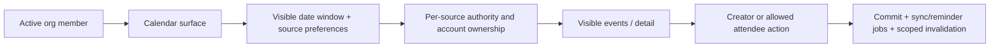

# Organization-wide calendar, private sources and bounded reads

Required acceptance and independent implementation review: [full-stack completion contract](README.md#mandatory-full-stack-completion-contract).

Status: PARTIAL — source repairs and disposable migration evidence exist; CA2/CA3
completeness, CA6 browser/provider acceptance and CA7 schema reconciliation remain open.
Historical repair baseline: root `510205f4b` + working tree / backend `ed6c7bef2` + working tree.
Rechecked 2026-09-12 at root `85dc726e9` / backend `d3bf57982` + existing working changes.
Recorded migration 1092 apply/rollback is not a production deployment.
Read root/backend/frontend `CLAUDE.md`, `architecture-refactor/AGENTS.md` and PRD index.
Own calendar module, hooks/screens and focused tests. Coordinate shared member lookup,
access baseline, integrations, schema and notifications with their lane owners.
Every active member gets the calendar surface; this does not expose private events,
other accounts' external calendars, restricted HR/CRM records or admin settings.

## Current boundary and repair summary

Calendar is a universal surface with per-record/source/account authorization. Existing
key/limit, export timezone/formula, attendee visibility and synchronization repairs
are documented once in the repair ledger below. Preserve them; they are not new tasks.

## Remaining acceptance and completed contract reference

Checked entries record implemented scope at the historical baseline, not a new
whole-flow certification. Only unchecked entries below are pending actions.

- [x] **CA1 — Universal availability with record ACL.** Trace ordinary-member baseline
  through navigation, frontend `useCan`, universal backend routes, attendee listing
  and source adapters. Fixture: member with no paid modules, owner, event creator,
  attendee, unrelated member, departed attendee and foreign org. Completion: member
  can manage permitted personal events; list/detail/export/attendees/sync endpoints
  agree on visible records; administrative settings remain privileged.
- [ ] **CA2 — Query ownership and range cost.** Map `calendar-view.tsx`,
  `use-calendar-source-visibility.ts`, `use-calendar-connections.ts` and core/external/
  CRM/HR fetches to aggregate service and source registry. Measure initial visible
  range vs prefetched adjacent months; disable hidden sources and unopened detail/
  account UI reads where correct. Fix member lookup limit semantics/key. Completion:
  canonical range/filter/source/account keys, request coalescing, cancellation and
  bounded rows/query count; do not move range data into global application boot.
  Preserve existing range limits, per-source/aggregate caps, Promise.allSettled
  isolation, sanitized partial errors and UI warnings. Test at/over caps, dense
  recurrence and narrowing the date window to retrieve omitted events; capped
  results must not be labeled complete or caps removed to satisfy acceptance.
- [ ] **CA3 — Event lifecycle.** Trace `calendar.service.ts` through event detail,
  attendees, mutations and occurrence exceptions. Test create/edit/delete, all-day,
  midnight crossings, explicit timezone, host timezone differences, DST gaps/folds,
  recurrence end, series-vs-occurrence changes, exception cancellation and RSVP races.
  Completion: same event times across supported host zones, no duplicate occurrence,
  invalid range rejected, stale edit handled and owner/attendee permissions enforced.
- [x] **CA4 — External synchronization.** Trace `external-calendar-sync.service.ts`,
  `calendar-sync-status.service.ts` and account ownership. Test revoked connection,
  duplicate/out-of-order webhook, create-success/response-loss, retry/cancel race,
  provider timeout and disconnected user. Completion: local save and remote sync
  states are distinct, retry does not duplicate, cancelled work does not reappear,
  and reconnect cannot import another user's account. Actual provider proof is a
  separate sandbox gate; preserve existing queues and idempotency mechanisms.
- [x] **CA5 — Cache writer matrix.** Enumerate create/update/delete/RSVP, attendee
  membership change, source preference, external sync and connection disconnect.
  Invalidate affected ranges/detail/attendees/source flags after commit, including
  recurrence exceptions and org switch. Completion: no stale private event after
  access loss; Redis failure cannot widen authority; display retains honest sync state.
- [ ] **CA6 — Export and UX.** Reproduce CSV timezone/formula behavior; preserve
  explicit export authority and `no-store`. Verify keyboard slots, readable typography,
  day/week/month navigation, empty/error/source-failure states, 360px and 200% zoom,
  mobile overlays and deep links. Completion: row/action remains reachable without
  mouse and no misleading event timezone or unsupported mutation action is offered.
- [ ] **CA7 — Schema/seams/cleanup.** Trace event/exception/source preference tables,
  attendee composite membership keys, indexes, reminder writers and retention. Reuse
  existing source adapter seam; distinguish internal event IDs from synthetic source
  IDs before merging types. Delete only proven dead adapters/hooks/fields after both
  repo callers, provider callbacks and migration history are checked. Completion:
  migration replay/rollback where changed plus bounded query plans in disposable DB.

## Repair record — 2026-09-12

Commands at the revision pair above. Backend `jest src/modules/calendar` + `migration-integrity`
63 suites / 639 tests exit 0 · backend `tsc -p tsconfig.build.json` exit 0 · `madge --circular src/`
zero cycles ·
frontend `jest features/calendar hooks/api/calendar components/layout lib/rbac/route-access`
66 suites / 555 tests exit 0 · frontend `tsc -p tsconfig.json` zero diagnostics in calendar,
navigation or rbac · `check-query-scope` clean. Backend jest is ts-jest `isolatedModules`
(transpile-only), so its green runs prove behaviour, not types; `tsc` is the separate gate.

| Defect | Repair | Evidence |
| --- | --- | --- |
| Detail hid a private event from an attendee the list and attendee endpoints showed | third visibility arm in `calendar-event-detail.service.ts` | removing the arm fails 4 tests |
| CSV export used server-local clock and dropped `timezone` | `calendar-export-format.ts` via existing `toWallClockUtc`; `ExportedEvent` carries the zone | timezone/DST cases |
| `csvEscape` missed `\r`; quoting is not formula neutralisation | `\r` trigger + `'` prefix for `= + - @ \t \r` | parameterised cases |
| Row cap truncated the CSV silently | service reports truncation; controller publishes **and exposes** the header; client warns | header-exposure bite |
| Revoked provider auth retried as transient, 5 retries, no reconnect prompt | terminal + `needs_reauth` in the sweep | 18 scenario specs |
| Member lookup keyed without `limit`; no-search branch ignored it | per-branch bounds, both in the key | dropping `limit` from the key fails 4 |
| Six membership writers left removed members in the picker | shared `invalidateCalendarMemberLookups` | emptying it fails 7 of 9 |
| Edit/Delete/Cancel/Unlink offered on other people's events | backend `canManage` projection, gated fail-closed | 4 frontend + 2 backend bites |
| Event times rendered in reader-local with no zone marker | canonical `formatEventTimeRange`/`formatEventDate` | 12 cases across 4 surfaces |
| Provider timezone parsed then discarded; naive Graph times anchored as UTC | parse Google `timeZone` + Graph `originalStartTimeZone`; anchor in stated zone | instant bite `19:30Z` → `14:00Z` |
| `/calendar` gated in the nav model though universal everywhere else | requirement removed; `route-access.ts` resolves universal before nav, so authorisation is unchanged | re-adding it fails the gate |
| Nav coverage gate was vacuous — **14 of 16** allowlist prefixes matched zero routes | scan widened to Home; hand-copied classifier replaced by `isUniversalRoute` | reverting the scan names all 16 |
| `/directory` root universal but one nav entry also decided its profile pages | `descendantsOnly` in the extension registry; root universal, descendants gated | root universal + descendant gated, pinned |

Two specs asserted against predicates they declared themselves — `threeArmPredicate` was a copy of
production SQL, and the list/attendees "consistency" test never loaded either service. Rewritten to
drive `CalendarEventDetailService`, `CalendarAttendeesService` and `CalendarEventSourceLoader`.
A bite proof shows a test can fail; it does not show the test touches production code.

### CA7 measured index repair — historical evidence, schema residual still open

Measured on the disposable `scratch_local` (PG18, `127.0.0.1`) as `streamline_app` with the tenant
GUC, against a seeded fixture of 3,001 events / **282,420 exception rows** across two tenants,
`VACUUM ANALYZE`d. The prior "production shape" plan had been read off an empty table.

`loadExceptionsByEvent` was **unbounded in event age**: `Seq Scan`, **4,467 buffers** — exactly
`relpages` — and *identical* at 7-, 61- and 120-day windows, so the cost was the whole two-tenant
relation regardless of the window. `CalendarConflictService` pays the same inside the create-event
write transaction. Repaired by migration `1092` (`idx_cal_exc_org_event_modified`, partial on
`modified_start IS NOT NULL`, leading `org_id` per §7): **1,470–1,729 buffers, −61% to −67%**, via a
`BitmapOr` of two index scans. Verified by applying the migration inside a transaction on
`scratch_local` and rolling it back; `indexdef` matches the measured probe. Journal entry `idx: 851`.

**The `UNION` split was measured and rejected — it is a regression here.** Without the index it
costs 5,391–5,704 buffers, *worse than the 4,467 defect*, because the second branch still seq-scans
while the first branch's index work is now paid on top; with the index it still loses (1,569–2,134)
because `BitmapOr` makes one heap pass and the `UNION` makes two. This is the inverse case
backend §7 warns about. The unindexed column was the whole defect, so
`calendar-exception-loader.ts` is unchanged. A future `UNION` rewrite would also need
`AND NOT (occurrence_start >= $s AND occurrence_start < $e)` on the second branch: the current `OR`
returns zero duplicates, a naive `UNION ALL` returns 1,035 at 61 days and 1,955 at 120.

**NEW OPEN DEFECT — `EXCEPTION_SINGLE_PASS_CAP` truncates silently at a legal span.** At the maximum
legal 120-day window (`CALENDAR_MAX_SPAN_DAYS = 120`) the predicate matched **11,191** rows against a
cap of 10,000. The load is `ORDER BY event_id ASC LIMIT 10000` with no per-event fairness, so the
caller received exceptions for **153 of 400 events and the other 247 series lost every exception** —
their cancelled occurrences resurface and their moved occurrences render at the nominal instant, with
no truncation signal. The cap's comment reasons from `CALENDAR_EVENTS_CAP` (2000) and "O(1)
exceptions per window", but the real ceiling is ids × occurrences-in-window (400 × 500 = 200,000), so
10,000 is a truncation point, not headroom. Unaffected by the index. This is the same class CA2
forbids — a capped result presented as complete — found after CA2 was ticked. **Owner: calendar lane (CA2/CA3).**
Use bounded, complete exception retrieval or an explicit incompleteness contract; preserve
cancelled/moved semantics across every affected series. Raising an arbitrary cap alone
is not completion. Add full-window regression above 10,000 exceptions and a dense
series above 500 occurrences; include tenant isolation and range-narrowing recovery.

**Schema drift recorded, not silently fixed.** `db/schema/common/calendar-events.ts` has these declaration gaps with repo migration provenance: `idx_calendar_events_org_end_date` (`0501`),
`idx_calendar_events_org_recurring_start` and `idx_calendar_events_org_start_cover` (`1000`), and
`idx_calendar_events_linked_lead_party_id` plus column `linked_lead_party_id` (`0619`). The declared
`idx_calendar_events_org_created_by_membership` also does not match the database's
`idx_calendar_events_org_creator_membership (org_id, created_by_membership_id, start_date)` from
`0658` — different name, different arity. Declaring these needs the `business_parties` composite FK,
an index-name reconciliation and a check that the installed drizzle supports `.include()`; done
carelessly it creates a future hazard. **Owner: calendar lane with schema coordinator (CA7).** The recorded generation guard
blocked 254 drifts repo-wide; that protects one generation path, not schema correctness.
Reconcile the named declarations against applied DDL and migration history in a named
disposable database. Keep the wider drift outside this lane and report it to integration.

**Two premises a re-audit would otherwise inherit wrong.** Migration `0508`'s comment says
`calendar_events` has no RLS, and an earlier pass in this lane repeated it. The live catalog on
`scratch_local` disagrees: `calendar_events`, `calendar_event_exceptions` and `event_attendees` all
have `relrowsecurity = true` with a `tenant_isolation` policy, proven by the same role failing
`42501` with no GUC. RLS lands as a `One-Time Filter` in these plans and does not block index-only
scans. The declaration gaps above remain separately owned; avoid inconsistent item counts.

⚠ `backend/.env` resolves to the production RDS instance. Live-DB probes for this lane read
`backend/.env.localstack` explicitly and confirmed `streamline_app @ 127.0.0.1/scratch_local` from
the server before running. Never let a probe pick up `.env` by default.

**CA2/CA3, CA6 and CA7 remain open.** Earlier blanket closure was invalidated by
exception/occurrence truncation and unresolved schema declarations. CA4 local repairs
have recorded tests; real provider behavior is not certified.

**Still open.** Gate 8 has no browser evidence: day/week/month at 360px, 1280px and 200% zoom across
loading/empty/error/source-failure/populated, the event Sheet at 360px, and the virtualised row
constant `FOREIGN_ZONE_EXTRA_LINE = 20`, which is reasoned rather than measured and may clip a
two-line foreign-zone string. Gate 10 has no provider sandbox: whether Composio returns Graph
`originalStartTimeZone` is unverified, so Outlook may keep `timezone: null` (no regression, no gain).
Migration 1092 was recorded as applied and rolled back on a disposable database.
The remaining Drizzle declaration reconciliation has not been completed.
`MAX_OCCURRENCES_PER_WINDOW = 500` still truncates a dense series silently for `getEvents`; only the
export seam reports it. Seven `self:*`/`mail` nav requirements were freed under root §8 alongside
`/calendar`; their own lanes should confirm.

## Verification and handoff

Reuse existing backend calendar isolation, departed-actor, timezone, DST, recurrence,
attendee and sync specs; frontend `calendar-hook-gates.test.tsx`, member lookup
consumers and calendar a11y tests. Discover paths first and inspect mock isolation.
This audit read source; it did not run a live calendar browser/provider journey.

Record per action: source→hook→route→service→table/queue→cache writer, allow/deny
result, query count/latency and screenshot. Handoff this file with exact command
results, before/after requests, deletion proof and remaining sandbox checks. Do not
mark complete because source tests pass while real sync/replay acceptance is absent.
