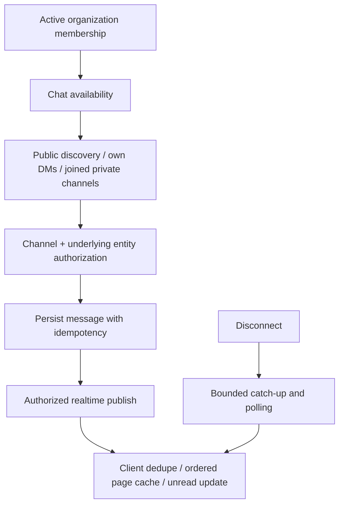

# Organization-wide chat, channel privacy and realtime cost

Required acceptance and independent implementation review: [full-stack completion contract](README.md#mandatory-full-stack-completion-contract).

Status: READY for scoped reproduction/repair; deployed database/realtime proof pending.
Read root/side `CLAUDE.md`, `architecture-refactor/AGENTS.md`, the PRD index and
the retained historical chat evidence below. This file now owns both source recovery
and stable CHAT-002/CHAT-003 proof tasks; chat.md was superseded, not completed.

Own chat API/services/hooks/UI/tests. Coordinate shared module defaults, access,
realtime provider, schema and shell integrations before edits. Chat availability
is for every active org member, not automatic membership in private channels/DMs.
Entity-linked channels must preserve the underlying project/document/entity ACL.

## Current evidence and visual boundary

`backend/src/modules/chat/chat-channels.controller.ts` uses permission-guarded reads
and writes; `frontend/hooks/api/chat-core-read.ts` gates reads on chat permissions
and some on module availability. Inspect effective baseline before claiming ordinary
members are denied. `ChatChannelsService` already receives CacheService; React Query
and realtime fallback already exist. Do not implement a second caching or chat stack.

Source-confirmed cost/UX concern: `drainChannelPages` eagerly follows up to 20 pages
for my/public/archived channel hooks. At the cap it logs and returns a plain array,
so callers receive neither nextCursor nor explicit truncated state. Repeated cursors
also return a partial array. This is bounded, not unbounded, but may create needless
requests and hide remaining channels. Inspect sidebar, combobox and forward-dialog
consumers before changing the response shape.

Current controller GET calls getEntityChannel (read-only); explicit POST calls
createEntityChannel. The historical GET-writes defect is repaired, not pending.
Entity ACL and conflict-safe uniqueness remain. Creation still lacks channel quota
admission: agree intended policy with access/billing and test concurrent last-slot
creation. Verify callers use lookup versus explicit creation appropriately.

## Ordered checklist

- [ ] **CH1 — Access matrix.** Trace navigation, module availability, permissions,
  `chat-channels.controller.ts`, `chat-messages.controller.ts`, member services and
  realtime token claims. Test owner/admin/member, no paid modules, suspended user,
  unrelated private channel, DM participant/nonparticipant and foreign org. Completion:
  all active members reach permitted chat; owners do not get implicit private DM access;
  channel/entity revocation denies HTTP, attachments, search and realtime subscriptions.
  Include loss of underlying entity access with retained channel membership: deny
  history/thread/poll and attachment access, not merely redact reference cards.
- [ ] **CH2 — Bounded discovery.** Replace eager drains where demonstrated with
  incremental paging/search and explicit hasMore/truncation/error state. Keep canonical
  query keys and compatible adapters while migrating every consumer. Completion:
  initial sidebar/selector cost does not scale with all channels, later channels remain
  discoverable, repeated cursor is surfaced safely and warm identical reads coalesce.
- [ ] **CH3 — Channel and message lifecycle.** Cover create public/private/DM/group,
  duplicate/concurrent create, invite/accept/expire/revoke, join/leave/remove, archive/
  unarchive, rename and entity channel access. Test send/edit/delete/thread/reaction,
  pin/save/forward, uploads and search with invalid/foreign IDs. Completion: idempotent
  send survives response loss, edit/delete checks author/moderator rules, removed
  membership cannot act, and saved/search/attachment projections preserve privacy.
- [ ] **CH4 — Realtime reconciliation.** Trace `chat-realtime.controller.ts`,
  `frontend/hooks/api/chat-realtime.ts`, existing sender-spoof tests and message cache
  writes. Test duplicate/out-of-order events, echo of optimistic send, reconnect gap,
  >one catch-up page, transport offline and org switch while events are in flight.
  Completion: one displayed message per server identity, ordered history, no lost
  catch-up page, no stale channel subscriptions or polling while healthy realtime
  already supplies the same data. Presence/typing expiry must not become durable truth.
  Current useChatPoll sends only since; use-message-panel-data ignores cursor/hasMore
  and advances to client wall-clock after invalidating history. Backend poll supports
  stable positions. Test multi-page downtime, clock skew, arrivals during recovery
  and failed history refetch before advancing. Invalidation may recover some cases;
  reproduce actual loss. Test offline edit/delete-only changes: forward-only polling
  misses historical changes and consumer refreshes only on new messages. Use bounded
  reconciliation, not simply removal of the backend deletion filter.
- [ ] **CH5 — Cache/invalidation ownership.** Matrix: channel members/settings/list,
  messages/page cursor, unread/read marker, presence, search and entity access. Scope
  by org/actor/channel and version as required. Test removal/leave/archive/read/send
  from another tab and Redis unavailable. Completion: correct badges and read markers,
  bounded TTL/cardinality, post-commit invalidation and no cache bypass of channel ACL.
- [ ] **CH6 — Complete read/create integration.** The GET/POST split is implemented.
  Verify migrated callers and prefetch: lookup stays read-only, explicit creation is
  authorized and idempotent, and existing channels retain compatible response shapes.
  Agree and test entity-linked channel quota behavior with access/billing, including
  concurrent last-slot creation; retain existing entity ACL and conflict protection.
- [ ] **CH7 — UI and cleanup.** Audit sidebar vs conversation vs settings ownership,
  deferred dialogs/threads, keyboard composer, pending/retry send, unread indicators,
  responsive typography, 360px/200% zoom, upload errors and long-channel pagination.
  Reuse existing shell/token primitives. Trace barrels, runtime registrations, provider
  events and migration consumers before deleting duplicate hooks/types/endpoints.
  Completion: screenshots and focused UX tests, deletion proof and no hidden navigation
  regression; file count alone is not a reason to split or delete.

## Verification and handoff

Inspect and reuse `frontend/hooks/api/__tests__/chat-hook-gates.test.tsx`,
`chat-realtime-channel.test.tsx`, `chat-realtime-sender-spoof.test.tsx` in that directory,
`frontend/hooks/api/chat-idempotency.test.tsx`, existing backend controller/service
specs and CHAT-002's database probe below. Run only isolated fixtures locally;
real database/Ably/provider journeys need named disposable resources.

Record first-load/warm request count, messages and channels dataset, reconnect catch-up
cost, cache writer matrix and allow/deny results. No deployed chat was exercised in
this audit. Return exact changes, tests/exit codes, removal proof, compatibility plan
and unresolved database/realtime proof in this file; coordinator owns final integration.

## Consolidated historical evidence and stable release tasks

The following unique evidence/tasks were moved from chat.md, which is superseded.
Historical passes are not current execution proof; CH1–CH7 remain the source-recovery
checklist, and CHAT-002/003 below own database and final revision binding.

Historical proof-lane scope: test/evidence drift and entity-action dialog accessibility
were repaired. Real-PostgreSQL proof and final revision binding remain outstanding;
this does not close the broader CH1–CH7 recovery checklist.

Completed source and focused checks (2026-09-10):

- CHAT-001: entity-channel harness repaired and 12/12 passing. The existing-channel case now
  requires HTTP 200 and cannot pass on a malformed-fixture 500. Final release revision binding
  remains in CHAT-003.
- CHAT-004: both provider documents describe retired TURN/ICE and the current Composio →
  Google Calendar → browser Google Meet boundary; the replacement's approval stays unsigned.
- Additional acceptance repairs: message/idempotency mocks supply the real transaction surface,
  XSS coverage requires a successful sanitized write, and the entity-action dialog includes an
  accessible description. Timeline sender selections now consume the existing canonical
  identity-only projection; five focused suites / 47 tests pass.

Evidence: [current Chat checks](../final-refactor/evidence/42-production-ops/release-authority/CHAT-EVIDENCE-2026-09-09.md).

## CHAT-002 — Make the read-path index assertion fixture-safe
Status: BLOCKED-EXTERNAL
Maps to: PRD-C128, PRD-C129
Parallel group: 1
Depends on: none
Owner: chat agent

Scope: The exact-index test fixture in `chat-read-path-hardening.db.spec.ts` now clones the live
index portfolio into a transaction-local temporary table, seeds a four-tenant pending/sent/cancelled
mix, analyzes it, checks 20 due rows and asserts the intended index. The production index is unchanged.
The suite was attempted and refused before running any tests because no approved disposable
PostgreSQL database is configured in this environment.

Completion: The database-backed assertion proves the intended index-served path without relying on an unrealistic all-identical fixture, and the focused DB suite passes.

## CHAT-003 — Reconcile current Chat evidence
Status: FINAL-INTEGRATION
Maps to: PRD-C127, PRD-C128, PRD-C129, PRD-C156
Parallel group: 2
Depends on: CHAT-002
Owner: chat agent

Scope: Current focused totals and the F2/governance reconciliation are recorded in
`CHAT-EVIDENCE-2026-09-09.md`. Complete the database proof and bind the final root/backend/frontend
revisions plus shared type/cycle/contract gates after lane integration.

Completion: Every claimed command is reproducible at the recorded root/backend revisions and no resolved finding remains described as open.
