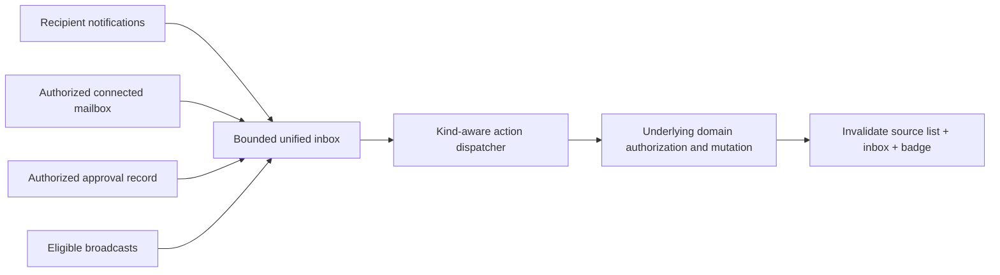

# Organization-wide inbox and notification delivery

Required acceptance and independent implementation review: [full-stack completion contract](README.md#mandatory-full-stack-completion-contract).

Status: PARTIALLY IMPLEMENTED — IN2/IN5 SOURCE REPAIRS AND RELEASE PROOF REMAIN.
Reconciliation found gaps despite historical green suites; the checklist below is
authoritative. Browser/provider evidence and final integration remain pending.
Read root and side `CLAUDE.md`, `architecture-refactor/AGENTS.md` and the PRD index.
This is the unified personal inbox at `/inbox`, including notifications, eligible
mail and Build approvals. It is not a merger of CRM/support queues or shared access
to everyone's mailbox. Every active org member may open the surface; each source
still enforces recipient, mailbox and underlying-record authority.

Own notification/unified-inbox services, matching hooks/UI/tests. Coordinate mail,
Build approval, shared realtime/provider, schema and access edits with their owners.
Do not change Build product UX or add a second delivery framework.

## Source map and current architecture

| Boundary | Sources |
| --- | --- |
| Universal authenticated API | `backend/src/me/inbox.controller.ts`; `backend/src/me/dto/inbox-response.schemas.ts` |
| Source merge / bounded paging | `backend/src/modules/notifications/unified-inbox.service.ts`, `unified-inbox-sources.ts`, `unified-inbox-projections.ts`, `dto/unified-inbox.schemas.ts` |
| UI / action dispatch | `frontend/features/notifications/unified-inbox/inbox-shell.tsx`, `inbox-item-card.tsx`, `use-inbox-actions.ts`, `inbox-virtual-list.tsx` |
| Queries / optimistic writes | `frontend/hooks/api/inbox.ts`, `notifications-inbox.ts`, `notifications-inbox-cache.ts` |
| Stream / recipients | `frontend/features/notifications/use-notification-events.ts`; `backend/src/modules/notifications/notification-dispatch.service.ts` |
| Mail / approval authority | `backend/src/modules/mail/mail.service.ts`; `backend/src/modules/build/approvals/build-approvals-inbox.service.ts` |

Existing implementation has per-source permissions, stable merge/deduplication,
bounded source fetches, a repaired trimmed-mail cursor, a virtualized list, offline
mutation gating and cached notification queries. Preserve them. Mail unread counts
already use the metadata mirror when fresh and bounded provider fallback when cold.

## Authoritative remaining checklist

- [ ] **IN2 — Repair nonmonotonic ordering across complete pagination.** Numeric timestamp ties are repaired, but source pages remain ID-descending while merge sorts timestamps. Current `unified-inbox-ordering.spec.ts` supplies id10=newest, id30=middle, id20=oldest at limit 2: page one delivers 10/30 then lowestDeliveredId advances below10, excluding undelivered20. Extend that fixture through exhaustion before repair. Align source/merge continuation without dropping rows; test mixed kinds, equal times, account-qualified mail IDs, deleted cursors and append while paging.
- [ ] **IN5 — Apply snooze consistently to unified feed and badge.** Regular NotificationsReadService has a snooze predicate, but `unified-inbox-sources.ts::fetchNotificationItems` and `unified-inbox.service.ts::countNotificationUnread` still omit it. Reuse the agreed active-inbox predicate; verify snooze→refetch→fresh session→deadline, counts, archive semantics and due refresh. Optimistic removal cannot replace durable visibility rules.
- [ ] **IN3/IN6 — Integrated failure and cache proof.** Preserve repaired per-source failure status and unchanged failed-source cursor. Test timeout→healthy-source paging→recovery, mail partial account failure and no repeated-cursor request loop. Capture shell/bell/inbox stream ownership and all list/detail/count writers; prove rollback, reconnect, org switch and external mail sync invalidate only authorized recipient data.
- [ ] **IN4/IN7 — Disposable browser and authorization acceptance.** Verify owner/admin/member, no-mail/no-Build member, null principal, suspended/left and foreign org against direct read/action URLs. Exercise all item kinds with colliding IDs, keyboard, 200% zoom, loading/empty/denied/degraded/populated states, offline/load-more and pending kind+ID. Preserve record authority and encoded deep links.
- [ ] **Release/data proof.** Measure cold/warm page and badge requests, DB/provider fanout and final revision-bound type/cycle/contract checks. Verify existing snooze/read/recipient data and rollback even without a migration; gate 4 is not automatically N/A. Real provider/DB/browser writes require named disposable resources. Record exact unresolved prerequisites.

## Implemented baseline to preserve

The completed task prose is consolidated into the historical outcome table below.
IN1 kind dispatch, timestamp-tie ordering, explicit unreadOnly source policy,
per-source failure isolation, universal entry, regular notification snooze,
stream invalidation and component/deep-link repairs remain regression requirements.
The IN2/IN5 qualifications above override earlier blanket completion wording.

## Acceptance and handoff

Start with existing `frontend/features/notifications/unified-inbox/*.test.tsx`,
`frontend/hooks/api/notifications-inbox*.test.ts` and backend unified-inbox/notification
tests discovered with `rg --files`. Inspect fixtures before running; no live email,
provider connection or DB mutation without a disposable environment. Add behavioral
regressions for IN1–IN6 rather than source-regex checks alone.

Cache matrix in handoff must include recipient/membership, org, kinds/filter/cursor,
mail account, access version, TTL, stream invalidation and each mutation writer.
Record initial/warm HTTP requests and source DB/provider fanout for one page and badge.
Existing UI test coverage is not a new runtime pass. No deployed journey was run in
this audit. Return changed paths, removal proofs, command results, screenshots and
remaining runtime checks in this file; coordinator owns final release integration.

## Outcome 2026-09-12

### Response contract v2

`SourceStatus` gained `available: boolean` (false only when an *included* source's
read failed or timed out and so contributed zero items; true for every not-included
source) and `error: string | null` (a fixed non-sensitive vocabulary — `timeout`,
`source unavailable`, `<n> of <m> mail accounts unavailable` — never a provider
message or record content). `UnifiedInboxResponse` gained `degraded: boolean`.
`hasMore` is now `trimmed || degraded`, so a partially degraded source cannot report
the page exhausted while rows the reader never saw are still missing. The duplicated
Zod schema was consolidated into `dto/unified-inbox.schemas.ts` with `z.infer` types;
`me/dto/inbox-response.schemas.ts` is now a re-export.

`unifiedCountResponseSchema` was missing `total` and `mailExact`, which the service
returns. `ResponseContractInterceptor` throws `ResponseContractViolation` when
`enforcesResponseContracts(NODE_ENV)`, so this was a live 500 waiting on that env.

### What each item landed

| Item | State | Evidence |
| --- | --- | --- |
| IN1 kind identity | REPAIRED | Broadcast click called `PATCH /notifications/<broadcastId>/read`, mutating an unrelated notification of the caller's own, and the drawer looked rows up by bare numeric id across two tables with independent sequences. Dispatch is now on the discriminated kind and passes the whole typed item; broadcasts use the existing `POST /broadcasts/:id/dismiss` (`@Universal()`, `onConflictDoNothing`). Build-approval navigation preserved, approve/reject deliberately not wired to it. |
| IN2 ordering/cursor | PARTIAL — tie repaired; nonmonotonic continuation OPEN | `stableSortItems` broke ties with `String(id).localeCompare` while every source pages numeric `id DESC`; at equal timestamps ids 9/10 at `limit 1` delivered 9 and then asked `id < 9`, so 10 was never delivered to anyone. Tie-break is numeric-aware and each source cursor advances to the *minimum* id delivered for that kind. |
| IN2 `unreadOnly` | DEFINED | All-source semantics: notifications by predicate; broadcasts and approvals are unread by construction; mail is not filterable without an unbounded provider scan, so it is excluded and reported `reason: "unsupported: unreadOnly"` rather than silently returning read mail. |
| IN2 broadcast read | NO CHANGE NEEDED | `isRead: false` is truthful — `listInboxPage` LEFT JOINs `broadcast_read_receipts` and keeps only receipt-less rows. No receipt table invented. |
| IN3 failure isolation | REPAIRED | Sources ran under `Promise.all`, so one failure lost the caller's own healthy notifications, and `fetchMail` discarded the `accountErrors` `MailService` already returns. Now per-source isolation with bounded timeouts, mail account errors surfaced, and a failed source never advances its cursor. |
| IN4 universal entry | VERIFIED | `/inbox` has no `requiredPermission` and no module gate (`sidebar-home-nav.ts:16`), backend `InboxController` is `@Universal()`. Negative specs added for no-mail/no-approvals member, null membership principal, and cross-tenant. |
| IN5 snooze | PARTIAL — regular notification reads repaired; unified feed/count OPEN | `snoozedUntil` was written by lifecycle and projected by the read service but **no predicate anywhere excluded it** — snooze was inert. Predicate added to list and unread count; `ARCHIVED` deliberately still shows snoozed rows. |
| IN5 delivery lifecycle | VERIFIED, NO CHANGE | `drainAfterCommitHooks` runs only after `withTenant` resolves, so a rollback emits no delivered side effect. Retry keeps recipient scope via 500-row outbox chunks, `FOR UPDATE SKIP LOCKED` leases and `MAX_ATTEMPTS = 5`; duplicate delivery is fenced by `buildNotifIdempotencyKey`. Snooze already emits `count_changed` and invalidates its cache namespace, consistent with its siblings — the assertion for it was missing and was added. |
| IN6 cache/stream | REPAIRED | The SSE stream invalidated only the bell, so a notification arriving while the reader sat on `/inbox` raised a toast over a list that never refreshed. `invalidateNotificationInbox` extracted as one writer used by both the hook and the stream. Delete and bulk-delete now remove from the unified feed like every other mutation. |
| IN7 UX/cleanup | CLOSED at component level | Row identity keys on the server's `dedupKey`; pending state gated on kind *and* id; fixed 96px rows replaced with `useDynamicRowHeight` (measured height passed through to `List`, re-measure keyed on the item set). Keyboard: all four row variants are native buttons with accessible names, and Enter/Space/click fire the same handler with the same item; Load-more is focusable and genuinely `disabled` offline and while fetching. **200% zoom pixel rendering is unverified — jsdom only, no browser.** |
| IN7 deep links | REPAIRED | `handleMailClick` concatenated provider-supplied mail ids raw, so an id containing `&` split into a bogus parameter and one containing `#` truncated into the URL fragment — `id&withAmpersand` arrived as `id`, opening the wrong message or none. Now built with the existing shared `toSearchParams` (`lib/route-search-params.ts`); no new query-string helper was written. |
| IN7 partial degradation | REPAIRED | `unavailableSources()` skipped every source with `available: true` regardless of `error`, so the "2 of 3 mail accounts unavailable" case — precisely the one that used to report the page exhausted — raised no banner at all. The predicate now lives once in `inbox-sources.ts` as `degradedSources()`; a first fix that duplicated the fold in `inbox-shell.tsx` was consolidated away. |
| IN7 cleanup | DONE, with proof | `platformCoreQueryKeys.inbox.list` and `.count` deleted. Proof is a property scan run from the repo root across both repos in both access forms, carrying a positive control (`inbox.unified(` → 6 hits, so pattern and paths work; `inbox.list(`/`inbox.count(`/bracket forms → 0). This is static reference evidence, not proof against every computed property or external consumer. Backend `GET /me/inbox` and `GET /me/inbox/count` were **kept** — an authenticated API's external consumers cannot be proven from inside this repo; that is an owner decision. |

### Commands run

| Command | Result |
| --- | --- |
| backend `jest src/modules/notifications src/me --runInBand` | 62 suites / 390 tests pass, exit 0 |
| backend `tsc -p tsconfig.json --noEmit` | 0 errors in this lane |
| backend `madge --circular --extensions ts src/` | 0 cycles |
| frontend `jest features/notifications hooks/api/notifications-inbox hooks/api/mail hooks/api/inbox.test.ts …` | 25 suites / 111 tests pass, exit 0 |
| frontend `tsc -p tsconfig.json --noEmit` | 0 errors in this lane |
| frontend `pnpm run check:test-typecheck` | 0 errors in this lane (8 found and fixed) |
| frontend `madge --circular --extensions ts,tsx` | 0 cycles |

`frontend/tsconfig.json` excludes `**/*.test.ts(x)` and `**/__tests__/**`, and
`next/jest` transpiles through SWC with no diagnostics, so a green jest run plus a
green `type-check` proves nothing about whether tests still match the contracts.
`check:test-typecheck` is the only gate that sees it, and it caught 8 real errors
this lane introduced — two of them in **mail** tests that no inbox-owning agent
would have opened.

### Open — not closed by this work

- **Gate 8 (UI/UX) and Gate 10 (operations) are BLOCKED — and the reason is specific.**
  The earlier run reported a production-backed backend despite NODE_ENV=development;
  configuration safety was not rechecked during this reconciliation. The journeys
  (mark read, dismiss broadcast, approve, archive) write data. Use approved disposable
  resources; never infer safety from NODE_ENV or an existing running service.
  Unblocking needs explicitly approved disposable resources with safe database/provider configuration, not merely a tenant created inside production. Consequently there are
  no screenshots for loading/empty/error/denied/degraded/populated, no keyboard or
  200%-zoom observation beyond jsdom, and no deployed journey or provider sandbox.
- **No measured request cost.** Cold/warm HTTP counts and source DB/provider fanout
  for one page and one badge were not measured; that needs a safe running app.
- **Backend `GET /me/inbox` and `GET /me/inbox/count` retained.** No frontend caller
  remains, but an authenticated API's external consumers cannot be proven from inside this
  repo. Owner decision, deliberately not taken here.
- **`notification-card.tsx` activator button has no explicit `aria-label`**, deriving
  its name from visible text. Valid but inconsistent with the mail/approval cards.
- Gate 4 still applies to existing data correctness: snooze/recipient/read predicates and rollback need verification even though no migration was written.

### Concurrent-tree caveat

Other sessions were editing this working tree throughout. Pre-existing failures that
are **not** this lane's and were deliberately left alone: `workspace-onboarding-tenant-isolation.spec.ts`
(2 backend type errors, file uncommitted-modified elsewhere), `chat-channel-page-budget.test.tsx`
and `calendar-external-contract.test.ts` (14 test-type errors, both untracked files
from another session). A frontend `plan-tab.tsx` error present mid-session was gone
by the final run, and `.next/dev/types/routes.d.ts` churn appeared from a concurrently
running dev server — neither is a signal about this lane.

### Current focused reconciliation

Backend ordering and partial-availability suites passed alongside people decline-seat and
acceptance-recovery suites: four suites / 59 tests, exit 0. Exact command is preserved in
[people reconciliation](recovery-people-invitations.md#current-reconciliation-check).
Fixtures/configuration were inspected; no env, DB or provider used. Ordering tests currently
miss the full-scroll counterexample above; their pass does not close IN2/IN5.
