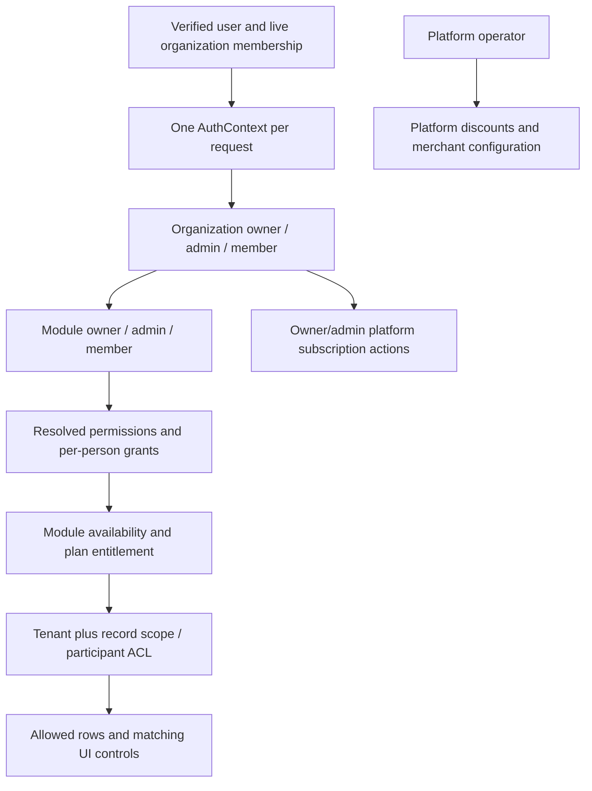

# Recovery: organization access, module standing and platform billing

Required acceptance and independent implementation review: [full-stack completion contract](README.md#mandatory-full-stack-completion-contract).

Status: IMPLEMENTED-VERIFICATION-PENDING as of 2026-09-12. Source repairs landed for AB-01 to AB-08 and AB-10 to AB-12; AB-09 stays open. No live payment, browser, or database evidence is claimed.

## Start here

Claude: execute this file as the task. Read root, backend and frontend `CLAUDE.md`, this directory's `README.md`, and ADRs 0004, 0005 and 0006 before editing. Work from current source, preserve concurrent changes, and update this file with evidence after each completed item. Paths below are relative to repository root. Do not interpret historical passing tests as completion of a customer journey.

Outcome: a newly created organization's active owner can see the correct subscription, purchase it using StreamlineOS's configured platform payment account, and receive the purchased term exactly once. Organization and module permissions remain consistent across UI, API, records, caches, background jobs and organization switching.

Scope: platform subscription billing and access governance. The earlier PayPal mention was a typo. Do not add a provider, redesign customer invoicing, or require each customer to create a merchant account merely to pay StreamlineOS.

Work in small reviewable patches: AB-01/02 billing blockers, AB-03 payment integrity, AB-04 commercial authority, AB-05/06 access, AB-07/08 lifecycle and caches, AB-09 cleanup and acceptance. Do not batch all into a speculative refactor.

## Findings verified against current source

| ID | Evidence and implication | Certainty |
|---|---|---|
| AB-F01 | `billing/core/billing.service.ts:getSubscription` and `billing-payment-activation.ts:createOrder` call `PaymentProviderResolver.resolveConfigured(orgId)`. `billing/payments/payment-provider-resolver.service.ts` reads tenant `paymentProviders`, then tenant encrypted credentials; no rows returns undefined. `frontend/features/billing/components/plan-card.tsx` disables Upgrade on `!isConfigured`. `backend/src/config/env.validation.ts` accepts `RAZORPAY_KEY_ID/KEY_SECRET`, but production billing resolution does not consume them. Configured platform env alone cannot enable a fresh tenant's checkout. | Source-confirmed path; actual user's rows/network response not inspected. |
| AB-F02 | `PlanTab.handleUpgrade` creates an annual/coupon order but confirms only order/payment/signature/plan. `VerifySubscriptionInput` omits cycle/coupon; server confirmation defaults to monthly. An annual purchase is activated for one month on this path. | Source-confirmed contract mismatch; no charge made. |
| AB-F03 | `BillingPaymentActivation.createOrder` does not persist an authoritative purchase binding. `verifyAndActivate` verifies HMAC over order/payment but chooses plan, period and coupon from caller and reprices at confirmation. No captured amount/currency/order-tenant lookup binds activation to purchase. It records undiscounted current price. | Source-confirmed integrity gap; prior foundation finding remains pending. |
| AB-F04 | Confirmation catches almost any unique violation and returns success with the submitted plan, without verifying the stored payment and organization outcome. Credit grant follows the inner transaction callback, but HTTP calls still have an ambient `TenantContextInterceptor` transaction; this is not proof the subscription committed. `ExternalEffectLedger` claims/finalizes in separate transactions while invoking its callback in caller context. Duplicate confirmation returns before credit grant. | Source-confirmed branches and transaction boundaries; actual durable crash/retry outcome requires fault injection across ambient commit, ledger and credit writes. |
| AB-F05 | `BillingController` permits coupon creation with `billing:coupons:manage`; active org owners/admins receive the product catalog in `access-permission.resolver.ts`; `BillingCoupons.create` creates a tenant coupon redeemable against that same tenant's platform subscription. This lets the customer author their own platform discount. | Source-confirmed authority error; not an invitation to test on production. |
| AB-F06 | `PlanTab` injects checkout script without loaded/error state, constructs `window.Razorpay`, and hardcodes `currency: "INR"` despite the order's currency field. `PlanCard` prices from static catalog and hardcodes annual `0.8`; activation uses versioned catalog prices. Coupon validation uses static monthly prices. | Source-confirmed readiness and pricing inconsistencies. |
| AB-F07 | `PaymentProviderResolver.resolveConfigured` selects the first resolved provider even if runtime `isReady()` is false; it does not continue to another ready provider. It repeats a provider lookup after reading the provider list. | Source-confirmed; primary/fallback semantics must be explicit. |
| AB-F08 | `seat-definition.ts:seatCount` counts every membership plus live pending invitations, whereas `MEMBER_DEACTIVATED` ledger delta is -1. Determine whether the departure path deletes the row before calling this a quota discrepancy; never assume suspension frees a seat. | Audit discriminator, not confirmed defect. |
| AB-F09 | `billing-profile.service.ts:get` performs SELECT then INSERT without conflict handling when absent; concurrent first profile reads can race. `updateBillingProfileSchema` also accepts `isTaxExempt` from a customer editor; trace tax consumers before deciding whether this is verified status or an unsafe self-attestation. | Read/write race source-confirmed; tax authority impact requires consumer trace. |

Actual RBAC evidence: `AccessPermissionResolver.computeUserPermissions` grants active structural owner/admin catalog access; a missing billing button is not proof the owner needs another role. `access-policy.ts` filters platform-only keys separately. No application claim of missing caching is justified: access is versioned and cached, plan tier uses Redis (30 seconds), entitlements use Redis (60 seconds), frontend subscription uses Query (5 minutes).

## Route, source and test map

Backend paths in this table start at `backend/src/`; frontend paths start at `frontend/`.

| Flow/routes | Source chain to inspect | Existing tests to extend |
|---|---|---|
| `/settings/billing`; `GET /billing`, `/billing/plans`, `/billing/summary` | `features/billing/billing-settings-page.tsx`, `components/plan-tab.tsx`, `components/plan-card.tsx`; `hooks/api/subscription.ts`; `modules/billing/core/billing.controller.ts`, `billing.service.ts` | frontend `features/billing/billing-mutation-gates.test.tsx`, `hooks/api/__tests__/billing-hook-gates.test.tsx`; backend `billing/core/billing-provider-contract.spec.ts` |
| `POST/PATCH /billing/checkout` | same hooks; `billing-payment-activation.ts`, `dto/billing.schemas.ts`; `billing/payments/payment-provider-resolver.service.ts`, `adapters/razorpay.adapter.ts` | `billing/core/billing-price-currency-pairing.spec.ts`, `billing-proration-wiring.spec.ts`, `billing/payments/payment-provider-resolver.spec.ts` |
| `/billing/coupons`, `/billing/coupons/validate` | `billing.controller.ts`, `billing-coupons.ts`, `coupon-pricing.ts`, `billing-activation-recorders.ts` | `billing/core/coupon-tenant-isolation.spec.ts`, `coupon-pricing.spec.ts`; add customer-vs-platform authority regression |
| `/billing/entitlements`, `/billing/seats` | `plan-limits.service.ts`, `billing-account-overview.ts`, `seat-definition.ts`, `seat-ledger.service.ts` | `plan-tier-cache-multi-instance.spec.ts`, `plan-limits.service.spec.ts`, `seat-ledger.service.spec.ts` |
| `GET /me/access`; guarded application routes | `hooks/api/access.ts`, `lib/rbac/permission-gate.ts`; `common/auth/auth-context*`, `modules/access/access.service.ts`, `access-permission.resolver.ts`, `authorize.ts`, `scoped-read.ts` | `access/access-membership-authority.spec.ts`, `access/__tests__/org-only-keys-never-resolve.spec.ts`, `request-authorization-composition.spec.ts`, `warm-cold-parity.spec.ts` |
| `/module-access/:moduleKey`, member grants and standings | `modules/module-access/module-access.controller.ts`, `module-standing-mutations.service.ts`, `user-permission-grants.controller.ts`, `module-access-ownership.service.ts`; discover current frontend consumers with `rg` | `module-access/__tests__/authority-matrix.spec.ts`, `standing-mutations.spec.ts`, `user-permission-grants.spec.ts`, `standing-grantability-agreement.spec.ts` |
| Ownership transfer and organization bootstrap | `modules/ownership/ownership-transfer-apply.ts`, `ownership-transfer-response.service.ts`; `modules/organization/core/bootstrap-cell-organization.ts` | `ownership/__tests__/ownership-transfer-lifecycle.spec.ts`; recovery-org-setup.md owns bootstrap integration |
| Provider webhook and billing lifecycle | `billing/core/billing-webhook.handler.ts`, `billing-webhook-effects.ts`, `provider-event-ledger.ts`; `modules/cron/cron-billing-*` | `billing/core/billing-webhook.spec.ts`, `provider-event-ledger.spec.ts`, `cron/__tests__/billing-lifecycle-scheduling.spec.ts` |

## Visual authority contract

| Standing | Subscription purchase | Module administration | Ownership lifecycle |
|---|---|---|---|
| Active organization owner | Yes, configured platform checkout | All available modules | Organization owner transfer; module lifecycle according to canonical policy |
| Active organization admin | Yes | All available modules | Cannot impersonate owner or transfer organization ownership |
| Module owner | No from this standing | Owned module | Canonical module ownership service only |
| Module admin | No | Administered module within grantor authority | No owner escalation |
| Organization/module member | No | Own held actions only | None |
| Suspended/deleted/nonmember | No | None | None |

The organization role and module standing are independent. Individual grants survive a role change; they are not a new role. A `none` grant is not automatically a deny override in a union resolver. Existing `user_module_access` narrows eligible non-admin module access; it must not remove universal member communication or override structural organization administration. Platform operator is a separate administrative identity, not a seventh customer standing.

## Executable checklist

- [x] AB-01 Capture a fresh owner's route, visible CTA state, redacted `GET /me/access` scopes and `GET /billing` readiness. Distinguish hidden CTA, disabled CTA, API 403, configuration 503, script failure and provider rejection. Reproduce with mocked tenant provider rows absent and fake configured platform credentials; do not print env values. If owner's billing scopes exist, do not repair roles to solve a readiness issue.
- [x] AB-02 Give platform subscriptions an explicit platform merchant configuration boundary, reusing the adapter and validated server config. Align subscription webhook signature verification/redrive with the same platform merchant and resolve tenant from the authoritative purchase, not URL/notes alone; current webhook handler also resolves tenant credentials. Keep tenant merchant collection isolated; do not add a fallback that charges a different tenant account. Inspect existing platform configuration ownership first. Return safe readiness reasons, disable with actionable support text, load checkout script once with loading/failure/retry, use the server order's currency, prevent repeated clicks while an order/modal is active. No live provider call is needed to implement this.
- [x] AB-03 Persist/reuse an authoritative pending purchase containing tenant, merchant/provider/environment, immutable plan/cycle, catalog version, amount/currency and discount before activation. Bind callback/webhook to that purchase and verified captured payment; never trust submitted plan/cycle/coupon, and never treat HMAC alone as a captured-amount check. Reject cross-org/order substitutions, wrong merchant/environment, mismatched amount/currency and unpaid/invalid attempts. Reconcile verified capture arriving after local expiry/cancellation under the agreed fulfillment/refund policy; never silently strand captured money. Lock/conditionally transition once; duplicate success must return the actual stored outcome. Store/replay durable activation and credit effects with existing outbox/effect ledger; do not hide unrelated unique violations. Handle callback-before-webhook, webhook-before-callback and capture with no browser callback at all. billing-webhook-effects.ts currently grants captured AI packs but has no subscription activation branch: converge both inputs on one purchase transition. Fault-inject around outer HTTP commit, credit writes and separately committed effect-ledger completion; inner transaction return is not durable commit proof.
- [x] AB-04 Move platform promotion creation/update/deletion to existing platform-operator authority. Customer owners/admins may redeem authorized promotions but cannot mint their own subscription discount. Preserve existing rows/history; inventory usages and reconcile legacy tenant-created promotions deliberately. Validate eligibility, amount, period and currency from the same purchase quote; reserve/consume coupon usage atomically. Verify refund/cancel policy does not silently restore a single-use code. PlanTab currently selects a plan only inside handleUpgrade while coupon validation needs one: allow plan/cycle selection and promotion validation before the first order, revalidating on selection change. Test first-attempt discounted checkout. Do not alter customer-invoicing discounts.
- [x] AB-05 Verify all six standings with two organizations: new owner, owner transfer, admin demotion, module-owner transfer, module-admin removal, ordinary member, invited-not-accepted user and removed/rejoined membership. Trace structural owner flags from bootstrap through live membership and access snapshot. No new role-creation UI. Preserve existing role assignments during any fixed-standing migration; inventory legacy role data before deciding it is dead. Test direct role, group, personal grant and expiring delegation paths; grantors cannot self-escalate, delegate billing, cross modules or grant beyond held authority. Use canonical module vocabulary so Home's mail/chat/calendar namespaces agree.
- [x] AB-06 Verify list, detail, mutation, export, attachment and background access for representative own/all/none cases; a held permission is not object membership. `ScopedRead` installs tenant and scope; no cast or dropped predicate. ADR 0005 currently documents team behaving as own without materialized team data: either hide unsupported team choices or implement one approved tenant-scoped team contract with tests, not a misleading broader label. Verify disabled product and per-user module deny against API and all navigation surfaces. Inbox/calendar/chat remain available to active members while private objects retain ACLs.
- [x] AB-07 Test trial start/expiry, missing subscription (FREE), active STARTER/PROFESSIONAL/ENTERPRISE, payment failure, PAST_DUE grace, expiry, cancellation, renewal and downgrade using a fake clock. Trace cron-produced states against `resolveTier` (which currently does not read `currentPeriodEnd` for ACTIVE); specify the existing grace policy before changing it. Same-plan ACTIVE card currently disables purchasing: verify whether renewal/cycle-change is actually supported or falsely described as automatic renewal. Paid activation must retain annual term and agreed price; downgrade preserves data and core communication. Test January 31/leap-day/month-end terms under the agreed anniversary policy. billing-webhook-effects.ts sends every payment.failed to billing-payment-state.ts, which picks an ACTIVE subscription without purchase/period association: failed AI-pack purchases or delayed unrelated failures must not mark subscriptions PAST_DUE. Validate seats against pending/expired/cancelled invites, employee without login, suspension/removal/reactivation, guests, enterprise negotiated seats and parallel last-seat admission.
- [x] AB-08 Apply the cache matrix below. Measure cold/warm request and query counts; use shared Query hooks with their existing actor/tenant hash, not global component state. Do not add cache to correctness-sensitive membership/quota/payment transition checks. After purchase, invalidate frontend access/module visibility as well as subscription/summary/entitlements/seats where those depend on tier; after webhook reconciliation, refresh the user's status with bounded polling/realtime and stop at terminal state. Keep reads during refresh visible; never render configuration failure merely because access is still loading.
- [ ] AB-09 Search source, exports, route registration, dynamic imports, test fixtures, schema relations and migration journal before deleting or merging a file. Consolidate duplicate contract types in `hooks/api/subscription.ts` against existing schema-derived contracts; verify static pricing duplicates in `lib/pricing.ts`, `PlanCard`, plan catalog and coupon validation before choosing their canonical owner. Remove stale route comment in `PlanCard` naming retired `/billing/subscription/order` only alongside verified checkout work. Do not delete provider resolver/adapter, seat ledger, access cache or durable payment history because a path looks redundant. Record each removal and replacement.
- [x] AB-10 Make first billing-profile access race-safe using the existing unique tenant contract; prefer a side-effect-free default read or atomic upsert where required. Trace `isTaxExempt` through invoice/tax calculations and platform/customer edit boundaries; customer-supplied status must not silently become platform-verified exemption. Test concurrent first reads, profile validation and cross-tenant access without legal/tax policy invention.
- [x] AB-11 Coordinate people P3's expired-invitation reservation under the canonical member-quota lock. Test another invite taking the last seat and concurrent resends; people owns the resend implementation and this lane owns the shared seat definition.

- [x] AB-12 After checkout blockers, trace `billing-marketplace.ts` catalog consumers:
  listAddons advertises storage unavailable to its purchase handler and the retired
  `/billing/ai-credits` route. Prove visible consumption, remove unsupported promises
  and use `/settings/billing/ai-credits` with contract tests. Preserve order history;
  do not build storage to justify a stale catalog entry.

## Cache authority and invalidation

| Data/cache | Authority and key | Required invalidation/proof |
|---|---|---|
| Frontend access, 30s | `GET /me/access`; canonical Query key; Query hash includes actor/org | Role/group/grant/deny/ownership/membership changes; expiry cap; organization switch remount; no cross-actor hydrated response |
| Backend effective access | `access_versions` plus tenant/actor/version; existing local and Redis caches | Same-transaction version bump, postcommit invalidation; prove a second backend instance rejects revoked access; request context remains per-request |
| Tier 30s, entitlement payload 60s | `subscriptions`; `billing:tier:${orgId}`, `billing:entitlements:${orgId}` | Activation, webhook, enterprise quote, downgrade/cancel/expiry; all writers audited. Handle fill-in-flight after bust and temporal expiry; no stale authorization allowance masked by warm cache |
| Subscription/summary/profile/seats | Existing scoped frontend billing factory; source subscription/profile/membership/invite tables | Checkout result, provider reconciliation, profile edit and every seat transition; no invalidation of unrelated modules |
| Payment readiness | Platform config for subscription; tenant config for tenant collection | Merchant key rotation, environment/status change; no secret response or client cache. Measure repeated resolver lookup before adding short versioned safe readiness cache |
| Price catalog/coupon preview | Published catalog and eligibility, not hardcoded card price | Catalog publication, coupon changes/expiry; immutable checkout quote is authoritative even if preview cache changes |
| Quota admission/activation/replay | Database transaction and durable purchase/event records | Not served from stale UI counts or cached authorization; advisory lock/conditional transition and uniqueness protect concurrency |

## Delivered evidence — 2026-09-12

Backend commits `f900e8bee`, `c8b034e44`, `e0ec41eec`, `5d6fd9d95`, `2e4fc6a5f`;
root commit `52618914c`. Six other sessions were editing the same tree, so the
backend source for this lane was swept into `e0ec41eec` by a peer commit; the
content is this lane's and matches the working tree.

| Item | Outcome | Evidence |
| --- | --- | --- |
| AB-01 | Reproduced and fixed | `platform-checkout-readiness.spec.ts` separates absent-credentials, partial-credentials, unsupported-provider and the fresh-tenant case that now checks out with zero `payment_providers` rows |
| AB-02 | Done | `PlatformMerchantService` from validated env through the existing adapter; webhook verify and redrive both use it; tenant merchant config untouched |
| AB-03 | Done | `subscription_purchases` + migration `1090`, journal idx 849; confirm body narrowed to `{orderId,paymentId,signature}`; `fetchPayment` checks captured amount/currency; conditional `markActivated` |
| AB-04 | Done | Customer coupon mint removed; `platform/promotions` behind `INTERNAL_API_SECRET`; atomic reserve/release/redeem |
| AB-05 / AB-06 | Done | `six-standings-matrix`, `record-scope-sql`, `universal-surfaces-carry-no-module-gate`, `assignment-cap-determinism` |
| AB-07 | Done | `resolveTier` honours `current_period_end`; expiry sweep added; `nextPeriodEnd` clamps month end |
| AB-08 | Partial | Cache writers audited and invalidation tested; **no measured cold/warm request or SQL counts** |
| AB-09 | OPEN | Frontend contract dedup done; `knip`/module-graph dead-code proof not run |
| AB-10 | Done | `billing-profile-race.spec.ts` |
| AB-11 | Done | Seat idempotency double now enforces the partial unique index |
| AB-12 | Done | `marketplace-catalog-contract.spec.ts`; `extra_storage` no longer advertised; `/settings/billing/ai-credits` |

Runs, `backend/` unless noted:

- `modules/billing` (excluding e2e and `.db.spec`): **63 suites, 782 tests, exit 0**
- `modules/access` + `common/rbac` + `module-access` + `ownership`: **92 suites, 1286 tests, exit 0**
- `pnpm check:route-classification`: **exit 0, 0 undeclared**
- frontend `features/billing` + `hooks/api/__tests__/billing`: **7 suites, 97 tests, exit 0**
- frontend `lib/rbac/permissions/__tests__/catalog-sync.test.ts`: **10 tests, exit 0**

BLOCKED, not passed: live/sandbox provider charge, browser and keyboard/responsive
acceptance, migration `1090` applied to any database, `.db.spec` and `*e2e-spec`
suites, measured cache/request budgets, full-repo typecheck and production build.
`madge --circular` and `knip` were not run.

Residual risks: the rank read is deterministic but still capped at 100, so an
actor beyond that cap can lose standing; `couponRedemptions.amountPaise` changed
meaning from the discount to the charged amount (no runtime consumer reads it,
and the discount is now on `subscription_purchases.discountAmountMinor`).

## Verification and acceptance

Existing isolated unit verification run during this audit: `pnpm exec jest --runInBand --runTestsByPath src/modules/billing/payments/payment-provider-resolver.spec.ts src/modules/access/access-membership-authority.spec.ts src/modules/access/__tests__/org-only-keys-never-resolve.spec.ts` from `backend/`: **3 suites, 15 tests passed**. Jest config/setup inspected; mocked stores/adapters, no provider or database calls. These tests prove existing provider/standing behavior, not repaired checkout.

- [ ] Run the original owner-readiness reproduction after repair, then relevant existing suites in the matrix and newly added behavior regressions. Inspect each command/config before executing; `.db.spec.ts` and e2e suites are separate from the default unit runner.
- [ ] Complete focused backend/frontend typechecking and repository boundary/contract checks appropriate to changed files. Production build is required for script-loading/bundling changes; compile success is not payment success.
- [ ] On a named disposable environment, verify fresh-owner monthly and annual sandbox purchases; member/module admin denials; correct amount/currency/term; retry after browser close; duplicate/reordered callback and webhook; provider outage; two-tenant receipt substitution; concurrent confirmation and last-seat admission. Never run a live charge for verification.
- [ ] Verify keyboard, focus restoration after checkout modal, 375/768/1280 layouts, readable pricing/currency, loading/error/denied states, and no duplicate upgrade requests. Attach redacted request waterfall and screenshots to this assignment's evidence, not new unindexed status documents.

## Shared-file ownership and migration contract

This agent owns billing feature hooks/components and backend `modules/billing/**`, plus access/module-standing changes agreed with coordinator. Identity, org-setup and people/invitations briefs own their respective creation and membership flows. Coordinator owns shared `common/auth/**`, `common/rbac/**`, Query provider/client, global navigation, schema barrels, `CLAUDE.md` and migration journal. Request a coordinated edit to those files; do not race another agent.

Publish contract changes before consumer edits: platform readiness DTO, immutable purchase/confirmation response, invalidation events and seat-count definition. New schema only after searching existing payment/order/event tables for suitable durable ownership. Use additive, journaled migration and named unique tenant/provider/order constraints; inspect duplicates before constraints, preserve payment/invitation/access history and document rollback. Never drop existing credential or legacy role tables as a cleanup shortcut. Do not execute migration against an unnamed database.

Completion requires passing evidence for every applicable acceptance check under
the index's full-stack contract. A concrete blocked prerequisite is recorded but
does not count as completion; use IMPLEMENTED—VERIFICATION-PENDING where appropriate.
Completed rows may be consolidated into dated evidence. A blocked sandbox or missing
live fixture remains a release gate, not a passing result. For access work, also
read `rbac.md` as the explicit RBAC entry and execute RBAC-006 under the same owner.
