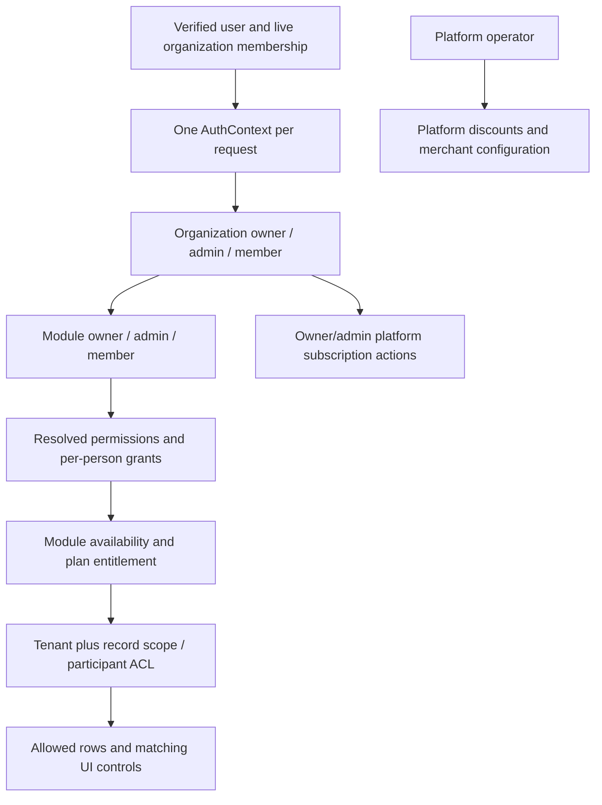

# Recovery: organization access, module standing and platform billing

Required acceptance and independent implementation review: [full-stack completion contract](README.md#mandatory-full-stack-completion-contract).

Status: PARTIAL — implementation repairs and verification remain. Source recheck 2026-09-12 found remaining AB-03/07 correctness work and AB-08/10/11 acceptance gaps. Localstack/sandbox evidence below is recorded prior evidence, not independently rerun in this reconciliation.

## Start here

Claude: execute this file as the task. Read root, backend and frontend `CLAUDE.md`, this directory's `README.md`, and ADRs 0004, 0005 and 0006 before editing. Work from current source, preserve concurrent changes, and update this file with evidence after each completed item. Paths below are relative to repository root. Do not interpret historical passing tests as completion of a customer journey.

Outcome: a newly created organization's active owner can see the correct subscription, purchase it using StreamlineOS's configured platform payment account, and receive the purchased term exactly once. Organization and module permissions remain consistent across UI, API, records, caches, background jobs and organization switching.

Scope: platform subscription billing and access governance. The earlier PayPal mention was a typo. Do not add a provider, redesign customer invoicing, or require each customer to create a merchant account merely to pay StreamlineOS.

Start with AB-03 and AB-07 below, then remaining acceptance. Preserve landed repairs; completed implementation instructions have been consolidated into evidence.

## Landed repair milestones and historical findings

These are implementation milestones, not full-flow acceptance. AB-F01–09 described
the pre-repair source; their former present-tense defect table is superseded here.

| Item | Landed evidence / retained distinction |
| --- | --- |
| AB-01/02; AB-F01/07 | Platform merchant uses validated server configuration, independently of tenant provider rows; webhook and redrive use that boundary. Current mocked readiness suite passes. Tenant collection remains separate. |
| AB-03; AB-F02/03/04 | Durable `subscription_purchases`, narrowed confirmation body and callback captured amount/currency checks exist. Webhook/replay gaps below prevent closure. |
| AB-04; AB-F05/06 | Promotion creation moved to `platform/promotions` with `INTERNAL_API_SECRET`, not merely a customer catalog key; customer discount minting removed. Preserve legacy promotion history and verify direct HTTP authority. |
| AB-05/06 | Six-standing, scoped-record and universal-surface regression work landed; RBAC-006 owns remaining coverage/UX/integration. |
| AB-07 | Tier expiry and clamped-month helper implemented; actual activation still uses unclamped `setMonth`. |
| AB-08 | Writer invalidation tests recorded; measured cold/warm request/SQL budgets remain absent. |
| AB-09 | Cleanup recorded at root `cb55134fd` / backend `0d5af8f2f`: schema-derived subscription contracts, canonical authenticated pricing and removed stale route comment/`READINESS_MESSAGES`. Provider/access/payment history retained. |
| AB-10; AB-F09 | Side-effect-free profile reads and atomic upsert implemented; current five mocked cases pass. Tax-authority consumer trace remains open. |
| AB-11; AB-F08 | Canonical seat definition and seat-idempotency mock retained; resend/last-seat acceptance belongs to people P3 and is not proved by the billing mock alone. |
| AB-12 | Unsupported extra-storage promise removed; AI-credit catalog link corrected to `/settings/billing/ai-credits`; recorded catalog contract test. |

Active structural owner/admin access already exists. Missing checkout readiness is
not evidence that the owner needs another role. Access is versioned/cached, tier
uses Redis (30 seconds), entitlements Redis (60 seconds), and subscription uses Query.
Public `lib/pricing.ts` and authenticated `GET /billing/plans` deliberately serve
different audiences; preserve their consistency test instead of deleting the public owner.

AB-09's recorded knip runs found no unused billing files/exports in either repo.
Unrelated hits (`UNSCHEDULED_BILLING_JOBS` as a cron decision ledger and timesheet
`BillingExportSnapshot`) were retained. `subscription-schema.ts` owns Zod-derived
contracts and `subscription.ts` re-exports; no parallel billing interface was retained.

## Route, source and test map

Backend module shorthand (`billing/`, `access/`, `ownership/`, `cron/`) starts at
`backend/src/modules/`; explicit `modules/` or `common/` paths start at `backend/src/`.
Bare sibling filenames refer to the same listed module. Frontend paths start at `frontend/`.

| Flow/routes | Source chain to inspect | Existing tests to extend |
|---|---|---|
| `/settings/billing`; `GET /billing`, `/billing/plans`, `/billing/summary` | `features/billing/billing-settings-page.tsx`, `components/plan-tab.tsx`, `components/plan-card.tsx`; `hooks/api/subscription.ts`; `modules/billing/core/billing.controller.ts`, `billing.service.ts` | frontend `features/billing/billing-mutation-gates.test.tsx`, `hooks/api/__tests__/billing-hook-gates.test.tsx`; backend `billing/core/billing-provider-contract.spec.ts` |
| `POST/PATCH /billing/checkout` | same hooks; `billing-payment-activation.ts`, `dto/billing.schemas.ts`; `billing/payments/payment-provider-resolver.service.ts`, `adapters/razorpay.adapter.ts` | `billing/core/billing-price-currency-pairing.spec.ts`, `billing-proration-wiring.spec.ts`, `billing/payments/payment-provider-resolver.spec.ts` |
| `/billing/coupons`, `/billing/coupons/validate` | `billing.controller.ts`, `billing-coupons.ts`, `coupon-pricing.ts`, `billing-activation-recorders.ts` | `billing/core/coupon-tenant-isolation.spec.ts`, `coupon-pricing.spec.ts`; add customer-vs-platform authority regression |
| `/billing/entitlements`, `/billing/seats` | `plan-limits.service.ts`, `billing-account-overview.ts`, `seat-definition.ts`, `seat-ledger.service.ts` | `plan-tier-cache-multi-instance.spec.ts`, `plan-limits.service.spec.ts`, `seat-ledger.service.spec.ts` |
| `GET /me/access`; guarded application routes | `hooks/api/access.ts`, `lib/rbac/permission-gate.ts`; `common/auth/auth-context*`, `modules/access/access.service.ts`, `access-permission.resolver.ts`, `authorize.ts`, `scoped-read.ts` | `access/access-membership-authority.spec.ts`, `access/__tests__/org-only-keys-never-resolve.spec.ts`, `request-authorization-composition.spec.ts`, `warm-cold-parity.spec.ts` |
| `/module-access/:moduleKey`, member grants and standings | `modules/module-access/module-access.controller.ts`, `module-standing-mutations.service.ts`, `user-permission-grants.controller.ts`, `module-access-ownership.service.ts`; discover current frontend consumers with `rg` | `module-access/__tests__/authority-matrix.spec.ts`, `standing-mutations.spec.ts`, `user-permission-grants.spec.ts`, `standing-grantability-agreement.spec.ts` |
| Ownership transfer and organization bootstrap | `modules/ownership/ownership-transfer-apply.ts`, `ownership-transfer-response.service.ts`; `modules/organization/core/bootstrap-cell-organization.ts` | `ownership/__tests__/ownership-transfer-lifecycle.spec.ts`; recovery-org-setup.md owns bootstrap integration |
| Provider webhook and billing lifecycle | `billing/core/billing-webhook.handler.ts`, `billing-webhook-effects.ts`, `provider-event-ledger.ts`; `modules/cron/cron-billing-*` | `billing/core/billing-webhook.spec.ts`, `provider-event-ledger.spec.ts`, `cron/__tests__/billing-lifecycle-scheduling.spec.ts` |

## Visual authority contract



| Standing | Subscription purchase | Module administration | Ownership lifecycle |
|---|---|---|---|
| Active organization owner | Yes, configured platform checkout | All available modules | Organization owner transfer; module lifecycle according to canonical policy |
| Active organization admin | Yes | All available modules | Cannot impersonate owner or transfer organization ownership |
| Module owner | No from this standing | Owned module | Canonical module ownership service only |
| Module admin | No | Administered module within grantor authority | No owner escalation |
| Organization/module member | No | Own held actions only | None |
| Suspended/deleted/nonmember | No | None | None |

The organization role and module standing are independent. Individual grants survive a role change; they are not a new role. A `none` grant is not automatically a deny override in a union resolver. Existing `user_module_access` narrows eligible non-admin module access; it must not remove universal member communication or override structural organization administration. Platform operator is a separate administrative identity, not a seventh customer standing.

## Executable checklist

- [ ] AB-03 Close webhook binding and replay recovery. `billing-webhook.handler.ts:settle` currently matches purchase/tenant, then passes payment amount/currency through `BillingWebhookEffects` into `performActivationFromWebhook` without the callback's immutable amount/currency/merchant/environment checks. Apply one authoritative validation/activation boundary to both entrances. Test wrong amount/currency, merchant/environment, cross-org order, and missing browser callback. Both activation entry points return early for ACTIVATED purchases before plan-credit recovery: fault-inject around outer HTTP commit, activation, credit write and separately committed effect-ledger completion, then prove retries finish missing effects exactly once. Return stored outcomes; reconcile late capture under the agreed fulfillment/refund policy without stranding money.
- [ ] AB-07 Finish lifecycle correctness. `billing-payment-activation.ts:runActivationTransaction` and `buildStoredOutcome` still use `Date.setMonth` although a clamped-month helper exists. Test the actual activation and replay result at January 31, leap day and year end, then use the canonical term contract. Failed webhook payments require a purchase now, but still call org-wide `transitionToPastDue` without current-period association: a stale failure from an older purchase must not downgrade a newer paid term. Preserve trial/free/grace/expiry and data-retaining downgrade tests; verify same-plan renewal/cycle-change UI matches supported behavior.
- [ ] AB-08 Measure cold/warm HTTP, SQL and latency under a stated load and verify the cache matrix below. Retain existing Query scope/invalidation machinery. Test temporal expiry, fill-after-bust, cache failure and late org-switch responses. After checkout/webhook reconciliation, refresh dependent access/entitlements/status with bounded polling or realtime. RBAC-006 owns the explicit revocation-window discriminator; cached data never replaces atomic quota/payment admission.
- [ ] AB-10 Finish `isTaxExempt` consumer and authority trace: `dto/billing.schemas.ts` still accepts the customer field and profile upsert spreads it. Establish whether this is self-attestation or verified status in actual invoice/tax consumers; implement the existing authority contract and negative tests without inventing tax policy. Retain the passing read-race/upsert repair.
- [ ] AB-11 Reconcile people P3 evidence for expired-invitation resend under the canonical quota lock, another invite taking the last seat and concurrent resends. People owns resend implementation; billing owns the seat definition. The seat-idempotency double alone does not close this item.
- [ ] AB-05/06 integration: complete RBAC-006 in `rbac.md` under the same access owner. Preserve six standings, live structural membership, scope unions and private-record ACLs. No duplicated role engine or second access backlog.
- [ ] Combined acceptance: fresh owner monthly/annual captured sandbox purchase; member/module-admin HTTP denials; exact amount/currency/term; first-attempt promotion; browser close/retry; reordered/duplicate callback/webhook; concurrent confirmation and last-seat admission. Preserve financial history through migration/recovery. Browser proof includes 375/768/1280, keyboard/modal focus, loading/error/denied states and no duplicate checkout requests. Record final revision pair and independent review; BILL-001/002 below remain release requirements.

## Cache authority and invalidation

| Data/cache | Authority and key | Required invalidation/proof |
|---|---|---|
| Frontend access, 30s | `GET /me/access`; canonical Query key; Query hash includes actor/org | Role/group/grant/deny/ownership/membership changes; expiry cap; organization switch remount; no cross-actor hydrated response |
| Backend effective access | `access_versions` plus tenant/actor/version; existing local and Redis caches | Same-transaction version bump, postcommit invalidation; prove a second backend instance rejects revoked access; request context remains per-request |
| Tier 30s, entitlement payload 60s | `subscriptions`; `billing:tier:${orgId}`, `billing:entitlements:${orgId}` | Activation, webhook, enterprise quote, downgrade/cancel/expiry; all writers audited. Handle fill-in-flight after bust and temporal expiry; no stale authorization allowance masked by warm cache |
| Subscription/summary/profile/seats | Existing scoped frontend billing factory; source subscription/profile/membership/invite tables | Checkout result, provider reconciliation, profile edit and every seat transition; no invalidation of unrelated modules |
| Payment readiness | Platform config for subscription; tenant config for tenant collection | Merchant key rotation, environment/status change; no secret response or client cache. Measure repeated resolver lookup before adding short versioned safe readiness cache |
| Price catalog/coupon preview | Published catalog and eligibility, not hardcoded card price | Catalog publication, coupon changes/expiry; immutable checkout quote is authoritative even if preview cache changes |
| Quota admission/activation/replay | Database transaction and durable purchase/event records | Not served from stale UI counts or cached authorization; advisory lock/conditional transition and uniqueness protect concurrency |

## Dated implementation and verification evidence

Prior recorded source repairs: backend `f900e8bee`, `c8b034e44`, `e0ec41eec`,
`5d6fd9d95`, `2e4fc6a5f`; root `52618914c`. Shared-tree commits captured work
from concurrent sessions; use a reconciled final revision pair for release.

At the recorded second pass (`e21d45de0`, `7cf3c79a6`): backend billing/access/
RBAC/module-access/ownership/cron **200 suites, 2419 tests passed**; frontend billing/
catalog/pricing **9 suites, 115 tests passed**; backend and frontend builds exited 0.
Frontend compiled in 4.4 minutes with both billing routes emitted. Source types had
no in-lane errors, but two concurrent onboarding spec errors remained; these are
historical results, not today's blanket pass.

The consolidated former billing proof lane recorded root `967e6a549` / backend
`4ef590f3a`: billing **63 suites/782 tests**, access/RBAC **92/1286**, frontend
billing/catalog **9/115**; billing source types clean. That established local repair
prerequisites, not captured-payment acceptance. Its earlier “no database/provider/
migration run” statement was superseded by the localstack evidence below.

Useful regressions discovered during implementation: an optional webhook activation
dependency was not supplied by BillingService despite green billing mocks; wiring was
fixed. Period-expiry routing needed scheduler/dead-man/operator coverage. Annual UI
first divided the discounted monthly price by twelve, then rounded monthly display
times twelve disagreed with provider amount: `annualTotalPaise` now carries the
exact total. Preserve these regression cases. `couponRedemptions.amountPaise` was
changed from discount to charged amount; discount is stored on the purchase. Retain
that historical semantic change in migration/reconciliation review.

### Current independent local recheck — 2026-09-12

No env, database, provider or browser was used. Jest setup and selected mock seams
were inspected. From `backend/`:

```powershell
node ./node_modules/jest/bin/jest.js --runInBand --runTestsByPath src/modules/billing/payments/platform-checkout-readiness.spec.ts src/modules/billing/core/billing-profile-race.spec.ts src/modules/access/access-explain.resolver.spec.ts src/modules/rbac/permission-catalog-sync.service.spec.ts
node ./node_modules/jest/bin/jest.js --runInBand --runTestsByPath src/modules/billing/core/billing-purchase-binding.spec.ts src/modules/billing/core/subscription-lifecycle.spec.ts
```

First command: **3 suites passed, 1 failed; 33 tests passed, 4 failed; exit 1**.
The four `permission-catalog-sync.service.spec.ts` administering-module assertions
at lines 86, 93, 99 and 110 still fail; RBAC-006 owns reconciliation. Readiness,
profile and access-explanation suites pass. Second command: **2 suites, 39 tests
passed; exit 0**. Those passing mocked tests do not cover the AB-03/07 counterexamples.

## Recorded localstack + Razorpay sandbox evidence — 2026-09-12

Prior implementation-session report, preserved but not independently rerun here.
Sandbox order creation is not a captured purchase or activated term. A conditional
UPDATE race is not the complete activation/effect transaction.

Environment: `scratch_local` on `127.0.0.1:5432` (PostgreSQL 18.6, 957 tables), driven
from `backend/.env.localstack`. **Production Aurora was never contacted.** Razorpay
calls used the `rzp_test_` key only; no live charge was made.

| Check | Result |
|---|---|
| Migration `1090` applies | Applied to `scratch_local`; 25 columns, 3 FKs, both unique indexes, partial index on `provider_payment_id` |
| Its guards bite | duplicate `provider_order_id` → `23505`; duplicate `provider_payment_id` → `23505`; unknown `org_id` → `23503`; null `amount_minor` → `23502`; two NULL payment ids correctly allowed; probe transaction rolled back leaving 0 rows |
| Platform merchant with ZERO tenant `payment_providers` rows | `readiness.configured: true`, `environment: test`, `resolve().isReady() === true` — this is the AB-F01 P0, reproduced as fixed |
| Real sandbox order, monthly | `order_Tb6T6JHAeStPiw`, 99900 paise INR (₹999) |
| Real sandbox order, annual | `order_Tb6T6Z66gI3Cwm`, 959040 paise INR (₹9,590.40) — correct annual order amount; activated 12-month term not established |
| Provider failure mapping (live) | `pnpm verify:razorpay-sandbox` exit 0; observed HTTP 401 and 400 from `api.razorpay.com`, each mapped to `BadGatewayException` after exactly one attempt |
| Concurrent confirmation, REAL database | Two separate connections raced the conditional `UPDATE … WHERE status IN (…) RETURNING`; **exactly one won**. This proves the conditional claim only; full activation/effect concurrency remains open |
| Duplicate/replayed confirmation | Re-running the claim after activation matched no row — a no-op, not a second activation |
| Two-tenant receipt substitution | The same claim under another `org_id` matched no row |

Found by running it, not by reading: the catalog published only `annualPrice` (the
rounded MONTHLY figure), so a UI multiplying it by 12 quoted ₹9,588 while the provider
order was for ₹9,590.40. `annualTotalPaise` is now on the wire and rendered.

STILL NOT DONE, and not closable without the running app in a browser: retry after
browser close, reordered webhook-before-callback, live member/module-admin denials
over HTTP, last-seat admission, and the whole of the 375/768/1280 + keyboard +
focus-restoration check. A forced provider 5xx remains impossible to induce in the
Razorpay sandbox, which is why BILL-001 stays open.

## BILL-001 — Prove deployed payment failure and recovery paths

Status: BLOCKED-EXTERNAL
Maps to: PRD-C162
Parallel group: 3
Depends on: none
Owner: payments operator

Blocked for release evidence; AB-03/07 local prerequisites remain open. The real
prerequisite is the relevant access/billing merchant/webhook, activation and
reconciliation repairs at a coordinator-recorded integrated revision. Earlier
prerequisite pair `967e6a549` / `4ef590f3a` does not override current source
counterexamples.

Scope: on a named disposable environment, verify provider failure, webhook retry,
reconciliation and recovery, including the required provider-side failure not
inducible on demand in the Razorpay sandbox. Preserve the successful recorded
401/400 mapping and order-creation evidence; they do not prove provider-5xx handling
or end-to-end captured payment. Confirm the environment's migration chain and
purchase constraints rather than assuming the earlier scratch schema is current.

Completion: timestamped provider and application evidence proves failure detection,
idempotent recovery, ledger reconciliation and no duplicate charge. Record external
failure-injection limitations and the approved verification method; do not trigger
a real customer charge to satisfy the gate.

## BILL-002 — Record Finance release approval

Status: BLOCKED-EXTERNAL
Maps to: PRD-C182, PRD-C193
Parallel group: 3
Depends on: BILL-001
Owner: Finance approver

Scope: review payment evidence and record the accountable Finance/final release decision.
Completion: named approver, decision, timestamp, scope and residual risks are recorded
in release authority evidence.

The former `billing-payments.md` is superseded by these preserved tasks and dated
prerequisite evidence, not deleted because BILL-001/002 are complete.

## Shared-file ownership and migration contract

This agent owns billing feature hooks/components and backend `modules/billing/**`, plus access/module-standing changes agreed with coordinator. Identity, org-setup and people/invitations briefs own their respective creation and membership flows. Coordinator owns shared `common/auth/**`, `common/rbac/**`, Query provider/client, global navigation, schema barrels, `CLAUDE.md` and migration journal. Request a coordinated edit to those files; do not race another agent.

Publish contract changes before consumer edits: platform readiness DTO, immutable purchase/confirmation response, invalidation events and seat-count definition. New schema only after searching existing payment/order/event tables for suitable durable ownership. Use additive, journaled migration and named unique tenant/provider/order constraints; inspect duplicates before constraints, preserve payment/invitation/access history and document rollback. Never drop existing credential or legacy role tables as a cleanup shortcut. Do not execute migration against an unnamed database.

Completion requires passing evidence for every applicable acceptance check under
the index's full-stack contract. A concrete blocked prerequisite is recorded but
does not count as completion; use IMPLEMENTED—VERIFICATION-PENDING where appropriate.
Completed rows may be consolidated into dated evidence. A blocked sandbox or missing
live fixture remains a release gate, not a passing result. For access work, also
read `rbac.md` as the explicit RBAC entry and execute RBAC-006 under the same owner.
