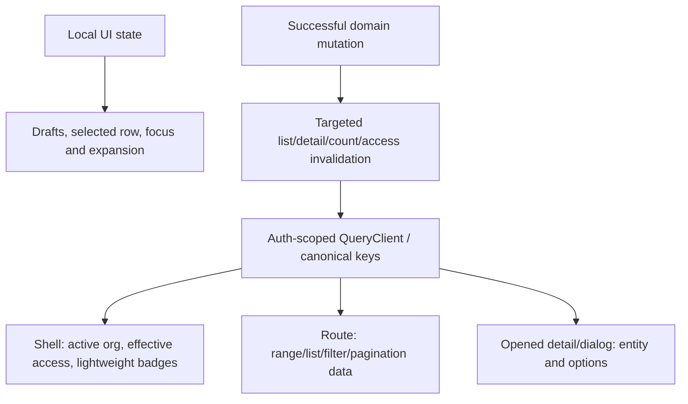

# Shared reads, cache correctness, frontend cost and UI consistency

Required acceptance and independent implementation review: [full-stack completion contract](README.md#mandatory-full-stack-completion-contract).

Status: PARTIAL — FD2, FD3, FD8 and FD9 are closed; FD4 is measured and its dataset
blocker is cleared; FD5 has source findings but no injected fault. What remains is
**one browser/build window**, not further source work: FD1 runtime waterfalls, the FD6
route-bundle manifest, and FD7 screenshots all need a production build and an
uncontended `scratch_local`. Not a whole-app rewrite.
Updated 2026-09-12 after the origin/main merge. Read root/frontend/backend `CLAUDE.md`,
`architecture-refactor/AGENTS.md` and this directory's index before starting.

The merge regressed four frontend gates that were green before it (`check-over-300` 525
vs the 513 baseline, `check-file-sizes` on a 578-line `week-grid.tsx`,
`check-request-params`, `check-dead-code`). Those are ARCH-003's, tracked in
[release-completion.md](release-completion.md); no baseline or ceiling was raised to
absorb them. Several `hooks/api/accounting/**` exports read as unused only because the
merge deleted their consumers — confirm against `git log --diff-filter=D` before giving
any of them a dead-code verdict.

Own query/provider/prefetch integration only when reserved by the coordinator.
Resume only the remaining FD tasks below. Before shared-file implementation, the coordinator
records exclusive file ownership in the PRD index; this is coordination, not a new
request for user approval of already-authorized work.
Domain agents own their hooks and screens; send shared contract changes to them.
Identity owns backend-token caching and refresh semantics, access owns authority
versions, organization setup owns wizard state, communications own their streams.
Do not run concurrent builds or regenerate shared contracts while another lane edits.
FD4/FD5 measure and propose domain SQL/cache repairs; domain owners implement them.
Reserve shared server/cache edits separately; this is not a backend-wide lane.

## What already exists

`frontend/components/providers/query-provider.tsx` provides a QueryClient per
authenticated org/user scope, remounts on scope change, clears via the registered
cache clearer, and already has 2-minute default staleTime, bounded query retries,
no mutation retries and AI-wallet invalidation. `frontend/lib/query-scope.ts`
canonicalizes keys with the same hash used by
`frontend/lib/prefetch/server-query-client.ts`. Server auth is request-cached.
`frontend/hooks/api/chat-core-read.ts`, `calendar.ts`, `inbox.ts` and
`notifications-inbox.ts` already use query caching. Repeated use of one hook does
not itself prove repeated HTTP requests. Preserve these mechanisms.
QueryProvider also wires existing `build-cache-sync.ts` through mutation success
and subscription cleanup, including scoped BroadcastChannel/storage fallback.
Preserve it; other domains need writer verification, not a second whole-app bus.

Current implementation: `ignoreBuildErrors` has been removed; test-typecheck and
hydration/key fixes are recorded below. Identity session-key and calendar limit/key
repairs exist. Chat route paging still needs its own lane. Preserve these repairs.

## Ownership model to implement only where evidence requires

| Data | Appropriate owner | Scope and freshness decision |
| --- | --- | --- |
| Session / active org / effective permissions | Existing auth/access seam; shell reads | User, org, membership/session as applicable, permission version; revocation authoritative |
| Unread badge | Shared scoped hook and stream owner | Recipient + org; realtime with bounded fallback; no full message-list prefetch |
| Filtered list/calendar range | Route hook, reusable through query cache | Canonical filters, sort, cursor, dates/timezone and projection; freshness from writers |
| Detail/editor options | Open detail or editor | Entity and dependent input; cancel on close/change where safe |
| Input draft / hover / modal | Local component or feature context | No server cache/global store for transient editing state |
| Shared immutable catalog | Catalog/query owner | Version and locale; isolate personalized prices/availability |

## Ordered checklist

- [ ] **FD1 — Build a scoped request inventory.** For signup→setup→dashboard,
  invitations→employee admission, billing, inbox, calendar and chat, record each
  mounted consumer, canonical key, API route, trigger, cache policy and response
  size. Capture cold navigation, warm return, focus, reconnect, route change and
  mutation. Mark KEEP / REPAIR / CONSOLIDATE / REMOVE only with consumer evidence.
  Completion: duplicate HTTP, repeated SQL and duplicate React subscriptions are
  separately counted; no global prefetch just to reduce visible hook count.
- [x] **FD3 — Write the invalidation matrix before adding caching.** For every
  changed read list its writers, org/actor/record dimensions, version, TTL, expiry,
  invalidation timing, stale failure policy and cross-tab effect. Test logout,
  org A→B, same user/different session, grant revoke, employee removal, module
  disable and subscription change. Completion: never render prior-scope private
  rows; revoked access is denied by server even if the client cache is stale.
  Query scope follows the session; it does not itself fence in-flight switches or
  late session updates. Identity I6 owns that contract before switch safety can pass.
- [ ] **FD4 — Server cost.** Follow selected API through guard, tenant transaction,
  service, DB and external provider. Reuse AuthContext and ScopedRead rather than
  repeat authority reads per helper. Measure rows/queries, N+1, projections, query
  plans and connection/transaction time. Add indexes against measured predicates
  through journaled migration, not speculative indexes on every field. Completion:
  bounded query/page cost on agreed dataset and warm/cold evidence, not cache-hit
  claims inferred from a decorator.
- [ ] **FD5 — Cache failure and concurrency.** Verify TTL/cardinality bounds,
  stampede behavior where measured, stale key cleanup, Redis unavailable, racing
  writer/read, transaction rollback and post-commit invalidation. Separate harmless
  catalog fallback from authority/payment correctness. Never cache one-time proof,
  seat allocation or payment fulfillment as a substitute for an atomic transition.
  Completion: fault-injection checks cannot widen tenant/record access or replay money.
- [ ] **FD6 — Rendering/build budget.** Measure production clean and incremental
  build separately, route JS, server response, first usable UI and request waterfall.
  Inspect actual build cache configuration before changing it. Repair type errors
  and preserve the already-removed ignoreBuildErrors bypass; coordinate one full build at integration.
  Keep existing lazy contracts and route-level code splitting. Completion: strict
  application typecheck, affected test typecheck where configured, focused tests and
  production build at one revision pair; report failures rather than relax checks.
- [ ] **FD7 — UI consistency in the selected flows.** Inventory existing typography,
  spacing, controls, loading/empty/denied/error states and mobile shell primitives.
  Use existing semantic tokens and PageWrapper/form patterns. Verify keyboard focus,
  validation association, pending actions, recovery, 360px viewport and 200% zoom.
  Completion: before/after screenshots of actual flows with readable content and
  no clipped actions; broader brand redesign and Build screen deletion remain deferred.
- [x] **FD9 — Maintenance handoff.** Existing architecture/production lanes own
  pooling limits, migration rollback, backup restore, readiness, worker heartbeat,
  dead-letter recovery, monitoring and alerts. Link exact evidence gaps there rather
  than create a second operations backlog. Prove one failed external provider does
  not keep unrelated transactions/connections open indefinitely.

## Outcome — 2026-09-12 (frontend `pnpm type-check` clean at start; see limits)

Evidence files: `evidence/frontend-data/fd1-onboarding-people.md`,
`fd1-billing-inbox.md`, `fd1-calendar-chat.md`, `fd4-fd5-server-cost-cache.md`,
`fd6-fd8-build-deadcode.md`, `fd7-ui-consistency.md`.

Completed source repairs and audit outcomes are recorded below; runtime claims are
qualified by the current recheck. Calendar search now requests 25 and roster 100,
with keyed limits; the server was always capped at 100. Keep archived-chat reads
that supply the entry point/badge; gating them on an already-open view hides access.

| Item | State | Evidence |
| --- | --- | --- |
| FD1 | OPEN runtime inventory | Six journeys source-inventoried. Hook/key coalescing is not measured zero HTTP; capture actual cold/warm/focus/reconnect/mutation waterfalls. |
| FD2 | SOURCE IMPLEMENTATION COMPLETE | Key/hydration/read gating repairs exist; runtime coalescing and waterfall proof remains FD1. |
| FD3 | DONE | All seven scenarios answered. The two that were open are now pinned by tests: grant revoke is **version-keyed** (`orgId:userId:version`), not a plain TTL, so a bump invalidates rather than waiting out an expiry — ~0 ms same-process, ≤1 s cross-process. Employee removal denies on all four surfaces; the weakest is named rather than averaged away — Ably token revocation runs after commit with a 1 h TTL backstop. `access-version-revocation.spec.ts` + `jwt-auth.guard.spec.ts` 17/17. [Evidence](evidence/frontend-data/fd3-revocation-acceptance.md) |
| FD4 | MEASURED; one path still unmeasured | The dataset blocker is **cleared** — the tenant now holds **500 ACTIVE members**, not 1. Plans taken as `streamline_app` under the tenant GUC after `VACUUM ANALYZE`: roster and unselective search are org-led and bounded (36 buffers via `idx_org_members_org_status`); a *selective* search flips the driver to a `Seq Scan on users`, and `users` carries no RLS, so that cost tracks the **global** user count, not the tenant's members. Two audit claims corrected: the proposed trigram indexes **already exist** and are reachable, and `idx_chat_messages_unread` does not carry `channel_position` — `idx_chat_messages_unread_position` does. Chat paths remain unmeasured: `chat_messages` holds 0 rows. [Evidence](evidence/frontend-data/fd4-measured-query-plans.md) · [source gaps](evidence/frontend-data/fd4-source-gap-resolution.md) |
| FD5 | SOURCE FINDINGS; fault injection NOT run | Seats PASS — `lockMembersQuota` is held by all five writers and `seatCount` counts members plus live pending invitations in one SQL, so a reserved seat cannot be double-sold. Two MEDIUM findings: fourteen other `assertWithinLimit` call sites are check-then-act with no lock and no transaction (`projects-provision` checks at :35, opens its transaction at :46); and `void maybeAlertQuota(...)` writes to the DB while setting its Redis dedup key independently of that write, so a rolled-back request marks the 80%/100% quota alert sent and never delivers it. No fault was injected — these are code-path findings. [Evidence](evidence/frontend-data/fd5-quota-admission-atomicity.md) |
| FD6 | PARTIAL | Bypass removed; production build recorded. Current bundle manifest is STALE, not a usable budget verdict; browser timing and current integrated type/build gates remain. |
| FD7 | SOURCE COMPLETE; screenshots still blocked | Every F1–F10 finding plus the calendar observation is now resolved. F1/F2/F9 were already fixed and were verified rather than redone; F3 (chat `PageWrapper`), F4/F5 (hardcoded skeleton heights and a raw `animate-pulse`), F6 (`CONTENT_PANEL_SOLID`), F7 (canonical `DataTable` cursor mode), F8 (`Tabs`/`PageTabsToolbar` replacing `aria-pressed` pills), F10 (`TABS_CONTENT_PAGE_BODY_CLASS`) and the calendar `ErrorState` landed this pass. `CursorPageControls` was **kept**, not deleted — it has 8 live consumers — and is now in the frontend CLAUDE.md §15 index. 12 tests pass. **Still no screenshots, no 200% zoom and no keyboard run** — those need the browser window. [Findings](evidence/frontend-data/fd7-ui-consistency.md) |
| FD8 | DONE (audit) | knip: 221 findings, **0 confirmed dead**; every one KEEP-BY-DESIGN or boundary-validation. Nothing deleted |
| FD9 | DONE | 5/5 unit tests pass (`fd9-provider-failure-connection-release.spec.ts`, exit 0). Every request-path provider call confirmed outside its transaction; outbox consumer isolation confirmed mitigated by `withDeliveryDeadline`. Ops gaps linked to OPS-001/002/003/004 in `evidence/frontend-data/fd9-provider-failure-and-handoff.md`. |

### FD6 — two gate mechanisms were reporting untrue results

- **`check:test-typecheck` was wired into CI as blocking and crashing.**
  `tsconfig.test.json` did not exist, so tsc exited TS5058 with no parseable
  diagnostics. The script's own crash-detection correctly refused to call that a
  pass, so the gate failed instead of lying — but **no test file had any type
  coverage**. Recreated the project (`extends` + the four test globs dropped from
  `exclude` + `files: ["jest.setup.js"]` for the jest-dom global augmentation).
  `--self-test` now proves all 5 bites. The run measured **0 errors over 338 files**
  at that revision, so `BASELINE` stays 0 as a hard gate.

  Historical test-typecheck failures included the billing plan fixture and calendar
  contract WIP. They need current verification, not attribution based on old tracking
  state. Keep baseline zero.

  Fixing the gate immediately paid for itself twice: it caught
  `lib/__tests__/auth-claims.test.ts` **actually failing** in HEAD (1 failed / 38
  passed — `resolveSessionClaims` defaults `isPlatformAdmin` to `false` and the
  fixture omitted it, so `toEqual` compared `false` against absent), and it caught
  a spec left behind asserting a `maxPages` argument from the reverted chat
  rewrite. Both repaired in `8db75c917`.
- **`pnpm type-check` false-passes from a stale incremental cache — measured.**
  `tsconfig.json` sets `incremental: true`. With the committed `tsconfig.tsbuildinfo`
  in place the app check reported **0 errors, exit 0**. With it deleted and
  `--incremental false`, the same tree reports **2 errors, exit 2**, and both are in
  files **unmodified vs HEAD** — so they were in HEAD all along and every recent
  "typecheck passed" claim over this tree was reading a cache:

  | Error | Reading |
  | --- | --- |
  | `features/billing/components/plan-tab.tsx:353` TS2367 `"failed"` vs `"loading"` have no overlap | Inside the `scriptState === "failed"` branch the Retry button sets `isPending={scriptState === "loading"}`, which is unreachable — the retry button can never show a pending state |
  | `hooks/api/users/invitations.ts:107` TS2345 contract not assignable | `invitationsResponseContract` infers `status: string` where `InvitationsResponse` expects a narrower type. The repo's most common contract defect: a `z.string()` standing over an enum |

  These were historical blockers, repaired in the later build below. For fresh
  application proof run `node --max-old-space-size=6144 ./node_modules/typescript/bin/tsc --noEmit --incremental false`; no deletion of cache files is needed.
- **`ignoreBuildErrors` is now REMOVED** and the production build passes at
  `BUILD_EXIT=0`: `✓ Compiled successfully in 8.4min`, then
  `Finished TypeScript in 6.3min` clean against freshly generated `.next/types`.
  The two blockers above were repaired first (`plan-tab.tsx` dropped an
  unreachable `isPending`; `invitationsResponseContract` is now pinned
  `: ResponseContract<InvitationsResponse>`, which is where enum drift will now
  fail). Non-incremental app typecheck: **0 errors**. Note the build ran offline —
  `getaddrinfo ENOTFOUND fonts.googleapis.com`, retried and continued.
- **Webpack persistent cache is disabled for non-dev.** This does not establish
  absence of Next.js/typecheck/filesystem/OS caches. Distinguish clean output from
  repeated builds and record remaining cache layers. Historical build time was
  about 15 minutes on this machine, not a proven universal cold-build cost.
- **`check:route-bundle-budget` could never have passed, and now it can.** The gate
  refuses a manifest whose `buildId` does not match `.next/BUILD_ID` and tells you
  to "re-run the bundle measurement, which stamps" it — but `measure-route-bundles
  --write` **never wrote a `buildId`**, so no number of re-runs could satisfy it.
  The writer now stamps `buildId` + `measuredAt` and refuses to record a
  measurement with no `.next/BUILD_ID` to attribute it to. Both self-tests still
  pass (5 measurement fixtures; provenance current/stale/absent/no-disk).
- **The "~50% of chunks not found on disk" warning was a false alarm**, and it
  mattered because it read as a systematic undercount. `entry.chunks` alternates
  webpack chunk ID and emitted path; the script added the IDs as paths, so half of
  every route's "chunks" resolved to nothing. An ID contributes 0 bytes, so the
  byte totals were always correct — proven by re-measuring after the fix and
  getting **byte-identical** totals (401773, 586706, …) with the counts halved.
- **Route JS, measured against build `YCNyHJhXqdWz3ZLAVi2r_` — 6 real breaches on 3
  routes.** No budget was raised to absorb them:

  | Route | First-load JS | Page chunk |
  | --- | --- | --- |
  | `/build/inbox` | 586,706 over 524,288 by **62,418** | 269,538 over 204,800 by **64,738** |
  | `/support/inbox` | 562,134 over 524,288 by **37,846** | 205,078 over 204,800 by 278 |
  | `/build/my-work` | 581,584 over 524,288 by **57,296** | 258,573 over 204,800 by **53,773** |

  All 13 measured routes are also far above their recorded values (+58KB to
  +304KB), so the recorded budgets were set against a much smaller build. The
  three breaching routes are the two heaviest Build surfaces and Support inbox;
  they own the repair.
- `verify:server-data-seam` passes but reads `.next/BUILD_ID`, so it certifies the
  last build, not current source.
- `next.config.ts:54` disables the webpack cache for non-dev builds. **Recommend
  KEEP** — it was set for memory management alongside `webpackBuildWorker`, and
  this machine OOM-killed a typecheck during this session.

### FD3 — writer matrix for the changed reads

Identity **I6 is REPAIRED** (`recovery-user-identity.md:137`), which was FD3's stated
blocker, and its contract is test-proven: `hooks/common/auth-hooks-switch-org.test.tsx`
**6/6**, including *"cancels in-flight tenant reads before the switch request leaves"* and
*"ignores a late A refresh completion when switch B has already started"* — the in-flight
and late-update fencing this brief said query scope does not provide by itself.

| Changed read | Key inputs | Writers → invalidation | TTL | Cross-tab |
| --- | --- | --- | --- | --- |
| `GET /me/inbox/unified` | limit (defaulted), kinds (sorted), unreadOnly (defaulted false), infinite | inbox read/snooze/delete mutations in `hooks/api/inbox*`; SSE stream pushes | 30s | Ref-counted SSE singleton per tab/runtime, scoped connection; prove peer-tab delivery |
| `GET /org/members` roster | limit (100) | `hooks/api/users/cache.ts` via `calendar.orgMembersAll` prefix | 5min | NOT provided by Build bus; verify roster freshness policy |
| `GET /org/members` search | search term, limit (25) | same, via `calendar.memberSearchAll` prefix | 30s, `keepPreviousData` | NOT provided by Build bus; verify search freshness policy |
| `GET /billing/plans` | none (catalogue) | Subscription invalidation does not itself invalidate the plans key; identify actual catalog writers/version policy | 60min | NOT provided by Build bus; verify catalog freshness policy |
| `GET /onboarding/bank-details` | none; gated on bank step reached | `useBankDetailsMutation` | 30s | NOT provided by Build bus; verify sensitive-data freshness policy |

Every read is additionally scoped by `scopedQueryKeyHashFn(authenticated:orgId:userId)`, so
none of the above can be read under another org or person.

**The seven required scenarios, each with its actual evidence:**

| Scenario | Verdict | Evidence |
| --- | --- | --- |
| logout | PASS (test) | `auth-hooks-sign-out.test.tsx` **5/5** — *"clears the local query cache on every sign-out path"*; `lib/api-client.ts:220` also clears on the 401 path |
| org A→B | PASS (test) | `lib/query-scope-isolation.test.tsx` **8/8** with a bite proof that a plain `QueryClient` leaks; plus I6's 6/6 fencing |
| same user / different session | **BY DESIGN, not fenced** | Scope is `authenticated:org:user` — it does not distinguish sessions, and two sessions of one person in one org share authority. Per-session divergence is the backend's `backendJwt` cache, which the identity lane owns and already recorded |
| grant revoke | OPEN acceptance | Redis-outage fallback is not a proof of immediate revocation on cache hits. Access/RBAC owns the stated 30-second recovery window and authoritative write enforcement. |
| employee removal | OPEN acceptance | Verify active sessions, caches, streams and direct HTTP deny within the agreed window. |
| module disable | PASS (source) | `useModuleEnabled` gates the read client-side and `@RequireModule` denies server-side; a stale nav entry yields 403, not data |
| subscription change | PASS (source) | `subscription.ts:118-123` invalidates subscription/summary/entitlements/seats; the `MutationCache` in `query-provider.tsx:62-67` additionally invalidates the AI wallet off the `aiUsage` envelope |

Completion remains open until cross-tab freshness and the access-owner’s revocation
contract are exercised. `build-cache-sync.ts` publishes only `build:*` mutations
and invalidates Build prefixes; it cannot prove roster, bank or billing sync.
Use existing domain events/refetch/version mechanisms where sufficient; do not
create a generic bus just to fill the matrix.

### Migrations — `scratch_local` rebuilt cold; the chain does NOT replay, and here is where it stops

Requested: run any pending migration. On `scratch_local` exactly **one** was genuinely
absent — `1092_calendar_exception_modified_start_index` — applied and verified
(`idx_cal_exc_org_event_modified` on `(org_id, event_id, modified_start) WHERE
modified_start IS NOT NULL`). 1090 and 1091 were already present.

`pnpm db:migrate` was **not** used as-is: `drizzle.config.ts:4` loads `.env`, which
resolves to production Aurora. Every run here set `DATABASE_URL` in the environment
first; dotenv does not override an existing key, verified before touching anything
(resolved host `127.0.0.1:5432/scratch_local`).

The ledger was **0 of 719** against 957 tables — the database had been cloned, never
migrated. Rebuilt cold as agreed: `DROP DATABASE … WITH (FORCE)` + `CREATE DATABASE`
(dropping 957 tables in one `DROP SCHEMA … CASCADE` fails `53200 out of shared memory`),
then the five extensions before migrating, per backend/CLAUDE.md's cold-DB rule.

**Result: 718 of 719 applied, 942 tables. The chain cannot reach head.**

| Finding | Evidence |
| --- | --- |
| **`1087_cell_control_plane_policies` fails `42703 column "org_id" does not exist`** | Statement **9 of 15** creates `CREATE POLICY "control_plane_access" ON "organization_relocation_checksums" … USING (… "org_id" = …)`. That table is created at `0617_cell_relocation_and_placement_decisions.sql:36` with `checksum_id, relocation_id, scope_kind, scope_name, source_digest, target_digest, matched, checked_at` — **there is no `org_id`**. A cold build cannot apply it. Worth a second look on its own merits: a control-plane table with no tenant column can only be isolated by joining its `relocation_id`, so the intended policy cannot be written as this statement assumes |
| Three generated migrations exceed the lock ceiling in one transaction | `max_locks_per_transaction = 64`, 6400 shared slots. `0619_chain_creates_what_production_has` touches **1854 objects in one transaction** (`0620` 189, `0767b_inv_table_chain_repair` 749). All applied cleanly **statement-by-statement**, so the SQL is sound — this is a local instance limit needing a postmaster restart, not a chain defect. `0999` already takes the autocommit path via `CONCURRENTLY` |
| The repo already knows the chain is short | `0619`'s own header: *"Objects the running control plane has that the committed migration chain never creates… A cold build of a cell reaches head and is still short of these, so the chain cannot reproduce the database it is supposed to describe."* |

So backend/CLAUDE.md's standard — *"it counts only when it is in the Drizzle journal AND
`db:migrate` reproduces it on an EMPTY DB"* — is **not** met today, and `1087` is the
concrete blocker. That is a backend/control-plane finding, not a frontend-data one; it is
recorded here because this lane produced the evidence.

### FD4 — the environment exists; the DATASET is what blocks the plan

This lane first reported FD4/FD5 as blocked for want of a disposable environment.
**That was wrong** — the access/billing lane's `9f11e3ffc` records `scratch_local`
on `127.0.0.1:5432`, and it was reached from here and probed read-only:

| Probe | Result |
| --- | --- |
| connection | `current_user = streamline_app` (the RLS-bound role, **not** a superuser — a superuser plan would bypass RLS and mislead), PostgreSQL **18.6** |
| RLS on `organization_members` | **enabled**, policy `tenant_isolation`: `(org_id = app.current_org_id_or_null()) OR (user_id = app.current_user_id_or_null())` |
| RLS on `users` / `organizations` | **disabled** — `users` is not row-isolated (503 rows visible); membership is the tenant boundary, not the user row |
| tenant GUC | `app.organization_id`, set via `set_config(..., true)` inside the transaction |
| `organizations` | 2 rows, readable without the GUC |
| `organization_members` with GUC set | **1 ACTIVE member, 1 row total** |

The first count without the GUC returned **zero** and would have read as "the table
is empty". It is not: a tenant policy returns no rows when the GUC is unset, silently.
Any scan of this schema that reports nothing has probably just forgotten the GUC.

**So FD4 stays open for a precise reason: the fixture holds one member.** An
`EXPLAIN (ANALYZE, BUFFERS)` over one row shows a trivial plan whichever index
exists, so it cannot support a `bounded query/page cost on agreed dataset` claim,
and it cannot tell whether the 5-way leading-wildcard ILIKE on `users` needs the
proposed trigram index. `idx_org_members_org_status` on `(org_id, status)` exists
and drives the join; `users` carries no trigram index. What FD4 needs is a **seeded
tenant with realistic membership**, not an environment. Do not infer a necessary trigram index or categorical RLS restriction from source.
Measure the actual joined predicate, policy role, cardinality and generated SQL;
`users` was recorded without RLS, while membership is tenant-scoped.

### Historical gate state — superseded where current recheck differs

Measured with each gate's own exit code (**not** through a pipe — piping to `tail`
captures `tail`'s status and reports every gate as passing; that mistake was made and
corrected during this session, and it is the same trap as reading a shell exit code for
a tool's):

| Gate | Exit | Attribution |
| --- | --- | --- |
| `check:query-scope`, `check:query-signal`, `check:response-contracts`, `check:gated-reads`, `check:colors`, `check:empty-states`, `check:icon-labels` | 0 | — |
| `check:test-typecheck` | 0 | fixed this session (was a crash) |
| `check:request-params` | 1 | `hooks/api/org-hierarchy.ts:161` sends undeclared `mode` — **clean vs HEAD** |
| `check:named-handlers` | 1 | `features/billing/components/plan-card.tsx:87` — **clean vs HEAD** |
| `check:dead-code` | 1 | `features/calendar/event-recurrence-schema.ts:BYSETPOS_LABELS` unclassified — the symbol is **already in HEAD** |
| `check:file-sizes` | 1 | `app/(auth)/verify-email/page.tsx` 505 — clean vs HEAD; plus an untracked 508-line org-setup test from a concurrent session |
| `check:over-300` | 1 | inventory + `hooks/api/leads-schema.ts`, both clean vs HEAD |
| `check:route-bundle-budget` | 1 | manifest has no `buildId` |

This is historical attribution only. Existing concurrent changes and revisions have
advanced; do not treat old clean/untracked labels as current. No baseline should
be raised to absorb a failure.

**A concurrent session is editing this same working tree** (`features/org-setup/**` changed
under measurement mid-session, and the file count moved 4016 → 4020). Re-measure before
attributing anything here.

### FD2 — closed. Every chat read is already confined or gated; the FD1 proposals were unreachable

`hooks/api/chat-core-read.ts:93` does cap `drainChannelPages` at `MAX_CHANNEL_PAGES = 20`
serial requests of 50 rows. That much is real. **Every proposed repair against it was
wrong on reachability** — checked one consumer at a time:

| Consumer | FD1 said | Actually |
| --- | --- | --- |
| `chat-ably-suite.tsx:21` `GlobalNotifications` | drains on every route | `ChatAblySuite` is a **`dynamic()` import mounted only at `features/chat/chat-home-page.tsx:219`**. Never in the shell. On the chat route the channel list is the route's own data |
| `components/ui/chat-channel-combobox.tsx:29` | "fires on Support/Build with no guard" | Mounted inside `{open && …}` in `features/support/inbox/ticket-external-links-section.tsx` **and** behind a `case "chat_channel"` switch. Nothing fetches until the person opens the section and picks that link type |
| same | needs a truncation affordance | It **already has one** — `MAX_CHANNEL_OPTIONS = 50` plus `ListTruncationNotice` (lines 7, 9) |
| `usePublicChannels` | drains on discovery mount | Only mounted by `features/chat/channels-discovery-page.tsx` — that is the discovery surface |
| `forward-message-dialog.tsx:39` | needs gating | Already `useChatChannels(open)` |
| `useArchivedChannels` | gate on `showArchived` | **Capability regression** — see the premise correction above |

Those specific frontend-only proposals are unnecessary. The remaining
irreducible cost is the drain on the chat route itself, which is that route's own data;
reducing it belongs to the chat lane, which must select the smallest verified paging/summary design instead of presuming a new endpoint.
Note for whoever does it: `drainChannelPages` and `MAX_CHANNEL_PAGES` are referenced by
`scripts/check-response-contracts.mjs` with config `drainChannelPages: 2` pinning the
contract argument's position, so **deleting them blinds that gate**. One agent did delete
them, updated no consumer, and was reverted. A 4th `maxPages` argument is gate-safe.

**FD2's four completion criteria, each with its evidence:**

| Criterion | Evidence |
| --- | --- |
| simultaneous identical consumers coalesce | Source coalescing inspected; actual journey HTTP totals remain FD1 runtime acceptance |
| server hydration avoids duplicate initial reads | `lib/prefetch/hydration-contract.test.ts` runs the **real** factories and hydrates into the app's own scoped client, with a bite proof that a plain `QueryClient` produces an unreachable entry |
| changed filter gets new data | **This was the actual break and is repaired.** `inbox.ts` keyed raw `params?.limit` while sending `?? 25`, and calendar member lookup sent no limit at all. Both keys now carry every response-shaping input; `kinds` order and `unreadOnly` undefined/false are normalized |
| route-unrelated lists absent from the initial shell waterfall | Source-inspected, not a browser waterfall: chat suite is dynamically imported on its own route; archived/public/combobox/forward-dialog all gated; `SeatsBlock` coalesces. The only shell reads are identity/access/badges plus `TrialBanner`, which is permission-gated (`billing:subscription:view`) at a 5-minute staleTime — a lightweight shell badge, which this brief's ownership table allows |

Not done, and not required by FD2: `SeatsBlock` taking `planName` as a prop (pure ownership
tidy — same-key coalescing inferred from source, not independently measured) and folding `TrialBanner` into the entitlements
read (needs the entitlements contract; handed to the access/billing lane).

## Current reconciliation — 2026-09-12

Root `85dc726e9` / backend `d3bf57982` plus existing working changes.
Main ran these frontend commands independently; no service, browser or database was started:

| Command | Exit | Current result / owner |
| --- | --- | --- |
| `node scripts/check-query-scope.mjs` | 0 | 6,065 scanned, no violations |
| `node scripts/check-request-params.mjs` | 1 | Undeclared `mode`, `hooks/api/org-hierarchy.ts:161`; setup/schema owners coordinate the contract |
| `node scripts/check-route-bundle-budget.mjs` | 1 | Manifest build `YCNyHJhXqdWz3ZLAVi2r_` differs from disk `j09vTP3gcAq2O94XHqA60`; FD6 refresh provenance before budget verdict |
| `node scripts/check-over-300.mjs` | 1 | 526/513; ARCH-003 owns integrated growth closure |
| `node scripts/check-file-sizes.mjs` | 1 | Setup provisioning test 508 lines; setup owner, no artificial splitting/baseline relaxation |

The earlier six bundle breaches describe the old build only; remeasure before
claiming they persist or are fixed. Later [Build](build.md) evidence includes real
Windows browser captures, so browser absence is not a blanket environment blocker.
These six foundation journeys still require their own capture with explicit local
API configuration and one reserved build; Build captures cannot certify them.

## Completion evidence

Discover current focused commands from each package's scripts; inspect whether a
test starts infrastructure before executing. Do not read/print `.env` secrets,
boot unknown configured services, mutate production or install dependencies as an
audit shortcut. Existing source comments with benchmark numbers are historical
evidence until the dataset/command/revision is checked.

Reuse `frontend/lib/query-scope-isolation.test.tsx` and
`frontend/scripts/check-query-scope.mjs` when touching provider/hash/prefetch scope;
add behavioral hydration and switch cases rather than replacing these checks.

Record before/after per journey: HTTP count, SQL count, response bytes, p50/p95,
cache hits/misses, render/bundle/build cost and environment. Agree a budget before
optimizing; do not invent a universal request-count target. Handoff includes changed
and removed paths, exact commands/exit codes, cache writer matrix and residual
runtime risk. Mock tests and this source audit do not certify deployed performance.
