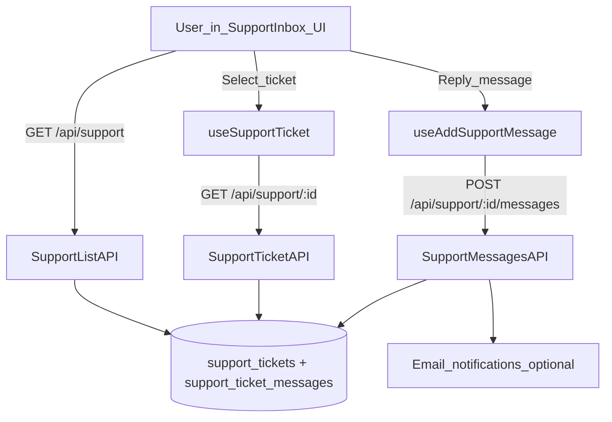

# Helpdesk, Support Tickets & Support Inbox

This doc explains how **HR Helpdesk** and **Customer Support Tickets** work in this repo, and how the **Support Inbox** UI uses the underlying APIs and database tables.

## 1) Two different systems (don’t mix them)

### A) HR Helpdesk (internal employee → HR)
- **Purpose**: Employees raise internal HR/helpdesk issues (policy questions, HR requests, etc.)
- **API**: [`app/api/hr/helpdesk/route.ts`](../app/api/hr/helpdesk/route.ts)
- **Queries**: `getHelpdeskTickets` (imported from `@/server/queries/hr`)
- **Email notification**: `sendHelpdeskTicketEmail` (via [`lib/email.ts`](../lib/email.ts))

### B) Support Tickets (customer/client support inside CRM)
- **Purpose**: Track customer support work with SLA, assignee, message thread, status transitions.
- **DB**: `support_tickets` and `support_ticket_messages`
- **API**:
  - List/create: [`app/api/support/route.ts`](../app/api/support/route.ts)
  - Get/update ticket: [`app/api/support/[supportTicketId]/route.ts`](../app/api/support/%5BsupportTicketId%5D/route.ts)
  - Messages: [`app/api/support/[supportTicketId]/messages/route.ts`](../app/api/support/%5BsupportTicketId%5D/messages/route.ts)
- **Queries**: [`server/queries/support.ts`](../server/queries/support.ts)
- **UI**: Support Inbox page [`app/(dashboard)/support/inbox/page.tsx`](../app/(dashboard)/support/inbox/page.tsx)
- **Email notification**: `sendSupportTicketCreatedEmail`, `sendSupportTicketReplyEmail`, `sendSupportTicketStatusEmail` (via [`lib/email.ts`](../lib/email.ts))

## 2) Database tables

### Support Tickets (CRM support)
Defined in [`lib/db/schema/crm/_all.ts`](../lib/db/schema/crm/_all.ts):

- **`support_tickets`**
  - `org_id` (org scoping)
  - `client_id` (optional)
  - `assignee_id` (optional)
  - `title`, `description`
  - `status`: `OPEN | IN_PROGRESS | WAITING | RESOLVED | CLOSED`
  - `priority`: `LOW | MEDIUM | HIGH | URGENT`
  - `sla_deadline` + `resolved_at` + `closed_at`
  - `created_by`, `created_at`, `updated_at`
- **`support_ticket_messages`**
  - `ticket_id`
  - `author_id`
  - `body`
  - `is_internal` (boolean)
  - `attachments` (JSON array)
  - timestamps

### HR Helpdesk
Defined in HR schema (see `helpdeskTickets` in `lib/db/schema/hr/*` via `@/lib/db/schema`):

- Created by an employee (userId)
- Read access:
  - **Non-admin**: can only view their own tickets
  - **Admin roles** (CEO/HR/ADMIN): can view broader scope
- New ticket triggers email notifications to HR members in the org

## 3) API endpoints (routes) and what they do

### A) HR Helpdesk API
File: [`app/api/hr/helpdesk/route.ts`](../app/api/hr/helpdesk/route.ts)

- **`GET /api/hr/helpdesk`**
  - Auth: `withAuth`
  - Behavior:
    - If query has `userId`, non-admins cannot request other users’ tickets.
    - Supports `status` filter (HR ticket status).
  - Calls: `getHelpdeskTickets(orgId, viewerUserId, isAdmin, { filterUserId, status })`

- **`POST /api/hr/helpdesk`**
  - Auth: `withAuth`
  - Creates a new helpdesk ticket for the current user.
  - Then finds all org members with role `"HR"` and sends each an email via `sendHelpdeskTicketEmail(...)`.

### B) Support Tickets API

#### List / create tickets
File: [`app/api/support/route.ts`](../app/api/support/route.ts)

- **`GET /api/support`**
  - Auth: `withAuth`
  - Query params:
    - `status`: `OPEN | IN_PROGRESS | WAITING | RESOLVED | CLOSED`
    - `priority`: `LOW | MEDIUM | HIGH | URGENT`
    - `assigneeId`
    - `page`, `limit`
  - Calls: `getSupportTickets(orgId, filters)` in [`server/queries/support.ts`](../server/queries/support.ts)

- **`POST /api/support`**
  - Auth: `withAuth`
  - Body:
    - `title` (required), `description?`, `clientId?`, `priority`, `assigneeId?`
  - Sets SLA deadline based on priority (hardcoded in route):
    - LOW 48h, MEDIUM 24h, HIGH 8h, URGENT 2h
  - If `assigneeId` is provided, sends the assignee an email:
    - `sendSupportTicketCreatedEmail(assigneeEmail, assigneeName, title, priority, creatorName, ticketId)`

#### Get / update a specific ticket
File: [`app/api/support/[supportTicketId]/route.ts`](../app/api/support/%5BsupportTicketId%5D/route.ts)

- **`GET /api/support/:id`**
  - Auth: `withAuth`
  - Calls: `getSupportTicket(orgId, id)` in [`server/queries/support.ts`](../server/queries/support.ts)

- **`PATCH /api/support/:id`**
  - Auth: `withAuth`
  - Body: `status?`, `assigneeId?`
  - Updates:
    - `resolvedAt` set when status becomes `RESOLVED`
    - `closedAt` set when status becomes `CLOSED`
  - Side effects (emails):
    - If status changed → email the ticket creator (`sendSupportTicketStatusEmail`)
    - If assignee changed → email the new assignee (`sendSupportTicketCreatedEmail`)

#### Messages on a ticket (thread)
File: [`app/api/support/[supportTicketId]/messages/route.ts`](../app/api/support/%5BsupportTicketId%5D/messages/route.ts)

- **`GET /api/support/:id/messages`**
  - Auth: `withAuth`
  - Loads messages with author info, newest-first.

- **`POST /api/support/:id/messages`**
  - Auth: `withAuth`
  - Body:
    - `body` (required)
    - `isInternal` (default false)
    - `attachments[]` optional
  - Auto transition:
    - If ticket is `OPEN`, posting a message sets ticket to `IN_PROGRESS`
  - Email notification:
    - If `isInternal=false`, notifies the “other side”:
      - If author is creator → notify assignee (if any)
      - Else → notify creator
    - Uses: `sendSupportTicketReplyEmail(...)`

## 4) Frontend pages and hooks

### Support Inbox UI
Page: [`app/(dashboard)/support/inbox/page.tsx`](../app/(dashboard)/support/inbox/page.tsx)

- Uses hooks from [`lib/api/hooks/support.ts`](../lib/api/hooks/support.ts):
  - `useSupportTickets()` → `GET /api/support`
  - `useSupportTicket(id)` → `GET /api/support/:id`
  - `useCreateSupportTicket()` → `POST /api/support`
  - `useUpdateSupportTicket()` → `PATCH /api/support/:id`
  - `useAddSupportMessage()` → `POST /api/support/:id/messages`
- UX structure:
  - Left list panel: ticket list with filters (`status`, `priority`)
  - Right detail panel: ticket details + message thread + reply box
  - “New Ticket” dialog creates a support ticket

### Support Analytics page
Page: [`app/(dashboard)/support/page.tsx`](../app/(dashboard)/support/page.tsx)

- Uses `useSupportDashboard()` from `@/lib/hooks/trpc-hooks`, which re-exports hooks from `lib/api/hooks/*`.
- The dashboard data comes from the CRM support dashboard endpoint:
  - [`app/api/crm/support-dashboard/route.ts`](../app/api/crm/support-dashboard/route.ts)
  - Queries: `getSupportDashboard(orgId)` in [`server/queries/crm-dashboards.ts`](../server/queries/crm-dashboards.ts)

## 5) Permissions / access control

- Platform route-level role access is enforced by `middleware.ts`.
  - For Support Inbox: it allows multiple roles (CEO/HR/Customer Support/etc.). See the route map entry for `\"/support/inbox\"` in [`middleware.ts`](../middleware.ts).
- Page-level gating in the Support Inbox UI:
  - `DashboardGate allowedRoles={[\"CEO\", \"HR\", \"CUSTOMER_SUPPORT\"]}` in [`app/(dashboard)/support/inbox/page.tsx`](../app/(dashboard)/support/inbox/page.tsx)
- All support APIs use `withAuth`, and additionally enforce org scoping at query level (`orgId` in `WHERE`).

## 6) Email notifications (what triggers them)

All email wrappers live in [`lib/email.ts`](../lib/email.ts):

- **Ticket created (assigned)**: `sendSupportTicketCreatedEmail` (assignee gets email)
- **Ticket status changed**: `sendSupportTicketStatusEmail` (creator gets email)
- **New reply**: `sendSupportTicketReplyEmail` (the other party gets email)
- **HR Helpdesk ticket created**: `sendHelpdeskTicketEmail` (HR members get email)

## 7) Known gaps / sharp edges

- `useSupportStats()` in [`lib/api/hooks/support.ts`](../lib/api/hooks/support.ts) calls `GET /api/support/stats`, but there is **no** route implemented under `app/api/support/stats/route.ts` currently.
  - Either implement that API route, or remove/replace the hook usage if unused.

## 8) Quick “how it works” flow (Support Inbox)

