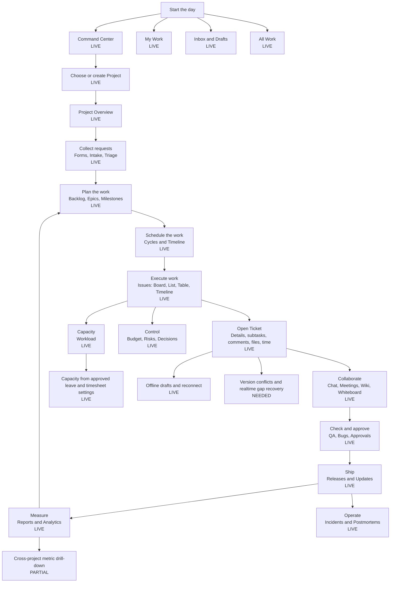
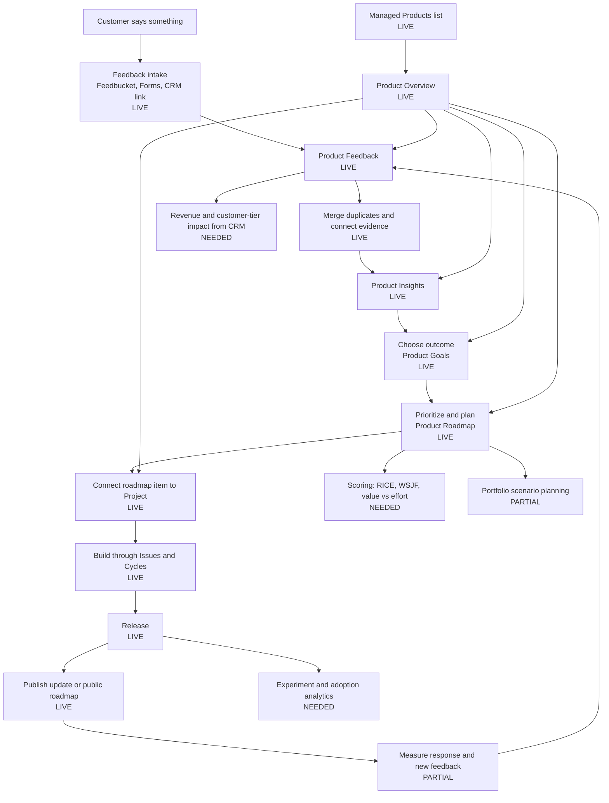
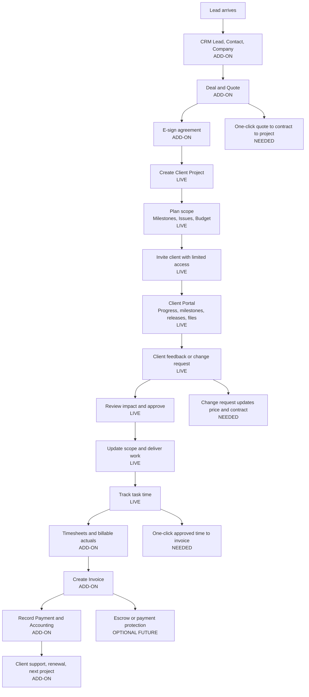

# StreamlineOS Build: Complete Product Map

Verified against the repository on 2026-09-22; reconciled again on 2026-09-23 at root
`ca83cb100` / backend `7d27370e8`, after the Sprint/Cycle and QA Bug contractions were applied
to production. Route and capability marks below were re-checked against files
on disk, not against a prior status claim.

This document explains Build in three simple journeys:

1. Project management: plan and deliver work.
2. Product management: turn customer feedback into releases.
3. Freelancer and client management: win, deliver, approve, invoice, and retain client work.

## How to read the maps

| Mark | Meaning |
|---|---|
| LIVE | A real route and implementation exist. |
| PARTIAL | A usable screen exists, but an important part of the full journey remains. |
| NEEDED | The screen or cross-module handoff is not yet complete. |
| ADD-ON | A StreamlineOS module outside Build extends the journey. |

The canonical route authority is `frontend/lib/build/build-route-manifest.ts`. Navigation is defined by `frontend/lib/build/nav/build-organization-catalog.ts` and `frontend/lib/build/nav/build-project-catalog.ts`. A route existing on disk proves that the screen exists; it does not by itself prove every product requirement is complete.

## 1. Project management flow

**Simple story:** decide what to do, assign it, complete it, check quality, release it, and learn from the result.



### Project-management screens

| Stage | Screens | Canonical routes | State |
|---|---|---|---|
| Personal work | Command Center, My Work, Inbox/Drafts, All Work | `/build/command-center`, `/build/my-work`, `/build/inbox`, `/build/all-work` | LIVE |
| Structure | Projects, Teams, Templates | `/build`, `/build/teams`, `/build/templates` | LIVE |
| Plan | Overview, Backlog, Epics, Milestones, Cycles, Issues Timeline | `/build/[projectId]`, `/backlog`, `/epics`, `/milestones`, `/cycles`, `/issues?view=timeline` | LIVE |
| Execute | Issues views and ticket detail | `/issues`, `/tickets/[ticketKey]` | LIVE |
| Intake | Forms, public forms, Intake, Triage | `/forms`, `/forms/[formId]`, `/intake`, `/triage`, public `/forms/[formToken]` | LIVE; Intake is the request queue, Forms owns definitions/publication, and Triage owns broader evidence classification |
| Collaboration | Chat, Meetings, Files, Wiki, Whiteboard | `/chat`, `/meetings`, `/files`, `/wiki`, `/whiteboard` | LIVE |
| Quality | QA, test runs, BUG work items | `/qa`, `/qa/runs/[runId]`, `/issues?type=BUG` | LIVE; the Bug data-model cutover is complete and defects live on `tickets` + `work_item_qa_details` |
| Delivery | Releases, Updates, Approvals | `/releases`, `/updates`, `/approvals` | LIVE |
| Governance | Risks, Decisions, Budget, Incidents | `/risks`, `/decisions`, `/budget`, `/incidents` | LIVE |
| Insight | Reports and Workload | `/reports`, `/workload` | LIVE; legacy `/analytics` redirects to `/reports?tab=overview`, and Workload reads capacity from approved leave and timesheet settings |
| Configuration | Workflow, Automations, Webhooks, Modules, Settings | `/settings/workflow`, `/settings/automations`, `/settings/integrations/webhooks`, `/modules`, `/settings` | LIVE |

## 2. Product management flow

**Simple story:** listen to customers, understand the problem, choose what matters, build it, release it, and tell customers.



### Product-management screens

| Stage | Screens | Canonical routes | State |
|---|---|---|---|
| Product home | Managed Products, Product Overview | `/build/managed-products`, `/build/managed-products/[managedProductId]` | LIVE |
| Discovery | Feedback, Insights | `/feedback`, `/insights` under the managed product | LIVE |
| Direction | Product Goals, Product Roadmap | `/goals`, `/roadmap` under the managed product | LIVE |
| Delivery links | Product Projects | `/projects` under the managed product | LIVE |
| Organization strategy | Roadmap, Goals, Programs, Portfolios | `/build/roadmap`, `/build/goals`, `/build/programs`, `/build/portfolios` | LIVE |
| Public communication | Public roadmap, Updates | public `/roadmap/[orgId]`, project `/updates` | LIVE |
| Customer master | CRM Clients, Companies, Contacts | `/crm/clients`, `/crm/companies`, `/crm/contacts` | ADD-ON; intentionally not duplicated in Build |

The durable discovery chain is implemented as feedback to insight to roadmap to project to release. Its current release standing and browser caveats are recorded in [RELEASE-STATUS.md](./RELEASE-STATUS.md).

## 3. Freelancer and client flow

**Simple story:** find a client, agree on the work, deliver it transparently, get approval, get paid, and win repeat work.



### Freelancer and client screens

| Job | Screens | Routes | State |
|---|---|---|---|
| Find and qualify clients | Leads, Clients, Contacts, Companies, Deals | `/crm/leads`, `/crm/clients`, `/crm/contacts`, `/crm/companies`, `/crm/deals` | ADD-ON |
| Price and agree | Quotes, Sign envelopes/templates | `/crm/quotes`, `/sign/envelopes`, `/sign/templates` | ADD-ON; handoff is not yet one guided flow |
| Deliver | Project Overview, Issues, Milestones, Files, Meetings, Chat | project Build routes | LIVE |
| Control scope | Budget, Approvals, Change Requests | `/build/[projectId]/budget`, `/approvals`, `/change-requests` | LIVE; affected-ticket linkage exists on the current branch but still needs release verification |
| Share safely | Client Access, internal publication controls, guest portal | `/build/settings/client-access`, `/build/[projectId]/client-portal`, guest `/client-portal/[projectId]` | LIVE |
| Capture effort | Ticket time tracker, Timesheets | ticket detail, `/timesheets`, `/timesheets/billing` | LIVE/ADD-ON |
| Bill and collect | Billing invoices, Accounting invoices, payments received | `/billing/invoices`, `/accounting/invoices`, `/accounting/payments-received` | ADD-ON; needs one canonical freelancer billing journey |
| Retain the client | CRM renewals, Support portal, project updates | `/crm/renewals`, `/support/portal`, project `/updates` | ADD-ON |

## What StreamlineOS offers beyond a normal project tool

| StreamlineOS advantage | Repository evidence | Why it matters |
|---|---|---|
| HR-aware delivery | HR, leave, payroll, team and Timesheets modules coexist with Build | Staffing, leave, cost, and delivery can eventually share one source of truth. |
| CRM-to-product loop | CRM customer records plus managed-product feedback and insights | Teams can connect demand and customer value to roadmap decisions. |
| Freelancer business stack | CRM Quotes, Sign, Build, Timesheets, Billing, Accounting, Support | A freelancer can run the business around the project, not only the task list. |
| Built-in client collaboration | Client grants, publication controls, guest portal, change requests | Clients see approved information without becoming internal workspace members. |
| Engineering and operations together | QA, test runs, releases, incidents, risks, decisions, webhooks | Delivery evidence remains attached to the work. |
| Product discovery chain | Feedback to insight to roadmap to project to release | Product decisions retain their source and delivery outcome. |
| Organization hierarchy | Products, projects, programs, portfolios, teams, goals owned directly by the organization | The same system supports a solo freelancer and a multi-team organization. |

## Competitor comparison

This is a capability comparison, not a claim that every StreamlineOS surface has the same maturity or ecosystem depth.

| Capability | StreamlineOS | ClickUp | Jira | Linear | Upwork-style freelancer platform |
|---|---|---|---|---|---|
| Issues, boards, lists, timeline | LIVE | Strong | Strong | Strong | Basic |
| Backlog and cycles | LIVE; contraction complete, Cycle is the only iteration identity | Strong | Strong | Strong | Weak |
| Docs, wiki, whiteboard, chat | LIVE | Strong | Usually needs Atlassian products/apps | Focused, lighter | Messages/files |
| Product feedback to roadmap | LIVE | Available through connected features | Available with Jira Product Discovery/ecosystem | Strong customer requests | Weak |
| Client portal and change requests | LIVE | Sharing and guest access | Usually service-management configuration | Customer requests, not a full freelancer portal | Strong |
| Time, capacity, budget | LIVE/PARTIAL | Strong | Strong with configuration/apps | Lighter | Strong time/contract tracking |
| CRM, quotes, e-sign, invoices, accounting | Native StreamlineOS add-ons | Mostly integrations | Mostly integrations/marketplace | Mostly integrations | Native contracts and payments |
| HR, leave, payroll context | Native StreamlineOS add-ons | Limited | Limited/integrations | Limited | Not an HR suite |
| Escrow, marketplace, dispute protection | Not offered | Not offered | Not offered | Not offered | Strong |
| Integration/template ecosystem | Growing | Very large | Very large | Strong developer ecosystem | Marketplace network |

Current competitor references: [ClickUp features](https://clickup.com/features), [Jira features](https://www.atlassian.com/software/jira/features), [Linear features](https://linear.app/features), [Linear customer requests](https://linear.app/docs/customer-requests), and [Upwork freelancer workflow](https://www.upwork.com/resources/project-management-for-freelancers).

## What is still missing or pending

Sequenced and owned in [`06-prioritized-backlog.md`](./06-prioritized-backlog.md). Migration safety rules live in [`MIGRATION-RUNBOOK.md`](./MIGRATION-RUNBOOK.md).

### Already shipped — historical, do not re-open

- The Sprint-to-Cycle cutover is **complete end to end**: frontend, backend, contract, deploy, and all five destructive migration phases. `build.sprints` is dropped and archived; Cycle is the only iteration identity. `sprintId` was a **breaking removal**, not a deprecation — the owner ruled mid-programme that the legacy identity would not be maintained.
- The QA Bug consolidation is **complete**: `build.bugs` and `test_run_results.linked_bug_id` are dropped; defects live on `tickets` + `work_item_qa_details`.
- Change Request **release** and **client visibility** fields ship and are applied to production.
- Workload reads real capacity from approved leave and timesheet settings, and Inbox filters by project.

### P0: finish before calling Build fully consolidated

1. **Verify the current branch in a browser.** Earlier release evidence does not cover the uncommitted implementation now on `codex/build-final-completion`; burnup and meeting-agenda generation fail quietly and deserve attention first.
2. Apply and verify `1177_roadmap_search_id_probe` in production only after the matching backend code is deployed.
3. Keep route, permission, contract, migration, typecheck, and focused test gates green.

### P1: make the three journeys feel complete

1. Build one guided freelancer flow: CRM deal and quote to e-sign to Build project to approved time to invoice to payment.
2. Add version conflicts and realtime gap recovery. Offline drafts and reconnect are merged; this is the distinct residual.
3. Add Feedbucket bulk actions and server-supported owner, linked, duplicate, date, and cursor filters.
4. Extend the shared URL-state, filter, sort, and cursor contract to every unbounded Build list.
5. Add importers with preview, validation, mapping, and rollback reports for Jira, ClickUp, Linear, CSV, and Trello. The design exists; implementation is not release-proven.
6. Complete product prioritization with customer revenue/tier impact, scoring frameworks, experiments, and adoption outcomes.

### P2: differentiation after the core is dependable

1. Durable AI proposals with citations, diffs, approvals, budgets, and run history.
2. Automation builder with execution history, retries, loop protection, and rate guards.
3. Portfolio and program scenario planning across people, money, dependencies, and dates.
4. Automated incident postmortems linked to services, releases, owners, and follow-up work.
5. Enterprise retention, legal holds, evidence exports, and audit packs.

An internally-simulated escrow or held balance is refused rather than deferred; see
[`99-kill-list.md`](./99-kill-list.md).

## Recommended product order

```text
First:   finish focused verification for the current branch
Second:  deploy matching backend code, apply migration 1177, and verify its catalog postconditions
Third:   run the current browser matrix at desktop and mobile widths
Fourth:  complete the freelancer cross-module handoff and remaining realtime/import gaps
Fifth:   add evidence-backed AI, scenario planning, and enterprise governance
```

The strongest positioning is not “another Jira.” It is: **one operating system where customer demand, product decisions, project delivery, people capacity, client collaboration, time, invoices, and accounting can become one connected flow.**

## Acceptance checklist

- [x] Project-management screens and flow are shown.
- [x] Product-management screens and flow are shown.
- [x] Freelancer and client screens and flow are shown.
- [x] Live, partial, needed, and add-on capabilities are distinguished.
- [x] Current competitors are compared without claiming equal maturity.
- [x] Pending work is prioritized into P0, P1, and P2.
- [x] Every StreamlineOS route claim is traceable to the route manifest or an existing application route.
- [x] Every route named in this document was confirmed to exist on disk on 2026-09-22.
- [x] Shipped work previously listed as pending is moved to a labelled historical section rather than deleted.
