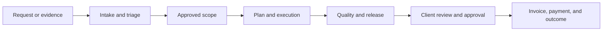

# Streamline Build product specification

Status: canonical planning set
Scope: signup, multi-module onboarding, Build experience, integrations, architecture, delivery, and release evidence
Audience: product, design, engineering, QA, security, sales, and support

## Purpose

This folder defines the product Streamline intends to build. It converts the research packs, repository inventory, and product decisions into one implementation-ready plan. It does not claim that every described capability exists today.

## Truth labels

Every implementation ticket and release note derived from this specification must use one of these labels:

- **Current verified**: demonstrated on the current commit through the stated evidence.
- **Current unverified**: found in source or prior evidence but not revalidated on the current commit.
- **Planned**: accepted target behavior that still needs implementation and verification.
- **Conditional**: enabled by plan, permission, module selection, integration, or feature flag.
- **Deferred**: intentionally outside the first sellable release.

Research files are inputs, not release claims. A screenshot, route, mock, or source file alone cannot upgrade a capability to **Current verified**.

## Canonical documents

1. [Product vision and decisions](./product/00-product-vision-and-decisions.md)
2. [Signup and multi-module onboarding](./onboarding/01-signup-and-multi-module-onboarding.md)
3. [Personas, navigation, and sidebars](./experience/02-personas-navigation-and-sidebars.md)
4. [Command Center and personal dashboards](./experience/03-command-center-and-personal-dashboards.md)
5. [Work surfaces and ticket details](./experience/04-work-surfaces-and-ticket-detail.md)
6. [Page catalog and flows](./experience/05-page-catalog-and-flows.md)
7. [UI components, filters, and states](./experience/06-ui-component-and-filter-system.md)
8. [Architecture, data, interfaces, cache, and AI](./architecture/07-architecture-data-api-cache-ai.md)
9. [Cross-module, client, content, and commercial flows](./integrations/08-cross-module-client-content-commercial.md)
10. [Roadmap, release gates, and positioning](./delivery/09-delivery-roadmap-release-gates-and-positioning.md)
11. [RBAC review](./governance/rbac/README.md)
12. [Cross-module product screen catalog](./experience/screens/cross-module-products.md)
13. [Paste-ready Claude implementation prompt](./CLAUDE-MASTER-IMPLEMENTATION-PROMPT.md)
14. [Source-aware implementation contract](./implementation/README.md)
15. [Deep-module reconciliation and ownership](./architecture/08-deep-module-reconciliation.md)
16. [Agent coordination and work ownership](./implementation/17-agent-coordination-and-work-ownership.md)
17. [Architecture work-package registry](./implementation/18-architecture-work-package-registry.md)
18. [Complete surface behavior matrix](./implementation/19-complete-surface-behavior-matrix.md)
19. [Active/completed work claims](./implementation/WORK-CLAIMS.md)

## Research inputs

- `streamlineos-analysis-pack/`: competitor inventory, capability evidence, filter research, and gap analysis.
- `streamlineos-pm-pack/`: JTBD, activation gaps, role/invite PRDs, and prioritized roadmap.
- `streamlineos-ux/`: surface ledger, browser observations, screenshots, UX patterns, and design challenges.
- Current repository routes, schemas, permission catalogs, and module registry.
- Product decisions recorded in the conversation with the owner.

Where an input conflicts with this canonical set, this set records the intended product decision. Current implementation truth must still be checked against the code and a running environment.

## Product in one sentence

Streamline Build turns customer evidence and agreed scope into prioritized work, controlled delivery, client approval, and traceable commercial outcomes in one permission-aware workspace.

## Required outcome chain

The chain is the primary differentiator to build and verify. Each link must preserve ownership: Build owns delivery records; CRM owns customer records; Timesheets owns time entries; Accounting owns invoices, payments, taxes, and ledgers.

## Product constraints

- One experience must work for a solo freelancer, an agency, and a large product organization.
- Software delivery is the primary opinionated workflow. Other professions use templates and custom fields without weakening the software workflow.
- Desktop web and responsive mobile web are required. Native mobile is deferred until the web experience is stable.
- Both full navigation and an AI-assisted low-screen workflow are supported.
- Security decisions are enforced on the server. Hidden UI is convenience, not authorization.
- Full export, account recovery, and baseline security are never pricing gates.
- Client access is grant-based and least privilege; a client is not automatically an organization member.
- Cross-module actions open the owning module with context and return links. Build does not duplicate another module's source of truth.

## Change control

A change to navigation, permissions, lifecycle, source-of-truth ownership, public links, money movement, or AI mutation requires an update to the relevant canonical document before implementation. Each delivery ticket must cite the section it implements and the evidence needed to close it.

Application implementation also requires an unambiguous work-package claim. An agent must claim one package, identify its primary seam and paths, verify prerequisites, and record its handoff in `implementation/WORK-CLAIMS.md`. Parallel work is allowed only for packages whose primary seams and file sets do not overlap.

## Complete screen and audit set

- [Detailed screens](./experience/screens/README.md): activation, projects, daily work, discovery, planning, clients, collaboration, quality, reporting, settings.
- [External client portal screens](./experience/screens/external-client-portal.md): granted projects, project overview, conditional deliverables, requests, approvals, files, updates, and invoices.
- [Route decisions](./experience/routes-and-screen-decisions.md): 75 existing routes, planned additions, aliases, redirects, removed navigation and deferrals.
- [Screen data contracts](./architecture/screen-data-contracts.md): authoritative domain projections and interface families.
- [Requirements coverage](./audit/requirements-coverage.md): original request mapped to decisions and acceptance.
- [Research traceability](./audit/research-traceability.md): retained source findings, identifiers and screenshot inventory.
- [Original WOW research crosswalk](./audit/original-wow-research-crosswalk.md): every numbered original finding mapped to an adopted, conditional, or deferred destination.
- [Comprehensive recheck](./audit/comprehensive-recheck-2026-10-02.md): source-to-spec reconciliation, corrections, and remaining implementation evidence.
- [Bugs and verification](./audit/bugs-and-verification.md): historical issues and required closure proof.
- [Customer value classification](./product/customer-value-and-differentiation.md): 100 reasons with customers, sources, priority and proof.
- [Cleanup manifest](./audit/cleanup-manifest.md): exact duplicate deletion/retention and reference rewrites.
- [Validation report](./audit/validation-report.md): final documentation checks and release limitations.

## Folder maintenance

Keep product decisions in product, activation in onboarding, page/UI contracts in experience, data/API/cache/AI in architecture, cross-module ownership in integrations, phased verification in delivery, authorization risks in governance/rbac, and coverage/evidence/cleanup records in audit. Retained research packs are historical inputs, not competing target specifications. New implementation work cites a canonical decision plus its evidence/acceptance section.

