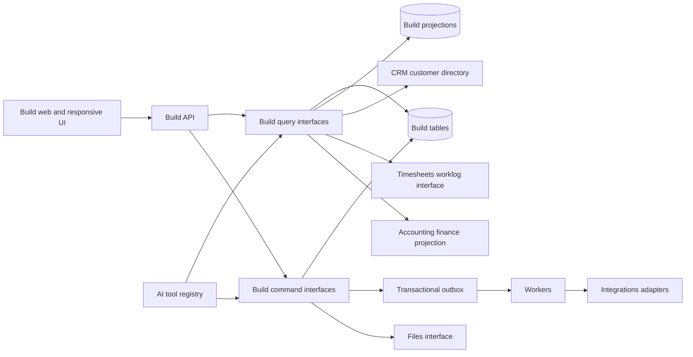
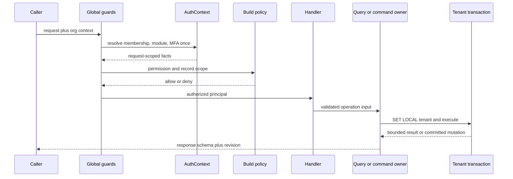
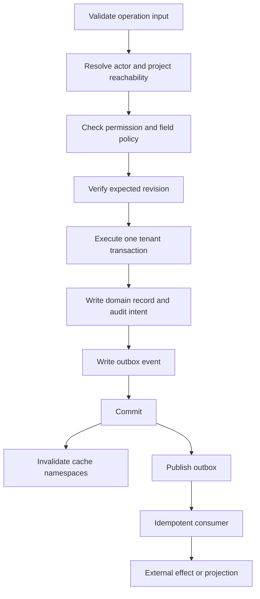
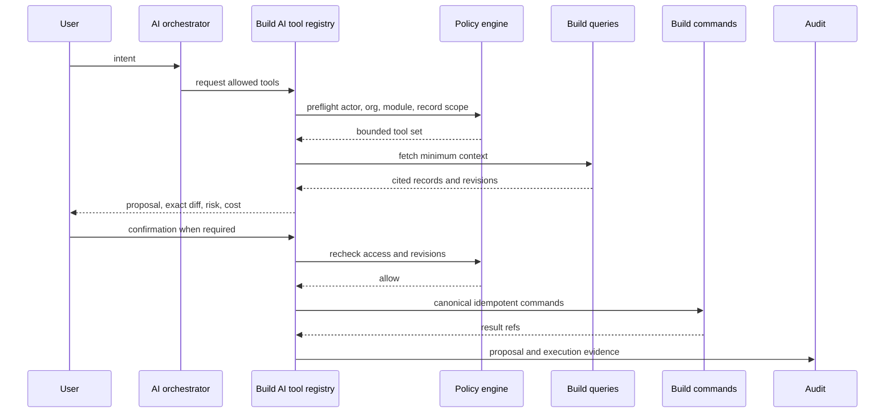

# Build architecture, data, API, cache, and AI

Status: planned target with current-source anchors and explicit verification gaps
Scope: the Build module and its contracts with Platform, CRM, Timesheets, Accounting, Files, Home, Notifications, Integrations, and AI

Architecture ownership, the 16 accepted deep-module decisions, their dependency order, and the current gate snapshot are canonical in [08-deep-module-reconciliation.md](./08-deep-module-reconciliation.md). This document remains the detailed data, HTTP contract, cache, AI, reliability, and folder-structure authority. Where examples here appear to permit a second command/query owner, document 08 controls the seam.

## 1. Purpose and evidence boundary

This document is the implementation authority for the future Build architecture. It defines ownership, interfaces, data, APIs, read paths, caches, asynchronous work, AI controls, reliability, and folder structure. It is a plan. A class, route, schema, or test in the repository proves that an implementation path exists; it does not by itself prove production behavior.

Truth labels used below are **Current verified**, **Current unverified**, **Planned**, **Conditional**, and **Deferred** as defined in the Build index. An accepted target is **Planned** until implemented and verified. A relevant code path or ADR is **Current unverified** evidence of structure. A database, browser, deployment, role, tenant, or operations check remains open until evidence from that environment is recorded.

Current source anchors include:

- `backend/src/modules/build/build.module.ts`: Build composition root.
- `backend/src/modules/build/core/projects.module.ts`: current core provider composition.
- `backend/src/db/schema/build/`: current Build-owned tables.
- `backend/src/modules/build/core/tickets/apply-ticket-change.ts`: canonical ticket mutation path.
- `backend/src/modules/build/core/project-crud/project-access.ts`: canonical project reachability path.
- `backend/src/common/auth/auth-context.ts`: request-scoped authorization facts.
- `backend/src/common/cache/cache.service.ts`: shared cache behavior.
- `backend/src/common/outbox/`: transactional outbox and consumer infrastructure.
- `backend/src/common/admission/`: request admission and load shedding.
- `backend/docs/adr/0004-auth-facts-resolve-once-per-request.md` through `0011-project-access-is-the-sole-reachability-owner.md`: accepted seams.

## 2. Architecture decisions

1. Keep a modular monolith until measured scaling or deployment independence justifies a service split.
2. Build owns delivery intent, work records, delivery evidence, approvals, releases, risks, and Build-specific reporting definitions.
3. Build references other modules through small interfaces. It does not import another module's tables to recreate its rules.
4. One command owner performs each mutation, regardless of whether the caller is UI, automation, import, AI, webhook, or system job.
5. List and dashboard reads use purpose-built projections. Commands do not mutate projections directly.
6. Every tenant row carries `org_id`; tenant filters lead indexes; database RLS remains a second boundary.
7. All retryable writes use an idempotency key and return the prior result for a matching key and payload hash.
8. External effects start after the database commit through an outbox. Consumers are idempotent.
9. AI uses the same query and command interfaces as a human. AI never bypasses authorization.
10. Cache is an optimization. Permission, revocation, billing ledger, ownership, and destructive-action truth are read from authoritative state.

## 3. Target architecture

### 3.1 Context



### 3.2 Request path



Every record operation checks both capability and reachability. A permission such as `build:tickets:update` does not prove that the actor may reach a particular project or ticket.

### 3.3 Mutation path



## 4. Domain ownership and cross-module seams

| Capability | Source of truth | Build contract | Build may persist |
|---|---|---|---|
| Organization, memberships, enabled modules, plan limits | Platform | `OrganizationAccessSnapshot` | stable IDs and display snapshots only when required for history |
| Customer, contact, account, deal | CRM/Party | `CustomerDirectoryRead` | CRM IDs, link purpose, approved display snapshot |
| Time entry, approval, bill rate | Timesheets | `TimesheetWorklogCommands`, `ProjectTimeProjection` | time totals projection with source revision |
| Invoice, payment, tax, ledger | Accounting | `ProjectFinanceProjection`, `AccountingDeepLinkResolver` | amount/status/aging projection with source revision |
| File bytes and signed download | Files | `BuildFileCommands`, `AuthorizedFileRead` | file reference, relation, visibility classification |
| Calendar and email | Home | `LinkedCommunicationRead` | link reference and delivery context |
| Provider credentials, signing, retries | Integrations | `IntegrationDeliveryPort` | provider mapping IDs and Build event meaning |
| Notifications | Notifications | domain event subscription | notification preference reference, not delivery state |
| Build tickets, projects, approvals, releases, evidence | Build | native command/query interfaces | authoritative Build records |

### 4.1 Required deep interfaces

Interfaces below hide policy, tenancy, pagination, version checks, and provider behavior. Controllers and peer modules must not reproduce those rules.

```ts
interface BuildTicketCommands {
  create(input: CreateTicketCommand, actor: Principal): Promise<TicketMutationResult>;
  applyChange(input: ApplyTicketChangeCommand, actor: Principal): Promise<TicketMutationResult>;
  archive(input: ArchiveTicketCommand, actor: Principal): Promise<TicketMutationResult>;
  restore(input: RestoreTicketCommand, actor: Principal): Promise<TicketMutationResult>;
}

interface BuildTicketWorkspaceQuery {
  getHeader(ref: TicketRef, actor: Principal): Promise<TicketHeader>;
  getSection(ref: TicketRef, section: TicketSection, page: CursorPage, actor: Principal): Promise<TicketSectionPage>;
}

interface BuildCommandCenterQuery {
  getSnapshot(input: CommandCenterQuery, actor: Principal): Promise<CommandCenterSnapshot>;
}

interface CustomerDirectoryRead {
  search(input: CustomerSearch, actor: Principal): Promise<CursorPage<CustomerSummary>>;
  resolve(ref: CustomerRef, actor: Principal): Promise<CustomerSummary>;
}

interface TimesheetWorklogCommands {
  startTimer(input: StartTimerCommand, actor: Principal): Promise<WorklogRef>;
  addEntry(input: AddWorklogCommand, actor: Principal): Promise<WorklogRef>;
}

interface ProjectTimeProjection {
  getProjectTotals(project: ProjectRef, actor: Principal): Promise<VersionedTimeSummary>;
  getTicketTotals(ticket: TicketRef, actor: Principal): Promise<VersionedTimeSummary>;
}

interface ProjectFinanceProjection {
  getProjectFinance(project: ProjectRef, actor: Principal): Promise<VersionedFinanceSummary>;
}

interface BuildImportCoordinator {
  preview(input: ImportSource, mapping: ImportMapping, actor: Principal): Promise<ImportPreview>;
  start(input: ConfirmedImport, actor: Principal): Promise<ImportJobRef>;
  status(job: ImportJobRef, actor: Principal): Promise<ImportJobStatus>;
}

interface BuildAiToolRegistry {
  describeAllowedTools(actor: Principal, context: BuildContext): Promise<AllowedTool[]>;
  propose(input: AiIntent, actor: Principal): Promise<AiProposal>;
  execute(proposal: ProposalRef, confirmation: Confirmation, actor: Principal): Promise<AiExecutionResult>;
}
```

Implementation notes:

- Keep `apply-ticket-change.ts` as the ticket mutation owner and wrap it with the `BuildTicketCommands` interface rather than creating a second path.
- Keep `project-access.ts` as the only project reachability owner.
- Replace Build reads of CRM/Party tables with `CustomerDirectoryRead`.
- Replace Build writes to Timesheets tables and manual `tickets.timeSpent` recomputation with the Timesheets interfaces. The projection carries `sourceRevision`, `computedAt`, and `freshness`.
- Accounting actions return a contextual deep link or an Accounting command result. Build never writes invoice, tax, payment, or ledger rows.
- Integrations owns secrets, provider clients, signatures, retry policy, and circuit breakers. Build owns the event vocabulary and mapping to Build IDs.

## 5. Data model

### 5.1 Invariants for every new table

- Use UUID or approved bigint identity; do not introduce new `serial` identifiers.
- Include `org_id`, `created_at`, `updated_at`, and actor fields where meaningful.
- Add `version bigint not null default 1` to mutable collaborative records.
- Use a composite tenant foreign key where a child references a tenant-owned parent.
- Put `org_id` first in unique constraints and high-use indexes.
- Use soft delete when history, references, or restoration matter; all reads exclude deleted rows by default.
- Store money as integer minor units plus ISO currency.
- Store timestamps in UTC and keep the user's display time zone outside the timestamp.
- Avoid polymorphic `entity_type/entity_id` links for authorization-bearing relationships. Use typed link tables.

### 5.2 Required normalized additions

| Table | Purpose | Key columns and constraints |
|---|---|---|
| `build.project_managed_products` | Many products linked to one project | `org_id, project_id, managed_product_id, is_primary`; unique pair; one partial unique primary per project |
| `build.project_customer_links` | Primary client, affected client, sponsor, billing contact relationship | `org_id, project_id, party_id, relationship, visibility`; typed enum; unique relation tuple |
| `build.ticket_customer_impacts` | Multiple affected customers or segments | `org_id, ticket_id, party_or_segment_ref, impact_type, visibility`; separate typed tables if customer and segment authorization differ |
| `build.command_center_layouts` | User layout per organization | `org_id, membership_id, layout_version, template_revision, document, version`; unique active layout per membership |
| `build.command_center_snapshots` | Optional short-lived materialized read model | query dimensions, source revisions, generated time; never authoritative |
| `build.import_jobs` | Durable import lifecycle | source, blob ref, mapping version, status, counts, checkpoint, idempotency key, requested by |
| `build.import_row_results` | Bounded error and reconciliation report | job ID, source row key, target ref, outcome, error code; archive after retention period |
| `build.ai_proposals` | Reviewable AI mutation plan | actor, context, tool version, input hash, diff, risk class, cost estimate, expires at, status |
| `build.ai_executions` | Immutable AI execution evidence | proposal ID, confirmer, command idempotency keys, result refs, token/cost totals, policy decision ID |
| `build.projection_revisions` | Cross-module projection watermarks | projection key, source module, source revision, applied at |

JSON is allowed for display layout, import mapping, and immutable AI proposal details after schema validation and versioning. It must not replace relational authorization, membership, client grants, project links, or workflow state.

### 5.3 Custom fields

Use one governed custom-field engine. Build-specific code provides eligible record types and field policies; it does not create a second field engine.

Required definition fields:

- `org_id`, stable definition ID, module key, record type, key, label, data type, schema version.
- required/default/options/validation/visibility/sensitivity/searchability.
- lifecycle state: draft, active, retired; definitions referenced by records are never hard-deleted.
- scope: organization, managed product, project, or template.
- client visibility and AI eligibility are explicit and default to false for sensitive fields.

Custom-field values use typed columns or validated typed value tables. Filters and indexes are enabled only for fields marked searchable. A change in type creates a migration job and compatibility window; it never silently reinterprets existing values.

## 6. API and wire contracts

### 6.1 Contract authority

- Backend Zod operation and response schemas are authoritative.
- OpenAPI is generated and vendored from backend schemas.
- Frontend types and decoders are generated from the contract. Handwritten duplicate wire schemas are prohibited.
- Every operation declares `x-exposure` and its required permission metadata.
- List responses use `{ items, pageInfo, facets?, revision? }`.
- Mutations return the affected resource reference, new revision, audit reference, and replay status.
- Breaking changes require a versioned endpoint or an explicit compatibility decoder and removal date.

### 6.2 Target endpoint groups

| Endpoint | Purpose | Required properties |
|---|---|---|
| `GET /build/dashboards/default` | Resolve authorized default dashboard | layout version and widget descriptors; widget results use `POST /build/dashboard-query` |
| `GET /build/projects` | Project list | cursor, bounded facets, explicit projection, stable sort |
| `POST /build/projects` | Project creation | idempotency key, template version, client/product links |
| `GET /build/projects/:projectId/tickets` | Ticket list/board source | shared filter AST, cursor, fields projection, grouping metadata |
| `POST /build/projects/:projectId/tickets` | Canonical ticket creation | idempotency key; same command used by forms/import/AI |
| `GET /build/projects/:projectId/tickets/:ticketKey` | Ticket header and section manifest | revision, allowed actions, visibility-safe summaries |
| `GET /build/projects/:projectId/tickets/:ticketKey/:section` | Paged heavy section | comments, activity, links, files, worklogs, approvals, delivery evidence |
| `PATCH /build/projects/:projectId/tickets/:ticketKey` | Canonical mutation | expected revision, changed fields, idempotency key |
| `POST /build/imports/preview` | Validate file/mapping | preview token, schema version, bounded sample, counts |
| `POST /build/imports` | Start durable import | preview token, mode, idempotency key |
| `GET /build/imports/:jobId` | Progress/reconciliation | checkpoint, counts, bounded errors, retry/rollback eligibility |
| `POST /build/ai/proposals` | Produce reviewable plan | intent, context, maximum scope and cost |
| `POST /build/ai/proposals/:id/execute` | Execute confirmed plan | proposal revision, confirmation, idempotency key |

Use `409` for revision conflicts, `422` for valid JSON that violates domain rules, `403` for a known record the actor may reach but cannot operate, and `404` when revealing record existence would leak data. Error bodies contain a stable code, safe message, correlation ID, retryability, and field errors where applicable.

### 6.3 Query and filter model

All Build list surfaces compile one versioned filter AST. Do not create a separate filter grammar for table, board, reports, exports, AI, or saved views.

```ts
type FilterExpression = FilterGroup | FilterCondition;
type FilterGroup = { kind: "group"; operator: "and" | "or"; children: FilterExpression[] };
type FilterCondition = { kind: "condition"; fieldId: string; operator: FilterOperator; value?: unknown };
type FilterEnvelope = { version: 1; expression: FilterExpression | null };
```

Required rules:

- Allow-listed fields and operators per record type.
- Typed parsing for dates, numbers, users, enums, relationships, and custom fields.
- Explicit time zone for relative dates.
- Maximum depth, predicate count, `in` values, and text length.
- Parameterized SQL only. Search uses the approved search index, not leading-wildcard scans.
- Cursor pagination uses a deterministic tie-breaker. Offset pagination is limited to small settings collections.
- Facets are bounded, permission-filtered, and computed from the same base predicate.
- Saved views persist AST version, columns, grouping, sort, density, and sharing scope.
- Export and report drill-down compile the same predicate as the interactive view.

### 6.4 Ticket workspace read model

The initial ticket response must stay small:

- identity, key, title, state, priority, assignees, dates, project, product, client-safe marker.
- revision, permissions, allowed transitions, conflict token.
- counters and cursors for comments, activity, files, links, worklogs, approvals, and evidence.
- section availability based on permissions and enabled modules.

Load the active section independently. Comments, activity, files, and linked tickets are cursor-paged. The split pane and full page use the same query keys and cache records. The canonical URL remains the full ticket route; pane state uses intercepted/parallel routing and preserves list filters in the return URL.

## 7. Cache, revisions, and invalidation

### 7.1 Cache key standard

`{environment}:{schemaVersion}:{region}:{orgId}:{principalScopeHash}:{resource}:{queryHash}:{sourceRevision}`

The query hash includes every field that can change the result: filters, sort, cursor, projection, locale, time zone, visibility mode, and permission version. Raw tokens, email addresses, names, ticket text, and client content never appear in keys.

### 7.2 Cache matrix

| Read | Cache | Suggested freshness | Invalidation owner | Failure behavior |
|---|---|---:|---|---|
| Permission snapshot | Redis/versioned | request plus short shared TTL | access mutation commit | fail closed for mutations; authoritative fallback for reads |
| Project reachability | request memo plus short Redis | 30-60 s | project/member/team writers | authoritative fallback |
| Ticket detail header | Redis/versioned | 30 s | ticket command owner | database fallback |
| Ticket list/board page | Redis/versioned | 15-30 s | ticket/project/workflow writers | database fallback; stale marker only for safe reads |
| Command Center | Redis/versioned | 15-60 s per section | each source writer bumps section revision | return partial snapshot with freshness |
| Report result | Redis/versioned | 1-15 min by report | relevant source revision | asynchronous refresh for expensive reports |
| CRM/Timesheets/Accounting projection | projection cache | event driven plus reconciliation | owning module event consumer | show source timestamp; financial actions re-read authority |
| Portal projection | Redis/versioned | short | Build writer and grant/revocation writer | grant check is authoritative; fail closed |
| AI context | request only | request lifetime | none | rebuild within fixed query/token budget |

Every cached read declares an owner, key dimensions, TTL, maximum acceptable staleness, writers, invalidations, and fallback. Hot keys use single flight and a distributed lease with jitter. Cache namespaces are versioned so incompatible deploys cannot deserialize old values. Negative caching is short and never used for permission grants or revocations.

Client caches use one query-key factory per entity and include organization, project, filters, projection, and route mode. Mutation success updates the entity revision or invalidates the smallest owning namespace. Optimistic updates must roll back on `409`, `403`, or network failure.

## 8. Events, outbox, idempotency, and jobs

### 8.1 Event envelope

```json
{
  "eventId": "uuid",
  "eventType": "build.ticket.changed.v1",
  "occurredAt": "ISO-8601",
  "orgId": "tenant",
  "aggregateType": "ticket",
  "aggregateId": "stable-id",
  "aggregateVersion": 42,
  "actor": { "kind": "human-session", "id": "safe-id" },
  "correlationId": "uuid",
  "causationId": "uuid-or-null",
  "idempotencyKey": "opaque",
  "payload": {}
}
```

Required Build events:

- `build.project.created.v1`, `build.project.changed.v1`, `build.project.archived.v1`.
- `build.ticket.created.v1`, `build.ticket.changed.v1`, `build.ticket.archived.v1`.
- `build.ticket.blocked.v1`, `build.ticket.unblocked.v1`.
- `build.approval.requested.v1`, `build.approval.decided.v1`.
- `build.release.published.v1`, `build.release.changed.v1`.
- `build.delivery_evidence.added.v1`.
- `build.client_feedback.received.v1`.
- `build.import.completed.v1`, `build.import.failed.v1`.

The producer writes the domain mutation and outbox row in one transaction. Consumers claim with bounded batches, renew leases, record inbox completion, reject stale aggregate versions, and use an external-effect ledger for non-database effects. Retry uses exponential backoff and jitter. Poison events move to a dead-letter state with alerting and replay tooling.

Imports, exports, report refresh, bulk changes, AI enrichment, and connector synchronization are durable jobs. Each job exposes status, progress counts, last checkpoint, cancelability, retryability, and a safe error summary. Workers are separate from API capacity and use per-tenant concurrency quotas.

## 9. AI architecture

### 9.1 Tool flow



### 9.2 Authorization and confirmation

- AI receives the caller's principal; it never receives a superuser or service identity for an interactive request.
- Tool discovery is permission filtered. Hidden records, fields, and tools are absent from context.
- Authorization is checked during proposal creation and again immediately before execution.
- A proposal is immutable, versioned, expires, lists exact records/fields, and binds source revisions. A stale proposal cannot execute silently.
- Reading, summarizing, drafting, and suggesting may run without confirmation when they create no durable effect.
- External communication, financial action, access change, deletion, archival, bulk mutation, workflow change, release publication, client-visible change, and any destructive operation require explicit confirmation.
- AI cannot approve its own proposal, weaken permissions, expose private notes, or infer access from UI visibility.
- Denied tools return a safe reason without exposing inaccessible records.

### 9.3 Audit and token efficiency

Audit records capture actor, organization, tool and prompt-template version, cited record IDs, policy decision ID, proposal hash, confirmation actor/time, command idempotency keys, outcome, tokens, model, cost, and correlation ID. Do not store secrets or full sensitive prompts in general logs.

Token controls:

- Query structured summaries first; fetch full descriptions/comments only when needed.
- Use field allow lists and per-tool record/count/character budgets.
- Retrieve by project, ticket, revision, and permission scope before semantic search.
- Summarize long threads into versioned, cited digests and invalidate on source revision.
- Use deterministic code for filtering, arithmetic, permissions, dates, and validation.
- Deduplicate context by stable record ID and revision.
- Route simple classification/extraction to the least expensive approved model; reserve stronger models for planning with measurable benefit.
- Reserve credits before a costly run, settle actual use afterward, and release unused reservation.

## 10. Observability and service objectives

### 10.1 Telemetry

Every request and job carries `trace_id`, `correlation_id`, `org_id_hash`, operation name, deployment version, region/cell, principal kind, and outcome. Do not place raw organization IDs, user IDs, ticket keys, names, emails, descriptions, or client data in metric labels.

Required spans and metrics:

- guard and policy duration, deny reason category, permission snapshot cache result.
- query compile/DB/cache durations, rows examined/returned, cursor page size.
- ticket mutation conflict rate, transaction duration, outbox write duration.
- outbox queue age, attempts, deadline misses, dead letters, consumer lag by event type.
- dashboard section latency, partial failure rate, source freshness.
- import queue age, throughput, row error category, reconciliation completion.
- portal grant denial, expiry, revocation propagation, magic-link redemption failure.
- AI proposal latency, execution success, denial, confirmation abandonment, tokens and cost by tool class.
- DB pool wait, active/idle connections, event-loop lag, heap, worker saturation, cache hit rate and circuit state.

### 10.2 Initial SLOs

These are launch targets and must be tuned from measurements.

| Journey | SLO target |
|---|---|
| Authenticated Build availability | 99.9% monthly |
| Ticket header read | p95 <= 400 ms, p99 <= 1 s |
| Filtered ticket first page | p95 <= 800 ms for supported query budget |
| Normal ticket mutation | p95 <= 800 ms excluding external effects |
| Command Center initial snapshot | p95 <= 1.2 s with section deadlines |
| Outbox critical-event pickup | 99% <= 30 s |
| Portal revocation enforcement | <= 60 s, target immediate through version bump |
| Import job start acknowledgement | p95 <= 500 ms |
| AI proposal | publish per-tool target; never block a normal mutation lane |

Alert on burn rate, not isolated spikes. Each alert links to a runbook and names its owner.

## 11. Scaling, admission, and degradation

### 11.1 Capacity model

- API replicas are stateless. Session, idempotency, cache epochs, job state, and outbox state live in shared stores.
- Worker pools are separated by workload: critical events, imports/exports, report refresh, integrations, and AI.
- Total application DB connections stay below the database connection budget: `replicas * pool_max + workers * worker_pool_max + operational_reserve <= database_limit`.
- Autoscaling signals combine CPU, event-loop lag, memory, DB pool wait, request queue age, worker queue age, and p95 latency. CPU alone is insufficient.
- Scale-in drains HTTP traffic and stops new job claims before termination. Leased jobs become reclaimable after expiry.
- Per-process admission counters are local protection; global capacity still needs DB/queue budgets and per-tenant fairness.

### 11.2 Admission classes

Never shed authentication, revocation, ownership, audit, required security notification, or authoritative financial operations. Under pressure, shed or defer in this order:

1. prefetch and speculative counts;
2. AI enrichment;
3. search freshness and background indexing;
4. analytics/report refresh;
5. non-mandatory notifications;
6. ordinary writes only when the system cannot execute safely, returning `503` and `Retry-After`.

Command Center may return healthy sections plus explicit failed/stale sections. Ticket mutation may not claim success after an ambiguous commit; it returns a correlation/idempotency key that the client can safely reconcile.

### 11.3 Deployment requirements

- External scheduling must invoke workflow/outbox maintenance endpoints or jobs. A controller existing in source is not proof that production schedules it.
- Readiness checks include database write/read capability, required migrations, cache degradation state, outbox publisher health, and deployment identity.
- Migrations use expand/backfill/contract. Deploys remain compatible with the previous application version during rollout.
- Restore, outbox replay, dead-letter recovery, cache failure, and import recovery are rehearsed in a non-production environment.
- Read replicas may serve explicitly stale-safe projections only. Authorization, mutation preconditions, ownership, client grant validation, and financial truth use the primary authority.

## 12. Security requirements

- Deny by default at route classification, module entitlement, permission, record reachability, field policy, and database RLS.
- Resolve module, membership, and MFA facts once per request through `AuthContext`.
- Use the canonical `project-access.ts` owner for project reachability.
- Run tenant SQL inside the tenant transaction and require `org_id` in every query predicate even with RLS.
- Validate request bodies strictly; reject unknown keys on mutation inputs.
- Apply CSRF protection to cookie-authenticated mutations, restrictive CORS, secure cookies, rotation and revocation for sessions, and rate limits by account, IP class, organization, route, and principal type.
- Scan uploads, validate declared and detected media type, cap size, keep storage private, and authorize every signed URL issuance.
- Client magic links are single use or narrowly reusable by policy, short lived, audience bound, grant bound, revocable, and hashed at rest.
- Encrypt provider secrets with managed keys and prevent secrets from entering Build tables, logs, events, prompts, or cache keys.
- Audit privileged reads, exports, access changes, client visibility changes, release publication, destructive actions, AI execution, and impersonation.
- Export and deletion jobs recheck authority at execution time.

## 13. Folder and dependency structure

### 13.1 Backend

```text
backend/src/modules/build/
  build.module.ts                 # composition only
  core/
    projects.module.ts            # temporary composition root; shrink as seams move
    project-crud/
      project-access.ts           # sole project reachability owner
    tickets/
      apply-ticket-change.ts      # sole ticket mutation owner
  command-center/
    command-center.module.ts
    command-center.controller.ts
    command-center-query.service.ts
    dto/
  ticket-workspace/
    ticket-workspace.module.ts
    ticket-workspace.controller.ts
    ticket-workspace-query.service.ts
    dto/
  imports/
    import-coordinator.ts
    adapters/
      jira-import.adapter.ts
      linear-import.adapter.ts
      asana-import.adapter.ts
      trello-import.adapter.ts
      clickup-import.adapter.ts
  ai/
    build-ai-tool-registry.ts
    tools/
    dto/
  ports/
    customer-directory-read.port.ts
    project-time-projection.port.ts
    timesheet-worklog-commands.port.ts
    project-finance-projection.port.ts
    accounting-deep-link.port.ts
  projections/
  events/
  policies/
```

Rules:

- Controllers validate and delegate. They contain no SQL or policy reconstruction.
- Services may access their own module schema directly; do not add a repository layer.
- Cross-module access uses injected interface tokens and adapters.
- A child feature imports through the parent's public barrel. External modules do not import deep Build internals.
- Split `projects.module.ts` into private feature modules when doing so creates a real seam; avoid one-file wrapper modules.

### 13.2 Frontend

```text
frontend/app/(authenticated)/build/
  page.tsx
  projects/[projectId]/...
  projects/[projectId]/tickets/[ticketKey]/page.tsx
  @ticket/(.)projects/[projectId]/tickets/[ticketKey]/page.tsx

frontend/features/build/
  command-center/{components,hooks,lib}/
  ticket-workspace/{components,hooks,lib}/
  projects/{components,hooks,lib}/
  imports/{components,hooks,lib}/
  reports/{components,hooks,lib}/

frontend/hooks/api/build/
  command-center.ts
  projects.ts
  tickets.ts
  ticket-workspace.ts
  imports.ts

frontend/lib/query-keys/
  build-command-center.ts
  build-projects.ts
  build-tickets.ts
```

Rules:

- Route files compose feature views and own route-level states; they do not implement business logic.
- Client requests go through `lib/api` or `hooks/api`.
- URL owns shareable filters, sort, grouping, pagination, active ticket, and active tab.
- One filtered navigation model drives sidebar, command search, mobile navigation, and shortcuts.
- Features do not import other features. Shared components move only after a second real consumer exists.
- Server state stays in the query cache. Draft edits stay local until submitted. Dashboard layouts are persisted server-side with optimistic concurrency; local storage is only a fast cache.

## 14. Current architecture gaps to close

These are source-informed planning gaps and require fresh verification during delivery:

1. Build customer lookup currently reaches Party/CRM schema directly in `backend/src/modules/build/core/customers/projects-customers.service.ts`; replace it with the customer-directory seam.
2. Build timesheet and budget paths currently read or write Timesheets tables, including `backend/src/modules/build/execution/timesheets.service.ts` and `backend/src/modules/build/core/budget/projects-budget.service.ts`; move authority behind Timesheets interfaces.
3. A project currently has singular CRM/product references in Build core data. The accepted product needs multiple managed products and customer relationships with one explicit primary.
4. Ticket customer impact is singular in the current core shape. The target requires normalized, visibility-aware affected-customer/segment links.
5. Home dashboard customization currently has client-local behavior while a multi-organization user needs an organization-scoped, server-versioned layout.
6. Build has many API and hook files. The generated backend contract must replace handwritten duplicate frontend response schemas without creating a mega-barrel.
7. Native competitor imports are not established by the current generic CSV/JSON import surface. Jira, Linear, Asana, Trello, and ClickUp need adapters over one durable import coordinator.
8. Admission, cache, outbox, region, and health primitives exist in source. Production scheduler wiring, autoscaling policy, alerts, restore drills, and deployment evidence remain separate gates.
9. Outbox consumer registration, list projection coverage, and bounded-read conformance must pass current executable gates before release; provider declarations alone are insufficient evidence.

## 15. Required implementation and release evidence

Each architecture delivery ticket must provide:

1. schema migration and rollback/forward-fix plan;
2. operation schema, generated OpenAPI diff, and frontend generated contract;
3. positive and negative permission tests for Owner, Org Admin, Org Member with and without Build invitation, Build Owner/Admin/Member, and client principal;
4. cross-tenant and inaccessible-record tests;
5. concurrency, idempotency, revision-conflict, and duplicate-event tests;
6. bounded-query evidence with representative cardinality and query plan;
7. cache writer/invalidation matrix and stale/failure test;
8. outbox/consumer registration and replay evidence;
9. browser proof for loading, empty, filtered-empty, success, error, unauthorized, stale, offline/retry, and mobile states;
10. observability proof showing traces, low-cardinality metrics, alerts, and runbook links;
11. target-database migration/RLS evidence;
12. deployment proof for schedules, worker capacity, autoscaling, drain, rollback, and recovery.

No capability becomes a release claim until the applicable source, static, database, browser, role/tenant, deployment, and operations evidence is recorded.


## Reconciled screen interfaces

[Screen data contracts](./screen-data-contracts.md) define the projection and HTTP families. The filter wire contract is FilterEnvelope v1 using group/condition with operator/fieldId; remove predicate/op/field variations during implementation compatibility migration. Dashboards use dashboards/default plus dashboard-query; any legacy command-center endpoint is an adapter to this owner. Workstreams is the UI/domain label for compatible project modules. Chat/Knowledge/Home/Files are source owners; Build owns project associations.

## Delivery checklist

Track completion in the [requirement ledger](../implementation/REQUIREMENT-LEDGER.md) and [work claims](../implementation/WORK-CLAIMS.md). An unchecked item stays open until evidence is recorded on the current branch.

- [x] Map every Build route, command, read projection, job, cache, and cross-module handoff to one domain owner and an explicit organization, module, project, record, action, and field policy.
- [ ] Finish the deep application interfaces for module access, project provisioning, ticket commands, scoped queries, dashboards, portal grants, Files relations, and cross-module references before moving callers or deleting duplicate services.
- [ ] Add normalized tenant-scoped relationship tables and constraints for authorization-bearing links; migrate custom fields through a typed registry with validation, indexing, revision, and lifecycle rules.
- [x] Make backend registered schemas the wire-contract authority, generate frontend clients, enforce strict nested mutation objects, and fail CI on stale output, missing handlers, or restore omissions.
- [ ] Standardize FilterEnvelope v1, stable cursor pagination, allowlisted sorting, authorized facets/counts, and bounded ticket workspace projections across screens, reports, exports, and AI.
- [x] Define tenant-, permission-, filter-, and revision-aware cache keys for each projection; prove invalidation and safe stale/failure behavior after a write or access revocation.
- [x] Write domain mutations, audit facts, and outbox records transactionally; verify idempotency keys, registered consumers, retry/backoff, dead-letter recovery, and duplicate delivery.
- [x] Route AI reads and proposed mutations through the same scoped interfaces as human users; verify inaccessible-record refusal, confirmation, provenance, token/cost telemetry, and execution-time authority.
- [ ] Implement low-cardinality traces and metrics, alerts, capacity admission, worker drain, overload degradation, backup/restore, and documented SLO measurement before scale claims.
- [x] Enforce file, portal, webhook, import/export, secret, and signed-link controls through the owning services; prove tenant isolation and redaction in API, logs, analytics, and AI context.
- [x] Move frontend and backend callers to the documented dependency direction with thin routes, workflow features, domain services, adapters, and generated contracts; remove duplicates only after parity and rollback evidence.
- [ ] Re-run architecture gates and obtain target-database migration/RLS/query-plan, populated browser, role/tenant, deployed-revision, and outage-recovery evidence for every applicable release claim.
