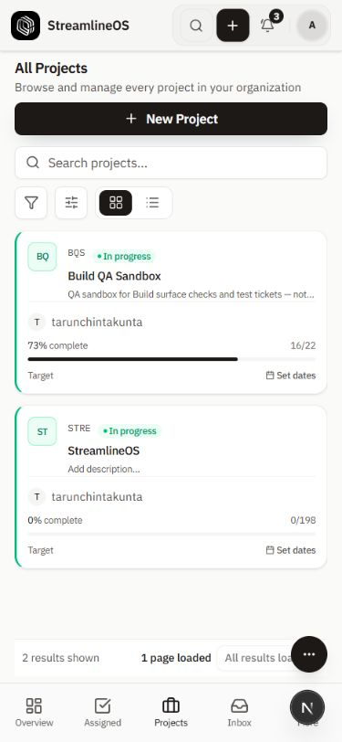
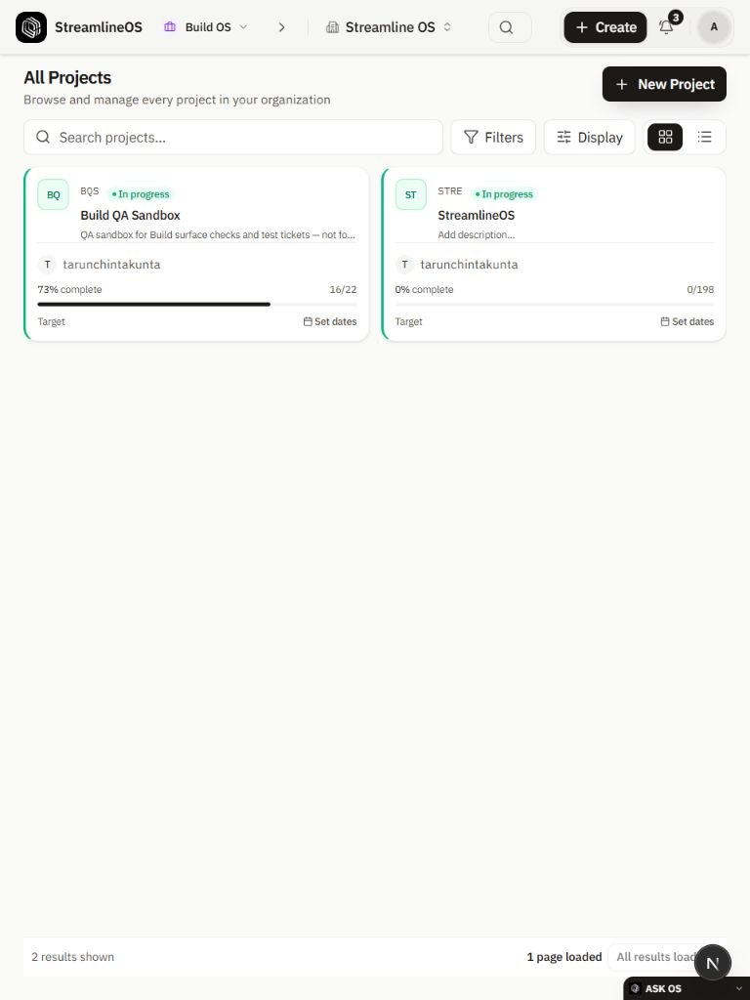
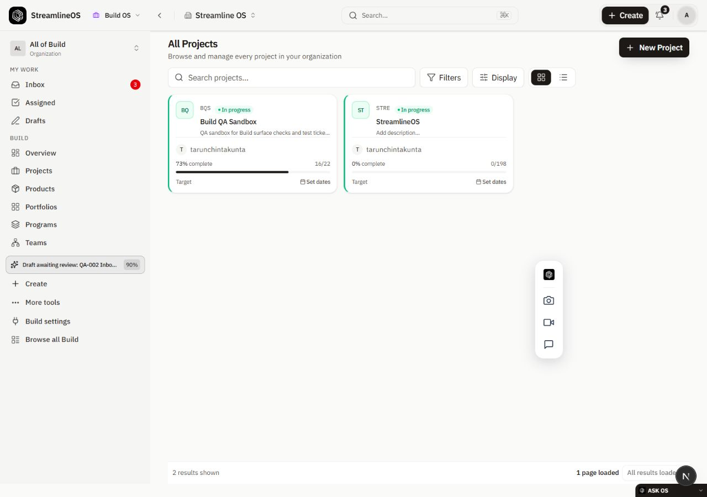
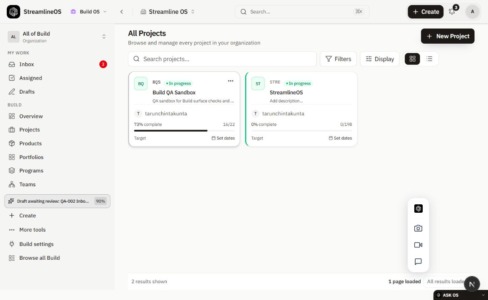
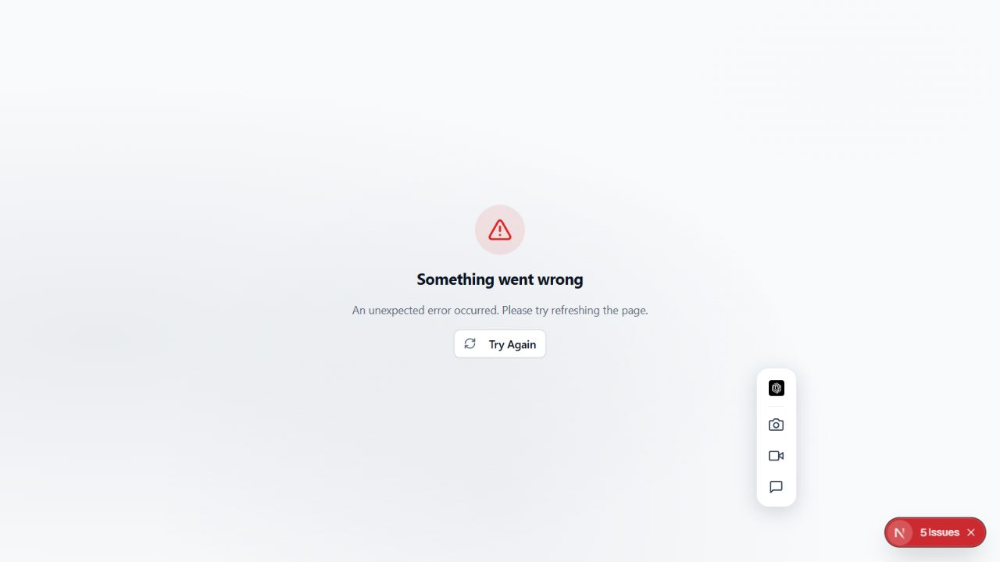

# Projects browser verification — 2026-10-03

Status: Current verified for the observations recorded below. Current unverified for complete Projects acceptance, project detail navigation success, mutations, restricted roles, complete responsive actions, and deployment parity.

## Environment and source

The local frontend at `http://localhost:1000` used the deployed API configured in its existing environment. This verifies the changed frontend against that API; it does not verify the new backend source. The browser was signed into the existing organization-owner account. No account, project, ticket, membership, or organization was changed during these observations.

| Slice | Source revision | Checks |
|---|---|---|
| Projects manager filter, scope title, native card link | `3431ff627` | Five focused frontend suites, 29 tests; scoped lint has zero errors. |
| Optional Resume error isolation | `cb7b16fa6` | Three focused frontend suites, 12 tests; scoped lint has zero errors; independent review by `module_grants_resume` found no blocker. |

## Browser observations

1. `/build/projects` displayed the owner title **All Projects** and the two existing project rows.
2. Grid navigation initially failed because the optional Resume read for project `6` returned HTTP 500 and propagated to the collection error boundary. The source fix uses the canonical inline-read error policy. It retains a resume reference for transient errors, and clears it only for denied, missing, or inactive projects.
3. After reloading the changed frontend, `/build/projects?view=grid` displayed both project cards while the optional project-detail request still failed. The collection remained usable.
4. A middle click on the native project-card link opened `/build/6` in another tab and kept the original collection tab at its grid URL. A Control-click attempt in the in-app browser did not create a tab; this is not recorded as a passing modifier-click check.
5. The new detail tab displayed **Something went wrong**. The deployed `/build/6` request returned HTTP 500 with code `INTERNAL_ERROR`; one recorded correlation ID is `20187789-b107-4864-aaed-da269fe3717a`. Project-detail success remains open.
6. The rendered grid was inspected at viewport widths 375, 768, and 1280. `document.documentElement.scrollWidth` equaled the viewport width at each size. Mobile bottom navigation and tablet/desktop shell controls were visible. These checks establish bounded layout only; create, filter, keyboard, pane, and permission behavior at each size remains open. The viewport override was reset afterwards.

## Read-only diagnosis

The configured application database role was used with IAM authentication, `SET TRANSACTION READ ONLY`, a 20-second statement timeout, and the existing organization and INTERNAL audience GUCs. Source column names for Projects, Project statuses, Project members, Organization members, Business parties, and Client party mapping all existed in the target catalog.

The current source's relational project read, including ordered statuses and projected member identity, succeeded for project `6`: one project, four statuses, one member. No record payload, email, credential, token, or connection URL was printed. This narrows the diagnosis; it does not reproduce the entire deployed HTTP path or identify the 500's cause. The local verification runner must exercise the complete current HTTP path before a source repair is selected.

## Remaining acceptance

The Projects requirement stays open. Browser checks still need successful full-page and pane navigation, ordinary and modifier clicks, return history, refresh persistence, manager/status/health filters, pagination, restricted access, responsive actions, and create/import behavior. Backend health/cursor source at `91eb81f46` passed independent review, 67 focused tests, production/scoped typechecks, lint, and the limited-data application-role measurements in [health/cursor evidence](2026-10-03-project-health-paging.md). Those source and read-only query checks do not prove browser or deployment acceptance. Synthetic signup and permission tests will use local captured mail and real application guards.

## Frontend typecheck

`pnpm -C frontend type-check` initially failed solely on two stale generated `.next/types` blog category/tag route stubs. The coordinator verified ownership and stopped its own Next dev process, checked both paths remained inside `frontend/.next`, removed exactly those generated files, and reran the same package command. Next route generation and the full frontend production TypeScript check then passed. No application blog file or environment file was changed. This compiler result is separate from browser acceptance.

## Delivery checklist

- [x] Record the named evidence, its source or runtime scope, and the remaining verification limits in this report.

Unfinished implementation and release acceptance remain tracked in the [requirement ledger](../../implementation/REQUIREMENT-LEDGER.md) and [work claims](../../implementation/WORK-CLAIMS.md). This checked item records evidence capture only.
