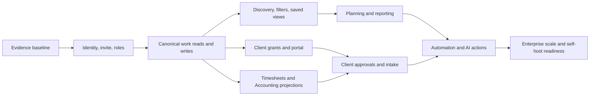

# Streamline Build — Delivery Roadmap, Release Gates, and Positioning

**Status:** planning contract; no implementation authorization
**Reviewed:** 2026-10-02 (Asia/Calcutta)
**Audience:** Product, Design, Architecture, Engineering, QA, Security, Support, Sales
**Scope:** Build as a standalone product and as a selectable StreamlineOS module

## 1. Decision summary

Streamline Build will serve freelancers, agencies, software product teams, project teams, and content teams from one canonical work model. The first commercial story is broader than a narrow engineering tracker, but software delivery remains the default design center. Other industries enter through templates, terminology, fields, and workflows instead of separate product forks.

The product should be sold independently and inside multi-module StreamlineOS deployments. Build owns projects, tickets, delivery, milestones, risks, decisions, approvals, client-visible progress, and delivery evidence. CRM owns customers and relationship records. Timesheets owns time entries, approvals, rates, and billable state. Accounting owns invoices, payments, tax, reconciliation, and ledgers. Build presents permission-safe projections and deep links into those modules.

The product promise is:

> **From customer request to delivered outcome, Streamline Build connects planning, execution, evidence, approvals, and client communication in one secure workspace.**

The short expression is:

> **Plan it. Build it. Prove it.**

This is a target position, not a current release claim. Current evidence still describes a controlled pilot with incomplete role, guest, tenant-isolation, and end-to-end browser proof. The release gates in this document must be passed before stronger replacement claims are used.

## 2. Evidence and truth labels

Every roadmap, demo, and sales statement must use one of these labels:

| Label | Meaning |
| --- | --- |
| **Current verified** | Present in the product and supported by current, reproducible evidence for the stated role and environment. |
| **Current unverified** | Present in source or historical observations; not reverified in the current deployment. |
| **Conditional** | Target availability depends on plan, permission, enabled module, integration, or policy. Historical surface evidence does not prove this capability is working. |
| **Planned** | Approved product direction that still requires implementation and verification. |
| **Deferred** | Deliberately outside the current release sequence. |
| **Deferred (rejected approach)** | A feature or approach Streamline Build should intentionally avoid. |

Evidence precedence:

1. Current browser behavior with real persisted data and recorded frontend/backend deployment identities.
2. Current API, database, queue, audit, cache, and permission evidence.
3. Current automated tests that exercise production-compatible paths.
4. Current source inspection.
5. Historical screenshots, ledgers, or documents.

Historical evidence is a lead for re-verification. It is not release proof.

Primary internal evidence inputs:

- [`CI-COMPLETENESS-STATUS.md`](../streamlineos-analysis-pack/01-ci/CI-COMPLETENESS-STATUS.md)
- [`CI-GAP-REGISTER-live.md`](../streamlineos-analysis-pack/01-ci/CI-GAP-REGISTER-live.md)
- [`ICP-ROADMAP-TOP15.md`](../streamlineos-pm-pack/02-competitor-deep/ICP-ROADMAP-TOP15.md)
- [`100-WOW-REASONS.md`](../streamlineos-analysis-pack/01-ci/competitor-deep/100-WOW-REASONS.md)
- [`NOW-FREEZE-v1.md`](../streamlineos-pm-pack/01-freeze-completeness/NOW-FREEZE-v1.md)
- [`provisional-roadmap-v0.md`](../streamlineos-pm-pack/01-freeze-completeness/provisional-roadmap-v0.md)

The pack records only a small set of historically observed strengths and one conditional portal strength. It also records unresolved or historically broken invite, Build-role, client-grant, member-discovery, role-matrix, and tenant-isolation paths. Re-test all of them on the current branch before changing their labels.

## 3. Competitive product principles

The following patterns are established by current official competitor documentation and are baseline expectations:

- Role and work-type onboarding can recommend templates and features; Jira supports role-targeted onboarding with up to three custom steps, while Notion selects starter templates from onboarding answers. [Jira custom onboarding](https://support.atlassian.com/jira-cloud-administration/docs/create-a-custom-onboarding-experience/), [Notion templates](https://www.notion.com/en-gb/help/start-with-a-template)
- Dashboard cards should be movable, resizable, filterable, scoped to sources, permission-aware, refreshable, and capable of drilling into contributing records. [ClickUp dashboards](https://help.clickup.com/hc/en-us/articles/14237901038231-Create-a-Dashboard), [monday dashboard configuration](https://support.monday.com/hc/en-us/articles/26233702292114-Configure-your-Dashboard), [Asana reporting](https://help.asana.com/s/article/reporting-with-dashboards?language=en_US)
- Imports need preview, mapping, validation, source-specific handling, and visible limitations. Jira imports from many work-management products; ClickUp provides source importers; Asana previews CSV mappings; Linear explicitly documents concept mismatches. [Jira imports](https://support.atlassian.com/jira-software-cloud/docs/import-data-into-jira/), [ClickUp imports](https://help.clickup.com/hc/en-us/articles/6311099045783-How-do-I-import-my-work-into-ClickUp), [Asana CSV import](https://help.asana.com/s/article/preparing-data-for-csv-import?language=en_US), [Linear importing guidance](https://linear.app/docs/import-issues)
- External collaboration requires explicit scope and permissions. ClickUp guests see shared locations and items; Teamwork client users are limited users for external companies; Productboard portals separate external descriptions and feedback from internal data. [ClickUp guest roles](https://help.clickup.com/hc/en-us/articles/6310022323991-Guest-type-user-roles), [Teamwork client users](https://support.teamwork.com/projects/using-teamwork/working-with-client-users), [Productboard portals](https://support.productboard.com/hc/en-us/articles/360056315454-Getting-started-with-portals)
- Intake should create structured work. Asana forms create tasks; monday WorkForms can create board items and control their destination; Linear customer requests link feedback and customer attributes to issues and projects. [Asana forms](https://help.asana.com/s/article/sharing-a-form?language=en_US), [monday WorkForms](https://support.monday.com/hc/en-us/articles/11040473466258-WorkForms-settings-and-permissions), [Linear customer requests](https://linear.app/docs/customer-requests)
- AI must obey existing permissions, provide governance, and expose usage. Linear Agent can only reference or change data the user can access; Teamwork asks users to review supported actions; monday exposes AI access and credit controls; Airtable AI follows existing data permissions. [Linear Agent](https://linear.app/docs/linear-agent), [Teamwork Ask AI](https://support.teamwork.com/projects/TeamworkAI/use-ask-ai), [monday AI governance](https://support.monday.com/hc/en-us/articles/30934592475410-AI-Permissions-and-Governance), [Airtable AI fields](https://support.airtable.com/articles/8052242094-using-airtable-ai-in-fields)
- Modular applications need explicit dependencies and lifecycle rules. Odoo warns that enabling an app may install dependencies and that uninstalling can remove related records. StreamlineOS should adopt the dependency visibility while avoiding destructive disable behavior. [Odoo apps and modules](https://www.odoo.com/documentation/19.0/applications/general/apps_modules.html)
- Project/time/accounting integration works best when each domain remains authoritative. Odoo permits task-level time logging and uses approved/delivered time to prepare invoicing, while Accounting remains responsible for invoices and ledgers. [Odoo Timesheets](https://www.odoo.com/documentation/19.0/applications/services/timesheets.html), [Odoo time-and-material invoicing](https://www.odoo.com/documentation/16.0/applications/sales/sales/invoicing/time_materials.html), [Odoo Accounting](https://www.odoo.com/documentation/19.0/applications/finance/accounting.html)

These patterns are table stakes or useful design inputs. They are not unique advantages.

### Deliberate non-goals

- Do not copy ClickUp's entire menu and feature count before core journeys work.
- Do not implement a JQL-compatible language as the default interaction; ship approachable filters, nested conditions, and saved views first.
- Do not make Build a second CRM, Timesheets, Files, Calendar, Chat, Knowledge, or Accounting source of truth.
- Do not create different ticket databases for engineering, content, client requests, and professional services.
- Do not allow custom record types to bypass security, audit, retention, export, search, or reporting contracts.
- Do not let AI bypass user permissions, client visibility, mutation ownership, or approval policy.
- Do not claim the portal, AI, dashboards, forms, time tracking, automation, or imports are unique; competitors already provide substantial versions.
- Do not restrict complete data export as a retention mechanism.
- Do not begin native mobile applications until responsive web workflows and stable APIs pass release gates.
- Do not promise self-hosting, regional residency, or a third-party marketplace until their operating models exist.

## 4. Dependency model and delivery sequence

Cross-cutting dependencies apply to every phase: tenant scope, authorization, audit, idempotency, optimistic concurrency, data lifecycle, observability, accessibility, responsive behavior, export, and deployment identity.

## 5. Prioritized phases

### Phase 0 — Re-baseline and freeze the contracts

**Objective:** establish current truth before another refactor.

Deliverables:

- Re-run the route and capability census on the current branch.
- Reconcile historical backlog, architecture, and release documents with current code.
- Record all canonical entity owners and mutation owners.
- Freeze the organization, module, project, product, customer, client-grant, ticket, cycle, release, time-entry, invoice-reference, and audit identities.
- Freeze the common query contract: authorization, filters, search, sort, cursor, total semantics, freshness, export, and error modes.
- Freeze module-selection dependency rules and non-destructive enable/disable behavior.
- Publish a surface ledger for owner, org admin, module owner, module admin, module member, project member, client guest, unauthorized Account B, and unauthenticated user.

Exit evidence:

- Every existing page has an owner, route, persona, permission, data source, state inventory, and status label.
- Every legacy duplicate identity is mapped to a canonical identity or explicitly deprecated.
- No implementation packet starts from stale route or schema assumptions.

### Phase 1 — Trustworthy activation

**Objective:** every invited user reaches a useful, authorized Build workspace.

Scope:

- Signup, secure authentication, organization creation, module selection, compact role/work onboarding, multi-user invitation, and first project creation.
- Cold invite acceptance.
- Build role assigned during invite when Build is selected.
- Project membership handled explicitly without granting all-project access.
- Recommended dashboard and navigation generated from selected modules, work types, and roles.
- First-use checklist that ends at a real ticket, teammate/client invite, and populated dashboard.
- Analytics for each step, reason-coded abandonment, retry, and recovery.

Required negative paths:

- Expired, used, revoked, malformed, and wrong-recipient links.
- Duplicate organization or invite submissions.
- Module dependency conflict.
- Invitee who already has an account or belongs to several organizations.
- User with Build module access but no project membership.
- User with project membership but no Build module access.

### Phase 2 — Canonical execution and discovery

**Objective:** make daily work complete, fast, and truthful before adding more specialist pages.

Scope:

- One canonical ticket detail experience with stable direct URLs and list-state-preserving split pane.
- Board, list, table, backlog, timeline, My Work, and All Work backed by one predicate contract.
- Complete ticket relations: parent/subtask, epic, cycle, milestone, release, dependency, duplicate, customer request, project, product, and goal where authorized.
- Active-cycle behavior, release membership, milestone membership, triage, member create permission, and membership-scoped counts.
- Typed custom fields and field lifecycle safeguards.
- Named personal and shared saved views.
- Bulk selection that distinguishes loaded rows from all matching rows.
- Export that reproduces the same authorized predicate.

This phase precedes advanced dashboards because dashboards cannot be trusted when lists, counts, and exports disagree.

### Phase 3 — Client delivery and freelancer commercial loop

**Objective:** make client-facing delivery the clearest reason to choose Build.

Scope:

- Atomic client grant creation, secure magic-link exchange, revocation, expiry, and exact-client preview.
- Per-record publication controls for tickets, milestones, files, decisions, updates, approvals, and deliverables.
- Client submission flow: bug, feedback, request, file, comment, and approval into an intake queue before canonical work is created or linked.
- Client approvals, change requests, deliverable acceptance, and publication history.
- Timer and manual log actions from tickets, while Timesheets remains authoritative.
- Build financial projection: planned budget, approved change, approved/billable time, unbilled amount, invoice status, payment status, forecast, and margin warning.
- Actions open Accounting for invoice creation, invoice view, payment review, and reconciliation.
- Razorpay is the first native payment provider; external payment methods are recordable in Accounting.

### Phase 4 — Product, program, content, and portfolio depth

**Objective:** connect customer evidence, strategy, delivery, and outcomes without fragmenting the work model.

Scope:

- Feedback, insights, opportunities, prioritization, roadmap, goals, initiatives, releases, adoption outcomes, and decision history.
- Customer-request impact by count, segment, tier, and permission-safe CRM attributes.
- Program and portfolio membership, health rollups, dependencies, status updates, and drill-down evidence.
- Content template and content extension fields for briefs, channels, assets, review rounds, publication dates, SEO metadata, client approval, and performance references.
- Workload, capacity, availability, project health, risks, changes, decisions, and budget forecast.
- Reports whose metrics drill into the exact contributing authorized records.

### Phase 5 — Automation and governed AI

**Objective:** reduce screens and repetitive administration without reducing control.

Scope:

- Automation templates, dry run, simulation, run history, retry, idempotency, loop protection, quota visibility, and failure recovery.
- Webhooks with signing, replay protection, delivery logs, retry, disable thresholds, and manual replay.
- A global AI assistant plus contextual entry points on records and dashboards.
- AI may read and mutate only within the intersection of the requesting user's permissions, agent policy, organization policy, project access, record access, and client-visibility policy.
- AI refuses inaccessible-resource requests without confirming that the resource exists.
- Explicit confirmation for destructive actions, publication, client messages, payments, access changes, bulk changes, and irreversible external effects.
- Evidence citations, preview/diff, token usage, cost, provider/model metadata, and audit history.
- StreamlineOS owns provider credentials; customer-supplied keys are deferred.

### Phase 6 — Enterprise scale and deployment options

**Objective:** support organizations with thousands of users and prepare for later private deployment.

Scope:

- SSO, SCIM, custom roles, access reviews, session controls, legal hold, retention policies, audit export, and support-access governance.
- Regional deployment metadata and environment separation without promising customer-selectable residency at launch.
- Self-host readiness contract: documented dependencies, stateless services where appropriate, object storage abstraction, queue abstraction, secret management, upgrade tooling, backup/restore, and license enforcement.
- First-party extension interfaces; third-party marketplace remains deferred.
- Native mobile applications remain deferred until web, APIs, offline conflict contracts, and push-notification security are stable.

## 6. Release gates

A phase is not released because its routes render or its source compiles. Every applicable gate must be green, waived by a named accountable owner with expiry, or explicitly excluded from that release.

### Gate A — Product and contract completeness

- Scope, personas, user stories, non-goals, states, and plan limits are approved.
- Empty, loading, success, filtered-empty, validation, denied, not-found, conflict, degraded, and retry states are specified.
- API, event, cache, audit, retention, and export contracts are versioned.
- All affected module dependencies and sources of truth are named.

### Gate B — Browser workflow

- The primary journey passes in supported desktop and mobile viewport browsers using real APIs and persisted data.
- Every visible control is exercised, including cancel, escape, back, refresh, deep link, browser history, double submit, and interrupted request.
- Related ticket links open the correct canonical detail; split-pane navigation preserves filter, sort, grouping, page/cursor, and return location.
- Console has no unexplained errors; network traffic has no unexplained failures, duplicate mutations, or stale response overwrites.
- Bad paths are run before the final happy path.

### Gate C — RBAC and tenant isolation

- Each action is tested as owner, admin variants, member variants, project member, client guest, unauthenticated user, and Account B where applicable.
- UI visibility and server authorization agree, but server authorization is the release authority.
- Read, create, update, delete/archive, restore, bulk, export, search, count, notification, signed URL, file download, automation, webhook, and AI paths enforce the same scope.
- A denied response does not disclose resource existence, names, counts, customer identities, or related metadata.
- Grant revocation and permission changes invalidate caches, sessions/projections where required, notifications, and signed URLs within the documented window.

### Gate D — Data correctness and lifecycle

- Create, update, archive/delete, restore, retention, export, and purge behavior are verified with related records.
- Transactions and outbox publication have atomicity evidence.
- Retries are idempotent; concurrency conflicts produce a recoverable user path.
- Counts, lists, reports, saved views, exports, and bulk selection agree on the full authorized matching set.
- Migration and import reconciliation meet the thresholds in Section 8.

### Gate E — Performance and scale

- Test datasets represent solo, 20-user, 200-user, and 1,000-plus-user organizations, with realistic tickets, comments, attachments, fields, customers, and events.
- Baselines are stored by endpoint, query, page, widget, and persona.
- Target interactive reads: p95 API under 500 ms for common indexed reads and under 1.5 s for declared heavy aggregates; initial useful page content under 2.5 s at the agreed network/device profile.
- Target mutations: p95 synchronous acknowledgement under 750 ms when work can complete inline; durable asynchronous work returns an operation state and progress.
- No unbounded queries, per-row authorization calls, N+1 relationships, offset scans on large feeds, or cache keys missing tenant/permission-sensitive dimensions.
- Load, soak, burst, and queue-backlog recovery are verified for the release's promised scale.

Targets may be tightened after measurement. A target may not be loosened merely to turn a failing gate green.

### Gate F — Security and privacy

- Threat model covers authentication, magic links, portal grants, files, imports, exports, webhooks, integrations, payments, and AI.
- Input validation, output encoding, CSRF, SSRF, injection, mass assignment, rate limiting, secrets, malware/file scanning, and audit requirements are verified where relevant.
- Sensitive values are redacted from logs, traces, analytics, AI prompts, and client projections.
- Security-relevant events are immutable enough for investigation and include actor, tenant, action, target, result, correlation ID, and deployment identity.

### Gate G — Reliability and operations

- Metrics, logs, traces, dashboards, alerts, runbooks, ownership, and escalation exist for critical paths.
- Backup restore is tested; recovery-point and recovery-time evidence is recorded.
- Queue retry, dead-letter, webhook replay, integration outage, cache outage, AI-provider outage, and partial module outage have tested behavior.
- Rollback or forward-fix instructions exist and preserve data compatibility.
- Public/user-facing status communication is prepared for customer-impacting services.

### Gate H — Accessibility and responsive behavior

- Core journeys work by keyboard, screen reader, 200% zoom, high contrast, and reduced motion.
- Focus order, modal focus trapping, error association, labels, announcements, and touch targets are verified.
- Mobile supports every core workflow; complex configuration may use condensed flows but must remain usable.

### Gate I — Commercial and support readiness

- Feature availability, limits, top-ups, grace behavior, and over-limit behavior match billing enforcement and documentation.
- Support can identify the organization, module, plan, frontend revision, backend revision, failed operation, and relevant audit trail without unrestricted impersonation.
- Sales claims cite Current verified evidence and label beta/conditional functions.
- Data export remains available regardless of downgrade status, subject only to identity and authorization checks.

## 7. Success measures

### Activation

- Median and p90 time from verified signup to first real ticket.
- Percentage of new organizations completing organization, module selection, first project, first ticket, and first invite.
- Invite acceptance success by cold/new and existing-account paths.
- Percentage of invited Build users who reach an authorized Build page within 24 hours.
- Import preflight-to-completion conversion and reconciliation success.

### Engagement

- Weekly active organizations completing meaningful mutations, not page views alone.
- Weekly users resolving, creating, approving, publishing, or logging time.
- Saved-view reuse, dashboard drill-down, and notification-to-action rates.
- Percentage of projects with a current status update, milestone, owner, and next action.

### Client delivery

- Percentage of eligible projects with a published portal.
- Grant success, magic-link exchange success, and revocation propagation time.
- Median time waiting on client approval or requested information.
- Client submission-to-triage decision time.
- Approved billable time that reaches an invoice and payment record.

### Product management

- Percentage of roadmap items linked to customer evidence and an outcome definition.
- Request-to-decision and decision-to-delivery cycle time.
- Released items with an outcome review completed by the target date.

### Trust and quality

- Cross-tenant and authorization regression count: target zero.
- Data-loss, duplicate-mutation, and incorrect-export incidents: target zero.
- p95 page/query/mutation latency and error budget consumption.
- Recovery success, webhook delivery success, automation retry success, and stale-projection age.
- AI action confirmation, correction, rejection, permission-denial, token, and cost rates.

Avoid vanity measures such as total tickets, total AI messages, or total dashboard views without an associated completed customer job.

## 8. Migration, import, synchronization, and export

### Launch sources

- ClickUp
- Trello
- Jira Cloud and supported Jira export formats
- Asana
- Linear
- Generic CSV

Add monday.com, Teamwork, Notion, and Airtable when the common importer is stable; do not create source-specific one-off persistence paths.

### Import stages

1. **Connect or upload:** identify source, organization, scope, and credentials/file.
2. **Inventory:** count users, teams, projects, tickets, subtasks, comments, fields, labels, statuses, attachments, relations, time, and archived records.
3. **Preflight:** validate formats, permissions, size, unsupported data, duplicates, malware, and quota impact without writing canonical records.
4. **Map:** users, roles, projects, statuses, types, priorities, fields, dates, relationships, and attachment policy.
5. **Preview:** show destination objects, exclusions, coercions, conflicts, and estimated duration.
6. **Dry run:** write to an isolated import staging namespace and produce a reconciliation report.
7. **Commit:** create canonical records through import-owned, idempotent application services with source IDs and batch IDs.
8. **Reconcile:** compare source inventory with committed, skipped, transformed, duplicate, and failed counts.
9. **Cutover:** optionally run a delta import or temporary source synchronization when supported.
10. **Close:** freeze the batch, retain the report, and provide rollback where safe or a compensating archive operation where hard deletion would lose evidence.

### Import invariants

- Repeat of the same batch does not duplicate records.
- Source IDs, original URLs, creators, timestamps, and provenance are preserved when legally and technically possible.
- Unsupported source concepts are reported before commit.
- Users are never silently granted broader access because of an import mapping.
- Comments, attachments, custom fields, relations, archived work, and history are explicitly reported as imported, transformed, skipped, or unsupported.
- Imported custom fields use the governed field registry; import cannot create unsafe identifiers or bypass limits.
- The importer never performs arbitrary module installation.

### Export contract

- Organization admins can export all authorized organization data without support intervention.
- Project and client exports obey record and field visibility.
- Export includes stable IDs, relations, timestamps, audit/provenance references, comments, attachments or attachment manifests, custom fields, and machine-readable schema documentation.
- Large exports are asynchronous, resumable, encrypted, expiring, rate-limited, and audited.
- Export is not disabled solely because a customer downgrades or cancels.

## 9. Architecture and implementation constraints

- One service owns each invariant; pages and AI never write directly around that service.
- Read models may compose CRM, Build, Timesheets, Accounting, Files, and other module data, but they retain source ownership and freshness metadata.
- Module selection creates entitlements and navigation configuration; it does not copy records into Build.
- Module disable is reversible and preserves data. Hard purge is a separate retention-governed operation.
- Tenant ID and authorization scope are explicit inputs to repositories, caches, jobs, searches, exports, notifications, and AI context assembly.
- Cache keys include tenant, query version, scope-relevant identity, predicate, sort, cursor, and projection version as needed. Authorization decisions are not cached past their safe invalidation window.
- Use cursor pagination for large mutable collections. Totals must declare whether they are exact, estimated, capped, or unavailable.
- Expensive dashboard/report computations use governed projections with source events, rebuild procedures, freshness targets, and direct-record drill-down.
- Outbox events are written transactionally with domain changes; consumers are idempotent and observable.
- Every external integration has a provider adapter, encrypted credentials, scoped permissions, rate-limit handling, retry policy, circuit breaker, health state, and revocation path.
- AI context is assembled server-side from authorized records and minimized to the task. Prompts never become a second authorization system.
- Frontend folders should organize by domain feature and route composition, with shared primitives only after demonstrated reuse. Avoid one global components folder that hides ownership.
- Backend folders should separate transport, application use cases, domain policy, persistence adapters, integration adapters, projections, jobs, and contracts. Avoid controllers containing business rules or repositories deciding permissions.

## 10. Defensible positioning

### Primary market statement

> Streamline Build is a client-aware delivery system for freelancers, agencies, product teams, and project teams. It connects customer requests, product decisions, planned work, delivery evidence, approvals, client updates, time, and commercial status while keeping each module's data and permissions authoritative.

### “Why Streamline Build?”

> Choose Streamline Build when you need the execution depth of a modern work platform and a reliable path from customer request to delivered, approved, and commercially traceable outcome. Internal work and client visibility use the same authorized records, so teams do not have to rebuild project truth across a task tracker, feedback tool, portal, timesheet, and finance spreadsheet.

This answer becomes a release claim only when these journeys pass all gates:

1. Request/feedback → triage → canonical ticket.
2. Ticket → plan/cycle/milestone/release → delivery evidence.
3. Delivery → internal/client approval → published update.
4. Ticket time → approved timesheet → Accounting invoice → payment status.
5. Customer evidence → priority → roadmap → release → measured outcome.

### Claims allowed now

- Build has broad project, delivery, governance, and suite-connected surfaces.
- Current repository evidence includes project budget cards, a dedicated decisions surface, portfolio-to-project membership, and a suite Calendar handoff, subject to current re-verification.
- Build is being designed for selectable StreamlineOS modules and client-aware delivery.

### Claims prohibited until verified

- “Complete ClickUp replacement.”
- “Best project-management product.”
- “More secure,” “more scalable,” or “faster” without comparable measured evidence.
- “Unique client portal” before real guest access, revocation, isolation, and publication parity pass.
- “AI can do everything” without an action/permission/support matrix.
- “No data loss migration” without source-specific reconciliation evidence.

## 11. One hundred customer-value reasons

Status reflects the research-pack evidence reviewed for this planning document. Current unverified items require current-branch re-verification before publication. Planned items are customer outcomes, not release claims.

### Activation and workspace setup

1. **Planned — Reliable cold invite:** a teammate can accept an invite and reach Build without a blank or broken handoff.
2. **Planned — Automatic module access:** an invite can grant the intended Build role without a second administrator repair step.
3. **Planned — Honest project membership:** joining Build does not silently expose every project.
4. **Planned — Fast first outcome:** a new user reaches a real project and ticket within the first session.
5. **Planned — Compact onboarding:** a few high-signal choices configure the initial workspace without a long questionnaire.
6. **Planned — Multi-module selection:** an organization can enable Build alone or combine Build with CRM, HRMS, Timesheets, Accounting, and other modules.
7. **Planned — Dependency preview:** customers see required module dependencies and plan impact before enabling them.
8. **Planned — Safe module disable:** hiding or disabling a module preserves its records and explains downstream effects.
9. **Planned — Persona defaults:** freelancers, agencies, product teams, project teams, engineers, and content teams receive useful starting navigation and templates.
10. **Planned — Recoverable dashboard defaults:** users can customize their home and always reset to a working recommended layout.

### Daily execution and ticket truth

11. **Planned — Canonical ticket links:** clicking a ticket anywhere opens the correct detail record with a stable URL.
12. **Planned — Efficient split pane:** board, list, table, and related-ticket navigation can retain context while opening detail.
13. **Planned — Reliable return state:** back navigation restores filters, sorting, grouping, cursor/page, and practical scroll position.
14. **Planned — One ticket model:** engineering, content, client requests, and service work share durable identity and audit history.
15. **Planned — Honest roles:** “Member,” “Viewer,” and “Client” names accurately describe allowed actions.
16. **Planned — Contributor-ready access:** a normal project member can create work when the role promises contribution.
17. **Planned — Membership-scoped discovery:** project lists and command-center counts agree with the projects a user can actually open.
18. **Planned — Permission-aware creation:** create menus show the actions the user can perform and explain recoverable restrictions.
19. **Planned — Active-cycle clarity:** teams can see what “current cycle” means on overview, board, and issue detail.
20. **Planned — Recurring cycles:** cadence, rollover, cooldown, and capacity do not require repeated manual setup.
21. **Planned — Release membership:** teams can answer exactly which tickets belong to a release.
22. **Planned — Milestone membership:** a milestone's progress is derived from its linked work.
23. **Planned — Complete relations:** parent, child, epic, dependency, duplicate, customer request, product, and goal links remain visible and filterable.
24. **Planned — Conflict recovery:** concurrent edits produce compare, refresh, or retry choices instead of silent overwrites.
25. **Planned — Reversible lifecycle:** authorized users can archive and restore work with related links preserved.

### Search, filters, views, and reporting

26. **Planned — Label filtering:** teams can slice work by client, feature, discipline, or operating tag.
27. **Planned — Epic-relation filtering:** users can find all work inside a selected epic rather than only tickets whose type is Epic.
28. **Planned — Release filtering:** users can review the exact ship set from any work view.
29. **Planned — Useful operators:** filters support include, exclude, empty, set, before, after, between, and typed comparisons.
30. **Planned — Nested conditions:** AND/OR groups support precise planning without requiring a query language.
31. **Planned — Relative dates:** overdue, today, this week, next seven days, and stale presets stay useful as time moves.
32. **Planned — One-click personal scope:** “assigned to me,” “created by me,” and “followed by me” are consistently available.
33. **Planned — Dependency filters:** managers can find blocked and blocking work before schedules slip.
34. **Planned — Custom-field filters:** typed custom data behaves like core fields in lists, views, reports, automation, and export.
35. **Planned — Named saved views:** users can return to personal and shared working lenses.
36. **Planned — Shared-view governance:** owners, audiences, permissions, and broken-field repair are explicit.
37. **Planned — Exact-key lookup:** entering a ticket key reaches the intended record quickly.
38. **Planned — Truthful pagination:** users know loaded count, total semantics, and whether more matching work exists.
39. **Planned — Honest bulk scope:** the product distinguishes selected rows, loaded rows, and all matching authorized records.
40. **Planned — Drillable reports:** every metric opens the records that produced it and states its freshness and definition.

### Planning, governance, and leadership

41. **Current unverified — Project budget projection:** planned, actual, and remaining budget cards support project financial awareness; current behavior must be re-verified.
42. **Current unverified — Dedicated decisions log:** project and product decisions can be recorded outside transient chat; current behavior must be re-verified.
43. **Current unverified — Portfolio membership:** projects can be linked to a portfolio; current depth and permissions must be re-verified.
44. **Current unverified — Suite Calendar seam:** project users can reach the authoritative Calendar module; current return experience must be re-verified.
45. **Planned — Program membership:** programs contain real projects and roll up their progress.
46. **Planned — Evidence-backed health:** project health explains the risks, dates, budget, decisions, and update age behind it.
47. **Planned — Risk actionability:** risks have owners, triggers, mitigations, contingencies, and linked work.
48. **Planned — Change control:** scope, schedule, effort, price, and affected deliverables are shown before approval.
49. **Planned — Capacity planning:** workload accounts for availability, planned capacity, and cross-project assignments.
50. **Planned — Scenario comparison:** managers can compare reassignment, scope reduction, and date changes before committing.

### Client collaboration and delivery

51. **Conditional — Client portal projection:** portal chrome and visibility controls exist in prior evidence, but guest access and isolation must pass before this is sellable.
52. **Planned — Atomic client grant:** a successful grant always creates a usable, scoped portal entry or reports a failure.
53. **Planned — Secure magic links:** links are short-lived, recipient-bound, revocable, single-use, and exchanged for a scoped session.
54. **Planned — Exact client preview:** internal preview renders the same projection the selected client contact will receive.
55. **Planned — Per-record publication:** teams choose which tickets, milestones, files, decisions, and updates each client can see.
56. **Planned — Safe client intake:** bugs, feedback, and requests enter triage with customer and source evidence.
57. **Planned — Client comments:** external discussion stays separated from private internal commentary.
58. **Planned — Deliverable acceptance:** a client can approve, reject, or request changes on a specific deliverable.
59. **Planned — Client approval queue:** both sides can see decisions waiting on the client and their deadlines.
60. **Planned — Immediate revocation:** removing access invalidates portal sessions, links, caches, downloads, and notifications within the documented window.

### Freelancer, agency, time, and money

61. **Planned — Engagement handoff:** accepted CRM scope can create a Build project without re-entering customer and deliverable data.
62. **Planned — Scope baseline:** the originally agreed work remains available when changes are proposed.
63. **Planned — Ticket timer:** users can start, stop, and log time from work while Timesheets remains authoritative.
64. **Planned — Time approval:** manager and client approval policies can control which time becomes billable.
65. **Planned — Unbilled-work view:** completed or approved billable work cannot disappear before invoicing.
66. **Planned — Accounting handoff:** Build can open Accounting to create or inspect an invoice without duplicating the ledger.
67. **Planned — Payment visibility:** project users with permission can see paid, partial, overdue, or externally recorded status.
68. **Planned — Budget forecast:** planned scope, actual cost, approved changes, and expected final cost produce an explainable forecast.
69. **Planned — Retainer support:** recurring capacity and billable consumption can be tracked without manual spreadsheets.
70. **Planned — Closeout package:** approved deliverables, files, scope changes, decisions, and outcomes can be exported for handover.

### Product and content workflows

71. **Planned — Feedback traceability:** prioritized work links back to the customer requests and evidence that motivated it.
72. **Planned — Customer-impact views:** product teams can compare request count, segment, tier, and permitted commercial context.
73. **Planned — Explainable scoring:** prioritization shows source inputs, formulas, and human overrides.
74. **Planned — Opportunity records:** teams preserve the problem, evidence, assumptions, and expected outcome before committing a solution.
75. **Planned — Audience-safe roadmaps:** internal detail and approved external commitments come from the same underlying records.
76. **Planned — Outcome follow-up:** releases schedule adoption or impact reviews instead of treating shipment as success.
77. **Planned — Content briefs:** content work adds channel, audience, CTA, assets, SEO, reviewer, and publication metadata to canonical work.
78. **Planned — Review rounds:** writers, designers, and video editors can manage internal review, client review, changes requested, and approval.
79. **Planned — Content calendar:** publication scheduling uses the same work, dependencies, owners, and permissions as delivery.
80. **Planned — Performance references:** published content links to authoritative analytics instead of copying unstable metrics into tickets.

### Automation, integrations, and AI

81. **Planned — Automation dry run:** users can preview matching records and effects before enabling a rule.
82. **Planned — Automation history:** each trigger, input, action, failure, retry, and actor is inspectable.
83. **Planned — Idempotent retry:** transient failures recover without duplicate tickets, comments, invoices, or messages.
84. **Planned — Loop protection:** rules and integrations cannot trigger uncontrolled cycles.
85. **Planned — Webhook reliability:** signed delivery, retry, replay, failure state, and manual recovery are visible.
86. **Planned — Permission-bound AI:** AI can only read or perform actions already permitted to the requesting user and agent policy.
87. **Planned — Evidence-cited AI:** summaries and recommendations link to the authorized records used.
88. **Planned — Reviewable AI actions:** consequential changes present an exact preview or diff and require the configured confirmation.
89. **Planned — AI usage control:** organizations can monitor and limit tokens, credits, cost, providers, users, projects, and capabilities.
90. **Planned — Deterministic fallback:** core workflows continue when AI or an integration provider is unavailable.

### Security, reliability, scale, and portability

91. **Planned — Tenant isolation proof:** Account B negative tests cover UI, API, search, exports, files, notifications, jobs, cache, and AI.
92. **Planned — Field-level audit:** customers can see who changed important values, when, from what source, and through which deployment.
93. **Planned — Data portability:** complete authorized exports use stable IDs, relations, timestamps, and documented formats.
94. **Planned — Safe imports:** mapping, preview, dry run, reconciliation, retry, and rollback make migration reviewable.
95. **Planned — Production-scale queries:** indexed predicates, cursor pagination, batched relations, and permission-aware projections prevent silent truncation and N+1 behavior.
96. **Planned — Freshness transparency:** dashboards and projections state their data time and acceptable staleness.
97. **Planned — Operational recovery:** queues, caches, webhooks, integrations, and backups have tested recovery procedures.
98. **Planned — Deployment identity:** support can tie a user-visible failure to exact frontend and backend revisions.
99. **Planned — Accessible core work:** keyboard, screen reader, zoom, contrast, reduced motion, and touch behavior are release requirements.
100. **Planned — Future deployment freedom:** stable adapters and documented dependencies preserve a later path to private/self-hosted enterprise deployment.

## 12. Release-decision template

Every candidate release ends with this record:

| Field | Required content |
| --- | --- |
| Scope | Exact journeys, roles, routes, APIs, jobs, integrations, and plans included. |
| Environment | URLs, tenant IDs, database/fixtures, frontend revision, backend revision, worker revision. |
| Passed gates | Gate-by-gate evidence links and dates. |
| Failed gates | Reproduction, customer effect, owner, target fix, and release consequence. |
| Blocked/untested | Why evidence is absent and what is needed to obtain it. |
| Rollout | Feature flag, cohort, monitoring, rollback/forward-fix, and communication. |
| Decision | GO, CONTROLLED PILOT, or NO-GO, with accountable approver and expiry. |

**Default rule:** missing browser, RBAC, tenant-isolation, data-lifecycle, or deployment-identity evidence for a critical journey yields **NO-GO** for general availability. A controlled pilot must name the cohort, limitations, monitoring, and stop conditions.

## Delivery checklist

Track completion in the [requirement ledger](../implementation/REQUIREMENT-LEDGER.md) and [work claims](../implementation/WORK-CLAIMS.md). An unchecked item stays open until evidence is recorded on the current branch.

- [ ] Freeze Phase 0 route, permission, schema, API, filter, cache, and owner contracts against current source; assign one work-package owner and acceptance evidence to each open requirement.
- [ ] Complete Phase 1 cold/new and existing-account invitation acceptance, explicit Build assignment, resumable three-step activation, and first project/ticket with negative retry and tenant cases.
- [ ] Complete Phase 2 canonical ticket, split-pane/history, scoped board/list/table/backlog/timeline, relations, cycles, custom fields, shared filters, saved views, bulk scope, and equivalent export.
- [ ] Complete Phase 3 atomic client grants and portal publication, Intake feedback, approvals/change control, Timesheets actions, and Accounting projections with Razorpay/direct-payment ownership.
- [ ] Complete Phase 4 evidence-to-opportunity-to-priority-to-roadmap-to-release-to-outcome traceability plus portfolio/program, content, workload, governance, and metric drill-down.
- [ ] Complete Phase 5 automation/webhook run history, bounded retry/replay, governed AI proposal/confirmation, permission recheck, provider metadata, and token/cost audit.
- [ ] Gate Phase 6 SSO/SCIM, large-tenant controls, retention, private-deployment adapters, and native mobile behind measured customer demand and release readiness. Unlock criteria (DEFERRED until met): ≥3 confirmed enterprise customers have requested SSO/SCIM in writing AND Phase 1–3 Gates A–I are all passed and recorded in this doc. No Phase 6 code begins before both conditions are documented here. Owner: DOCS lane. (BT-bad452db6d58, ruling 2026-10-04)
- [ ] For each shipped phase, run Gates A–I as applicable: contract completeness, real browser actions, role/tenant negatives, persisted lifecycle, load/query plans, security, operations/recovery, accessibility/mobile, and commercial/support alignment.
- [ ] Instrument activation, engagement, client delivery, product outcome, and trust metrics with event definitions and denominators; do not substitute page views or source presence for completed customer work.
- [ ] Implement ClickUp, Trello, Jira, Asana, Linear, and CSV import through inventory, preflight, mapping, dry run, idempotent commit, reconciliation, and safe cutover; make full authorized export available through downgrade.
- [ ] Recheck all 100 value reasons against the classified [customer-value register](../product/customer-value-and-differentiation.md#implementation-decisions); publish only dated, plan-specific, customer-validated comparative claims.
- [ ] Record every release candidate in the Section 12 template with exact revisions, tenant/fixture identity, gate evidence, failures, cohort, stop conditions, accountable decision, and expiry; default to NO-GO when critical proof is missing.
