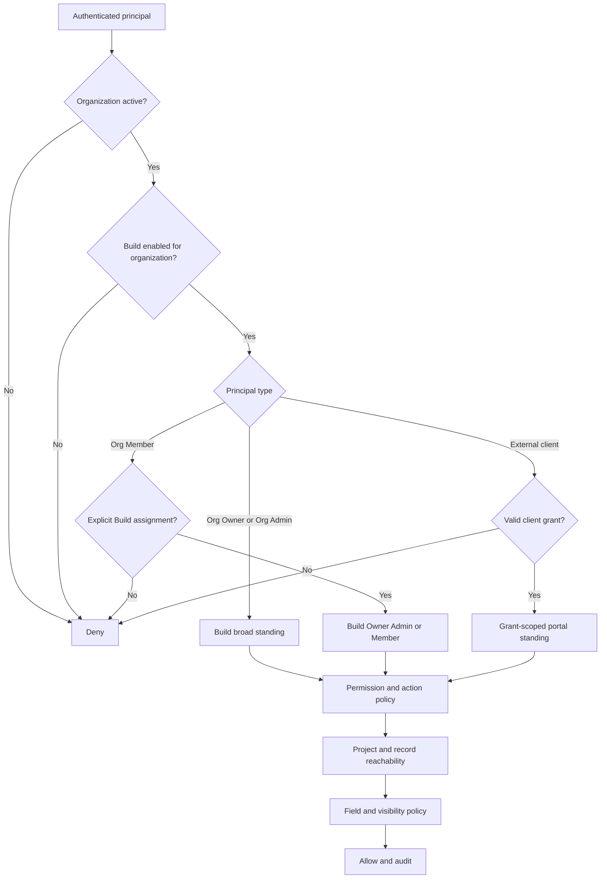

# Build RBAC review

Status: confirmed target model with current-source anchors and open verification work
Scope: organization membership, Build module membership, project/record reachability, and external client grants

## Purpose

This folder defines who may enter Build, what they may do, which records they may reach, and how those decisions must be verified. It separates the accepted product model from historical implementation evidence so a source-level control is not mistaken for release proof.

## Canonical documents

1. [Role model and open risks](./01-role-model-and-open-risks.md)
2. [Architecture, data, API, cache, and AI](../../architecture/07-architecture-data-api-cache-ai.md)
3. [Product vision and decisions](../../product/00-product-vision-and-decisions.md)

## Confirmed target model

- An organization must have Build enabled before any human or system principal can use it.
- Organization Owner and Organization Admin have broad administrative access to enabled modules, including Build. Owner-only organization actions remain owner-only.
- An Organization Member receives no Build access merely by belonging to the organization. They must be explicitly invited or assigned to Build.
- Build has three standard internal standings: Build Owner, Build Admin, and Build Member.
- Project and record reachability further restricts Build access. A module role does not imply access to every project unless its policy explicitly says so.
- An external client is a grant principal, not an organization member. A client sees only the projects, surfaces, records, and fields named by active grants.
- UI visibility follows effective access but never acts as authorization.
- AI, automations, imports, integrations, exports, and background jobs use named principals with bounded authority and recheck authorization at execution.

## Decision stack

## Current source anchors

- `backend/src/db/schema/common/access-modules.ts`: organization module entitlement and per-membership module overrides.
- `backend/src/db/schema/common/auth.ts`: organization membership, roles, invitations, and invitation module access.
- `backend/src/db/schema/common/ownership.ts`: module ownership records and transfer records.
- `backend/src/modules/rbac/permissions/build.ts`: Build permission catalog.
- `backend/src/modules/rbac/seed-system-roles.ts`: generated organization and module role ladders.
- `backend/src/common/auth/auth-context.ts`: request-scoped module, membership, and MFA facts.
- `backend/src/modules/access/scoped-read.ts`: scoped tenant reads.
- `backend/src/modules/build/core/project-crud/project-access.ts`: canonical project reachability.
- `backend/src/common/portal-auth/`: separate portal token and principal path.
- `backend/docs/adr/0004-auth-facts-resolve-once-per-request.md`, `0005-a-datascope-is-spent-not-read.md`, `0006-auth-facts-reach-guards-through-di-tokens.md`, and `0011-project-access-is-the-sole-reachability-owner.md`.

These anchors show the intended control structure. They do not prove that every route, query, role, cache invalidation, migration, or deployed instance conforms.

## Required review artifacts

Every RBAC release review must include:

- route exposure census and generated OpenAPI permission metadata;
- role-to-permission and role-to-scope matrix for the current database catalog;
- module entitlement tests for enabled, disabled, explicit member assignment, and revoked assignment;
- record authorization tests for owner, manager, member, team member, unrelated member, and cross-tenant actor;
- external client grant tests for project, surface, record, field, expiry, revocation, and token audience;
- database RLS tests under the runtime database role;
- cache revocation/version tests;
- browser navigation and action tests for every standard standing;
- audit evidence for grants, revocations, role changes, visibility changes, exports, and privileged operations;
- deployment evidence that permission versions, token revocation, and event consumers work across replicas.

## Review rule

Use four independent questions for every action:

1. Is the module available to this organization and principal?
2. Does the principal have the operation permission?
3. Can the principal reach this record?
4. May the principal read or change these fields in this context?

An allow requires four yes answers. Missing evidence is recorded as open; it is never converted into an inferred allow.

## Delivery checklist

Track completion in the [requirement ledger](../../implementation/REQUIREMENT-LEDGER.md) and [work claims](../../implementation/WORK-CLAIMS.md). An unchecked item stays open until evidence is recorded on the current branch.

- [x] Record the accepted organization, Build, project, and client standing model and identify its current source owners ([role model](./01-role-model-and-open-risks.md#2-confirmed-target-role-model); [source anchors](#current-source-anchors)). This closes documentation inventory, not runtime conformance.
- [ ] Produce a current route exposure/OpenAPI census and role-to-permission/scope matrix from the actual database catalog, with every Build endpoint and permission key accounted for.
- [ ] Prove enabled/disabled Build entitlement, Org Owner/Admin access, explicit Org Member assignment, revoked standing, and project/record/field narrowing in API and target-database tests.
- [ ] Verify client grants as separate portal principals across audience, project, surface, action, field, token expiry/rotation, signed files, and revocation.
- [ ] Test authorization of AI, imports, exports, automations, integrations, callbacks, notifications, search, reports, and jobs after a permission change; no secondary path may grant access.
- [ ] Exercise each standard standing and an unrelated tenant in the browser, including denied navigation, direct URLs, mutations, cache refresh, and private-data non-disclosure.
- [ ] Capture append-only access-change audit events, deployed multi-replica invalidation timing, RLS under the runtime role, and consumer recovery evidence before any RBAC release signoff.
