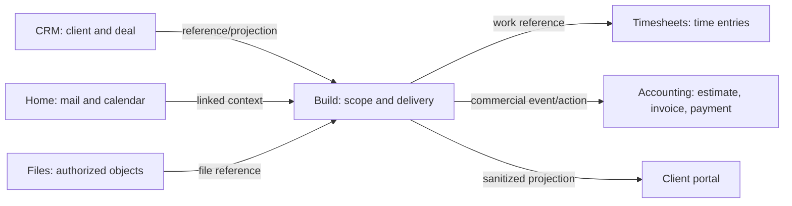

# Cross-module, client, content, and commercial flows

Status: planned target

## Ownership rule

Build coordinates work and shows authorized projections. CRM, Timesheets, Accounting, Home, and Files retain their own source-of-truth records. Cross-module actions open the owner with context, use typed commands, and return to the originating Build record.



## Cross-module record reference

```ts
type ModuleRecordRef = {
  module: "build" | "crm" | "timesheets" | "accounting" | "home" | "files";
  tenantId: string;
  recordType: string;
  recordId: string;
  displayHint?: string;
};
```

Build stores stable references and optional non-sensitive display hints. Reads fetch or consume an event-maintained projection. The owning module validates every write.

## Contextual handoff

A cross-module action includes:

- source record reference;
- intended command or destination;
- prefill values the caller may suggest;
- signed, short-lived return route identifier;
- idempotency/correlation ID.

The destination reauthorizes the user and validates all prefilled values. Return links never contain secrets or raw permission claims.

## CRM flow

### Link a client to a project

1. Authorized user selects `Link client` in project setup.
2. Search queries CRM within the user's effective CRM scope.
3. User selects account and optionally contacts/deal.
4. Build stores references and receives a minimal projection: display name, status, segment, owner, primary contacts, deal/value only when permitted.
5. Project pages show client context and `Open in CRM`.

If CRM is not enabled, Build may create a lightweight client organization needed for portal grants and project grouping. Enabling CRM later offers a reviewed merge/link flow; it never creates silent duplicates.

### Deal to delivery

An authorized CRM action can propose a Build project from a won/approved deal. The user previews template, scope, dates, owner, team, client access, budget reference, and source links. Project creation is idempotent and writes the reciprocal reference after commit.

### Delivery to CRM

CRM may consume Build health, current milestone, latest approved client update, and delivery dates as a projection. Internal details, private comments, margin, and unrelated projects remain excluded.

## Timesheets flow

### Quick log from ticket

1. Select `Log time` on a ticket.
2. Sheet defaults date, ticket, project, client, billable policy, and timer context.
3. User enters duration or start/end, note, and billable state if permitted.
4. Timesheets validates membership, policy, overlap, lock period, and approval rules.
5. Build refreshes a time summary projection.

### Full timesheet

`Open in Timesheets` navigates to the weekly timesheet filtered to project/ticket. Timesheet submission, approval, locking, rate, and payroll/accounting consequences remain Timesheets-owned.

### Build projections

- ticket: my time, total authorized time, estimate variance;
- project: billable/nonbillable totals, submitted/approved/unsubmitted, budget forecast;
- dashboard: missing time and utilization when user has permission.

Do not expose another person's detailed time through an aggregate-only permission.

## Accounting and payment flow

### Estimate or invoice action

1. From approved scope/change request/milestone, select `Create estimate` or `Create invoice`.
2. Build opens Accounting with client, currency, source records, approved amount/budget, and suggested line items.
3. User reviews tax, legal entity, numbering, dates, payment terms, bank/gateway, and lines in Accounting.
4. Accounting creates the document and returns a stable reference.
5. Build shows number, total, currency, status, due/paid date, and `Open in Accounting`.

### Razorpay

Accounting owns Razorpay customer/order/payment/link/webhook data. Build may show `Request payment` only when Accounting declares the action available. Payment confirmation comes from verified webhook/reconciliation, never browser redirect alone.

### Direct/offline payment

Accounting records bank transfer, cash, cheque, or external gateway payment with evidence and reconciliation state. Build shows the resulting status; it does not write the ledger.

### Safety

- Creating/sending/cancelling an invoice, refunding, changing bank/payment destination, or marking paid requires Accounting permission and confirmation.
- Currency/tax values are explicit; no implicit conversion.
- Financial projections state freshness and source.
- Client portal shows only granted invoices/payment actions.

## Home mail and calendar flow

### Mail

Users can link an authorized email/thread to a client, project, request, or ticket; convert an email into Intake; and compose a response through Home. Build stores the reference and a permitted summary, not duplicate mailbox content. Email ingestion defends against spoofed identity, unsafe attachments, and prompt injection.

### Calendar

Milestones, releases, due work, content schedule, and meetings may appear in Home Calendar. Creating a meeting from Build opens Home with project/participants/agenda context. The calendar provider remains authoritative for invite delivery and attendance.

## Files flow

Uploads use the file platform: initiate authorized upload, scan/quarantine, finalize object, then attach reference. Downloads use short-lived signed access after current authorization. Client visibility is a separate explicit grant on the attachment/link, and new file versions re-evaluate publication/approval policy.

## Client model

### Principals

- Client organization: external customer identity container.
- Client contact: invited person associated with a client organization.
- Client grant: explicit access to a project and named portal surfaces/actions.
- Magic-link session: short-lived authenticated access derived from an active grant.

A client contact is not an internal organization member. Internal role changes cannot accidentally create a client grant, and client grants cannot imply internal access.

### Grant flow

1. Authorized internal user selects client organization/contact.
2. Select projects and surfaces: overview, deliverables, requests, approvals, files, updates, invoices/payments.
3. Select actions: view, comment, submit request, upload, approve/reject, pay.
4. Set expiration, optional domain restriction, and notification.
5. Preview exact portal as the client.
6. Confirm; grant and invite/outbox event commit atomically.
7. Client receives a single-use/short-lived magic link and establishes a constrained session.

Revocation invalidates active sessions and related cache immediately. Resend rotates/revokes prior pending tokens according to policy. Raw tokens are hashed at rest and never logged.

### Client portal pages

#### Overview

Approved project summary, health, next milestone, recent update, waiting-on-client actions, and contacts. No internal counts that could reveal hidden work.

#### Deliverables

Granted milestone/release/deliverable cards with status, date, approved description, files, and review state. Click opens portal detail.

#### Requests

Client submits, views, comments on, and tracks their requests. Form uses approved fields, consent, rate limit, malware scanning, and acknowledgement. Default flow is request → Intake → triage → linked ticket; trusted policy may create a ticket directly while retaining source linkage.

#### Approvals

Decision queue with exact artifact/version, change summary, deadline, discussion, and approve/reject/request-changes. Replaced artifacts require a new decision when policy says so.

#### Files

Only explicitly granted/published file versions. Download/preview is reauthorized and audited.

#### Updates

Published client updates in chronological order with acknowledgement/comment where allowed.

#### Invoices and payments

Accounting projection with amount, currency, status, due date, downloadable authorized document, and payment action. Build never declares payment successful before Accounting does.

### Portal UX

- Client branding is secondary to clear identity and security.
- Each page shows project/client context and a contact path.
- Magic-link expiry has a self-service request-new-link flow without account enumeration.
- Denied/expired/revoked states are distinct for support but reveal minimal data.
- Portal works fully on mobile and low-bandwidth connections.

## Content workflow template

Content is a configured Build experience, not a separate data silo.

### Default entities

| Content concept | Build representation |
|---|---|
| Idea/request | Intake item |
| Brief | Ticket type with structured fields |
| Campaign | Project, epic, or configured workstream |
| Content item | Ticket |
| Stage | Workflow status |
| Channel/formats | multi-select custom fields |
| Publication date | due/publish date custom field |
| Draft/assets | document/file references |
| Review | approval |
| Content calendar | calendar view |
| Performance | integration/analytics projection |

### Suggested workflow

Idea → Triage → Brief ready → Creating → Internal review → Client/legal review → Scheduled → Published → Measuring → Archived.

Transitions can require fields, files, or approval. `Published` may require explicit confirmation or verified integration event. Calendar drag changes a target date; it does not silently publish.

### Brief fields

Objective, audience, message, offer, channel, format, owner, reviewers, source links, keywords/topics, CTA, due/publish date, market/locale, legal requirements, asset checklist, measurement plan.

### Content filters

Channel, format, campaign, stage, creator, reviewer, client, publish date, market/locale, approval state, asset readiness, overdue, performance state, custom taxonomy.

## Freelancer workflow template

Lead/client reference → proposal/scope → project template → request/intake → work → review → approval → time/budget → invoice/payment projection → close/testimonial/retainer follow-up.

The first project wizard asks only client, outcome/template, target date, and optional invite. Contract/proposal/payment configuration is offered as a next step, not a signup blocker.

## Software product workflow template

Feedback/request → intake/triage → problem/goal → roadmap/epic → backlog/cycle → ticket/PR/QA → release/deployment → incident/support → outcome/update.

Engineering integrations provide evidence, while Build preserves product/delivery ownership and client-visible projection.

## Integration priorities

### Initial native set

- GitHub/GitLab or the repository providers demanded by customers.
- Slack and Microsoft Teams notifications/actions.
- Google/Microsoft calendar and mail through Home.
- Razorpay through Accounting.
- Zoho Books and TallyPrime for India; QuickBooks and Xero for global demand, through Accounting adapters.
- Common importers: ClickUp, Jira, Asana, Trello, Linear, monday.com, CSV.

Priorities require customer evidence before commitment. No third-party marketplace is required for the initial release.

## Integration reliability contract

- OAuth/secrets encrypted and isolated by tenant/provider.
- Least scopes, explicit reconnect, owner, health, last success, and revoke.
- Webhooks verify signature, timestamp, replay protection, tenant mapping, and idempotency.
- Sync jobs use cursors/checkpoints, bounded retries with jitter, dead-letter/replay, and reconciliation.
- External IDs have unique tenant/provider constraints.
- Rate limits back off and surface delay; they do not hammer providers.
- Provider failure cannot roll back an already committed local command.
- Every external side effect has correlation, attempt history, and support-safe diagnostics.

## Cross-module acceptance criteria

- Opening another module preserves context and offers a safe return path.
- Disabling a module leaves historical references intelligible without offering invalid actions.
- A reference cannot grant access to its target.
- Client, financial, time, mail/calendar, and file data are projected only under current authorization.
- Duplicate/retried callbacks, webhooks, and user submissions are idempotent.
- Integration delay/failure/freshness is visible and recoverable.
- Customer-facing messages and financial/public actions receive a preview and required confirmation.

## Delivery checklist

Track completion in the [requirement ledger](../implementation/REQUIREMENT-LEDGER.md) and [work claims](../implementation/WORK-CLAIMS.md). An unchecked item stays open until evidence is recorded on the current branch.

- [ ] Standardize tenant-bound ModuleRecordRef, owner-resolved reads, source revision/freshness, and short-lived signed contextual handoffs that reauthorize prefill and return navigation.
- [ ] Link projects to authorized CRM accounts/contacts/deals and provide reviewed deal-to-project creation plus delivery-to-CRM projections; reconcile lightweight clients when CRM is enabled later.
- [ ] Open Timesheets quick-log sheets from tickets and full weekly timesheets with context; keep overlap, lock, approval, rates, and ledger writes in Timesheets while Build refreshes permission-safe totals.
- [ ] Open Accounting estimate, invoice, payment, and reconciliation actions from approved Build records; show source-stamped status while Razorpay and direct/offline payments remain Accounting-owned.
- [ ] Link Home mail threads and meeting/calendar actions without copying mailbox or event truth; verify spoofed sender, attachment, and prompt-injection defenses for email-to-Intake.
- [ ] Route upload, scan/quarantine, finalized file reference, client publication, preview, and signed download through Files with current record and grant authorization.
- [ ] Implement atomic client grant and invitation, narrow magic-link exchange, exact-client preview, publish controls, portal overview/deliverables/requests/approvals/files/updates/invoices, and revocation across sessions and cache.
- [ ] Route client bug, feedback, request, upload, and comments to Intake with source mapping; use canonical ticket commands after triage or an explicit trusted-source rule.
- [ ] Deliver content, freelancer, and software product templates as configured Build records and views; test brief fields, content filters, approval/publish transitions, commercial handoffs, and feedback-to-outcome links without new silos.
- [ ] Prioritize native provider adapters with customer demand evidence; for each selected connector prove least-scope credentials, signed/replay-safe webhooks, unique external IDs, cursor checkpoints, rate-limit backoff, dead-letter/replay, revoke, and visible health.
- [ ] Browser-test handoff/return, disabled-module history, permission-safe projections, duplicate callbacks, delayed providers, client mobile use, and preview/confirmation for public or financial actions.
