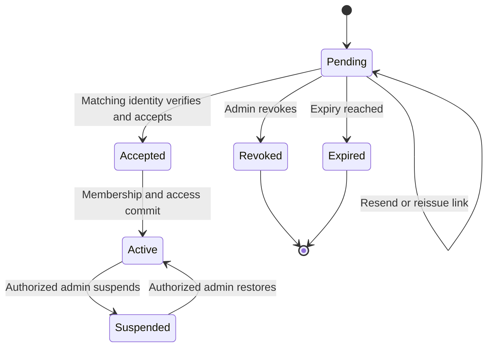

# Signup and multi-module onboarding

Status: planned target with an evidence-backed current-state baseline
Owners: Product, Design, Platform, Identity, Billing, and each selected module
Applies to: solo professionals, freelancers, agencies, software product teams, and larger organizations
Companion decisions: [Product vision and decisions](../product/00-product-vision-and-decisions.md)

## 1. Purpose

This document specifies the complete path from anonymous visitor to an activated Streamline workspace. It covers a customer who selects only Build and a customer who selects Build together with CRM, Accounting, Timesheets, HR, or other Streamline modules.

The experience has two simultaneous goals:

1. Reach a useful workspace in less than five minutes without forcing the customer to understand Streamline's internal module model.
2. Produce a secure, recoverable, auditable organization setup that module owners can extend without turning onboarding into a large conditional form.

The onboarding flow collects only information needed to create a safe first experience. Configuration that can wait becomes a post-launch checklist item inside the owning module.

## 2. Truth boundary

### 2.1 Current repository behavior

The following is **Current unverified**. It was found in source during planning and must be exercised in a running environment before it is called verified:

- Sign-in and account creation share the passwordless surface in `frontend/app/(auth)/signin/page.tsx`. Email OTP and Google sign-in are exposed through the auth feature and `backend/src/modules/auth/auth.controller.ts`.
- Organization setup is a three-step route at `frontend/app/org-setup/page.tsx`: `welcome -> basics -> invite`. The routing gate is centralized in `frontend/lib/wizard-gate.ts`.
- Draft state is stored locally and can hydrate a server session. The current client contract is in `frontend/hooks/api/org-setup.ts` and `frontend/hooks/api/org-setup-schema.ts`.
- Current setup endpoints are `GET /org/setup/session`, `GET /org/setup/status`, `POST /org/setup/complete`, and `POST /org/setup/skip` in `backend/src/modules/organization/setup/org.controller.ts`.
- Goal selection derives enabled modules in `frontend/features/org-setup/lib/constants.ts`. Chat and Knowledge are always added by that client logic.
- The draft schema already contains country, timezone, currency, fiscal-year start, business address, and tax ID, but `frontend/features/org-setup/lib/setup-payload.ts` does not send currency, fiscal-year start, business address, or tax ID to completion.
- The current completion payload supports organization basics, an array of module keys, and up to 50 invitees. Setup invitees carry only email and organization role. They do not carry module standing, project grants, or client grants.
- `backend/src/db/schema/common/onboarding.ts` provides reusable onboarding flow sessions, module setup checklists, and guided-tour state.
- Organization membership, invitations, invitation module access, and onboarding markers exist in `backend/src/db/schema/common/auth.ts`. General user invitations already support per-module `MEMBER` or `ADMIN` standing through `backend/src/modules/users/users.controller.ts` and the organization invitation services.
- Organization module entitlement is owned by `backend/src/modules/access/entitlements.service.ts`; effective access is deny by default for non-core modules and plan locks are checked when modules are enabled through that service.
- `frontend/lib/module-manifest.json` is the current cross-product module inventory. It distinguishes universal, delegable, and platform-admin modules and identifies plan-gated modules.
- A unified custom-field definition table exists in `backend/src/db/schema/custom-field-engine.ts`, while module-specific APIs own validation and field behavior.
- The repository has a global idempotency interceptor and `@Idempotent` mutation convention under `backend/src/common/idempotency/`.
- Existing research records an intermittent or host-specific blank invitation acceptance page and a separate failure in which an organization member lacked Build access. See `streamlineos-pm-pack/01-freeze-completeness/PRD-PM-011-invite-accept.md` and `PRD-PM-002-build-role-at-invite.md`.

### 2.2 Planned behavior

Everything else in this document is **Planned** unless explicitly marked otherwise. A route, component, schema name, or event named below is a target contract and is not a claim that it exists.

## 3. Product outcomes and guardrails

### 3.1 Required outcomes

- A returning user resumes on the exact saved step on any device.
- A solo customer can launch Build with one template and no invitation.
- An organization can select several modules and see one combined, coherent setup rather than separate product wizards.
- Selected modules alone appear as enabled products after launch, except universal platform surfaces such as Home, Settings, notifications, and account security.
- Every invited internal teammate receives an honest organization role and explicit module access in the same operation.
- Every invited client receives a project or client-surface grant through the client portal flow, never an accidental internal membership.
- A failed background step can be retried without creating a second organization, duplicate project, duplicate role, duplicate field, or duplicate invitation.
- Plan limits are explained before activation and never discovered after a long form has been completed.

### 3.2 Non-goals for first launch

- Full Accounting statutory configuration, opening balances, bank connection, and tax filing.
- Full CRM import mapping, enrichment, or automation design.
- Full Timesheets payroll mapping or labor-law configuration.
- A permission-by-permission role editor inside onboarding.
- Native mobile application setup. Responsive web is required; native mobile comes later.
- A third-party template or extension marketplace.

## 4. Experience model

### 4.1 Screen count

Signup is one screen. Authenticated onboarding is three steps and a launch state:

| Stage | Primary question | Required input | Optional input |
|---|---|---|---|
| Signup | How do you want to sign in? | Google or email | Referral context captured silently |
| 1. Workspace | What are you setting up? | workspace name, work style, country | team size if not inferred |
| 2. Products | What do you want to run? | one or more module selections | template, compact module setup, custom fields |
| 3. People | Who should join? | none | teammates, roles, module access, client contacts |
| Launch | Create the useful starting state | activation confirmation | open first project or Command Center |

The progress header says `Workspace`, `Products`, and `People`. It does not count Signup or Launch as form steps. Each step fits on one mobile page with a sticky Continue action.

### 4.2 Question budget

- No more than five visible inputs before the user can launch.
- No selected module may add more than one blocking question.
- A combination of modules may add at most two blocking questions in total. Remaining answers use reviewed defaults and appear under `Adjust setup`.
- Questions that are reversible after launch default safely and do not block activation.
- Questions that change legal, tax, data-retention, or access behavior require an explicit answer or are deferred without creating regulated records.
- Optional advanced sections never open automatically.

### 4.3 Progressive disclosure

The Products step has three layers:

1. Product cards: select one or many modules.
2. Recommended setup summary: one sentence per module, derived from work style, country, and team size.
3. `Adjust setup`: a drawer with templates, module questions, terminology, custom fields, and preview.

A customer can accept the recommendation without opening the drawer. The summary states exactly what will be created.

## 5. Signup

### 5.1 Layout

Desktop uses a centered authentication card no wider than 440 px. Mobile uses the full safe width. The page contains:

- Streamline mark and one-sentence value statement.
- `Continue with Google`.
- Divider.
- Work email input and `Continue with email`.
- Terms and privacy links.
- Existing-account and invitation-aware copy generated from server state.
- A persistent error region and resend timer for OTP.

The same surface supports account creation and return sign-in. Copy may say `Continue` until the system knows whether the email exists. It must never reveal account existence to an unauthenticated caller.

### 5.2 Email OTP states

1. Email entry.
2. Six-digit OTP entry with email shown and `Change` action.
3. Verification in progress.
4. Recoverable invalid/expired code with remaining attempts and resend action.
5. Rate-limited state with a real retry time.
6. Success redirect to invitation acceptance, onboarding resume, or requested safe callback.

Paste fills the complete OTP. Inputs accept password-manager and platform autofill. Backspace, arrow navigation, screen-reader labels, and numeric keyboards must work.

### 5.3 Redirect priority

After authentication, the server resolves one destination in this order:

1. Valid invitation acceptance URL tied to the authenticated email.
2. In-progress organization setup session.
3. Required member or employee onboarding for the destination module.
4. Valid same-origin callback URL.
5. Personal Command Center.

Callback URLs are allowlisted relative paths. External callback URLs, protocol-relative URLs, encoded host changes, and unrecognized deep links are rejected.

## 6. Step 1: Workspace

### 6.1 UI

The screen title is `Set up your workspace`. It contains:

- **Workspace name**: prefilled from email domain or profile, editable, required.
- **How will you use Streamline?**: `Just me`, `My team`, `Client work`, or `Both team and clients`.
- **Country/region**: inferred from locale only as a suggestion, required because it controls currency and later Accounting defaults.
- **Team size**: shown for team selections; optional for `Just me`.

The legal organization name is not required here. Accounting asks for it later when a legal document is created.

### 6.2 Work-style mapping

| Work style | Default persona pack | Default invitation emphasis | Recommended first template |
|---|---|---|---|
| Just me | Solo professional | Hidden | Personal delivery or freelance client project |
| My team | Product/project team | Internal teammates | Software delivery |
| Client work | Freelancer/agency | Teammates and clients separated | Client delivery |
| Both | Agency/product services | Internal first, client grant second | Client delivery with internal execution |

The mapping is a recommendation. It does not silently grant permissions or enable paid modules.

## 7. Step 2: Products

### 7.1 Product selection

The first row shows recommended modules; the second row shows all available modules. Search appears only when the catalog has more than twelve selectable products.

Every card shows:

- Product name and one outcome sentence.
- Included/available/upgrade-required state derived from the server plan preview.
- Selected state with a standard checkbox, not a custom gesture.
- `Learn what is created` disclosure.

At least one delegable module is required unless the user intentionally chooses a universal-only personal workspace supported by the commercial catalog. Build is preselected for Build campaign and Build product entry points. A customer may deselect it.

Changing selection never destroys entered answers. Deselected module drafts remain for 30 days but are excluded from activation and server-side access decisions.

### 7.2 Dependencies and conflicts

The server returns a module selection preview with:

- universal modules included automatically;
- hard dependencies that must be enabled;
- optional companions;
- unavailable modules and reason codes;
- plan or quota impact;
- configuration conflicts;
- template compatibility.

The client never computes entitlement truth from a static list. `frontend/lib/module-manifest.json` can supply labels and route metadata, but the server response decides availability.

Hard dependencies are grouped under the selected module and cannot be deselected while required. Optional companions are suggestions with clear benefits. A dependency must never be disguised as a selected paid product.

### 7.3 Adaptive module questions

Each module publishes a versioned setup contract. The onboarding shell renders supported controls but does not own module business rules.

```ts
type ModuleSetupContract = {
  moduleKey: string;
  schemaVersion: number;
  questions: SetupQuestion[];
  templates: TemplateSummary[];
  defaults: Record<string, unknown>;
  preview(input: SetupAnswers): SetupPreview;
  validate(input: SetupAnswers): ValidationResult;
  activate(ctx: ActivationContext): Promise<ActivationResult>;
};
```

Supported controls for the first release are single select, multi-select, boolean, short text, locale/currency, weekday, and searchable entity picker. Arbitrary remote HTML and module-supplied executable UI are prohibited.

Questions include `requiredWhen`, `visibleWhen`, default source, help text, sensitivity, and a stable analytics key. The server validates the same schema version used to render the answers.

### 7.4 Initial module question catalog

| Module | Blocking question | Defaultable adjustments | Deferred checklist |
|---|---|---|---|
| Build | `What kind of work will you deliver?` Software, client services, content, or general projects | workflow style, weekly cadence, terminology | integrations, advanced statuses, releases, client portal |
| CRM | None when a safe services pipeline can be created | sales motion and pipeline stages | import contacts, email connection, automation |
| Accounting | Confirm country and base currency | fiscal-year start, tax registration state | legal profile, taxes, bank, opening balances |
| Timesheets | `How should submitted time be approved?` No approval, manager, or project owner | billable default and week start | rates, payroll mapping, lock policy |
| HR | None | headcount range and leave year | employee import, policies, payroll |
| Inventory | None | stock valuation and warehouse name | product import, taxes, reorder rules |
| Support | None | channel and SLA starter | email channel, business hours, escalation |

If Accounting country/currency conflicts with the Workspace answer, activation stops with a field-level explanation. Streamline does not guess a new base currency after financial records exist.

### 7.5 Templates

Templates are immutable, versioned recipes. A profession pack references one template version per selected module and optional cross-module links.

Initial profession packs:

- Software product team.
- Freelance software engineer.
- Freelance video editor.
- Creative/content agency.
- Project/program management office.
- General client services.
- Blank workspace.

A template preview lists objects to create, including project, workflow statuses, issue types, views, starter custom fields, sample work, and checklist items. Sample work is off by default for an imported organization and on by default for a new solo workspace, with a clear removal action.

Activation stores the template ID and exact version. Later template improvements do not mutate existing customer configuration. Applying a newer version after launch uses a separate preview and conflict resolver.

### 7.6 Custom fields during onboarding

`Add a custom field` is available inside `Adjust setup`, not in the primary path. It opens a compact builder with:

- Owning module.
- Target entity chosen from that module's allowlist.
- Label and generated stable key.
- Type.
- Options for select fields.
- Required/default behavior.
- Visibility and sensitivity.
- Searchable/reportable flags when the module supports them.

The preview shows where the field appears. A user can add, edit, reorder, or remove draft fields before activation.

Rules:

- Module adapters validate entity types, field types, option limits, permissions, sensitivity, and reporting support.
- Onboarding never inserts directly into `custom_field_definitions` using an arbitrary `entityType`.
- Keys are generated server-side, normalized, and unique within organization, module entity, and project scope.
- A required field needs a default only when the selected template creates records that would otherwise violate it.
- Sensitive fields are excluded from client views, general exports, search, AI context, and logs unless an owning-module policy explicitly permits them.
- Build project-scoped fields may be drafted before the project exists by referencing an activation alias such as `first-project`; the adapter resolves the real ID inside activation.

## 8. Step 3: People

### 8.1 Modes

The step starts with two tabs:

- `Team`: internal organization members.
- `Clients`: external reviewers and stakeholders, shown only for a client-work pack or when Build client portal is selected.

The user can choose `I'll do this later` without penalty. For solo work this action is primary and the empty invitation form stays collapsed.

### 8.2 Team invitation editor

The editor accepts typed emails, comma/newline paste, and CSV upload. The initial render shows one row. Each row contains:

- Email.
- Organization role: `Member` by default or explicitly selected `Org Admin`. `Viewer` is only a restricted module/custom role; it is never a structural organization role.
- Product access chips, preselected from the chosen modules.
- Optional advanced product standing per module: `Member` or `Admin` where supported.
- Optional first-project membership for Build.
- Row validation and quota status.

`Owner` is not offered during onboarding. Ownership transfer is a separate, strongly authenticated settings workflow. `Member` must be able to perform normal work; a read-only preset is named `Viewer`.

Bulk defaults can be applied to selected rows. Product access defaults on for modules relevant to the inviter's entry point and template. It never defaults to modules unavailable in the plan.

### 8.3 Client invitation editor

Client rows contain email, client/account, granted Build projects or deliverables, allowed capabilities, expiry, and optional message. Capabilities are a small preset set: view, comment, submit feedback, approve, or upload requested files.

Clients are created through portal invitation and grant services. They are not inserted into internal organization membership or internal module roles. Client links use secure magic links and a scoped portal session.

### 8.4 Plan-limit preview

The step header shows usage after activation, for example `3 of 3 internal seats` and `2 of 3 client organizations`. Values come from the commercial entitlement service.

If the draft exceeds a limit, the user may:

1. Remove or defer excess invitees and launch.
2. Choose an eligible plan or top-up.
3. Save the complete draft and return after a billing change.

The UI never silently drops rows. Rows that will be deferred are explicitly marked and are not sent as invitations. Security, export, and recovery features are not used as upgrade pressure.

### 8.5 Validation

- Normalize email case and whitespace.
- Collapse duplicates within the draft.
- Detect existing active members, pending invites, revoked invites, and client/internal conflicts through a privacy-safe batch preview.
- Reject the workspace owner's email as a new invite.
- Validate that the inviter may grant every selected organization role, module standing, project membership, and portal capability.
- Recheck every limit and permission in the activation transaction; preview is advisory.

## 9. Review and launch

The bottom of Step 3 contains a persistent summary:

- Workspace name.
- Selected products and included universal services.
- Profession pack and template versions.
- Objects to be created.
- Team invitations and client grants.
- Plan usage after launch.
- Warnings and deferred setup.

The primary action is `Create workspace`. It is enabled only when the latest server preview is valid and matches the current draft revision. The button locks after the first press and carries a new idempotency key.

### 9.1 Activation progress

Activation appears in the same shell. It is safe to close the tab. Stages are:

1. Securing organization and owner membership.
2. Applying plan and product access.
3. Applying templates and module defaults.
4. Creating the first useful records.
5. Adding custom fields.
6. Queuing invitations and notifications.
7. Preparing the Command Center.

Stages reflect durable server state. The client does not animate through fabricated progress. If work completes quickly, show success immediately.

### 9.2 First destination

After success:

- Build-only or Build-led setup opens `/build/command-center`; its primary activation card opens the first project.
- Multi-module setup opens Home `/dashboard` with selected-module action cards and a `Finish setup` checklist; Build opens its own `/build/command-center` from that handoff.
- A module-specific campaign may open that module when the selected setup is single-module.
- The response includes a safe server-selected destination; the client does not infer it from local draft state.

## 10. Invite acceptance and member activation

### 10.1 State machine



An invitation remains pending until acceptance commits. Email delivery is not acceptance. Provisioning an account is not acceptance.

### 10.2 Acceptance page

`/invitation/:token` renders a skeleton, a valid invitation card, or a complete error state within two seconds. It never renders a marketing panel with an empty action area.

The valid card shows organization, inviter, invited email masked appropriately, organization role, products, project access, expiry, and Accept/Decline actions. Authentication is offered by email OTP and matching Google identity. The verified identity email must match the invitation email after normalization.

After acceptance, organization membership, invitation module access, module roles, and requested Build project membership are committed atomically where they share the organization transaction. Portal grants remain a distinct external-user flow.

### 10.3 Negative states

| State | User action |
|---|---|
| Invalid token | Request a new invitation from the inviter |
| Expired | Request a fresh link |
| Revoked | Contact the organization; no details beyond safe organization label |
| Already accepted | Sign in with the accepted account |
| Already an active member | Sign in; admin receives no duplicate member |
| Wrong signed-in account | Switch account; acceptance remains pending |
| Module later disabled | Enter organization but see a clear unavailable-product state |
| Project grant removed before acceptance | Accept remaining valid access and report the omitted grant |
| Seat limit reached | Keep invitation pending and notify the inviter to resolve capacity |

Acceptance and resend mutations are idempotent. Concurrent acceptance yields one membership and the same success result to the winner and replay.

## 11. Post-launch module setup

Every activated module creates a short checklist through `module_setup_checklists` and `module_setup_checklist_items`. Checklist items deep-link to the owning module.

Rules:

- Maximum three recommended items per module on the Command Center.
- Required legal/accounting configuration is visually distinct from optional optimization.
- Dismissed items remain accessible in module Settings.
- Completing the underlying action completes the checklist item through a domain event; clicking the link does not mark it complete.
- Cross-module checklists are deduplicated. For example, inviting a teammate once satisfies relevant activation guidance in Build and Timesheets.

## 12. Planned frontend architecture

### 12.1 Routes

```text
frontend/app/(auth)/signin/page.tsx
frontend/app/(auth)/verify-email/page.tsx
frontend/app/(auth)/invitation/[invitationToken]/page.tsx
frontend/app/org-setup/layout.tsx
frontend/app/org-setup/page.tsx
frontend/app/org-setup/activation/[runId]/page.tsx
```

Keep `org-setup/page.tsx` as a route composer. Move flow logic into a feature module.

### 12.2 Feature structure

```text
frontend/features/org-setup/
  api/
    contracts.ts
    query-keys.ts
  components/
    setup-shell.tsx
    setup-progress.tsx
    workspace-step.tsx
    product-step.tsx
    people-step.tsx
    activation-progress.tsx
    activation-result.tsx
    product-card.tsx
    setup-summary.tsx
    module-question-renderer.tsx
    module-setup-drawer.tsx
    template-picker.tsx
    custom-field-draft-editor.tsx
    invite-grid.tsx
    plan-limit-summary.tsx
    error-state.tsx
  hooks/
    use-org-setup-session.ts
    use-org-setup-draft.ts
    use-module-selection-preview.ts
    use-setup-validation.ts
    use-activation-run.ts
    use-before-unload-draft.ts
  lib/
    reducer.ts
    selectors.ts
    draft-migrations.ts
    focus-management.ts
  types/
    setup.ts
```

### 12.3 State ownership

- Server session is canonical after authentication.
- TanStack Query owns server state and invalidation.
- A local reducer owns unsaved control state.
- Local storage is a bounded offline mirror keyed by user and session ID; it is not entitlement truth.
- URL contains only current step and non-sensitive drawer state. Answers, emails, token values, and custom fields never enter the URL.
- Saves are debounced after field blur and immediate before navigation. Each save carries the expected session revision.
- Draft migrations convert older local/server schema versions or fall back to a review screen; they never discard silently.

### 12.4 Rendering contracts

The module question renderer accepts a closed component registry. Unknown question types render `This setting can be completed after launch` and emit a compatibility event. They do not crash the wizard.

The frontend must show these distinct states: initial loading, saved, saving, offline with local copy, validation error, revision conflict, unauthorized, plan changed, activation running, partially recoverable activation, completed, and terminal support-required failure.

## 13. Planned backend architecture

### 13.1 Module boundary

Create an `organization/setup-v2` application layer with these interfaces:

- `SetupSessionService`: draft lifecycle and optimistic concurrency.
- `ModuleSetupRegistry`: resolves versioned module adapters.
- `SetupPreviewService`: permissions, dependencies, plan limits, and creation plan.
- `OrganizationActivationService`: transaction/saga coordinator.
- `ActivationRunService`: durable stage state and retry.
- `InvitationPlanService`: internal invitation preview and creation.
- `PortalGrantPlanService`: external client access preview and creation.

The coordinator calls module interfaces. It does not import module repositories or write module tables directly.

### 13.2 Module adapter

Each selectable module supplies:

```ts
interface OnboardingModuleAdapter {
  readonly moduleKey: ModuleKey;
  getContract(context: SetupContractContext): Promise<ModuleSetupContract>;
  validateDraft(context: SetupValidationContext): Promise<ModuleValidation>;
  planActivation(context: SetupPlanningContext): Promise<ModuleActivationPlan>;
  activate(context: SetupActivationContext): Promise<ModuleActivationResult>;
  compensate?(context: SetupCompensationContext): Promise<void>;
}
```

`planActivation` is read-only and returns bounded counts and aliases. `activate` accepts a stable activation run ID and must be idempotent. Adapters expose records through aliases such as `first-project`; the coordinator resolves cross-module references after the owning adapter returns IDs.

### 13.3 Activation consistency

The pre-organization activation request and immutable plan are recorded first against the identity-scoped setup session. Organization, owner membership, selected entitlements, base module roles, attachment of the setup session/run to the new organization, and the first outbox event then commit together through the repository's organization-creation boundary. Module initialization runs as resumable stages through the outbox/worker system.

The organization remains in `PROVISIONING` until required adapters succeed. It may be visited only through the activation status surface. Optional stages can complete later and appear as checklist warnings.

Do not hold one database transaction across external email, Razorpay, file, AI, or connector calls. These use outbox events with stable dedupe keys.

## 14. Planned persistence model

Do not use `onboarding_flow_sessions` as the pre-organization draft root. Its current schema requires `org_id`, while a new authenticated user has no organization. Creating a placeholder organization merely to save Step 1 would pollute organization lifecycle, billing, tenancy, and cleanup.

Add an identity-scoped `organization_setup_sessions` table for the pre-organization flow. When activation creates or resolves the organization, attach this session to that organization and create the existing `onboarding_flow_sessions` record for post-organization completion/history.

### 14.1 `organization_setup_sessions`

| Column | Type | Purpose |
|---|---|---|
| `id` | uuid primary key | Non-enumerable setup identifier |
| `owner_user_id` | text not null | Authenticated identity that owns the pre-org draft |
| `org_id` | text nullable | Set atomically when an organization is resolved/created |
| `status` | enum | `IN_PROGRESS`, `ACTIVATING`, `COMPLETED`, `ABANDONED`, `EXPIRED` |
| `schema_version` | integer not null | Draft contract version |
| `revision` | integer not null | Optimistic concurrency token |
| `current_step` | text | Resume location |
| `workspace_answers` | JSONB | Strictly validated common answers |
| `source` | text | Campaign/product/referral source |
| `expires_at` | timestamptz | Draft retention |
| `activated_run_id` | uuid nullable | Prevent a second activation |
| `last_saved_by_device` | text nullable | Conflict diagnostics without fingerprinting |
| `created_at`, `updated_at` | timestamptz | Lifecycle and cleanup |

Unique active-session index: one non-abandoned/non-expired session per owner user and onboarding source. Index `(owner_user_id, status, updated_at)` for resume and cleanup and `(org_id, status)` after attachment.

This is a narrowly scoped pre-tenant table. Before `org_id` is attached, every query is constrained by `owner_user_id` from verified identity; support access requires an audited support capability. After attachment, both owner identity and canonical organization access are checked. The table must not become a general exception to tenant scoping.

Keep reversible common answers in `workspace_answers`, validated against `schema_version` at every boundary. Do not store secrets, raw invitation tokens, payment details, or uploaded CSV bytes in it.

### 14.2 New child tables

#### `onboarding_module_selections`

| Column | Notes |
|---|---|
| `setup_session_id`, `module_key` | Foreign key and unique selection |
| `org_id` | Nullable until activation attaches the session; required for final-state writes |
| `contract_version` | Exact adapter contract rendered |
| `selected` | Retains a deselected draft safely |
| `answers` JSONB | Validated module-owned answers |
| `template_id`, `template_version` | Immutable recipe reference |
| `updated_at` | Conflict and support evidence |

Indexes: unique `(setup_session_id, module_key)`, `(org_id, module_key, updated_at)` when attached, and a bounded session lookup index. Before attachment, access is inherited from the owning setup session.

#### `onboarding_custom_field_drafts`

Columns: `id`, `setup_session_id`, nullable `org_id`, `module_key`, `entity_key`, `scope_alias`, `label`, `generated_key`, `field_type`, `options`, `settings`, `is_sensitive`, `is_required`, `display_order`, `created_at`, `updated_at`. Unique `(setup_session_id, module_key, entity_key, generated_key)`.

#### `onboarding_invite_drafts`

Columns: `id`, `setup_session_id`, nullable `org_id`, normalized email, `audience` (`INTERNAL` or `CLIENT`), organization role preset, module-access JSON validated by the invitation schema, project-alias grants, portal capabilities, expiry policy, status (`DRAFT`, `DEFERRED`, `PLANNED`, `CREATED`, `FAILED`), and timestamps. Unique active draft email per audience and session.

Module access should be normalized into a child table before the feature exceeds a small bounded module count. Activation writes final internal access to `invitation_module_access`; it never treats draft JSON as authorization.

#### `organization_activation_runs`

Columns: UUID `id`, nullable `org_id`, `setup_session_id`, `requested_by_user_id`, nullable `requested_by_membership_id`, `draft_revision`, `plan_hash`, `idempotency_key_hash`, status (`QUEUED`, `RUNNING`, `SUCCEEDED`, `PARTIAL`, `FAILED`, `CANCELLED`), attempt counts, safe error code, timestamps, and final destination. Unique `(setup_session_id)` and `(requested_by_user_id, idempotency_key_hash)` before organization attachment; add the organization-scoped uniqueness check after attachment.

#### `organization_activation_steps`

Columns: nullable `org_id`, `run_id`, stable `step_key`, module key, required flag, status, attempt, max attempts, dedupe key, started/completed timestamps, safe error code, result aliases JSONB, and operator diagnostics reference. Unique `(run_id, step_key)`; organization scope becomes mandatory before module-owned steps run.

Every post-creation tenant row includes `org_id`, composite tenant foreign keys where practical, indexed access paths, and RLS consistent with repository policy. The setup-session tables permit null `org_id` only for the bounded pre-organization lifecycle and use verified identity ownership until atomic attachment.

### 14.3 Existing final-state tables

- `organizations` and `organization_members` remain identity and membership owners.
- `org_modules` remains organization module-entitlement truth.
- `user_module_access` remains a membership-bound deny override, not a replacement for roles.
- `invitations` and `invitation_module_access` remain internal invitation truth.
- Portal invitation, membership, and project grant tables remain client-access truth.
- `custom_field_definitions` remains final custom-field metadata, written through module adapters.
- `module_setup_checklists` remains post-launch setup progress.

## 15. Planned HTTP contracts

All bodies and responses use strict Zod schemas, the standard API envelope, request correlation IDs, and generated OpenAPI clients.

| Method and route | Purpose | Authorization |
|---|---|---|
| `GET /org/setup/bootstrap` | Resume/create session; return catalog, plan summary, recommendations, and contracts | authenticated; no organization allowed |
| `PATCH /org/setup/session` | Save a revisioned partial draft | session owner |
| `POST /org/setup/selection/preview` | Resolve dependencies, prices/limits, questions, and templates | session owner; rate limited |
| `POST /org/setup/invitations/preview` | Batch validate internal/client invite drafts | session owner; grantability checked |
| `POST /org/setup/activation/preview` | Return deterministic creation plan and `planHash` | session owner |
| `POST /org/setup/activate` | Commit the accepted plan and enqueue activation | session owner; `Idempotency-Key` required |
| `GET /org/setup/activation/:runId` | Read durable progress and safe failures | actor or authorized organization admin |
| `POST /org/setup/activation/:runId/retry` | Retry retryable failed stages | authorized owner/admin; idempotent |
| `POST /org/setup/defer` | Create minimal valid workspace and checklist | session owner |
| `DELETE /org/setup/session` | Abandon an unactivated draft | session owner |

### 15.1 Save request

```json
{
  "expectedRevision": 7,
  "schemaVersion": 2,
  "step": "products",
  "patch": {
    "workspace": { "name": "Northstar Studio", "workStyle": "CLIENT_WORK", "country": "IN" }
  }
}
```

Success returns revision 8 and canonicalized values. A stale revision returns `409 SETUP_REVISION_CONFLICT` with current revision and changed top-level sections. The UI offers `Use this device`, `Use saved version`, or field-level merge when changes do not overlap.

### 15.2 Activation preview response

```json
{
  "draftRevision": 12,
  "planHash": "sha256:...",
  "valid": true,
  "modules": [{ "moduleKey": "build", "state": "AVAILABLE", "templateVersion": 3 }],
  "creates": [{ "kind": "build.project", "alias": "first-project", "count": 1 }],
  "limits": [{ "key": "internal_seats", "before": 1, "after": 3, "limit": 3 }],
  "warnings": [],
  "blockingErrors": []
}
```

Activation requires `draftRevision` and `planHash`. A changed plan, permission, catalog, or quota returns `409 SETUP_PREVIEW_STALE` and a new preview; it does not partially activate the old plan.

### 15.3 Migration from current endpoints

- Keep current `GET /org/setup/session` and `GET /org/setup/status` as compatible adapters while the new client is rolled out.
- Route current `POST /org/setup/complete` through the activation coordinator after translating its legacy payload.
- Do not expand the legacy payload with new nested behavior.
- Record legacy versus v2 source on the session and activation run.
- Remove legacy completion only after resumed drafts, invitation flows, and rollback have been proven.

## 16. Caching and performance

### 16.1 Cache policy

| Data | Cache | Invalidation |
|---|---|---|
| Public module labels and question UI schema | CDN/versioned asset | new catalog version |
| Effective module availability and plan limits | short server cache using existing entitlement seams | plan, entitlement, top-up, or module change |
| Setup session | no shared response cache; TanStack Query client cache | revisioned save |
| Selection/activation preview | Redis by user, session, draft revision, catalog version, plan version, and permissions version; TTL 60 seconds | any draft/access/plan change |
| Activation status | Redis optional projection plus database truth | every durable step transition |
| Invite preview | no long-lived shared cache | draft or membership change |

Cache entries never contain raw OTPs, invite tokens, sensitive custom-field defaults, or complete CSV data. Authorization is checked before reading cached projections. Cache keys include tenant and effective-access version.

### 16.2 Performance budgets

- Signup shell LCP p75 below 2.5 seconds on representative mobile conditions.
- Step transition from cached data below 100 ms; fresh preview p95 below 700 ms.
- Draft save p95 below 500 ms.
- Activation request acknowledgement p95 below 800 ms; long work continues asynchronously.
- Status polling starts at one second, backs off to five seconds, stops when the tab is hidden, and resumes immediately when visible. Server-sent events may replace polling when the shared realtime layer supports authenticated replay.
- Every list and batch preview is bounded. Invitation CSV parsing has explicit row and file-size limits.

## 17. Idempotency and concurrency

- Every setup mutation accepts or derives a stable idempotency key. Activation, resend, acceptance, retry, and billing-adjacent actions require `Idempotency-Key`.
- The idempotency record binds key to actor, organization/session, route, and request hash. Reusing a key with a different body returns 400.
- `POST /activate` returns the existing run for a replay, including after success.
- Module activation dedupe key format is `org-setup:{runId}:{moduleKey}:{stepKey}:{contractVersion}`.
- Email delivery dedupe uses invitation ID and delivery generation. Resend increments generation deliberately.
- Optimistic concurrency protects drafts. Database uniqueness protects final membership, entitlements, roles, fields, templates, and invitations.
- Two tabs may edit a draft, but only a preview for the latest revision may activate it.

## 18. Security and privacy

### 18.1 Authorization

- Server-side guards enforce every read and mutation.
- Creating a new organization requires authenticated identity but no ambient organization.
- Resuming a session requires session ownership or explicit support impersonation with audit.
- After organization creation, every access uses canonical `org_id` tenant context.
- The activation service checks that the actor may create an organization or administer the existing organization and may grant every requested role/access level.
- Module selection is both plan-eligible and actor-authorized.
- AI may help answer or propose onboarding values only through the same read policy. It cannot grant roles, enable unavailable modules, accept invitations, or launch activation without explicit user confirmation.

### 18.2 Token handling

- Invitation and magic-link tokens are random, single-purpose, time-limited, stored hashed, and consumed atomically.
- Tokens never appear in analytics, application logs, referrers, support screenshots, or error bodies.
- Invitation pages set a strict referrer policy and avoid third-party assets that receive the URL.
- OTP and token attempts are rate limited by safe combinations of IP, identity, invitation, and device signals.

### 18.3 Data minimization

- Ask for tax ID, legal address, payroll data, and bank details only inside the owning module when necessary.
- Invitation messages exclude private template answers and internal project information.
- Draft retention defaults to 30 days after abandonment and follows deletion/export policy.
- Analytics use session/run IDs and categorical values. They exclude names, emails, free text, tokens, field defaults, and tax data.
- Sensitive custom fields default out of AI, search, exports, client views, and notifications.

### 18.4 Audit

Audit organization creation, module enablement, template application, custom-field creation, role grants, invitation creation/resend/revoke/accept, client grants, plan-limit overrides, activation retries, and support interventions. Each record includes actor membership where available, organization, correlation ID, run ID, target, before/after summary, and source.

## 19. Error and recovery model

| Failure | UI behavior | Server behavior |
|---|---|---|
| Offline while editing | Keep local draft and show unsynced badge | No mutation assumed successful |
| Draft save timeout | Preserve edit; retry with same key | Replay safely |
| Revision conflict | Compare saved sections | Return latest revision and conflict paths |
| Plan changed | Return to review with changed rows highlighted | Recompute preview; no activation |
| Permission revoked | Stop and explain admin contact path | Deny without leaking data |
| Required module setup fails | Stay on activation status with Retry | Resume failed step; no duplicate base records |
| Optional module setup fails | Launch with visible setup warning | Mark run partial and retain retry task |
| Invite email fails | Workspace still launches; show failed recipients | Invitation remains pending; delivery retry through outbox |
| Browser closes | Resume from run URL after sign-in | Durable worker continues |
| Worker dies | Show delayed state and correlation ID | Lease expires; bounded retry then dead-letter |
| Unknown terminal failure | Support action and safe reference | Preserve state; no destructive compensation |

Compensation is used only when it preserves customer intent and domain invariants. A failed email never rolls back a created organization. A failed required entitlement step prevents product launch and is retried. Operators receive a runbook and replay tool that address a named step and require audited authorization.

## 20. Responsive mobile behavior

- One-column layout below the desktop breakpoint.
- Sticky bottom action respects safe-area inset and does not cover validation text.
- Product cards use full-row checkboxes with 44 px minimum targets.
- Module setup opens as a full-screen sheet on mobile.
- Invitation grid becomes one card per person; bulk actions stay at top and selection count remains visible.
- Template preview uses a summary first and expandable object list.
- Activation can continue in the background; returning through email or browser restores the run.
- CSV upload may hand off to the device file picker. Paste remains supported.
- No essential action depends on hover, drag, right-click, or split pane.

## 21. Accessibility and localization

- Meet WCAG 2.2 AA.
- Use semantic headings, fieldsets, legends, native controls where possible, and programmatic error relationships.
- On step change, move focus to the heading; on validation failure, focus an error summary linked to fields.
- Announce save state and activation stage through restrained live regions.
- Do not encode selected, warning, paid, or failed state by color alone.
- Support 200% zoom, reduced motion, high contrast, keyboard-only completion, and common screen readers.
- Dates, week start, currency, numbers, names, phone input, and addresses follow locale. Stored timestamps remain UTC and country/currency values use stable ISO codes.
- Copy must fit localization expansion. Do not place text inside onboarding illustrations.

## 22. Events and metrics

### 22.1 Event contract

All events include `eventVersion`, anonymous or user ID as appropriate, setup session ID, source, experiment assignment, device class, and timestamp. After organization creation they may include organization ID. Never include email, name, free text, answers marked sensitive, token, or OTP.

| Event | Key properties |
|---|---|
| `signup_started` | method, source |
| `signup_verified` | method, elapsed bucket |
| `setup_started` | new/resumed, source |
| `setup_step_viewed` | step, revision |
| `setup_step_completed` | step, elapsed bucket, validation count |
| `setup_module_selected` | module key, selected, recommendation source |
| `setup_template_selected` | pack/template IDs and versions |
| `setup_adjustment_opened` | module key, section |
| `setup_custom_field_drafted` | module key, entity, field type; no label |
| `setup_invite_drafted` | audience, role preset, module count |
| `setup_limit_blocked` | limit key, plan, requested bucket |
| `setup_preview_created` | selected-module count, warning/error codes |
| `setup_activation_requested` | revision, module count, invite counts |
| `setup_activation_stage_changed` | stage, state, attempt, error code |
| `setup_completed` | elapsed bucket, destination, partial flag |
| `setup_abandoned` | last step, selected-module count |
| `invite_accept_viewed` | safe invitation state, host |
| `invite_accept_completed` | org role preset, module count |
| `first_value_reached` | first project/import/ticket/client action kind |

### 22.2 Funnel and guardrails

Primary funnel:

`signup started -> identity verified -> setup started -> product selection -> activation requested -> activation succeeded -> first useful record -> first collaborator/client action`.

Report by source, work style, selected-module combination, plan, device, country group, and new/resumed session. Small cohorts must be privacy protected.

Targets:

- Median authenticated setup completion under five minutes.
- At least 80% of users who reach Products obtain a valid preview without support.
- Required activation-stage success above 99.5% excluding customer-correctable plan/validation errors.
- Duplicate organization, membership, invitation, field, and first-project rate equal to zero.
- Invite acceptance page blank-state rate equal to zero.
- Track first invitation accepted within 24 hours and first completed ticket within seven days.

Guardrails include auth failure, setup abandonment by step, revision conflicts, plan surprise rate, authorization-denial correctness, cross-tenant negative tests, stale entitlement incidents, activation p95, mail delivery delay, and support contacts per activation.

## 23. Rollout and migration

1. Add contracts, persistence extensions, and adapters behind `org_setup_v2` with no UI switch.
2. Make current completion call the new coordinator through a legacy adapter; prove idempotent replay.
3. Release server-persisted three-step UI to internal tenants.
4. Enable Build-only new signups, then Build plus one module.
5. Enable multi-module combinations after pairwise contract and plan tests.
6. Enable onboarding custom-field drafts after module adapters pass isolation/security review.
7. Enable client invitation drafts only after the portal grant and magic-link path passes tenant, expiry, revocation, and mobile tests.
8. Migrate resumable legacy drafts by schema version. Keep legacy read support for the retention period.
9. Remove the feature flag only after operational dashboards, replay tooling, and rollback are proven.

Rollback switches new sessions to the legacy client. In-progress v2 activations continue on the server; they are never abandoned or restarted under a new run.

## 24. Test strategy

### 24.1 Contract and unit tests

- Every module setup contract has schema/default/visibility tests.
- Draft migration, reducer, selectors, and conflict merge tests.
- Plan preview and dependency resolution tests.
- Role grantability and internal/client classification tests.
- Template version and alias resolution tests.
- Sensitive custom-field policy tests.

### 24.2 Integration tests

- Organization, owner membership, entitlements, and activation run commit atomically.
- Every module adapter can be replayed without duplicates.
- Plan and seat limits are checked again at commit.
- Invitations create module access atomically and acceptance creates exactly one active membership.
- Client invitation cannot create internal membership.
- Outbox delivery, worker retry, dead-letter, and operator replay.
- Cache invalidation after module and plan changes.
- Cross-tenant reads and writes fail even with guessed IDs.

### 24.3 Browser matrix

- Google and email OTP signup.
- New, resumed, offline, two-tab conflict, and expired draft.
- Build only; CRM only; Build+CRM; Build+Timesheets+Accounting; broad suite.
- Solo skip-invite and 50-row invitation boundary.
- Free-plan exact limit, over-limit, upgraded, and downgraded states.
- Valid, expired, revoked, wrong-email, already-active, double-submit, apex, and `www` invitation acceptance.
- Desktop and representative mobile widths; keyboard and screen-reader flows.
- Close browser during every activation stage and resume.

Runtime evidence must separately cover UI behavior, database state, network/console cleanliness, role/tenant isolation, cache freshness, worker recovery, email delivery, and deployed-host behavior.

## 25. Acceptance criteria

### Signup and resume

- [ ] Google and email OTP create or authenticate without exposing whether an email already exists.
- [ ] Safe redirect priority is enforced and open redirects are rejected.
- [ ] A saved setup resumes on another device at the canonical revision.
- [ ] An offline edit is visibly unsynced and is never presented as saved.

### Minimal onboarding

- [ ] A solo Build customer can launch in three onboarding steps with no invitation.
- [ ] No more than five inputs are visible before launch in the default Build-only path.
- [ ] Multi-module selection uses one flow and applies only selected/required modules.
- [ ] Deselecting and reselecting a module restores its draft without enabling it prematurely.
- [ ] Every adaptive question is owned and validated by the selected module contract.

### Templates and custom fields

- [ ] The review identifies exact template versions and created objects.
- [ ] Replaying activation does not duplicate template-created records.
- [ ] Onboarding custom fields use module entity allowlists and the module mutation service.
- [ ] Sensitive fields do not appear in logs, events, client views, general search, AI context, or exports without explicit policy.
- [ ] A project-scoped Build field resolves its project alias correctly.

### Plans and access

- [ ] Catalog and plan truth come from the server and changed limits invalidate previews.
- [ ] Over-limit invitees are never silently omitted.
- [ ] Owner is unavailable as an onboarding invite role.
- [ ] An internal invite commits organization role plus selected module access without a second admin trip.
- [ ] A client invite creates only scoped portal access.
- [ ] All mutations deny unauthorized and cross-tenant attempts on the server.

### Activation and recovery

- [ ] Double-click, retry, timeout, and two-tab activation produce one organization and one activation run.
- [ ] Closing the browser does not stop activation; returning shows durable status.
- [ ] A required-stage failure blocks entry and can resume from the failed stage.
- [ ] An optional-stage failure launches with an explicit checklist warning.
- [ ] Plan/permission/catalog changes between preview and activation return a new review instead of partial success.
- [ ] Operator replay is scoped, authorized, audited, and idempotent.

### Invitations

- [ ] A cold valid invitation renders an actionable card within two seconds on apex and `www` hosts.
- [ ] Pending remains pending until acceptance commits.
- [ ] Matching authentication creates exactly one membership and the intended module/project access.
- [ ] Expired, revoked, already-active, wrong-account, limit-reached, and duplicate-submit states have complete non-blank UI.
- [ ] Tokens do not appear in logs, analytics, referrers, or support-visible error text.

### Quality

- [ ] WCAG 2.2 AA checks pass for all steps and invitation acceptance.
- [ ] Performance budgets in section 16 are met on the deployed environment.
- [ ] Funnel events reconcile with durable setup and invitation state and contain no prohibited personal data.
- [ ] Cross-tenant, role, RLS, cache-staleness, outbox, and worker-recovery evidence is attached to release approval.

## 26. Implementation sequence

1. Freeze the module catalog vocabulary and publish the onboarding adapter interface.
2. Add revisioned session, activation run, and step persistence.
3. Implement preview and activation coordinator with Build adapter only.
4. Route legacy completion through the coordinator and prove replay/no-duplicate behavior.
5. Repair and prove the complete invitation acceptance lifecycle and Build access-at-invite path.
6. Ship the three-step responsive shell and cross-device resume.
7. Add CRM and Timesheets adapters, then Accounting with country/currency safeguards.
8. Add profession packs and immutable template versions.
9. Add module-owned custom-field drafts.
10. Add scoped client invitation/grant flow.
11. Add remaining modules one adapter at a time with contract, isolation, and recovery evidence.
12. Remove legacy setup only after migration and rollback gates are closed.

The first sellable milestone is Build-only onboarding with reliable internal invitation acceptance, correct Build access, one useful project template, durable recovery, and measured first value. Multi-module breadth follows the same interfaces after that foundation is proven.

## Delivery checklist

Track completion in the [requirement ledger](../implementation/REQUIREMENT-LEDGER.md) and [work claims](../implementation/WORK-CLAIMS.md). An unchecked item stays open until evidence is recorded on the current branch.

- [ ] Signup and invitation-first identity work for new, existing, wrong-email, expired, and replay paths.
- [ ] Workspace step has a five-visible-input Build-only default and reversible advanced settings.
- [ ] Products step selects one or many modules, previews plan limits, and saves adaptive answers, template versions, and custom-field drafts.
- [ ] People step carries per-invite organization role and selected module standing through the frontend payload, setup event, and invitation writer without dropping rows.
- [ ] People step supports multiple invites, optional skip, quota and grantability preview, and separate internal versus client access.
- [ ] Activation is durable, revisioned, idempotent, resumable across devices, and safe under double submit or worker retry.
- [ ] Invitation acceptance commits membership and intended module standing, resolves a fresh authorized destination, and explains partial grants.
- [ ] Client invitation activates only scoped portal grants with a secure magic link.
- [ ] First-use Build setup creates a useful project, ticket, and guided action without requiring unrelated module configuration.
- [ ] Request, event, and response schemas reject unknown or unavailable modules, duplicate grants, forbidden roles, and stale revisions.
- [ ] Authorization, cache invalidation, privacy, and rate limits pass cross-tenant and role-negative tests.
- [ ] Every step and invitation state works at 375, 768, and desktop widths with keyboard and screen-reader checks.
- [ ] Browser, target-DB, outbox recovery, performance, and funnel evidence satisfies section 25 before release verification.
