# Build Module — Schema Reconnaissance

> Generated: 2026-07-31. READ-ONLY. All claims cite file:line.
> Source root: `backend/src/db/schema/build/`

---

## 1. Table Inventory (81 tables)

| Table | File:line | Purpose | orgId? | PK type | Soft-delete? | Timestamps | Row-growth class |
|-------|-----------|---------|--------|---------|-------------|------------|-----------------|
| `projects` | core.ts:26 | Delivery projects | ✓ notNull FK | serial | ✗ | created/updated | bounded |
| `sprints` | core.ts:78 | Iteration timeboxes | ✓ notNull FK | serial | ✗ | created/updated | bounded |
| `custom_states` | core.ts:105 | Per-project workflow states | ✓ notNull FK | serial | ✗ | created only | bounded |
| `cycles` | core.ts:129 | Work cycles | ✓ notNull FK | serial | ✗ | created/updated | bounded |
| `modules` | core.ts:160 | Feature groupings within project | ✓ notNull FK | serial | ✗ | created/updated | bounded |
| `reports` | core.ts:192 | Saved report configs | ✓ notNull FK | serial | ✗ | created/updated | bounded |
| `project_templates` | core.ts:225 | Template library | ✓ notNull FK | serial | ✗ | created only | bounded |
| `project_template_tickets` | core.ts:246 | Template ticket definitions | **✗ MISSING** | serial | ✗ | ✗ none | bounded |
| `tickets` | tasks.ts:28 | Work items / issues | ✓ notNull FK | serial | ✗ | created/updated | **unbounded** |
| `ticket_assignees` | tasks.ts:130 | Multi-assignee junction | ✓ notNull FK | serial | ✗ | assignedAt | **unbounded** |
| `ticket_comments` | tasks.ts:157 | Thread comments | ✓ notNull FK | serial | ✗ | created/updated | **unbounded** |
| `ticket_attachments` | tasks.ts:189 | File attachments | ✓ notNull FK | serial | ✗ | created only | **unbounded** |
| `ticket_labels` | tasks.ts:215 | Label definitions | ✓ notNull FK | serial | ✗ | created only | bounded |
| `ticket_label_mappings` | tasks.ts:232 | Ticket–label junction | ✓ notNull FK | serial | ✗ | created only | **unbounded** |
| `ticket_watchers` | tasks.ts:255 | Watcher subscriptions | ✓ notNull FK | serial | ✗ | created only | **unbounded** |
| `work_item_relations` | tasks.ts:276 | Ticket–ticket edges | ✓ notNull FK | serial | ✗ | created only | **unbounded** |
| `ticket_checklists` | tasks.ts:302 | Checklist groups | ✓ notNull FK | serial | ✗ | created/updated | bounded |
| `ticket_checklist_items` | tasks.ts:325 | Checklist items | **✗ MISSING** | serial | ✗ | created only | **unbounded** |
| `ticket_custom_field_values` | tasks.ts:349 | EAV field values | ✓ notNull FK | serial | ✗ | created/updated | **unbounded** |
| `project_releases` | tasks.ts:379 | Release records | ✓ notNull FK | serial | ✗ | created/updated | bounded |
| `release_tickets` | tasks.ts:410 | Release–ticket junction | ✓ notNull FK | serial | ✗ | addedAt | **unbounded** |
| `project_webhooks` | tasks.ts:431 | Outbound webhook configs | ✓ notNull FK | serial | ✗ | created only | bounded |
| `webhook_deliveries` | tasks.ts:459 | Delivery log | ✓ notNull FK | serial | ✗ | deliveredAt | **unbounded** |
| `ticket_comment_reactions` | tasks.ts:487 | Emoji reactions | ✓ notNull FK | serial | ✗ | created only | **unbounded** |
| `ticket_related_links` | tasks.ts:516 | External URL links | ✓ notNull FK | serial | ✗ | created only | **unbounded** |
| `project_automations` | tasks.ts:536 | Automation rules | ✓ notNull FK | serial | ✗ | created/updated | bounded |
| `project_statuses` | members.ts:11 | Kanban column definitions | ✓ notNull FK | serial | ✗ | created/updated | bounded |
| `project_members` | members.ts:27 | Project membership | **✗ MISSING** | serial | ✗ | joinedAt | bounded |
| `project_views` | members.ts:39 | Saved view configs | ✓ notNull FK | serial | ✗ | created/updated | bounded |
| `intake_items` | members.ts:62 | Intake/request queue | ✓ notNull FK | serial | ✗ | created/updated | **unbounded** |
| `pages` | members.ts:84 | Project wiki pages | ✓ notNull FK | serial | ✗ | created/updated | **unbounded** |
| `project_milestones` | members.ts:106 | Milestone markers | ✓ notNull FK | serial | ✗ | created/updated | bounded |
| `ticket_activity_log` | activity.ts:23 | Audit trail for ticket changes | ✓ notNull FK | serial | ✗ | created only | **unbounded** |
| `ticket_comment_mentions` | activity.ts:38 | @mention records | ✓ notNull FK | serial | ✗ | created only | **unbounded** |
| `project_approvals` | approvals.ts:26 | Multi-level approval records | ✓ notNull FK | serial | ✓ deletedAt | created/updated | **unbounded** |
| `bugs` | bugs.ts:11 | Bug tracking | ✓ notNull FK | serial | ✓ deletedAt | created/updated | **unbounded** |
| `change_requests` | change-requests.ts:16 | Change request records | ✓ notNull FK | serial | ✓ deletedAt | created/updated | **unbounded** |
| `comment_drafts` | comment-drafts.ts:5 | Draft comment persistence | ✓ notNull FK | identity | ✗ | created/updated | bounded |
| `feedbucket_widgets` | feedback.ts:95 | Feedback collection widgets | ✓ notNull FK | serial | ✓ deletedAt | created/updated | bounded |
| `feedbucket_submissions` | feedback.ts:126 | User feedback submissions | ✓ notNull FK | serial | ✓ deletedAt | created/updated | **unbounded** |
| `feedbucket_attachments` | feedback.ts:167 | Attachment refs per submission | ✓ notNull FK | serial | ✗ | created only | **unbounded** |
| `project_forms` | forms.ts:24 | Project form definitions | ✓ notNull FK | serial | ✓ deletedAt | created/updated | bounded |
| `form_submissions` | forms.ts:54 | Form submission records | ✓ notNull FK | serial | ✗ | created only | **unbounded** |
| `git_connections` | git.ts:10 | Git repo integrations | ✓ notNull FK | serial | ✗ | created/updated | bounded |
| `git_ticket_links` | git.ts:28 | Git ref–ticket associations | ✓ notNull FK | serial | ✗ | created only | **unbounded** |
| `okr_goals` | goals.ts:11 | OKR goal hierarchy | ✓ notNull FK | serial | ✗ | created/updated | bounded |
| `okr_key_results` | goals.ts:35 | Key results per goal | ✓ notNull FK | serial | ✗ | created/updated | bounded |
| `okr_updates` | goals.ts:53 | Progress check-in log | ✓ notNull FK | serial | ✗ | created only | **unbounded** |
| `okr_links` | goals.ts:68 | Goal–ticket linkage | ✓ notNull FK | serial | ✗ | created only | **unbounded** |
| `project_risks` | governance.ts:11 | Risk register | ✓ notNull FK | serial | ✓ deletedAt | created/updated | **unbounded** |
| `project_decisions` | governance.ts:35 | Architecture decision log | ✓ notNull FK | serial | ✓ deletedAt | created/updated | **unbounded** |
| `project_incidents` | incidents.ts:9 | Incident records | ✓ notNull FK | serial | ✓ deletedAt | created/updated | **unbounded** |
| `incident_updates` | incidents.ts:39 | Incident timeline entries | ✓ notNull FK | serial | ✗ | created only | **unbounded** |
| `managed_products` | managed-products.ts:17 | Strategic product records | ✓ notNull FK | serial | ✓ deletedAt | created/updated | bounded |
| `project_meetings` | meetings.ts:10 | Meeting records | ✓ notNull FK | serial | ✓ deletedAt | created/updated | bounded |
| `meeting_attendees` | meetings.ts:37 | Attendee list | ✓ notNull FK | serial | ✗ | created only | bounded |
| `meeting_action_items` | meetings.ts:50 | Action items from meetings | ✓ notNull FK | serial | ✓ deletedAt | created/updated | **unbounded** |
| `meeting_standup_entries` | meetings.ts:72 | Daily standup logs | ✓ notNull FK | serial | ✗ | created/updated | **unbounded** |
| `pm_workspaces` | pm-workspaces.ts:19 | PM collaboration workspace | ✓ notNull FK | text (UUID) | ✓ deletedAt | created/updated | bounded |
| `pm_workspace_memberships` | pm-workspace-memberships.ts:19 | PM workspace member records | ✓ notNull FK | text (UUID) | ✗ | addedAt | bounded |
| `project_portfolios` | portfolios.ts:18 | Portfolio containers | ✓ notNull FK | serial | ✓ deletedAt | created/updated | bounded |
| `project_programs` | portfolios.ts:36 | Program containers | ✓ notNull FK | serial | ✓ deletedAt | created/updated | bounded |
| `portfolio_projects` | portfolios.ts:55 | Portfolio–project junction | ✓ notNull FK | serial | ✗ | created only | bounded |
| `program_projects` | portfolios.ts:67 | Program–project junction | ✓ notNull FK | serial | ✗ | created only | bounded |
| `test_suites` | qa.ts:13 | Test case groupings | ✓ notNull FK | serial | ✓ deletedAt | created/updated | bounded |
| `test_cases` | qa.ts:31 | Individual test cases | ✓ notNull FK | serial | ✓ deletedAt | created/updated | **unbounded** |
| `test_runs` | qa.ts:55 | QA test run execution | ✓ notNull FK | serial | ✓ deletedAt | created/updated | bounded |
| `test_run_results` | qa.ts:81 | Per-case result per run | ✓ notNull FK | serial | ✗ | created/updated | **unbounded** |
| `project_daily_snapshots` | reporting.ts:6 | Burnup/CFD data points | ✓ notNull FK | serial | ✗ | created only | **unbounded** |
| `roadmap_items` | roadmap.ts:11 | Public roadmap entries | ✓ notNull FK | serial | ✗ | created/updated | bounded |
| `roadmap_votes` | roadmap.ts:32 | Roadmap item votes | ✓ notNull FK | serial | ✗ | created only | **unbounded** |
| `feedback_posts` | roadmap.ts:43 | Public feedback board posts | ✓ notNull FK | serial | ✗ | created/updated | **unbounded** |
| `feedback_votes` | roadmap.ts:62 | Feedback vote records | ✓ notNull FK | serial | ✗ | created only | **unbounded** |
| `changelog_entries` | roadmap.ts:73 | Public changelog | ✓ notNull FK | serial | ✗ | created/updated | bounded |
| `project_teams` | teams.ts:14 | Delivery teams | ✓ notNull FK | identity | ✓ deletedAt | created/updated | bounded |
| `project_team_members` | teams.ts:41 | Team membership | ✓ notNull FK | identity | ✗ | joinedAt | bounded |
| `project_workspace_members` | teams.ts:65 | Legacy workspace members | ✓ notNull FK | identity | ✗ | addedAt | bounded |
| `project_team_assignments` | teams.ts:89 | Team–project assignments | ✓ notNull FK | identity | ✗ | addedAt | bounded |
| `project_whiteboards` | whiteboards.ts:34 | Excalidraw canvases | ✓ notNull FK | serial | ✗ | created/updated | **unbounded** |
| `project_whiteboard_shares` | whiteboards.ts:65 | Per-user whiteboard access | ✓ notNull FK | serial | ✗ | created only | bounded |
| `workflow_transitions` | workflow.ts:7 | Allowed status transitions | ✓ notNull FK | serial | ✓ deletedAt | created/updated | bounded |

---

## 2. Entity Relationship Diagram

```mermaid
erDiagram
  organizations ||--o{ projects : "org_id (FK+cascade)"
  organizations ||--o{ managed_products : "org_id (FK+cascade)"
  organizations ||--o{ pm_workspaces : "org_id (FK+cascade)"
  pm_workspaces ||--o{ pm_workspace_memberships : "fk composite (org_id, pm_workspace_id)"
  pm_workspaces ||--o{ project_teams : "pm_workspace_id [BARE TEXT - NO FK]"
  pm_workspaces ||--o{ project_workspace_members : "pm_workspace_id [BARE TEXT - NO FK]"
  projects ||--o{ sprints : "project_id (FK+cascade)"
  projects ||--o{ custom_states : "project_id (FK+cascade)"
  projects ||--o{ cycles : "project_id (FK+cascade)"
  projects ||--o{ modules : "project_id (FK+cascade)"
  projects ||--o{ tickets : "project_id (FK+cascade)"
  projects ||--o{ project_statuses : "project_id (FK+cascade)"
  projects ||--o{ project_members : "project_id (FK+cascade)"
  projects ||--o{ project_views : "project_id (FK+cascade)"
  projects ||--o{ intake_items : "project_id (FK+cascade)"
  projects ||--o{ pages : "project_id (FK+cascade)"
  projects ||--o{ project_milestones : "project_id (FK+cascade)"
  projects ||--o{ project_releases : "project_id (FK+cascade)"
  projects ||--o{ project_webhooks : "project_id (FK+cascade)"
  projects ||--o{ project_automations : "project_id (FK+cascade)"
  projects ||--o{ bugs : "project_id (FK+cascade)"
  projects ||--o{ change_requests : "project_id (FK+cascade)"
  projects ||--o{ project_forms : "project_id (FK+cascade)"
  projects ||--o{ project_meetings : "project_id (FK+cascade)"
  projects ||--o{ project_approvals : "project_id (FK+cascade)"
  projects ||--o{ project_risks : "project_id (FK+cascade)"
  projects ||--o{ project_decisions : "project_id (FK+cascade)"
  projects ||--o{ project_incidents : "project_id (FK+cascade)"
  projects ||--o{ git_connections : "project_id (FK+set null)"
  projects ||--o{ okr_goals : "project_id (FK+set null)"
  projects ||--o{ okr_links : "project_id (FK+cascade)"
  projects ||--o{ roadmap_items : "project_id (FK+set null)"
  projects ||--o{ project_whiteboards : "project_id (FK+cascade)"
  projects ||--o{ project_daily_snapshots : "project_id (FK+cascade)"
  projects ||--o{ feedbucket_widgets : "project_id (FK+set null)"
  projects ||--o{ portfolio_projects : "project_id (FK+cascade)"
  projects ||--o{ program_projects : "project_id (FK+cascade)"
  projects ||--o{ test_suites : "project_id (FK+cascade)"
  projects ||--o{ test_cases : "project_id (FK+cascade)"
  projects ||--o{ test_runs : "project_id (FK+cascade)"
  projects ||--o{ test_run_results : "project_id (FK+cascade)"
  project_teams ||--o{ project_team_members : "team_id (FK+cascade)"
  project_teams ||--o{ project_team_assignments : "team_id (FK+cascade)"
  tickets ||--o{ ticket_assignees : "ticket_id (FK+cascade)"
  tickets ||--o{ ticket_comments : "ticket_id (FK+cascade)"
  tickets ||--o{ ticket_attachments : "ticket_id (FK+cascade)"
  tickets ||--o{ ticket_label_mappings : "ticket_id (FK+cascade)"
  tickets ||--o{ ticket_watchers : "ticket_id (FK+cascade)"
  tickets ||--o{ work_item_relations : "work_item_id (FK+cascade)"
  tickets ||--o{ ticket_checklists : "ticket_id (FK+cascade)"
  tickets ||--o{ ticket_custom_field_values : "ticket_id (FK+cascade)"
  tickets ||--o{ release_tickets : "ticket_id (FK+cascade)"
  tickets ||--o{ git_ticket_links : "ticket_id (FK+cascade)"
  tickets ||--o{ ticket_activity_log : "ticket_id (FK+cascade)"
  tickets ||--o{ ticket_related_links : "ticket_id (FK+cascade)"
  tickets ||--o{ okr_links : "ticket_id (FK+cascade)"
  tickets }o--o| tickets : "epic_id self-ref (foreignKey)"
  tickets }o--o| tickets : "parent_ticket_id self-ref (foreignKey)"
  tickets }o--o| tickets : "recurrence_parent_id self-ref (foreignKey)"
  ticket_checklists ||--o{ ticket_checklist_items : "checklist_id (FK+cascade)"
  ticket_comments ||--o{ ticket_comment_reactions : "comment_id (FK+cascade)"
  ticket_comments ||--o{ ticket_comment_mentions : "comment_id (FK+cascade)"
  ticket_comments }o--o| ticket_comments : "parent_comment_id self-ref"
  project_webhooks ||--o{ webhook_deliveries : "webhook_id (FK+cascade)"
  project_templates ||--o{ project_template_tickets : "template_id (FK+cascade)"
  project_releases ||--o{ release_tickets : "release_id (FK+cascade)"
  project_portolios ||--o{ portfolio_projects : "portfolio_id (FK+cascade)"
  project_portolios ||--o{ project_programs : "portfolio_id (FK+set null)"
  project_programs ||--o{ program_projects : "program_id (FK+cascade)"
  okr_goals ||--o{ okr_key_results : "goal_id (FK+cascade)"
  okr_goals ||--o{ okr_updates : "goal_id (FK+cascade)"
  okr_goals ||--o{ okr_links : "goal_id (FK+cascade)"
  okr_goals }o--o| okr_goals : "parent_goal_id self-ref (foreignKey)"
  okr_key_results ||--o{ okr_updates : "key_result_id (FK+set null)"
  feedbucket_widgets ||--o{ feedbucket_submissions : "widget_id (FK+cascade)"
  feedbucket_submissions ||--o{ feedbucket_attachments : "submission_id (FK+cascade)"
  project_meetings ||--o{ meeting_attendees : "meeting_id (FK+cascade)"
  project_meetings ||--o{ meeting_action_items : "meeting_id (FK+cascade)"
  project_meetings ||--o{ meeting_standup_entries : "meeting_id (FK+cascade)"
  project_incidents ||--o{ incident_updates : "incident_id (FK+cascade)"
  test_suites ||--o{ test_cases : "suite_id (FK+set null)"
  test_suites }o--o| test_suites : "parent_id self-ref (FK+set null)"
  test_runs ||--o{ test_run_results : "run_id (FK+cascade)"
  test_cases ||--o{ test_run_results : "test_case_id (FK+cascade)"
  project_forms ||--o{ form_submissions : "form_id (FK+cascade)"
  project_whiteboards ||--o{ project_whiteboard_shares : "whiteboard_id (FK+cascade)"
  roadmap_items ||--o{ roadmap_votes : "roadmap_item_id (FK+cascade)"
  roadmap_items ||--o{ feedback_posts : "linked_roadmap_item_id (FK+set null)"
  roadmap_items ||--o{ changelog_entries : "linked_roadmap_item_id (FK+set null)"
  feedback_posts ||--o{ feedback_votes : "feedback_post_id (FK+cascade)"
  git_connections ||--o{ git_ticket_links : "connection_id (FK+set null)"
  pages }o--o| pages : "parent_page_id self-ref (foreignKey)"
```



**Note on FK quality:** All major parent→child relationships use Drizzle `.references()` which emits real DDL `FOREIGN KEY` constraints with explicit `ON DELETE` clauses. Self-referential FKs in `tickets`, `pages`, `okr_goals`, `test_suites`, `ticket_comments` use the `foreignKey()` helper (same result). The two **exceptions with zero constraint** are `project_teams.pm_workspace_id` (teams.ts:26) and `project_workspace_members.pm_workspace_id` (teams.ts:76) — both are bare `text("pm_workspace_id")` with no `.references()` call, so no database-level enforcement exists.

---

## 3. Tenant Scoping Violations

Three tables are **missing an `org_id` column entirely** and rely solely on FK chain traversal for tenant isolation:

| Table | File:line | Missing column | Scoping path |
|-------|-----------|---------------|-------------|
| `project_members` | members.ts:27–37 | orgId | `project_id → projects.org_id` |
| `project_template_tickets` | core.ts:246–264 | orgId | `template_id → project_templates.org_id` |
| `ticket_checklist_items` | tasks.ts:325–347 | orgId | `checklist_id → ticket_checklists.org_id` |

Risk: A join that touches only the child table (e.g., bulk query by `assigneeId`) with no `WHERE org_id = ?` filter can cross tenant boundaries silently.

Additionally, `project_members.hourlyRate` column (members.ts:32) is queryable without org scoping because the table has no `org_id`.

---

## 4. Index Inventory

### core.ts — projects

| Index name | Columns (in order) | Org-led? | Flag |
|---|---|---|---|
| `uniq_projects_org_key` | `(org_id, key)` | ✓ | uniqueIndex — correct composite |
| `idx_projects_org_status` | `(org_id, status)` | ✓ | |
| `idx_projects_manager` | `(manager_id)` | ✗ | Support index only |
| `idx_projects_deal` | `(deal_id)` | ✗ | Support index only |
| `idx_projects_managed_product` | `(managed_product_id)` | ✗ | Support index only |
| `uniq_projects_org_id` | `(org_id, id)` | ✓ | Candidate key |

### core.ts — sprints

| Index | Columns | Org-led? | Flag |
|---|---|---|---|
| `idx_sprints_project_status` | `(project_id, status)` | ✗ | NOT org-led (tenant implied via FK) |
| `uniq_sprints_org_id` | `(org_id, id)` | ✓ | |

### core.ts — custom_states

| Index | Columns | Org-led? | Flag |
|---|---|---|---|
| `idx_custom_states_project` | `(project_id)` | ✗ | |
| `idx_custom_states_org` | `(org_id)` | ✓ | Separate single-column index |
| `uniq_custom_states_org_id` | `(org_id, id)` | ✓ | |

**Flag:** `idx_custom_states_org` is a standalone `(org_id)` index when `(org_id, project_id)` would be more useful for the common filter pattern.

### tasks.ts — tickets

| Index | Columns | Org-led? | Flag |
|---|---|---|---|
| `uniq_tickets_project_number` | `(project_id, ticket_number)` | ✗ | Business key, not org-led — cross-tenant safe only because `project_id` already implies tenant |
| `idx_tickets_project_status` | `(project_id, status)` | ✗ | |
| `idx_tickets_assignee` | `(assignee_id)` | ✗ | |
| `idx_tickets_sprint` | `(sprint_id)` | ✗ | |
| `idx_tickets_org_status_priority` | `(org_id, status, priority)` | ✓ | |
| `idx_tickets_org_project` | `(org_id, project_id)` | ✓ | **REDUNDANT prefix** — subsumed by `idx_tickets_org_project_status` |
| `idx_tickets_org_project_status` | `(org_id, project_id, status)` | ✓ | Subsumes `idx_tickets_org_project` |
| `idx_tickets_cycle` | `(cycle_id)` | ✗ | |
| `idx_tickets_parent` | `(parent_ticket_id)` | ✗ | |
| `idx_tickets_recurrence_next` | `(recurrence_next_run_at) WHERE is_recurring` | ✗ | Partial — appropriate |
| `idx_tickets_customer` | `(customer_id)` | ✗ | |
| `idx_tickets_title_trgm` | GIN trgm on `title` | N/A | Full-text search |
| `uniq_tickets_org_id` | `(org_id, id)` | ✓ | |

**Flag (c):** `idx_tickets_org_project` (tasks.ts:117) is a strict prefix duplicate of `idx_tickets_org_project_status` (tasks.ts:118) — the shorter index is redundant.

### members.ts — project_members

| Index | Columns | Org-led? | Flag |
|---|---|---|---|
| `uniq_project_members_project_user` | `(project_id, user_id)` | ✗ | Table has NO orgId column — scoping gap |
| `idx_project_members_user` | `(user_id)` | ✗ | |

**Flag (a):** No org-led index exists because the table has no `org_id`. The uniqueness constraint is per-project, not per-org, but there is no cross-tenant uniqueness issue since `project_id` is globally unique.

### tasks.ts — ticket_label_mappings

| Index | Columns | Org-led? | Flag |
|---|---|---|---|
| `uniq_ticket_label_mappings_ticket_label` | `(ticket_id, label_id)` | ✗ | Has `org_id` column but unique index does NOT include it |

**Flag (b):** `ticketLabelMappings` declares `orgId` (tasks.ts:237) but the unique index is `(ticket_id, label_id)` only (tasks.ts:248-252). Since `ticket_id` globally implies `org_id`, there is no cross-tenant collision risk, but the pattern is inconsistent with other tables.

### whiteboards.ts — project_whiteboards

| Index | Columns | Org-led? | Flag |
|---|---|---|---|
| `idx_project_whiteboards_org_project` | `(org_id, project_id)` | ✓ | |
| `uniq_project_whiteboards_share_token` | `(share_token)` | ✗ | **GLOBAL unique — not tenant-scoped** |
| `uniq_project_whiteboards_org_id` | `(org_id, id)` | ✓ | |

**Flag (b):** `uniq_project_whiteboards_share_token` (whiteboards.ts:60) is a bare global unique, not composite with `org_id`. For a share token this may be intentional (tokens must be globally unique for public access), but it should be documented as a deliberate choice.

### feedbucket_widgets — global public_key unique

`uniqueIndex("uniq_feedbucket_widgets_public_key").on(t.publicKey)` (feedback.ts:120) — global unique by design (widget public key is used from external sites), appropriate.

---

## 5. Unbounded-Growth Anti-Patterns (TOP PRIORITY)

### CRITICAL — Unbounded arrays stored as JSONB in a hot row

**1. `feedbucket_submissions.console_logs` and `.network_logs`** — feedback.ts:145–146
```ts
consoleLogs: jsonb("console_logs").$type<FeedbucketConsoleEntry[]>(),
networkLogs: jsonb("network_logs").$type<FeedbucketNetworkEntry[]>(),
```
Each submission captures ALL browser console logs and ALL network requests at the moment of feedback. These arrays are unbounded — a heavy SPA with 500 XHR calls produces a row-level JSONB blob that can be hundreds of KB. This row also carries `status`, `assigneeId`, `type` columns used for list/filter views. Every list query loads the full blob. **Severity: P0.**

**2. `project_whiteboards.data`** — whiteboards.ts:45
```ts
data: jsonb("data").$type<ExcalidrawSceneData>().default({ elements: [] }).notNull(),
```
Stores the entire Excalidraw canvas (every element, position, style, embedded image reference) in a single JSONB column in the same row as `name`, `visibility`, `share_token`. A complex whiteboard with hundreds of shapes is tens to hundreds of KB. Any list query for "project whiteboards" fetches all canvases. No separate content blob row. **Severity: P0.**

**3. `pages.content`** — members.ts:89
```ts
content: jsonb("content"),
```
Full Plate/Tiptap document stored in the row alongside `title`, `icon`, `coverImage`, `isPinned`. A list of project pages loads full document content for every page. Same pattern as KB pages. **Severity: P0.**

### HIGH — Large JSONB embedded in frequently-joined rows

**4. `feedbucket_submissions.ai_analysis`** — feedback.ts:152
```ts
aiAnalysis: jsonb("ai_analysis").$type<FeedbucketAiAnalysis>(),
```
Stores a full AI analysis result (reproductionSteps, suggestions, acceptanceCriteria arrays) in the submission row. Grows with every AI-analyzed submission; list queries carry it.

**5. `feedbucket_submissions.metadata`** — feedback.ts:143
```ts
metadata: jsonb("metadata").$type<FeedbucketMetadata>(),
```
Device/browser fingerprint. Bounded per submission but always loaded on list queries.

**6. `test_cases.steps`** — qa.ts:39
```ts
steps: jsonb("steps").$type<{ action: string; expected: string }[]>().default(sql`'[]'::jsonb`),
```
An array of test step objects stored per case. Test cases with detailed procedures (50+ steps) grow this column substantially. The same row has `title`, `priority`, `component` used for list views.

**7. `intake_items.description`** — members.ts:67
```ts
description: jsonb("description"),
```
No type annotation — stores arbitrary rich text/JSON as description. In the same row as `status`, `priority`, `source` used for filter queries.

**8. `project_automations.conditions` and `.actions`** — tasks.ts:549–577
```ts
conditions: jsonb("conditions").$type<Array<{field, operator, value}>>().default([]),
actions: jsonb("actions").$type<Array<{type, value}>>().default([]),
```
Bounded in practice but arrays that grow as automations gain complexity. In the same row as `name`, `is_active`, `trigger_event` used for list views.

**9. `workflow_transitions.required_fields` and `.allowed_roles`** — workflow.ts:15–16
```ts
requiredFields: jsonb("required_fields").$type<string[]>().default(sql`'[]'::jsonb`),
allowedRoles: jsonb("allowed_roles").$type<string[]>().default(sql`'[]'::jsonb`),
```
Bounded by role catalog size. Low risk but violates normalize-lifecycle-entities rule.

**10. `project_meetings.recurrence_rule`** — meetings.ts:24
```ts
recurrenceRule: jsonb("recurrence_rule"),
```
No type annotation — arbitrary structure. Low risk for a singleton config object.

**11. `tickets.recurrence_rule`** — tasks.ts:79–84
```ts
recurrenceRule: jsonb("recurrence_rule").$type<{frequency, interval, daysOfWeek?, endDate?}>(),
```
Typed, bounded singleton. Low risk.

**12. `managed_products.success_metrics`** — managed-products.ts:38–40
```ts
successMetrics: jsonb("success_metrics").$type<Array<{label: string; target?: string}>>(),
```
Grows with product metrics. In the same row as `name`, `status` used for lists.

---

## 6. Enum Usage

| Enum name | File:line | Values | Assessment |
|---|---|---|---|
| `ticket_type` | common/enums.ts:4 | `EPIC, STORY, TASK, BUG` | Missing `SUBTASK` — hierarchical tickets use `parent_ticket_id` workaround |
| `ticket_priority` | common/enums.ts:6 | `LOW, MEDIUM, HIGH, URGENT` | Fixed — stable |
| `project_status` | common/enums.ts:7 | `ACTIVE, COMPLETED, ARCHIVED` | Missing `ON_HOLD`, `PLANNING` — will need migration when added |
| `managed_product_status` | common/enums.ts:8 | `active, archived` | Too minimal — no `in_review`, `sunset` |
| `state_group` | common/enums.ts:10 | `backlog, unstarted, started, completed, cancelled` | Fixed — used as semantic bucket |
| `cycle_status` | common/enums.ts:11 | `draft, active, completed` | Fixed |
| `module_status` | common/enums.ts:12 | `backlog, planned, in-progress, completed, paused, cancelled` | Note: `in-progress` uses hyphen (not underscore) — inconsistent with other enums |
| `intake_status` | common/enums.ts:13 | `pending, accepted, declined, duplicate` | Fixed |
| `intake_source` | common/enums.ts:14 | `manual, web_form, email` | May need `api`, `slack` |
| `work_item_relation_type` | common/enums.ts:15 | `blocks, blocked_by, duplicate_of, relates_to` | Fixed |
| `view_layout` | common/enums.ts:16 | `board, list, table, calendar, gantt` | Fixed |
| `ticket_activity_action` | activity.ts:6 | 14 values | Adding a new tracked field requires a migration |
| `approval_entity_type` | approvals.ts:5 | 8 values | Likely stable |
| `approval_status` | approvals.ts:16 | 7 values | Fixed |
| `bug_severity` | bugs.ts:7 | 5 values | Fixed |
| `bug_priority` | bugs.ts:8 | `low, medium, high, urgent` | Fixed |
| `bug_status` | bugs.ts:9 | 9 values | Fixed |
| `change_request_status` | change-requests.ts:5 | 8 values | Fixed |
| `feedbucket_submission_type` | feedback.ts:72 | 6 values | Fixed |
| `feedbucket_submission_status` | feedback.ts:81 | 4 values | Fixed |
| `feedbucket_submission_priority` | feedback.ts:88 | 4 values | Fixed |
| `form_type` | forms.ts:7 | 8 values | Fixed |
| `form_submission_status` | forms.ts:18 | `submitted, processed, rejected` | Fixed |
| `git_provider` | git.ts:7 | `github, gitlab, bitbucket` | Fixed — Azure DevOps missing |
| `git_ref_type` | git.ts:8 | `commit, pull_request, branch` | Fixed |
| `okr_goal_level` | goals.ts:7 | `company, team, individual` | Fixed |
| `okr_goal_status` | goals.ts:8 | 5 values | Fixed |
| `okr_kr_metric` | goals.ts:9 | `number, percentage, currency, boolean` | Fixed |
| `risk_probability` | governance.ts:7 | `low, medium, high` | Fixed |
| `risk_impact` | governance.ts:8 | `low, medium, high` | Fixed |
| `risk_status` | governance.ts:9 | 5 values | Fixed |
| `decision_status` | governance.ts:10 | 4 values | Fixed |
| `incident_severity` | incidents.ts:6 | 4 values | Fixed |
| `incident_status` | incidents.ts:7 | 6 values | Fixed |
| `meeting_type` | meetings.ts:6 | 5 values | Fixed |
| `project_meeting_status` | meetings.ts:7 | 4 values | Fixed |
| `action_item_status` | meetings.ts:8 | 5 values | Fixed |
| `project_portfolio_status` | portfolios.ts:5 | 4 values | Shared between portfolios and programs |
| `project_portfolio_health` | portfolios.ts:12 | 3 values | Fixed |
| `test_case_priority` | qa.ts:8 | 3 values | Fixed |
| `test_case_automation_status` | qa.ts:9 | 3 values | Fixed |
| `test_run_status` | qa.ts:10 | 4 values | Fixed |
| `test_result_status` | qa.ts:11 | 5 values | Fixed |
| `roadmap_status` | roadmap.ts:7 | 4 values | Fixed |
| `feedback_status` | roadmap.ts:8 | 5 values | Fixed |
| `changelog_type` | roadmap.ts:9 | `feature, improvement, fix` | Fixed |
| `whiteboard_visibility` | whiteboards.ts:27 | 3 values | Fixed |
| `whiteboard_share_role` | whiteboards.ts:32 | `viewer, editor` | Fixed |

**Notable status fields that are plain `text` (not enums):**
- `sprints.status` — `text("status").default("PLANNED")` (core.ts:92) — no DB-level constraint
- `tickets.status` — `text("status").default("TODO")` (tasks.ts:38) — intentionally dynamic (custom states), but the default is unconstrained
- `project_statuses.type` — `text("type").default("unstarted")` (members.ts:18) — no constraint
- `project_releases.status` — `text("status").default("draft")` (tasks.ts:392) — no constraint
- `project_milestones.status` — `text("status").default("PENDING")` (members.ts:113) — no constraint
- `pm_workspaces.status` — `text(…).$type<"active"|"archived">()` (pm-workspaces.ts:31) — TS-only, no DB enum
- `git_ticket_links.status` — `text("status")` (git.ts:39) — fully unconstrained, mirrors Git provider status

---

## 7. Money Columns

| Column | Table | File:line | Type | Problem |
|---|---|---|---|---|
| `budget` | `projects` | core.ts:50 | `decimal(15,2)` | Float-adjacent type, no currency code column |
| `hourly_rate` | `project_members` | members.ts:32 | `decimal(10,2)` | Not integer minor units, no currency code |
| `original_estimate` | `tickets` | tasks.ts:59 | `decimal(10,2)` | Represents hours, not money — naming is accurate |
| `time_spent` | `tickets` | tasks.ts:60 | `decimal(10,2)` | Hours, not money — naming is accurate |
| `estimated_hours` | `project_template_tickets` | core.ts:257 | `decimal(8,2)` | Hours, not money — naming is accurate |
| `budget_impact_cents` | `change_requests` | change-requests.ts:25 | `integer` | Correct — integer cents |
| `start_value`, `target_value`, `current_value` | `okr_key_results` | goals.ts:41–43 | `numeric(18,2)` | Generic metric — no currency implied; `unit` column (goals.ts:44) handles semantics |
| `previous_value`, `new_value` | `okr_updates` | goals.ts:59–60 | `numeric(18,2)` | Same — metric values, not money |

**Violations (money without integer minor units + currency code):**
- `projects.budget` (core.ts:50): `decimal("budget", { precision: 15, scale: 2 })` — no ISO-4217 `currency` column. Budget in fractional decimal violates the § 19 "money as integer cents, never float" rule.
- `project_members.hourly_rate` (members.ts:32): `decimal("hourly_rate", { precision: 10, scale: 2 })` — rate that will be used for billing/payroll computation; should be integer minor units + currency code.

---

## 8. Long-text / Hot-Cold Split

Tables where large content lives in the **same row** as columns used for list/filter queries:

| Table | Hot columns (list/filter) | Cold / large column | File:line | Severity |
|---|---|---|---|---|
| `project_whiteboards` | `name, visibility, share_token, created_at` | `data jsonb` (Excalidraw canvas, can be 100s KB) | whiteboards.ts:45 | **P0** |
| `pages` | `title, icon, is_public, is_pinned, parent_page_id` | `content jsonb` (full Plate/Tiptap document) | members.ts:89 | **P0** |
| `feedbucket_submissions` | `type, status, priority, widget_id, assignee_id` | `console_logs jsonb[]`, `network_logs jsonb[]`, `ai_analysis jsonb` | feedback.ts:143–152 | **P0** |
| `test_cases` | `title, priority, component, suite_id` | `steps jsonb[]` (test steps array) | qa.ts:39 | **P1** |
| `project_forms` | `name, type, is_active, is_public` | `fields jsonb[]`, `actions jsonb[]` | forms.ts:32–39 | **P1** |
| `tickets` | `title, status, priority, assignee_id, project_id` | `recurrence_rule jsonb` (minor) | tasks.ts:79 | **P2** |
| `managed_products` | `name, key, status, owner_id` | `success_metrics jsonb[]`, `vision text`, `mission_statement text` | managed-products.ts:36–40 | **P2** |
| `project_meetings` | `title, type, status, project_id` | `agenda text`, `notes text`, `recurrence_rule jsonb` | meetings.ts:15–24 | **P2** |
| `changelog_entries` | `title, version, type, is_published` | `content text` (full rich-text body) | roadmap.ts:77 | **P2** |

---

## 9. Candidate Dead Tables

Methodology: grep both the Drizzle symbol name AND the raw SQL table name string across `backend/src` and `frontend`. A table is a dead candidate only when both counts are near zero outside the schema declaration file itself.

### `reports` (build module saved-report configs) — core.ts:192–223

- Symbol `reports` in `backend/src`: referenced only in `core.ts` (declaration) and `index.ts` (re-export). Zero service, controller, or module imports this symbol.
- Raw string `"reports"` in `backend/src`: 461 occurrences across 112 files, but ALL are references to other modules' "reports" concepts (timesheets reports, HR reports, finance reports, etc.) — not the Build `reports` pgTable.
- Symbol `reports` in `frontend`: not found in schema-related context.

**Verdict:** The `reports` table at `core.ts:192` is a **dead-candidate**: it exports a pgTable that is never queried by any backend service. The table exists in the DB schema but has zero application code paths reading or writing it. Reference count: 0 service references (schema declaration and barrel re-export only).

### All other tables

Every other table in the Build module has at least one service or controller that imports its Drizzle symbol. Summary of verified live tables not shown above: all 80 remaining tables have active references.

---

## 10. PK Type Inconsistency

| PK style | Tables |
|---|---|
| `serial` (non-identity) | projects, sprints, custom_states, cycles, modules, reports, project_templates, project_template_tickets, tickets and most tasks.ts tables, all members.ts tables, activity.ts, approvals.ts, bugs, change_requests, feedback.ts, forms.ts, git.ts, goals.ts, governance.ts, incidents.ts, managed_products, meetings.ts, portfolios.ts, qa.ts, reporting.ts, roadmap.ts, whiteboards.ts, workflow.ts |
| `integer … generatedAlwaysAsIdentity()` | comment_drafts (comment-drafts.ts:6), project_teams (teams.ts:17), project_team_members (teams.ts:44), project_workspace_members (teams.ts:68), project_team_assignments (teams.ts:92) |
| `text` (UUID, `$defaultFn(() => randomUUID())`) | pm_workspaces (pm-workspaces.ts:22), pm_workspace_memberships (pm-workspace-memberships.ts:22) |

The `serial` type is deprecated in favor of `generatedAlwaysAsIdentity()` per CLAUDE.md §19, but most Build tables still use `serial`.

---

## 11. Additional Observations

### Bare FK columns without `.references()` constraint

| Column | Table | File:line | Issue |
|---|---|---|---|
| `pm_workspace_id` | `project_teams` | teams.ts:26 | Plain `text` — no FK constraint to `pm_workspaces` |
| `pm_workspace_id` | `project_workspace_members` | teams.ts:76 | Same — no FK constraint |

All other FK-like columns use either `.references()` or the `foreignKey()` helper, producing real DDL constraints.

### Redundant index

`idx_tickets_org_project` (tasks.ts:117) on `(org_id, project_id)` is a strict prefix duplicate of `idx_tickets_org_project_status` (tasks.ts:118) on `(org_id, project_id, status)`. Postgres can use the three-column index for queries that only filter on the first two columns; the two-column index is redundant write overhead.

### `feedbucketSubmissions.networkLogs` — no array cap

The `networkLogs` column (feedback.ts:146) stores every XHR/fetch call captured in the browser with no length/count limit. A page with aggressive analytics or polling can produce 1000+ entries in a single submission, making the JSONB blob several MB. Combined with `consoleLogs`, a single feedback row can exceed Postgres's 8KB-per-row TOAST boundary repeatedly and become extremely large.
