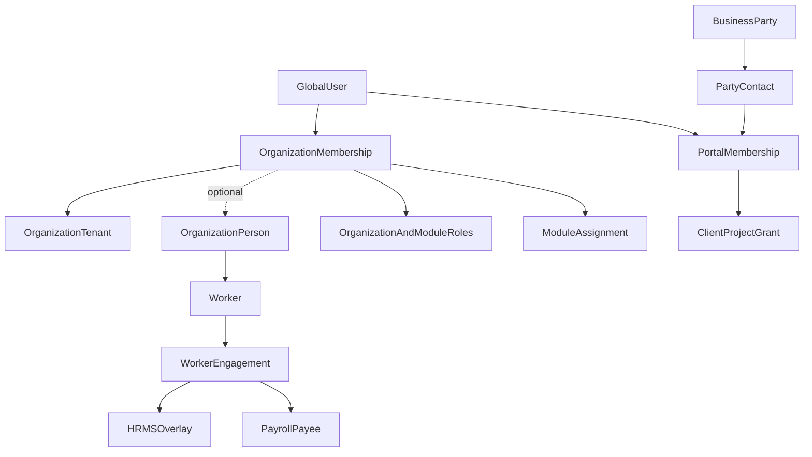

# StreamlineOS platform domain redesign — final verified architecture

## Architect verification & reconciliation (read first)

Reviewed as a senior architect + full-stack engineer against the **actual repository** (verified across this engagement: 198 schema files, 120 backend modules, 43 frontend features). **Verdict: adopt this plan — correct, complete for current + future needs, scalable, and repo-accurate.**

- **Repo-accurate.** `organization_members.status` + lifecycle timestamps and `organizations.owner_membership_id` now exist (added this engagement); the tenant-composite owner FK/trigger is still to be declared. `billing_profiles`/`app_installations`/`affiliates`/`revenue_events` use **integer** `org_id`; `org_modules.org_id` is **varchar(36)** no FK; **Accounting AR is text+FK (NOT part of the mismatch)** — the plan states this correctly. `hr_people.user_id` is nullable (login-optional already). `team` falls back to `own`. `users.role` + polymorphic `groupRoles`/`resourceGrants` still live. All verified true.
- **Workspace-rule reconciliation.** This plan **reserves "Workspace" for the PM Workspace container** and bans it only as a *tenant* synonym — this **supersedes** the earlier "Workspace banned entirely / no PM container" rule. The shipped 28-file tenant-"Workspace"→"Organization" sweep stays correct (those were tenant-meaning). The `project_workspace_members` rename was **deferred**, so it correctly becomes **`pm_workspace_memberships`** (after `pm_workspaces` + `pm_workspace_id` backfill). The shipped `managed_products` table stays valid (a Managed Product is a PM Workspace child; `pm_workspace_id` added when `pm_workspaces` lands).
- **PM owns products AND project management — confirmed & required.** Product Management owns **Managed Products** (products: strategy/outcomes/roadmaps) *and* **Projects → Initiatives/Epics → Tickets → delivery**. "Product" is disambiguated: Managed Product (PM) ≠ CRM Offer (CRM) ≠ Inventory Item/SKU (Inventory). No shared generic `products` table.
- **RBAC verdict (your direct question: is my idea good, or a completely different "many-applications" RBAC?).** **Your hybrid idea is the best fit — adopt it:** tenant RBAC + relational scopes + typed ReBAC + narrow domain predicates (§5). Do **NOT** adopt a generic ABAC DSL, Zanzibar/OpenFGA tuple infra, or an external "many-applications" authorization service *now* — for a modular monolith with strongly-typed relations that fit relational joins, in-process RBAC+ReBAC is faster, simpler, FK-safe, and cheaper to operate. §5 defines the exact **measurable reconsideration triggers** (>50M tuples, >10k checks/s or p95 >20ms, graph depth >3 across ≥3 domains, >5 services, dedicated authz team) — revisit only then. This is the correct scale-aware call.
- **UI/UX (§7).** Your product model is validated (§7.0); the IA + four People journeys + per-module Access + isolated Client Portal + responsive/accessibility/mobile + frontend delivery acceptance tests are complete and scalable — the best UX for this platform, covering the edge cases.
- **Six pillars all covered:** membership lifecycle + owner integrity + tenant FKs (§2, §4, Waves 1/4) · membership-based roles + remove global roles (§5, Wave 5) · Org/Admin/Module-Admin hierarchy (§5) · real own/team/all scopes (§5) · typed Project/portal grants (§5, §6) · RLS defense-in-depth (§5 RLS ADR, Waves 4/9).
- **In-progress (uncommitted, backend-typecheck-clean, migration-ready):** Wave 0 control-plane + guard; Wave 1 ownership columns + hardened transfer; Wave 2 `org_modules` sole read-authority; Wave 3 `directory/` (organization_people/workers/worker_engagements) schema; Wave 5 module-admin roles (HR_ADMIN/CRM_ADMIN/INVENTORY_ADMIN/PRODUCT_MANAGEMENT_ADMIN + MEMBER); Wave 7 `managed_products` feature (backend module + RBAC + frontend). Schema migrations gated on the Neon reconciliation; big renames gated on the concurrent Projects session going quiet.

The full authoritative plan follows verbatim.

---

## Verdict

**Keep Organization as the tenant.** Dropping the tenant boundary fails multi-organization SaaS: one person owns Organization A, is invited into Organization B, pays per organization, and enables different modules per organization. The current platform already has the right skeleton (`organizations` + `organization_members` M:N + switching + invitations, with partially landed lifecycle/owner-pointer columns); its invariants and transfer flow are **incomplete**, not unnecessary.

**Best architecture:** retain physical `organizations`, `organization_members`, and `org_id`; call the tenant **Organization** in product language; reserve **Workspace** exclusively for the Product Management bounded context; and separate bounded contexts that the current schema incorrectly merges:

- Identity: authentication, credentials, sessions.
- Tenancy: organizations, subscriptions, invitations, installed modules.
- Directory: organization-local people, including people without logins.
- Access: internal memberships, roles, grants, scopes, delegations.
- Portal Access: external authenticated contacts, never internal members.
- Workforce: workers and effective-dated employee/contractor engagements.
- Business Party: customers, vendors, partner organizations and contacts.
- StreamlineOS Modules: Product Management, CRM, Inventory, HRMS, Payroll, Accounting, Support, KB and others.

HRMS and Payroll are independent modules over Workforce. Product Management, CRM and Inventory work without HRMS.



---

## 1. Why Organization stays (scale + real usage)

| Scenario | Without Organization | With Organization |
|----------|-------------------|----------------|
| Freelancer creates an organization and a PM Workspace | Ambiguous ownership of data/billing | One tenant, one owner, transferable; PM work stays in a child Workspace |
| CEO asks HR to set up, then takes ownership | No safe handoff | Transfer ownership transaction |
| Same person in Agency A + Client B | Role/data collision on global user | Per-membership roles + profiles |
| CRM-only vs Inventory-only customers | Forced unused modules / shared schema pollution | Module enablement per organization |
| Billing / AI credits / seats | Cannot meter correctly | Per-organization subscription |

### Final organization decision

The Organization tenant concept is **required**. It is the security, billing, data-isolation and module-entitlement boundary. Removing it would make multi-organization membership, ownership transfer, per-customer billing, module installation and tenant-safe RBAC impossible to model correctly.

- Product/UI name: **Organization**.
- Internal physical persistence: keep `organizations`, `organization_members` and `org_id`.
- `Organization` means the top-level tenant containing People and enabled StreamlineOS Modules.
- `Workspace` means only a Product Management container inside an Organization.
- Organization hierarchy (departments, reporting lines, business units) is a separate Workforce capability and is not the tenant itself.
- A person may own or join multiple Organizations and have different roles in each.

Do not physically rename the established tenant FK graph merely to change terminology. Public DTOs and new route parameters should use `organizationId`; existing `org_id`, `orgId`, `/organization`, and other deployed contracts remain temporary compatibility names until consumers migrate.

### Product Management naming

- **Pre-implementation ADR/reconciliation gate:** before any PM schema, API, UI, or migration work, reconcile the target hierarchy and terminology with `docs/schema-migration/wave-8-pm-hierarchy-design.md`. The reconciliation must record every contradiction between that document and this plan, explicitly supersede or amend it, and publish the decided containment, membership, FK, provisioning, navigation, and legacy-data rules. No contradictory design document may be silently ignored.
- Rename the current **Projects** StreamlineOS Module label to **Product Management**.
- Product Management owns the complete PM domain: **PM Workspaces, Managed Products, product strategy and roadmaps, Delivery Teams, Projects, Initiatives/Epics, Tickets, and delivery execution**. No other module owns or redefines these aggregates.
- Canonical containment hierarchy: **Organization → Product Management → PM Workspace → Managed Product and Delivery Team / Project**. Product Management is an enabled StreamlineOS Module; the PM Workspace is its contained collaboration and access boundary, not a second tenant.
- A **PM Workspace** is the Product Management collaboration and access container; it is never the tenant.
- A **Managed Product** is an enduring PM aggregate that owns product strategy, outcomes, roadmaps, and its product-associated delivery work. It is not a StreamlineOS Module/App, CRM Offer, Inventory Item, or Inventory SKU.
- A **Delivery Team** is a PM Workspace-scoped team.
- A **Project** is a time-bounded delivery/change record inside a PM Workspace. It may optionally belong to one Managed Product; absent that association, it is a valid client-delivery project managed directly in the PM Workspace.
- A Project owns its delivery execution hierarchy—Initiatives/Epics and Tickets—with Delivery Teams and project memberships providing the assignment and access relationships. A Managed Product can have many associated Projects; a Project has at most one Managed Product and never requires one.
- Product Management does not own commercial catalog or stock aggregates: CRM owns CRM Offers, and Inventory owns Inventory Items and Inventory SKUs. Explicit integration contracts may relate those aggregates to PM work, but no shared generic `products` table or cross-module ownership is allowed.
- **PM Workspace provisioning invariant:** an Organization has exactly one default PM Workspace if and only if Product Management is enabled for that Organization or it has retained Product Management data. Provisioning is transactional, idempotent, and unique on `(org_id, is_default)` with a partial unique index; it may be retried safely. Do not create a PM Workspace for a Product Management-disabled Organization with no PM data.
- **PM hierarchy constraints:** an ineligible Organization has zero PM Workspaces. An eligible Organization has exactly one default PM Workspace and may have additional non-default PM Workspaces only while Product Management is enabled and through an authorized, idempotent PM command. Every non-default workspace has the same Organization boundary, membership requirement, path context, and composite-FK hierarchy as the default; disabling PM blocks new workspaces and side effects but retains existing PM data under lifecycle policy.
- During migration, create the default PM Workspace only for eligible Organizations (Product Management enabled or existing PM data). Backfill their projects, PM roster members, delivery teams, and applicable PM artifacts before `pm_workspace_id` becomes required. Enabling Product Management for a new or existing Organization atomically provisions its one default workspace in the same transaction before the enablement transaction commits; retrying the command rereads the unique default row rather than creating another.
- Target source ownership:
  - backend schema folder: `backend/src/db/schema/product-management/`
  - backend module folder: `backend/src/modules/product-management/`
  - frontend feature folder: `frontend/features/product-management/`
  - module route namespace: `/product-management`
- Follow repository naming conventions: kebab-case folders and snake_case database identifiers. Never use the literal unseparated `productmanagement`.
- Existing physical `projects` / `project_*` tables and IDs remain during compatibility migration. New Product Management tables use clear descriptive names or a consistent `pm_*` prefix. Rename existing database tables only through a separately approved migration when the operational value exceeds the compatibility cost.
- Target new tables are `pm_workspaces`, `pm_workspace_memberships`, `pm_products`, and `pm_delivery_teams`; existing `projects`, `project_members`, and deployed project tables remain compatibility storage until a separately approved physical migration.
- Current `project_workspace_members` is an organization-wide Projects-module roster, not yet membership in a real PM Workspace. Add and backfill `pm_workspace_id` before treating or renaming it as `pm_workspace_memberships`.
- Keep existing backend `/projects` endpoints and `projects:*` permission keys as compatibility contracts during the first rename release. Add `/product-management` UI routes with redirects from `/projects`; API/permission renames, if still valuable, require a later versioned migration and aliases.
- Target system-role display name is **Product Management Admin**. Existing role slugs remain aliases until assignments are backfilled.

### Organization and module lifecycle
- Organization state transitions are `ACTIVE ↔ ARCHIVED`, then `ACTIVE/ARCHIVED → PURGE_SCHEDULED → PURGED`. “Restore” is the audited transition from `ARCHIVED` back to `ACTIVE`, not a permanent `RESTORED` state. Archive is reversible and immediately invalidates internal and portal sessions, blocks new sessions, writes, module actions, scheduled work, outbound webhooks, and integration sync; retained reads are limited to Owner-approved recovery/admin paths.
- Restore is an explicit Owner-only transaction that reactivates the Organization and only module installations that were active at archive time (not modules independently disabled beforehand); it never replays expired invitations, revoked grants, completed jobs, or webhook deliveries. It invalidates access/session/module caches and records an audit event.
- Irreversible purge is delayed, separately authorized, cancelable until its deadline, and executed by a resumable idempotent worker. It verifies the Organization is still purge-scheduled and locked, destroys or anonymizes data according to retention policy, emits a final audit/outbox record, and never relies on a request thread for deletion.
- Disabling a module is reversible: deny new module operations and module background jobs, pause outbound webhooks/integration sync, retain module data for the configured retention window, and preserve the PM default workspace/data if PM was ever enabled. Re-enable restores the installation and resumes only explicitly safe jobs/syncs; it does not retroactively execute missed side effects.
- Module disable/purge and Organization archive/purge each use their own lifecycle timestamps, reason, actor membership, retention deadline, and job id. Foreign keys remain intact until the delayed purge worker reaches its approved deletion/anonymization phase.

---

## 2. Identity, People, membership and employment

The earlier `User → Membership → Employment` model was insufficient. A company may import employees before inviting them, pay workers who never log in, use contractors in projects, and give customers portal access. These are distinct facts.

### Identity
- `users` is global authentication identity only: credentials, MFA, platform status and preferences.
- Remove organization role, salary, bank, tax, department, manager and employment fields after consumers migrate.
- A user can have internal memberships in many organizations and external portal access elsewhere.

### Directory
- `organization_people` is the organization-local human directory. A person can exist without credentials.
- It holds safe contact/profile data and normalized emails/phones; sensitive HR/payroll data stays in those domains.
- A person may optionally link to one global user identity in the organization. Enforce tenant-safe uniqueness when linked.
- `organization_members` remains the canonical internal login/access relation and optionally links to `organization_people`.
- Do not create a third membership table. Convert `user_memberships` into a profile/placement compatibility source, then retire it.

### Organization Membership lifecycle
- Current repo reality: `organization_members.status` and lifecycle timestamps now exist, and `organizations.owner_membership_id` is present in the schema. This is **partial implementation, not completion**: the owner pointer is not yet declared with the required tenant-composite FK in the inspected schema, and role/module/PM assignments still commonly reference global `user_id`.
- Canonical states are `INVITED → ACTIVE ↔ SUSPENDED → ACTIVE` and `INVITED/ACTIVE/SUSPENDED → LEFT`. `LEFT` is terminal for that membership record; rejoining creates a new membership so historical actors and grants remain attributable and are not silently revived. Replace the current global `(user_id, org_id)` uniqueness with a partial uniqueness rule covering non-`LEFT` memberships, while retaining historical rows. Invitation acceptance activates exactly one current membership transactionally. Suspension immediately blocks interactive sessions, API keys delegated through that membership, role/grant use, module assignments, and new background work.
- Every state transition records actor membership, reason, timestamp, audit event and access-version bump. Leaving/suspension does not delete historical records. A membership cannot become `LEFT`, be suspended, or be deleted while it is the authoritative owner membership.
- Internal invitations target an Organization and normalized email, but acceptance binds the resulting membership to the authenticated User Account only after token, email, expiry, Organization state and duplicate-membership checks. Invitation role requests are validated through the same grantability/rank policy as direct assignments.

### Workforce
- `workers` marks an organization person available as labour.
- `worker_engagements` models effective-dated employment or contracting: employer legal entity, worker type, start/end, status and primary engagement.
- A Worker belongs to exactly one Organization Person in the same Organization; an Organization Person has at most one Worker record. `workers` and `worker_engagements` carry `(org_id, id)` candidate keys and tenant-composite foreign keys.
- An Engagement has a half-open effective interval `[starts_on, ends_on)` (a null end is open-ended). A database exclusion constraint prevents overlapping active/planned engagements for the same Worker; cancelled/void engagements are excluded from that constraint.
- At most one active primary Engagement exists per Worker. A partial unique index enforces this, and a deferred validation trigger prevents a primary engagement from being outside its effective interval or from coexisting with another active primary. If business policy requires parallel legal engagements in future, it must be an explicit, separately modeled exception—not an overlap loophole.
- Engagement employer legal entity, manager, organization unit, location, and payroll/HR overlays must belong to the same Organization through composite FKs. No module assignment, payee, or PM assignment infers employment status.
- Org units, reporting lines and worker locations belong to Workforce, not tenancy core.
- Pre-hires, offline workers and contractors remain valid without an application membership.
- Existing `hr_people`/`hr_employments` should evolve toward this seam; do not regress their nullable-login capability.

### Module independence
- Product Management, CRM and Inventory may assign active internal memberships without HRMS.
- HRMS extends Worker/Engagement with recruitment, onboarding, leave, attendance, performance and employee relations.
- Payroll independently extends Worker/Engagement with payee, compensation, tax, bank, runs and payslips. **Payroll must not require the HRMS module entitlement.**
- Payroll administrators require memberships; payees do not require logins.
- Module tables store operational assignments, never duplicate employee/person masters.

### External people
- Customers, vendors and stakeholders are Business Party contacts, not employees.
- External authenticated users receive `portal_memberships`, not internal `organization_members`.
- Portal principals cannot receive internal organization/module roles.
- `portal_invitations` are separate from internal Organization invitations and include `(org_id, party_contact_id)`, normalized recipient email, audience (`CLIENT_PORTAL`), status, expiry, hashed one-time bearer token, inviter internal membership, accepted portal membership, and revocation metadata. Pending uniqueness is tenant-and-email-and-audience scoped.
- Accepting a portal invitation atomically validates token, expiry, recipient/contact and Organization state; links or creates the global User Account; creates/activates exactly one tenant-composite Portal Membership; consumes the invitation; rotates the portal session epoch; and emits audit/outbox records. It must never create an internal Organization Membership.
- Portal sessions carry an explicit portal audience and portal-membership/version reference. Internal session cookies/tokens and portal session cookies/tokens are audience-separated; guards reject the wrong audience before route authorization. Logout, suspension, contact unlink, invitation revocation, Organization archive, and grant revocation invalidate portal sessions immediately.
- `portal_memberships`, `portal_invitations`, and `project_client_grants` use `(org_id, id)` parent candidate keys and composite FKs. A Portal Membership is either created from a Party Contact or has no client-grant eligibility; the preferred target is a non-null `(org_id, party_contact_id) → party_contacts(org_id, id)` binding on `portal_memberships`. A client grant derives its Party Contact solely through that Portal Membership and must not accept a separately supplied contact ID. If compatibility requires a direct `party_contact_id` on `project_client_grants`, it has both `(org_id, portal_membership_id) → portal_memberships(org_id, id)` and `(org_id, party_contact_id) → party_contacts(org_id, id)` FKs plus a composite candidate key/constraint proving the contact is the membership's bound contact. The grant also references the Project and PM Workspace through the same Organization; its lifecycle is `ACTIVE/SUSPENDED/REVOKED/EXPIRED`, with expiry and field-level allowlist validated server-side.

---

## 3. Bounded contexts and schema ownership

Keep a single Postgres database initially, but establish strict source ownership and one-directional dependencies:

- `identity/`: users, accounts, MFA, sessions and preferences.
- `tenancy/`: organizations, internal memberships, invitations, subscriptions and module installations.
- `directory/`: organization people and contact points.
- `access/`: roles, grants, delegations, groups, versions and module denials.
- `portal-access/`: external portal memberships and portal resource grants.
- `workforce/`: workers, engagements, legal entities, org units and reporting lines.
- `party/`: customer/vendor/partner organizations, people, contacts and addresses.
- Module folders: `product-management/`, `crm/`, `inventory/`, `hr/`, `payroll/`, `accounting/`, `support/`, `kb/`, etc.

Core/supporting contexts may be imported by modules. Optional StreamlineOS Modules must not import another optional module's schema. Cross-module behavior uses integration-owned mappings, stable IDs, service ports, outbox events and idempotent consumers.

### Canonical glossary (non-negotiable)
| Concept | Canonical name and target | Must not mean |
|---------|---------------------------|---------------|
| Tenant | **Organization**; physical compatibility: `organizations`, `organization_members`, `org_id` | Workspace |
| Global login identity | **User Account** / `users` | Person, member, employee, client |
| Internal tenant access | **Organization Membership**; compatibility table: `organization_members` | Person, PM Workspace membership, project membership |
| Tenant-local human directory | **Organization Person** / target `organization_people` | User Account or employee |
| Workforce participation | **Worker** + effective-dated **Engagement** | Organization Membership |
| Organizational hierarchy | **Organization Unit**; use a qualified **Organization Team** only when it is not a unit | PM Delivery Team |
| Product Management container | **PM Workspace** / target `pm_workspaces` | Organization tenant |
| Product Management access | **PM Workspace Membership** / target `pm_workspace_memberships` | Organization Membership |
| Product Management team | **Delivery Team** / target `pm_delivery_teams` | Organization Unit or generic Team |
| Enduring PM-owned product with strategy, roadmap and outcomes | **Managed Product** / target `pm_products` | StreamlineOS Module/App, CRM Offer, Inventory Item, Inventory SKU |
| Time-bounded PM delivery/change record | **Project** / compatibility `projects`; optionally associated with one Managed Product | PM Workspace, Managed Product, or CRM delivery contract |
| PM execution hierarchy | **Initiative/Epic** and **Ticket** beneath a Project | CRM work item, Inventory stock record, or generic cross-module task |
| Enabled StreamlineOS software capability | **StreamlineOS Module/App** / compatibility `org_modules` | Managed Product or commercial offer |
| Neutral counterparty | **Business Party** + Party Contact | Tenant Organization or CRM-owned master |
| CRM overlay on a party | **CRM Account** / target `crm_accounts` | Organization tenant |
| CRM sellable promise | **CRM Offer** / target `crm_offers` | Managed Product, Inventory Item, SKU |
| Inventory family/model | **Inventory Item** / target `inventory_items` | CRM Offer or Managed Product |
| Stocked inventory variant | **Inventory SKU** / target `inventory_skus` | Generic product or CRM Offer |
| External authenticated access | **Portal Membership** | Organization Membership |

The word **Workspace** is forbidden outside Product Management except when documenting a current compatibility symbol such as `workspace-switcher.tsx`, `workspace-onboarding`, or `project_workspace_members`. Those symbols describe legacy implementation and must not define the target domain vocabulary.

### Identifier convention (non-negotiable)

- Public/API names are descriptive: `organizationId`, `organizationMembershipId`, `personId`, `pmWorkspaceId`, `managedProductId`, `deliveryTeamId`, `projectId`, `partyId`, `crmAccountId`, `offerId`, `inventoryItemId`, and `skuId`. Do not introduce generic mutation parameters named only `id`.
- Keep `org_id` and current `orgId` contracts during compatibility, but new DTOs and route parameters use `organizationId`. Route params are descriptive (`[organizationId]`, `[pmWorkspaceId]`, `[projectId]`), never `[id]`.
- Long-term cross-domain and externally addressable aggregate identifiers use native PostgreSQL UUIDs: Organizations, User Accounts, Organization Memberships, Organization People, PM Workspaces, Managed Products, Delivery Teams, Projects, Business Parties, CRM Accounts, CRM Offers, Inventory Items, and Inventory SKUs.
- High-volume subordinate rows such as ledger entries, audit events, versions, and document lines may use `bigint GENERATED ALWAYS AS IDENTITY` when they are not cross-domain identifiers.
- The immediate migration standard is the current text Organization/User ID representation. Do not convert the core graph to native UUID until every existing value validates and every referencing column is mapped. Native UUID conversion is a separate whole-graph program using shadow columns and compatibility adapters.
- Every FK column exactly matches its parent type. Every tenant-owned parent exposes `UNIQUE (org_id, id)` during compatibility; every tenant child uses a composite FK `(org_id, parent_id)`.
- The migration design must include a **per-table composite-FK matrix** before constraints are introduced. For every table it records: child table/column, parent table/key, tenant ownership, existing and target ID types, required candidate key, composite FK definition, nullability, invalid-row repair/quarantine query, migration wave, validation state, and cutover owner. It is a release gate, not documentation added afterward.
- Global identities are the narrow exception: a global User Account may be referenced by global identity/session/auth tables through its global key. Once a relation is tenant-owned (membership, person link, invite acceptance, assignment, portal access, audit actor context, or module data), it also carries `org_id` and uses the applicable tenant-composite FK. A global `user_id` never proves tenant access.
- Every ID change requires an explicit **staged ID-transition matrix**: source column/type and semantic, shadow column/type, dual-write owner, backfill and checksum method, read precedence by release, compatibility DTO/route alias, FK/index/constraint sequence, rollback/forward-repair action, and the contract-removal release. No direct `ALTER TYPE`, mass cast, or ambiguous `id` alias is permitted in the live graph.
- Organization Memberships retain stable IDs. RBAC, module assignments, PM Workspace memberships, Delivery Team memberships, and Project memberships reference membership IDs rather than raw global user IDs.
- TypeScript contracts use distinct validated/opaque ID types generated from backend contracts so Organization, user, membership, account, offer, item, and project IDs cannot be interchanged accidentally.
- A table-local primary key may remain `id`; APIs, commands, events, route parameters, logs, and variables use the qualified semantic name.
- Existing mismatches are migration defects, not precedent: platform billing contains integer Organization columns while the canonical Organization ID is text; `org_modules` uses an unconstrained varchar tenant key; organization placement mixes integer and text hierarchy IDs; PM contracts conflate membership-row IDs with user IDs; and CRM uses tenant `orgId` beside counterparty `organizationId`. The inspected Accounting AR tables use text Organization FKs and are not part of the billing mismatch.

### Business Party
- Inventory-only and Accounting-only customers still need customers/vendors without buying CRM.
- `business_parties` owns neutral counterparty identity; CRM adds pipeline/account metadata, Inventory adds vendor operations, Accounting adds receivable/payable attributes.
- Existing `clients`, `crm_organizations` and `inv_vendors` require a separate ADR and migration mapping; do not collapse them blindly. The target CRM name is `crm_accounts`, linked to `business_parties`; `crm_organizations` remains a compatibility name only.

### CRM ↔ Inventory
- CRM runs **fully without Inventory** (services, bundles, subscriptions, non-stock offers).
- Inventory runs **without CRM**.
- A StreamlineOS Module/App is an enabled platform capability. A CRM Offer is a commercial promise; an Inventory Item is the inventory family/model; an Inventory SKU is the physical stocked variant; a Managed Product is an independently managed PM aggregate for strategy, roadmaps and delivery. These are four distinct concepts with separate owners and lifecycles.
- Use integration-owned `offer_fulfillment_components`: CRM Offer, Inventory SKU, quantity, UOM, status and effective dates. This supports bundles and many-to-many mappings.
- Quotes snapshot offer description/price. Fulfilment snapshots SKU components.
- Commercial acceptance emits an outbox event; Inventory explicitly reserves stock. Neither module writes the other's aggregate.

---

## 4. Ownership transfer (CEO / HR / CTO cases)

- The inspected schema has only a non-unique `(org_id, is_owner)` index. Even replacing it with a partial unique index would enforce only **at most one**, not exactly one. Use `organizations.owner_membership_id NOT NULL` as the authoritative owner pointer.
- Current `organization_members.id` is already a stable integer primary key and already has `UNIQUE (org_id, id)` in the inspected schema; do not invent a second public membership identity for ownership. The remaining structural requirement is a deferred composite FK `(organizations.id, owner_membership_id) → organization_members(org_id, id)` plus lifecycle enforcement. A future whole-graph ID conversion may shadow this key, but ownership must not wait for UUID conversion.
- Bootstrap is a dedicated idempotent migration transaction, not a best-effort backfill: use the existing nullable pointer/lifecycle columns; deterministically repair or quarantine ambiguous owner rows; lock each Organization and candidate memberships with `FOR UPDATE`; select the canonical active creator membership; set the pointer; then validate the deferred composite FK and make the pointer non-null only after zero unresolved Organizations remain.
- The bootstrap records a repair ledger and checksum so reruns cannot choose a different owner or create a second membership. Where provenance cannot distinguish competing owners, quarantine for an explicit operator decision rather than selecting by row order.
- After the pointer becomes `NOT NULL`, Organization creation must resolve the circular insert safely: preallocate the integer membership ID from its sequence (or use the future client-generated membership UUID), insert the Organization with that `owner_membership_id`, insert the matching active creator Organization Membership with the preallocated ID, and write audit/outbox records in one transaction under the deferred composite FK. Do not insert a null owner and “fix it later.” Owner authority is immediately derived from the pointer; an OWNER role may exist only as a display/compatibility projection and is never an independent grant. Concurrent creation/repair paths lock the Organization row and use unique conflicts as a reread signal.
- Remove `is_owner` as an independent authority after migration; derive it by comparing membership ID to the Organization owner pointer.
- A deferred constraint trigger prevents the owner membership from becoming suspended, left or deleted before transfer.
- Transfer is one transaction:
  1. Lock Organization and both memberships; verify caller is still current owner.
  2. Target must be an active internal membership.
  3. Update the one owner pointer.
  4. Sync any OWNER display/compatibility projection without treating it as authority.
  5. `bumpPermissionsVersion`; invalidate both users’ access/session caches.
  6. Audit both principals.
- Organization Owner-only: transfer, archive/restore Organization, schedule/cancel purge, billing ownership changes.
- Organization Admin has full administration **except** owner-only powers.
- Creator of an Organization is its initial owner; ownership may later transfer to another active Organization Membership through the same path.
- **Organization creation authority:** any authenticated User Account may create an Organization; being an owner or administrator of an existing Organization is not a prerequisite. The creation command is subject to rate limits, plan/seat policy where applicable, and abuse/fraud controls. It atomically creates the Organization, active creator Organization Membership, authoritative owner pointer, initial session context, audit record, and required outbox event. Existing owners and Organization Admins manage an existing Organization; that authority does not limit who may create another Organization.

---

## 5. RBAC hierarchy (verified privilege model)

### Principals
1. **Platform Admin** — separate control-plane principal; tenant support access is explicit, time-bounded and audited.
2. **Organization Owner** — derived only from the validated active owner membership; owner-only operations.
3. **Organization Admin** — immutable system role; non-owner organization administration and all enabled-module Access screens.
4. **Module Admin** (e.g. `PRODUCT_MANAGEMENT_ADMIN`, `HR_ADMIN`, `INVENTORY_ADMIN`, `CRM_ADMIN`) — immutable, module-scoped administrative role.
5. **Organization Member** — active internal membership with no implied administrative authority.
6. **Functional role** — recruiter, warehouse operator, delivery, payroll processor, sales rep, etc.
7. **Resource member** — project/delivery-team/object-specific access.
8. **External portal principal** — separate audience and explicit portal grants only.

System role rank is `Organization Owner > Organization Admin > Module Admin(module) > Functional Role > Member/Resource Member`; Platform Admin is a separate control-plane axis, not a tenant-assignable rank. A caller may assign only lower ranks, except Organization Owner may assign Organization Admin and Organization Owner changes only through the transfer transaction. Organization Admin may assign Module Admin and lower but never Owner or Platform Admin. Module Admin may assign same-module Module Admin only when the permission descriptor explicitly allows peer delegation, and otherwise only lower same-module roles. A caller cannot edit, delete, clone into, or change the permission set/rank/module of immutable system roles.

### Module-level RBAC screen (your requirement)
- **Who can see / call module Access & Roles UI + APIs:** Organization Owner, Organization Admin, or that module’s Module Admin.
- **Everyone else:** 404/403 — UI hidden **and** backend `@RequirePermission` + service assert. Hiding alone is not enough.
- Module Admin **cannot**:
  - grant permissions outside their module’s allowlist
  - grant organization-wide `settings:manage`, ownership, billing, or other modules’ admin
  - escalate via custom roles (server validates permission-subset against caller’s grantable set)
- Organization Admin / Organization Owner appoint the first Module Admin; a Module Admin may appoint a peer **within the same module only when** its immutable descriptor explicitly grants peer-admin delegation.

### Backend-owned grantability
Each permission descriptor includes module, resource/action, risk class, delegable flag, supported scopes, assignable role classes and whether resource binding is required.

- Organization Owner: all non-platform permissions; ownership changes only through transfer.
- Organization Admin: all non-owner organization and module permissions.
- Module Admin: only its module allowlist and assignable ranks below Module Admin, plus same-module peer rank only when the immutable descriptor explicitly permits it.
- Functional roles: no role-management ability by default.

Every role/grant/delegation write rejects unless:

1. requested permissions are a subset of the caller's grantable set;
2. target role rank is assignable by the caller;
3. target membership/resource belongs to the same Organization;
4. module is enabled and scope is supported;
5. reserved permissions are absent.

Unknown permission keys must be rejected, never silently filtered.

### Access discovery and catalog contracts
- The backend exposes discovery endpoints for the authenticated active Organization: effective permissions and scopes, enabled modules, visible permission descriptors, assignable system/custom role templates, caller grantable-permission subset, assignable role ranks, eligible active memberships, and typed resources available for a requested binding. The frontend renders only these server-filtered results; it does not ship an authoritative catalog or infer grantability.
- Discovery responses are audience- and module-aware, tenant-scoped, paginated where unbounded, and versioned by the Organization access version. A Module Admin receives only its module's descriptors, roles, principals, and resource types; portal sessions receive portal discovery only.
- The permission catalog remains backend-owned and is filtered server-side twice: once for discoverability and again at every write/authorize decision. A catalog entry being visible never itself grants the ability to assign or use it.

### Authorization pipeline
For every protected request:

1. Validate session and revocation.
2. Resolve Organization from server-controlled route/session context.
3. Load and validate active membership from the database.
4. Derive owner status from the owner pointer, never JWT `isOwner`.
5. Validate canonical module installation/entitlement.
6. Resolve active, non-expired direct and group roles.
7. Add valid time/module/scope-bounded delegations.
8. Load explicit denies at Organization, module, and typed-resource levels.
9. Evaluate deny precedence deterministically: an applicable explicit deny overrides every ordinary role, delegation, group or resource allow. Emergency recovery is a separate, time-bounded, audited control-plane operation—not a hidden bypass in tenant permission evaluation.
10. Allow when either scoped tenant RBAC contains the object or an applicable typed resource relation grants the action; then enforce the narrow domain predicate. A typed grant never bypasses lifecycle, module, audience, deny or domain invariants.
11. Audit privileged and deny decisions.

Plan quotas are enforced by domain services, not merged into permission resolution.

Retire `users.role`, legacy permission fallbacks, `organizations.enabled_modules` as an authority, and independently maintained frontend role defaults. Backend catalog and effective grantability are canonical.

### Tenant-safe references
- Target `membership_role_assignments` reference `(org_id, organization_membership_id)` and `(org_id, role_id)` through composite FKs; assignment actor is also an Organization Membership. Existing `user_roles.user_id`, `role_permissions`, `user_permissions`, `user_delegations` and legacy role columns are compatibility sources only and are retired after dual-read parity.
- A role belongs either to the Organization or to one Module within that Organization. No role assignment is global merely because its User Account is global. One User Account may therefore hold unrelated roles in different Organizations.
- Module assignments reference Organization Memberships, not raw global User Account IDs. Suspension or leave makes all derived role, group, module and typed-resource access ineffective without deleting history.
- Replace polymorphic `group_type + group_id` and `resource_type + resource_id` authorization with typed assignment tables that have enforceable tenant-composite FKs.
- Use dedicated typed tables for authorization-bearing PM relationships: `pm_workspace_memberships`, `pm_delivery_team_memberships`, `project_memberships`/`project_access_grants`, and `project_client_grants`. Each has tenant-composite FKs to the PM Workspace/Delivery Team/Project and to the allowed principal type. Internal PM tables accept Organization Memberships only; client grants accept Portal Memberships only. Every PM child—including Managed Products, strategy/roadmap records, Delivery Teams, Projects, Initiatives/Epics, Tickets, PM membership/grant rows, and client grants—carries `org_id` and `pm_workspace_id` and uses a composite FK to `pm_workspaces(org_id, id)`. Where a child references another PM parent, its FK includes `(org_id, pm_workspace_id, parent_id)` against a candidate key on that parent, preventing cross-workspace references. A Delivery Team membership or Project membership/grant additionally proves its principal has an active PM Workspace Membership in the same Organization/workspace through a composite FK or deferred constraint backed by a candidate key; no downstream PM access can exist without active PM Workspace Membership.
- PM permission boundaries follow the ownership hierarchy. Product Management module permission plus active PM Workspace Membership is the mandatory entry boundary for PM Workspace, Managed Product, strategy and roadmap operations. Delivery Team and Project membership/grants narrow access only after that active PM Workspace Membership is confirmed; Project grants also cover their Initiatives/Epics and Tickets. A Project without a Managed Product uses the same PM Workspace and Project boundaries, not a CRM or Inventory permission. Product Management Admin can administer only Product Management roles, memberships, PM resources and grants; it cannot administer Organization, CRM, Inventory, billing, or another module.
- Other domains add a typed table only when a real resource-specific relation exists (for example CRM Account assignment). No generic `resource_type/resource_id`, `principal_type/principal_id`, arbitrary attributes map, or tenant-scoped registry may make an authorization decision.
- Every tenant child references `(org_id, parent_id)`; a separate `org_id` plus global FK is insufficient.

### Revocation and cache model
- Add membership/session epoch plus Organization access version.
- Membership, owner, role, permission, delegation, deny, module and resource-grant mutations update relevant versions in the same transaction and publish invalidation.
- Guards still validate active membership; versioned JWTs are hints, not authorities.
- Remove fail-open frontend session restoration for authorization. Backend/session failure fails closed.

### Scopes
Scopes constrain a specific permission and are translated by that domain into SQL predicates; they are not labels interpreted generically after data is loaded.

- `own`: rows for which the active Organization Membership has a documented direct relation for that resource (for example assignee, requester, creator only where creation truly implies ownership, payee for self-service, or explicit project membership). It never means “same global user ID wherever found,” and `created_by` is not a universal ownership shortcut.
- `team`: `own` plus rows related to a typed, active team/Organization Unit membership defined by that domain. The domain must specify the authoritative team relation, effective dates, whether descendants are included, and manager semantics. No inference from free-text `users.team`, role name, department label, or reporting-chain traversal.
- `all`: every otherwise-visible row in the active Organization and enabled Module, still subject to lifecycle, domain predicates, typed-resource restrictions, explicit denies and portal audience.
- `none`: no rows for that permission.
- Combining ordinary role grants for the same permission selects the broadest valid scope (`none < own < team < all`); an explicit applicable deny still wins. Scope resolution never crosses Organizations or audiences.

`team` is unavailable in APIs, role editors and templates until each adopting domain has a tenant-composite team source, a SQL scope adapter, effective-membership semantics, indexes and allow/deny tests. The present fallback of `team` to `own` must be removed; unsupported `team` must fail validation rather than silently narrow or broaden.

### Exact hybrid authorization recommendation
**Retain the user's hybrid idea, with a narrower and enforceable definition: tenant RBAC + relational scopes + typed ReBAC + narrow domain predicates.**

For an internal request to action `A` on resource `R`, authorization is:

`active session ∧ active Organization Membership ∧ active Organization/module ∧ audience=INTERNAL ∧ no applicable deny ∧ domain invariants(R) ∧ ((RBAC permits A ∧ relational scope contains R) ∨ typed grant permits A on R)`.

For a portal request, there is no internal-RBAC branch: `audience=PORTAL ∧ active Portal Membership ∧ active Organization/module ∧ active typed portal grant for R/A ∧ field allowlist ∧ domain invariants`.

- Tenant RBAC answers **what action may this membership perform in this Organization/Module?**
- Relational scope answers **which rows are in own/team/all for that permission?**
- Typed ReBAC answers **which specific PM Workspace, Delivery Team, Project or portal Project relationship grants access?**
- Narrow code-owned domain predicates enforce invariants that are not grants (record state, separation of duties, approval thresholds, legal hold, period lock, pay-run state). Predicates are named, tested functions/SQL fragments, not user-authored policy expressions.
- Owner and Organization Admin behavior is explicit in server policy. Ownership itself comes only from `owner_membership_id`; no role row, JWT claim or cached snapshot can manufacture it. Module Admins remain subject to module boundaries and typed-resource/domain checks.

Adopt now: the membership principal migration, rank/grantability rules, `own` adapters, typed PM/portal tables, deny precedence, version invalidation and service-layer domain predicates. Enable `team` domain by domain only after its prerequisites above. Add RLS as defense in depth after composite FKs and transaction discipline are proven.

Do **not** adopt now:
- a generic ABAC DSL or arbitrary JSON conditions: it creates an untyped second programming language, weak FK guarantees, hard-to-index predicates and unsafe grantability;
- Zanzibar/OpenFGA-style tuple infrastructure: current relations are few, strongly typed and fit relational joins; operating tuple replication/consistency is disproportionate;
- an external authorization service: it introduces a network dependency and dual-write consistency problem before authorization volume or team ownership justifies it.

Reconsider a tuple/external authorization system only when measurements show at least two of: over 50 million active relationship tuples; sustained authorization checks above 10,000/s or p95 in-process resolution above 20 ms after indexed/query-cache optimization; graph depth greater than three across at least three domains; more than five independently deployed services needing the same decisions; or authorization ownership requiring a dedicated team and independent release cadence. Reconsider a constrained ABAC layer only when at least three domains share the same non-relational attribute rule, change it more than monthly without deploys, and can supply a typed schema, static validation, indexed evaluation plan and explainable decision trace.

### RLS ADR — defense in depth
- Adopt a written ADR before rollout. Application authorization remains mandatory; PostgreSQL RLS is a backstop for tenant-owned tables, not a replacement for guards/service BOLA checks.
- Before any broader RLS enforcement, complete and approve a **per-tenant-table RLS matrix**. For every tenant table it records: ownership and audience, policy `USING`/`WITH CHECK` predicate, required GUCs, runtime role, migration/maintenance role, `ENABLE`/`FORCE` state, test coverage, rollout wave, owner, explicit exclusion rationale, compensating control, and mandatory expiry/removal date. Missing rows or expired exclusions block rollout.
- Each request transaction sets tenant and actor context with parameterized `set_config('app.organization_id', ..., true)`, `set_config('app.organization_membership_id', ..., true)` and `set_config('app.audience', ..., true)` only after session/membership validation. Do not interpolate identifiers into raw `SET` SQL. Policies use `current_setting(..., true)` through fail-closed helper functions that return no rows on missing, empty or malformed context, and include both `USING` and `WITH CHECK`.
- Tenant tables enable and `FORCE ROW LEVEL SECURITY`; the application runtime role is a non-owner role without `BYPASSRLS`, table ownership is held by a separate migration role, and privileged maintenance uses a tightly controlled role/path. Do not connect as a table owner for normal traffic.
- With pooled connections, context is transaction-scoped only: every tenant database operation is inside an explicit transaction, local context is issued before any tenant query, and no transaction is returned to the pool until commit/rollback. No session-level `SET`, connection-global context, or query outside the transaction callback is allowed. Prepared statements may be reused only because policy reads transaction-local GUC values at execution; tests must prove this under the actual Neon pooler mode.
- Request handlers, background jobs, scheduled tasks, outbox publishers/consumers and maintenance commands use the same tenant-transaction wrapper. A worker payload carries Organization ID and immutable job/event ID, but the worker revalidates Organization/module lifecycle and establishes GUCs before querying. Cross-tenant batch workers iterate one Organization transaction at a time; they never set a wildcard tenant.
- Migrations run under a separate owner/migration role with reviewed DDL and no application traffic path. Data backfills either iterate tenant transactions under the runtime-equivalent role or use a separately audited maintenance role with explicit tenant predicates and reconciliation. Tests use the runtime role for application suites and separately verify that the migration role is unavailable to the app.
- Roll out shadow-observation helpers first, then `ENABLE RLS`, then policy tests, and only then `FORCE RLS` by bounded table group after composite FKs are validated. Emergency rollback disables the affected policy group through the migration role while application tenant predicates remain mandatory; it never grants `BYPASSRLS` to runtime.
- Tests must prove cross-tenant reads/writes fail, missing/empty/malformed GUCs fail closed, `WITH CHECK` blocks cross-tenant inserts/updates, pooled connection reuse cannot leak context after commit/rollback/error, internal and portal audiences cannot cross, workers cannot process the wrong tenant, and runtime/table-owner configuration cannot bypass policy.

---

## 6. Product Management + client progress

### Target hierarchy

```text
Organization
  → Product Management (enabled StreamlineOS Module)
      → PM Workspace
          → Managed Product → strategy, roadmaps, associated Projects
          → Delivery Team
          → Project → Initiatives/Epics → Tickets → delivery execution
```

- Every PM Workspace belongs to exactly one Organization.
- Every eligible Organization (Product Management enabled or retaining PM data) receives one default PM Workspace during migration; ineligible Organizations receive none until Product Management is enabled.
- A Managed Product, Delivery Team, and Project belongs to one PM Workspace.
- A Project may optionally reference one Managed Product; a Managed Product may have many Projects. A Project with no Managed Product is a first-class client-delivery project, not incomplete product data.
- Managed Product strategy and roadmaps are PM-owned. Initiatives/Epics, Tickets and delivery execution are PM-owned project children; neither CRM nor Inventory may become their system of record.
- StreamlineOS Module/App enablement, CRM Offers, Inventory Items and Inventory SKUs remain separate aggregates. They may be explicitly linked or referenced through integration contracts, but never substitute for a Managed Product or inherit PM access.
- PM Workspace Membership references an active Organization Membership, never a raw User Account.
- The current `project_workspace_members` roster is organization-scoped compatibility data until it is backfilled with a real `pm_workspace_id`.

Layered access (teach in UI):

```text
Organization Membership
  → PM Workspace Membership
    → Delivery Team Membership
      → Project Membership / typed resource grant
        → Effective PM access
```

Client progress uses a dedicated portal audience, route/layout and APIs—not the internal Product Management shell. A portal membership links a global user to a Business Party contact. `project_client_grants` supports multiple contacts per client/project and field-level visibility. Internal APIs reject portal principals even if malformed internal roles exist.

### Outbox / inbox operational contract
- Every transaction that changes an aggregate and requires an asynchronous consequence writes its domain event into a tenant-scoped transactional outbox in the same database transaction. Events include immutable event ID, aggregate type/id, Organization ID, monotonic aggregate version/sequence, schema version, causation/correlation IDs, actor/audience metadata, payload version, occurred-at, lifecycle fence/status, and delivery state. Enforce `UNIQUE(event_id)` and `UNIQUE(org_id, aggregate_type, aggregate_id, aggregate_version)`; an event cannot be published for an older aggregate version after a newer one is committed.
- The publisher claims rows with locking/leases, publishes at-least-once, retries with bounded exponential backoff, records errors, and exposes authorized dead-letter, replay, and reconciliation operations. Ordering is guaranteed only per aggregate key; consumers cannot assume global ordering. Publisher and replay workers establish and revalidate tenant/audience/lifecycle context before reading or emitting.
- Every consumer has an inbox/deduplication record keyed by producer/event ID, with the received aggregate version, and performs its state change and inbox completion atomically. Handlers are idempotent, tenant-context scoped, reject wrong-Organization payloads, validate payload version/audience/module lifecycle, enforce monotonic per-aggregate application, and safely ignore a duplicate or stale superseded event. Replay is reconciliation-driven and must not violate the same inbox/version fence.
- Email delivery is an outbox consumer, never a request-thread side effect. Each email outbox row contains `organization_id`, aggregate ID/type/version, audience, lifecycle fence/status, recipient binding, template/payload version, and correlation/causation IDs. Claim, archive, disable, purge, DLQ and replay queries are Organization-scoped; an Organization archive/disable/purge rechecks the current lifecycle immediately before send and prevents queued messages from escaping that Organization or crossing into another audience/Organization.
- Module disable/archive/purge, webhook delivery, integration synchronization, access invalidation, email delivery, and PM provisioning events all honor lifecycle fences: workers check current Organization/module state immediately before side effects and never emit/retry a side effect for an archived, disabled, or purged target unless an explicit recovery policy permits it.

### Sensitive command idempotency contract
- Every sensitive mutating HTTP command—including Organization/PM provisioning, ownership or lifecycle changes, membership/invitation acceptance, role/module/PM/portal grant writes, and stock or value transfers—requires a persisted `Idempotency-Key`. The record is keyed by `(organization_id, audience, idempotency_key)`, stores a canonical request hash, command name, authenticated principal, state, response status/body reference, aggregate/event references, lease/expiry, and timestamps.
- The first matching request executes atomically with its idempotency record and resulting write/outbox event. A completed matching request replays the original response; the same key with a different request hash fails; an in-flight matching request returns `409` with retry guidance. No handler may perform the sensitive side effect before establishing this fence, and retry/worker behavior must retain the same Organization and audience context.

### Scale, performance and reliability contract
- Every tenant list uses cursor or stable keyset pagination where live ordering matters, otherwise bounded server pagination; hard cap 100 rows/page. APIs project only required columns, cap nested relations, and prohibit unbounded parent-with-children hydration.
- Indexes lead with `org_id` and then equality filters, relationship keys and ordering columns used by the real query, for example `(org_id, status, created_at DESC, id)`, `(org_id, organization_membership_id, expires_at)`, and typed-grant lookup indexes on `(org_id, principal_membership_id, resource_id, action, status)`. Every FK and outbox/inbox claim path is indexed. Query plans on production-shaped data are release evidence; index count is not.
- Authorization caches key by `(org_id, organization_membership_id, access_version, audience)` and never by global User Account alone. Owner transfer, membership lifecycle, role/grant/deny/delegation, module state and typed-resource membership mutations bump versions transactionally and emit invalidation. Cache failure fails closed for authorization; short TTL is not a revocation mechanism.
- Create denormalized read models only for measured cross-domain dashboards/search/analytics. They are projections fed by versioned outbox events, carry Organization ID, expose freshness/lag, are rebuildable and never become write or authorization authorities.
- Async work has idempotency keys, bounded retries with jitter, lease expiry, dead-letter visibility, replay tooling, per-Organization concurrency/rate limits and lifecycle checks immediately before side effects. Request threads do not perform purge, bulk backfill, large export or integration fan-out.
- Partition only when a measured table exceeds roughly 100 million rows or 100 GB, routine vacuum/index maintenance misses its SLO, or retention deletion demonstrably dominates IO. Prefer time partitioning for append-only audit/outbox/usage data and hash/list partitioning by tenant only after skew analysis. Archive when retained cold data exceeds 80% of a table and normal queries exclude it; archive format, legal hold, restore and deletion checks are mandatory.
- Keep a modular monolith and one Postgres database now. Extract a service only when it has an independent scaling/failure/compliance boundary, stable versioned contract, dedicated operational owner, and measured contention that cannot be solved with query/index/job isolation. Module folder boundaries do not imply microservices.

---

## 7. UI/UX Architecture (verified)

> **Supersedes** all prior Administration / chrome / naming sketches in this plan. Domain glossary in §3 remains authoritative. This section is the **product UI/UX source of truth** for Wave 8 and frontend rename work.
>
> UI is verified three times in the ten-pass matrix: Pass 9, then Pass 10 subpasses A and B, against product requirements, privilege/audience states, responsive/accessibility constraints and current frontend evidence (`DashboardShell`, product switcher, `WorkspaceSwitcher` compatibility symbol, `/users` HR-gated people, portal under `(authenticated)`, admin product labeled Settings).

### 7.0 Verdict on the user's product model (UI/UX)

| User intent | UI/UX verdict |
|-------------|---------------|
| Organization = tenant; never call tenant Workspace | **Correct and required.** Current chrome copy already leans Organization; leftover Workspace is code/onboarding debt only. |
| Workspace reserved for Product Management hierarchy | **Correct.** UI must never show a second “workspace” for org switch/create. |
| Module-optional customers (PM / CRM / Inventory / HRMS / Payroll-without-HRMS) | **Correct.** Chrome must hide disabled modules; Administration People must not require HRMS. |
| People without HRMS; workers/payees without login; clients via portal | **Correct.** Four journeys must be visually distinct (see §7.4). |
| Anyone creates org; transfer ownership later | **Correct.** Create-org + Owner-only Danger Zone transfer remain; no “CEO required at signup.” |
| Module Access only Owner / Org Admin / that Module Admin | **Correct.** Hide + 403; discovery from backend grantability. |
| Module Admin manages inside module only | **Correct.** Module Access UI never offers org-wide or other-module permissions. |
| CRM standalone; optional Inventory fulfillment | **Correct.** No Inventory nav/CTAs forced into CRM; fulfillment is an opt-in mapping surface. |
| Client progress portal | **Correct in intent; current UX is broken.** Portal must leave the internal `DashboardShell` (see §7.5). |
| Hybrid auth (RBAC + scopes + typed grants) | **Correct.** Teach layered access in PM; do not expose broken `team` scope until backend is real. |

**What must change vs today's UI (not vs the user's idea):**

1. Stop using **Workspace** in org-setup/onboarding/loading copy; reserve it for PM Workspace only.
2. Rename product switcher module **Projects → Product Management**; rename switcher chrome label **Products → Modules** (avoids collision with Managed Product / Inventory products).
3. Rename administration product label **Settings → Administration** (account settings stay **My Account**).
4. Split **People** (directory) from **Membership** (login access); stop gating `/users` on `hr:employees:*`.
5. Move org-structure (units/teams) out of HRMS-only assumption into Workforce/Administration when Payroll or structure is needed without HRMS.
6. Isolate **Client Portal** into its own audience shell — not `/projects/portal` inside the internal app.
7. Qualify every **Team** label: **Delivery Team** (PM) vs **Organization Unit / Organization Team** (Workforce).
8. Collapse account-menu RBAC dump; deep Access lives under Administration + Module Access.

The user's model does **not** need an unrelated redesign (no new mega-nav paradigm). Keep: Organization switcher + Module switcher + per-module sidebar + mobile bottom tabs/FAB.

### 7.1 Global chrome (internal audience)

```text
┌ Header ─────────────────────────────────────────────────────────────┐
│ Brand │ Module switcher │ [collapse] │ Organization switcher │ … │ Account │
└─────────────────────────────────────────────────────────────────────┘
┌ Sidebar (active module) ──────────┐  ┌ Main ───────────────────────┐
│ Module nav groups                 │  │ PageWrapper content         │
│ (+ PM Workspace context when PM)  │  │                             │
└───────────────────────────────────┘  └─────────────────────────────┘
```

- **Organization switcher** (rename target from `WorkspaceSwitcher`): title **Organizations**; row = org name · role badge (Owner/Admin/Member) · plan chip; actions switch org · **Create organization** (any authenticated user, subject to rate-limit/plan/abuse) · org settings when permitted. Never says Workspace; never implies a PM Workspace.
- **Module switcher** (today's product switcher): chrome label **Modules**; tiles = enabled+entitled modules + always-on **Home** + **Administration**; Owner/Org Admin see locked/disabled tiles with Enable/upgrade, others don't; renames Projects→Product Management, Settings→Administration; HRMS drops "payroll"; aria "Switch module".
- **Account menu** short: My Account · theme · sign out + permitted shortcuts (Billing, AI Credits, Organization, People, Administration home); not a second RBAC tree.
- **Home** stays the cross-module landing (dashboard, calendar, chat, notifications, mail) — not a fake "org workspace".

### 7.2 Administration shell (product key `administration`, visible name **Administration**)

```text
Administration
├── Organization (General, Security defaults, Danger Zone: Owner transfer/archive/restore/purge; Leave for non-owners)
├── People                          ← directory; NO HRMS required
│   ├── Directory (Organization People)
│   ├── Invitations (internal)
│   ├── Suspended / Archived memberships
│   └── Person detail tabs: Profile | Membership (login, sessions) | Worker/Engagements | Module assignments
├── Access                          ← Org Owner / Org Admin only (org-wide)
│   ├── Roles · Assignments · Permission overview (server discovery) · Delegations · Explicit denies
├── Structure (Workforce)           ← NOT HRMS-only; hide if unused
│   ├── Organization Units · Organization Teams · Locations/Branches · Org chart
├── Modules (enable/disable)
├── Billing (Owner / billing-capable Admin)
├── Security & compliance (sessions, devices, login history, audit)
└── Developer (webhooks, API tokens — permission-gated)
```

Visibility: full org-wide **Access** = Owner/Org Admin only (others nav-hidden + API 403); **People** invites/members use org-membership permissions (`settings:members:*`/successors), **never** `hr:employees:*`; **Structure** available when Workforce/Payroll/structure is used, not gated on HRMS alone; Danger-Zone owner-only actions; sole owner can't Leave until transfer; the duplicate "Organization" nav-group label is retired (Organization vs Structure). **My Account** (`/settings` profile/MFA) stays personal (account menu, not the org tree).

### 7.3 Per-module shells

Each enabled module replaces the sidebar with its operational nav and ends with **Access** (module roles/templates [grantable subset], assignments [discovery], Module Admins) visible to Owner/Org Admin/that Module Admin only.

**Product Management (canonical):**
```text
Product Management
├── PM Workspace context (single default = context chip/breadcrumb; multiple = PM-only switcher in PM chrome)
├── Home / Inbox / My issues (operational)
├── Managed Products → Strategy and outcomes; Roadmaps
├── Delivery Teams          ← never bare "Teams"
├── Projects → Initiatives/Epics → Tickets → delivery execution
├── Members                 ← PM Workspace membership (org members assigned into PM)
├── Customers / client grants (internal management of portal access)
└── Access                  ← Product Management Admin surface
```
Hierarchy taught in empty states/settings copy: `Organization → Product Management → PM Workspace → Managed Product and Delivery Team / Project`; `Managed Product → strategy/roadmaps/associated Projects`; `Project → Initiatives/Epics → Tickets → delivery`. Layered access taught once (tooltip/Access docs): `Organization Membership → PM Workspace Membership → Delivery Team → Project grant`. PM Workspace/Managed Product/strategy/roadmap/Delivery Team/Project/Initiative-Epic/Ticket/delivery views exist only in Product Management under its PM Workspace context — never in Administration/CRM/Inventory/global switcher. A caller needs PM entitlement + active PM Workspace Membership to enter; Delivery Team/Project grants further restrict (Project grants include Initiatives/Epics/Tickets). Product Management Admin administers only PM roles/memberships/resources/grants. Canonical routes `/product-management/workspaces/[pmWorkspaceId]/...` are server-validated (org owns the route workspace + PM enabled + active PM Workspace Membership) before any PM data returns; the selector changes the path, preserves validated deep links + query state, never stores an unverified global workspace; revocation/switch invalidates the PM context/access version. Routes: `/product-management/**` with compatibility redirects from `/projects/**`; internal portal management stays under PM, client-facing progress UI does not.

**Other modules (empty-state posture):** CRM standalone (optional "Fulfillment mapping" only when Inventory enabled); Inventory standalone (vendors via Business Party, no CRM forced); HRMS extends Worker/Engagement (doesn't own People directory); Payroll works without HRMS (payees from Workforce; admins need membership, payees need not); Home/Administration always present.

### 7.4 Four people journeys (must not collapse)

| Journey | Who | Primary UI | Login? |
|---------|-----|------------|--------|
| **Organization Person** | Directory human | Administration → People | Optional |
| **Organization Membership** | Internal authenticated member | People → Membership tab; invitations | Yes |
| **Worker / Engagement** | Labour / payee / employee-of-record facts | People → Worker; HRMS/Payroll overlays | Optional |
| **Portal Contact** | External client/stakeholder | PM client-grant admin + **Portal shell** | Portal auth only |

Creating a Person does not create Membership/Worker; inviting a member may link/create a Person (never requires HRMS); HRMS screens are overlays on Worker/Engagement hidden when HRMS disabled; portal contacts never appear as internal People rows with org roles; same global user can be Member in A + Portal Contact in B (audience banners: Internal vs Client portal).

### 7.5 Client portal shell (isolated)

Current defect: `/projects/portal` sits under `(authenticated)` `DashboardShell` — shares internal chrome/switcher/IA with staff, failing portal isolation. **Target:** a separate `/portal/**` route tree + layout first (an audience-scoped custom host may be added later without changing the contracts) with **no** Organization module switcher, **no** Administration, **no** internal PM nav — chrome is org/client branding · granted projects list · portal account/security · sign out; progress views only for `project_client_grants` field allowlists; email deep links land in the portal shell; internal users manage grants from Product Management. Public token portals (vendor, careers, sign, wiki share) remain separate public surfaces — do not merge into the client progress portal without an ADR.

### 7.6 Access / Module Access visibility matrix

| Surface | Owner | Org Admin | Module Admin (M) | Functional role | Portal |
|---------|-------|-----------|------------------|-----------------|--------|
| Administration → Access (org-wide) | Yes | Yes | No | No | No |
| Administration → Modules / Billing (as permitted) | Yes | Yes* | No | No | No |
| Administration → People | Yes | Yes | No** | No** | No |
| Module M → Access | Yes | Yes | Yes (M only) | No | No |
| Module M operational nav | by permission | by permission | by permission | by permission | No |
| Portal progress | No | No | No | No | grant-scoped |

\* Billing ownership rules per §4.  \*\* Unless explicitly granted membership-admin permissions; never via Module Admin alone.

UI behavior: unauthorized surfaces are **omitted from nav**; direct URL → friendly 403/404 consistent with backend; Module Access editors bind only to **server-filtered** descriptors/roles/principals/typed resources.

### 7.7 Empty states (module-only customers)

| Situation | UX |
|-----------|----|
| CRM-only org opens Home | Home works; Module switcher shows Home, CRM, Administration only |
| PM disabled, no PM data | Product Management tile absent; no PM Workspace provisioning copy |
| PM just enabled | First-run: default PM Workspace ready; CTA to create Project or Managed Product |
| People empty (any module mix) | “Add people to your organization” + Invite — never “Add employees” unless HRMS |
| Payroll without HRMS | Payroll empty states speak **payees / workers**, not HR employees |
| Inventory without CRM | Vendors/items empty states; no “create lead” dead-ends |
| CRM without Inventory | Offers/catalog without stock mapping CTAs |
| Module disabled mid-use | Soft wall: “Module disabled” + retain read-only recovery for Owner/Admin per retention policy; no write chrome |
| User lacks module assignment | Empty: “You don’t have access to this module” — not a broken sidebar |

Prefer full-region illustrated empties (`components/illustrations`) with one primary CTA.

### 7.8 Mobile IA
- **Bottom tabs:** up to 5 leaves from the **active module** nav (not org-level).
- **FAB:** Ask OS · Menu (module drawer / module switcher) · Search · Profile — never promote Administration or PM Workspace into the 4 FAB slots.
- **Organization switcher:** Menu drawer / profile area — still Organizations, never Workspace.
- **PM Workspace:** on mobile, context chip in PM header; full switcher only when multiple workspaces exist.
- **Portal mobile:** separate bottom nav for granted projects only; no staff FAB/module grid.
- Chat conversation mode continues to suppress module tabs.

### 7.9 Edge-case UX (must win)

| Edge | UX rule |
|------|---------|
| Sole owner | Block Leave / self-remove; force Transfer Ownership path with clear explanation |
| Ownership transfer | Confirm dialog names both parties; post-transfer toast; former owner loses Owner chrome immediately |
| Suspended membership | Fail closed: banner + read-only or sign-out; no silent partial chrome |
| Stale org after switch | Soft reload of module list/nav; never show previous org’s modules |
| Module Admin opens org Access URL | 403 empty — no escalation UI |
| Module Admin role builder | Permission picker shows only grantable subset; reserved org permissions absent |
| Module disable | Tile disappears for non-admins; admins see disabled state under Modules |
| Portal user hits `/product-management` | Redirect/deny to portal shell; never render internal sidebar |
| Wrong-term collisions | Ban bare UI strings: Workspace (except PM Workspace), Team (except Delivery Team / Organization Team), Product (except Managed Product / module tile names; prefer Inventory Item/SKU in new copy) |
| Org-setup | “Birth your organization” / Organization preview — never Workspace |
| Multi-org user | Organization switcher always shows which org is active; role badge per org |

### 7.10 Recommended IA tree (canonical)

```text
[Module switcher: Home | enabled modules… | Administration]
[Organization switcher: Organizations…]
[Account: My Account · shortcuts · Sign out]

Home └── Dashboard, Mail, Calendar, Chat, Notifications

Administration
├── Organization (General, Security defaults, Danger Zone)
├── People (Directory, Invitations, Suspended/Archived, Person detail)
├── Access (org-wide — Owner/Org Admin)
├── Structure (Organization Units / Organization Teams / Locations…)
├── Modules · Billing · Security & compliance · Developer

Product Management                    ← only if enabled
├── PM Workspace context [/ switcher if multiple]
├── Operational: Home, Inbox, My issues, …
├── Managed Products (Strategy and outcomes, Roadmaps)
├── Delivery Teams
├── Projects (Initiatives/Epics, Tickets and delivery execution)
├── Members (PM Workspace) · Client access (grants)
└── Access (PM Module Admin+)

CRM / Inventory / HRMS / Payroll / …  ← only if enabled  (…nav… + Access)

Client Portal (separate audience shell)
├── Granted projects
└── Progress views (field allowlist)
```

### 7.11 Consistency with current codebase (migration UX constraints)

| Current | Target UX | Notes |
|---------|-----------|-------|
| `WorkspaceSwitcher` + “Organizations” copy | Organization switcher | Rename symbol after imports; copy already mostly correct |
| Product switcher section “Products” | **Modules** | Avoid Managed Product collision |
| Tile “Projects” | **Product Management** | Redirect `/projects` → `/product-management` |
| Tile “Settings” | **Administration** | Keep `/settings` for My Account; admin product href stays org/admin home |
| `/users` + `hr:employees:*` gates | People + membership permissions | Critical for module-optional |
| Org structure under admin + `module: "hrms"` | Structure under Administration / Workforce | Payroll-without-HRMS |
| `/projects/portal` in DashboardShell | Isolated portal layout | Security + UX |
| Account menu RBAC list | Short shortcuts | Full Access in Administration |
| Org-setup “workspace” strings | Organization | Terminology pass |
| Bare “Teams” in Projects + Organization | Delivery Teams / Organization Teams | Disambiguate |

Frontend ships UI **after** backend discovery/grantability and PM Workspace APIs stabilize (Wave 8). Until then, compatibility labels may remain in code symbols only.

### Route and contract alias matrix
- Before any rename, create a route alias matrix for every UI and API route: legacy route, canonical route, route parameter mapping, nested parameter preservation, query-key preservation/translation, method/response compatibility, audience/auth guard, redirect/alias behavior, telemetry, validation owner, deprecation release, removal gate.
- Aliases preserve all validated nested identifiers and query parameters exactly unless the matrix explicitly maps a renamed key; they never drop `organizationId`, `pmWorkspaceId`, `projectId`, pagination, filters, sort, tab, or return URL. Redirect construction uses a typed route builder and allowlisted query schema, not string concatenation.
- Both legacy and canonical parameters are independently Zod-validated, resolved server-side to the same tenant-composite object, and rejected on mismatch. An alias must not turn an invalid/missing nested parent into a broader Organization lookup or permit a portal audience to reach an internal route.
- `/projects` to `/product-management` and legacy Organization-compatible routes remain aliases until telemetry proves all supported consumers have migrated; compatibility redirects preserve nested paths and validated query strings.

### 7.12 State, accessibility and responsive contract
- Every global, Administration, module, PM Workspace and portal surface implements layout-matching loading skeletons, actionable error with retry, first-use empty, filtered-empty, disabled-module, suspended-membership, no-permission and stale-context states. A blank body, infinite spinner or disabled control without an explanation is not acceptable.
- Permission-sensitive navigation is omitted when unavailable; direct URLs return a consistent accessible 403/404 without briefly rendering protected content. Disabled Modules use a distinct entitlement/lifecycle state, not a permission error. Suspended members and portal users receive audience-specific recovery/sign-out guidance.
- Organization and PM Workspace switchers, role/resource pickers, ownership transfer and portal-grant editors are fully keyboard operable, have programmatic labels/descriptions/errors, visible focus, focus restoration, announced async results and no color-only meaning. Destructive and ownership actions require named confirmation and preserve focus on failure.
- Validate at 375, 768 and 1280 px; 200% zoom; keyboard only; reduced motion; light/dark themes; and a screen-reader smoke path for Organization switch, module switch, invite, role assignment, PM Workspace selection, project grant and portal project navigation.
- Lists are server-paginated or virtualized, tables remain usable with horizontal scrolling inside their region, touch targets are at least 44×44 px where practical on mobile, and mobile Drawers preserve safe areas and focus traps. Portal mobile chrome remains audience-isolated.
- Canonical nouns from §3 are used in visible copy, breadcrumbs, headings, aria labels, URLs introduced after cutover, empty/error text and audit descriptions. Compatibility symbols may retain legacy names only behind aliases and must not leak into product copy.

### 7.13 Frontend UI/UX delivery requirements

This is an implementation checklist, not a proposal for a new shell. Preserve the existing internal composition of `DashboardShell` → `GlobalHeader` → module sidebar → `PageWrapper`; migrate its labels, data contracts, gates and route ownership deliberately. The frontend remains a UI/TanStack Query consumer: authorization, grantability, tenant resolution, module lifecycle and portal audience decisions are enforced by backend contracts and rechecked on every protected API call.

**Chrome, terminology and IA:** (1) Replace `WorkspaceSwitcher` product copy/contract with **Organization switcher** — selects the active tenant only; shows active org, caller's role, other orgs, and “Create organization” for every authenticated user (backend rate-limit/plan/abuse); never selects/creates/implies a PM Workspace; a temporary `WorkspaceSwitcher` compatibility export is fine while imports migrate but no visible label/aria/drawer-title/toast/loading/onboarding copy leaks “Workspace”. (2) Replace Product switcher label/title/aria with **Modules switcher** — lists Home, Administration, and enabled+entitled modules; Owner/Org Admin see an explained disabled/locked management tile leading to Modules/Billing, members without rights don't get a dead-end tile; rename tiles **Projects→Product Management**, **Settings→Administration**. (3) Keep the **account menu** small (My Account, theme, sign out + permission-appropriate shortcuts). (4) Administration IA exactly **Organization, People, Access, Structure, Modules, Billing, Security, Developer** — may hide an unavailable subsection but must not rename People to Employees, collapse Access into the account menu, or make Structure HRMS-only. (5) Product Management IA exactly PM Workspace context/switcher; operational Home/Inbox/My issues; Managed Products (strategy/outcomes, roadmaps); Delivery Teams; Projects (Initiatives/Epics, Tickets, delivery); PM Workspace Members; client grants; Module Access — PM Workspace context is a chip for one workspace, a switcher only when >1; not in the org/module switcher; Projects with or without a Managed Product stay in the same PM Workspace/nav. (6) Apply canonical visible-copy rules everywhere (Organization tenant; Product Management module; PM Workspace container; Managed Product; Project; CRM Offer; Inventory Item/SKU — none interchangeable; qualify Team; ban bare “Product”/“Workspace”).

**Module optionality, people & access:** a module-only Organization is complete, not degraded (relevant Module nav + Home + Administration; no disabled-module nav/CTA/fetch/instructions). Differentiate causes in copy/behavior: disabled module (hidden for members; Owner/Org Admin sees entitlement/lifecycle explanation + Modules/Billing recovery; data read-only only when backend allows); no assignment/permission (hide nav; direct route → friendly forbidden without data leakage or enable CTA); no data (illustrated first-use empty + one action); suspended/stale (fail closed + recovery/sign-out + invalidate prior UI). Keep the four People records visibly separate (Organization Person; Organization Membership; Worker/Engagement; Portal Contact) with explicit Person tabs. Explain access at the action boundary (Owner ownership/lifecycle; Org Admin only backend-grantable org admin; Module Admin only its module's server-filtered catalog/roles/principals/resources; org-wide Access hidden from Module Admin + backend-denied on direct call). Role/assignment/ownership-transfer/client-grant dialogs show org, PM Workspace/Project, principal, scope, consequences, and irreversible/revocation implications with named confirmation + announced result.

**Audience, routes, fetching, design system:** (1) Move customer progress to a separate `/portal/**` route tree + audience layout (no `DashboardShell`/switchers/internal sidebar/Administration/staff FAB); internal grant admin stays in PM; keep separate from vendor/careers/sign/wiki public token surfaces. (2) Canonical PM routes `/product-management/workspaces/[pmWorkspaceId]/**` with `/projects/**` aliases gated by the alias matrix; server-validates org + PM state + active PM Workspace Membership; the selector changes the canonical path and preserves validated nested segments, `tab`, filters, pagination, sorting, return URLs; aliases never widen the org lookup or bridge a portal audience into an internal route; new PM route params descriptive, not `[id]`. (3) Render only server-authorized data — every query/mutation key includes `organizationId` + active membership/access version + audience (+ `pmWorkspaceId` for PM); internal and portal caches never share; hooks use calibrated stale times + `enabled` gates matching the exact backend permission+module (compose callers' `enabled`, never overwrite); before an org/audience/version/module/PM-Workspace/portal-grant switch cancel+remove old-context queries and reject late responses whose returned context no longer matches; no raw business `fetch`/effect-initiated calls. (4) Every page uses `PageWrapper` (default heading, no page-level `min-h-screen`/new canvas; shell owns background + content scroll); reuse compact tokenized cards/panels, flat filter toolbars, shared pagination/virtualization, shared loading buttons, existing empty/error primitives; theme tokens over literal accents; light/dark + reduced motion; mobile Drawers over raw Popover/Sheet for substantial mobile menus/filters. (5) Preserve the mobile shell (≤5 active-module bottom tabs, overflow in Menu; FAB = Ask OS/Menu/Search/Profile; chat mode suppresses module tabs; org switch via menu/profile; PM Workspace in PM context; portal has its own granted-project nav without staff FAB/module grid); verify 375/768/1280, safe areas, 44px targets, dense-table horizontal containment, 200% zoom, keyboard-only.

**Frontend acceptance tests (satisfied only against backend-backed permission/entitlement/audience fixtures, incl. a PM-only, CRM-only, Inventory-only, Payroll-without-HRMS org, a Module Admin, a suspended member, a portal-only principal):**

| Acceptance test | Expected result | Likely frontend routes/components |
|---|---|---|
| Multi-Organization member switches Organization | Header announces the new Organization; module list/nav/query data update atomically; no PM Workspace is selected or named | `header/workspace-switcher.tsx` → Organization switcher, `dashboard-shell.tsx`, `global-header.tsx`, org/session hooks |
| Member vs Owner/Org Admin opens Modules switcher | Member sees only enabled/entitled modules; manager sees explanatory disabled/locked tile; labels say Modules/Product Management/Administration | `header/product-switcher-menu.tsx`, `sidebar/sidebar-nav-items.ts`, `app-sidebar.tsx`, module/entitlement hooks |
| Administration nav for non-HRMS Organization | People and Structure usable without HRMS; Access/Modules/Billing/Security/Developer independently permission-gated | `/settings/organization`, `/users/**`, `/settings/roles/**`, `/settings/modules`, `/billing/**`, `/settings/{sessions,devices,login-history,audit-log,webhooks,api-tokens}`, sidebar config |
| Person / membership / worker / portal contact mgmt | Creating/inviting one record doesn't silently create others; labels/tabs identify the record type + audience | `/users/**`, People directory/detail, invite/member hooks, Workforce/HR overlays, PM client-grant components |
| Access visibility & escalation resistance | Owner/Org Admin get org Access; PM Module Admin gets only PM Access + server-filtered grants; direct org Access URL/API forbidden | `/settings/roles/**`, `/settings/rbac`, `/product-management/access/**`, access hooks, `DashboardGate`, permission matrix/assignment sheets |
| Product Management hierarchy | One PM Workspace = context chip; multiple = PM-only switcher; Managed Products/Delivery Teams/Projects/PM Members use canonical labels | `/product-management/**` + `/projects/**` aliases, project sidebar/nav, PM chrome, workspace/member/team components |
| Module lifecycle & empty states | Disabled/unauthorized/empty/loading/error/suspended/stale-context states differ, remain accessible, correct recovery | module nav/switcher, `PageWrapper`, `EmptyState`, `ErrorState`, loading routes, permission/module gates |
| Internal-to-portal boundary | `/portal/**` never mounts internal chrome; portal links expose only granted projects/fields; portal actor can't reach internal PM routes | new `/portal/**` layout/pages, retirement aliases for `/projects/portal/**`, portal list/detail + guards |
| Alias preservation | `/projects/**`→`/product-management/**` preserves nested IDs + validated query state; unsupported audience → safe denial | App Router aliases/redirects, typed route builder, PM query-key/parameter adapters |
| Accessibility & mobile smoke | SR/keyboard flows complete org switch, module switch, invite, role assignment, PM Workspace selection, project grant, portal nav; no mobile staff chrome leakage | switchers, drawers/popovers, dialogs/sheets, `mobile-module-*`, `mobile-shell-fab.tsx`, portal layout |

---

## Ten-pass verification matrix

| Verification pass | Status | Corrections made / retained |
|---|---|---|
| **1 Domain terminology/bounded contexts** | PASS | Organization the only tenant; Workspace only PM Workspace; User/Person/Membership/Worker/Party/Portal/Managed Product/CRM Offer/Inventory Item distinct; compatibility names non-authoritative. |
| **2 Tenancy/data integrity** | PASS | Reflects that membership lifecycle columns, owner pointer, stable integer membership IDs now exist; owner composite FK/trigger + broad child FK graph incomplete. |
| **3 Identity/People/Workforce/Party graph** | PASS | Login-independent People/Workers/Engagements/payees/pre-hires; internal vs portal membership separate; Business Party neutral; HRMS not a People/Payroll prerequisite. |
| **4 Authorization/RBAC/ReBAC/scopes** | PASS | Membership-based assignment explicit; global-user roles removed from target; rank/grantability; real own/team/all/none; unsupported team fails; typed PM/portal grants; no polymorphic authz IDs. |
| **5 Security/RLS/portal isolation** | PASS | Parameterized transaction-local GUCs, runtime/migration role separation, FORCE RLS sequencing, pool safety, workers/backfills, negative tests; service-layer BOLA + audience isolation. |
| **6 Module independence/integration** | PASS | PM/CRM/Inventory/HRMS/Payroll independent; HRMS/Payroll share Workforce without coupling; CRM/Inventory via mapping + outbox, no generic master. |
| **7 Scale/performance/reliability** | PASS | Pagination/index/cache/read-model/outbox/partition/service-extraction criteria; rejects premature microservices. |
| **8 Migration/backward compatibility/operations** | PASS | expand/backfill/shadow/cutover/contract waves, ID/FK matrices, forward repair, route/permission aliases, objective exit gates; no big-bang. |
| **9 UI/UX/accessibility/mobile** | PASS | Organization+Modules chrome, Administration IA, PM Workspace context, four People/Access journeys, per-module Access, isolated portal, mobile IA, all states, accessibility, naming. |
| **10 Final UI consistency + edge + contradiction scan** | PASS | Role/audience/state consistency; responsive/terminology/accessibility; removed duplicate owner authority, global-user assignment ambiguity, silent team→own. |

All passes complete. “PASS” means the target plan is internally specified; it does not claim the repository implementation or migrations are complete.

---

## 8. Edge cases and mandatory negative tests

| Edge | Rule |
|------|------|
| Sole owner leaves | Block until transfer |
| Transfer to non-member | Reject |
| Multiple owners from bad data | Migration repair + unique constraint |
| Stale JWT after switch | Guard re-validates membership + active Organization from DB |
| Removed/suspended member retains JWT | Membership epoch/version rejects next request |
| Suspended member uses cached permission or API token | Reject before authorization; no module/resource data returned |
| Module Admin crafts role with `settings:manage` | Reject at write |
| Module Admin delegates beyond own module | Reject by backend grantability descriptor |
| Module Admin assigns equal/higher rank without peer-delegation authority | Reject; immutable system role unchanged |
| Cross-tenant membership/resource/role ID supplied | Reject before mutation; composite FK prevents persistence |
| Route body/query contains a valid ID from another Organization | Reject even when another supplied `organizationId` is valid; never infer tenant from the child alone |
| Legacy and canonical alias IDs resolve differently | Reject 400/409 mismatch; never prefer one silently |
| CRM-only Organization | Inventory tables unused; CRM Offers independent |
| Inventory SKU unpublished | Fulfilment mapping inactive; CRM offer lifecycle independent |
| Enable HRMS later | Extend existing Worker/Engagement; no rewrite of module assignments |
| Payroll without HRMS | Supported through Workforce; HRMS UI/entitlement off |
| Worker/candidate has no login | Person/worker/payroll valid without membership |
| Client hits internal `/product-management` or legacy `/projects` | Portal layout only; deny internal APIs |
| Internal member presents token/cookie to portal endpoint | Reject wrong audience before resource authorization |
| Portal grant references mismatched tenant/hierarchy | Reject; typed tenant-composite FKs make persistence impossible |
| Portal grant suspended/revoked/expired mid-session | Next request fails through grant/session version |
| Same user is employee in A and client in B | Separate internal membership and portal membership contexts |
| Module disabled during a request/job | Transaction rechecks lifecycle; fail closed, retain data |
| Organization archived during queued work | Worker lifecycle fence prevents side effect |
| Invite JSON-on-org | Forbidden; rows on the invitations table |
| Global `users.role` for multi-organization access | Forbidden; membership-scoped roles only |
| Duplicate `user_memberships` vs `organization_members` | One canonical membership; placement is profile/org-unit |
| Existing Organization enables Product Management | Create one default PM Workspace + backfill PM data |
| Two ownership transfers race | Row locks serialize; one commits, loser 409 |
| Owner suspended/removed concurrently with transfer | Deferred constraint/locks preserve one owner; invalid transition rolls back |
| `team` requested before domain adapter exists | Reject; never degrade to `own`/broaden to `all` |
| “Product” without a qualifier | Reject; use Managed Product, CRM Offer, Inventory Item/SKU, or Module |

---

## 9. Delivery program — independent reversible waves

Do not execute this as one coupled refactor. Each authority follows: `expand schema → tolerant backend → idempotent backfill → shadow-read/compare → switch backend reads → switch UI → stop legacy writes → observe two releases → contract`. Recovery = forward repair; destructive down migrations are not the primary rollback.

**Program-wide measurable release gates.** Expand: migration applies from the reconciled baseline + a production clone; the previous app version still passes smoke; new columns/tables nullable/defaulted. Backfill: 100% eligible rows; zero unquarantined orphans/mismatches; counts + deterministic checksums reconcile; rerun changes zero correct rows. Shadow read: canonical=legacy ≥7 consecutive days incl. peak, zero unexplained authz/module/owner/ID mismatches. Cutover: current + previous versions pass; p95 latency/db-load regress ≤10% unless approved; error/denial within baseline. Stop legacy writes: zero required legacy-only writers for two releases; rollback + forward-repair exercised. Contract: ≥30 days + two releases with zero legacy calls/writes, zero mismatch telemetry, deprecation notice, verified backup restore, owner approval (security fail-open fallbacks removed earlier once replaced). Every wave publishes owner, dashboard/alert, rollback/forward-repair action, reconciliation query, go/no-go. "Code merged" is never an exit criterion.

### Wave 0 — Migration control plane
- **Hard stop:** no later-wave implementation begins until this Wave 0 ADR/reconciliation, baseline migration, composite-FK matrix, and RLS matrix gates are complete and approved.
- Reconcile `wave-8-pm-hierarchy-design.md` + all contradictory docs with this plan (record every contradiction/owner/decision/remediation in the ADR). Reconcile Drizzle journal/snapshots + every DB. Produce/validate a **reconciled baseline migration** from every supported deployed state. Add explicit migrations for `project_workspace_members`/`project_team_assignments`; eliminate prod `db:push`. Inventory every tenant/user/membership/domain ID type/orphan/mismatch. Classify every ambiguous `id`/`orgId`/`organizationId`/`productId`/`memberId`/`teamId`. Complete + approve the **composite-FK matrix** and **RLS matrix** for all tenant tables. Establish reconciliation queries/telemetry/flags/compatibility duration.
- Exit: ADR resolved every contradictory doc; baseline reaches identical head from every supported state without push; both matrices approved; no unexplained drift.

### Wave 1 — Tenant invariants
- Keep `organizations`/`organization_members` (no Workspace-named replacement). Treat the existing integer membership ID as stable; verify+migrate the present lifecycle columns + timestamps everywhere; add only missing constraints/defaults + service transitions. Partial uniqueness for non-`LEFT`. Repair ownerless/multi-owner. Owner-pointer bootstrap (repair ledger, locks, idempotency, deferred FK, lifecycle constraint). Org creation preallocates the membership ID for the circular FK before the pointer is `NOT NULL`. Hashed-token invite lifecycle. Archive/restore/purge lifecycle. Correct every create/transfer/remove/switch path. Validate membership every guarded request.
- Exit: exactly one valid owner per active org; suspended/left fail immediately; concurrent-transfer tests pass.

### Wave 2 — Module authority
- `org_modules` canonical + backfill from `enabled_modules`; add missing tenant FKs + actor membership; shadow-compare module reads (sessions/guards/sidebars/billing); array a projection then stop legacy writes; module dependency graph (Workforce always available; HRMS + Payroll independent). Exit: one module result across guard/session/UI/billing.

### Wave 3 — Directory and Workforce seams
- Introduce/evolve `organization_people`/Workers/Engagements; link membership↔person optionally; backfill from `user_memberships`/`users`/`hr_people` with quarantine; DTO adapters preserve old `users` fields; keep pre-hires/offline/payees valid. Exit: per-org counts reconcile; People works without HR permission; HRMS-disabled + Payroll-only pass.

### Wave 4 — Tenant-safe foreign keys
- Match every FK to its current parent type first (native UUID separate program); publish/approve composite-FK + ID-transition matrices; `UNIQUE(org_id,id)` parents + composite FKs children (global-identity exception only for auth/session); convert assignment actors to membership/person IDs; repair billing integer `org_id` + unconstrained `org_modules` key via shadow columns/dual-write/reconcile/validate/cutover (do NOT touch Accounting AR on the disproven premise); `NOT VALID`→`VALIDATE`; validate the RLS wrapper on the actual Neon pooler + pilot one low-risk tenant table after its approved matrix row + composite FKs + policy suite pass. Exit: DB cannot represent cross-tenant parent/child/role/principal/resource relationships.

### Wave 5 — RBAC correctness releases
1) active membership + expiry + revocation versions; 2) membership-based role/delegation/module tables + dual-write + backfill from `user_roles.user_id`/direct perms, then switch reads; 3) remove global `users.role`/raw-user fallbacks only after replacements + zero mismatch telemetry; 4) immutable Org Admin/Module Admin roles + module Access permissions; 5) grantable subsets + ranks; 6) delegations after validation; 7) typed resource grants after validation; 8) deny precedence; 9) server-filtered discovery replacing frontend catalogs. Exit: privilege-escalation/expiry/revocation/scope/cross-tenant tests pass; legacy fallback telemetry zero before removal.

### Wave 6 — Business Party
- Neutral party/contact/address; map `clients`/`crm_organizations`/`inv_vendors`/Accounting counterparties without destructive merge; `crm_accounts` target + `crm_organizations` compatibility; migrate each consumer behind adapters. Exit: Inventory/Accounting use counterparties without CRM; CRM stays an optional overlay.

### Wave 7 — One independent project per module boundary
- CRM Offer↔Inventory SKU `offer_fulfillment_components` + outbox (no shared `products`). PM hierarchy (after Wave 0 PM ADR): create `pm_workspaces` (default-workspace invariant); one default PM Workspace per eligible org; nullable `pm_workspace_id` on projects/roster/teams/aggregates; backfill; `pm_workspace_memberships` referencing active memberships + enforce the PM-Workspace-membership prerequisite for team/project/downstream access; `pm_products` for Managed Products + strategy/roadmaps + optional Project association (preserve Projects with no Managed Product); validate composite FKs, switch reads, require `pm_workspace_id`; preserve `/projects`/`projects:*`/`project_workspace_members`/numeric IDs as compatibility. PM owns Projects→Initiatives/Epics→Tickets→delivery; every PM child/authorization relation has `org_id`+`pm_workspace_id` composite FKs incl. workspace-qualified parent candidates; no CRM Offer/Inventory Item/SKU becomes a PM parent/authorization boundary. Payroll payees over Workforce without HRMS. Support/KB/workflow cleanup each with its own ADR. Each sub-project has its own schema/API/RBAC/backfill/UI/rollback criteria.

### Wave 8 — Administration and portal UX
- Ship after backend contracts stabilize; implement **§7** as the frontend IA contract; Administration rail + People/Access/Structure split + per-module Access; preserve old routes with redirects; rename tenant UI to Organization (switcher/onboarding/settings) without renaming the tenant table; Products→Modules and Projects→Product Management (Administration replaces Settings label; My Account stays personal); Workspace only in PM (context chip default, switcher when multiple); isolate portal shell/session/APIs; add portal invite/session/grant lifecycle + composite FKs + audience tests + route alias validation; ungate People/membership from `hr:employees:*`. Exit: old/new frontend versions work; UI gates match backend; portal principals can't reach internal surfaces.

### Wave 9 — Contract and retirement
- Stop legacy writes, observe ≥2 releases, verify checksums/audit/zero legacy reads; remove legacy tenant-as-Workspace labels/aliases/route names after consumers migrate; native UUID conversion is a separate whole-graph program; drop obsolete columns/tables with approval windows; complete `ENABLE`+`FORCE ROW LEVEL SECURITY` on the designated inventory with the non-owner runtime role (record exclusions with threat model/owner/expiry); test backup restore + forward-repair runbooks; purge only after retention deadlines + lifecycle fences + outbox/inbox drain + legal-hold + approved runbook.

---

## 10. Critical existing files

- `backend/src/db/schema/{auth.ts, user-management.ts, organization.ts, access.ts, billing.ts, project-teams.ts, hr/core-people.ts}`
- `backend/src/modules/organization/organization.service.ts`
- `backend/src/modules/access/{access.service.ts, authorize.ts, entitlements.service.ts}`
- `backend/src/modules/billing/plan-entitlements.constants.ts`
- `backend/src/modules/rbac/permissions.constants.ts`
- `frontend/components/layout/header/workspace-switcher.tsx` (Organization-switcher compatibility symbol; rename after imports migrate)
- `frontend/components/layout/sidebar/sidebar-nav-items.ts`
- `frontend/app/(authenticated)/{users, settings, projects/portal}`

---

## 11. Acceptance criteria

- Product Management-only, CRM-only, Inventory-only and Payroll-without-HRMS Organizations are supported.
- Payroll and HRMS both consume Workforce contracts but neither module entitlement requires the other.
- People/workers/payees can exist without login accounts; memberships can exist without HR employment.
- The exact authorization model is tenant RBAC + relational own/team/all scopes + typed ReBAC + narrow code-owned domain predicates; no generic ABAC DSL, generic polymorphic authorization IDs or external authorization dependency is introduced.
- All internal role, delegation, module and typed-resource assignments are keyed to Organization Membership, not global User Account; `users.role` and raw-user assignment fallbacks have zero reads before removal.
- Module Access screens and APIs visible/callable only by Organization Owner, Organization Admin, or that Module Admin.
- Grantability and rank are server-enforced; Module Admin cannot escalate outside its module allowlist or assign a forbidden equal/higher rank.
- `own` has a documented domain relation; `team` is rejected everywhere until a domain has typed effective team membership, indexed SQL adapter and negative tests; `all` never escapes the active Organization/module.
- Exactly one owner is structurally enforced; transfer is atomic, concurrent-safe and immediately revokes former-owner powers.
- Any authenticated User Account may create an Organization under rate-limit, plan and abuse controls; existing Owner/Admin status is not a creation prerequisite.
- CRM works without Inventory; Inventory publish is optional and explicit.
- User ≠ Person ≠ Membership ≠ Worker ≠ Engagement ≠ Module assignment ≠ Party contact ≠ Portal principal.
- No invite arrays on the Organization row; invitations are rows. Invitation bearer tokens are hashed; normalized pending-email uniqueness and explicit lifecycle enforced.
- No authorization comes from stale JWT role/organization/owner claims alone.
- Every tenant-owned relation is tenant-composite and FK-enforced where technically possible.
- The approved Wave 0 per-table composite-FK matrix and the per-tenant-table RLS matrix cover all tenant tables before broader enforcement begins.
- Module state has one authority (`org_modules`); legacy arrays are projections only during migration.
- External portal principals cannot call internal module APIs.
- RLS is forced on the approved inventory with transaction-local GUCs, non-owner runtime role, separate migration role, worker/backfill discipline and pool-reuse tests; any temporary exclusion is explicit, risk-owned, time-bounded.
- All production schema changes are migrated (no push-only critical tables).
- Organization is the only tenant term; Workspace appears only inside Product Management or as an explicitly marked legacy compatibility symbol.
- Every eligible Organization receives exactly one default PM Workspace before its PM Workspace FKs become required; ineligible Organizations receive none until enablement.
- No PM implementation starts before the Wave 0 reconciliation ADR resolves `wave-8-pm-hierarchy-design.md` and any other contradictory design documentation.
- The hierarchy Organization → Product Management → PM Workspace → Managed Product and Delivery Team / Project is tenant-composite and FK-enforced. Managed Product owns strategy/roadmaps and may associate Projects; Projects own Initiatives/Epics, Tickets and delivery execution; a client-delivery Project may have no Managed Product.
- Every internal Delivery Team, Project, and downstream PM access grant requires active PM Workspace Membership in the same Organization/workspace; PM Workspace revocation immediately invalidates that access.
- Managed Product, CRM Offer, Inventory Item, Inventory SKU, and Module/App remain distinct aggregates, owners and vocabulary; explicit integrations do not merge their authorization/lifecycle boundaries.
- Public contracts use descriptive ID names; FK types match parents; Organization Membership IDs replace raw user IDs in assignments.
- Owner bootstrap is transactionally locked + idempotent, uses the existing stable membership ID, and cannot leave an Organization without a valid active owner.
- Archive/restore reversible; purge delayed/retention-governed/lifecycle-fenced/resumable.
- Composite-FK + staged ID-transition matrices cover every affected table/contract, with the global-identity exception documented.
- Portal invitations/memberships/sessions/grants + audience guards + invalidation separate from internal membership and composite-FK-enforced; client grants derive Party Contact from Portal Membership.
- Workforce enforces one Worker per Organization Person, non-overlapping active/planned Engagements, one active primary.
- RLS ADR tests prove transaction-local GUCs, FORCE RLS, non-owner runtime, fail-closed, pool-safe isolation.
- Module enable/disable/archive/purge fences jobs/webhooks/sync/retention/PM provisioning.
- Server-filtered role/access discovery exposes only caller-grantable entries/roles/principals/resources.
- Outbox/inbox transactional/at-least-once/idempotent/versioned/tenant-scoped/lifecycle-fenced/replayable with monotonic aggregate version + unique event/aggregate/version + email rows carrying org/aggregate/lifecycle so archive/disable/purge/replay can't cross Organization boundaries.
- Sensitive commands persist idempotency by org/audience/key/request hash, replay completed responses, 409 for same-key in-flight.
- Frontend caches context-keyed by org + membership/access version + audience (+ PM Workspace); old context cancelled/removed, late responses rejected, portal/internal isolated.
- PM navigation uses server-validated `/product-management/workspaces/[pmWorkspaceId]/...`; selector changes preserve deep links/query state; membership revocation invalidates context.
- Explicit denies override all ordinary allows; typed resource grants FK-enforced and non-polymorphic.
- Legacy route aliases preserve + validate nested params/query under the alias matrix.
- Compatibility contraction meets the 7-day-shadow, two-release/30-day zero-use, checksum, rollback and owner-approval gates.
- Internal + portal UI pass keyboard/focus/screen-reader/reduced-motion/200%-zoom/375-768-1280 checks; every loading/error/empty/disabled/no-permission/suspended/stale-context state is explicit and audience-correct.

---

## What this rejects (anti-patterns)

- Removing Organization tenancy / collapsing everything onto `users`.
- Calling the tenant Workspace or using Workspace outside Product Management except for documented compatibility symbols.
- Making HRMS mandatory for People or module assignments; making Payroll entitlement depend on HRMS instead of shared Workforce contracts.
- Shared generic `products` table forcing Managed Product, CRM Offer and Inventory Item/SKU coupling.
- Letting CRM own neutral customers/vendors needed by other modules.
- Treating login memberships as every employee, payee, contractor or external contact.
- Module Admin = full Organization Admin; trusting UI-only RBAC screen hiding.
- Polymorphic or raw-user references that cannot prove tenant consistency.
- Generic ABAC/JSON policy DSLs, Zanzibar/OpenFGA or an external authorization service before the measurable reconsideration triggers in §5.
- JSON invite arrays / global `users.role` as auth source.
- Physical renaming of the established Organization tenant graph merely to change UI terminology.
- Big-bang ID conversion or route/table rename without shadow columns, aliases, dual-read comparison, and consumer compatibility.
- Big-bang rewrite without dual-read migration phases.
