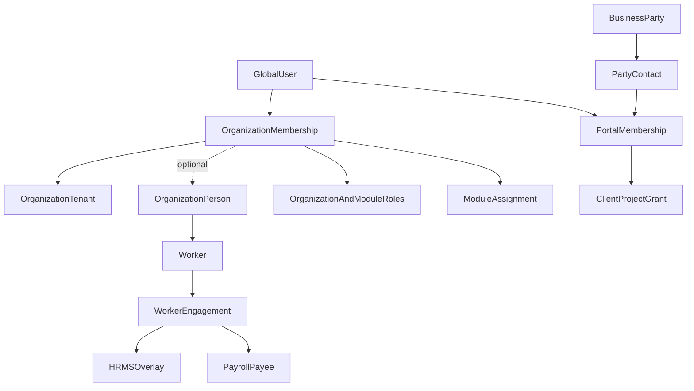

you should act as 50 experienced engineer and aritechure expert now your task is to check the task based on that plan and also recheck the repo 

here is my prompt 
user data has experienced or 20 years experienced are architect and product manager. 
you should check the entire repo before and you get an assumption that this is a product where HRMS, CRM, product management, knowledge base, payroll, everything is there so in this one platform, 
Now here is the problem
1.  i feel org is not needed i am not sure you should think this at a scale and based on that you should decide it and also real work usage and also how multiple products working based on all these you should decide because one person can invites to multiple workspaces and also he has his own workspaces so i feel there is need of orgs 
2. this platform can be created by anyone but that ownership can be transfered to the any one 
example :- if the CEO says that HR you should get into this platform and you should workspace in this platform and you should add all the people, then at the end of the day, that HR should transfer that ownership to the CEO, so similar cases for inventory, similar cases for data as well. similarly for the CTO or else any other roles as well 
3.  I feel present schemas are so messed because of AI based coding,  example:- products in project module and products in inventory are same AI but it actually two different things, but in reality there are two different modules so two different modules needed two different kind of schemas so that's a mistake and not just that there are so many like in fact team members in project management module and workspace module are different some people not every workspace member is a project member member so there are so many mistakes gonna happen so I want to redesign the schemas and also folders
I feel like I have to it's better maintain module level schemas and common schemas wherein user schemas, workspaces, workspaces members and building and some are common to every module.
4. suggest the best UI, UX, schemas and also role-based access and Here is my idea
 I feel this pattern like for example HR or else admin or else owner, can able to add the employee, but only admin/owner can able to add the module level admins example project module admin and this admin having all the powers for that module along with the owner and admin, and module level admins call it as the module admin having the to add a multple teams, members, remove, multiple admins they can make in that module etc all  the rules similarly for the HRMS as well multiple hr's and under that HR having multiple HR's and some are recurriment etc and based on that RBAC impementing simlarly for the other modules as well like inventory etc and in the inventory there are like delivery, admin, ware house admin etc multiple level were there in that level, 
but in the projects module you shuold provide a way for the clients to see the progress as well 

5. you should think about all the possible edgecase and you should make the schemas such that it should scalable, maintainable, easy accessable, future proof, and easy extend and best, efficient, db queries, and can serve the future all kind of requirements, and also easily scalable and future proof
 my another repo there is bad of storing the inivites in the org schema it is storing it in the array of invites format that is so bad every time update a invite it need to find org and then it should find the array of elements and then it should update it and it should again put into it so it is so bad instead maintain the invites in another seperate schema update is easy just fetch and update it 

CRM can be inventory products selling or else it can be other product selling as well and some customers of this platform only came for the CRM also so keep this in mind and you should design as well and i can sell the induvital modules as well 
in the modules employees also will be there so keep this in mind and only admin/ owners/ and module admins can able to see the screen were module level RBAC changing 
but not every company will be the HRMS will buy some companies will came only for the PM module and some are for the HRMS and some are for the Inventory so keep this as well in the mind 

i feel i need to give the proper names if it is orgs are behaving like workspace then don't use the workspace name at all and workspace or treated as the projects etc so many mistakes in the schema names as well and also in the shcmea id are using it is not correct fix that as well 

for this here is the plan given by the gpt 

---
name: platform-domain-redesign
overview: Final verified architecture for StreamlineOS as a module-optional, multi-organization SaaS with Product Management Workspaces. It retains the existing organization tenant backbone, separates identity/access/directory/workforce/parties, gives Product Management its own Workspace hierarchy, makes optional modules independently deployable, enforces tenant-safe authorization and ownership, standardizes ID semantics, and migrates through reversible compatibility waves.
todos:
  - id: schema-inventory
    content: Freeze duplicates; inventory entity ownership; ship missing migrations; fix billing orgId type.
    status: pending
  - id: organization-core
    content: Harden organizations and organization_members in place; lifecycle, exact ownership, invitations, active-organization session validation, and tenant-safe foreign keys.
    status: pending
  - id: people-model
    content: Introduce Directory and Workforce seams independent of login, HRMS, Payroll, and optional module assignments.
    status: pending
  - id: access-convergence
    content: Deny-by-default Organization Owner/Organization Admin/Module Admin hierarchy, grantability policy, immediate revocation, portal isolation, and retirement of legacy role paths.
    status: pending
  - id: module-boundaries
    content: Business Party foundation; independent CRM Accounts/Offers and Inventory Items/SKUs with fulfillment mappings; PM Workspace/Managed Product/Delivery Team/Project access; independent HRMS and Payroll over Workforce; Support/KB cleanup.
    status: pending
  - id: admin-ux
    content: Administration shell; People/Access; module Access screens; delivery vs org teams; client portal isolation.
    status: pending
  - id: retirement-hardening
    content: Dual-write retirement, reconciliation, BOLA/tenant/RBAC tests, rollback runbooks.
    status: pending
isProject: false
---

# StreamlineOS platform domain redesign — final verified architecture

## Verdict

**Keep Organization as the tenant.** Dropping the tenant boundary fails multi-organization SaaS: one person owns Organization A, is invited into Organization B, pays per organization, and enables different modules per organization. The current platform already has the right skeleton (`organizations` + `organization_members` M:N + switching + invitations + ownership transfer); it is **incorrectly implemented**, not unnecessary.

**Best architecture:** retain physical `organizations`, `organization_members`, and `org_id`; call the tenant **Organization** in product language; reserve **Workspace** exclusively for the Product Management bounded context; and separate bounded contexts that the current schema incorrectly merges:

- Identity: authentication, credentials, sessions.
- Tenancy: organizations, subscriptions, invitations, installed modules.
- Directory: organization-local people, including people without logins.
- Access: internal memberships, roles, grants, scopes, delegations.
- Portal Access: external authenticated contacts, never internal members.
- Workforce: workers and effective-dated employee/contractor engagements.
- Business Party: customers, vendors, partner organizations and contacts.
- StreamlineOS Modules: Product Management, CRM, Inventory, HRMS, Payroll, Accounting, Support, KB and others.

HRMS and Payroll are independent modules over Workforce. Product Management, CRM and Inventory work without HRMS.



---

## 1. Why Organization stays (scale + real usage)

| Scenario | Without Organization | With Organization |
|----------|-------------------|----------------|
| Freelancer creates an organization and a PM Workspace | Ambiguous ownership of data/billing | One tenant, one owner, transferable; PM work stays in a child Workspace |
| CEO asks HR to set up, then takes ownership | No safe handoff | Transfer ownership transaction |
| Same person in Agency A + Client B | Role/data collision on global user | Per-membership roles + profiles |
| CRM-only vs Inventory-only customers | Forced unused modules / shared schema pollution | Module enablement per organization |
| Billing / AI credits / seats | Cannot meter correctly | Per-organization subscription |

### Final organization decision

The Organization tenant concept is **required**. It is the security, billing, data-isolation and module-entitlement boundary. Removing it would make multi-organization membership, ownership transfer, per-customer billing, module installation and tenant-safe RBAC impossible to model correctly.

- Product/UI name: **Organization**.
- Internal physical persistence: keep `organizations`, `organization_members` and `org_id`.
- `Organization` means the top-level tenant containing People and enabled StreamlineOS Modules.
- `Workspace` means only a Product Management container inside an Organization.
- Organization hierarchy (departments, reporting lines, business units) is a separate Workforce capability and is not the tenant itself.
- A person may own or join multiple Organizations and have different roles in each.

Do not physically rename the established tenant FK graph merely to change terminology. Public DTOs and new route parameters should use `organizationId`; existing `org_id`, `orgId`, `/organization`, and other deployed contracts remain temporary compatibility names until consumers migrate.

### Product Management naming

- Rename the current **Projects** StreamlineOS Module label to **Product Management**.
- Canonical hierarchy: **Organization → PM Workspace → Managed Product / Delivery Team / Project**.
- A **PM Workspace** is the Product Management collaboration and access container; it is never the tenant.
- A **Managed Product** is an enduring product whose roadmap and outcomes are managed; it is not a StreamlineOS Module, CRM Offer, or Inventory Item.
- A **Delivery Team** is a PM Workspace-scoped team.
- A **Project** is a time-bounded delivery/change initiative inside a PM Workspace and may optionally belong to a Managed Product.
- **PM Workspace provisioning invariant:** an Organization has exactly one default PM Workspace if and only if Product Management is enabled for that Organization or it has retained Product Management data. Provisioning is transactional, idempotent, and unique on `(org_id, is_default)` with a partial unique index; it may be retried safely. Do not create a PM Workspace for a Product Management-disabled Organization with no PM data.
- During migration, create the default PM Workspace only for eligible Organizations (Product Management enabled or existing PM data). Backfill their projects, PM roster members, delivery teams, and applicable PM artifacts before `pm_workspace_id` becomes required. Enabling Product Management for a new or existing Organization provisions its one default workspace before the enablement transaction commits.
- Target source ownership:
  - backend schema folder: `backend/src/db/schema/product-management/`
  - backend module folder: `backend/src/modules/product-management/`
  - frontend feature folder: `frontend/features/product-management/`
  - module route namespace: `/product-management`
- Follow repository naming conventions: kebab-case folders and snake_case database identifiers. Never use the literal unseparated `productmanagement`.
- Existing physical `projects` / `project_*` tables and IDs remain during compatibility migration. New Product Management tables use clear descriptive names or a consistent `pm_*` prefix. Rename existing database tables only through a separately approved migration when the operational value exceeds the compatibility cost.
- Target new tables are `pm_workspaces`, `pm_workspace_memberships`, `pm_products`, and `pm_delivery_teams`; existing `projects`, `project_members`, and deployed project tables remain compatibility storage until a separately approved physical migration.
- Current `project_workspace_members` is an organization-wide Projects-module roster, not yet membership in a real PM Workspace. Add and backfill `pm_workspace_id` before treating or renaming it as `pm_workspace_memberships`.
- Keep existing backend `/projects` endpoints and `projects:*` permission keys as compatibility contracts during the first rename release. Add `/product-management` UI routes with redirects from `/projects`; API/permission renames, if still valuable, require a later versioned migration and aliases.
- Target system-role display name is **Product Management Admin**. Existing role slugs remain aliases until assignments are backfilled.

### Organization and module lifecycle
- Organization lifecycle is `ACTIVE → ARCHIVED → RESTORED` or `ACTIVE/ARCHIVED → PURGE_SCHEDULED → PURGED`. Archive is reversible and immediately invalidates internal and portal sessions, blocks new sessions, writes, module actions, scheduled work, outbound webhooks, and integration sync; retained reads are limited to Owner-approved recovery/admin paths.
- Restore is an explicit Owner-only transaction that reactivates the Organization and only module installations that were active at archive time (not modules independently disabled beforehand); it never replays expired invitations, revoked grants, completed jobs, or webhook deliveries. It invalidates access/session/module caches and records an audit event.
- Irreversible purge is delayed, separately authorized, cancelable until its deadline, and executed by a resumable idempotent worker. It verifies the Organization is still purge-scheduled and locked, destroys or anonymizes data according to retention policy, emits a final audit/outbox record, and never relies on a request thread for deletion.
- Disabling a module is reversible: deny new module operations and module background jobs, pause outbound webhooks/integration sync, retain module data for the configured retention window, and preserve the PM default workspace/data if PM was ever enabled. Re-enable restores the installation and resumes only explicitly safe jobs/syncs; it does not retroactively execute missed side effects.
- Module disable/purge and Organization archive/purge each use their own lifecycle timestamps, reason, actor membership, retention deadline, and job id. Foreign keys remain intact until the delayed purge worker reaches its approved deletion/anonymization phase.

---

## 2. Identity, People, membership and employment

The earlier `User → Membership → Employment` model was insufficient. A company may import employees before inviting them, pay workers who never log in, use contractors in projects, and give customers portal access. These are distinct facts.

### Identity
- `users` is global authentication identity only: credentials, MFA, platform status and preferences.
- Remove organization role, salary, bank, tax, department, manager and employment fields after consumers migrate.
- A user can have internal memberships in many organizations and external portal access elsewhere.

### Directory
- `organization_people` is the organization-local human directory. A person can exist without credentials.
- It holds safe contact/profile data and normalized emails/phones; sensitive HR/payroll data stays in those domains.
- A person may optionally link to one global user identity in the organization. Enforce tenant-safe uniqueness when linked.
- `organization_members` remains the canonical internal login/access relation and optionally links to `organization_people`.
- Do not create a third membership table. Convert `user_memberships` into a profile/placement compatibility source, then retire it.

### Workforce
- `workers` marks an organization person available as labour.
- `worker_engagements` models effective-dated employment or contracting: employer legal entity, worker type, start/end, status and primary engagement.
- A Worker belongs to exactly one Organization Person in the same Organization; an Organization Person has at most one Worker record. `workers` and `worker_engagements` carry `(org_id, id)` candidate keys and tenant-composite foreign keys.
- An Engagement has a half-open effective interval `[starts_on, ends_on)` (a null end is open-ended). A database exclusion constraint prevents overlapping active/planned engagements for the same Worker; cancelled/void engagements are excluded from that constraint.
- At most one active primary Engagement exists per Worker. A partial unique index enforces this, and a deferred validation trigger prevents a primary engagement from being outside its effective interval or from coexisting with another active primary. If business policy requires parallel legal engagements in future, it must be an explicit, separately modeled exception—not an overlap loophole.
- Engagement employer legal entity, manager, organization unit, location, and payroll/HR overlays must belong to the same Organization through composite FKs. No module assignment, payee, or PM assignment infers employment status.
- Org units, reporting lines and worker locations belong to Workforce, not tenancy core.
- Pre-hires, offline workers and contractors remain valid without an application membership.
- Existing `hr_people`/`hr_employments` should evolve toward this seam; do not regress their nullable-login capability.

### Module independence
- Product Management, CRM and Inventory may assign active internal memberships without HRMS.
- HRMS extends Worker/Engagement with recruitment, onboarding, leave, attendance, performance and employee relations.
- Payroll independently extends Worker/Engagement with payee, compensation, tax, bank, runs and payslips. **Payroll must not require the HRMS module entitlement.**
- Payroll administrators require memberships; payees do not require logins.
- Module tables store operational assignments, never duplicate employee/person masters.

### External people
- Customers, vendors and stakeholders are Business Party contacts, not employees.
- External authenticated users receive `portal_memberships`, not internal `organization_members`.
- Portal principals cannot receive internal organization/module roles.
- `portal_invitations` are separate from internal Organization invitations and include `(org_id, party_contact_id)`, normalized recipient email, audience (`CLIENT_PORTAL`), status, expiry, hashed one-time bearer token, inviter internal membership, accepted portal membership, and revocation metadata. Pending uniqueness is tenant-and-email-and-audience scoped.
- Accepting a portal invitation atomically validates token, expiry, recipient/contact and Organization state; links or creates the global User Account; creates/activates exactly one tenant-composite Portal Membership; consumes the invitation; rotates the portal session epoch; and emits audit/outbox records. It must never create an internal Organization Membership.
- Portal sessions carry an explicit portal audience and portal-membership/version reference. Internal session cookies/tokens and portal session cookies/tokens are audience-separated; guards reject the wrong audience before route authorization. Logout, suspension, contact unlink, invitation revocation, Organization archive, and grant revocation invalidate portal sessions immediately.
- `portal_memberships`, `portal_invitations`, and `project_client_grants` use `(org_id, id)` parent candidate keys and composite FKs. A client grant references the Portal Membership, Party Contact, Project, and PM Workspace through the same Organization; its lifecycle is `ACTIVE/SUSPENDED/REVOKED/EXPIRED`, with expiry and field-level allowlist validated server-side.

---

## 3. Bounded contexts and schema ownership

Keep a single Postgres database initially, but establish strict source ownership and one-directional dependencies:

- `identity/`: users, accounts, MFA, sessions and preferences.
- `tenancy/`: organizations, internal memberships, invitations, subscriptions and module installations.
- `directory/`: organization people and contact points.
- `access/`: roles, grants, delegations, groups, versions and module denials.
- `portal-access/`: external portal memberships and portal resource grants.
- `workforce/`: workers, engagements, legal entities, org units and reporting lines.
- `party/`: customer/vendor/partner organizations, people, contacts and addresses.
- Module folders: `product-management/`, `crm/`, `inventory/`, `hr/`, `payroll/`, `accounting/`, `support/`, `kb/`, etc.

Core/supporting contexts may be imported by modules. Optional StreamlineOS Modules must not import another optional module's schema. Cross-module behavior uses integration-owned mappings, stable IDs, service ports, outbox events and idempotent consumers.

### Canonical glossary (non-negotiable)
| Concept | Canonical name and target | Must not mean |
|---------|---------------------------|---------------|
| Tenant | **Organization**; physical compatibility: `organizations`, `organization_members`, `org_id` | Workspace |
| Global login identity | **User Account** / `users` | Person, member, employee, client |
| Internal tenant access | **Organization Membership**; compatibility table: `organization_members` | Person, PM Workspace membership, project membership |
| Tenant-local human directory | **Organization Person** / target `organization_people` | User Account or employee |
| Workforce participation | **Worker** + effective-dated **Engagement** | Organization Membership |
| Organizational hierarchy | **Organization Unit**; use a qualified **Organization Team** only when it is not a unit | PM Delivery Team |
| Product Management container | **PM Workspace** / target `pm_workspaces` | Organization tenant |
| Product Management access | **PM Workspace Membership** / target `pm_workspace_memberships` | Organization Membership |
| Product Management team | **Delivery Team** / target `pm_delivery_teams` | Organization Unit or generic Team |
| Enduring product managed in PM | **Managed Product** / target `pm_products` | StreamlineOS Module, CRM Offer, Inventory Item |
| Time-bounded PM initiative | **Project** / compatibility `projects` | PM Workspace or Managed Product |
| Enabled software capability | **StreamlineOS Module** / compatibility `org_modules` | Managed Product or commercial offer |
| Neutral counterparty | **Business Party** + Party Contact | Tenant Organization or CRM-owned master |
| CRM overlay on a party | **CRM Account** / target `crm_accounts` | Organization tenant |
| CRM sellable promise | **CRM Offer** / target `crm_offers` | Managed Product, Inventory Item, SKU |
| Inventory family/model | **Inventory Item** / target `inventory_items` | CRM Offer or Managed Product |
| Stocked inventory variant | **Inventory SKU** / target `inventory_skus` | Generic product or CRM Offer |
| External authenticated access | **Portal Membership** | Organization Membership |

The word **Workspace** is forbidden outside Product Management except when documenting a current compatibility symbol such as `workspace-switcher.tsx`, `workspace-onboarding`, or `project_workspace_members`. Those symbols describe legacy implementation and must not define the target domain vocabulary.

### Identifier convention (non-negotiable)

- Public/API names are descriptive: `organizationId`, `organizationMembershipId`, `personId`, `pmWorkspaceId`, `managedProductId`, `deliveryTeamId`, `projectId`, `partyId`, `crmAccountId`, `offerId`, `inventoryItemId`, and `skuId`. Do not introduce generic mutation parameters named only `id`.
- Keep `org_id` and current `orgId` contracts during compatibility, but new DTOs and route parameters use `organizationId`. Route params are descriptive (`[organizationId]`, `[pmWorkspaceId]`, `[projectId]`), never `[id]`.
- Long-term cross-domain and externally addressable aggregate identifiers use native PostgreSQL UUIDs: Organizations, User Accounts, Organization Memberships, Organization People, PM Workspaces, Managed Products, Delivery Teams, Projects, Business Parties, CRM Accounts, CRM Offers, Inventory Items, and Inventory SKUs.
- High-volume subordinate rows such as ledger entries, audit events, versions, and document lines may use `bigint GENERATED ALWAYS AS IDENTITY` when they are not cross-domain identifiers.
- The immediate migration standard is the current text Organization/User ID representation. Do not convert the core graph to native UUID until every existing value validates and every referencing column is mapped. Native UUID conversion is a separate whole-graph program using shadow columns and compatibility adapters.
- Every FK column exactly matches its parent type. Every tenant-owned parent exposes `UNIQUE (org_id, id)` during compatibility; every tenant child uses a composite FK `(org_id, parent_id)`.
- The migration design must include a **per-table composite-FK matrix** before constraints are introduced. For every table it records: child table/column, parent table/key, tenant ownership, existing and target ID types, required candidate key, composite FK definition, nullability, invalid-row repair/quarantine query, migration wave, validation state, and cutover owner. It is a release gate, not documentation added afterward.
- Global identities are the narrow exception: a global User Account may be referenced by global identity/session/auth tables through its global key. Once a relation is tenant-owned (membership, person link, invite acceptance, assignment, portal access, audit actor context, or module data), it also carries `org_id` and uses the applicable tenant-composite FK. A global `user_id` never proves tenant access.
- Every ID change requires an explicit **staged ID-transition matrix**: source column/type and semantic, shadow column/type, dual-write owner, backfill and checksum method, read precedence by release, compatibility DTO/route alias, FK/index/constraint sequence, rollback/forward-repair action, and the contract-removal release. No direct `ALTER TYPE`, mass cast, or ambiguous `id` alias is permitted in the live graph.
- Organization Memberships receive stable IDs. RBAC, module assignments, PM Workspace memberships, Delivery Team memberships, and Project memberships reference membership IDs rather than raw global user IDs.
- TypeScript contracts use distinct validated/opaque ID types generated from backend contracts so Organization, user, membership, account, offer, item, and project IDs cannot be interchanged accidentally.
- A table-local primary key may remain `id`; APIs, commands, events, route parameters, logs, and variables use the qualified semantic name.
- Existing mismatches are migration defects, not precedent: platform billing has integer Organization/user columns while canonical IDs are text; Accounting AR mixes numeric and string `orgId`; organization placement mixes integer and text hierarchy IDs; PM contracts conflate membership-row IDs with user IDs; and CRM uses tenant `orgId` beside counterparty `organizationId`.

### Business Party
- Inventory-only and Accounting-only customers still need customers/vendors without buying CRM.
- `business_parties` owns neutral counterparty identity; CRM adds pipeline/account metadata, Inventory adds vendor operations, Accounting adds receivable/payable attributes.
- Existing `clients`, `crm_organizations` and `inv_vendors` require a separate ADR and migration mapping; do not collapse them blindly. The target CRM name is `crm_accounts`, linked to `business_parties`; `crm_organizations` remains a compatibility name only.

### CRM ↔ Inventory
- CRM runs **fully without Inventory** (services, bundles, subscriptions, non-stock offers).
- Inventory runs **without CRM**.
- A CRM Offer is a commercial promise; an Inventory Item is the inventory family/model; an Inventory SKU is the physical stocked variant; a Managed Product is an independently managed PM aggregate.
- Use integration-owned `offer_fulfillment_components`: CRM Offer, Inventory SKU, quantity, UOM, status and effective dates. This supports bundles and many-to-many mappings.
- Quotes snapshot offer description/price. Fulfilment snapshots SKU components.
- Commercial acceptance emits an outbox event; Inventory explicitly reserves stock. Neither module writes the other's aggregate.

---

## 4. Ownership transfer (CEO / HR / CTO cases)

- A partial unique index on `is_owner` enforces only **at most one**, not exactly one. Use `organizations.owner_membership_id NOT NULL` as the authoritative owner pointer.
- Give memberships stable IDs and `UNIQUE (org_id, id)`. Add a deferred composite FK `(organizations.id, owner_membership_id) → organization_members(org_id, id)`.
- Bootstrap is a dedicated idempotent migration transaction, not a best-effort backfill: add the nullable pointer and stable public membership ID; deterministically repair/record ambiguous owner rows; lock each Organization and its candidate memberships with `FOR UPDATE`; create or select the canonical active creator membership; set the owner pointer; then validate the deferred composite FK and make the pointer non-null only after zero unresolved Organizations remain.
- The stable public Organization Membership ID is generated once and retained across compatibility adapters; never derive it from a user ID or mutable membership row order. A unique constraint prevents duplicate public IDs, and the bootstrap uses an idempotency marker/checksum so reruns cannot choose a different owner or create a second membership.
- Organization creation uses the same transaction: insert Organization, insert its active creator Organization Membership with stable public ID, set `owner_membership_id`, assign required immutable owner access state, and write audit/outbox events. Concurrent creation/repair paths lock the Organization row and use unique conflicts as a reread signal.
- Remove `is_owner` as an independent authority after migration; derive it by comparing membership ID to the Organization owner pointer.
- A deferred constraint trigger prevents the owner membership from becoming suspended, left or deleted before transfer.
- Transfer is one transaction:
  1. Lock Organization and both memberships; verify caller is still current owner.
  2. Target must be an active internal membership.
  3. Update the one owner pointer.
  4. Sync immutable OWNER/ADMIN system-role state if represented in RBAC.
  5. `bumpPermissionsVersion`; invalidate both users’ access/session caches.
  6. Audit both principals.
- Organization Owner-only: transfer, archive/restore Organization, schedule/cancel purge, billing ownership changes.
- Organization Admin has full administration **except** owner-only powers.
- Creator of an Organization is its initial owner; ownership may later transfer to another active Organization Membership through the same path.

---

## 5. RBAC hierarchy (verified privilege model)

### Principals
1. **Platform Admin** — separate control-plane principal; tenant support access is explicit, time-bounded and audited.
2. **Organization Owner** — derived only from the validated active owner membership; owner-only operations.
3. **Organization Admin** — immutable system role; non-owner organization administration and all enabled-module Access screens.
4. **Module Admin** (e.g. `PRODUCT_MANAGEMENT_ADMIN`, `HR_ADMIN`, `INVENTORY_ADMIN`, `CRM_ADMIN`) — immutable, module-scoped administrative role.
5. **Functional role** — recruiter, warehouse operator, delivery, payroll processor, sales rep, etc.
6. **Resource member** — project/delivery-team/object-specific access.
7. **External portal principal** — separate audience and explicit portal grants only.

### Module-level RBAC screen (your requirement)
- **Who can see / call module Access & Roles UI + APIs:** Organization Owner, Organization Admin, or that module’s Module Admin.
- **Everyone else:** 404/403 — UI hidden **and** backend `@RequirePermission` + service assert. Hiding alone is not enough.
- Module Admin **cannot**:
  - grant permissions outside their module’s allowlist
  - grant organization-wide `settings:manage`, ownership, billing, or other modules’ admin
  - escalate via custom roles (server validates permission-subset against caller’s grantable set)
- Organization Admin / Organization Owner appoint the first Module Admin; Module Admins may appoint more admins **within the same module**.

### Backend-owned grantability
Each permission descriptor includes module, resource/action, risk class, delegable flag, supported scopes, assignable role classes and whether resource binding is required.

- Organization Owner: all non-platform permissions; ownership changes only through transfer.
- Organization Admin: all non-owner organization and module permissions.
- Module Admin: only its module allowlist and ranks at or below Module Admin.
- Functional roles: no role-management ability by default.

Every role/grant/delegation write rejects unless:

1. requested permissions are a subset of the caller's grantable set;
2. target role rank is assignable by the caller;
3. target membership/resource belongs to the same Organization;
4. module is enabled and scope is supported;
5. reserved permissions are absent.

Unknown permission keys must be rejected, never silently filtered.

### Access discovery and catalog contracts
- The backend exposes discovery endpoints for the authenticated active Organization: effective permissions and scopes, enabled modules, visible permission descriptors, assignable system/custom role templates, caller grantable-permission subset, assignable role ranks, eligible active memberships, and typed resources available for a requested binding. The frontend renders only these server-filtered results; it does not ship an authoritative catalog or infer grantability.
- Discovery responses are audience- and module-aware, tenant-scoped, paginated where unbounded, and versioned by the Organization access version. A Module Admin receives only its module's descriptors, roles, principals, and resource types; portal sessions receive portal discovery only.
- The permission catalog remains backend-owned and is filtered server-side twice: once for discoverability and again at every write/authorize decision. A catalog entry being visible never itself grants the ability to assign or use it.

### Authorization pipeline
For every protected request:

1. Validate session and revocation.
2. Resolve Organization from server-controlled route/session context.
3. Load and validate active membership from the database.
4. Derive owner status from the owner pointer, never JWT `isOwner`.
5. Validate canonical module installation/entitlement.
6. Resolve active, non-expired direct and group roles.
7. Add valid time/module/scope-bounded delegations.
8. Load explicit denies at Organization, module, and typed-resource levels.
9. Evaluate deny precedence deterministically: an applicable explicit deny always overrides any role, delegation, group, or resource allow; only a narrowly defined Owner/platform break-glass policy may bypass it, is time-bounded, and is audited.
10. Union valid role/delegation allows through a documented scope lattice, then intersect them with typed resource membership/grants and object policy.
11. Audit privileged and deny decisions.

Plan quotas are enforced by domain services, not merged into permission resolution.

Retire `users.role`, legacy permission fallbacks, `organizations.enabled_modules` as an authority, and independently maintained frontend role defaults. Backend catalog and effective grantability are canonical.

### Tenant-safe references
- Role assignments reference `(org_id, membership_id)` and `(org_id, role_id)` through composite FKs.
- Module assignments reference memberships, not raw global user IDs.
- Replace polymorphic `group_type + group_id` and `resource_type + resource_id` when they cannot be FK-enforced: use typed assignment tables or a tenant-scoped principal/resource registry.
- Typed resource grants use a closed, cataloged resource kind plus a dedicated table per enforceable resource family (for example Project, Delivery Team, PM Workspace, CRM Account) with `(org_id, resource_id)` composite FKs, a subject Organization Membership or Portal Membership as allowed by that resource kind, permitted action/scope, expiry, and lifecycle. No free-form resource type/id pair can authorize access.
- Every tenant child references `(org_id, parent_id)`; a separate `org_id` plus global FK is insufficient.

### Revocation and cache model
- Add membership/session epoch plus Organization access version.
- Membership, owner, role, permission, delegation, deny, module and resource-grant mutations update relevant versions in the same transaction and publish invalidation.
- Guards still validate active membership; versioned JWTs are hints, not authorities.
- Remove fail-open frontend session restoration for authorization. Backend/session failure fails closed.

### Scopes
Do not expose `team` scope in UI until `applyScope` receives real team/org-unit IDs. Today `team` often behaves like `own` — treat as a known bug to fix before marketing hierarchical scopes.

### RLS ADR — defense in depth
- Adopt a written ADR before rollout. Application authorization remains mandatory; PostgreSQL RLS is a backstop for tenant-owned tables, not a replacement for guards/service BOLA checks.
- Each request transaction sets tenant and actor context with `SET LOCAL app.organization_id = ...` (and actor/audience fields as needed) only after session and membership validation. Policies use `current_setting(..., true)` with fail-closed UUID/text validation and include both `USING` and `WITH CHECK`.
- Tenant tables enable and `FORCE ROW LEVEL SECURITY`; the application runtime role is a non-owner role without `BYPASSRLS`, table ownership is held by a separate migration role, and privileged maintenance uses a tightly controlled role/path. Do not connect as a table owner for normal traffic.
- With pooled connections, context is transaction-scoped only: every database operation is inside an explicit transaction, `SET LOCAL` is issued before any tenant query, and no transaction is returned to the pool until commit/rollback. No session-level `SET`, prepared cross-tenant transaction reuse, or background job query may run without explicit tenant context.
- Roll out by table group after composite FKs are validated. Tests must prove cross-tenant reads/writes fail, missing/invalid GUCs fail closed, `WITH CHECK` blocks cross-tenant inserts/updates, pooled connection reuse cannot leak context, and owner/runtime role configuration cannot bypass policy.

---

## 6. Product Management + client progress

### Target hierarchy

```text
Organization
  → PM Workspace
      → Managed Product
      → Delivery Team
      → Project
```

- Every PM Workspace belongs to exactly one Organization.
- Every eligible Organization (Product Management enabled or retaining PM data) receives one default PM Workspace during migration; ineligible Organizations receive none until Product Management is enabled.
- A Managed Product, Delivery Team, and Project belongs to one PM Workspace.
- A Project may optionally reference one Managed Product; a Managed Product may have many Projects.
- PM Workspace Membership references an active Organization Membership, never a raw User Account.
- The current `project_workspace_members` roster is organization-scoped compatibility data until it is backfilled with a real `pm_workspace_id`.

Layered access (teach in UI):

```text
Organization Membership
  → PM Workspace Membership
    → Delivery Team Membership
      → Project Membership / typed resource grant
        → Effective PM access
```

Client progress uses a dedicated portal audience, route/layout and APIs—not the internal Product Management shell. A portal membership links a global user to a Business Party contact. `project_client_grants` supports multiple contacts per client/project and field-level visibility. Internal APIs reject portal principals even if malformed internal roles exist.

### Outbox / inbox operational contract
- Every transaction that changes an aggregate and requires an asynchronous consequence writes its domain event into a tenant-scoped transactional outbox in the same database transaction. Events include immutable event ID, aggregate type/id, Organization ID, schema version, causation/correlation IDs, actor/audience metadata, payload version, occurred-at, and delivery state.
- The publisher claims rows with locking/leases, publishes at-least-once, retries with bounded exponential backoff, records errors, and exposes dead-letter/replay operations. Ordering is guaranteed only per aggregate key; consumers cannot assume global ordering.
- Every consumer has an inbox/deduplication record keyed by producer/event ID and performs its state change and inbox completion atomically. Handlers are idempotent, tenant-context scoped, validate payload version/audience/module lifecycle, and safely ignore stale superseded events.
- Module disable/archive/purge, webhook delivery, integration synchronization, access invalidation, and PM provisioning events all honor lifecycle fences: workers check current Organization/module state immediately before side effects and never emit/retry a side effect for an archived, disabled, or purged target unless an explicit recovery policy permits it.

---

## 7. UX / Administration IA

```text
[Organization Switcher: name + my role + plan]
[Modules…] [Administration]

Administration
├── Organization (general, security, danger)
├── People (directory — no HRMS required)
│   ├── Person: Profile | Worker/engagement (when applicable) | Module assignments
│   └── Membership: Login/status | Access | Sessions
├── Access (roles, assignments, permissions overview, delegations)
│   └── Full Organization Access: Organization Owner / Organization Admin only
├── Modules (enable/disable)
├── Billing
└── Security & compliance

Per StreamlineOS Module (only when enabled)
├── …operational nav…
└── Module Access (Organization Owner / Organization Admin / Module Admin only)
    module roles, assignments, module admins

Product Management
├── PM Workspace switcher
├── Managed Products
├── Delivery Teams
└── Projects
```

Terminology: Organization for the tenant everywhere; Workspace only inside Product Management; Delivery Teams vs Organization Units; PM Workspace Membership ≠ Organization Person ≠ Organization Membership.

People/membership administration uses organization-wide keys such as the existing compatibility permissions `settings:members:*`, **not** `hr:employees:view`, so Product Management-only, CRM-only and Inventory-only organizations can invite. HR employment data remains separately permissioned and hidden when HRMS is disabled.

### Route and contract alias matrix
- Before any rename, create a route alias matrix for every UI and API route. Each row states legacy route, canonical route, route parameter mapping, nested parameter preservation, query-key preservation/translation, method and response compatibility, audience/auth guard, redirect/alias behavior, telemetry, validation owner, deprecation release, and removal gate.
- Aliases preserve all validated nested identifiers and query parameters exactly unless the matrix explicitly maps a renamed key; they never drop `organizationId`, `pmWorkspaceId`, `projectId`, pagination, filters, sort, tab, or return URL. Redirect construction uses a typed route builder and allowlisted query schema, not string concatenation.
- Both legacy and canonical parameters are independently Zod-validated, resolved server-side to the same tenant-composite object, and rejected on mismatch. An alias must not turn an invalid/missing nested parent into a broader Organization lookup or permit a portal audience to reach an internal route.
- `/projects` to `/product-management` and legacy Organization-compatible routes remain aliases until telemetry proves all supported consumers have migrated; compatibility redirects preserve nested paths and validated query strings.

---

## 8. Edge cases the design must win

| Edge | Rule |
|------|------|
| Sole owner leaves | Block until transfer |
| Transfer to non-member | Reject |
| Multiple owners from bad data | Migration repair + unique constraint |
| Stale JWT after switch | Guard re-validates membership + active Organization from DB |
| Removed/suspended member retains JWT | Membership epoch/version rejects next request |
| Module Admin crafts role with `settings:manage` | Reject at write |
| Module Admin delegates beyond own module | Reject by backend grantability descriptor |
| CRM-only Organization | Inventory tables unused; CRM Offers remain independent |
| Inventory SKU unpublished | Fulfilment mapping inactive; CRM offer lifecycle is independent |
| Enable HRMS later | Extend existing Worker/Engagement records; no rewrite of module assignments |
| Payroll without HRMS | Supported through Workforce; HRMS UI/entitlement remains off |
| Worker has no login | Person/worker/payroll remains valid without membership |
| Candidate/pre-hire | HR person remains valid without membership or active engagement |
| Client user hits internal `/product-management` or legacy `/projects` | Portal layout only; deny internal APIs |
| Same user is employee in A and client in B | Separate internal membership and portal membership contexts |
| Invite JSON-on-org | Forbidden; row updates on `organization_invitations` |
| Global `users.role` for multi-organization access | Forbidden; Organization Membership-scoped roles only |
| Duplicate `user_memberships` vs `organization_members` | One canonical membership; placement is profile/org-unit, not second join |
| Existing Organization enables Product Management | Create one default PM Workspace and backfill existing PM data into it |
| “Product” appears without a qualifier | Reject; use Managed Product, CRM Offer, Inventory Item/SKU, or StreamlineOS Module |

---

## 9. Delivery program — independent reversible waves

Do not execute this as one refactor or seven coupled phases. Each authority follows:

`expand schema → tolerant backend → idempotent backfill → shadow-read/compare → switch backend reads → switch UI → stop legacy writes → observe two releases → contract`

Database recovery uses forward repair; destructive down migrations are not the primary rollback.

### Wave 0 — Migration control plane
- Freeze new tenant, person, role, module, Managed Product, CRM Offer, Inventory Item/SKU and PM Workspace authorities.
- Reconcile Drizzle schema, migration journal/snapshots and every deployed database.
- Add explicit migrations for `project_workspace_members` and `project_team_assignments`; eliminate production `db:push`.
- Inventory every tenant/user/membership/domain ID type, semantic owner, orphan and cross-tenant mismatch—not only `billing_profiles`.
- Classify every ambiguous `id`, `orgId`, `organizationId`, `productId`, `memberId`, and `teamId` contract before introducing aliases.
- Establish reconciliation queries, telemetry, feature flags and compatibility duration.

Exit: clean and existing databases reach identical head without push; no unexplained drift.

### Wave 1 — Tenant invariants
- Keep `organizations` and `organization_members`; do not create Workspace-named tenant replacement tables.
- Add stable membership ID/lifecycle (`INVITED/ACTIVE/SUSPENDED/LEFT`) and timestamps.
- Repair ownerless/multi-owner data manually where provenance is ambiguous.
- Run the owner-pointer bootstrap migration transaction with stable public membership IDs, deterministic repair ledger, row locks, idempotency marker, deferred tenant-composite FK, and owner-membership lifecycle constraint.
- Upgrade invitations to explicit status lifecycle, normalized email, hashed bearer token, inviter membership and accepted membership references.
- Add Organization archive/restore/purge-scheduled lifecycle, retention deadlines, cache invalidations, and resumable purge-worker controls.
- Correct every Organization creation/transfer/removal/switch path.
- Validate membership on every guarded request and revoke stale context.

Exit: exactly one valid owner per active Organization; suspended/left members fail immediately; concurrent transfer tests pass.

### Wave 2 — Module authority
- Make lowercase `org_modules` canonical; backfill from `organizations.enabled_modules`.
- Add missing tenant FKs and actor membership references.
- Shadow-compare all module reads; migrate sessions, guards, sidebars and billing.
- Keep the array as a temporary projection, then stop legacy writes after parity.
- Define the StreamlineOS Module dependency graph: Workforce supporting capability is always available; HRMS and Payroll are independent entitlements.

Exit: one module result across guard/session/UI/billing; zero unexplained mismatches.

### Wave 3 — Directory and Workforce seams
- Introduce/evolve `organization_people`, Workers and effective-dated Engagements.
- Link internal membership optionally to Person.
- Backfill from `user_memberships`, `users`, `hr_people` and employments with ambiguity quarantine.
- Preserve old API fields through DTO adapters; remove organization/HR fields from `users` only in contract releases.
- Keep pre-hires, offline workers and payees without logins valid.

Exit: per-Organization counts reconcile; People works without HR permission; HRMS-disabled and Payroll-only flows pass.

### Wave 4 — Tenant-safe foreign keys
- Standardize current IDs on text first; native UUID conversion is a separate future program.
- Publish and approve the per-table composite-FK migration matrix and staged ID-transition matrix before any production constraint/cutover.
- Add `UNIQUE(org_id,id)` to tenant parents and composite FKs from every tenant child, applying the explicit global-identity exception only to global auth/session tables.
- Convert assignment actor references from raw user IDs to membership/person IDs as appropriate.
- Add stable Organization Membership IDs and descriptive DTO aliases before changing assignment reads.
- Repair platform billing and Accounting AR Organization ID mismatches through shadow text columns, dual-write, reconciliation, validated FKs, read cutover, and later contraction.
- Use `NOT VALID` then `VALIDATE CONSTRAINT` for large tables; quarantine invalid rows.
- Validate RLS connection/transaction feasibility now; roll enforcement by table group later.

Exit: database cannot represent cross-tenant parent/child, role, principal or resource relationships.

### Wave 5 — RBAC correctness releases
1. Active membership + role expiry + revocation versions.
2. Remove global `users.role` authorization fallback.
3. Introduce immutable Organization Admin / Module Admin roles and module Access permissions.
4. Enforce grantable permission subsets and role ranks.
5. Add delegations only after possession, time, module and scope validation.
6. Add typed resource grants only after resource/tenant/principal validation.
7. Enforce explicit deny precedence across Organization, module, and typed-resource levels.
8. Ship server-filtered access discovery/catalog endpoints and replace frontend policy catalogs with backend catalog/effective grantability.

Exit: privilege-escalation, expiry, revocation, scope and cross-tenant tests pass; legacy fallback telemetry is zero before removal.

### Wave 6 — Business Party
- Define neutral party/contact/address contracts.
- Map existing CRM clients/organizations, Inventory vendors and Accounting counterparties without destructive merging.
- Introduce `crm_accounts` as the target CRM overlay name; keep `crm_organizations` as a compatibility contract while consumers migrate.
- Migrate each consumer behind adapters independently.

Exit: Inventory/Accounting can use counterparties without CRM; CRM remains an optional overlay.

### Wave 7 — One independent project per module boundary
- CRM Offer ↔ Inventory SKU fulfilment components and outbox workflow; do not create a shared generic `products` table.
- Product Management hierarchy and migration:
  1. Create `pm_workspaces`.
  2. For each Organization with Product Management enabled or retained PM data, idempotently create exactly one default PM Workspace; create none for ineligible Organizations.
  3. Add nullable `pm_workspace_id` to existing projects, PM roster rows, Delivery Teams and applicable PM aggregates.
  4. Backfill all existing PM data into the default PM Workspace.
  5. Introduce `pm_workspace_memberships` referencing Organization Membership IDs.
  6. Introduce `pm_products` for Managed Products and optional Project-to-Managed-Product association.
  7. Validate tenant-composite FKs, switch reads, then require `pm_workspace_id`.
  8. Preserve `/projects`, `projects:*`, `project_workspace_members`, and existing numeric IDs as compatibility contracts until versioned consumers migrate.
- Product Management Delivery Teams, Project Memberships and client grants reference the PM Workspace and stable Organization Membership IDs.
- Payroll payees over Workforce without HRMS dependency; reconcile legacy/new payroll separately.
- Support source ownership cleanup behind stable exports; physical migration only if contracts change.
- KB and workflow convergence each receive their own ADR and migration.

Each project has its own schema/API/RBAC/backfill/UI/rollback acceptance criteria.

### Wave 8 — Administration and portal UX
- Ship only after backend contracts stabilize.
- Add Administration rail, People/Access split and per-module Access screen.
- Preserve old routes with redirects/compatibility pages.
- Rename tenant UI to Organization, including the current switcher/onboarding/settings surfaces, without physically renaming the tenant table.
- Use Workspace only in Product Management and add the PM Workspace switcher after the backend hierarchy is canonical.
- Isolate portal shell, session audience and APIs as a separate release.
- Add the portal invitation/session/grant lifecycle, composite FKs, audience tests, and route alias validation before opening portal routes.

Exit: old/new frontend versions work; UI gates match backend; portal principals cannot reach internal surfaces.

### Wave 9 — Contract and retirement
- Stop legacy writes, observe at least two normal releases, verify checksums/audit/zero legacy reads.
- Remove legacy tenant-as-Workspace labels, ambiguous DTO aliases, and old route names only after all supported consumers migrate.
- Treat native UUID conversion as a separate whole-graph program after semantic naming and FK types are stable.
- Drop small groups of obsolete columns/tables with explicit approval windows.
- Test backup restore and forward-repair runbooks.
- Purge only after retention deadlines, lifecycle fences, outbox/inbox drain policy, legal-hold checks, and an approved irreversible-purge runbook.

---

## 10. Critical existing files

- [backend/src/db/schema/auth.ts](backend/src/db/schema/auth.ts)
- [backend/src/db/schema/user-management.ts](backend/src/db/schema/user-management.ts)
- [backend/src/db/schema/organization.ts](backend/src/db/schema/organization.ts)
- [backend/src/db/schema/access.ts](backend/src/db/schema/access.ts)
- [backend/src/db/schema/billing.ts](backend/src/db/schema/billing.ts)
- [backend/src/db/schema/project-teams.ts](backend/src/db/schema/project-teams.ts)
- [backend/src/db/schema/hr/core-people.ts](backend/src/db/schema/hr/core-people.ts)
- [backend/src/modules/organization/organization.service.ts](backend/src/modules/organization/organization.service.ts)
- [backend/src/modules/access/access.service.ts](backend/src/modules/access/access.service.ts)
- [backend/src/modules/access/authorize.ts](backend/src/modules/access/authorize.ts)
- [backend/src/modules/access/entitlements.service.ts](backend/src/modules/access/entitlements.service.ts)
- [backend/src/modules/billing/plan-entitlements.constants.ts](backend/src/modules/billing/plan-entitlements.constants.ts)
- [backend/src/modules/rbac/permissions.constants.ts](backend/src/modules/rbac/permissions.constants.ts)
- [frontend/components/layout/header/workspace-switcher.tsx](frontend/components/layout/header/workspace-switcher.tsx) — current Organization switcher compatibility symbol; target rename after imports migrate
- [frontend/components/layout/sidebar/sidebar-nav-items.ts](frontend/components/layout/sidebar/sidebar-nav-items.ts)
- [frontend/app/(authenticated)/users](frontend/app/(authenticated)/users)
- [frontend/app/(authenticated)/settings](frontend/app/(authenticated)/settings)
- [frontend/app/(authenticated)/projects/portal](frontend/app/(authenticated)/projects/portal)

---

## 11. Acceptance criteria

- Product Management-only, CRM-only, Inventory-only and Payroll-without-HRMS Organizations are supported.
- Payroll and HRMS both consume Workforce contracts but neither module entitlement requires the other.
- People/workers/payees can exist without login accounts; memberships can exist without HR employment.
- Module Access screens and APIs visible/callable only by Organization Owner, Organization Admin, or that Module Admin.
- Module Admin cannot escalate outside module permission allowlist.
- Exactly one owner is structurally enforced; transfer is atomic, concurrent-safe and immediately revokes former-owner powers.
- CRM works without Inventory; Inventory publish is optional and explicit.
- User ≠ Person ≠ Membership ≠ Worker ≠ Engagement ≠ Module assignment ≠ Party contact ≠ Portal principal.
- No invite arrays on the Organization row; invitations are rows.
- Invitation bearer tokens are hashed; normalized pending-email uniqueness and explicit lifecycle are enforced.
- No authorization comes from stale JWT role/organization/owner claims alone.
- Every tenant-owned relation is tenant-composite and FK-enforced where technically possible.
- Module state has one authority (`org_modules`); legacy arrays are projections only during migration.
- External portal principals cannot call internal module APIs.
- RLS feasibility is proven during foundation; enforcement can roll out later.
- All production schema changes are migrated (no push-only critical tables).
- Organization is the only tenant term; Workspace appears only inside Product Management or as an explicitly marked legacy compatibility symbol.
- Every eligible Organization (Product Management enabled or retaining PM data) receives exactly one default PM Workspace before its PM Workspace FKs become required; ineligible Organizations receive none until enablement.
- The hierarchy Organization → PM Workspace → Managed Product / Delivery Team / Project is tenant-composite and FK-enforced.
- Managed Product, CRM Offer, Inventory Item, Inventory SKU, and StreamlineOS Module remain distinct aggregates and vocabulary.
- Public contracts use descriptive ID names; FK types match their parents; Organization Membership IDs replace raw user IDs in assignments.
- Owner bootstrap is transactionally locked and idempotent, uses a stable public Organization Membership ID, and cannot leave an Organization without a valid active owner.
- Archive/restore is reversible; purge is delayed, retention-governed, lifecycle-fenced, resumable, and irreversible only after its approved deadline.
- The composite-FK migration matrix and staged ID-transition matrix cover every affected table/contract, with the global-identity exception explicitly documented.
- Portal invitations, memberships, sessions, grants, audience guards, and lifecycle invalidation are separate from internal membership and composite-FK-enforced.
- Workforce enforces one Worker per Organization Person, non-overlapping active/planned Engagements, and at most one active primary Engagement.
- RLS ADR tests prove transaction-local tenant GUCs, FORCE RLS, non-owner runtime access, fail-closed policies, and pool-safe context isolation.
- Module enable/disable/archive/purge behavior fences module jobs, webhooks, integration sync, retention, and PM provisioning.
- Server-filtered role/access discovery exposes only caller-grantable catalog entries, roles, principals, and typed resources.
- Outbox/inbox handling is transactional, at-least-once/idempotent, versioned, tenant-scoped, lifecycle-fenced, and operationally replayable.
- Explicit Organization/module/typed-resource denies override all ordinary allows; typed resource grants are FK-enforced and non-polymorphic.
- Legacy route aliases preserve and validate nested parameters and query state under the route alias matrix.

---

## What this rejects (anti-patterns)

- Removing Organization tenancy / collapsing everything onto `users`.
- Calling the tenant Workspace or using Workspace outside Product Management except for documented compatibility symbols.
- Making HRMS mandatory for People or module assignments.
- Making Payroll entitlement depend on HRMS instead of shared Workforce contracts.
- Shared generic `products` table forcing Managed Product, CRM Offer and Inventory Item/SKU coupling.
- Letting CRM own neutral customers/vendors needed by other modules.
- Treating login memberships as every employee, payee, contractor or external contact.
- Module Admin = full Organization Admin.
- Trusting UI-only RBAC screen hiding.
- Polymorphic or raw-user references that cannot prove tenant consistency.
- JSON invite arrays / global `users.role` as auth source.
- Physical renaming of the established Organization tenant graph merely to change UI terminology.
- Big-bang ID conversion or route/table rename without shadow columns, aliases, dual-read comparison, and consumer compatibility.
- Big-bang rewrite without dual-read migration phases.


Verify the design and plan, you should act as the 50 years experienced Architechure expert and also full stack developer  come with the best one 


this is what it is generated now your task is to Verify the design and plan, you should act as the 50 years experienced Architechure expert and also full stack developer  come with the best one and also check all the points covered or not, check thrice 