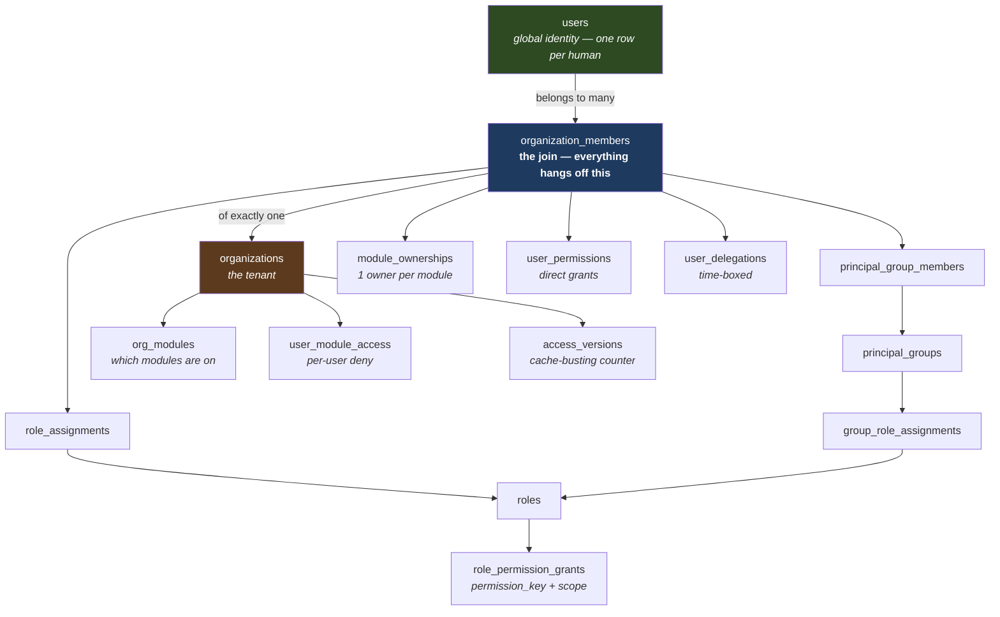
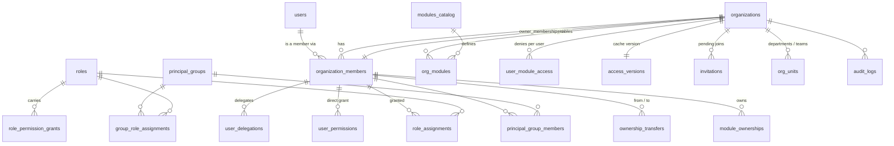
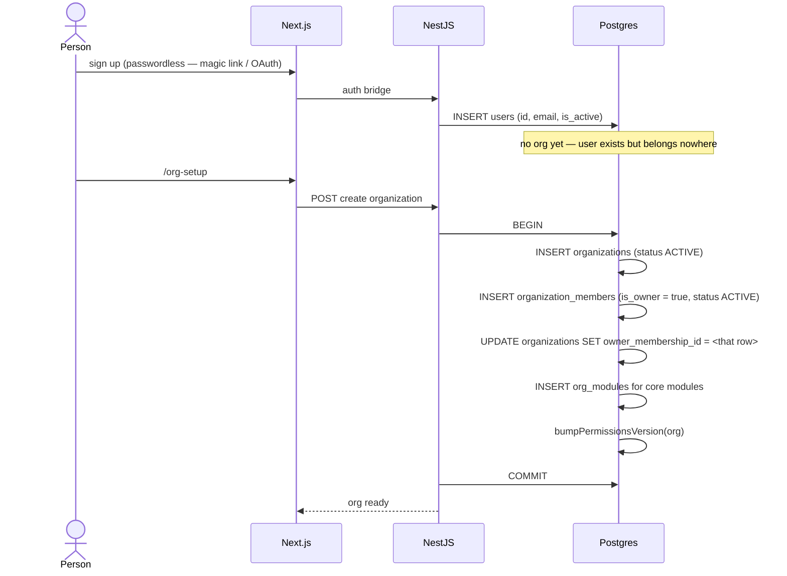
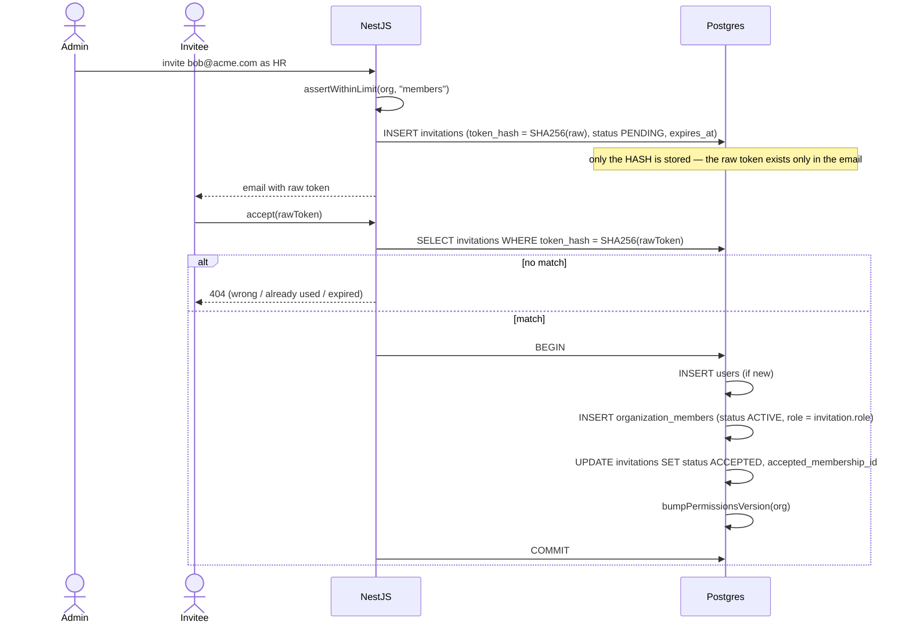
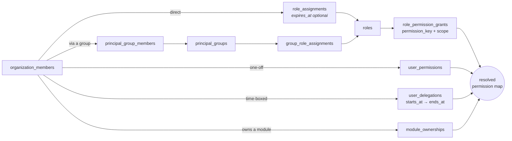
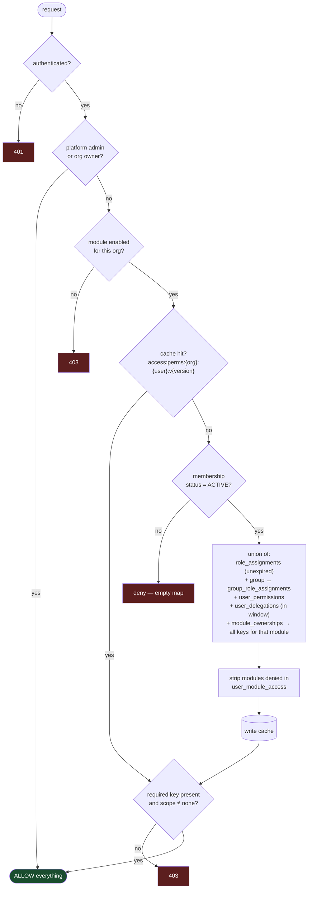
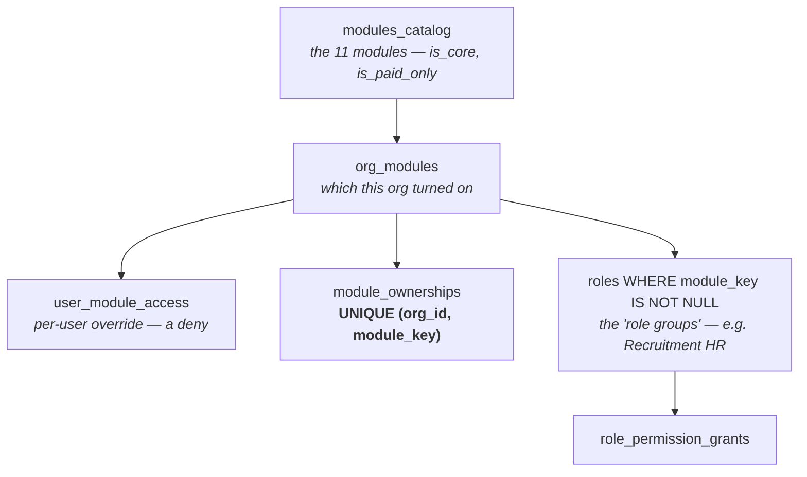
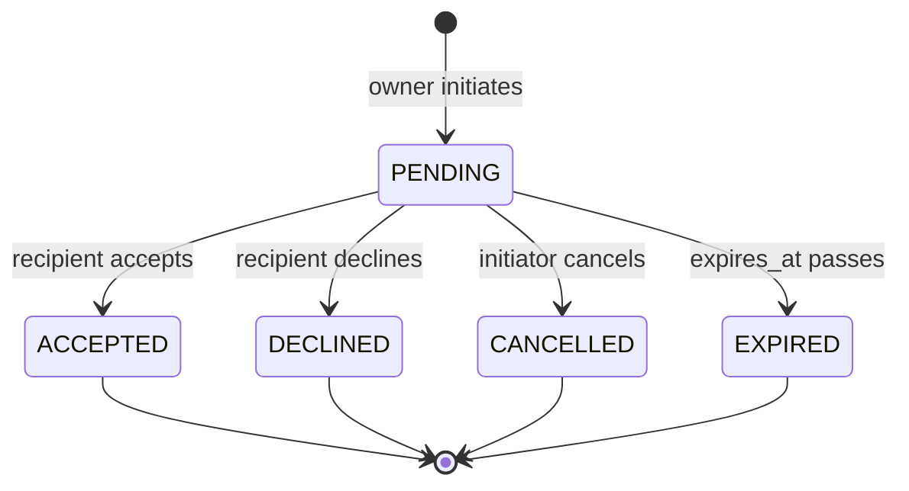

# StreamlineOS — Identity, Org, RBAC & Module Access

> Verified against the live schema on 2026-07-29 (83 migrations, 775 tables).
> Every table and column named here was read from `information_schema`, not from memory.

---

## 1. The whole thing in one picture

**The one thing to internalise:** `organization_members` is the hub. A person is `users`. A tenant is
`organizations`. *Everything about what someone can do* keys off their **membership row**, never off
their global user id. That is what makes multi-org membership safe.

---

## 2. Entity map

---

## 3. Journey — a brand-new user creates an organization

Two invariants set here, both enforced by the database:

| Invariant | Enforced by |
|---|---|
| An org has **at most one** owner | `uniq_org_members_single_owner` — partial unique on `(org_id) WHERE is_owner = true` |
| An org **always points at** its owner | `organizations.owner_membership_id` is `NOT NULL` |

Owner rows can never be removed, suspended, demoted or left — all four paths refuse until ownership
is transferred.

---

## 4. Journey — someone is invited

**`invitations`** stores: `email`, `token_hash`, `org_id`, `role`, `invited_by`, `expires_at`,
`status` (`PENDING|ACCEPTED|DECLINED|EXPIRED|REVOKED`), `inviter_membership_id`,
`accepted_membership_id`, `declined_at`, `revoked_at`, `revoked_by_membership_id`.

A partial unique index blocks a second *pending* invite to the same email in the same org.

---

## 5. The three ways a permission reaches a person

All sources **union** together — allow wins, there are no deny rules. Where two sources grant the
same key with different scopes, the **broadest** scope wins.

**`data_scope`** is `all | team | own | none` — it answers *"whose rows?"* alongside *"which action?"*.

---

## 6. The hot path — resolving permissions on a request

This runs on essentially every authenticated request.

**Deny by default.** A member with no role, no group and no direct grant can reach nothing.

**Cache invalidation.** `access_versions.permissions_version` is bumped *inside the same transaction*
as any permission change. Because the version is part of the Redis key, a bump instantly orphans every
cached entry for that org — no explicit delete needed.

---

## 7. Module access — the shared model

**9 access-managed modules:** `hr` · `crm` · `build` · `accounting` · `inventory` · `support` ·
`surveys` · `payroll` · `sign`

**2 core modules, common to everyone:** `kb` · `chat` — `is_core = true` in `modules_catalog`, so they
are *not* access-managed and have no per-module RBAC page.

### Who can do what within a module

| Tier | Reach | Cannot |
|---|---|---|
| Org owner / platform admin | everything, everywhere | — |
| Org admin | everything | mutate the **org owner** |
| **Module owner** (exactly 1 per module) | all keys in that module | nothing in other modules |
| **Module admin** | all keys in that module | mutate the **module owner**, transfer ownership |
| Module member | exactly the union of their role groups | everything else |
| No group | nothing | — |

Seniority is `ROLE_RANK`: Owner `0` → Org Admin `10` → Module Admin `20` → module custom `30` →
functional `40`. **Lower number = more senior.** You can never create or modify a role at or above
your own rank, and never grant a permission you do not hold.

### `roles` doubles as the role group

One table serves both org-wide roles and module role groups — `module_key` is what distinguishes them.

| Column | Meaning |
|---|---|
| `module_key` | `NULL` = org-wide role · set = module role group |
| `rank` | seniority ladder above |
| `is_system` | seeded — immutable and undeletable, but duplicable |
| `version` | optimistic-lock token — see §9 |
| `description`, `created_by` | provenance |

Unique on `(org_id, COALESCE(module_key,''), LOWER(name))` — so two "Recruitment HR" groups cannot
coexist in one module, **case-insensitively**.

---

## 8. Ownership transfer — a consent handshake

Ownership is never pushed onto someone. It is offered and must be accepted.

On **accept**, in one transaction: lock both membership rows `FOR UPDATE` → promote the recipient →
demote the previous owner → bump the permissions version → bust both users' caches.

`ownership_transfers` stores `scope` (`ORGANIZATION` | `MODULE`), `module_key`, `from_membership_id`,
`to_membership_id`, `status`, `initiated_at`, `responded_at`, `expires_at`, `reason`.

**Break-glass:** a platform-admin-only `PUT /ownership/org/owner` exists for the dead-owner case (the
owner left and can never accept anything). It is rate-limited to 10/hour and always audited.

---

## 9. Concurrency, caching and audit

| Concern | Mechanism |
|---|---|
| Two admins editing one role group | `roles.version` compare-and-swap — `UPDATE … WHERE version = ?`; 0 rows → **409**, never a silent overwrite |
| Stale permissions after a revoke | version is part of the Redis key; bump inside the write transaction. In-process caches are cleared on bump — **caveat: other replicas can lag up to 5s** |
| Cross-tenant leakage | every query and every cache key carries `org_id`; composite `(org_id, id)` FKs make a cross-tenant link unrepresentable |
| Who changed what | `audit_logs` — `action`, `actor_user_id`, `target_id`, `target_type`, `metadata` (incl. `moduleKey` and permission add/remove diff), `ip_address` |
| Abuse | ownership transfer 5/hr · force-set 10/hr · group mutations 30/min |

---

## 10. Table reference — what each one stores

### Identity (global — no `org_id`, by design)

| Table | Stores |
|---|---|
| `users` | the human: email, name, profile, `is_platform_admin`, `last_active_org_id` |
| `accounts`, `sessions`, `user_sessions` | OAuth links and live sessions |
| `magic_link_tokens`, `email_otp_codes`, `mfa_backup_codes`, `devices` | passwordless auth material |

### Tenancy

| Table | Stores |
|---|---|
| `organizations` | the tenant: name, slug, branding, `owner_membership_id`, status, purge schedule |
| `organization_members` | **the hub** — `user_id`, `org_id`, `role`, `is_owner`, `status` (`INVITED\|ACTIVE\|SUSPENDED\|LEFT`), lifecycle timestamps |
| `invitations` | pending joins, hashed tokens |
| `org_units` / `org_unit_members` | departments, teams, branches — self-referencing hierarchy via `parent_id` |

### Authorization

| Table | Stores |
|---|---|
| `roles` | roles **and** module role groups (`module_key`), with `rank`, `version`, `is_system` |
| `role_permission_grants` | which `permission_key` at which `scope` a role carries |
| `role_assignments` | membership → role, optionally expiring |
| `principal_groups` / `principal_group_members` / `group_role_assignments` | group-based assignment |
| `user_permissions` | direct one-off grants |
| `user_delegations` | time-boxed hand-off (`starts_at` → `ends_at`, revocable) |
| `permissions` | DB mirror of the static catalog: `name`, `resource`, `action`, `module_key`, `risk_class`, `is_delegable` |
| `access_versions` | the per-org cache-busting counter |

### Modules

| Table | Stores |
|---|---|
| `modules_catalog` | the 11 modules — `is_core`, `is_paid_only`, `status` |
| `org_modules` | which modules this org enabled, when, by whom |
| `user_module_access` | per-user **deny** override |
| `module_ownerships` | exactly one owner per `(org, module)` |
| `ownership_transfers` | the handshake |

---

## 11. Things that will trip you up

- **`modules` is not the module catalog.** `modules` is a *Build*-module concept (a module inside a
  project). The RBAC one is **`modules_catalog`**. Different worlds, unfortunate name collision.
- **`users.role` is legacy.** It is written once when a brand-new user accepts an invite. Nothing
  reads it for routing or authorization any more — per-org role lives on `organization_members.role`,
  and real authorization comes from `role_assignments`.
- **Permission format is `<module>:<resource>:<action>`** — three colon-separated lowercase segments,
  e.g. `hr:leaves:approve`. The `resource` segment is the "page" the UI groups by.
- **Owner and admin bypass everything.** When testing a permission gate, test as a plain member —
  an owner will pass regardless of whether the gate works.
- **A frontend-only permission key is invisible, not loud.** `useCan` returns `false` forever for a key
  the backend does not know. Both catalogs must agree; drift is currently **0** and should stay there.
- **The frontend never decides authorization.** Hiding a button is UX. Every mutating call is
  re-verified server-side. Next.js middleware is *not* an authorization boundary (CVE-2025-29927).
