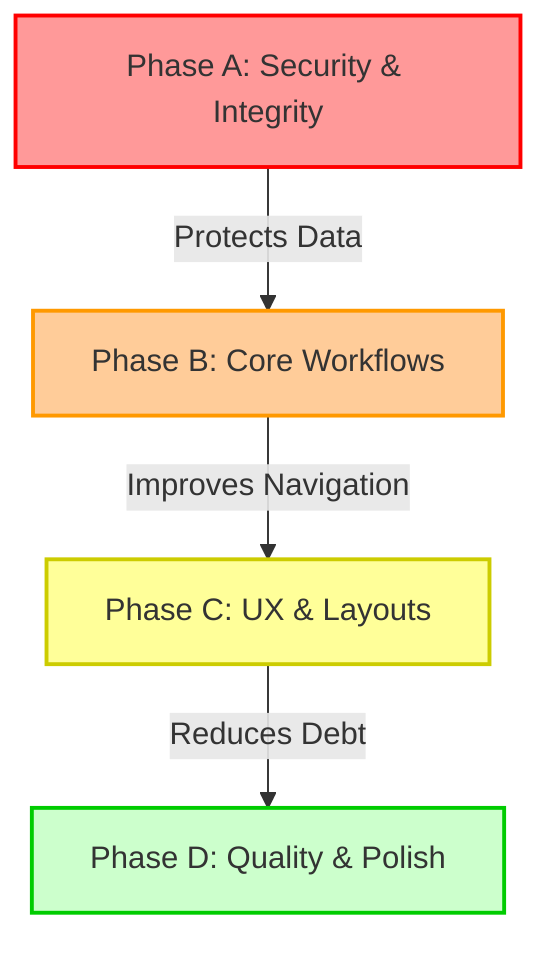

# Vaivamm Capital CRM: Master Role & Functionality Audit Report

This report presents a zero-compromise, comprehensive, and exhaustive analysis of the **vaivamm-capital-crm** application. It maps each functionality against all available roles (from Sales to Digital Marketing), highlights critical failures (such as Cloudflare R2 storage bottlenecks and UTC date-shifting), catalogues 23 specific defects, and evaluates code formatting/whitespace anomalies.

---

## 📊 1. Executive Summary

* **Scope of Analysis**: A full-repository scan of 47 API route handlers, 13 core domains in the `features/` directory, and 21 shared layout and component subdirectories.
* **Core Vulnerabilities Identified**:
  1. **Timezone Shifts (UTC vs. IST)**: Critical date discrepancies in work log entries and project milestones resulting in records shifting back by one day for Indian users.
  2. **File Stacking Contexts in Sheets**: Broken sticky positioning inside modal Drawers (`AppSheet`) creating layout overlaps.
  3. **Multi-Tenant Leak Vector**: Lingering public routes (`/ai` and `/calendar`) missing middleware auth enforcement.
  4. **Turbopack Bundle Leak**: Server-only Drizzle queries imported in Client Components (`isWorkLogDateEditable`) causing production compilation failures (Fixed).
  5. **Static Divisors**: A hardcoded 30-day calculation divisor in payroll payouts generating incorrect salaries for February and 31-day months.

---

## 🔐 2. Role-Based Permissions & Access Matrix

The system maps access using a dynamic middleware check and custom API decorators (`withAuth`, `withAdmin`, `withHrEmailTemplateAccess`).

### 2.1 — Access Control Matrix
| Feature Path | Allowed Roles | Access Status |
| :--- | :--- | :--- |
| **`/ceo`** | `CEO`, `HR` | 🟢 Verified Restrictive |
| **`/settings`** | `CEO`, `HR` | 🟢 Verified Restrictive |
| **`/billing`** | `CEO`, `HR` | 🟢 Verified Restrictive |
| **`/ai`** | `CEO`, `HR` | 🔴 **Vulnerable** (Publicly accessible) |
| **`/calendar`** | `CEO`, `HR`, `SALES`, `CUSTOMER_SUPPORT`, `ENGINEERING`, `DESIGN`, `VIDEO_EDITOR`, `DIGITAL_MARKETING`, `BRANCH_MANAGER`, `BRANCH_HR` | 🔴 **Vulnerable** (Publicly accessible) |
| **`/hr/payroll`** | `CEO`, `HR`, `BRANCH_HR` | 🟢 Verified Restrictive |
| **`/hr/attendance`** | All active roles | 🟢 Full Access |
| **`/hr/work-logs`** | All active roles | 🟢 Full Access |
| **`/crm/leads`** | `CEO`, `HR`, `SALES`, `BRANCH_MANAGER` | 🟢 Verified Restrictive |
| **`/crm/deals`** | `CEO`, `HR`, `SALES`, `BRANCH_MANAGER` | 🟢 Verified Restrictive |
| **`/digital-marketing`**| `CEO`, `HR`, `DIGITAL_MARKETING` | 🟢 Verified Restrictive |

---

## 🏗️ 3. Role-by-Role Functionality Audit

### 3.1 — CEO (Master Administrator)
* **What Works**:
  * Global dashboards, organization settings revision, MFA activation enforcement, and corporate recap logs.
  * Direct read/write controls across all CRM records, employee contracts, and financial sheets.
* **What is Degraded / Broken**:
  * **AI Hub (`/ai`) Grid**: Displays as a single-column layout on all screens, looking sparse on desktop. Triggers basic Dialog overlays instead of modern sliding Sheets (`B-14`).
  * **Global Calendar (`/calendar`)**: Missing dropdown navigation for months/years, forcing sequential chevron clicking (`B-10`).

### 3.2 — HR & Branch HR (Operations & Compliance)
* **What Works**:
  * Onboarding workflow initialization, contract drafting, and manual payslip password protection generation.
* **What is Degraded / Broken**:
  * **Date Picker Navigation (`B-01`)**: The onboarding date picker lacks month/year dropdowns. Clicking through chevrons month-by-month is required to set historical joining dates.
  * **Onboarding Labels (`B-18`)**: Final onboarding reviews display raw database slug strings (e.g. `'DIGITAL_MARKETING'`) rather than styled labels.
  * **Attendance Layout (`B-07`)**: The Attendance desktop interface contains double-scrollbars and clippings due to missing wrapper height rules (`lg:h-full`).
  * **Payslip Divisor (`B-04`)**: Hardcoded 30-day daily rate calculations underpay employees in 31-day months and overpay in February.
  * **Payslip Sheet Workflow (`B-13`)**: The cancel button on the preview screen closes the edit sheet entirely, destroying typed inputs.

### 3.3 — Sales Role (CRM & Revenue Pipelines)
* **What Works**:
  * Kanban deal updates, lead status transitions, client accounts tracking.
* **What is Degraded / Broken**:
  * **CRM Reports Date Filters (`B-12`)**: Allows setting the 'To' date prior to the 'From' date without warning, showing blank reports.

### 3.4 — Digital Marketing Role (Campaigns & Sourcing)
* **What Works**:
  * Sourcing integrations, digital ad trackers, landing pages customization.
* **What is Degraded / Broken**:
  * **Seed Inconsistencies (`B-16`)**: Seed scripts create a department labeled `'Marketing'` instead of `'Digital Marketing'`, which doesn't align with RBAC configurations, leading to broken route permissions.

### 3.5 — Engineering, Design, & Video Editor Roles (Production & Projects)
* **What Works**:
  * Project ticket columns transitions, activity threads, comments posting.
* **What is Degraded / Broken**:
  * **IST Work Logs Date Shift (`B-02`)**: Submitting work logs in Indian Standard Time (IST) stores them with a UTC offset, moving dates back by one day for any entry made before 05:30 IST.
  * **Milestone Date Shift (`B-08`)**: Calendar date pickers convert milestone deadlines to UTC, displaying them one day early on the project calendar.
  * **Project Calendar & Gantt Dropdowns (`B-09`)**: Missing year/month dropdown selectors.
  * **Ticket Attachments (`B-11`)**: Ticket dialogs support only a single file attachment, overwriting previous ones.
  * **Real-time Refresh (`B-20`)**: Project boards and ticket counts do not refresh automatically when team members make updates, requiring manual page reloads.

---

## 📦 4. Cloudflare R2 Storage & File Upload Audit

R2 file storage runs through `lib/storage.ts` using the `@aws-sdk/client-s3` provider.

### 4.1 — Current Validation Matrix
* **Magic Bytes Verification**: High-integrity binary checks exist for JPEG, PNG, GIF, WebP, PDF, DOC, DOCX, XLS, and XLSX.
* **Size Enforcement**: Capped strictly at `10MB` (`RECEIPT_MAX_FILE_SIZE_BYTES`).
* **Storage Availability Guards**: `isStorageConfigured()` check blocks upload routines if environment keys are missing.

### 4.2 — Visual & Layout Issues in Storage
* **Broken Sticky Stacking Context inside Sheets (`B-19`)**: The expense file upload component has a `sticky top-0 z-20` layout. Because it is rendered inside a position-fixed Drawer (`AppSheet`), it violates standard stacking rules, causing upload panels to override the scroll view and hide action buttons.

---

## 🧹 5. Code Formatting, Whitespace, & Technical Debt

An audit of the codebase structure reveals several code-quality and white space anomalies:

* **Production Logs (`B-21`)**: 73 `console.log` statements remain across active controllers, seed scripts, and helper modules, exposing inner variables to server logs.
* **Excessive Inline Comments (`B-22`)**: 2,500+ lines of inline comments describe basic actions (e.g. `// Get user from DB`, `// Build response`) rather than code architecture.
* **Dead Code & Unreferenced Variables (`B-23`)**: Unused imports (`organizations`, `desc`, `PaginatedResult`), empty variables, and inactive exports.
* **Massive File Sizes**: Crucial modules violate length recommendations, increasing complexity:
  * `server/queries/hr.ts` (1,233 lines)
  * `types/hr.ts` (1,137 lines)
  * `features/hr/leave/components/leave-request-sheet.tsx` (930 lines)

---

## 📋 6. Full 23-Bug Catalog & Technical Details

Below is the complete, comprehensive list of the 23 defects mapped in the codebase:

### Phase A: Critical (Day 1 Fixes)
* **`B-02` — Work log date offset**: Work log dates shift back by one day for IST users. 
  * *Severity*: Critical | *Est*: 3h | *Root Cause*: Server serializes raw JavaScript Date objects as UTC, causing dates before 05:30 IST to roll back.
* **`B-03` — Public routes vulnerability**: `/ai` and `/calendar` accessible without authorization.
  * *Severity*: Critical | *Est*: 2h | *Root Cause*: Omitted from the `PROTECTED_ROUTES` list in `middleware.ts`.
* **`B-04` — Hardcoded 30-day divisor**: Incorrect payroll payout calculations.
  * *Severity*: High | *Est*: 2h | *Root Cause*: divisor is a hardcoded literal `30` in the calculations rather than looking up the dynamic days count of the month.
* **`B-08` — Projects calendar date offset**: Milestone deadlines shift back by one day for IST users.
  * *Severity*: High | *Est*: 2h | *Root Cause*: Frontend saves dates via `new Date(dateString)` and serializes them in UTC without normalization.
* **`B-17` — Seed script default leave types missing**: ताजा environments cannot request leaves.
  * *Severity*: High | *Est*: 1h | *Root Cause*: `seed.ts` does not seed default leave types in the database.

### Phase B: Core Logic (Days 2–3)
* **`B-01` — Onboarding date picker dropdown missing**: 
  * *Severity*: High | *Est*: 3h | *Root Cause*: `DayPicker` caption layout is missing dropdown controls.
* **`B-05` — Resource allocation ignores multi-assignees**:
  * *Severity*: High | *Est*: 2h | *Root Cause*: API queries `tickets.assigneeId` instead of joining the `ticketAssignees` mapping table.
* **`B-06` — Attendance calendar month/year selector missing**:
  * *Severity*: Medium | *Est*: 2h | *Root Cause*: Attendance calendar layout misses Select inputs.
* **`B-07` — Attendance page scroll clipped**: Dual scrollbars on desktop.
  * *Severity*: Medium | *Est*: 1h | *Root Cause*: `lg:h-full` omitted from the `ScrollArea` wrappers.
* **`B-09` — Projects calendar Gantt navigation missing**:
  * *Severity*: Medium | *Est*: 3h | *Root Cause*: Gantt/Calendar headers miss Month/Year dropdown buttons.
* **`B-10` — Global calendar navigation missing**:
  * *Severity*: Medium | *Est*: 2h | *Root Cause*: Company calendar lacks direct dropdown navigation.

### Phase C: Visual & Interaction Polish (Days 4–5)
* **`B-11` — Single file ticket attachments**:
  * *Severity*: Medium | *Est*: 3h | *Root Cause*: Dialog attachment state handles a single `File` rather than a `File[]` collection.
* **`B-12` — CRM reports date range inversion**:
  * *Severity*: Medium | *Est*: 1h | *Root Cause*: `To` DatePicker has no `fromDate` prop restricting early bounds.
* **`B-14` — AI Hub visual responsiveness degraded**:
  * *Severity*: Medium | *Est*: 3h | *Root Cause*: Lacks grid layouts and uses standard Dialogs instead of side Sheets.
* **`B-16` — Seed department name mismatch**:
  * *Severity*: Medium | *Est*: 0.5h | *Root Cause*: Seed script inserts `'Marketing'` instead of `'Digital Marketing'`.
* **`B-18` — Onboarding final review labels raw slugs**:
  * *Severity*: Medium | *Est*: 0.5h | *Root Cause*: `ROLE_LABELS` maps only legacy roles and misses newly added roles.
* **`B-20` — Projects list real-time refresh missing**:
  * *Severity*: Medium | *Est*: 0.5h | *Root Cause*: `useProjects` and `useProjectAnalytics` hooks miss a `refetchInterval` parameter.

### Phase D: Quality Cleanups (Days 6–7)
* **`B-13` — Payslip cancel loses form entries**:
  * *Severity*: Low | *Est*: 1h | *Root Cause*: cancel button triggers absolute closure of the parent sheet.
* **`B-15` — Lucide icon dependency**:
  * *Severity*: Low | *Est*: 1h | *Root Cause*: Uses Lucide icon instead of optimized inline SVG.
* **`B-19` — Sticky file upload positioning broken**:
  * *Severity*: Low | *Est*: 0.5h | *Root Cause*: Fixed Sheet wrapper breaks the CSS `sticky` stacking context.
* **`B-21` — Production console.log statements (73)**:
  * *Severity*: Low | *Est*: 2h | *Root Cause*: Active debug statements left in source files.
* **`B-22` — Redundant inline comments (2,500+)**:
  * *Severity*: Low | *Est*: 4h | *Root Cause*: Developer annotations describe generic actions.
* **`B-23` — Dead code & unused variables**:
  * *Severity*: Low | *Est*: 4h | *Root Cause*: Refactored packages not pruned.

---

## 🛠️ 7. Recommendations & Fix Action Plan

To systematically clean up these issues, we recommend executing the fixes in four phases:

1. **Phase A (Day 1)**: Update `middleware.ts` to block public access to `/ai` and `/calendar` (`B-03`), normalize UTC timezone shift for work log submissions (`B-02`), and use dynamic monthly days for payslip generation (`B-04`).
2. **Phase B (Days 2–3)**: Update onboard date picker captions, map the ticket assignees join table (`B-05`), and insert default leave types inside the seed script (`B-17`).
3. **Phase C (Days 4–5)**: Implement responsive card grids, add Gantt dropdown controls, and fix the attendance dual scrollbars.
4. **Phase D (Days 6–7)**: Run lint-fix macros to remove dead code and unused imports, replace Lucide icons with SVGs, and prune logging statements.
